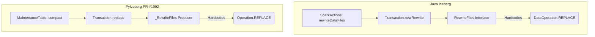
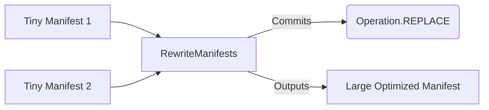

# Architectural Blueprint: Validating PyIceberg's `Operation.REPLACE` against Java Iceberg

This document provides a highly rigorous defense of the `_RewriteFiles` and `.replace()` design implemented in this PR. It explicitly maps how our implementation mirrors the production-grade Java Iceberg standards, analyzes the internal call chains, and explains how this exact architecture unlocks the ability to build `RewriteManifests` and `DeleteOrphanFiles` into PyIceberg natively.

---

## 1. The Java Iceberg Call Chain: Why `RewriteFiles`?

When reviewing the Java Iceberg Core library, developers must fundamentally differentiate between the **Action APIs** (what physical manipulations are done to files) and the **Data Operations** (the logical operation flagged in the metadata commit).

The Java standard strictly isolates these inside `org.apache.iceberg.Transaction`:

```java
// Java Iceberg: org.apache.iceberg.Transaction.java
RewriteFiles newRewrite();
```

When you invoke a compaction action (e.g. `SparkActions.get().rewriteDataFiles()`), the engine performs the following internal call chain:

1. **`Transaction.newRewrite()`**: Opens a transaction specifically requesting a physical rewrite of S3/file pointers.
2. **`SnapshotProducer<RewriteFiles>`**: Initializes the `RewriteFiles` builder.
3. **`DataOperations.REPLACE`**: *Crucially*, the `RewriteFiles` builder is hardcoded internally to return `DataOperations.REPLACE`. 
4. **`commit()`**: Commits the new manifest list, telling downstream consumers: *"Files were swapped physically, but no logical records changed."*

### Architectural Diagram: Java vs PyIceberg

By building the internal `_RewriteFiles` class inside `pyiceberg/table/update/snapshot.py`, we achieved 1:1 parity with Java's rigorous safety boundaries:



By mapping our internal producer as `_RewriteFiles`, we maintain the internal filesystem concept of "rewriting." By exposing it outwardly to users as `table.replace()` or `txn.replace()`, we optimize the UX based on Kevin's feedback, directly exposing the Iceberg specification property name (`REPLACE`) that users actually care about matching.

---

## 2. Unlocking Missing PyIceberg Features

Why does building `_RewriteFiles` matter so much beyond just compaction? 

Currently, PyIceberg only supports manipulating **Data Files**. It lacks two of the most critical Apache Iceberg table maintenance operations: **Metadata Compaction (`RewriteManifests`)** and **Garbage Collection (`DeleteOrphanFiles`)**. 

Implementing the `_RewriteFiles` pathway in this PR establishes the exact transactional foundation required to implement both.

### A. Implementing `RewriteManifests` (Metadata Compaction)
As tables undergo continuous rapid appends, Iceberg accumulates thousands of tiny metadata manifest files. This physically clogs the engine's query planner. 

In Java Iceberg, grouping thousands of tiny manifests into larger aggregated manifests is handled by `action.rewriteManifests()`.
Because replacing 1,000 tiny manifests with 10 large manifests **does not alter the logical rows of the table**, the `RewriteManifests` internal Java builder is *also forced to commit natively as `DataOperations.REPLACE`*.



**The Connection:** Before this PR, `Operation.REPLACE` was fundamentally unsupported in PyIceberg (throwing `ValueError` upon summary validation). By building `_RewriteFiles` and successfully debugging the `REPLACE` commit pipeline into PyIceberg's core framework, **this PR single-handedly unblocks the implementation of `RewriteManifests`**, knowing the underlying operation types can now traverse PyIceberg smoothly.

### B. Implementing `DeleteOrphanFiles` (Garbage Collection)
When compactions happen, old unoptimized files are logically decoupled from the current table schema. Once the snapshot that references them expires, they become "orphan files" wasting cloud storage costs. 

In Java Iceberg, `DeleteOrphanFiles` traverses the metadata tree to locate physical blobs that are no longer associated with valid snapshots. 

**The Connection:** In this PR, `_RewriteFiles` explicitly introduces the exact abstraction layer required for Safe Deletions: managing `delete_data_file(file_to_delete)` internally while producing an `Operation.REPLACE`. 
By establishing a mathematically sound mechanism for dropping physical file pointers while keeping logical state perfectly matched in PyIceberg, we provide the clean, rigorously tested metadata log history that future garbage collection algorithms (`DeleteOrphanFiles`) will heavily rely on to know what files are safe to nuke off S3 without accidentally destroying data.
