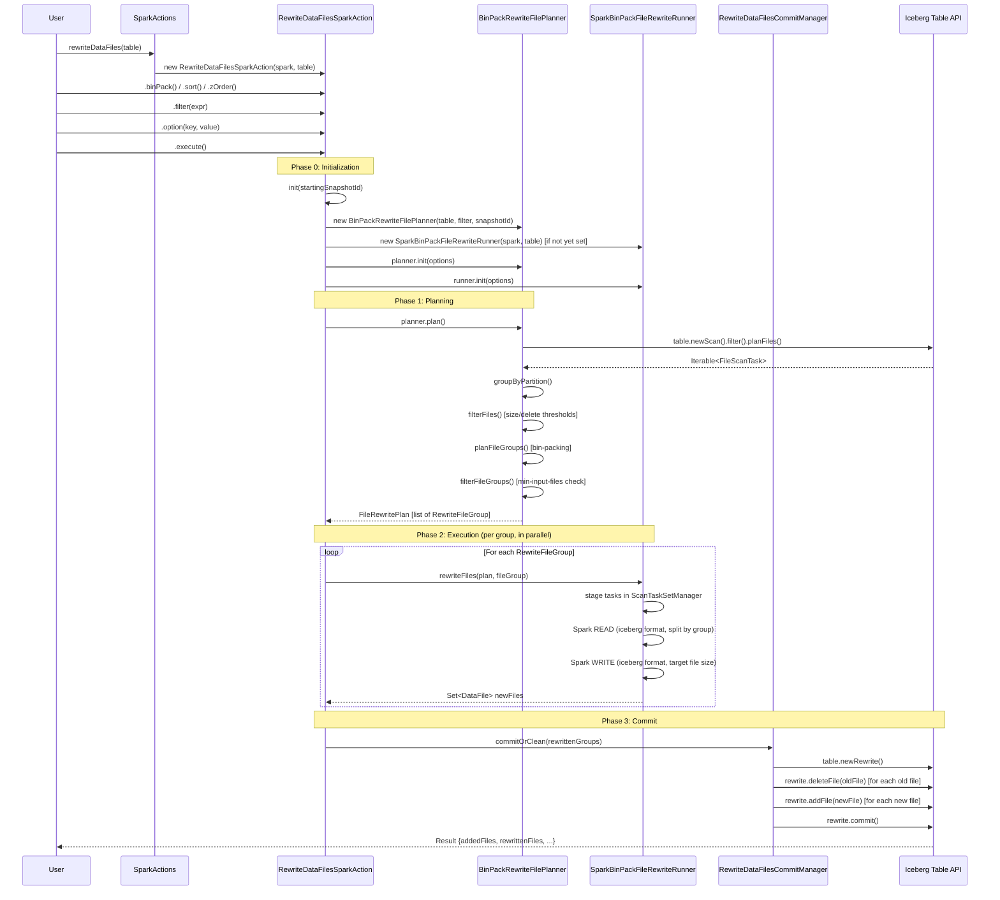
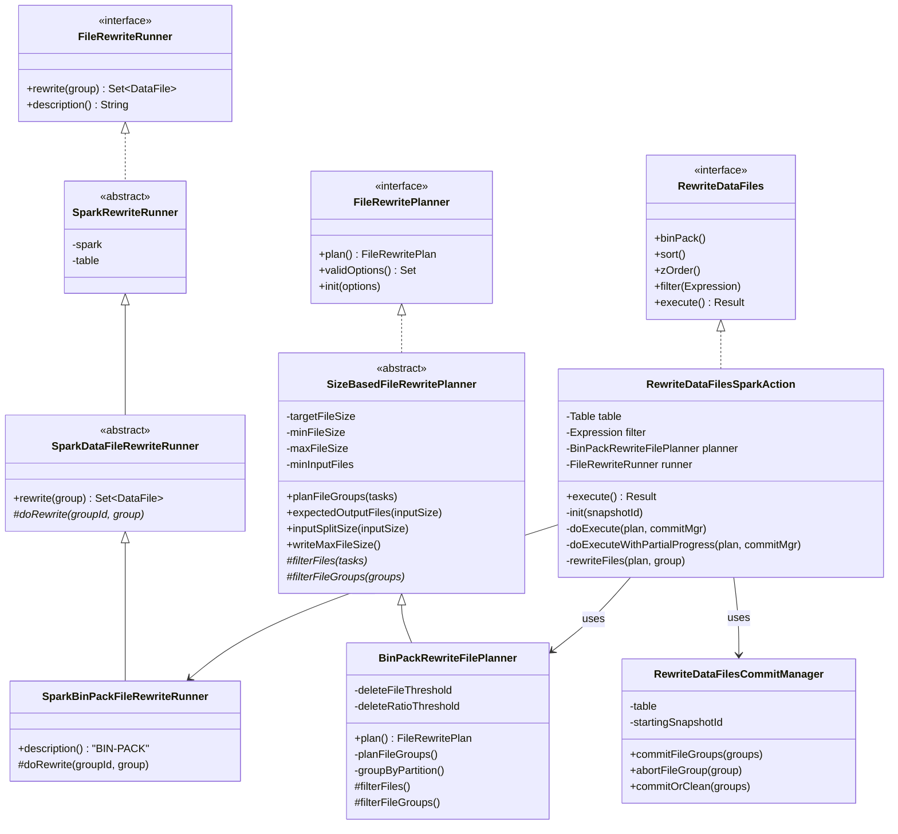
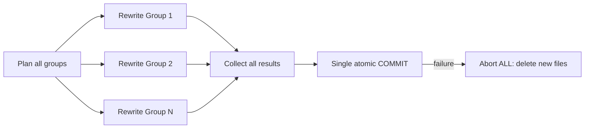
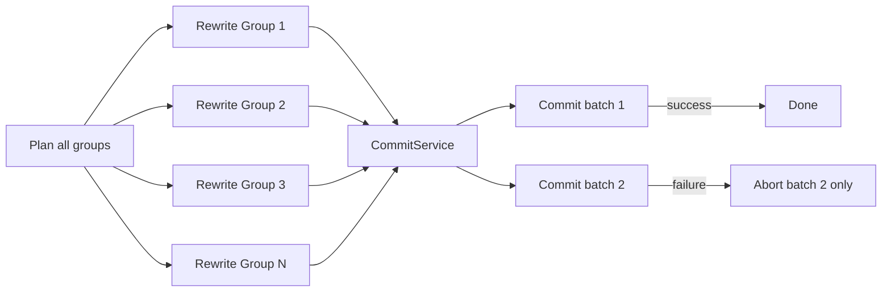

# Rewrite Data Files: Rigorous Derivation

## 1. How a User Calls It

```java
// Spark SQL (simplest)
CALL catalog.system.rewrite_data_files('db.my_table');

// Java API
SparkActions.get(spark)
    .rewriteDataFiles(table)
    .filter(Expressions.equal("date", "2024-01-01"))  // optional
    .binPack()                // or .sort() or .zOrder("col1", "col2")
    .option("target-file-size-bytes", "536870912")     // optional, 512MB
    .execute();
```

---

## 2. Full Call Chain (What Fires When)



---

## 3. Class Hierarchy



---

## 4. Phase-by-Phase Pseudocode

### Phase 0: Initialization

```python
def execute(self):
    # Precondition: table has at least one snapshot
    if table.current_snapshot is None:
        return EMPTY_RESULT

    starting_snapshot_id = table.snapshot(branch).snapshot_id

    # Choose planner based on runner type
    if runner is ShufflingRunner:
        planner = ShufflingDataRewritePlanner(table, filter, snapshot_id)
    else:
        planner = BinPackRewriteFilePlanner(table, filter, snapshot_id)
    
    # Default to BinPack if user didn't choose a strategy
    if runner is None:
        runner = BinPackFileRewriteRunner(table)

    # Parse and validate all options
    planner.init(options)   # sets target_file_size, min/max thresholds, etc.
    runner.init(options)    # runner-specific options
    validate_options()      # check for invalid option keys
```

### Phase 1: Planning (File Selection + Bin-Packing)

This is the core logic you'll need to replicate in pyiceberg.

```python
def plan(self) -> FileRewritePlan:
    # Step 1: Scan the table for all data files matching the filter
    scan = table.new_scan()
        .filter(self.filter)
        .use_snapshot(self.snapshot_id)
        .ignore_residuals()
    
    file_scan_tasks = scan.plan_files()
    # Each FileScanTask has: file path, file size, partition, delete files

    # Step 2: Group files by partition
    files_by_partition: Dict[StructLike, List[FileScanTask]] = {}
    for task in file_scan_tasks:
        partition = task.file.partition
        files_by_partition.setdefault(partition, []).append(task)
    
    # Step 3: For each partition, select + group files
    all_groups = []
    for partition, tasks in files_by_partition.items():
        
        # Step 3a: FILTER — select files that need rewriting
        filtered = [t for t in tasks if should_rewrite(t)]
        
        # Step 3b: BIN-PACK — group selected files into groups
        #   Each group ≤ max_group_size (default 100GB)
        groups = bin_pack(filtered, max_bin_size=max_group_size)
        
        # Step 3c: FILTER GROUPS — drop groups that are too small
        valid_groups = [g for g in groups if should_rewrite_group(g)]
        
        all_groups.extend(valid_groups)
    
    return FileRewritePlan(groups=all_groups)


def should_rewrite(task: FileScanTask) -> bool:
    """A file is selected for rewriting if ANY of these is true."""
    file_size = task.file.file_size_in_bytes
    
    return (
        file_size < min_file_size          # too small (default: 75% of target)
        or file_size > max_file_size       # too large (default: 180% of target)
        or too_many_deletes(task)          # delete file count ≥ threshold
        or too_high_delete_ratio(task)     # deleted_rows / total_rows ≥ 0.3
    )


def should_rewrite_group(group: List[FileScanTask]) -> bool:
    """A group is kept for rewriting if ANY of these is true."""
    return (
        len(group) >= min_input_files      # enough files (default: 5)
        or total_size(group) > target_size # enough data to make a full file
        or total_size(group) > max_size    # too much data in one file
        or any(too_many_deletes(t) for t in group)
        or any(too_high_delete_ratio(t) for t in group)
    )
```

#### Bin-Packing Algorithm Detail

```python
def bin_pack(items, max_bin_size) -> List[List[item]]:
    """
    First-Fit Decreasing bin packing.
    
    1. Sort items by size descending
    2. For each item, try to fit in existing bin
    3. If no bin fits, create new bin
    
    Result: groups where sum(file_sizes) ≤ max_bin_size
    """
    bins = []
    for item in sorted(items, key=lambda t: t.length, reverse=True):
        placed = False
        for bin in bins:
            if sum(t.length for t in bin) + item.length <= max_bin_size:
                bin.append(item)
                placed = True
                break
        if not placed:
            bins.append([item])
    return bins
```

#### Output File Count Calculation

```python
def expected_output_files(input_size: int) -> int:
    """How many output files should a group produce?"""
    if input_size < target_file_size:
        return 1
    
    with_remainder = ceil(input_size / target_file_size)      # e.g., 11 for 10.1 GB
    without_remainder = floor(input_size / target_file_size)  # e.g., 10 for 10.1 GB
    avg_without = input_size / without_remainder              # e.g., 1.01 GB
    
    remainder = input_size % target_file_size
    
    if remainder > min_file_size:
        # Remainder is big enough to be a valid file → keep it
        return with_remainder    # 11 files
    elif avg_without < min(1.1 * target_file_size, write_max_file_size):
        # Distributing the remainder is OK (each file is ≤ 10% bigger)
        return without_remainder # 10 files
    else:
        # Can't distribute safely → keep the remainder file
        return with_remainder    # 11 files
```

### Phase 2: Execution (Per File Group)

```python
def rewrite_files(plan, file_group) -> RewriteFileGroup:
    """
    Read all files in this group and write them back as new, optimized files.
    """
    group_id = uuid4()
    
    # ------ Spark-specific (you replace this with PyArrow/DuckDB) ------
    
    # 1. Stage the tasks so Spark can find them
    task_set_manager.stage_tasks(table, group_id, file_group.tasks)
    
    # 2. Read: Spark reads the staged files, splitting them
    df = spark.read
        .format("iceberg")
        .option("scan-task-set-id", group_id)
        .option("split-size", file_group.input_split_size)
        .option("file-open-cost", "0")
        .load(group_id)
    
    # 3. Write: Spark writes the data back as new Parquet files
    df.write
        .format("iceberg")
        .option("rewritten-file-scan-task-set-id", group_id)
        .option("target-file-size-bytes", file_group.max_output_file_size)
        .option("distribution-mode", distribution_mode)
        .mode("append")
        .save(group_id)
    
    # 4. Collect newly written files
    new_files = coordinator.fetch_new_files(table, group_id)
    
    # ------ End Spark-specific ------
    
    file_group.set_output_files(new_files)
    return file_group


# ---- pyiceberg equivalent would be: ----
def rewrite_files_pyiceberg(table, file_group):
    """
    PyArrow-based equivalent.
    """
    import pyarrow.parquet as pq
    
    # 1. Read all source files into an Arrow table
    arrow_tables = []
    for task in file_group.tasks:
        arrow_tables.append(pq.read_table(task.file.file_path))
    combined = pa.concat_tables(arrow_tables)
    
    # 2. Split into target-sized chunks and write new Parquet files
    new_files = []
    for chunk in split_by_target_size(combined, target_file_size):
        path = generate_new_file_path(table)
        pq.write_table(chunk, path)
        new_files.append(DataFile(path=path, ...))
    
    return new_files
```

### Phase 3: Commit (Atomic Metadata Swap)

```python
def commit_file_groups(rewritten_groups):
    """
    Atomically replace old files with new files in the Iceberg metadata.
    
    This creates a new snapshot where:
    - Old (rewritten) data files are removed
    - New (optimized) data files are added
    - Dangling delete files are cleaned up
    """
    old_files = set()
    new_files = set()
    dangling_dvs = set()
    
    for group in rewritten_groups:
        old_files.update(group.rewritten_files())
        new_files.update(group.added_files())
        dangling_dvs.update(group.dangling_dvs())
    
    # Use the Iceberg RewriteFiles API
    rewrite = table.new_rewrite()
    rewrite.validate_from_snapshot(starting_snapshot_id)
    
    if use_starting_sequence_number:
        seq_num = table.snapshot(starting_snapshot_id).sequence_number
        rewrite.data_sequence_number(seq_num)
    
    for f in old_files:
        rewrite.delete_file(f)      # mark old file for removal
    
    for f in new_files:
        rewrite.add_file(f)         # mark new file for addition
    
    for f in dangling_dvs:
        rewrite.delete_file(f)      # clean up dangling deletion vectors
    
    rewrite.commit()  # single atomic commit → new snapshot
```

---

## 5. Execution Modes

````carousel
### Mode A: All-or-Nothing (default)

```
partial-progress.enabled = false
```



All groups are rewritten in parallel, then committed in a single transaction. If ANY group fails during rewrite or the commit fails, ALL new files are cleaned up.

<!-- slide -->

### Mode B: Partial Progress

```
partial-progress.enabled = true
partial-progress.max-commits = 10
```



Groups are committed in batches as they complete. Failed batches are cleaned up independently. Successful batches persist.
````

---

## 6. Key Configuration Parameters

| Parameter | Default | Description |
|---|---|---|
| `target-file-size-bytes` | Table property `write.target-file-size-bytes` (default 512MB) | Target size for output files |
| `min-file-size-bytes` | 75% of target | Files smaller than this → rewrite candidate |
| `max-file-size-bytes` | 180% of target | Files larger than this → rewrite candidate |
| `min-input-files` | 5 | Min files in a group to trigger rewrite |
| `max-file-group-size-bytes` | 100 GB | Max data per group (bin-pack limit) |
| `max-concurrent-file-group-rewrites` | 5 | Parallelism of rewrite jobs |
| `partial-progress.enabled` | false | Enable incremental commits |
| `partial-progress.max-commits` | 10 | Max number of partial commits |
| `delete-file-threshold` | MAX_INT (disabled) | Files with ≥ N deletes → force rewrite |
| `delete-ratio-threshold` | 0.3 | Files with ≥ 30% deleted rows → force rewrite |
| `rewrite-all` | false | Skip filters, rewrite everything |

---

## 7. Files Reference

| Role | File | Location |
|---|---|---|
| User API | [RewriteDataFiles.java](file:///Users/jaredyu/Desktop/open_source/iceberg/api/src/main/java/org/apache/iceberg/actions/RewriteDataFiles.java) | `api/` |
| Entry point | [SparkActions.java](file:///Users/jaredyu/Desktop/open_source/iceberg/spark/v3.5/spark/src/main/java/org/apache/iceberg/spark/actions/SparkActions.java) | `spark/` |
| Orchestrator | [RewriteDataFilesSparkAction.java](file:///Users/jaredyu/Desktop/open_source/iceberg/spark/v3.5/spark/src/main/java/org/apache/iceberg/spark/actions/RewriteDataFilesSparkAction.java) | `spark/` |
| Base planner | [SizeBasedFileRewritePlanner.java](file:///Users/jaredyu/Desktop/open_source/iceberg/core/src/main/java/org/apache/iceberg/actions/SizeBasedFileRewritePlanner.java) | `core/` |
| BinPack planner | [BinPackRewriteFilePlanner.java](file:///Users/jaredyu/Desktop/open_source/iceberg/core/src/main/java/org/apache/iceberg/actions/BinPackRewriteFilePlanner.java) | `core/` |
| Runner base | [SparkRewriteRunner.java](file:///Users/jaredyu/Desktop/open_source/iceberg/spark/v3.5/spark/src/main/java/org/apache/iceberg/spark/actions/SparkRewriteRunner.java) | `spark/` |
| Data runner | [SparkDataFileRewriteRunner.java](file:///Users/jaredyu/Desktop/open_source/iceberg/spark/v3.5/spark/src/main/java/org/apache/iceberg/spark/actions/SparkDataFileRewriteRunner.java) | `spark/` |
| BinPack runner | [SparkBinPackFileRewriteRunner.java](file:///Users/jaredyu/Desktop/open_source/iceberg/spark/v3.5/spark/src/main/java/org/apache/iceberg/spark/actions/SparkBinPackFileRewriteRunner.java) | `spark/` |
| Commit manager | [RewriteDataFilesCommitManager.java](file:///Users/jaredyu/Desktop/open_source/iceberg/core/src/main/java/org/apache/iceberg/actions/RewriteDataFilesCommitManager.java) | `core/` |

---

## 8. Mapping to pyiceberg

The existing `pyiceberg` already has `MaintenanceTable` in [maintenance.py](file:///Users/jaredyu/Desktop/open_source/iceberg-python/pyiceberg/table/maintenance.py). A `rewrite_data_files` operation would fit in as:

```python
# User-facing API
table = catalog.load_table("db.my_table")
result = table.maintenance.rewrite_data_files(
    strategy="bin-pack",                   # or "sort"
    filter=EqualTo("date", "2024-01-01"),  # optional
    options={
        "target-file-size-bytes": 536_870_912,
    }
)

# Internal mapping to Java concepts:
# MaintenanceTable.rewrite_data_files()  ←→  RewriteDataFilesSparkAction.execute()
#   BinPackPlanner                       ←→  BinPackRewriteFilePlanner.plan()
#   PyArrowRewriteRunner                 ←→  SparkBinPackFileRewriteRunner.doRewrite()
#   table.new_rewrite_files_commit()     ←→  RewriteDataFilesCommitManager.commitFileGroups()
```
