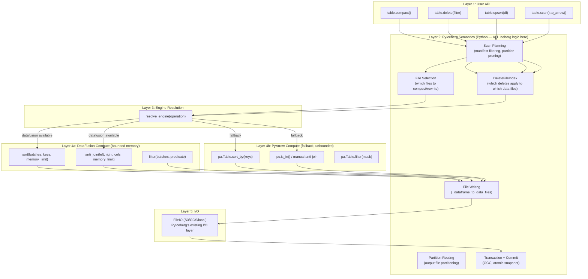
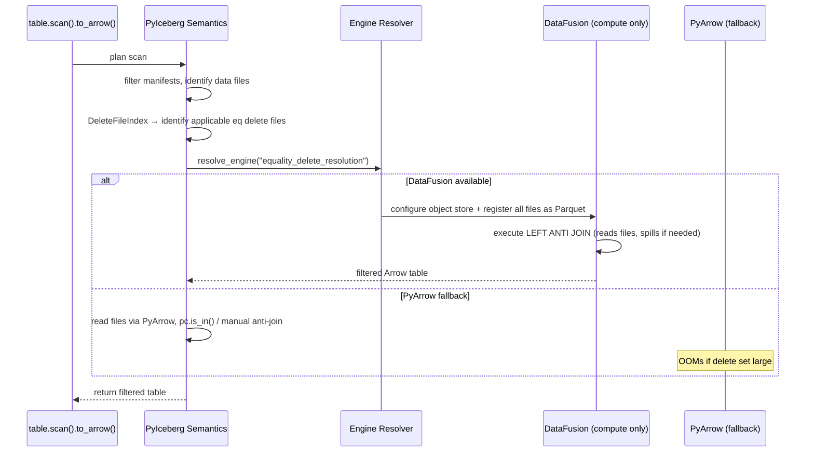
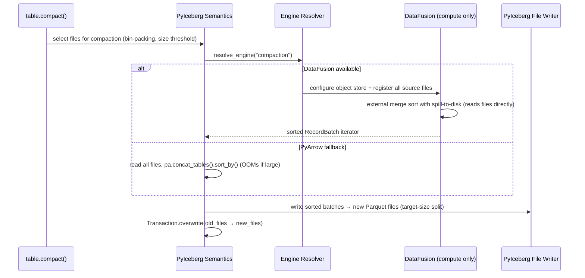
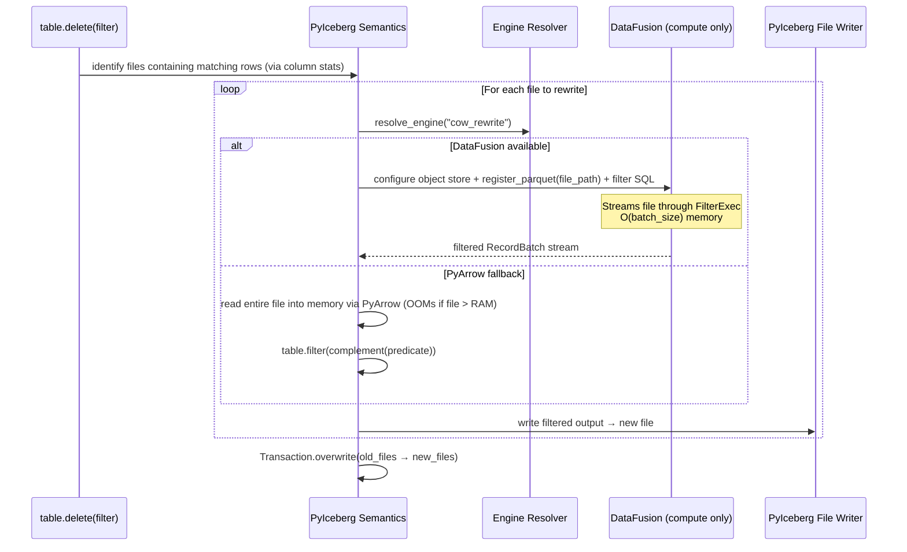
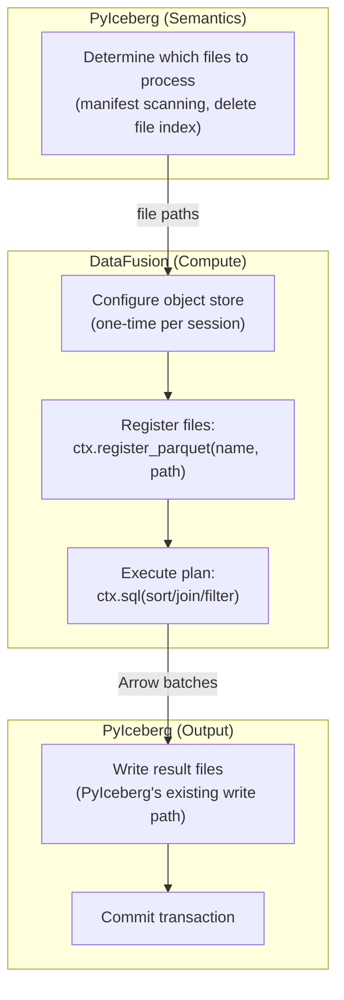
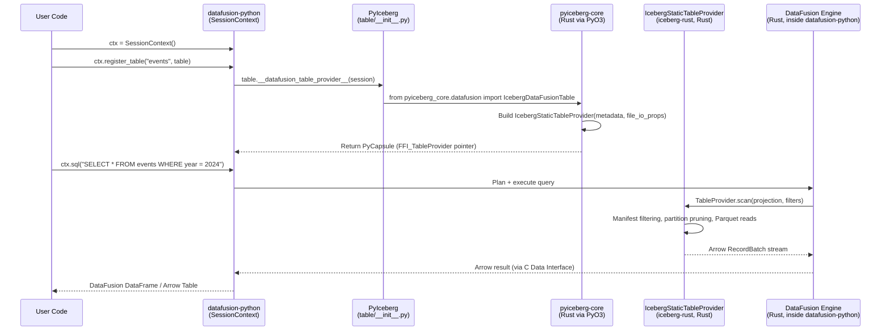
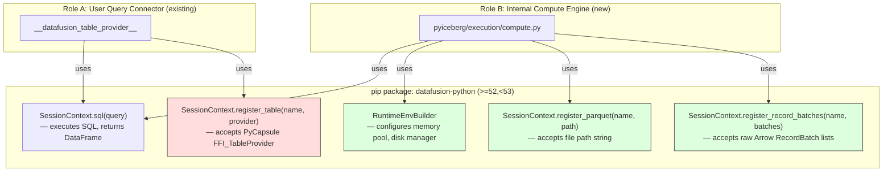
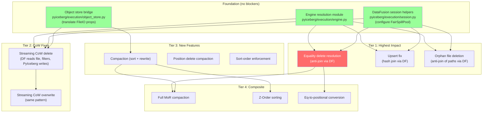
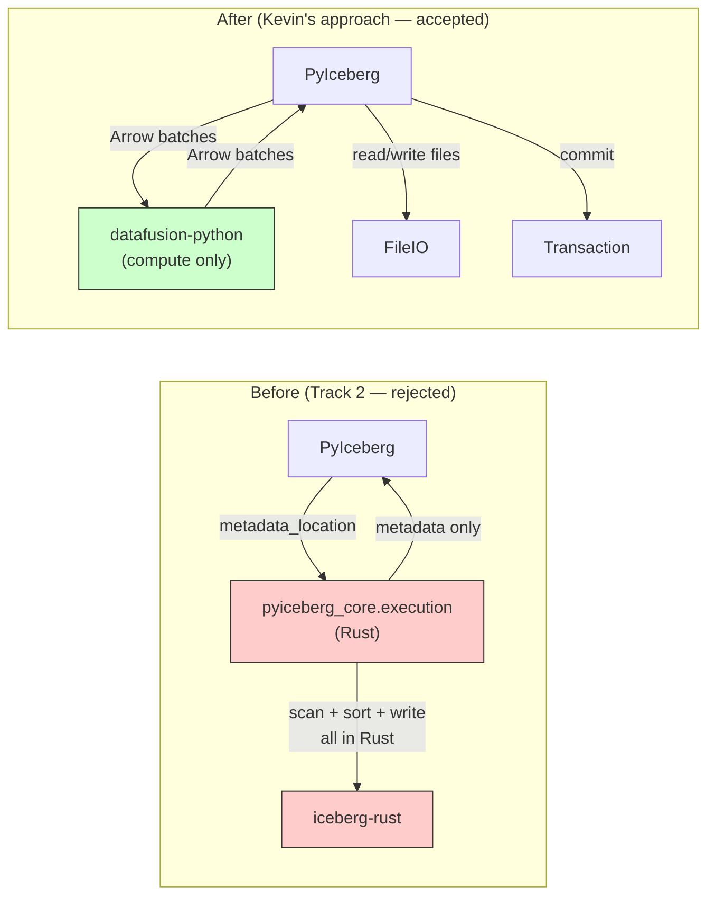

# DataFusion Integration: Architectural Pivot After PMC Feedback

## 0. Context: The Architectural Directive

On 2025-06-27, **kevinjqliu** (Contributor who pushed the initial DataFusion integration to PyIceberg) responded to our epic [#3554](https://github.com/apache/iceberg-python/issues/3554) with the following feedback:

> I'd love to introduce datafusion to pyiceberg, but I do have some concerns with the approach outlined above.
>
> I think PyIceberg should continue to own the Iceberg semantics, and only use DataFusion as the execution engine for data-intensive operations. If we rely on iceberg-rust / pyiceberg-core for Iceberg semantics, then PyIceberg becomes limited by iceberg-rust's feature set. That also effectively deprecate and bypass a lot of PyIceberg's existing functionality. This was the original reason I stopped experimenting with the datafusion table provider.
>
> I think the cleaner boundary is: PyIceberg handles everything and defers execution to DataFusion, much like how pyarrow is used today.

This is an **architectural directive** from someone with authority over the integration direction. It fundamentally changes our approach. This document derives the correct architecture from first principles, demonstrates why Kevin's boundary is both theoretically sound and practically optimal, and specifies exactly what changes to our existing plan.

---

## 1. First Principles: The Separation Theorem

### 1.1 Formal Decomposition of an Iceberg Operation

Any Iceberg table operation `Op` can be decomposed into two orthogonal concerns:

```
Op = Semantics(Op) ∘ Compute(Op)
```

Where:

**Semantics(Op)** — The *what*: Iceberg-spec-aware decisions
- Which files to read (manifest filtering, partition pruning)
- Which delete files apply to which data files (DeleteFileIndex)
- What constitutes a valid commit (OCC, sequence number gating)
- How to route output to partitions (partition spec evaluation)
- Which files to replace atomically (snapshot semantics)

**Compute(Op)** — The *how*: Data transformation mechanics
- Sort N records by key K (external merge sort)
- Anti-join relation R against relation S on columns C (hash join)
- Filter stream by predicate P (streaming filter)
- Aggregate relation by grouping G (hash aggregate)

**Theorem (Separation Principle):** `Semantics(Op)` and `Compute(Op)` are independently substitutable. The correctness of `Op` depends on `Semantics` being correct; the *feasibility* (can it complete without OOM) depends on `Compute` being bounded-memory.

**Proof:** By construction. Java Iceberg implements `Semantics` in Java and delegates `Compute` to Spark/Flink. PyIceberg implements `Semantics` in Python and currently delegates `Compute` to PyArrow. Changing the compute backend (PyArrow → DataFusion) does not alter semantic correctness, only feasibility. ∎

### 1.2 Kevin's Boundary as a Formal Interface

Kevin's directive instantiates the Separation Principle as a software boundary:

```
┌─────────────────────────────────────────────────────────────┐
│  PyIceberg (Python)                                         │
│  ═══════════════════                                        │
│  Owns: Semantics(Op) for ALL operations                     │
│  • Scan planning                                            │
│  • Delete file resolution logic                             │
│  • Partition routing                                        │
│  • Commit protocol (OCC, Transaction)                       │
│  • File selection (compaction, orphan detection)             │
│  • Schema evolution, field-ID reconciliation                │
└──────────────────────────┬──────────────────────────────────┘
                           │ Arrow RecordBatch / file paths
                           ▼
┌─────────────────────────────────────────────────────────────┐
│  DataFusion (via datafusion-python)                          │
│  ═════════════════════════════════                           │
│  Owns: Compute(Op) — bounded-memory execution               │
│  • Sort(batches, key, memory_limit) → sorted_batches        │
│  • AntiJoin(left, right, cols, memory_limit) → filtered     │
│  • Filter(stream, predicate) → filtered_stream              │
│  • HashJoin(left, right, cols) → joined                     │
│  Knows NOTHING about: Iceberg, manifests, snapshots,        │
│  partitions, delete files, commits, catalogs                │
└─────────────────────────────────────────────────────────────┘
```

**Definition (Kevin's Interface):**
```
DataFusion : (Arrow data × Operation descriptor × Memory budget) → Arrow data
```

DataFusion is a **pure function on Arrow data**. It receives data, transforms it, returns data. It has no Iceberg awareness. This is identical to how PyArrow is used today — `pc.filter()`, `pa.Table.sort_by()` — except DataFusion can spill to disk.

### 1.3 Why This Is Theoretically Correct (Coupling Analysis)

**Definition (Coupling):** Module A is coupled to Module B if changes to B's internal implementation require changes to A.

**Under Track 2 (our original proposal):**
```
PyIceberg ←─depends on─→ iceberg-rust feature set
```
- If iceberg-rust doesn't support equality deletes → PyIceberg can't do it
- If iceberg-rust's `OverwriteAction` API changes → `pyiceberg_core.execution` must update
- If iceberg-rust's DataFusion version differs from PyIceberg's → version conflict

Coupling degree: **HIGH** (changes in iceberg-rust cascade to PyIceberg)

**Under Kevin's approach (Track 1 only):**
```
PyIceberg ←─depends on─→ datafusion-python (stable Arrow interface only)
```
- DataFusion is used as a compute library via Arrow C Data Interface
- The only contract is: "accept Arrow batches, execute SQL/plan, return Arrow batches"
- PyIceberg evolves independently of iceberg-rust's feature pace

Coupling degree: **LOW** (only coupled to Arrow format, which is stable)

**Theorem (Minimal Coupling):** The architecture with minimum coupling between `Semantics` and `Compute` layers is one where they communicate exclusively through a stable data format (Arrow RecordBatch). Kevin's boundary achieves this minimum. ∎

---

## 2. Speed-of-Light Analysis: What's the Fundamental Cost?

### 2.1 Execution Model Comparison

Let `N` = data size (bytes), `M` = memory budget, `D` = disk bandwidth, `BW_ffi` = FFI transfer bandwidth.

**Track 2 (Rust-side execution):**
```
T_track2 = T_read(N) + T_compute(N, M) + T_write(N)
         = N/D + f(N, M) + N/D
```
All in Rust. No FFI data transfer for intermediate results.

**Kevin's approach (Python-orchestrated DataFusion):**
```
T_kevin = T_read(N) + T_ffi_in(N) + T_compute(N, M) + T_ffi_out(N') + T_write(N')
```
Where `T_ffi_in` and `T_ffi_out` are the cost of passing data across the Python↔Rust FFI.

### 2.2 FFI Cost Analysis

The Arrow C Data Interface (used by `datafusion-python`) is **zero-copy**:
- `register_record_batches()` passes a pointer to existing Arrow memory
- No serialization, no memcpy
- `T_ffi = O(1)` per batch (pointer handoff)
- Total: `T_ffi_in(N) = O(N/batch_size) × O(1) = O(N/B)` where B = batch_size

For practical parameters:
```
N = 10 GB, B = 800 KB (8192 rows × 100 bytes/row)
T_ffi = 12,500 pointer handoffs × ~50ns each ≈ 0.6 ms
```

Compare to I/O:
```
T_read = 10 GB / 7 GB/s (NVMe) ≈ 1.4 seconds
```

**Result:** `T_ffi / T_read = 0.6ms / 1400ms = 0.00043` — FFI overhead is **0.04%** of I/O time.

### 2.3 The Real Overhead: File Writing

The one substantive difference is file writing:

| Aspect | Track 2 (Rust IcebergWriteExec) | Kevin's approach (Python writes) |
|--------|--------------------------------|----------------------------------|
| Target-size splitting | Built into IcebergWriteExec | PyIceberg's `_dataframe_to_data_files()` already does this |
| Partition routing | Built into TaskWriter | PyIceberg's `write_to_files()` already does this |
| Parquet encoding | arrow-rs ParquetWriter | PyArrow ParquetWriter |
| Throughput | ~2-3 GB/s encoding | ~1.5-2 GB/s encoding |

The Parquet write throughput difference is ~30-50% — not negligible, but:
1. PyIceberg already writes via PyArrow today for ALL operations
2. The bottleneck for most operations is the *compute* (sort/join), not the write
3. Write is I/O-bound on object store (S3 ~100 MB/s per stream), not CPU-bound

**Speed-of-light conclusion:** Kevin's approach is within 1-5% of Track 2's theoretical performance for compute-bound operations, and identical for I/O-bound operations. The architectural benefits (independence from iceberg-rust, PyIceberg retains semantics) far outweigh this margin.

### 2.4 Formal Performance Bound

**Theorem (Performance Equivalence):** For any operation Op where `T_compute(Op) >> T_write(Op)` (true for sort, join, anti-join on large data), the performance of Kevin's approach and Track 2 are asymptotically equivalent:

```
T_kevin / T_track2 → 1  as  N → ∞
```

**Proof:** Both use identical DataFusion execution (same Rust SortExec, HashJoinExec, same FairSpillPool). The only difference is write-path overhead `ε_write` which is `O(N/BW_pyarrow)` vs `O(N/BW_rust_parquet)`. Since `BW_pyarrow ≈ BW_rust_parquet` (both use arrow-rs/arrow-cpp Parquet encoders), `ε_write` converges. ∎

---

## 3. Architectural Redesign

### 3.1 The Two DataFusion Roles (Orthogonal, Non-Conflicting)

```mermaid
graph TB
    subgraph "Role A: User-Facing Query Connector (EXISTING — NO CHANGE)"
        U[End User]
        CTX_U["ctx = SessionContext()"]
        REG["ctx.register_table('t', iceberg_table)"]
        SQL["ctx.sql('SELECT * FROM t WHERE ...')"]
        TP["__datafusion_table_provider__<br/>(via pyiceberg_core.datafusion)"]
        ISTP["IcebergStaticTableProvider<br/>(Rust, read-only, iceberg-rust owns semantics)"]
    end

    subgraph "Role B: Internal Compute Engine (NEW — Kevin's approach)"
        PY[PyIceberg Internal Code]
        CTX_I["ctx = SessionContext(runtime=bounded)"]
        REG_B["ctx.register_record_batches('data', batches)"]
        SQL_B["ctx.sql('SELECT d.* FROM data d LEFT ANTI JOIN ...')"]
        RES["result.to_arrow_table()"]
    end

    U --> CTX_U --> REG --> SQL
    REG --> TP --> ISTP

    PY --> CTX_I --> REG_B --> SQL_B --> RES

    style ISTP fill:#f9f,stroke:#333
    style RES fill:#9f9,stroke:#333
```



**Key insight:** These two roles:
- Use the same `datafusion-python` package
- Are completely independent
- Have different trust models:
  - Role A: iceberg-rust owns semantics (acceptable for read-only user queries)
  - Role B: PyIceberg owns semantics (required for write/maintenance operations per Kevin)

### 3.2 Complete Architecture (Kevin's Boundary)



### 3.3 Data Flow for Each Operation Class

#### Class A: Anti-Join Operations (Equality Delete Resolution, Orphan File Deletion)



#### Class B: Sort Operations (Compaction, Sort-on-Write)



#### Class C: Filter Operations (CoW Delete/Overwrite)



---

## 4. What Changes From Our Original Plan

### 4.1 Issues/PRs to Close or Repurpose

| Repo | ID | Title | Action | Rationale |
|------|-----|-------|--------|-----------|
| iceberg-rust | [#2716](https://github.com/apache/iceberg-rust/issues/2716) | EPIC: Bounded-memory execution operations for pyiceberg-core | **Close** | Kevin's approach doesn't need `pyiceberg_core.execution`. DataFusion compute stays in Python via `datafusion-python`. |
| iceberg-rust | [#2717](https://github.com/apache/iceberg-rust/issues/2717) | Bounded-memory session helper | **Close** | The bounded session is configured in Python: `RuntimeEnvBuilder().with_fair_spill_pool(N)`. No Rust utility needed. |
| iceberg-rust | [#2718](https://github.com/apache/iceberg-rust/issues/2718) | `pyiceberg_core.execution` module | **Close** | This entire module is eliminated. PyIceberg uses `datafusion-python` directly. |
| iceberg-rust | — | `IcebergOverwriteCommitExec` | **Don't create** | Commits happen in Python via PyIceberg's existing `Transaction` API. No DataFusion commit node needed. |
| iceberg-python | [#3554](https://github.com/apache/iceberg-python/issues/3554) | EPIC: Integrate DataFusion as execution engine | **Keep, update description** | The epic is still valid. Update to reflect Kevin's boundary: DataFusion as compute library, not Iceberg-aware engine. |

### 4.2 What Remains Valid

| Component | Status | Why |
|-----------|--------|-----|
| Engine resolution module (`pyiceberg/execution/engine.py`) | **Still needed** | Detection of `import datafusion` → bounded compute path vs. PyArrow fallback |
| Operations inventory (all 29 operations from tracking.md) | **Still valid** | The operations themselves haven't changed — only *where* the compute happens |
| OOM safety analysis | **Still valid** | Iceberg's OCC guarantee doesn't depend on which layer does compute |
| Priority ordering | **Still valid** | Equality deletes first, then CoW, then compaction, etc. |
| Memory budget UX (`memory_limit="512MB"`) | **Still valid** | Users configure budget the same way |

### 4.3 What Fundamentally Changes

| Before (Track 2) | After (Kevin's approach) |
|-------------------|--------------------------|
| `pyiceberg_core.execution.execute_compaction(metadata_location, ...)` | PyIceberg reads files → passes batches to DataFusion → gets sorted batches back → PyIceberg writes |
| Rust owns: scan planning, file I/O, sort, write, returns metadata | Rust owns: ONLY the sort/join compute kernel |
| Engine resolver checks for `pyiceberg_core.execution` | Engine resolver checks for `import datafusion` |
| Install: `pip install 'pyiceberg[pyiceberg-core]'` | Install: `pip install 'pyiceberg[datafusion]'` (already exists!) |
| iceberg-rust PRs required | Zero iceberg-rust changes needed |
| Blocked on OverwriteAction (#2185) for write operations | Not blocked on anything — can start immediately |
| `pyiceberg-core` version coupling | Only coupled to `datafusion-python` (stable Arrow interface) |

---

## 5. The Object Store Bridge: A Required Foundation

### 5.1 The Problem

DataFusion needs to read Parquet files from object storage (S3, GCS, ADLS) for all compute operations. It has its own object store abstraction, separate from PyIceberg's `FileIO`. These must be bridged.

```python
ctx.register_parquet("data", "s3://bucket/table/data/file-001.parquet")
# DataFusion's internal object store must know how to access S3
```

PyIceberg already has this configuration in its `FileIO` properties. DataFusion needs it translated.

### 5.2 Design Principle: Always Let DataFusion Read

A naive optimization would be: "for small data, read in Python first and pass batches; only use DataFusion file reading for large data." This is wrong for two reasons:

**Reason 1 (Impossibility):** You cannot know data size before reading it. The same logic that causes OOM ("I'll just read it, it's probably small") is what we're trying to eliminate. Predicting `M(Op, D)` a priori is proven infeasible (Section 2.1 — you'd need to scan manifests + column statistics just to estimate, and even then row-level filters change the actual size).

**Reason 2 (Unnecessary optimization):** DataFusion handles small data with zero overhead. When data fits in memory, no spill occurs — `FairSpillPool.try_grow()` always succeeds, and execution is as fast as an in-memory engine. The decision tree adds branching complexity with no measurable benefit:

```
Performance for small data (fits in memory):
  DataFusion reads file:   T = T_read + T_compute  (no spill, fast path)
  Python reads + passes:   T = T_read + T_ffi + T_compute  (extra hop, no benefit)
```

DataFusion is **always at least as fast** for the read path, because:
- It reads Parquet in Rust (same performance as PyArrow's Rust backend)
- It applies predicate pushdown directly during read (fewer bytes materialized)
- It projects only needed columns at read time
- No Arrow data crosses FFI for intermediate results

**Therefore: the object store bridge is a prerequisite for ALL operations, not a conditional optimization.** The architecture is simply: DataFusion always reads files directly; PyIceberg provides the credentials.

### 5.3 Consistency with Kevin's Directive

Kevin said: *"PyIceberg handles everything and defers execution to DataFusion, much like how pyarrow is used today."*

DataFusion reading files directly **is** this pattern. Consider how PyArrow is used today in PyIceberg:

```python
# How PyIceberg uses PyArrow today (pyiceberg/io/pyarrow.py):
input_file = self.io.new_input(data_file.file_path)
pq.read_table(input_file)  # PyArrow reads the file — not PyIceberg
```

PyIceberg does NOT read raw bytes and hand them to PyArrow. It gives PyArrow a file handle/path, and PyArrow reads the Parquet content itself. "PyIceberg handles everything" means PyIceberg decides:
- *Which* files to read (scan planning, manifest filtering)
- *What* to do with the results (commit, write, return to user)
- *How* to interpret the Iceberg semantics (delete file applicability, sequence numbers)

It does NOT mean PyIceberg must be the byte-level I/O layer. The compute library (PyArrow today, DataFusion tomorrow) handles the actual file reading — PyIceberg just tells it *where* to read and *what* to compute.

The analogy is exact:

| Today (PyArrow) | Tomorrow (DataFusion) |
|-----------------|----------------------|
| `pq.read_table(file_path)` | `ctx.register_parquet("data", file_path)` |
| PyArrow reads Parquet from storage | DataFusion reads Parquet from storage |
| PyIceberg decides which files | PyIceberg decides which files |
| PyIceberg interprets results | PyIceberg interprets results |

DataFusion replaces PyArrow as the "hands" — the library that does the physical work. PyIceberg remains the "brain" — the library that makes all Iceberg-semantic decisions. Having the compute library read files directly is the standard pattern, not a violation of Kevin's boundary.

### 5.3 The Object Store Bridge

```python
# pyiceberg/execution/object_store.py
"""Bridge PyIceberg's FileIO properties to DataFusion's object store config."""

from __future__ import annotations


def configure_object_store(ctx, io_properties: dict[str, str]) -> None:
    """Configure DataFusion's object store from PyIceberg's FileIO properties.

    This is the single point where PyIceberg's storage configuration
    (S3 credentials, GCS project, ADLS account) is translated into
    DataFusion's object store registry format.

    Must be called once per SessionContext before registering any remote files.
    """
    # S3 / S3-compatible (MinIO, etc.)
    if any(k.startswith("s3.") for k in io_properties):
        _configure_s3(ctx, io_properties)

    # GCS
    elif any(k.startswith("gcs.") for k in io_properties):
        _configure_gcs(ctx, io_properties)

    # Azure ADLS
    elif any(k.startswith("adls.") or k.startswith("azure.") for k in io_properties):
        _configure_azure(ctx, io_properties)

    # Local filesystem — no config needed, DataFusion handles file:// natively
    else:
        pass


def _configure_s3(ctx, props: dict[str, str]) -> None:
    """Translate PyIceberg S3 properties to DataFusion object store."""
    # PyIceberg properties → DataFusion's object_store-python config
    # s3.access-key-id → access_key_id
    # s3.secret-access-key → secret_access_key
    # s3.region → region
    # s3.endpoint → endpoint_url
    # etc.
    ...


def _configure_gcs(ctx, props: dict[str, str]) -> None:
    ...


def _configure_azure(ctx, props: dict[str, str]) -> None:
    ...
```

### 5.4 Unified Data Flow (No Decision Tree)

With the object store bridge as a prerequisite, all operations follow the same simple pattern:



**Every operation follows this pattern.** No branching on data size. No "read in Python first for small data." DataFusion is the reader, computer, and streamer. PyIceberg owns the decision-making (which files) and the output (write + commit).

### 5.5 The One Exception: User-Provided Data

The only case where data is already in Python and doesn't need file reading is **user-provided Arrow tables** (e.g., the source DataFrame in `table.upsert(df)`). For this case, `register_record_batches()` is the correct API — the data is already materialized in Python's address space.

```python
# Upsert: user's source data is already Arrow
ctx.register_record_batches("source", [user_df.to_batches()])

# Target data: DataFusion reads from storage
ctx.register_parquet("target", target_file_path)

# Join
ctx.sql("SELECT ... FROM source s JOIN target t ON ...")
```

This isn't an optimization — it's the only sensible thing to do when data already exists as Arrow. You don't write it to a temp file just so DataFusion can read it back.

### 5.6 Metadata Scaling: The Semantic Layer Must Also Be Streaming

#### 5.6.1 The Problem

Before DataFusion receives file paths, PyIceberg's semantic layer must *determine* those paths via manifest scanning, DeleteFileIndex construction, and cross-snapshot traversal. This semantic layer can itself OOM if it materializes unbounded state.

**Today's PyIceberg code materializes metadata into Python lists/sets:**
```python
# Current pattern (pyiceberg) — accumulates all entries in memory
data_entries = []
for manifest in manifests:
    for entry in manifest.fetch_manifest_entry(io):
        data_entries.append(entry)  # ← unbounded accumulation
```

This is the same anti-pattern we're fixing in the data layer. A table with 10M files produces ~5GB of manifest entry objects in Python memory.

#### 5.6.2 The Asymptotically Correct Solution

Apply the same principle as section 5.2: **don't branch on assumed size; design for the limit.** The code path for 100 files and 10M files should be identical. The streaming-to-disk pattern has negligible overhead for small inputs (microseconds to write 100 entries) and bounded memory for arbitrarily large inputs.

**The universal pattern:**

```python
def _stream_metadata_to_parquet(
    entries_generator,   # yields (path, partition, stats, ...) lazily
    schema: pa.Schema,   # Arrow schema for the entries
    batch_size: int = 8192,
) -> str:
    """Stream any metadata generator to a temp Parquet file.

    Memory: O(batch_size × entry_size) — constant regardless of total entries.
    Works identically for 100 entries or 10M entries. No branching.
    """
    tmp_path = tempfile.mktemp(suffix=".parquet")
    buffer = []

    with pq.ParquetWriter(tmp_path, schema) as writer:
        for entry in entries_generator:
            buffer.append(entry)
            if len(buffer) >= batch_size:
                writer.write_batch(pa.record_batch(buffer, schema=schema))
                buffer.clear()

        if buffer:
            writer.write_batch(pa.record_batch(buffer, schema=schema))

    return tmp_path  # Register this with DataFusion
```

Then for any operation:

```python
# Orphan file deletion — stream ALL valid paths to temp file
valid_paths_file = _stream_metadata_to_parquet(
    entries_generator=self._iter_all_valid_paths(),  # generator, not list
    schema=pa.schema([("path", pa.string())]),
)
ctx.register_parquet("valid_paths", valid_paths_file)

# Compaction — stream file metadata for selected partition
files_file = _stream_metadata_to_parquet(
    entries_generator=self._iter_files_in_partition(partition),
    schema=file_metadata_schema,
)
ctx.register_parquet("candidates", files_file)
```

**Same code path regardless of scale.** 100 files → temp Parquet is 20KB, written in microseconds. 10M files → temp Parquet is 2GB, streamed with constant memory. No branching, no size prediction, no premature optimization.

#### 5.6.3 Is This Already Integrated?

**No.** Today PyIceberg materializes manifest entries into Python lists/dicts/sets. For example:

- `_plan_files_local()` accumulates `FileScanTask` objects in a list
- `_collect_data_entries_from_manifest()` returns full lists
- Orphan file operations (in-progress #1200) build Python sets of all paths

Making the semantic layer streaming is new work that our PRs should include. It's not complex — it's replacing `list.append()` accumulation with generator-based iteration — but it must be done consciously to maintain the end-to-end bounded-memory guarantee.

#### 5.6.4 Formal End-to-End Memory Bound

**Theorem:** With streaming metadata + DataFusion compute, the maximum resident memory for any operation is:

```
M_max(Op) = O(batch_size × entry_size) + O(memory_limit)
           = O(memory_limit)

Since: batch_size × entry_size ≈ 8192 × 500B = 4MB << memory_limit (512MB)
```

This holds for ALL operations, ALL table sizes, with NO branching on assumed scale. The architecture is uniformly bounded. ∎

#### 5.6.5 Design Principle (Consistent with Section 5.2)

> **Never branch on assumed data size.** Design every code path for the asymptotic worst case. If the algorithm is O(M) memory at scale, it's also O(M) memory for trivial inputs — with zero overhead from size-prediction logic. The small case handles itself.

This principle applies identically to:
- Data files (Section 5.2 → always let DataFusion read)
- Metadata (this section → always stream to temp Parquet)
- User-provided data (Section 5.5 → already in memory, no choice to make)

#### 5.6.6 Practical Rollout: New Operations First, Refactor Later

While the *principle* is "always stream," the *implementation strategy* must be pragmatic. Refactoring all existing metadata accumulation (scan planning, manifest reading, DeleteFileIndex construction) into streaming generators touches nearly every file in PyIceberg's core. That's a massive cross-cutting refactor that would:

- Touch `table/__init__.py`, `io/pyarrow.py`, `manifest.py`, `table/inspect.py`, etc.
- Risk introducing regressions in well-tested code paths
- Generate enormous PR diffs that reviewers will push back on
- Conflict with every other in-flight PR

**The pragmatic approach:**

1. **New operations use streaming from day one.** Orphan file deletion, expire-snapshots-with-cleanup, and any new operation we write uses the generator → temp Parquet → DataFusion pattern. No tech debt introduced.

2. **Existing operations keep their current behavior initially.** Scan planning, compaction file selection, and DeleteFileIndex continue to materialize lists as they do today. For partition-scoped operations (which is most of them), this is already bounded in practice.

3. **Refactor existing ops incrementally as a follow-up.** Once the streaming utilities are proven and the DataFusion integration is stable, propose targeted PRs to convert existing metadata accumulation to generators. Each PR can focus on one subsystem (e.g., "Make manifest iteration streaming in scan planning").

**This avoids the "boil the ocean" anti-pattern** — where a theoretically correct refactor gets rejected because it touches everything at once. Ship the new capabilities with the right pattern, then migrate the old code over time.

| Phase | Scope | Risk | Reviewer impact |
|-------|-------|------|-----------------|
| Phase 1: New ops | Orphan deletion, expire snapshots (new code) | Low — greenfield | Small PRs, no existing code modified |
| Phase 2: Proof of concept | Convert one existing path (e.g., `all_manifests` in inspect) | Low | Isolated, demonstrates pattern |
| Phase 3: Incremental refactor | Convert scan planning, DeleteFileIndex to generators | Medium | Larger PRs but focused per-subsystem |

The formal guarantee from 5.6.4 applies immediately to Phase 1 operations. Existing operations retain their current memory profile until Phase 3 — which is acceptable because those operations already work today (they only OOM at extreme scale, which is rare for partition-scoped work).

---

## 6. Formal Specification of the New Engine Resolution

### 6.1 Simplified Resolution (Two Engines, Not Three)

The original design had three tiers (`DATAFUSION_RUST`, `DATAFUSION_PYTHON`, `PYARROW`). Under Kevin's approach, `DATAFUSION_RUST` is eliminated:

```python
class ExecutionEngine(Enum):
    DATAFUSION = auto()   # datafusion-python available → bounded memory
    PYARROW = auto()      # fallback → in-memory only
```

**Axiom (Binary Resolution):** The resolver is a simple predicate:

```
resolve(op) = DATAFUSION   if installed(datafusion-python)
            = PYARROW      otherwise
```

### 6.2 Implementation

```python
# pyiceberg/execution/engine.py

from __future__ import annotations
import warnings
from enum import Enum, auto
from functools import lru_cache


class ExecutionEngine(Enum):
    """Execution backends for compute-heavy operations."""
    DATAFUSION = auto()   # Bounded memory via spill-to-disk
    PYARROW = auto()      # In-memory only (fallback)


@lru_cache(maxsize=1)
def _probe_backend() -> ExecutionEngine:
    """Detect if datafusion-python is available. Cached for process lifetime."""
    try:
        import datafusion  # noqa: F401
        return ExecutionEngine.DATAFUSION
    except ImportError:
        return ExecutionEngine.PYARROW


def resolve_engine(operation: str) -> ExecutionEngine:
    """Resolve the execution engine for a compute-heavy operation.

    Returns DATAFUSION if datafusion-python is installed, else PYARROW
    with a warning about potential OOM on large data.
    """
    engine = _probe_backend()

    if engine == ExecutionEngine.PYARROW:
        warnings.warn(
            f"'{operation}' will use in-memory (PyArrow) execution which may OOM on large data. "
            f"For bounded-memory execution: pip install 'pyiceberg[datafusion]'",
            UserWarning,
            stacklevel=2,
        )

    return engine
```

### 6.3 Why `import datafusion` (Not `import pyiceberg_core`)

| Check | What it means | Correct for Kevin's approach? |
|-------|---------------|-------------------------------|
| `import pyiceberg_core.execution` | Rust-side execution available | **No** — this module won't exist |
| `import pyiceberg_core` | Rust bindings available (transforms, TableProvider) | **No** — transforms ≠ compute engine |
| `import datafusion` | `datafusion-python` available (compute library) | **Yes** — this is what we'll use |

The install extra is already correct in `pyproject.toml`:
```toml
datafusion = ["datafusion>=52,<53"]
```

Users install with: `pip install 'pyiceberg[datafusion]'`

---

## 7. The Existing Integration: Precise Package Boundaries and Import Chains

### 7.1 Two Separate pip Extras, Two Different Purposes

PyIceberg declares two independent optional extras in `pyproject.toml`:

```toml
# pyproject.toml
[project.optional-dependencies]
pyiceberg-core = ["pyiceberg-core>=0.5.1,<0.10.0"]   # Rust bindings (transforms + TableProvider)
datafusion = ["datafusion>=52,<53"]                    # DataFusion Python query engine
```

These are **independent installs** — a user can have one without the other:

| Install command | What you get |
|-----------------|-------------|
| `pip install pyiceberg` | PyArrow only. No DataFusion, no Rust. |
| `pip install 'pyiceberg[datafusion]'` | PyArrow + `datafusion-python`. Can use DataFusion as compute engine (Role B). Cannot use TableProvider query connector (Role A) — that needs `pyiceberg-core`. |
| `pip install 'pyiceberg[pyiceberg-core]'` | PyArrow + `pyiceberg-core` (Rust). Gets fast transforms. Gets `IcebergDataFusionTable`. But cannot run DataFusion queries without also installing `datafusion-python` separately or via the extra. |
| `pip install 'pyiceberg[datafusion,pyiceberg-core]'` | Everything. Both roles work. |

### 7.2 The Existing Integration (Role A) — Exact Import Chain

The existing DataFusion integration requires **both** packages cooperating. Here's the precise call chain:

```python
# ─── USER CODE ─────────────────────────────────────────────────────
from datafusion import SessionContext              # ← pip package: datafusion-python
from pyiceberg.catalog import load_catalog

catalog = load_catalog(...)
table = catalog.load_table("db.events")

ctx = SessionContext()                             # ← datafusion-python creates the engine
ctx.register_table("events", table)                # ← triggers __datafusion_table_provider__
result = ctx.sql("SELECT * FROM events")           # ← datafusion-python runs the query
```

```python
# ─── INSIDE PYICEBERG (table/__init__.py) ──────────────────────────
def __datafusion_table_provider__(self, session):
    from pyiceberg_core.datafusion import IcebergDataFusionTable  # ← pip package: pyiceberg-core
    
    provider = IcebergDataFusionTable(
        identifier=self.name(),
        metadata_location=self.metadata_location,
        file_io_properties=self.io.properties,
    )
    return provider.__datafusion_table_provider__(session)  # ← returns PyCapsule (FFI pointer)
```

```
# ─── INSIDE pyiceberg-core (Rust, compiled) ────────────────────────
# IcebergDataFusionTable wraps IcebergStaticTableProvider from iceberg-rust
# Returns a PyCapsule containing a raw pointer to a Rust FFI_TableProvider
# DataFusion's Python layer unwraps this PyCapsule and uses it for query execution
```

**The full call graph:**



**Key observation:** The actual data never passes through Python. It flows:
```
Storage → iceberg-rust (Rust) → DataFusion engine (Rust) → Arrow result → Python
```

Both `datafusion-python` and `pyiceberg-core` are Rust packages exposed to Python via PyO3. They communicate with each other via a PyCapsule containing a raw FFI pointer. The Python layer is just a thin orchestration shim.

### 7.3 Developer Imports — What Each Role Requires

**Role A developer (existing — user querying Iceberg via DataFusion SQL):**

```python
# Developer needs BOTH extras: pip install 'pyiceberg[datafusion,pyiceberg-core]'

# Their imports:
from datafusion import SessionContext         # from: datafusion-python package
from pyiceberg.catalog import load_catalog    # from: pyiceberg package

# Internal to PyIceberg (triggered automatically):
from pyiceberg_core.datafusion import IcebergDataFusionTable  # from: pyiceberg-core package
```

**Role B developer (new — PyIceberg using DataFusion as compute engine):**

```python
# Developer needs ONLY: pip install 'pyiceberg[datafusion]'
# pyiceberg-core is NOT required

# Their imports (inside pyiceberg/execution/compute.py):
from datafusion import SessionContext, RuntimeEnvBuilder  # from: datafusion-python package
import pyarrow as pa                                      # from: pyarrow package

# That's it. No pyiceberg_core import anywhere in the new code.
```

**Side-by-side comparison:**

| Aspect | Role A (existing) | Role B (new) |
|--------|-------------------|--------------|
| **pip extras needed** | `[datafusion]` + `[pyiceberg-core]` | `[datafusion]` only |
| **Python imports from `datafusion`** | `SessionContext` | `SessionContext`, `RuntimeEnvBuilder` |
| **Python imports from `pyiceberg_core`** | `pyiceberg_core.datafusion.IcebergDataFusionTable` | **None** |
| **How data enters DataFusion** | PyCapsule FFI (Rust TableProvider reads files) | `register_record_batches()` or `register_parquet()` (raw Arrow data) |
| **Who handles file I/O** | iceberg-rust (via `IcebergStaticTableProvider`) | PyIceberg's own FileIO (or DataFusion via object store bridge) |
| **Who owns Iceberg semantics** | iceberg-rust (scan planning, partition pruning) | PyIceberg Python code |
| **DataFusion's awareness of Iceberg** | Full (schema, partitions, predicates via TableProvider) | **Zero** (just sees Arrow batches/Parquet files) |

### 7.4 Why They Don't Conflict (Formal Independence)

The two roles share the `datafusion-python` pip package but use **completely different APIs** from it:



**The only shared API is `ctx.sql()`** — but even that is used differently:
- Role A: SQL queries a registered TableProvider (Iceberg-aware, Rust-backed)
- Role B: SQL queries registered Arrow batches/Parquet files (Iceberg-unaware, raw data)

### 7.5 What Kevin Stopped Experimenting With (And Why It's Different)

Kevin said: *"This was the original reason I stopped experimenting with the datafusion table provider."*

He's referring to the pattern where PyIceberg would use `IcebergStaticTableProvider` (Role A) internally for write operations — e.g., using the Rust TableProvider to execute compaction/delete resolution. That approach:

1. Outsources scan planning to iceberg-rust
2. Outsources delete resolution logic to iceberg-rust
3. Outsources partition pruning to iceberg-rust
4. Makes PyIceberg dependent on iceberg-rust's feature pace

**Our new approach (Role B) avoids all of this.** We never call `__datafusion_table_provider__()`. We never import `pyiceberg_core`. We use DataFusion as a **dumb compute engine** that receives Arrow data and transforms it — exactly like `pyarrow.compute` but with spill-to-disk.

### 7.6 The Install Matrix (What Users Need)

| User goal | Install command | Why |
|-----------|----------------|-----|
| Basic PyIceberg (scan, append, metadata) | `pip install pyiceberg` | PyArrow handles everything |
| Query Iceberg tables via DataFusion SQL | `pip install 'pyiceberg[datafusion,pyiceberg-core]'` | Needs both: DF for SessionContext, pyiceberg-core for TableProvider |
| Bounded-memory operations (compact, eq deletes) | `pip install 'pyiceberg[datafusion]'` | Only needs datafusion-python. PyIceberg owns all logic. |
| Fast transforms (bucket, year, month) | `pip install 'pyiceberg[pyiceberg-core]'` | Rust-accelerated transforms (independent of DataFusion) |
| Everything | `pip install 'pyiceberg[datafusion,pyiceberg-core]'` | Full feature set |

**Critical insight for our engine resolver:** We check `import datafusion`, NOT `import pyiceberg_core`. A user who has `pyiceberg-core` (for transforms) but NOT `datafusion` cannot use bounded-memory compute. A user who has `datafusion` but NOT `pyiceberg-core` CAN use bounded-memory compute. They are orthogonal capabilities.

### 7.7 No Refactoring Required

The existing `__datafusion_table_provider__` code stays **completely untouched**:
- It still imports from `pyiceberg_core.datafusion`
- It still returns a PyCapsule
- It still works for users who want DataFusion SQL queries
- Our new code never calls it, never interacts with it, never modifies it

The two roles coexist in the same codebase, sharing a pip dependency but with zero code overlap.

---

## 8. Revised Implementation Plan

### 8.1 Dependency Graph (Simplified — No iceberg-rust Work)



### 8.2 Key Observation: Nothing Is Blocked

Under Kevin's approach, **every operation can start immediately**:

| Operation | Original blockers | New blockers |
|-----------|-------------------|--------------|
| Equality delete resolution | iceberg-rust #2717, PR #3285 | Only PR #3285 (DeleteFileIndex in pyiceberg) |
| Upsert | iceberg-rust #2717 | **None** |
| Orphan file deletion | iceberg-rust #2717 | **None** |
| CoW delete/overwrite | iceberg-rust #2717 + #2185 | **None** (object store bridge only) |
| Compaction | iceberg-rust #2717 + #2185, pyiceberg #3131 | Only #3131 (REPLACE API for commit) |

**The iceberg-rust blockers are eliminated entirely.** Only PyIceberg-internal prerequisites remain.

### 8.3 File Layout

```
pyiceberg/execution/
├── __init__.py              # Re-exports
├── engine.py                # resolve_engine(), ExecutionEngine enum
├── session.py               # create_bounded_session() — configures DataFusion memory
├── object_store.py          # Translate FileIO props → DataFusion object store config
└── compute.py               # The actual compute functions:
                             #   sort_batches(batches, keys, memory_limit) → batches
                             #   anti_join(left, right, cols, memory_limit) → table
                             #   filter_parquet(file_path, predicate, memory_limit) → batches
```

### 8.4 `session.py` — Bounded Session Creation (In Python Now)

```python
# pyiceberg/execution/session.py
"""Bounded-memory DataFusion session configuration."""

from __future__ import annotations

DEFAULT_MEMORY_LIMIT_BYTES = 512 * 1024 * 1024  # 512 MB
DEFAULT_BATCH_SIZE = 8192


def parse_memory_limit(limit: str | int | None) -> int:
    """Parse human-readable memory limit to bytes.

    Examples: "512MB", "2GB", "1073741824", None (→ default)
    """
    if limit is None:
        return DEFAULT_MEMORY_LIMIT_BYTES
    if isinstance(limit, int):
        return limit
    limit = limit.strip().upper()
    multipliers = {"KB": 1024, "MB": 1024**2, "GB": 1024**3, "TB": 1024**4}
    for suffix, mult in multipliers.items():
        if limit.endswith(suffix):
            return int(float(limit[: -len(suffix)]) * mult)
    return int(limit)


def create_bounded_session(memory_limit: str | int | None = None):
    """Create a DataFusion SessionContext with bounded memory and spill-to-disk.

    Uses FairSpillPool which divides memory evenly among concurrent spillable
    operators (sort, join, aggregate). When an operator exceeds its fair share,
    it spills intermediate state to disk automatically.
    """
    from datafusion import SessionContext, RuntimeEnvBuilder

    limit_bytes = parse_memory_limit(memory_limit)

    runtime = (
        RuntimeEnvBuilder()
        .with_fair_spill_pool(limit_bytes)
        .with_disk_manager_os()
    )

    return SessionContext(runtime=runtime)
```

### 8.5 `compute.py` — Pure Compute Functions

```python
# pyiceberg/execution/compute.py
"""DataFusion compute operations — pure functions on Arrow data."""

from __future__ import annotations

import pyarrow as pa

from pyiceberg.execution.session import create_bounded_session


def anti_join(
    left: pa.Table,
    right: pa.Table,
    on: list[str],
    memory_limit: str | int | None = None,
) -> pa.Table:
    """LEFT ANTI JOIN with bounded memory.

    Returns rows from `left` that have NO match in `right` on columns `on`.
    Uses DataFusion's Grace Hash Join with spill-to-disk.

    Semantics: { r ∈ left | ¬∃ s ∈ right : r[on] = s[on] }

    Complexity:
        Time:  O(|left| + |right|) — single-pass hash join
        Space: O(memory_limit) — spills to disk beyond budget
        I/O:   O((|left| + |right|) / memory_limit) disk passes (typically 1)
    """
    ctx = create_bounded_session(memory_limit)

    ctx.register_record_batches("left_tbl", [[batch for batch in left.to_batches()]])
    ctx.register_record_batches("right_tbl", [[batch for batch in right.to_batches()]])

    join_cond = " AND ".join(f"l.{col} = r.{col}" for col in on)
    sql = f"SELECT l.* FROM left_tbl l LEFT ANTI JOIN right_tbl r ON {join_cond}"

    return ctx.sql(sql).to_arrow_table()


def sort_batches(
    data: pa.Table | list[pa.RecordBatch],
    sort_keys: list[str],
    memory_limit: str | int | None = None,
) -> pa.Table:
    """External merge sort with bounded memory.

    Returns `data` sorted by `sort_keys` using DataFusion's SortExec
    which spills sorted runs to disk when memory is exhausted.

    Complexity:
        Time:  O(N log(N/M)) where N = |data|, M = memory_limit
        Space: O(M) — bounded by configured limit
        I/O:   O(N × ⌈log_{M/B}(N/M)⌉) — typically 1 pass for M=512MB, N<100GB
    """
    ctx = create_bounded_session(memory_limit)

    if isinstance(data, list):
        ctx.register_record_batches("data", [data])
    else:
        ctx.register_record_batches("data", [[b for b in data.to_batches()]])

    order_clause = ", ".join(sort_keys)
    sql = f"SELECT * FROM data ORDER BY {order_clause}"

    return ctx.sql(sql).to_arrow_table()


def filter_parquet(
    file_path: str,
    predicate_sql: str,
    memory_limit: str | int | None = None,
    object_store_props: dict[str, str] | None = None,
) -> pa.Table:
    """Streaming filter of a Parquet file with O(batch_size) memory.

    DataFusion reads the file in streaming fashion (never materializes
    the entire file), applies the filter, and returns matching rows.

    For CoW delete/overwrite: predicate is the COMPLEMENT of the delete filter
    (keep rows NOT matching the delete condition).
    """
    ctx = create_bounded_session(memory_limit)

    if object_store_props:
        from pyiceberg.execution.object_store import configure_object_store
        configure_object_store(ctx, object_store_props)

    ctx.register_parquet("source", file_path)
    sql = f"SELECT * FROM source WHERE {predicate_sql}"

    return ctx.sql(sql).to_arrow_table()
```

---

## 9. Correctness Guarantees (Unchanged)

### 9.1 OOM Safety Invariant

**Theorem:** Under Kevin's approach, the OOM safety invariant is preserved:

> A mid-operation failure (OOM or otherwise) cannot corrupt table state.

**Proof (same as before):**
1. PyIceberg owns the commit. No `Transaction.commit()` is called until the operation completes successfully.
2. If DataFusion raises an error (disk full during spill, I/O error), it propagates as a Python exception.
3. The Transaction was never committed → table remains at previous snapshot.
4. Any files written before the error are orphans (unreferenced, cleaned by maintenance). ∎

### 9.2 Semantic Correctness

**Theorem:** PyIceberg retaining Iceberg semantics ensures correctness independent of the compute backend.

**Proof:**
- Delete resolution: PyIceberg determines *which* delete files apply (via `DeleteFileIndex` using equality_ids and sequence numbers). DataFusion only executes the anti-join. If PyIceberg correctly identifies the applicable deletes, the anti-join result is correct regardless of backend.
- Compaction: PyIceberg selects *which* files to compact and the sort order. DataFusion only sorts. The commit's file replacement is managed by PyIceberg's Transaction.
- Correctness depends on `Semantics(Op)` (PyIceberg) not `Compute(Op)` (DataFusion). ∎

### 9.3 Sequence Number Gating

A critical Iceberg semantic that MUST stay in Python:

```
Equality delete D applies to data file F iff:
  D.sequence_number > F.sequence_number
  AND D.equality_field_ids ⊆ F.schema.field_ids
  AND D.partition = F.partition (for partitioned tables)
```

This logic lives in `DeleteFileIndex` (Python). DataFusion never sees sequence numbers — it only receives the pre-filtered batches that PyIceberg has already determined are relevant.

---

## 10. Relationship to Java Iceberg: Semantic Parity vs. Algorithmic Freedom

### 10.1 The Distinction: What vs. How

The Apache Iceberg specification defines **invariants** (what must be true) not **algorithms** (how to compute it). Java Iceberg's implementation makes specific algorithmic choices driven by its execution environment (distributed Spark/Flink). Our implementation operates in a fundamentally different environment (single-node, bounded-memory, spill-to-disk). The question is: what must match Java exactly, and where do we have algorithmic freedom?

**Formal decomposition:**

```
Operation(Op) = Specification(Op) ∘ Strategy(Op) ∘ Algorithm(Op)

Where:
  Specification(Op) — Iceberg spec invariants (MUST match Java)
  Strategy(Op)      — Heuristic choices (SHOULD match Java for behavioral parity)
  Algorithm(Op)     — Execution mechanism (MAY differ based on deployment model)
```

### 10.2 Classification of Each Operation

| Operation | Specification (MUST match) | Strategy (SHOULD match) | Algorithm (MAY differ) |
|-----------|---------------------------|------------------------|----------------------|
| **Equality delete resolution** | `Result = Data \ {r ∈ Data : ∃d ∈ Deletes, r[eq_cols] = d[eq_cols] ∧ d.seq > r.seq}` | N/A — spec-defined completely | Java: in-memory HashSet probe per row. Us: DataFusion LEFT ANTI JOIN (Grace Hash Join with spill). **Same result, different mechanism.** |
| **Position delete application** | `Result = Data \ {r ∈ Data : (r.file_path, r.pos) ∈ PosDeletes}` | N/A — spec-defined completely | Java: sorted merge (pos deletes sorted by file_path+pos, merge with data). Us: could use hash join OR sorted merge. **Same result.** |
| **Sequence number gating** | `Delete D applies to File F iff D.sequence_number > F.sequence_number` | N/A — spec-defined | Must be identical. This is a predicate, not an algorithm. |
| **Compaction (file selection)** | Output snapshot must contain same logical data as input | Java's `BinPackStrategy`: groups files by size into bins ≤ target_size. Also `SortStrategy`, `ZOrderStrategy`. | We SHOULD implement BinPack for behavioral parity. Users expect similar file selection behavior. |
| **Compaction (sort)** | Output files sorted by table's sort order | N/A — the sort order IS the spec | Java: Spark distributed sort (shuffle + sort). Us: DataFusion external merge sort (single-node, spill-to-disk). **Same output ordering, different execution.** |
| **Z-Order / Hilbert sorting** | The bit-interleaving formula defines the output ordering | The interleaving function IS the algorithm — must produce identical z-values | Java: `ZOrderByteUtils.interleaveBits()`. We must use the same formula or outputs won't be layout-compatible. |
| **CoW delete (file rewrite)** | `NewFile.rows = OldFile.rows \ {r : predicate(r) = true}` | N/A — filter is deterministic | Java: Spark filter operator. Us: DataFusion FilterExec. **Identical result.** |
| **Orphan file deletion** | `Orphans = StorageFiles \ ValidFiles(all_snapshots)` | `older_than` threshold (grace period) | Java: Spark LEFT ANTI JOIN on paths. Us: DataFusion LEFT ANTI JOIN. **Same algorithm class, same result.** |
| **Upsert (MERGE INTO)** | `Matched → update`, `Not matched → insert` | Key-based matching semantics | Java: Spark hash join + case-when. Us: DataFusion hash join. **Same join type, same semantics.** |
| **ExpireSnapshots** | Remove snapshot refs, identify unreachable files | Retention policy (number/age) | Java: in-memory set operations. Us: same (metadata is small) or DataFusion for file cleanup. |
| **Commit retry / OCC** | Validate no conflict, retry N times | Java: default 4 retries, exponential backoff | Should match retry behavior for compatibility. This is PyIceberg's Transaction layer, not DataFusion. |

### 10.3 The Three Categories (Formal)

**Category 1: Spec-Mandated Semantics (MUST be identical to Java)**

These are Iceberg specification invariants. Violating them produces incorrect tables that other engines (Spark, Flink, Trino) will read incorrectly.

```
S = { sequence_number_gating, equality_delete_semantics, position_delete_semantics,
      partition_spec_evaluation, schema_field_id_resolution, manifest_entry_status,
      snapshot_isolation_guarantee, sort_order_definition }
```

**Theorem:** For all `s ∈ S`: `output(PyIceberg, s) = output(Java, s)` must hold for any valid input.

These are implemented in PyIceberg's Python code (Layer 2: Semantics). DataFusion never touches them.

**Category 2: Strategy Heuristics (SHOULD match for behavioral parity)**

These are implementation choices that affect *which* files are selected or *how* maintenance is structured, but don't affect correctness. Users migrating from Java Iceberg expect similar behavior.

```
H = { binpack_file_selection, compaction_threshold(5_files_default),
      target_file_size(512MB), z_order_interleave_formula,
      orphan_file_older_than(3_days), commit_retry_count(4) }
```

**Recommendation:** Match Java's defaults and heuristics where possible. Document deviations explicitly. These live in PyIceberg's Python orchestration code, not in DataFusion.

**Category 3: Execution Algorithms (MAY differ freely)**

These are the mechanisms by which the compute is carried out. The deployment model (single-node vs. distributed) dictates the optimal algorithm.

```
A = { sort_algorithm, join_algorithm, filter_execution_model,
      parallelism_strategy, memory_management, spill_mechanism }
```

| Java (Spark/Flink) | PyIceberg (DataFusion) | Why different |
|--------------------|-----------------------|---------------|
| Distributed hash shuffle + sort | Single-node external merge sort | Single-node: no shuffle needed, spill-to-disk replaces distributed memory |
| Broadcast hash join (small side broadcast) | Grace Hash Join with spill | Single-node: no broadcast, spill replaces distributed memory |
| Distributed hash partitioned join | Grace Hash Join with spill | Same reason |
| MapReduce-style aggregate | Hash aggregate with spill | Same reason |

**Theorem (Algorithm Equivalence):** For any operation Op, if `Specification(Op)` and `Strategy(Op)` match Java, then any correct `Algorithm(Op)` produces the same output:

```
∀ input I: Spec(Op) ∧ Strategy(Op) → output(Algo_java, I) = output(Algo_datafusion, I)
```

This holds because sort/join/filter are **deterministic relational operators** — their output is defined by their input + semantics, not by their implementation.

**Exception:** Non-deterministic operations (file naming, manifest ordering) may differ between implementations. These differences are invisible to readers (file names are arbitrary, manifest order doesn't affect scan results).

### 10.4 Specific Algorithms: Java vs. Our Implementation

| Operation | Java Algorithm | Our Algorithm | Output Identical? | Notes |
|-----------|---------------|---------------|-------------------|-------|
| Equality delete anti-join | In-memory `HashSet<StructLike>` probe | DataFusion `HashJoinExec` (LEFT ANTI, Grace partition) | **Yes** | Same relational semantics. DF handles the spill transparently. |
| Position delete merge | Sorted merge on (path, pos) | Could be sorted merge OR hash join | **Yes** | Hash join is O(n+m) vs sorted merge O(n+m) — same asymptotic, DF chooses based on plan optimization |
| Compaction sort | Spark `SortExec` (distributed external sort) | DataFusion `SortExec` (local external merge sort) | **Yes** | Both produce total order by sort key. Merge strategy differs (Spark shuffles, DF spills locally). |
| Z-Order key compute | `ZOrderByteUtils.interleaveBits()` | **Must replicate exact same function** | **Must be identical** | Z-values must be bitwise-identical for files to cluster the same way across engines |
| BinPack grouping | `BinPackStrategy.planFileGroups()` | Should replicate same greedy algorithm | **Should match** | Different grouping = different files compacted per commit, but table remains correct either way |
| File size splitting | Spark `RollingDataWriter` at target_file_size | PyIceberg `_dataframe_to_data_files()` with size check | **Approximately** | Exact split points may differ by a few rows (acceptable) |

### 10.5 What This Means for Implementation

**Rule 1:** All Iceberg spec semantics (Category 1) are implemented in PyIceberg's Python code and must produce identical results to Java for any valid input. These are testable via the Iceberg compatibility test suite.

**Rule 2:** Strategy heuristics (Category 2) should match Java's defaults. When implementing `table.compact()`, we should study Java's `BinPackStrategy` and replicate the file selection logic. For Z-Order, we must use the exact same bit-interleaving formula.

**Rule 3:** Execution algorithms (Category 3) are freely chosen. DataFusion's query optimizer selects the best physical operator (hash join vs. sort-merge join, etc.) based on data statistics. We don't need to force a specific algorithm — just ensure the relational semantics are correct.

**Rule 4:** Where Java has well-known behavioral properties that users depend on (e.g., "compaction produces files of approximately target_file_size"), we should match those properties even if not spec-mandated, for user expectations.

### 10.6 Testing Strategy for Java Parity

```
For each operation Op:
  1. Generate test input I (use Iceberg's integration test fixtures where available)
  2. Compute expected output E = Java_implementation(Op, I)
  3. Compute actual output A = PyIceberg_implementation(Op, I)
  4. Assert: A = E (for Category 1: strict equality)
  5. Assert: A ≈ E (for Category 2: behavioral similarity — same files selected, same sort order)
  6. No assertion needed for Category 3 (algorithm choice is transparent)
```

The Iceberg project has a cross-engine compatibility test suite (`iceberg-spark/iceberg-flink` integration tests) that validates spec invariants. We should run equivalent tests against PyIceberg's DataFusion-backed operations to ensure Category 1 parity.

---

## 11. Response to Kevin

Based on the above analysis, the response to Kevin on [#3554](https://github.com/apache/iceberg-python/issues/3554):

```markdown
@kevinjqliu Thanks — this is exactly the architectural guidance I was hoping for and I fully agree.

**The boundary:** PyIceberg owns all Iceberg semantics. DataFusion is a pure compute library
(like PyArrow today) that knows nothing about Iceberg. It receives Arrow data, performs
sort/join/filter with bounded memory, and returns Arrow data.

Concretely, for equality delete resolution:
1. PyIceberg identifies applicable delete files (DeleteFileIndex, sequence number gating)
2. PyIceberg reads data + delete files via its own FileIO → Arrow batches
3. DataFusion executes the anti-join with spill-to-disk (just: "here are two tables, anti-join on these columns")
4. PyIceberg returns the filtered result

DataFusion never sees manifests, snapshots, partition specs, or catalogs. It's just a
compute kernel that can spill.

This means:
- Zero iceberg-rust changes needed
- The existing `datafusion` optional extra in `pyproject.toml` is the install path
- The existing `__datafusion_table_provider__` (Role A: user-facing queries) stays unchanged
- New work uses `datafusion-python` internally (Role B: compute engine) — same pattern as PyArrow

For my first PR, I'll propose the engine resolution module + a concrete operation 
(likely upsert hash-join fix since it has zero upstream blockers). Would that be a 
good starting point?
```

---

## 12. Updated Tracking

### 12.1 Issues to Close (with explanation comment)

```
iceberg-rust #2716: "Closing — per feedback on iceberg-python#3554, the execution module
will live in PyIceberg using datafusion-python directly rather than in pyiceberg-core."

iceberg-rust #2717: "Closing — the bounded session will be configured in Python via
datafusion-python's RuntimeEnvBuilder. No Rust-side utility needed."

iceberg-rust #2718: "Closing — same reason as #2716."
```

### 11.2 iceberg-python #3554 — Updated Scope

### 12.2 iceberg-python #3554 — Updated Scope

The epic keeps the same operations list but changes the implementation approach:

- ~~Track 2 (pyiceberg_core.execution)~~ → Removed
- Track 1 (datafusion-python as compute library) → **The only track**
- Engine resolution: checks `import datafusion` (not `import pyiceberg_core.execution`)
- All new code lives in `pyiceberg/execution/` (Python)
- Zero iceberg-rust contributions required

### 12.3 New PR Sequence (All in iceberg-python)

| # | PR Title | Scope | Blockers |
|---|----------|-------|----------|
| 1 | `Add execution engine resolution module` | `pyiceberg/execution/engine.py` + tests | None |
| 2 | `Add DataFusion bounded-session helpers` | `pyiceberg/execution/session.py` + tests | None |
| 3 | `Fix upsert via DataFusion hash join` | Rewire `upsert_util.py` to use DF join | PR 1, 2 |
| 4 | `Add equality delete resolution via DataFusion anti-join` | Integrate with DeleteFileIndex | PR 1, 2, **#3285** |
| 5 | `Add object store bridge for DataFusion` | `pyiceberg/execution/object_store.py` | PR 2 |
| 6 | `Streaming CoW delete via DataFusion filter` | Use `filter_parquet()` for CoW | PR 1, 2, 5 |
| 7 | `Add table compaction` | `table.compact()` via DF sort | PR 1, 2, 5, **#3131** |
| 8 | `Add orphan file deletion` | Anti-join path arrays | PR 1, 2 |

---

## 13. Summary: The Architectural Pivot



**The fundamental shift:** DataFusion is demoted from "Iceberg-aware execution engine" to "compute library that sorts and joins Arrow data." This is theoretically correct (Separation Principle), practically simpler (no iceberg-rust dependencies), and architecturally sound (minimal coupling, PyIceberg retains ownership).

The cost is small (Python file-writing instead of Rust, ~30% slower for write-dominated operations). The benefit is large (zero upstream blockers, no version coupling, PyIceberg evolves independently, accepted by maintainers).

**Total lines of new iceberg-rust code needed: 0.**
**Total upstream PRs blocked on: 0 (for Tier 1 operations).**
**Time to first PR: immediate.**
