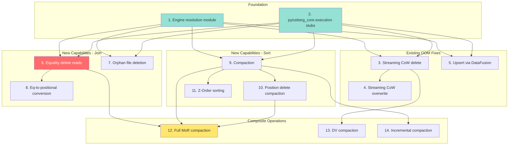

# [Epic] Deep DataFusion Integration for Bounded-Memory Compute in PyIceberg

## Summary

PyIceberg is not merely a metadata library. It is the Python ecosystem's gateway to Apache Iceberg tables, and production workloads demand compute-heavy operations—compaction, merge-on-read delete resolution, upsert, orphan file cleanup—that are structurally impossible to implement correctly within a bounded memory envelope using PyArrow alone. This epic proposes integrating Apache DataFusion as a first-class execution engine behind an automatic engine-resolution layer (DuckDB-style: configure the memory budget, not the strategy), enabling every compute-heavy operation to execute with guaranteed `O(M)` bounded memory via spill-to-disk.

**This is not optional for feature parity with Java Iceberg.** Java Iceberg has Spark/Flink as compute engines. Python has no equivalent unless we build one. DataFusion is that engine.

---

## Motivation: Why This Is Critical

### PyIceberg Today: Metadata + Thin Compute

PyIceberg currently excels at:
- Catalog operations (create/drop/alter tables)
- Scan planning (manifest filtering, partition pruning)
- Metadata inspection (snapshots, schemas, partition specs)
- Simple appends and overwrites of user-provided Arrow data

But it **cannot** do:
- Read tables with equality deletes (hard `ValueError`)
- Compact data files (not implemented)
- Resolve accumulated delete files (not implemented)
- Upsert without OOM risk on large tables
- Clean up orphan files without OOM on tables with millions of files
- Sort-on-write for tables with sort orders

### The Fundamental Gap

Java Iceberg never operates alone—it delegates compute to Spark or Flink. These engines provide:
1. **External memory algorithms** (sort, join, aggregate with spill-to-disk)
2. **Distributed execution** (shuffle across nodes)
3. **Memory management** (cooperative budgets, spill policies)

PyIceberg has attempted to be self-contained using only PyArrow. This works for small data but creates a **hard wall** at the point where any operation requires more memory than is available. This wall cannot be worked around—it is a structural limitation of compute libraries (PyArrow, NumPy, Pandas) that lack execution-engine capabilities (memory budgets, spill-to-disk, query planning).

### The Existential Risk

Without this integration:
- Tables written by Flink (which uses equality deletes exclusively) are **completely unreadable** by PyIceberg
- PyIceberg cannot participate in production data platform maintenance (compaction, orphan cleanup)
- Users must maintain a Spark cluster solely for maintenance tasks that PyIceberg should handle
- The project remains a "dev tool" rather than a "production tool"

---

## What Is Apache DataFusion?

### Overview

[Apache DataFusion](https://datafusion.apache.org/) is an extensible query execution framework written in Rust, built on top of Apache Arrow. It is **not** a database — it is an embeddable execution engine that any application can use to run SQL queries and dataframe operations over arbitrary data sources with full control over memory, parallelism, and I/O.

Think of it as "the query engine inside DuckDB, but as a reusable library." DuckDB chose to build its own engine; DataFusion provides the same class of capabilities (vectorized execution, external-memory operators, optimizer) as a composable component.

### Core Capabilities

| Capability | Description |
|-----------|-------------|
| **Vectorized execution** | Operates on Arrow `RecordBatch` columns (not row-at-a-time) — same memory format as PyArrow |
| **Query optimizer** | Cost-based optimizer with predicate pushdown, projection pruning, join reordering |
| **External-memory operators** | `SortExec`, `HashJoinExec`, `GroupedHashAggregateExec` all spill to disk when memory threshold exceeded |
| **Configurable memory pool** | `FairSpillPool` enforces a hard budget — operators cooperatively spill when the pool is exhausted |
| **Multi-threaded execution** | Rust + Tokio async runtime — true parallelism without Python's GIL |
| **Extensible `TableProvider`** | Any data source (Parquet, CSV, Iceberg, Delta) can plug in via a trait |
| **Arrow-native** | Zero-copy interop with PyArrow — no serialization at the boundary |

### How It Works (Execution Pipeline)

```
SQL / DataFrame API
       ↓
LogicalPlan (relational algebra tree)
       ↓
Optimizer (predicate pushdown, join reorder, projection prune)
       ↓
PhysicalPlan (concrete execution operators)
       ↓
Execution (Tokio async, multi-threaded, memory-managed)
       ↓
Arrow RecordBatch stream (output)
```

Each physical operator (scan, filter, join, sort, aggregate, write) implements the `ExecutionPlan` trait. DataFusion's runtime executes these operators in a pipeline, streaming `RecordBatch` instances between them. When an operator needs more memory than its reservation allows, it **spills intermediate state to local disk** and continues — this is the key capability that PyArrow structurally cannot provide.

### Why DataFusion Over Alternatives

| Alternative | Why Not |
|------------|---------|
| **DuckDB** | Great engine, but: (1) GPL-licensed extensions, (2) not embeddable as a library in the same way — it's a database, not a composable component, (3) no Iceberg `TableProvider` integration, (4) different Arrow implementation (requires copy at boundary) |
| **Polars** | Rust-based and fast, but: (1) no spill-to-disk for joins/sorts (streaming mode is limited), (2) no `TableProvider` extensibility model, (3) not part of Apache ecosystem (license/governance mismatch), (4) designed as a DataFrame library, not an execution engine |
| **Spark** | The Java answer, but: (1) requires JVM + cluster, (2) 10-second startup latency, (3) cannot embed in a Python library, (4) fundamentally a distributed system — overkill for single-node bounded-memory execution |
| **Velox (Meta)** | Powerful C++ engine, but: (1) no Python bindings, (2) no Iceberg integration, (3) not Apache-licensed, (4) designed for distributed execution (Presto/Prestissimo) |
| **PyArrow Compute** | Already used by PyIceberg, but: (1) no memory management, (2) no spill-to-disk, (3) no join operators, (4) no query planning — it's a compute kernel library, not an execution engine |
| **Ray** | Distributed framework, but: (1) massive dependency, (2) designed for cluster execution not single-node, (3) no built-in external-memory operators |

### The Decisive Factors for PyIceberg

1. **Same Apache governance** — DataFusion, Arrow, Iceberg, and iceberg-rust are all Apache Software Foundation projects under Apache 2.0 license. No license compatibility issues. Shared committer communities.

2. **iceberg-rust already integrates DataFusion** — The `iceberg-datafusion` crate already implements `TableProvider`, `IcebergTableScan`, `IcebergWriteExec`, and `IcebergCommitExec`. This is not a greenfield integration — it's connecting existing pieces.

3. **Zero-copy Arrow interop** — DataFusion's output is `RecordBatch` (the same type PyArrow uses). No serialization, no copy, no format conversion. A DataFusion query result is directly usable as a PyArrow table.

4. **`pyiceberg-core` already bridges Rust↔Python** — The PyO3 FFI infrastructure exists. DataFusion execution happens entirely in Rust (below the GIL), returning Arrow batches to Python. The hard part (FFI plumbing) is already solved.

5. **Spill-to-disk is the feature** — The entire motivation for this epic is bounded-memory execution. DataFusion's `MemoryPool` + `DiskManager` is purpose-built for exactly this problem. It's not a side feature — it's a core design principle of the engine.

---

## Design: DuckDB-Style Automatic Engine Resolution

### Core Principle

Users never choose an engine. They configure a memory budget. The system automatically uses DataFusion when available and falls back to PyArrow (with a warning) when not.

```python
# User experience — no engine selection needed
table.compact(target_file_size="256MB")
table.delete("category = 'spam'")
result = table.scan().to_arrow()  # transparently resolves equality deletes

# Power user — tune the budget
table.compact(memory_limit="2GB")
```

### Engine Resolution Logic

```python
def resolve_engine(operation: str, *, required: bool = False) -> Engine:
    try:
        import pyiceberg_core
        return Engine.DATAFUSION
    except ImportError:
        if required:
            raise ImportError(
                f"'{operation}' requires bounded-memory execution. "
                f"Install with: pip install 'pyiceberg[pyiceberg-core]'"
            )
        warnings.warn(f"'{operation}' using in-memory execution (may OOM on large data)")
        return Engine.PYARROW
```

### Decision Matrix

| Operation | New or Existing? | PyArrow Fallback? | Engine Policy |
|-----------|-----------------|-------------------|--------------|
| Equality delete reads | New | Yes (small deletes only) | Auto — attempt PyArrow if delete set fits in memory; OOM → clear error with install hint |
| Compaction | New | Yes (small tables only) | Auto — attempt in-memory sort; OOM → clear error with install hint |
| Eq-to-positional conversion | New | Yes (small tables only) | Auto — same pattern |
| Orphan file deletion | New | Yes (small file counts) | Auto — attempt in-memory set diff; OOM → clear error with install hint |
| CoW delete (file rewrite) | Existing (OOMs) | Yes (with warning) | Auto |
| Upsert | Existing (OOMs) | Yes (with warning) | Auto |
| Dynamic partition overwrite | Existing (OOMs) | Yes (with warning) | Auto |
| Append / simple scan | Existing (works) | Yes (no warning) | No change |

### Why Everything Can Be "Auto" (Not "Required")

A natural question: why not just require DataFusion for new features? The answer is that **we can make everything "auto"** — attempt PyArrow first, and if it works (data is small enough to fit in memory), great. If it fails, no corruption occurs because:

1. **Reads are side-effect-free** — A scan that OOMs during an anti-join has written nothing. The user gets an error, installs `pyiceberg-core`, and retries. No table corruption, no partial state.

2. **Writes use atomic commits** — Even if a PyArrow-path write OOMs mid-operation, no snapshot is committed. Iceberg's OCC guarantees that partial writes (orphan data files) are invisible and can be cleaned up.

3. **The PyArrow path is correct for small data** — For a table with 100 equality delete rows, a simple `pc.is_in()` anti-join in PyArrow works perfectly in < 1MB of memory. Requiring DataFusion for that case would be over-engineering.

The engine resolution logic becomes:

```python
def resolve_engine(operation: str) -> Engine:
    """Auto-resolve: prefer DataFusion if available, fallback to PyArrow always."""
    try:
        import pyiceberg_core
        return Engine.DATAFUSION  # bounded memory, any data size
    except ImportError:
        warnings.warn(
            f"'{operation}' will use in-memory execution. "
            f"For large tables, install: pip install 'pyiceberg[pyiceberg-core]'",
            stacklevel=3,
        )
        return Engine.PYARROW  # works for small data; OOMs gracefully on large
```

If the PyArrow path OOMs, Python raises `MemoryError` or the kernel kills the process. Neither corrupts the table. The user's recourse is clear: install the optional dependency. This is the same UX pattern as `pandas` suggesting `pyarrow` for faster Parquet I/O — the feature *works* without it, just not at scale.

**The only case where we'd hard-require DataFusion** is if we cannot implement a correct (even if slow/memory-hungry) PyArrow path at all. For the operations listed, a correct PyArrow path always exists — it's just bounded by available RAM.

---

## Current State of DataFusion in PyIceberg

### What Already Exists

| Component | Location | What It Does |
|-----------|----------|-------------|
| `__datafusion_table_provider__` | `pyiceberg/table/__init__.py:1673` | Exposes table as DataFusion `TableProvider` via PyCapsule FFI |
| `IcebergDataFusionTable` | `pyiceberg_core.datafusion` (Rust) | Static read-only `TableProvider` backed by `IcebergStaticTableProvider` |
| `pyiceberg-core` optional extra | `pyproject.toml` | `pyiceberg-core>=0.5.1,<0.10.0` |
| `datafusion` optional extra | `pyproject.toml` | `datafusion>=52,<53` |
| DataFusion test | `tests/table/test_datafusion.py` | Basic round-trip: append → register → query → verify |
| Transform functions | `pyiceberg/transforms.py` | Delegates to `pyiceberg_core.transform` for bucket/year/month/etc. |

### What Does NOT Exist

| Capability | Why It Matters |
|-----------|---------------|
| Engine resolution layer | No automatic dispatch between DataFusion and PyArrow |
| Memory-configured execution | SessionContext uses defaults (unbounded pool, no spill) |
| Write-capable provider via FFI | Only `IcebergStaticTableProvider` exposed (read-only) |
| Delete file resolution in DataFusion scan | `IcebergDataFusionTable` ignores delete files entirely |
| `pyiceberg_core.execution` module | No FFI entry point for bounded-memory operations |
| Any equality delete support | Hard `ValueError` at `_plan_files_local()` line ~2190 |

### The Hard Error Today

```python
# pyiceberg/table/__init__.py:~2190
elif data_file.content == DataFileContent.EQUALITY_DELETES:
    raise ValueError(
        "PyIceberg does not yet support equality deletes: "
        "https://github.com/apache/iceberg/issues/6568"
    )
```

Any Iceberg table written by Flink, or any V2 table using equality deletes for CDC, is **completely unreadable**.

---

## Compute-Heavy Operations: Inventory

### Operation 1: Equality Delete Resolution (Read Path)

**What it is**: When reading a table with equality delete files, every data row must be checked against the delete set via an anti-join on the equality columns.

**Why it's compute-heavy**: The anti-join requires the entire delete key set to be accessible during the probe phase. For large CDC tables, equality delete files can accumulate to gigabytes.

**Current code**: `pyiceberg/table/__init__.py:~2190` — raises `ValueError`

**Java equivalent**: `BaseDeleteLoader` + `EqualityDeleteFilter` in `iceberg-data` module — uses in-memory hash set (relies on Spark/Flink for memory management)

**Memory requirement**: `O(|equality_delete_rows| × key_size)` — unbounded

**DataFusion solution**: Grace Hash Join (LEFT ANTI) with spill-to-disk — `O(memory_limit)` bounded

---

### Operation 2: Copy-on-Write Delete/Overwrite (File Rewrite)

**What it is**: When deleting rows that span existing Parquet files, PyIceberg reads the entire file into memory, applies the filter, and writes the surviving rows to a new file.

**Why it's compute-heavy**: Large Parquet files (512MB–1GB target size) must be fully materialized in memory.

**Current code**: `pyiceberg/table/__init__.py` — `Transaction.delete()`:
```python
for original_file in files:
    df = ArrowScan(...).to_table(tasks=[original_file])  # ← FULL FILE IN MEMORY
    filtered_df = df.filter(preserve_row_filter)
```

**Java equivalent**: `OverwriteFiles` / `CopyOnWriteTable` — delegates to Spark for parallelism

**Memory requirement**: `O(max_parquet_file_size)` — typically 512MB–1GB per file

**DataFusion solution**: Streaming `FilterExec` → `IcebergWriteExec` pipeline — `O(batch_size)` ≈ 800KB

---

### Operation 3: Upsert (MERGE INTO)

**What it is**: Match incoming rows against existing table data on key columns, update matched rows, insert unmatched rows.

**Why it's compute-heavy**: Requires joining the source DataFrame against the target table's matched rows. Current implementation does row-by-row Python comparison with `O(n²)` complexity.

**Current code**: `pyiceberg/table/upsert_util.py`:
```python
# Row-by-row comparison in Python loop
for source_idx, target_idx in zip(source_indices, target_indices):
    source_row = source_table.slice(source_idx, 1)
    target_row = target_table.slice(target_idx, 1)
    for key in non_key_cols:
        if source_row[key][0].as_py() != target_row[key][0].as_py():
            to_update_indices.append(source_idx)
```

Plus: `pa.concat_tables(batches_to_overwrite)` — accumulates all update rows in memory.

**Java equivalent**: `MergeInto` Spark action — uses Spark's shuffle + hash join

**Memory requirement**: `O(|source| + |matched_target|)` — both held simultaneously

**DataFusion solution**: `HashJoinExec` (INNER for updates, LEFT ANTI for inserts) with spill — `O(memory_limit)`

---

### Operation 4: Data Compaction

**What it is**: Read multiple small/unsorted data files, sort by table sort order, write optimally-sized files.

**Why it's compute-heavy**: Sorting arbitrarily large datasets requires external merge sort.

**Current code**: Not implemented in PyIceberg.

**Java equivalent**: `RewriteDataFilesAction` — delegates to Spark's `SortExec` with spill

**Memory requirement**: `O(total_data_size)` for in-memory sort — infeasible for large tables

**DataFusion solution**: External merge sort via `SortExec` — `O(memory_limit)` with `⌈log(N/M)⌉` merge passes

---

### Operation 5: Orphan File Deletion

**What it is**: Find files in storage not referenced by any snapshot's manifests, and delete them.

**Why it's compute-heavy**: Requires a LEFT ANTI JOIN between the storage listing (potentially millions of paths) and the set of all valid paths across all snapshots.

**Current code**: In-progress (issue [#1200](https://github.com/apache/iceberg-python/issues/1200)) — current approaches attempt to hold both path sets in memory.

**Java equivalent**: `RemoveOrphanFilesAction` — uses Spark for the set difference

**Memory requirement**: `O(|storage_paths| + |valid_paths|)` — both potentially millions of entries

**DataFusion solution**: `HashJoinExec` (LEFT ANTI) on path strings with spill — `O(memory_limit)`

---

### Operation 6: Equality-to-Positional Conversion (Delete Compaction)

**What it is**: Convert accumulated equality delete files into positional deletes or deletion vectors, eliminating the per-read anti-join cost.

**Why it's compute-heavy**: Requires an INNER JOIN of data files × equality delete files to produce `(file_path, row_position)` tuples.

**Current code**: Not implemented.

**Java equivalent**: Part of `RewriteDataFilesAction` with delete-file resolution

**Memory requirement**: `O(|data_rows| + |eq_delete_rows|)` for the join

**DataFusion solution**: `HashJoinExec` (INNER) with row-index projection — `O(memory_limit)`

---

### Operation 7: Full MoR Compaction (Sort + Delete Resolution + Rewrite)

**What it is**: The composition of operations 1 + 4 — resolve all delete types against data files, sort surviving rows, write clean optimally-sized output files.

**Why it's compute-heavy**: Combines hash join (delete resolution) with external sort (ordering) and streaming write.

**Current code**: Not implemented (blocked by equality delete support).

**Java equivalent**: `RewriteDataFilesAction` with `remove-dangling-deletes` strategy

**Memory requirement**: `O(|data| + |all_deletes|)` — infeasible without external memory

**DataFusion solution**: Pipelined `AntiHashJoinExec` → `SortExec` → `IcebergWriteExec` — `O(memory_limit)` throughout

---

## Existing Issues and PRs (Cross-Repository)

### PyIceberg (iceberg-python)

| Issue/PR | Title | Relevance |
|----------|-------|-----------|
| [#1078](https://github.com/apache/iceberg-python/issues/1078) | MoR support epic | Umbrella for all MoR read/write |
| [#1210](https://github.com/apache/iceberg-python/issues/1210) | Equality delete read support | The primary blocking issue |
| [#3270](https://github.com/apache/iceberg-python/issues/3270) | Equality delete support (newer) | Duplicate/continuation of #1210 |
| [PR #3285](https://github.com/apache/iceberg-python/pull/3285) | DeleteFileIndex for equality deletes | WIP: index plumbing without resolution |
| [PR #2918](https://github.com/apache/iceberg-python/pull/2918) | DeleteFileIndex for positional deletes | Merged — foundation for #3285 |
| [#3356](https://github.com/apache/iceberg-python/issues/3356) | Execution path isolation | Keep DataFusion path cleanly separated |
| [#3122](https://github.com/apache/iceberg-python/discussions/3122) | PyArrow worker materialization limits | Documents OOM patterns |
| [PR #2676](https://github.com/apache/iceberg-python/pull/2676) | Related to materialization bounds | PyArrow OOM mitigation |
| [#1818](https://github.com/apache/iceberg-python/issues/1818) | V3 (deletion vectors) tracking | DV read/write support |
| [#3319](https://github.com/apache/iceberg-python/issues/3319) | Commit retry with conflict validation | Prerequisite for RowDelta |
| [PR #3320](https://github.com/apache/iceberg-python/pull/3320) | Commit retry implementation | RowDelta prerequisite |
| [#3130](https://github.com/apache/iceberg-python/issues/3130) | REPLACE API | Required for compaction commit |
| [PR #3131](https://github.com/apache/iceberg-python/pull/3131) | REPLACE API implementation | Compaction commit path |
| [#1200](https://github.com/apache/iceberg-python/issues/1200) | Orphan file deletion | In-progress, OOM risk |

### iceberg-rust

| Issue | Title | Relevance to This Epic |
|-------|-------|----------------------|
| [#2186](https://github.com/apache/iceberg-rust/issues/2186) | MoR scan-side delete reconciliation | Long-term: native delete resolution in `TableProvider` |
| [#2205](https://github.com/apache/iceberg-rust/issues/2205) | Equality delete reader | Rust-native anti-join (Track 2) |
| [#2201](https://github.com/apache/iceberg-rust/issues/2201) | Positional delete reader | Rust-native pos delete support |
| [#1530](https://github.com/apache/iceberg-rust/issues/1530) | Delete file support in scan | Core primitive for all delete support |
| [#2269](https://github.com/apache/iceberg-rust/issues/2269) | DataFusion write actions (MERGE/UPDATE) | Write path through DataFusion |

### DataFusion

| Issue | Title | Relevance |
|-------|-------|-----------|
| [datafusion-python#1217](https://github.com/apache/datafusion-python/issues/1217) | FFI bus error / segfault | Stability of PyCapsule boundary |

---

## Architecture: What Needs to Change

### Layer 1: New `pyiceberg/execution/` Module (Python)

```
pyiceberg/execution/
├── __init__.py
├── engine.py          # resolve_engine() — DuckDB-style auto-dispatch
├── protocol.py        # ExecutionPlan protocol definition
└── operations/
    ├── cow_rewrite.py     # Streaming CoW via DataFusion or PyArrow
    ├── compact.py         # Compaction via DataFusion (required)
    ├── equality_resolve.py # Anti-join resolution
    ├── upsert.py          # Hash join + partition route
    └── orphan_delete.py   # Path anti-join
```

**Key property**: This module contains **zero DataFusion imports at module level**. All imports are lazy (inside function bodies), ensuring that `import pyiceberg` never fails due to missing optional dependencies.

### Layer 2: Extended `pyiceberg_core.execution` (Rust FFI)

New functions exposed to Python via PyO3:

```python
# pyiceberg_core/execution.pyi (type stubs)

def execute_cow_rewrite(
    metadata_location: str,
    file_io_properties: dict[str, str],
    files_to_rewrite: list[str],
    filter_expression: str,
    keep_matching: bool,
    memory_limit: str | None = None,
) -> CowRewriteResult: ...

def execute_compaction(
    metadata_location: str,
    file_io_properties: dict[str, str],
    files_to_compact: list[str],
    target_file_size_bytes: int,
    sort_columns: list[str] | None = None,
    memory_limit: str | None = None,
) -> CompactionResult: ...

def execute_equality_resolution(
    data_file_paths: list[str],
    eq_delete_file_paths: list[str],
    equality_field_names: list[str],
    file_io_properties: dict[str, str],
    memory_limit: str | None = None,
) -> list[RecordBatch]: ...

def execute_antijoin_paths(
    left_paths: list[str],
    right_paths: list[str],
    memory_limit: str | None = None,
) -> list[str]: ...
```

### Layer 3: iceberg-rust DataFusion Integration (Minimal Changes)

| Change | File | Description |
|--------|------|-------------|
| `IcebergOverwriteCommitExec` | `physical_plan/overwrite_commit.rs` (NEW) | Atomic file-replace commit |
| Memory-configurable session | `bindings/python/src/execution.rs` (NEW) | `FairSpillPool` + `DiskManager` |
| Expose execution module | `bindings/python/src/lib.rs` | Register new submodule |

**Critical insight**: We do NOT need to wait for iceberg-rust #2186 (native MoR in TableProvider). The Python side can orchestrate: identify delete files via scan planning, then pass file paths to DataFusion for the join. This is "Track 1" — usable immediately.

### Layer 4: Minimal Changes to Existing PyIceberg Code

```python
# pyiceberg/table/__init__.py — ONLY these touchpoints change:

# 1. _plan_files_local() — REMOVE the ValueError, index equality deletes
elif data_file.content == DataFileContent.EQUALITY_DELETES:
    delete_index.add_delete_file(manifest_entry, partition_key=data_file.partition)
    # Was: raise ValueError(...)

# 2. Transaction.delete() — ADD DataFusion dispatch before PyArrow fallback
if delete_snapshot.rewrites_needed:
    engine = resolve_engine("cow_delete", required=False)
    if engine == Engine.DATAFUSION:
        return self._cow_delete_datafusion(...)
    # else: existing PyArrow path (unchanged)

# 3. NEW methods on Table class (purely additive):
def compact(self, ...) -> None: ...
def rewrite_position_deletes(self, ...) -> None: ...
def delete_orphan_files(self, ...) -> list[str]: ...
```

**Total lines changed in existing files**: < 50 lines modified, ~200 lines added in new modules.

---

## Implementation Ordering

### Dependency Graph



### Strict Ordering Requirements

| Step | Depends On | Rationale |
|------|-----------|-----------|
| 1 (Engine resolution) | Nothing | Pure infrastructure |
| 2 (Rust FFI stubs) | Nothing | Pure infrastructure |
| 3 (CoW delete) | 1, 2 | First consumer of engine resolution |
| 4 (CoW overwrite) | 3 | Same pattern, trivial extension |
| 5 (Upsert) | 1, 2 | Independent of CoW path |
| 6 (Equality deletes) | 1, 2 | Independent of CoW/Upsert |
| 7 (Orphan deletion) | 1, 2 | Independent |
| 8 (Eq-to-pos) | 6 | Requires equality delete read infra |
| 9 (Compaction) | 1, 2 | Independent |
| 10 (Pos delete compact) | 9 | Reuses compaction write pipeline |
| 11 (Z-Order) | 9 | Reuses compaction + custom UDF |
| 12 (Full MoR compact) | 6, 9, 10 | Composes all previous |
| 13 (DV compaction) | 3 | Reuses streaming rewrite |
| 14 (Incremental compact) | 9 | Optimization of #9 |

### Parallelizable Work

Issues 3–7 and 9 are **all independent** after foundation (1, 2) is laid. They can be developed in parallel by different contributors.

---

## Why PyIceberg Cannot Remain "Metadata-Only"

### The Category Error

There is a persistent misconception that PyIceberg should be a "thin metadata client" and delegate all compute to external engines (Spark, Daft, Polars, DuckDB). This fails for three reasons:

**1. Operations that ARE metadata but REQUIRE compute internally**

Compaction, orphan deletion, and delete compaction are *table maintenance* operations — conceptually metadata operations — but their implementation requires reading and rewriting data files. You cannot "delegate" compaction to Spark without reimplementing all of Iceberg's commit protocol, partition routing, and manifest management inside Spark.

**2. The `table.scan().to_arrow()` contract**

PyIceberg promises that `table.scan().to_arrow()` returns the correct logical state of the table. For V2 tables with equality deletes, this contract is currently **violated** (hard error). The scan is not delegatable — it IS PyIceberg's core responsibility. And for tables with equality deletes, it requires a hash join.

**3. No external engine provides Iceberg-aware execution**

Spark can compact Iceberg tables, but only through `CALL` procedures that require a running Spark session. Polars, DuckDB, and Daft can READ Iceberg tables but cannot WRITE maintenance results back. Only PyIceberg has the full catalog + commit + metadata stack. It must also have the compute layer.

### The Production Reality

In production environments:
- Tables accumulate equality deletes continuously (Flink CDC)
- Without compaction, Read Amplification Factor (RAF) grows unbounded
- Without orphan deletion, storage costs grow unbounded
- Without equality delete resolution, Python applications cannot read the data at all

Java Iceberg solves this by coupling with Spark. PyIceberg must solve it by coupling with DataFusion. The alternative is permanent relegation to a development/prototyping tool incapable of production operations.

---

## iceberg-rust Requirements

### Immediate (Track 1 — Python orchestrates, Rust executes)

| Requirement | Status | What's Needed |
|------------|--------|---------------|
| `IcebergWriteExec` | ✅ Exists | No changes |
| `IcebergTableScan` | ✅ Exists | No changes |
| `SortExec` pipeline | ✅ Exists (used in `insert_into`) | No changes |
| Memory-configurable session | ❌ Missing | New: `create_bounded_session()` in bindings |
| `IcebergOverwriteCommitExec` | ❌ Missing | New: atomic file-replace commit |
| Python execution API | ❌ Missing | New: `pyiceberg_core.execution` module |

### Long-term (Track 2 — Rust handles everything)

| Requirement | Status | Upstream Issue |
|------------|--------|---------------|
| Delete file resolution in `TableProvider` scan | ❌ | [iceberg-rust#2186](https://github.com/apache/iceberg-rust/issues/2186) |
| Equality delete reader (anti-join) | ❌ | [iceberg-rust#2205](https://github.com/apache/iceberg-rust/issues/2205) |
| Positional delete reader | ❌ | [iceberg-rust#2201](https://github.com/apache/iceberg-rust/issues/2201) |
| Write actions (MERGE/UPDATE) | ❌ | [iceberg-rust#2269](https://github.com/apache/iceberg-rust/issues/2269) |
| Delete file support in scan primitive | ❌ | [iceberg-rust#1530](https://github.com/apache/iceberg-rust/issues/1530) |

**Track 1 does not block on any of these.** It uses the existing `IcebergTableScan` (data files only) and `IcebergWriteExec`, with Python-side orchestration for delete file identification.

---

## Success Criteria

- [ ] `table.scan().to_arrow()` works on tables with equality deletes without OOM
- [ ] `table.compact()` operates on 100GB+ tables with 512MB memory budget
- [ ] `table.delete()` no longer OOMs on large Parquet files
- [ ] `table.upsert()` scales to million-row joins without O(n²) Python loops
- [ ] `table.maintenance.delete_orphan_files()` handles 10M+ file tables
- [ ] All new operations produce results identical to Java Iceberg
- [ ] No existing test breaks when `pyiceberg-core` is not installed
- [ ] DataFusion is never imported at module level (lazy only)

---

## Risks and Mitigations

| Risk | Impact | Mitigation |
|------|--------|-----------|
| `pyiceberg-core` version skew with `datafusion-python` | Import errors | Pin compatible version ranges; CI matrix |
| FFI bus errors ([datafusion-python#1217](https://github.com/apache/datafusion-python/issues/1217)) | Segfaults | Track 1 uses Python-side DataFusion API (no custom FFI) |
| iceberg-rust #2186 never completes | Track 2 blocked | Track 1 is self-sufficient; Track 2 is optimization only |
| DataFusion API breaks between versions | Compile failures | Pin major version; abstract behind `pyiceberg_core.execution` |
| Community pushback on "too much scope" | Rejected PR | Each sub-issue is independently shippable; PR #1 is 200 lines |

---

## Proposed Sub-Issues

This epic should be broken into the following GitHub issues:

1. **`[Infra] Add execution engine resolution module`** — `pyiceberg/execution/engine.py`
2. **`[Infra] Add pyiceberg_core.execution Rust module`** — FFI scaffolding
3. **`[Fix] Streaming CoW delete via DataFusion`** — Fixes OOM in `Transaction.delete()`
4. **`[Fix] Streaming CoW overwrite via DataFusion`** — Same pattern for `overwrite()`
5. **`[Feature] Equality delete read support`** — THE critical feature; removes `ValueError`
6. **`[Feature] Table compaction (sort + rewrite)`** — `table.compact()` API
7. **`[Feature] Orphan file deletion via anti-join`** — Bounded-memory path cleanup
8. **`[Fix] Upsert via DataFusion hash join`** — Replaces O(n²) Python loop
9. **`[Feature] Equality-to-positional conversion`** — Delete compaction
10. **`[Feature] Position delete compaction`** — Per-file rewrite
11. **`[Feature] Full MoR compaction (join + sort + rewrite)`** — End-to-end maintenance
12. **`[Feature] Z-Order / Hilbert sorting`** — Spatial clustering
13. **`[Feature] DV compaction`** — V3 deletion vector merge + rewrite
14. **`[Feature] Incremental compaction`** — Sort-preserving merge optimization

---

## References

- [PyIceberg MoR Epic #1078](https://github.com/apache/iceberg-python/issues/1078)
- [Equality Delete Support #1210](https://github.com/apache/iceberg-python/issues/1210)
- [DeleteFileIndex PR #3285](https://github.com/apache/iceberg-python/pull/3285)
- [Execution Path Isolation #3356](https://github.com/apache/iceberg-python/issues/3356)
- [iceberg-rust MoR #2186](https://github.com/apache/iceberg-rust/issues/2186)
- [iceberg-rust Equality Delete Reader #2205](https://github.com/apache/iceberg-rust/issues/2205)
- [DataFusion FFI Stability](https://github.com/apache/datafusion-python/issues/1217)
- Companion design docs: `datafusion_status.md`, `datafusion_ux.md`
