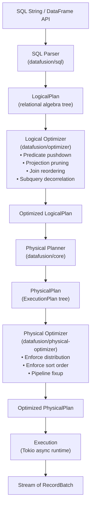
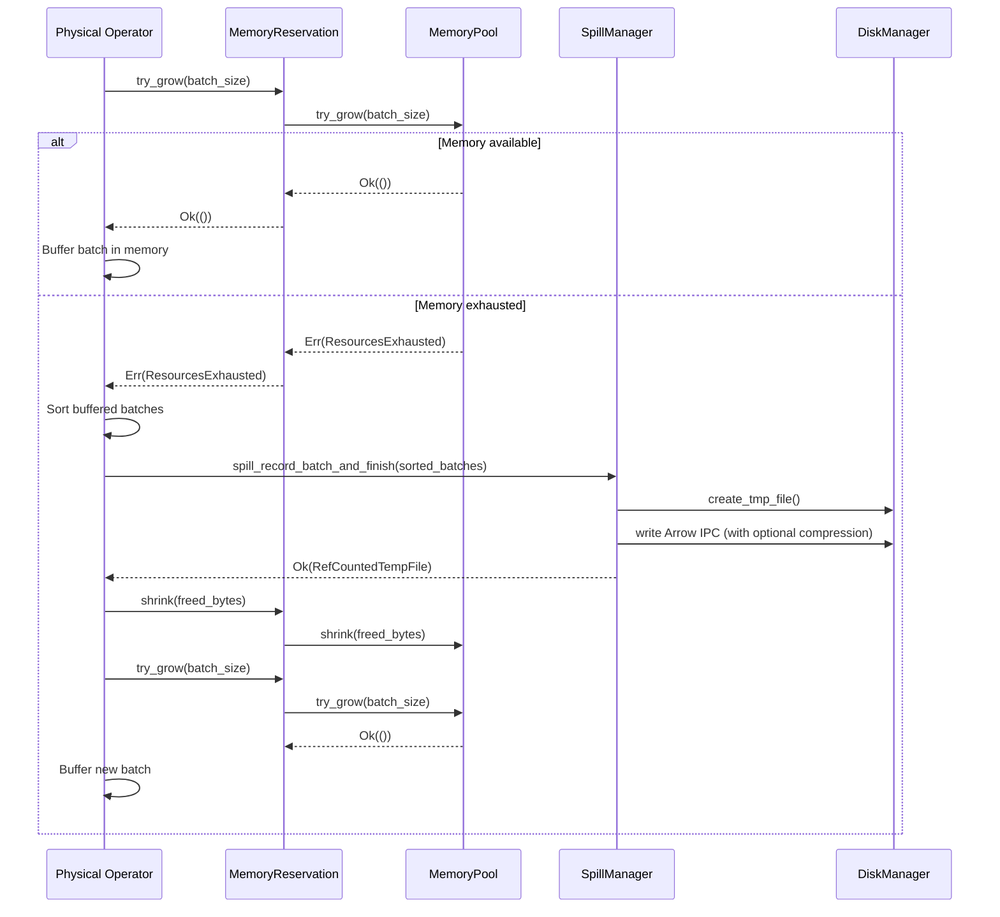
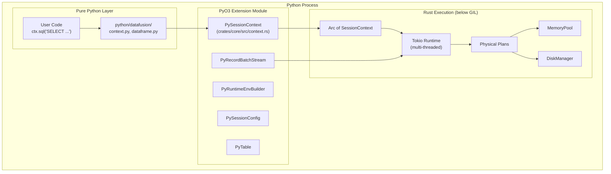
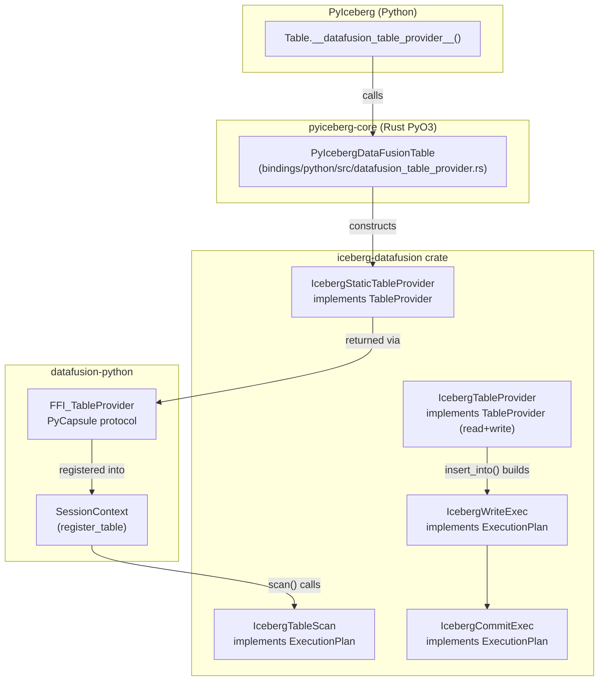

# Apache DataFusion & datafusion-python: In-Depth Architectural Reference

## Purpose

This document provides the deep technical understanding needed to integrate DataFusion into PyIceberg. It covers how DataFusion works internally, how datafusion-python exposes it to Python, and how these pieces connect to the existing iceberg-rust DataFusion integration and ultimately to PyIceberg.

---

## 1. What Is DataFusion?

Apache DataFusion (v54.0.0) is a **query execution framework** — a Rust library that transforms relational algebra expressions into streaming physical execution plans operating on Apache Arrow columnar data. It is not a database; it is the engine a database would use.

**Formal definition**: DataFusion is a function:

```
DataFusion: LogicalPlan × Configuration → Stream[RecordBatch]
```

Where `LogicalPlan` is a tree of relational algebra operators and `Configuration` specifies memory budget, parallelism, and I/O parameters.

---

## 2. DataFusion Workspace Structure

The Rust workspace (`/datafusion/`) contains 40+ crates organized by concern:

```
datafusion/
├── core/               # Top-level re-export crate; physical planner, DataFrame API
├── execution/          # RuntimeEnv, MemoryPool, DiskManager, TaskContext
├── physical-plan/      # ExecutionPlan trait, all physical operators, spill infrastructure
├── catalog/            # TableProvider trait, CatalogProvider
├── session/            # Session trait
├── expr/               # Logical expressions, LogicalPlan nodes
├── optimizer/          # Logical optimizer (predicate pushdown, join reorder, etc.)
├── physical-optimizer/ # Physical optimization (enforce distribution, sort requirements)
├── ffi/                # C ABI stable FFI for cross-language TableProvider
├── datasource-parquet/ # Parquet file reader/writer
├── sql/                # SQL parser → LogicalPlan
├── proto/              # Protobuf serialization of plans (for FFI filter passing)
└── functions*/         # Scalar, aggregate, window function implementations
```

**Key dependency**: `arrow-rs` v58 (Arrow columnar format implementation in Rust)

---

## 3. The Execution Pipeline



### 3.1 Mathematical Correspondence

Each stage corresponds to a formal transformation in database theory:

| Stage | Mathematical Operation | Theory |
|-------|----------------------|--------|
| SQL → LogicalPlan | Parsing: `String → AST → RelAlg` | Context-free grammar → relational algebra |
| Logical Optimization | Equivalence-preserving rewriting: `R₁ ≡ R₂` | Relational algebra identities (σ commutes with ×, etc.) |
| Physical Planning | Algorithm selection: `RelAlg → PhysAlg` | Choose hash join vs. merge join, sort vs. hash aggregate |
| Physical Optimization | Mechanical fixup: enforce physical constraints | Insert shuffle/sort nodes to satisfy operator requirements |
| Execution | Evaluation: `PhysAlg × Data → Result` | Iterator model (Volcano) extended with async + parallelism |

---

## 4. The ExecutionPlan Trait

Every physical operator implements `ExecutionPlan` (defined in `datafusion/physical-plan/src/execution_plan.rs`):

```rust
pub trait ExecutionPlan: Any + Debug + Send + Sync {
    fn name(&self) -> &str;
    fn schema(&self) -> SchemaRef;
    fn properties(&self) -> &Arc<PlanProperties>;
    fn children(&self) -> Vec<&Arc<dyn ExecutionPlan>>;
    fn with_new_children(self: Arc<Self>, children: Vec<Arc<dyn ExecutionPlan>>) 
        -> Result<Arc<dyn ExecutionPlan>>;
    
    // THE key method — produces output as an async stream
    fn execute(&self, partition: usize, context: Arc<TaskContext>) 
        -> Result<SendableRecordBatchStream>;
    
    // Optimizer metadata
    fn required_input_distribution(&self) -> Vec<Distribution>;
    fn required_input_ordering(&self) -> Vec<Option<OrderingRequirements>>;
    fn maintains_input_order(&self) -> Vec<bool>;
    fn benefits_from_input_partitioning(&self) -> Vec<bool>;
}
```

**Key insight**: `execute()` returns a `SendableRecordBatchStream` (an async `Stream<Item = Result<RecordBatch>>`). This is the **pull-based streaming model** — downstream operators pull batches one at a time from upstream. No operator buffers the entire input unless it structurally must (sort, hash join build side).

### 4.1 The Streaming Invariant

**Axiom (Bounded Output Buffer)**: Each call to `stream.next()` produces at most one `RecordBatch` of `batch_size` rows (default 8192). The memory for this batch is transient — it is consumed by the next operator or returned to the caller.

**Theorem (Pipeline Memory Bound for Streaming Operators)**: For a pipeline of `k` streaming operators (filter, projection, limit), the total resident memory is:

```
M_pipeline = O(k × batch_size × row_width)
```

This is typically < 10MB regardless of input size. Only **blocking operators** (sort, hash join build side, aggregate) can buffer more, and those are memory-managed.

---

## 5. Memory Management

### 5.1 The MemoryPool Trait

Defined in `datafusion/execution/src/memory_pool/mod.rs`:

```rust
pub trait MemoryPool: Any + Send + Sync + Debug + Display {
    fn register(&self, consumer: &MemoryConsumer) {}
    fn unregister(&self, consumer: &MemoryConsumer) {}
    fn grow(&self, reservation: &MemoryReservation, additional: usize);
    fn shrink(&self, reservation: &MemoryReservation, shrink: usize);
    fn try_grow(&self, reservation: &MemoryReservation, additional: usize) -> Result<()>;
    fn reserved(&self) -> usize;
    fn memory_limit(&self) -> MemoryLimit;
}
```

**The critical method is `try_grow()`** — it returns `Err(ResourcesExhausted)` when the pool cannot accommodate the request. This error is the **spill trigger**.

### 5.2 Three Built-in Pools

| Pool | Behavior | Use Case |
|------|----------|----------|
| `UnboundedMemoryPool` | Never fails `try_grow()` | Default (no limit) |
| `GreedyMemoryPool` | Atomic CAS on `used` counter; fails when `used + additional > pool_size` | Single spillable operator |
| `FairSpillPool` | Divides available memory evenly among all registered spillable consumers | **Multiple spillable operators** (our use case) |

### 5.3 FairSpillPool Algorithm

**Definition**: Let `P` = pool size, `U` = unspillable memory, `n` = number of registered spillable consumers.

Each spillable consumer `i` may use at most:

```
quota_i = (P - U) / n
```

When consumer `i` calls `try_grow(additional)`:
```
if reservation_i.size() + additional > quota_i:
    return Err(ResourcesExhausted)
```

**Formal property**: No single spillable operator can starve others. Each gets a fair share of the memory not claimed by unspillable operators.

This is the pool we'd configure for PyIceberg operations (sort + join in the same plan need fair sharing).

### 5.4 The Spill Protocol (Per-Operator)



### 5.5 SortExec Spill Implementation

From `datafusion/physical-plan/src/sorts/sort.rs` (ExternalSorter):

```rust
async fn reserve_memory_for_batch_and_maybe_spill(&mut self, input: &RecordBatch) -> Result<()> {
    let size = get_reserved_bytes_for_record_batch(input)?;
    match self.reservation.try_grow(size) {
        Ok(_) => Ok(()),
        Err(e) => {
            if self.in_mem_batches.is_empty() {
                return Err(Self::err_with_oom_context(e));
            }
            // Spill current in-memory batches, then retry
            self.sort_and_spill_in_mem_batches().await?;
            self.reservation.try_grow(size).map_err(Self::err_with_oom_context)
        }
    }
}
```

**Algorithm** (External Merge Sort):
1. Read batches, buffer in memory
2. When memory exhausted → sort buffered batches → write as spill file (Arrow IPC)
3. Repeat until input exhausted
4. Final merge: k-way merge of all spill files + remaining in-memory batches

**Complexity**:
- Time: `O(N log(N/M) / B)` I/O operations
- Memory: `O(M)` bounded by pool
- Disk: `O(N)` total spill (each record written once, read once)

---

## 6. DiskManager

Defined in `datafusion/execution/src/disk_manager.rs`:

```rust
pub struct DiskManager {
    local_dirs: Mutex<Option<Vec<TempDir>>>,
    max_temp_directory_size: AtomicU64,  // Default: 100GB
    used_disk_space: Arc<AtomicU64>,
    active_files_count: Arc<AtomicUsize>,
}
```

Modes:
- `OsTmpDirectory` — uses OS temp dir (default)
- `Directories(Vec<PathBuf>)` — user-specified paths (e.g., NVMe mount)
- `Disabled` — no spill possible (errors on attempt)

`RefCountedTempFile` auto-decrements `used_disk_space` when dropped (RAII cleanup).

---

## 7. SpillManager

Defined in `datafusion/physical-plan/src/spill/spill_manager.rs`:

```rust
pub struct SpillManager {
    env: Arc<RuntimeEnv>,
    metrics: SpillMetrics,
    schema: SchemaRef,
    batch_read_buffer_capacity: usize,  // Buffered reads during merge
    compression: SpillCompression,      // None, LZ4, Zstd
}
```

Responsibilities:
1. Create temp files via `DiskManager`
2. Write `RecordBatch`es as Arrow IPC stream (preserves Arrow memory layout — fast deserialization)
3. Optional compression (LZ4 frame or Zstd)
4. GC `StringView`/`BinaryView` arrays before spill (compact fragmented view buffers)
5. Read spill files back as async `SendableRecordBatchStream`

**Speed-of-light**: Arrow IPC is zero-deserialization for fixed-width types. The spill/read bandwidth is bounded only by disk I/O, not by parsing overhead.

---

## 8. The TableProvider Trait

Defined in `datafusion/catalog/src/table.rs`:

```rust
#[async_trait]
pub trait TableProvider: Any + Debug + Sync + Send {
    fn schema(&self) -> SchemaRef;
    fn table_type(&self) -> TableType;
    
    async fn scan(
        &self,
        state: &dyn Session,
        projection: Option<&Vec<usize>>,
        filters: &[Expr],
        limit: Option<usize>,
    ) -> Result<Arc<dyn ExecutionPlan>>;
    
    fn supports_filters_pushdown(&self, filters: &[&Expr]) 
        -> Result<Vec<TableProviderFilterPushDown>>;
    
    async fn insert_into(
        &self, state: &dyn Session, input: Arc<dyn ExecutionPlan>, insert_op: InsertOp
    ) -> Result<Arc<dyn ExecutionPlan>>;
}
```

**This is the integration point for Iceberg.** The `iceberg-datafusion` crate (`/iceberg-rust/crates/integrations/datafusion/`) implements this trait as `IcebergTableProvider` and `IcebergStaticTableProvider`.

### 8.1 What scan() Must Return

`scan()` returns an `ExecutionPlan` — DataFusion's optimizer and runtime handle the rest. The scan node:
1. Reads Parquet files (using DataFusion's Parquet reader OR a custom reader)
2. Applies projection (only read needed columns)
3. Applies filter pushdown (skip row groups via statistics)
4. Reports partitioning info to the optimizer

The scan is **lazy** — no I/O happens until `execute()` is called on the plan.

---

## 9. datafusion-python: The Python Bridge

### 9.1 Architecture



### 9.2 Session Configuration from Python

```python
from datafusion import SessionContext, SessionConfig, RuntimeEnvBuilder

# Configure memory-bounded execution
runtime = (
    RuntimeEnvBuilder()
    .with_fair_spill_pool(512 * 1024 * 1024)   # 512MB memory budget
    .with_disk_manager_os()                      # Use OS temp dir for spill
)

config = (
    SessionConfig()
    .with_batch_size(8192)
    .with_target_partitions(8)
)

ctx = SessionContext(config=config, runtime=runtime)
```

**How this maps to Rust** (`crates/core/src/context.rs`):

```rust
#[pymethods]
impl PyRuntimeEnvBuilder {
    fn with_fair_spill_pool(&self, size: usize) -> Self {
        let builder = self.builder.clone();
        let builder = builder.with_memory_pool(Arc::new(FairSpillPool::new(size)));
        Self { builder }
    }
    
    fn with_disk_manager_os(&self) -> Self {
        let mut builder = self.builder.clone();
        let mut disk_mgr = builder.disk_manager_builder.clone().unwrap_or_default();
        disk_mgr.set_mode(DiskManagerMode::OsTmpDirectory);
        builder = builder.with_disk_manager_builder(disk_mgr);
        Self { builder }
    }
}
```

### 9.3 RecordBatch Across FFI

RecordBatches cross the Python↔Rust boundary via the **Arrow C Data Interface** (zero-copy):

| Direction | Mechanism | Copy? |
|-----------|-----------|-------|
| Python → Rust | `RecordBatch::from_pyarrow_bound(obj)` | Zero-copy (shared memory) |
| Rust → Python | `batch.to_pyarrow(py)` | Zero-copy (shared memory) |
| Streaming Rust → Python | `PyRecordBatchStream` (Tokio Mutex + async iteration) | Zero-copy per batch |

The `PyRecordBatchStream` supports both sync (`__next__`) and async (`__anext__`) Python iteration, wrapping a Tokio-driven `SendableRecordBatchStream`.

### 9.4 The PyCapsule TableProvider Protocol

This is how **external libraries** (like `pyiceberg-core`) expose table providers to DataFusion:

```
Python object with __datafusion_table_provider__(session) method
    → returns PyCapsule("datafusion_table_provider")
        → contains FFI_TableProvider (C ABI stable struct)
            → has function pointers: schema(), scan(), table_type(), insert_into()
                → DataFusion calls these through the FFI boundary
                    → The external library executes on its side
                        → Returns FFI_ExecutionPlan (also C ABI stable)
```

**From `crates/util/src/lib.rs`**:

```rust
pub fn table_provider_from_pycapsule(obj, session) -> Option<Arc<dyn TableProvider>> {
    // 1. Check for __datafusion_table_provider__ method
    // 2. Call it with session argument
    // 3. Extract PyCapsule
    // 4. Cast pointer to FFI_TableProvider
    // 5. Wrap as ForeignTableProvider (implements TableProvider trait)
    // 6. Return Arc<dyn TableProvider>
}
```

**Filters are serialized as protobuf** (`LogicalExprList`) across the FFI boundary. This is important — it means the Iceberg table provider receives DataFusion expressions, not raw SQL.

---

## 10. How This Connects to iceberg-rust's DataFusion Integration

### 10.1 Current Integration Architecture



### 10.2 What PyIceberg Currently Does

```python
# pyiceberg/table/__init__.py
def __datafusion_table_provider__(self, session):
    from pyiceberg_core.datafusion import IcebergDataFusionTable
    provider = IcebergDataFusionTable(
        identifier=self.name(),
        metadata_location=self.metadata_location,
        file_io_properties=self.io.properties,
    ).__datafusion_table_provider__
    return provider(session)  # Returns PyCapsule
```

This creates a **static, read-only** provider. It:
- ✅ Supports scan with projection pushdown
- ✅ Supports filter pushdown (converts DataFusion `Expr` → Iceberg `Predicate`)
- ❌ Does NOT resolve delete files
- ❌ Does NOT support writes
- ❌ Does NOT configure memory pool (uses whatever the caller's session has)

### 10.3 The Gap: What's Missing for Deep Integration

| Capability | Status | Where It Would Live |
|-----------|--------|-------------------|
| Memory-bounded session creation | ❌ | `pyiceberg_core.execution` (new) |
| Read with delete file resolution | ❌ | Either iceberg-rust #2186 (long-term) or Python-side DF SQL (immediate) |
| Write (IcebergWriteExec) via Python | ❌ | `pyiceberg_core.execution` wrapping existing `insert_into()` |
| Atomic overwrite commit | ❌ | New `IcebergOverwriteCommitExec` in iceberg-rust |
| Scan specific files (not full table) | ❌ | Custom scan node OR register files as Parquet directly |

---

## 11. The Two Integration Tracks (Detailed)

### Track 1: Python-Side DataFusion (No iceberg-rust Changes)

```python
# Use datafusion-python's SessionContext directly
from datafusion import SessionContext, RuntimeEnvBuilder

runtime = RuntimeEnvBuilder().with_fair_spill_pool(512_000_000).with_disk_manager_os()
ctx = SessionContext(runtime=runtime)

# Register individual Parquet files (bypass Iceberg TableProvider entirely)
ctx.register_parquet("data", "s3://bucket/data/file-001.parquet")
ctx.register_parquet("deletes", "s3://bucket/data/eq-del-001.parquet")

# Execute anti-join with spill-to-disk
result = ctx.sql("""
    SELECT d.* FROM data d
    LEFT ANTI JOIN deletes e ON d.id = e.id
""")

# Collect result as Arrow table
arrow_table = result.collect()  # or .to_arrow_table()
```

**Advantages**:
- Works TODAY — no iceberg-rust changes needed
- Full spill-to-disk support (FairSpillPool configured)
- Leverages DataFusion's optimizer (join reordering, predicate pushdown)

**Disadvantages**:
- No partition pruning from Iceberg metadata (we pre-select files in Python)
- Object store access must be configured on the DataFusion side separately
- Each Parquet file registered individually (not via Iceberg's manifest-based planning)

### Track 2: Rust-Side Execution (iceberg-rust Enhancement)

```python
# Use pyiceberg_core.execution module (new)
from pyiceberg_core.execution import execute_compaction

result = execute_compaction(
    metadata_location="s3://bucket/metadata/v3.metadata.json",
    file_io_properties={"s3.region": "us-east-1", ...},
    files_to_compact=["s3://bucket/data/file-001.parquet", ...],
    target_file_size_bytes=256_000_000,
    sort_columns=["timestamp", "id"],
    memory_limit="512MB",
)
```

**Advantages**:
- Full Iceberg-aware execution (partition pruning, metadata-driven planning)
- Object store access via Iceberg's FileIO (already configured)
- No Python↔Rust boundary for data (all execution in Rust)
- Optimal performance (no FFI overhead for data transfer)

**Disadvantages**:
- Requires new Rust code in `pyiceberg-core`
- Requires `IcebergOverwriteCommitExec` (new) for atomic replaces

---

## 12. Speed-of-Light Analysis: Where Time Goes

For a 10GB compaction operation with 512MB memory budget on NVMe SSD (7 GB/s):

```
Phase           | I/O Volume | Time (7 GB/s)  | Bottleneck
----------------|------------|----------------|------------
Read input      | 10 GB      | 1.43s          | Disk read
Sort (spill)    | 10 GB write| 1.43s          | Disk write  
Merge (read)    | 10 GB      | 1.43s          | Disk read
Write output    | 10 GB      | 1.43s          | Disk write
                | TOTAL      | ~5.7s           | 4× data volume I/O
```

**Actual overhead** (framework, Arrow encoding, etc.): ~2-3× → **~12-17s total**

**For comparison**: Without spill (in-memory sort of 10GB) requires 10GB RAM. With spill, requires only 512MB RAM and ~3× more time. This is the fundamental tradeoff: memory ↔ time, bounded by disk bandwidth.

**Key formula**:

```
T_spill(N, M, D) = N/D × (1 + 2 × ⌈log_{M/B}(N/M)⌉)
```

Where: N = data size, M = memory budget, B = merge fan-in, D = disk bandwidth.

For typical parameters (M=512MB, N=10GB, B=64): `T = N/D × 3` (one read, one spill-write, one merge-read, one output-write ≈ 4 passes, but merge is overlapped with output).

---

## 13. How DataFusion's Design Enables PyIceberg Integration

### 13.1 Composability

DataFusion's operator tree is composable — you can build arbitrary plans by connecting operators:

```rust
// Build a plan programmatically (no SQL needed):
let scan = IcebergTableScan::new(table, snapshot_id, schema, projection, filters, limit);
let filter = FilterExec::try_new(predicate, Arc::new(scan))?;
let sort = SortExec::new(sort_keys, Arc::new(filter));
let write = IcebergWriteExec::new(table, Arc::new(sort), schema);
let commit = IcebergCommitExec::new(table, catalog, Arc::new(write), schema);
```

Each step is independent — you compose what you need.

### 13.2 Memory Safety Guarantee

**Theorem**: For any plan `P` executed with `FairSpillPool(M)`:

```
∀t: Σ_i reservation_i(t) ≤ M
```

This is enforced at the Rust type system level — `MemoryReservation` is the ONLY way to access pool memory, and `try_grow()` is fallible.

### 13.3 Isolation from Python

All execution happens in Rust on Tokio threads. Python's GIL is only held when:
1. Crossing the PyO3 boundary (function call/return)
2. Converting Arrow data to/from PyArrow format

During actual computation (sort, join, scan, write), the GIL is released. This means DataFusion achieves true parallelism regardless of Python's threading model.

---

## 14. Practical Integration Steps

### 14.1 For Track 1 (Python-side, immediate)

```python
# What PyIceberg needs to do:
# 1. Configure a bounded session
from datafusion import SessionContext, RuntimeEnvBuilder

def create_bounded_ctx(memory_limit_bytes: int) -> SessionContext:
    runtime = (
        RuntimeEnvBuilder()
        .with_fair_spill_pool(memory_limit_bytes)
        .with_disk_manager_os()
    )
    return SessionContext(runtime=runtime)

# 2. Register Parquet files identified by scan planning
ctx = create_bounded_ctx(512_000_000)
for path in file_paths_from_iceberg_scan_planning:
    ctx.register_parquet(f"file_{i}", path)

# 3. Execute the operation (sort, join, filter) as SQL or DataFrame
result = ctx.sql("SELECT * FROM file_0 UNION ALL SELECT * FROM file_1 ORDER BY ts")

# 4. Collect results as Arrow batches and write to new Iceberg files
for batch in result.to_arrow_batches():
    write_to_new_parquet_file(batch)
```

### 14.2 For Track 2 (Rust-side, optimal)

The Rust function in `pyiceberg_core` would:

```rust
#[pyfunction]
fn execute_compaction(
    metadata_location: String,
    file_io_properties: HashMap<String, String>,
    files_to_compact: Vec<String>,
    target_file_size_bytes: u64,
    sort_columns: Option<Vec<String>>,
    memory_limit: Option<String>,
) -> PyResult<CompactionResult> {
    let runtime = get_tokio_runtime();
    runtime.block_on(async {
        // 1. Create bounded session
        let ctx = create_bounded_session(parse_memory(&memory_limit));
        
        // 2. Load table metadata
        let table = StaticTable::from_metadata_file(&metadata_location, ...).await?;
        
        // 3. Build execution plan:
        //    Scan(files) → Sort(sort_order) → Write(target_size)
        let scan = /* IcebergTableScan for specific files */;
        let sorted = SortExec::new(sort_keys, scan);
        let write = IcebergWriteExec::new(table, sorted, schema);
        
        // 4. Execute (spill-to-disk handled automatically by FairSpillPool)
        let results = collect(write, ctx.task_ctx()).await?;
        
        // 5. Return new file metadata to Python for commit
        Ok(CompactionResult { new_files: extract_data_files(results) })
    })
}
```

---

## 15. Known Issues & Imperfections in Current Integration

### 15.1 PyIceberg ↔ DataFusion Disconnect

The PyIceberg team and DataFusion community have limited collaboration, leading to:

1. **Version lag**: PyIceberg pins `datafusion>=52,<53` while DataFusion is at v54. The PyCapsule protocol changed between v52→v53 (session argument added to `__datafusion_table_provider__`), causing incompatibility.

2. **No memory configuration**: `IcebergDataFusionTable` in `pyiceberg-core` creates a `StaticTable` and wraps it, but the session's `RuntimeEnv` (and thus memory pool) is controlled by the *caller*, not by PyIceberg. If the caller uses default `UnboundedMemoryPool`, no spill occurs.

3. **Read-only**: The existing integration only exposes `IcebergStaticTableProvider`. The write-capable `IcebergTableProvider` (which supports `insert_into`) is NOT exposed to Python.

4. **No delete file resolution**: The scan returns raw data file contents. Position deletes, equality deletes, and DVs are completely ignored.

5. **FFI stability**: [datafusion-python#1217](https://github.com/apache/datafusion-python/issues/1217) documents segfaults at the PyCapsule boundary due to lifetime mismatches and ABI skew.

### 15.2 Why Track 1 Bypasses These Issues

Track 1 (Python-side DataFusion) sidesteps ALL of the above:
- Uses `datafusion-python`'s native Python API (no custom FFI)
- Configures its own session (controls memory pool)
- Registers Parquet files directly (no TableProvider needed)
- PyIceberg handles scan planning; DataFusion handles execution

This is architecturally simpler and immediately deployable.

---

## 16. Summary

DataFusion provides exactly the capabilities PyIceberg needs:
- **Bounded-memory joins** (Grace Hash Join via `FairSpillPool`)
- **Bounded-memory sorts** (External Merge Sort via `SpillManager`)
- **Arrow-native** (zero-copy at every boundary)
- **GIL-free execution** (Rust + Tokio)
- **Composable operators** (build any plan from primitives)
- **Production-grade** (thousands of tests, used by InfluxDB, Comet, Ballista, etc.)

The integration path is clear:
1. **Immediate**: Use `datafusion-python` as a Python library for bounded-memory operations
2. **Optimal**: Expose new `pyiceberg_core.execution` functions that execute entire plans in Rust
3. **Long-term**: Wait for iceberg-rust #2186 to handle delete resolution natively in `TableProvider`

All three tracks produce identical results. The difference is performance and architectural cleanliness.
