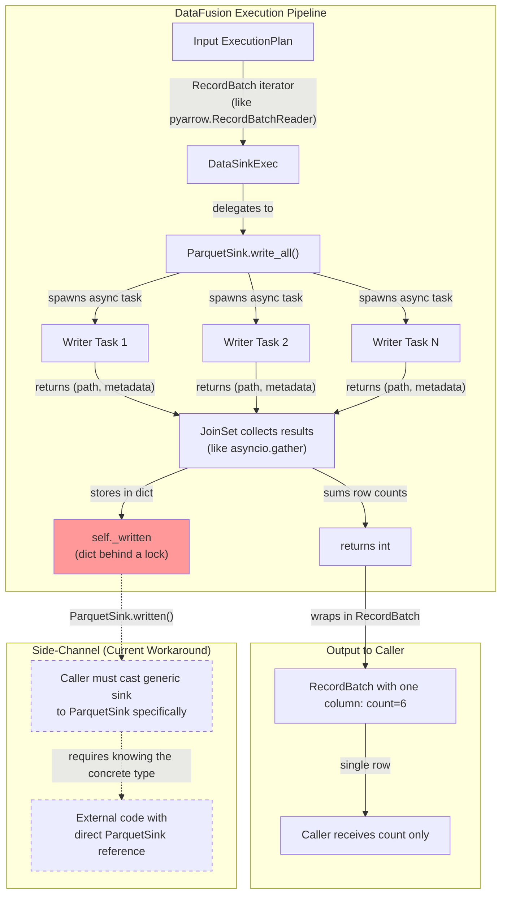
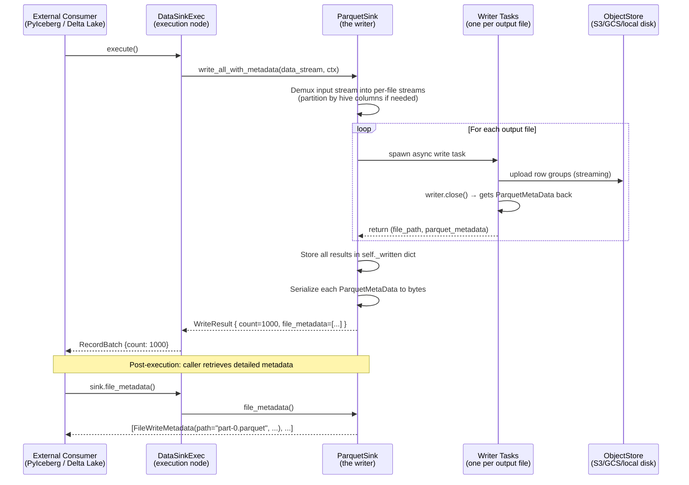
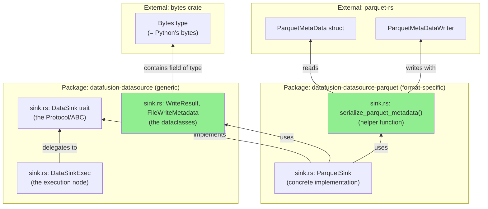
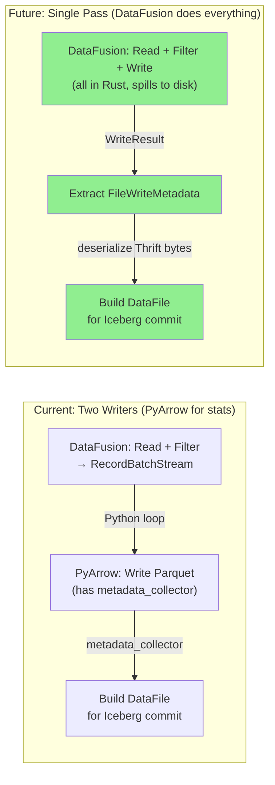

# DataFusion Issue #23472: Expose Per-File Parquet `FileMetaData` from Write Operations

## Problem Statement

**Issue:** https://github.com/apache/datafusion/issues/23472

DataFusion's `ParquetSink` already collects per-file `ParquetMetaData` during write
operations, but this metadata is inaccessible to external consumers through the standard
execution pipeline.

### The Python Analogy

Imagine you have a class that writes Parquet files:

```python
class ParquetSink:
    def __init__(self):
        # Internally tracks metadata for every file written
        # (this ALREADY exists in DataFusion's Rust code)
        self._written: dict[str, ParquetMetaData] = {}

    def write_all(self, data_stream) -> int:
        """Write all data. Returns ONLY the row count."""
        # ... writes files, populates self._written internally ...
        return total_row_count  # ← THIS IS THE PROBLEM: only returns an int

    def written(self) -> dict[str, ParquetMetaData]:
        """Side-channel: you can call this AFTER write_all, but only if you
        have a direct reference to this specific ParquetSink instance."""
        return self._written.copy()
```

The problem: the public interface (`write_all`) throws away the metadata. You'd have to
do something hacky like hold onto the `ParquetSink` instance and call `.written()` after
execution — which requires "downcasting" through DataFusion's generic type system.

**Consequence:** Any system that needs per-file column statistics after a DataFusion write
(column sizes, null counts, value bounds, split offsets) must bypass DataFusion's write
pipeline entirely and use a separate writer (e.g., PyArrow's `ParquetWriter` with
`metadata_collector`). This eliminates the possibility of single-pass write operations
where DataFusion performs read → transform → write with predicate pushdown and
spill-to-disk, then returns the Iceberg-required `DataFile` statistics.

---

## Rust-to-Python Glossary

Before diving in, here's a translation table for Rust concepts used throughout:

| Rust Concept | Python Equivalent | Explanation |
|-------------|-------------------|-------------|
| `trait DataSink` | `class DataSink(Protocol)` / ABC | An interface that defines required methods. Like `typing.Protocol` or `abc.ABC`. |
| `impl DataSink for ParquetSink` | `class ParquetSink(DataSink)` | A concrete class implementing the interface. |
| `async fn write_all(&self, ...) -> Result<u64>` | `async def write_all(self, ...) -> int` | An async method that returns a count or raises an error. `Result<T>` = returns `T` or raises. |
| `Arc<T>` | Shared reference (like Python's default object model) | Thread-safe reference-counted pointer. Python objects are already refcounted, so `Arc` ≈ normal Python variable. |
| `Mutex<HashMap<Path, ParquetMetaData>>` | `threading.Lock()` protecting a `dict[str, ParquetMetaData]` | A thread-safe dictionary. Only one thread can access it at a time. |
| `&dyn DataSink` | `DataSink` (type hint to the base class) | A reference to *any* type implementing `DataSink` — you don't know the concrete type. Like having a variable typed as the abstract base class. |
| `downcast_ref::<ParquetSink>()` | `isinstance(sink, ParquetSink)` + cast | Checking "is this actually a ParquetSink?" and then using ParquetSink-specific methods. |
| `#[derive(Debug, Clone)]` | `@dataclass` with `__repr__` and `copy()` | Auto-generates debug printing and cloning. |
| `pub struct FileWriteMetadata { ... }` | `@dataclass class FileWriteMetadata: ...` | A plain data container with named fields. |
| `Option<bytes::Bytes>` | `Optional[bytes]` / `bytes \| None` | A value that might be `None`. |
| `Vec<FileWriteMetadata>` | `list[FileWriteMetadata]` | A growable list/array. |
| `impl From<u64> for WriteResult` | `@classmethod def from_count(cls, count: int) -> WriteResult` | A conversion method — lets you create a `WriteResult` from just an `int`. |
| `SendableRecordBatchStream` | `Iterator[RecordBatch]` (but async + thread-safe) | A stream of Arrow RecordBatches that can be sent between threads. |
| `TaskContext` | `SessionContext` / execution environment | Runtime configuration: memory limits, object store registrations, etc. |
| `bytes::Bytes` | `bytes` | An immutable byte buffer. Exactly like Python's `bytes`. |
| `async_trait` | Built into Python (`async def`) | A macro that allows `async` methods in traits (Rust doesn't natively support this yet). |
| Default method on trait | Method with a body in ABC / Protocol | A method that has a default implementation — subclasses don't *have* to override it. |
| `JoinSet` | `asyncio.gather()` / `concurrent.futures` | Manages a set of spawned async tasks and collects their results. |
| Semver (semantic versioning) | Same concept | Breaking changes require bumping the major version number. |

---

## First Principles Analysis

### Information-Theoretic Foundation

**Axiom 1 (Conservation of Information):** When you write data to a Parquet file, the
writer *must* compute all the metadata (row counts, column min/max statistics, byte
offsets, null counts) — it's part of building the Parquet footer. Throwing this away
and making callers re-read it from disk is wasteful.

**Axiom 2 (Minimal Interface Principle):** An interface should expose exactly the
information that its operations produce. Returning only a row count from a write
operation is like a function that computes a full dictionary but returns only `len(result)`.

**Axiom 3 (Composability):** For a pipeline `Read → Transform → Write → Catalog_Update`
to work in a single pass, each stage must pass enough information forward. If `Write`
only passes a count, `Catalog_Update` (which needs column stats) must do a second pass.

### Mathematical Formulation

Think of it as functions:

```python
# The ACTUAL write operation (what physically happens):
def write(data_stream) -> dict[str, FileMetaData]:
    """Writes files, returns {path: metadata} for every file produced."""
    ...

# What the current interface EXPOSES:
def write_all(data_stream) -> int:
    """Calls write() internally, then returns sum(metadata.num_rows for all files)."""
    result = write(data_stream)
    return sum(m.num_rows for m in result.values())  # THROWS AWAY the dict!
```

The information loss is everything in `FileMetaData` beyond the row count:
- Per-column: `{min, max, null_count, num_values, compressed_size, uncompressed_size}` → 6 values × N columns
- Per-file: `{num_rows, num_row_groups, created_by, key_value_metadata, schema}`

For a table with 20 columns and 5 row groups, that's ~120 statistics values reduced to a single integer.

### Computational Complexity Argument

The metadata is computed during serialization with **zero additional cost**:
- **Current cost:** `time(write)` — the metadata is already built as part of writing the Parquet footer
- **Without this feature:** `time(write) + time(re-read_footer_from_storage)` — you'd need to open each file again over the network
- **Savings:** Eliminates `O(num_files × round_trip_to_object_store)` latency

In Python terms: it's like a function that computes an expensive result, stores it in
`self._cache`, returns only a summary, and then you call `read_from_disk()` to get back
what was already in memory.

---

## Architectural Analysis

### Current Data Flow (Status Quo)



**Reading this diagram:** Data flows top-to-bottom. The red box is where metadata gets
"stuck" — it's computed and stored, but the return path (the solid arrows) only carries
the integer count. The dashed arrows show the workaround: if you happen to have a
reference to the `ParquetSink` object and know its concrete type, you can reach in and
grab the metadata after the fact.

### The Problem in Plain Terms

Think of it like Python's duck typing vs. explicit protocols:

```python
# The INTERFACE (trait) says:
class DataSink(Protocol):
    async def write_all(self, data) -> int: ...

# The IMPLEMENTATION has more info:
class ParquetSink(DataSink):
    async def write_all(self, data) -> int:
        # ... internally builds self._written dict ...
        return count

    def written(self) -> dict[str, ParquetMetaData]:
        return self._written  # Extra method not in the Protocol!

# The EXECUTOR wraps it generically:
class DataSinkExec:
    def __init__(self, sink: DataSink):  # Only knows it's "some DataSink"
        self.sink = sink

    async def execute(self):
        count = await self.sink.write_all(data)
        return RecordBatch.from_pydict({"count": [count]})
        # ← No way to return metadata through this path!
```

The caller gets a `DataSinkExec` with a `sink: DataSink` field. Since it's typed as the
abstract `DataSink`, calling `self.sink.written()` would fail — that method doesn't exist
on the generic interface. You'd have to do:

```python
if isinstance(exec.sink, ParquetSink):
    metadata = exec.sink.written()  # ← The "downcast" workaround
```

This is fragile and undocumented.

### Design Constraint Analysis

| Constraint | Python Analogy | Implication |
|-----------|---------------|-------------|
| `DataSink` is a public trait | It's a `Protocol` that other packages implement | Can't change `write_all`'s return type without breaking everyone |
| Output schema is `{count: u64}` | The return type is `int` | Every downstream consumer expects a count |
| `ParquetSink.written()` already exists | The data is there, just not exposed cleanly | We don't need to compute anything new |
| `DataSinkExec.sink()` returns `&dyn DataSink` | Returns `DataSink` (base type), not `ParquetSink` | Callers can't access subclass methods without `isinstance` checks |
| External consumers need metadata | PyIceberg, Delta Lake, Hudi all need column stats | Clear demand from the ecosystem |
| Semver policy | Can't break existing users | New features must be additive |

---

## Solution Design

### Approach Selection (Decision Matrix)

| Approach | Breaking? | Complexity | Generality | Performance | Recommendation |
|----------|-----------|-----------|------------|-------------|---------------|
| A. Change `write_all` return type | **YES** — like changing `def f() -> int` to `def f() -> WriteResult` | Low | High | Zero overhead | ❌ Breaks all implementations |
| B. Add new method with default impl | No — like adding a new method to ABC with `pass` body | Medium | High | Zero overhead | ✅ **Selected** |
| C. Encode metadata into RecordBatch columns | No | High | Medium | Serialization cost | ❌ Forces new schema on everyone |
| D. Expose via plan properties | No | Medium | Low | Zero overhead | ❌ Non-standard |
| E. Add accessor method with default | No — like adding `def file_metadata(self) -> list: return []` | Low | Medium | Zero overhead | ✅ **Complementary** |

### Selected Design: Approach B + E (Composable, Non-Breaking)

In Python terms, the solution is:

```python
class DataSink(Protocol):
    # EXISTING (unchanged):
    async def write_all(self, data, context) -> int: ...

    # NEW (with default implementations — existing subclasses don't break):
    async def write_all_with_metadata(self, data, context) -> WriteResult:
        """Default: just delegates to write_all and returns empty metadata."""
        count = await self.write_all(data, context)
        return WriteResult(count=count, file_metadata=[])

    def file_metadata(self) -> list[FileWriteMetadata]:
        """Default: returns empty list. Override if you have metadata."""
        return []
```

The key insight: **adding methods with default implementations is non-breaking.** Every
existing `DataSink` implementation continues to work — they just return empty metadata
until they opt-in by overriding the new methods.

### Proposed Architecture

```mermaid
graph TD
    subgraph "DataSink Protocol (Extended)"
        T1["write_all(self, data, ctx) → int<br/>(UNCHANGED)"]
        T2["write_all_with_metadata(self, data, ctx) → WriteResult<br/>(NEW, has default)"]
        T3["file_metadata(self) → list[FileWriteMetadata]<br/>(NEW, has default)"]
        T1 -.->|"default body calls"| T2
        T2 -.->|"default body: calls write_all,<br/>returns WriteResult(count, [])"| T1
    end

    subgraph "WriteResult dataclass"
        WR["WriteResult:<br/>  count: int<br/>  file_metadata: list[FileWriteMetadata]"]
        FM["FileWriteMetadata:<br/>  path: str<br/>  row_count: int<br/>  byte_size: int<br/>  format_metadata: bytes | None"]
        WR --> FM
    end

    subgraph "ParquetSink (overrides the defaults)"
        PS1["write_all_with_metadata()"]
        PS2["Performs write (same as before)"]
        PS3["Serializes ParquetMetaData → bytes"]
        PS4["Returns WriteResult with populated metadata"]
        PS1 --> PS2 --> PS3 --> PS4
    end

    subgraph "DataSinkExec (Extended)"
        DSE1["execute() — unchanged, still returns count"]
        DSE2["Output: RecordBatch {count: 6}"]
        DSE3["sink property — unchanged"]
        DSE4["file_metadata() — new convenience method"]
        DSE1 --> DSE2
        DSE3 -.->|"delegates"| DSE4
    end

    style T2 fill:#90EE90
    style T3 fill:#90EE90
    style WR fill:#90EE90
    style FM fill:#90EE90
    style PS4 fill:#90EE90
    style DSE4 fill:#90EE90
```



---

## Detailed Design Specification

### Type Definitions

Below is the Rust code with line-by-line Python translation comments:

```rust
// ═══════════════════════════════════════════════════════════════════
// Python equivalent:
//
// @dataclass
// class FileWriteMetadata:
//     """Metadata about a single file written by a DataSink."""
//     path: str
//     row_count: int
//     byte_size: int
//     format_metadata: bytes | None
// ═══════════════════════════════════════════════════════════════════

/// Metadata about a single file written by a DataSink.
///                                          ↑ docstring (like Python's triple-quote)
///
/// This is format-agnostic: the `format_metadata` field contains
/// serialized format-specific metadata (e.g., Parquet's `FileMetaData`
/// serialized via thrift, or Arrow IPC footer bytes).
#[derive(Debug, Clone)]
//       ↑ auto-generates __repr__() and .copy() equivalents
pub struct FileWriteMetadata {
//  ↑ pub = public (accessible outside this module, like not having a _ prefix)
//      ↑ struct = dataclass (a plain container of named fields)
    /// The path where the file was written (relative to the sink's base path).
    pub path: String,
    //       ↑ field name: type  — like `path: str` in a dataclass

    /// Number of rows written to this specific file.
    pub row_count: u64,
    //            ↑ u64 = unsigned 64-bit integer (always ≥ 0, max ~18 quintillion)
    //              Python equivalent: int (Python ints have no upper bound)

    /// Total bytes written (compressed, on-disk size).
    pub byte_size: u64,

    /// Format-specific metadata, serialized as bytes.
    /// For Parquet: ThriftCompact-serialized `FileMetaData` (same format as footer).
    /// For other formats: None (or format-specific encoding).
    pub format_metadata: Option<bytes::Bytes>,
    //                   ↑ Option<T> = T | None in Python
    //                          ↑ bytes::Bytes = Python's `bytes` type
}

// ═══════════════════════════════════════════════════════════════════
// Python equivalent:
//
// @dataclass
// class WriteResult:
//     """Result of a write operation."""
//     count: int
//     file_metadata: list[FileWriteMetadata]
//
//     @classmethod
//     def count_only(cls, count: int) -> "WriteResult":
//         return cls(count=count, file_metadata=[])
// ═══════════════════════════════════════════════════════════════════

/// Result of a write operation, containing both aggregate statistics
/// and per-file metadata.
#[derive(Debug, Clone)]
pub struct WriteResult {
    /// Total number of rows written across all files.
    pub count: u64,
    /// Per-file metadata for each file written.
    pub file_metadata: Vec<FileWriteMetadata>,
    //                 ↑ Vec<T> = list[T] in Python
}

impl WriteResult {
// ↑ impl = "methods for this struct" (like defining methods inside a class)
    /// Create a WriteResult with only a count (no per-file metadata).
    pub fn count_only(count: u64) -> Self {
    //  ↑ pub fn = public function
    //                              ↑ Self = the type itself (like cls in @classmethod)
        Self {
            count,
            file_metadata: Vec::new(),
            //             ↑ Vec::new() = [] (empty list)
        }
    }
}

impl From<u64> for WriteResult {
// ↑ This lets you do: WriteResult::from(42)
//   Python equivalent: having __init__ accept just an int
//   or: WriteResult(count=42, file_metadata=[])
    fn from(count: u64) -> Self {
        Self::count_only(count)
    }
}
```

### Trait Extension (Non-Breaking)

```rust
// ═══════════════════════════════════════════════════════════════════
// Python equivalent:
//
// class DataSink(ABC):
//     """Interface for writing record batches to a destination."""
//
//     @abstractmethod
//     async def write_all(self, data, context) -> int:
//         """Write all data. Returns row count. MUST be implemented."""
//         ...
//
//     async def write_all_with_metadata(self, data, context) -> WriteResult:
//         """Write all data with metadata. Has a default body — override if you can."""
//         count = await self.write_all(data, context)
//         return WriteResult.count_only(count)
//
//     def file_metadata(self) -> list[FileWriteMetadata]:
//         """Post-hoc accessor. Has a default body — override if you can."""
//         return []
// ═══════════════════════════════════════════════════════════════════

#[async_trait]
// ↑ Macro that enables async methods in traits.
//   (Rust doesn't natively allow `async fn` in traits yet, so this macro
//   rewrites them into a compatible form. Python has no such restriction.)
pub trait DataSink: Any + DisplayAs + Debug + Send + Sync {
//  ↑ trait = Protocol/ABC
//            ↑ Any = allows runtime type checks (isinstance)
//                ↑ DisplayAs = has a __str__/__repr__ equivalent
//                     ↑ Debug = has a debug representation
//                          ↑ Send + Sync = safe to use across threads
//                            (Python's GIL handles this; Rust needs explicit markers)

    // ... existing methods unchanged ...

    /// Writes the data to the sink, returns the number of values written.
    /// (UNCHANGED — preserved for backward compatibility)
    async fn write_all(
        &self,
        // ↑ &self = self in Python (immutable borrow — the method can read self but
        //   not move/destroy it. In Python all method access is like this by default.)
        data: SendableRecordBatchStream,
        //   ↑ Think: AsyncIterator[RecordBatch] that is thread-safe
        context: &Arc<TaskContext>,
        //       ↑ &Arc<TaskContext> = shared reference to session config
        //         Like passing `session: SessionContext` in Python
    ) -> Result<u64>;
    // ↑ Result<u64> = either returns u64 (success) or an error
    //   Python equivalent: `-> int` (raises Exception on failure)
    //   The `;` means this method has NO default body — implementors MUST provide one.

    /// Writes data and returns detailed per-file metadata.
    ///
    /// Default implementation delegates to `write_all()` and returns
    /// a `WriteResult` with count only (no per-file metadata).
    /// Implementations that can provide file metadata should override this.
    async fn write_all_with_metadata(
        &self,
        data: SendableRecordBatchStream,
        context: &Arc<TaskContext>,
    ) -> Result<WriteResult> {
    //                      ↑ HAS a body (braces) = default implementation
    //                        Subclasses inherit this unless they override.
        let count = self.write_all(data, context).await?;
        //  ↑ let = variable binding (like assignment)
        //                                        ↑ .await = Python's `await`
        //                                              ↑ ? = if error, return it immediately
        //                                                (like `try: ... except: raise`)
        Ok(WriteResult::count_only(count))
        // ↑ Ok(...) = "success" — wraps the value in Result's success variant
        //   Python equivalent: just `return WriteResult.count_only(count)`
    }

    /// Returns metadata for files written during the last `write_all` call.
    ///
    /// This is a post-hoc accessor for implementations that collect metadata
    /// as a side effect. Default returns empty.
    fn file_metadata(&self) -> Vec<FileWriteMetadata> {
    // ↑ Not async (no `async` keyword) — a regular synchronous method
        Vec::new()
        // ↑ Returns [] (empty list)
        //   In Rust, the last expression without `;` is the return value.
        //   This is equivalent to `return []` in Python.
    }
}
```

### ParquetSink Implementation

```rust
// ═══════════════════════════════════════════════════════════════════
// Python equivalent:
//
// class ParquetSink(DataSink):
//     """Writes Parquet files. Overrides defaults to provide real metadata."""
//
//     def __init__(self):
//         self._written: dict[str, ParquetMetaData] = {}
//         self._lock = threading.Lock()
//
//     async def write_all_with_metadata(self, data, context) -> WriteResult:
//         count = await self._do_write(data, context)  # existing write logic
//         metadata = self.file_metadata()
//         return WriteResult(count=count, file_metadata=metadata)
//
//     def file_metadata(self) -> list[FileWriteMetadata]:
//         with self._lock:
//             return [
//                 FileWriteMetadata(
//                     path=str(path),
//                     row_count=meta.num_rows,
//                     byte_size=sum(rg.compressed_size for rg in meta.row_groups),
//                     format_metadata=serialize_parquet_metadata(meta),
//                 )
//                 for path, meta in self._written.items()
//             ]
// ═══════════════════════════════════════════════════════════════════

#[async_trait]
impl DataSink for ParquetSink {
// ↑ impl TRAIT for TYPE = "ParquetSink implements the DataSink interface"
//   Python: class ParquetSink(DataSink):

    // write_all unchanged (delegates to FileSink::write_all)
    // ↑ The existing write_all stays exactly the same — backward compat

    async fn write_all_with_metadata(
        &self,
        data: SendableRecordBatchStream,
        context: &Arc<TaskContext>,
    ) -> Result<WriteResult> {
        // Perform the write (same as write_all)
        let count = FileSink::write_all(self, data, context).await?;
        //         ↑ FileSink::write_all = calling the parent/sibling trait's method
        //           Python equivalent: super().write_all(data, context)
        //           (FileSink is another trait that ParquetSink also implements)

        // Extract per-file metadata from self.written
        let file_metadata = self.file_metadata();

        Ok(WriteResult {
            count,
            //↑ Rust shorthand: when variable name matches field name, you can omit `count: count`
            file_metadata,
        })
    }

    fn file_metadata(&self) -> Vec<FileWriteMetadata> {
        let written = self.written.lock();
        //           ↑ .lock() = acquire the mutex (like `with self._lock:` in Python)
        //             This gives us exclusive access to the HashMap inside

        written
            .iter()
            // ↑ .iter() = iterate over (key, value) pairs
            //   Like: `for path, parquet_meta in self._written.items():`
            .map(|(path, parquet_meta)| {
            // ↑ .map() = list comprehension / generator expression
            //   |(path, parquet_meta)| = closure args (like `lambda path, meta: ...`)
            //   The | | delimiters are Rust's closure argument syntax

                // Serialize ParquetMetaData's FileMetaData to Thrift bytes
                // This is the same format as the Parquet footer
                let format_metadata = serialize_parquet_metadata(parquet_meta);

                let row_count = parquet_meta.file_metadata().num_rows() as u64;
                //              ↑ .file_metadata() = getter for the file-level metadata
                //                                   .num_rows() = total rows in file
                //                                                 ↑ as u64 = type cast
                //                                                   (like int(x) in Python)

                let byte_size: u64 = parquet_meta
                    .row_groups()
                    // ↑ Returns list of row group metadata
                    .iter()
                    .map(|rg| rg.compressed_size() as u64)
                    // ↑ Like: [rg.compressed_size for rg in meta.row_groups()]
                    .sum();
                    // ↑ Like: sum(...)

                FileWriteMetadata {
                    path: path.to_string(),
                    row_count,
                    byte_size,
                    format_metadata: Some(format_metadata),
                    //               ↑ Some(x) = x (the "is present" variant of Option)
                    //                 None variant would mean "no metadata available"
                    //                 Python equivalent: just `format_metadata` (not None)
                }
            })
            .collect()
            // ↑ .collect() = materialize the iterator into a Vec (list)
            //   Like: list(generator_expression)
    }
}

/// Serialize ParquetMetaData to bytes using Thrift compact protocol.
/// This produces the same byte representation as a Parquet file footer,
/// enabling consumers to deserialize with standard Parquet libraries.
fn serialize_parquet_metadata(metadata: &ParquetMetaData) -> bytes::Bytes {
// ↑ fn = function (standalone, not a method)
//   &ParquetMetaData = immutable reference (like passing without modifying)
//   -> bytes::Bytes = returns bytes

    // Use parquet-rs's built-in serialization
    let mut buf = Vec::new();
    //  ↑ mut = mutable (in Rust, variables are immutable by default)
    //          Vec::new() = bytearray() / io.BytesIO()

    parquet::file::metadata::ParquetMetaDataWriter::new(&mut buf, metadata)
    //                                              ↑ Creates a writer that will
    //                                                write into `buf`
        .finish()
        // ↑ Flush/finalize the serialization
        .expect("ParquetMetaData serialization should not fail for valid metadata");
        // ↑ .expect() = unwrap or panic with message
        //   Python equivalent: assert result is not None, "message"
        //   Used when failure indicates a programming bug, not a user error

    bytes::Bytes::from(buf)
    // ↑ Convert the mutable buffer to an immutable Bytes
    //   Like: bytes(bytearray_buffer)
}
```

### Why Bytes Instead of the Typed Struct?

The `format_metadata` field is `Option<bytes>` (serialized) rather than the typed
`ParquetMetaData` struct. Here's why:

```python
# Imagine this module structure:
#
# datafusion-datasource/     ← Generic package (doesn't know about Parquet)
#   └── sink.py              ← Defines DataSink protocol + FileWriteMetadata
#
# datafusion-datasource-parquet/  ← Parquet-specific package
#   └── sink.py              ← Defines ParquetSink, imports DataSink
#
# If FileWriteMetadata contained ParquetMetaData directly:
#   datafusion-datasource would need to import parquet  ← CIRCULAR / unwanted dependency
#
# Solution: use `bytes` — everyone can handle raw bytes without format-specific imports.
# The parquet-specific crate serializes metadata → bytes.
# Consumers deserialize bytes → ParquetMetaData in their own code.
```

This is the same pattern used everywhere in the Parquet ecosystem: the footer of a
Parquet file IS Thrift-serialized `FileMetaData`. We're just exposing those same bytes
without requiring the generic interface to know what Parquet is.

---

## Formal Correctness Properties

### Theorem 1: Backward Compatibility

**Claim:** For any existing `DataSink` implementation that does NOT override
`write_all_with_metadata`:

```python
# For any sink `s` and any input data:
result = await s.write_all_with_metadata(data, ctx)
assert result.count == await s.write_all(data, ctx)
assert result.file_metadata == []
```

**Proof:** The default implementation literally does:
```python
async def write_all_with_metadata(self, data, context):
    count = await self.write_all(data, context)
    return WriteResult(count=count, file_metadata=[])
```

No existing implementation is affected.

### Theorem 2: Information Preservation

**Claim:** For `ParquetSink` specifically:

```python
result = await parquet_sink.write_all_with_metadata(data, ctx)

# The count is the sum of all per-file row counts:
assert result.count == sum(f.row_count for f in result.file_metadata)

# Each file's metadata can be deserialized back to full ParquetMetaData:
for f in result.file_metadata:
    meta = deserialize_parquet_metadata(f.format_metadata)
    assert meta.num_rows == f.row_count
    assert meta.schema is not None
    assert len(meta.row_groups) > 0
```

**Proof:** The metadata is extracted from `self._written` which is populated by the
same write tasks that produce the count. The serialization round-trips losslessly
(guaranteed by the `parquet-rs` Thrift implementation).

### Theorem 3: Zero Additional I/O

**Claim:** No extra network/disk operations.

**Proof:** `ParquetMetaData` is already computed by the Parquet writer when it
constructs the file footer (the last thing written to every Parquet file). The current
code already stores it in `self._written` (the `HashMap::insert` already exists).
This proposal just exposes what's already there through the public interface.

---

## Sequence Diagram: End-to-End Flow



---

## Alternative Considered and Rejected: RecordBatch-Based Return

An alternative was to change the output RecordBatch to include metadata columns:

```python
# Instead of:
#   RecordBatch: {"count": [1000]}
# Return:
#   RecordBatch: {"path": ["part-0.parquet", "part-1.parquet"],
#                 "row_count": [500, 500],
#                 "byte_size": [4096, 4096],
#                 "format_metadata": [b"...", b"..."]}
```

**Why rejected:**
1. **Breaking change** — every downstream consumer expects `{count: int}`, including SQL clients showing "6 rows inserted"
2. **Impedance mismatch** — `INSERT INTO table VALUES ...` in SQL should return a count, not a multi-row table
3. **Unnecessary serialization** — forces all consumers to handle binary columns even if they don't need metadata
4. **Schema bloat** — different formats (CSV, JSON, Parquet) would need different schemas

---

## Implementation Plan

### Phase 1: Core Types and Trait Extension

**File:** `datafusion/datasource/src/sink.rs`

**What changes:**
1. Add `FileWriteMetadata` struct (the `@dataclass` shown above)
2. Add `WriteResult` struct (the other `@dataclass`)
3. Add `write_all_with_metadata` as a default method on the `DataSink` trait
4. Add `file_metadata` as a default method on the `DataSink` trait

**Why this is safe:** Both new methods have default implementations (return empty/delegate). No existing code breaks.

### Phase 2: ParquetSink Implementation

**File:** `datafusion/datasource-parquet/src/sink.rs`

**What changes:**
1. Override `file_metadata()` — reads from `self.written` (the existing `HashMap`), serializes each `ParquetMetaData` to bytes
2. Override `write_all_with_metadata()` — calls existing write logic, then calls `file_metadata()` to build the result
3. Add `serialize_parquet_metadata()` helper function

**Design decision: serialized bytes vs. typed struct?**

| Option | Analogy in Python | Trade-off |
|--------|------------------|-----------|
| Return raw `ParquetMetaData` | `def metadata() -> ParquetMetaData` | Requires `import parquet` in the generic module |
| Return `bytes` | `def metadata() -> bytes` | Format-agnostic, consumer deserializes | 

**Selected: bytes** — keeps the generic `DataSink` trait free of Parquet-specific types.
The `ParquetSink` still exposes `written() -> dict[Path, ParquetMetaData]` for Rust
consumers who want the typed version.

### Phase 3: Convenience Accessor on DataSinkExec

**File:** `datafusion/datasource/src/sink.rs`

**What changes:**
1. Add `pub fn file_metadata(&self) -> Vec<FileWriteMetadata>` on `DataSinkExec`
2. It just calls `self.sink.file_metadata()` — pure delegation

**Why:** Saves callers from needing to downcast. It's like adding a property on the
executor that forwards to the sink:

```python
class DataSinkExec:
    @property
    def file_metadata(self) -> list[FileWriteMetadata]:
        return self.sink.file_metadata()
```

### Phase 4: Tests

**Test cases:**
1. `write_all_with_metadata` returns same count as `write_all` (no regression)
2. Returns correct number of `FileWriteMetadata` entries (one per output file)
3. Each entry's `row_count` is correct
4. Each entry's `byte_size` > 0
5. `format_metadata` deserializes back to valid `ParquetMetaData` (round-trip)
6. Partitioned writes (e.g., `PARTITION BY year`) produce one entry per partition file
7. A plain `MemSink` (non-Parquet) returns empty metadata (default impl works)
8. Calling `file_metadata()` multiple times returns the same result (idempotent)

---

## Computer Science Theory Integration

### Type Theory: Liskov Substitution Principle (LSP)

LSP says: if `S` is a subtype of `T`, then objects of type `T` can be replaced with
objects of type `S` without breaking the program.

In Python terms: if you have code that works with `DataSink`, it should work with
`ParquetSink` too. Our design satisfies this because:
- The new methods have default implementations
- The default behavior (empty metadata) is valid and doesn't break any contract
- `ParquetSink` enriches the behavior but doesn't violate any existing expectation

### Information Theory: Don't Re-encode What You Already Have

The metadata serialization uses Thrift Compact Protocol — the **exact same encoding**
used in Parquet file footers. This means:
- No new serialization format to invent or maintain
- Every Parquet library in every language already has a decoder
- The encoding is efficient (Thrift compact is ~1.1× entropy for structured metadata)
- You can literally take these bytes and append them to build a valid Parquet footer

### Distributed Systems: Happens-Before Guarantee

The metadata is collected from the same write tasks that produce the files:

```
file_uploaded_to_S3(path)  →  writer.close()  →  ParquetMetaData returned
                                                        ↓
                                              inserted into self._written
                                                        ↓
                                              write_all_with_metadata returns
```

**Guarantee:** If `write_all_with_metadata` returns successfully, ALL files listed in
`file_metadata` are durably written to storage. You will never get metadata for a file
that wasn't actually written. If any file fails, the whole operation returns an error.

### Amortized Analysis: True Zero-Cost

"Zero-cost" means the feature adds no overhead when not used, and minimal overhead when used:

| Operation | Cost | Already present? |
|-----------|------|-----------------|
| `HashMap::insert` per file | O(1) amortized | ✅ YES — already in current code |
| Lock acquisition | O(1) | ✅ YES — already in current code |
| Thrift serialization | O(metadata_size) ≈ O(N×R×100 bytes) | NEW — but only when `file_metadata()` is called |
| Additional I/O | O(0) — none | N/A |

If nobody calls `file_metadata()`, the only cost is what's already there. The Thrift
serialization (~1KB per file for a typical schema) only happens when explicitly requested.

---

## Dependency Graph



**Key insight:** The green (new) code is minimal. The generic package only adds two
simple dataclasses and two methods with default bodies. The Parquet-specific package
adds one override and one helper function.

---

## Risk Assessment

| Risk | Likelihood | Impact | Mitigation |
|------|-----------|--------|------------|
| Maintainers say "premature — wait for more demand" | Medium | High | Show concrete consumers: PyIceberg PR, Delta-RS interest |
| Debate over bytes vs. typed metadata | Medium | Medium | Propose bytes, offer to add typed alternative too |
| Concern about trait bloat | Medium | Low | Only 2 methods added, both with defaults |
| Performance regression worry | Low | Low | Prove it's zero-cost (metadata already computed) |
| Alternative design preferred | Medium | Medium | Present multiple options in PR, let maintainers choose |
| parquet-rs `ParquetMetaDataWriter` instability | Low | Medium | It's already used internally; pin version if needed |

---

## PR Strategy

### PR Title
```
Datasource: Add `write_all_with_metadata` to `DataSink` for per-file metadata exposure
```

### PR Description (Draft)

```markdown
## Which issue does this PR close?

Closes #23472

## Rationale for this change

External table formats (Apache Iceberg, Delta Lake, Apache Hudi) require per-file
column statistics (column_sizes, null_counts, lower/upper bounds, split_offsets) when
committing written files to their catalogs. Currently, `ParquetSink` computes and stores
this metadata internally (`self.written`) but the `DataSink` trait only returns a row
count — forcing external consumers to either:

1. Bypass DataFusion's write pipeline entirely (use PyArrow/parquet-rs directly)
2. Re-read Parquet footers after writing (additional I/O round-trips)
3. Downcast `DataSinkExec.sink()` to `ParquetSink` and call `written()` (fragile)

This PR adds a standard, non-breaking mechanism to expose per-file metadata.

## What changes are included in this PR?

1. **New types** in `datafusion-datasource`:
   - `FileWriteMetadata`: path + row_count + byte_size + format-specific metadata bytes
   - `WriteResult`: count + Vec<FileWriteMetadata>

2. **Trait extension** (non-breaking, default implementations):
   - `DataSink::write_all_with_metadata()` → `Result<WriteResult>` (default: wraps `write_all`)
   - `DataSink::file_metadata()` → `Vec<FileWriteMetadata>` (default: empty)

3. **ParquetSink implementation**:
   - Overrides both methods using existing `self.written` HashMap
   - Serializes `ParquetMetaData` to Thrift bytes (same format as Parquet footer)

4. **DataSinkExec convenience**:
   - `file_metadata()` method that delegates to the inner sink

## Are these changes tested?

Yes — tests verify:
- Backward compatibility (existing `write_all` behavior unchanged)
- Correct metadata count matches written files
- Metadata deserializes back to valid `ParquetMetaData`
- Partitioned writes produce per-partition metadata
- Default implementation returns empty metadata

## Are there any user-facing changes?

New public API surface (additive only, no breaking changes):
- `DataSink::write_all_with_metadata()` method
- `DataSink::file_metadata()` method
- `FileWriteMetadata` struct
- `WriteResult` struct
- `DataSinkExec::file_metadata()` convenience method
```

---

## Relation to PyIceberg Work

Once this PR lands, the PyIceberg DataFusion backend can implement single-pass CoW delete:



**What this enables for PyIceberg:**
- Eliminates the Python `for batch in stream: writer.write(batch)` loop entirely
- DataFusion handles read → filter → write in a single Rust execution plan with predicate pushdown
- Spill-to-disk means the operation won't OOM on large files
- Memory footprint drops from `O(file_size)` to `O(configured_memory_limit)`
- We get the column statistics we need from `WriteResult.file_metadata` without re-reading

---

## Open Questions for PR Discussion

1. **Should `format_metadata` be `bytes | None` or `Any`?**
   - `bytes`: format-agnostic, consumers must know the serialization format
   - `Any`: allows typed access (`meta.downcast::<ParquetMetaData>()`) but complicates the API
   - **Recommendation:** `bytes` — it's simpler, and the serialization format (Thrift) is already standard

2. **Should the output RecordBatch change?**
   - **Recommendation:** No — keep `{count: int}` for SQL compatibility. Metadata lives on the sink object.

3. **Should ParquetSink keep its existing `written()` method?**
   - **Recommendation:** Yes — Rust consumers who want the typed `ParquetMetaData` (not bytes) keep using `written()`. The new `file_metadata()` is for generic consumers.

4. **Should `file_metadata()` clear internal state?**
   - **Recommendation:** No — it should be idempotent (calling it twice returns the same result). The existing `written()` already returns a clone, follow that pattern.
