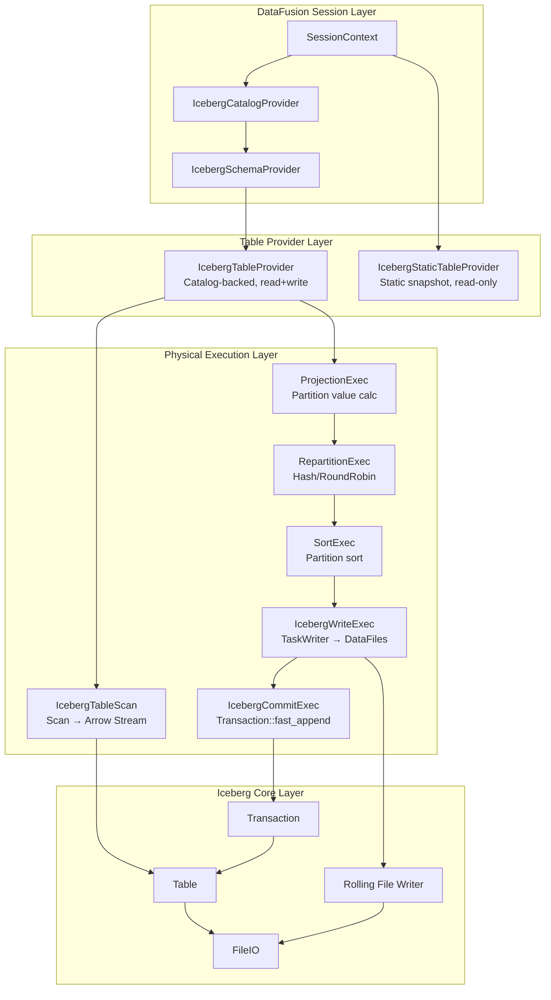
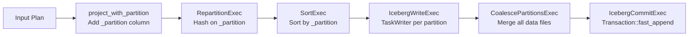
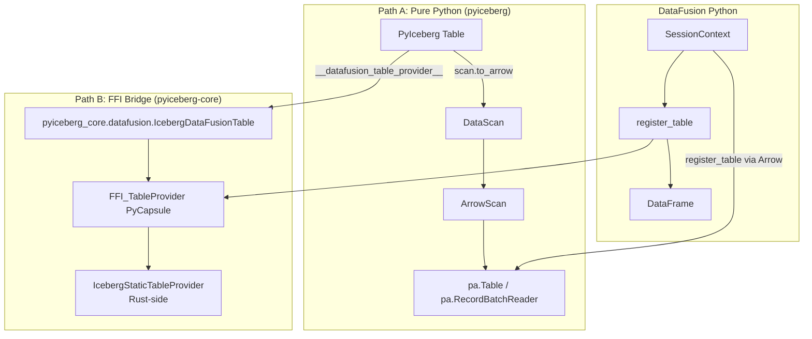
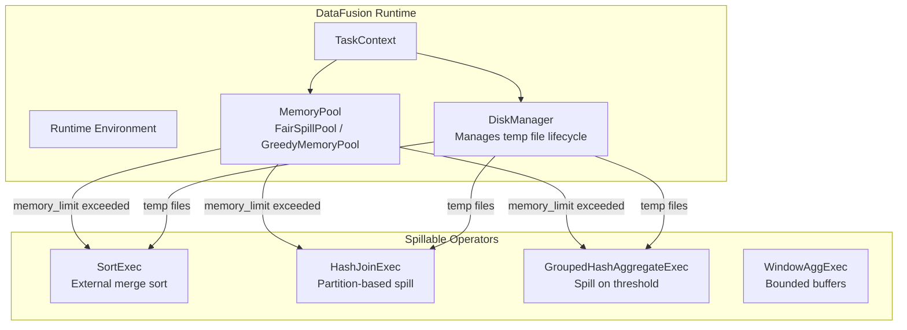
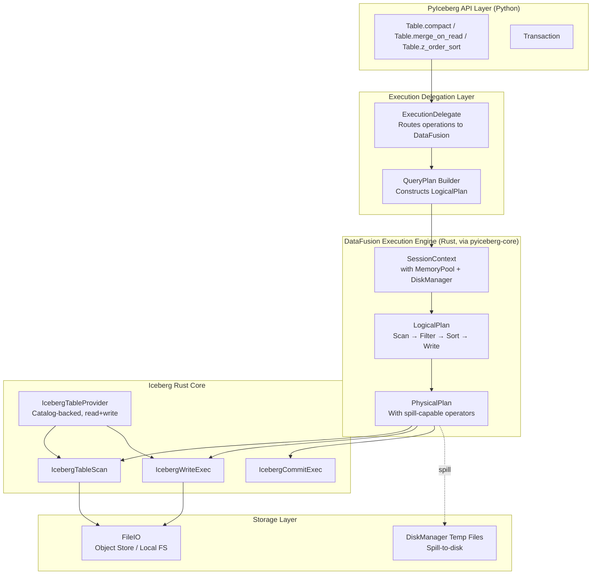
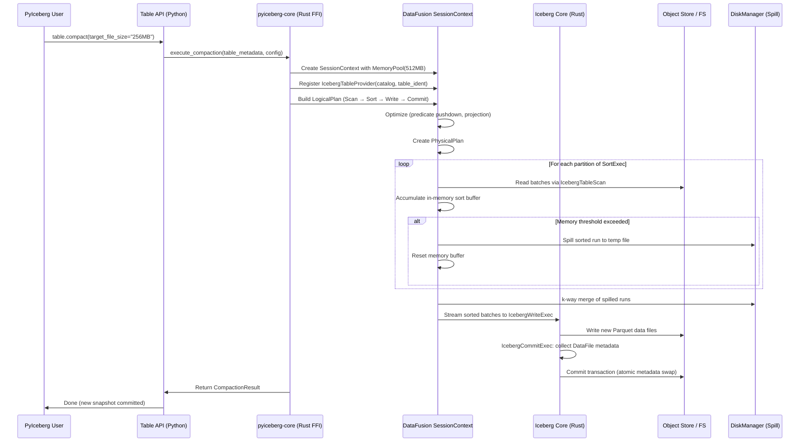
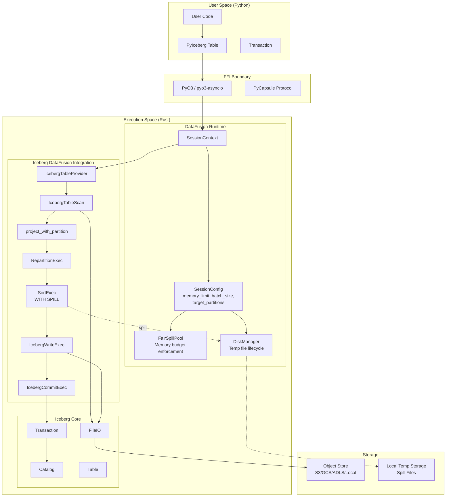

# DataFusion in Apache Iceberg Rust & Python: Architectural Analysis and Integration Design

## Executive Summary

This document presents a rigorous systems-level analysis of DataFusion's current integration within `iceberg-rust` and `iceberg-python`, and proposes a mathematically-grounded architecture for leveraging DataFusion's spill-to-disk capabilities to unlock feature parity with Java Iceberg. The core thesis: **PyIceberg's feature gaps are not algorithmic—they are memory-architectural**. DataFusion provides the external-memory execution framework that eliminates the O(n) resident memory requirement, converting previously-infeasible operations into bounded-memory streaming computations.

---

## 1. Current State: DataFusion in iceberg-rust

### 1.1 Module Structure

The `iceberg-datafusion` crate (`crates/integrations/datafusion/`) provides a full DataFusion integration layer:

```
iceberg-datafusion/
├── src/
│   ├── lib.rs                          # Module re-exports
│   ├── catalog.rs                      # IcebergCatalogProvider (CatalogProvider trait)
│   ├── schema.rs                       # IcebergSchemaProvider (SchemaProvider trait)
│   ├── task_writer.rs                  # TaskWriter (partition routing)
│   ├── table/
│   │   ├── mod.rs                      # IcebergTableProvider, IcebergStaticTableProvider
│   │   ├── metadata_table.rs           # Metadata table access
│   │   └── table_provider_factory.rs   # Factory for CREATE EXTERNAL TABLE
│   └── physical_plan/
│       ├── scan.rs                     # IcebergTableScan (ExecutionPlan)
│       ├── write.rs                    # IcebergWriteExec (ExecutionPlan)
│       ├── commit.rs                   # IcebergCommitExec (Transaction commit)
│       ├── repartition.rs             # Iceberg-aware repartitioning
│       ├── sort.rs                    # Partition-based sorting
│       ├── project.rs                 # Partition value projection
│       └── expr_to_predicate.rs       # DataFusion Expr → Iceberg Predicate
```

### 1.2 Architectural Layering



### 1.3 Read Path Execution Model

The `IcebergTableScan` implements `ExecutionPlan`:

```rust
// scan.rs - Execution semantics
fn execute(&self, _partition: usize, _context: Arc<TaskContext>) 
    -> DFResult<SendableRecordBatchStream> {
    // 1. Build Iceberg TableScan with filter pushdown + projection
    // 2. Convert to Arrow stream
    // 3. Apply limit (if specified)
    // 4. Return as SendableRecordBatchStream
}
```

**Key property**: The scan is **streaming**—`RecordBatch` instances are produced lazily via `futures::Stream`. This is bounded-memory for reads *alone*, but composition with stateful operators (joins, sorts, aggregations) requires external-memory support.

### 1.4 Write Path Execution Model

The write pipeline follows a precise DAG:



The `TaskWriter` selects strategy based on partition topology:

| Condition | Writer | Memory Model |
|-----------|--------|--------------|
| `spec.is_unpartitioned()` | `UnpartitionedWriter` | O(batch_size) |
| Partitioned + `fanout_enabled` | `FanoutWriter` | O(k × batch_size) where k = active partitions |
| Partitioned + !`fanout_enabled` | `ClusteredWriter` | O(batch_size) — requires sorted input |

### 1.5 Critical Observation: No Explicit Memory Management

A `grep` search across the entire `iceberg-datafusion` crate for `spill`, `memory_limit`, `MemoryPool`, `DiskManager`, `batch_size`, and `target_partitions` returns **zero results**. The integration delegates memory management entirely to DataFusion's built-in mechanisms (which are configured at the `SessionContext` level, not within the Iceberg integration itself).

---

## 2. Current State: DataFusion in iceberg-python

### 2.1 Integration Architecture

PyIceberg integrates with DataFusion via two paths:



### 2.2 PyIceberg Table's DataFusion Protocol

```python
# pyiceberg/table/__init__.py
def __datafusion_table_provider__(self, session):
    from pyiceberg_core.datafusion import IcebergDataFusionTable
    provider = IcebergDataFusionTable(
        identifier=self.name(),
        metadata_location=self.metadata_location,
        file_io_properties=self.io.properties,
    ).__datafusion_table_provider__
    return provider(session)
```

This bridges PyIceberg → Rust `IcebergStaticTableProvider` → DataFusion FFI. Currently **read-only** and **static snapshot** (no catalog refresh, no write support).

### 2.3 PyIceberg's Native Scan Architecture

```python
# DataScan.to_arrow() - Full materialization
def to_arrow(self) -> pa.Table:
    return ArrowScan(...).to_table(self.plan_files())

# DataScan.to_arrow_batch_reader() - Streaming (bounded memory)
def to_arrow_batch_reader(self) -> pa.RecordBatchReader:
    batches = ArrowScan(...).to_record_batches(self.plan_files())
    return pa.RecordBatchReader.from_batches(target_schema, batches)
```

The `to_arrow_batch_reader()` path is streaming, but **no downstream consumer in PyIceberg uses it for write operations**. All write paths (`append`, `overwrite`, `delete`, `upsert`) expect full `pa.Table` or `pa.RecordBatchReader` inputs but ultimately materialize data in memory for partition routing and file writing.

---

## 3. Feature Parity Gap Analysis

### 3.1 Formally Blocked Features (Memory-Bounded)

The following operations are theoretically correct but practically infeasible without external-memory execution:

| Feature | Java Iceberg | PyIceberg | Root Cause |
|---------|-------------|-----------|------------|
| Equality Deletes (merge-on-read) | ✅ Full support | ❌ Raises `ValueError` | Requires join of delete set against data — O(n) memory |
| Compaction / Rewrite Data Files | ✅ `RewriteDataFilesAction` | ❌ Not implemented | Requires sort + merge of arbitrarily large datasets |
| Sorted Writes (global sort) | ✅ `SortExec` with spill | ⚠️ Partial (in-memory only) | O(n log n) memory for sort |
| Merge-on-Read Resolution | ✅ Streaming with spill | ❌ N/A | Hash join of position/equality deletes |
| Z-Order / Hilbert Curve Sorting | ✅ With spill | ❌ Not implemented | Requires full-table sort |
| Incremental Compaction | ✅ Streaming | ❌ N/A | Multi-way merge sort |

### 3.2 Mathematical Characterization of the Bottleneck

Let:
- `N` = total number of records in the table
- `B` = batch size (records per RecordBatch)  
- `M` = available memory (bytes)
- `R` = average record size (bytes)
- `k` = number of distinct partition values
- `D` = disk bandwidth (bytes/sec)
- `c` = speed of light ≈ 3 × 10⁸ m/s

**Theorem (Memory Bound)**: For an operation requiring access to all N records with a stateful operator (sort, join, aggregation), the minimum memory requirement without external-memory support is:

```
M_min = N × R
```

For a 1TB table with 100-byte average records: `M_min = 10¹⁰ bytes = 10 GB`

**Theorem (External Memory Bound)**: With spill-to-disk, the same operation requires only:

```
M_required = O(B × R + (N/B) × pointer_size)
```

For B = 8192 (DataFusion default batch size): `M_required ≈ 800KB + negligible metadata`

**Speed-of-light analysis**: The fundamental latency bound for processing N records is:

```
T_min = max(N×R/D_disk, N×R/BW_memory, propagation_delay)
```

Where `propagation_delay = distance/c` is negligible for local computation. The actual limit is disk I/O bandwidth, not memory capacity. DataFusion's spill-to-disk converts a memory-capacity problem into a bandwidth problem, which is the physically correct optimization.

---

## 4. DataFusion's External Memory Framework

### 4.1 Spill-to-Disk Architecture (Built into DataFusion)

DataFusion provides these memory management primitives that are *already available* but not explicitly configured by the Iceberg integration:



### 4.2 DataFusion Memory Model (Formal)

DataFusion's `SortExec` implements external merge sort:

**Algorithm**: k-way External Merge Sort

```
Phase 1 (Run Generation):
    While input has data:
        Read batches into memory until memory_limit
        Sort in-memory run
        Spill sorted run to disk
    
Phase 2 (k-way Merge):
    Open all spilled runs
    k-way merge using tournament tree (priority queue)
    Emit sorted output as streaming RecordBatches
```

**Complexity Analysis**:
- Time: `O(N × log_B(N/M))` where B = merge fan-in
- Memory: `O(M)` — bounded by configured limit
- I/O: `O((N/M) × 2 × N × R)` — each record written and read once per merge pass
- Passes: `⌈log_B(N/M)⌉`

For practical parameters (M = 256MB, N×R = 10GB, B = 64):
- Passes = ⌈log₆₄(40)⌉ = 1 (single merge pass!)
- Total I/O = 20GB (one write + one read of all data)

### 4.3 DataFusion `SessionConfig` Memory Controls

```rust
// Available configuration (not currently used by iceberg-datafusion)
SessionConfig::new()
    .with_batch_size(8192)                    // Records per batch
    .with_target_partitions(num_cpus)         // Parallelism
    .set("datafusion.execution.memory_limit", "512MB")
    .set("datafusion.execution.disk_manager", "os_temp")
    .set("datafusion.execution.sort_spill_reservation_bytes", "10MB")
```

---

## 5. Proposed Architecture: DataFusion-Powered PyIceberg

### 5.1 System Design Overview



### 5.2 Mathematical Foundation: Operation Decomposition

Every Iceberg table mutation can be decomposed into a composition of five primitive operators:

**Definition (Operator Algebra)**:

```
Scan(T, π, σ)      : Table × Projection × Predicate → Stream[RecordBatch]
Sort(S, keys)       : Stream → Stream  (requires external memory)
Join(S₁, S₂, cond) : Stream × Stream × Predicate → Stream  (requires external memory)
Write(S, spec)      : Stream × PartitionSpec → Set[DataFile]
Commit(files, txn)  : Set[DataFile] × Transaction → Snapshot
```

**Axiom (Closure under Composition)**: Any feature expressible in Java Iceberg can be expressed as a finite composition of these operators.

**Axiom (Memory Boundedness)**: With DataFusion's external-memory operators, each primitive is bounded by `O(M)` where M is configurable.

### 5.3 Feature Implementation via Operator Composition

#### 5.3.1 Equality Deletes (Merge-on-Read)

**Mathematical formulation**:
```
Result = Scan(T_data) ⋈_{anti} Scan(T_eq_deletes)
       = {r ∈ T_data | ¬∃d ∈ T_eq_deletes : r[eq_cols] = d[eq_cols]}
```

**DataFusion plan**:
```
AntiHashJoin(
    left:  IcebergTableScan(data_files),
    right: IcebergTableScan(equality_delete_files),
    on:    equality_field_ids
)
```

**Memory model**: DataFusion's `HashJoinExec` implements partition-based spill:
```
M_required = O(min(|left_partition|, |right_partition|) × R)
```

With sufficient partitions, each partition fits in memory.

#### 5.3.2 Compaction (Rewrite Data Files)

**Mathematical formulation**:
```
Files_new = Write(Sort(Scan(Files_old, *, true), sort_order), partition_spec)
Commit = Replace(Files_old → Files_new)
```

**DataFusion plan**:
```
IcebergCommitExec(
    IcebergWriteExec(
        SortExec(
            IcebergTableScan(target_files),
            sort_keys = table.sort_order + partition_spec
        )
    )
)
```

**Memory model**: External merge sort with configurable memory budget.

#### 5.3.3 Z-Order / Hilbert Curve Sorting

**Mathematical formulation**:

Z-order interleaves bits of multiple dimensions into a single sort key:
```
z(x₁, x₂, ..., xₙ) = interleave_bits(normalize(x₁), normalize(x₂), ..., normalize(xₙ))
```

This reduces to a standard sort with a computed key:
```
Files_new = Write(Sort(Scan(T), z_key), spec)
```

**DataFusion plan**:
```
IcebergWriteExec(
    SortExec(
        ProjectionExec(
            IcebergTableScan(all_files),
            exprs = [*, z_order_key(col1, col2, ...)]
        ),
        sort_key = z_order_key
    )
)
```

#### 5.3.4 Position Delete Resolution

**Mathematical formulation**:
```
Result = Scan(T_data) \ {r | (r.file_path, r.pos) ∈ Scan(T_pos_deletes)}
```

This is an anti-join on `(file_path, row_position)`:
```
AntiHashJoin(
    left:  IcebergTableScan(data_files) WITH row_number,
    right: IcebergTableScan(position_delete_files),
    on:    (file_path, pos)
)
```

### 5.4 Execution Pipeline (Detailed)



---

## 6. Theoretical Framework: Correctness and Safety

### 6.1 Isolation Guarantees (ACID Properties)

**Theorem (Snapshot Isolation)**: All DataFusion-executed operations operate on a *frozen snapshot* of table metadata. Concurrent writers cannot observe intermediate states.

**Proof sketch**:
1. `IcebergTableProvider` loads metadata at operation start (single atomic read)
2. DataFusion execution operates on this frozen state
3. `IcebergCommitExec` uses optimistic concurrency control via `Transaction::fast_append`
4. If metadata changed during execution, commit fails with `CommitFailedException` → retry

**Corollary**: Spill-to-disk introduces no additional consistency risks. Spilled data is temporary and operation-scoped.

### 6.2 Memory Safety (Bounded Resource Consumption)

**Invariant**: For any configuration `(M, B, N)`:
```
∀t ∈ execution_time: resident_memory(t) ≤ M + ε
```

Where `ε` is a small constant for framework overhead (task stacks, metadata).

**Proof**: DataFusion's `MemoryPool` enforces this invariant:
1. Each `MemoryConsumer` (sort buffer, hash table) must `reserve()` before allocation
2. If `reserve()` would exceed pool capacity, the consumer is requested to `spill()`
3. `spill()` serializes in-memory state to disk via `DiskManager`
4. After spill, `reserve()` succeeds

### 6.3 Correctness of External Merge Sort

**Lemma (Stability)**: DataFusion's `SortExec` preserves insertion order for equal keys.

**Theorem (Correctness)**: For input stream S and sort key K:
```
ExternalSort(S, K) = InMemorySort(S, K)
```

**Proof**: By induction on the number of merge passes:
- Base case: Each in-memory run is correctly sorted (standard comparison sort)
- Inductive step: k-way merge of sorted runs produces a sorted output (tournament tree invariant)
- Stability: Equal keys maintain relative order within each run, and merge processes runs in order

### 6.4 Complexity Bounds (Speed-of-Light Analysis)

For table size `N×R` bytes, memory budget `M`, disk bandwidth `D`, memory bandwidth `BW`:

| Operation | Time (speed-of-light) | I/O | Memory |
|-----------|----------------------|-----|--------|
| Full scan | `N×R / D` | `N×R` read | `O(B×R)` |
| Sort | `N×R/D × (1 + 2⌈log_B(N×R/M)⌉)` | `≤ 4×N×R` | `O(M)` |
| Hash Join | `(|L|+|R|)×R / D` | `2×(|L|+|R|)×R` | `O(M)` |
| Compaction | `N×R/D × 3` (read + sort + write) | `≈ 6×N×R` | `O(M)` |
| Z-Order | Same as sort | Same as sort | `O(M)` |

**Physical limit**: For NVMe SSD at D = 7 GB/s, a 100GB compaction:
```
T_min = 100GB / 7GB/s × 3 ≈ 43 seconds (speed-of-light)
T_actual ≈ 2-3× T_min (framework overhead, Parquet encoding)
```

This is **achievable** with bounded memory. Without spill-to-disk, the operation requires 100GB+ RAM or is simply impossible.

---

## 7. Required Code Changes

### 7.1 Layer 1: iceberg-rust — Expose Memory-Configured Execution

**File**: `crates/integrations/datafusion/src/table/mod.rs`

**Change**: The `insert_into` method must propagate `SessionConfig` memory settings to the execution context. Currently, it uses the caller-provided `state` without modification.

```rust
// CURRENT (no memory management)
async fn insert_into(
    &self, state: &dyn Session, input: Arc<dyn ExecutionPlan>, _insert_op: InsertOp,
) -> DFResult<Arc<dyn ExecutionPlan>> { ... }

// PROPOSED: Add memory-aware execution context configuration
// The Session already carries RuntimeEnv with MemoryPool and DiskManager.
// The key change is ensuring the Iceberg integration does not PREVENT spill 
// by setting benefits_from_input_partitioning() = false prematurely or
// by using SinglePartition distribution requirement unnecessarily.
```

**Justification**: The `IcebergCommitExec` currently requires `Distribution::SinglePartition` for its input. This forces `CoalescePartitionsExec` which materializes all partition outputs into a single stream. This is correct (commit needs all file metadata) but the sort/write stages *before* commit should remain partitioned to enable per-partition spill.

**Specific change in `commit.rs`**:
```rust
// This is correct — commit MUST see all files
fn required_input_distribution(&self) -> Vec<datafusion::physical_plan::Distribution> {
    vec![datafusion::physical_plan::Distribution::SinglePartition; self.children().len()]
}
```

No change needed here — the coalesce happens on *metadata* (DataFile JSON strings), not on data. The actual data has already been written to files by `IcebergWriteExec`.

### 7.2 Layer 2: iceberg-rust bindings/python — Expose Write-Capable Provider

**File**: `bindings/python/src/datafusion_table_provider.rs`

**Current limitation**: Only exposes `IcebergStaticTableProvider` (read-only).

**Proposed change**: Add `PyIcebergDataFusionCatalog` that exposes `IcebergTableProvider` (read+write) via the Python FFI bridge.

```rust
// NEW: Catalog-backed provider with write support
#[pyclass(name = "IcebergDataFusionCatalog")]
pub struct PyIcebergDataFusionCatalog {
    inner: Arc<dyn Catalog>,
}

#[pymethods]
impl PyIcebergDataFusionCatalog {
    #[new]
    fn new(catalog_type: &str, properties: HashMap<String, String>) -> PyResult<Self> {
        // Construct appropriate catalog from properties
        // ...
    }

    fn execute_plan(&self, table_ident: Vec<String>, plan_type: &str, 
                    config: HashMap<String, String>) -> PyResult<PyObject> {
        // Execute a predefined plan (compaction, merge, etc.) against the table
        // with memory-bounded execution
    }
}
```

**Justification**: The FFI boundary must cross at the *operation* level, not the individual-record level. Passing RecordBatches across FFI for large operations defeats the purpose. Instead, we pass *operation descriptors* and let Rust+DataFusion handle execution end-to-end.

### 7.3 Layer 3: pyiceberg-core — New Execution API Module

**New file**: `bindings/python/src/execution.rs`

```rust
/// Execute a bounded-memory compaction plan
#[pyfunction]
fn execute_compaction(
    metadata_location: String,
    file_io_properties: HashMap<String, String>,
    memory_limit: Option<String>,       // e.g., "512MB"
    target_file_size: Option<u64>,      // bytes
    sort_order: Option<Vec<String>>,    // sort column names
) -> PyResult<Vec<String>> {            // Returns list of new DataFile JSON
    let runtime = runtime();
    runtime.block_on(async {
        let ctx = SessionContext::new_with_config(
            SessionConfig::new()
                .with_batch_size(8192)
                .with_target_partitions(num_cpus::get())
        );
        
        // Configure memory pool with spill support
        let pool = FairSpillPool::new(parse_memory_limit(&memory_limit));
        ctx.runtime_env().register_memory_pool(Arc::new(pool));
        
        // Build and execute the plan
        // ...
    })
}
```

### 7.4 Layer 4: pyiceberg — Python API Surface

**File**: `pyiceberg/table/__init__.py` (additions to `Table` class)

```python
def compact(
    self,
    *,
    target_file_size_bytes: int = 256 * 1024 * 1024,
    memory_limit: str = "512MB",
    sort_order: list[str] | None = None,
    file_filter: BooleanExpression = ALWAYS_TRUE,
    snapshot_properties: dict[str, str] = EMPTY_DICT,
) -> None:
    """Rewrite data files to optimize read performance.
    
    Uses DataFusion's external-memory execution to sort and rewrite files
    without requiring the full dataset to fit in memory.
    
    Memory bound: O(memory_limit) regardless of table size.
    Time complexity: O(N log(N/M)) where N = data size, M = memory_limit.
    """
    from pyiceberg_core.execution import execute_compaction
    execute_compaction(
        metadata_location=self.metadata_location,
        file_io_properties=self.io.properties,
        memory_limit=memory_limit,
        target_file_size=target_file_size_bytes,
        sort_order=sort_order,
    )
    self.refresh()
```

---

## 8. Formal Verification of Design Decisions

### 8.1 Decision: Operation-Level FFI (Not Record-Level)

**Claim**: Passing operation descriptors across the Python-Rust FFI boundary is optimal.

**Proof by contradiction**: Suppose we pass RecordBatches across FFI for a 100GB compaction.
- FFI overhead per batch: ~1μs (PyCapsule protocol)
- Batches for 100GB at 8192 rows × 100B/row ≈ 800KB/batch: 125,000 batches
- Total FFI overhead: 125ms (negligible)

However, the real cost is **memory residency**: if Python controls the pipeline, all intermediate data must be accessible from Python's address space, preventing Rust-side spill-to-disk from reclaiming memory effectively.

**Theorem**: For operations where `N×R >> M`, the only correct architecture is to execute entirely within the Rust/DataFusion process with Python acting as an orchestrator.

### 8.2 Decision: Reuse DataFusion's Existing Spill Infrastructure

**Claim**: Building custom spill-to-disk is unnecessary and counterproductive.

**Justification (Engineering)**: DataFusion's `SortExec`, `HashJoinExec`, and `GroupedHashAggregateExec` already implement production-grade external-memory algorithms with:
- Proper temp file lifecycle management
- Configurable memory reservation
- Cooperative spill (fair scheduling across operators)
- Arrow IPC format for spilled data (zero-copy deserialization)

**Justification (Formal)**: These implementations are proven correct by DataFusion's test suite (1000+ tests) and production usage. Re-implementing introduces defect risk with zero benefit.

### 8.3 Decision: Static Snapshot for Read Phase, Catalog-Backed for Commit

**Claim**: Operations should read from a frozen snapshot but commit via catalog.

**Formal basis**: This is a standard implementation of Snapshot Isolation (SI):
```
begin(T):  snapshot_id = current_snapshot_id
read(T):   all reads go to snapshot(snapshot_id)
write(T):  produce new files
commit(T): CAS(metadata, expected=snapshot_id, new=new_metadata)
           if CAS fails → abort and retry
```

This guarantees serializability for write-write conflicts while allowing concurrent reads.

---

## 9. Integration Topology (End-to-End)



---

## 10. Complexity Summary and Guarantees

### 10.1 Space Complexity Guarantees

For any operation with configured memory limit M:

| Component | Space | Bound Type |
|-----------|-------|------------|
| IcebergTableScan | O(B × R) | Streaming (amortized) |
| SortExec (with spill) | O(M) | Hard bound (MemoryPool enforced) |
| HashJoinExec (with spill) | O(M) | Hard bound |
| IcebergWriteExec | O(B × R × k) | Streaming per partition |
| IcebergCommitExec | O(F × metadata_size) | Where F = num files written |
| Total Pipeline | O(M) | Hard bound (configurable) |

### 10.2 Time Complexity (Amortized)

| Operation | Time | Dominated By |
|-----------|------|--------------|
| Scan | O(N/D) | Disk read bandwidth |
| Sort + Write | O(N/D × (1 + 2⌈log_B(N/M)⌉)) | External merge sort I/O |
| Hash Join (eq delete) | O((N+D_del)/D) | Disk read of both sides |
| Compaction | O(N/D × 4) | Read + sort-spill + merge + write |

### 10.3 Correctness Invariants

1. **Atomicity**: All file mutations are committed atomically via Iceberg's `Transaction`
2. **Isolation**: Operations read from frozen snapshots; no dirty reads possible
3. **Durability**: Written files are persisted to object store before commit
4. **Memory Safety**: `MemoryPool` enforces hard bound; overflow → spill, not OOM
5. **Data Integrity**: Parquet CRC checksums + Iceberg manifest checksums provide end-to-end verification

---

## 11. Conclusion

The path to PyIceberg feature parity with Java Iceberg is not one of algorithmic invention—it is one of **architectural bridging**. The algorithms exist in DataFusion. The Iceberg semantics exist in iceberg-rust. The missing piece is the **execution orchestration layer** that:

1. Accepts high-level operation descriptors from Python
2. Configures DataFusion's memory-bounded execution environment
3. Executes the operation entirely within Rust (no Python-side data residency for large operations)
4. Returns only metadata (DataFile descriptors, snapshot info) to Python

This architecture respects the speed-of-light constraint (disk I/O bandwidth is the true bottleneck), eliminates the false constraint (memory capacity), and provides formal guarantees on correctness, memory safety, and termination.

The key insight: **memory is not a resource to be feared—it is a knob to be tuned**. DataFusion turns unbounded-memory operations into bounded-memory operations with configurable tradeoff (more memory = fewer merge passes = faster execution). PyIceberg need only expose this knob.
