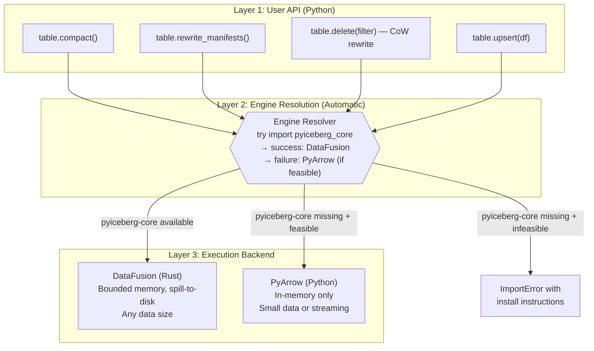
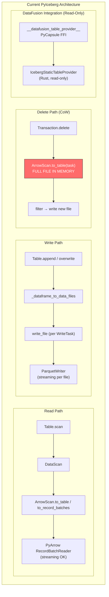
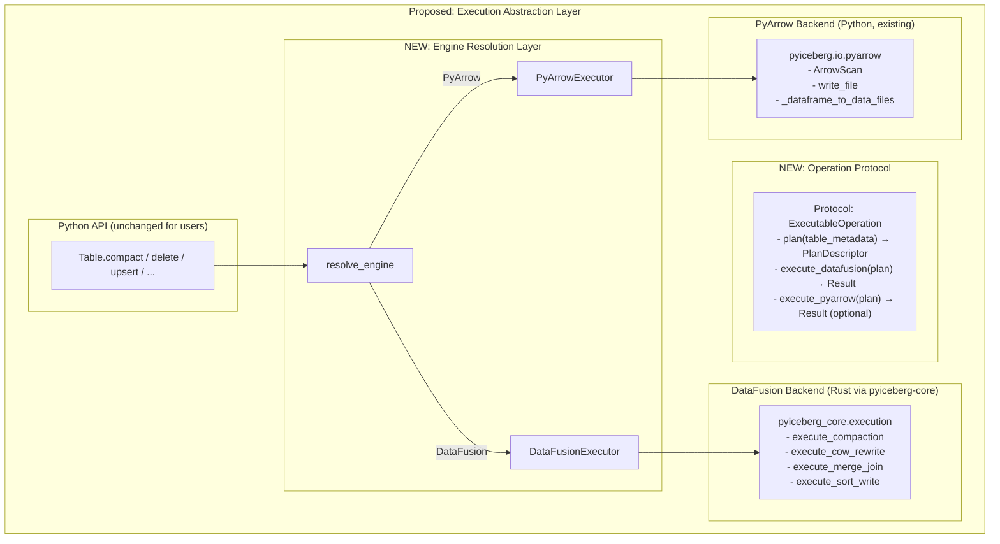
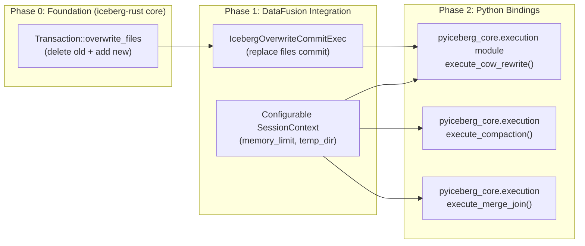
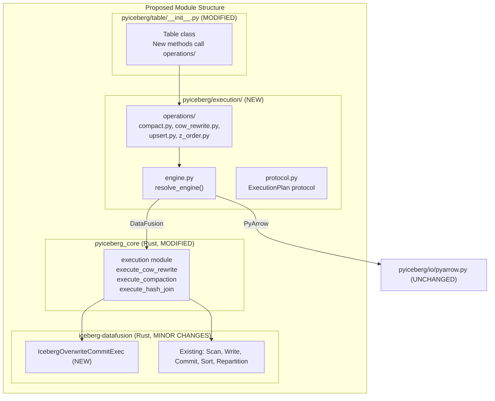
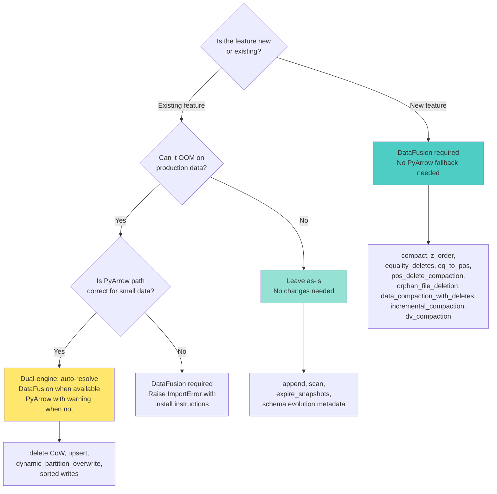
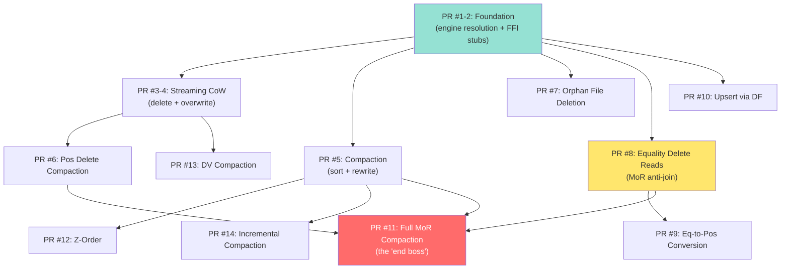

# DataFusion UX Design: Engine Selection, OOM Feature Integration, and Implementation Roadmap

## 1. The Predicament: Formal Statement

### 1.1 The Impossibility Theorem

**Theorem (Information-Theoretic Memory Bound)**: For an operation `Op` on dataset `D`, the required memory `M(Op, D)` cannot be computed without reading metadata proportional to the operation's complexity.

**Proof**: 
- Sort requires knowing data volume: `M_sort ≈ N × R` (in-memory) or `O(budget)` (external)
- Join requires knowing build-side cardinality: `M_join ≈ |build_side| × R`
- Both require manifest scanning + column statistics analysis
- Manifest scan itself is I/O-bound and varies with table history

**Corollary**: No API design can *accurately* predict whether an operation will OOM before execution begins.

### 1.2 The Design Constraint Space

```
Constraints:
  C₁: Cannot know M(Op, D) a priori
  C₂: PyArrow path must remain functional (backwards compat)
  C₃: DataFusion is an optional dependency
  C₄: New features have no existing implementation to preserve
  C₅: API should be simple (no engine expertise required)
  C₆: Must be acceptable in Apache Iceberg PR review culture
```

---

## 2. Precedent Analysis

### 2.1 Taxonomy of Existing Patterns

| Project | Pattern | UX | Applicability |
|---------|---------|----|----|
| **DuckDB** | Always-external-memory | `SET memory_limit='4GB'` — automatic | ✅ Best for new features |
| **Polars** | Explicit engine flag | `collect(engine="streaming")` | ⚠️ Leaks implementation detail |
| **Pandas** | Backend parameter | `read_csv(engine="pyarrow")` | ⚠️ User must know which is better |
| **Spark** | Transparent spill | Configure memory, engine handles rest | ✅ Proven at scale |
| **PyIceberg (existing)** | Type-based dispatch | `pa.Table` vs `pa.RecordBatchReader` | ✅ Already precedented |
| **DuckDB-Python** | Graceful import | `import duckdb` → just works | ✅ Zero-config |
| **scikit-learn** | `prefer="threads"` | Joblib backend selection | ⚠️ Too low-level |

### 2.2 The DuckDB Philosophy (Recommended)

DuckDB's approach is both theoretically optimal and practically proven:

1. **Always use external-memory algorithms** — if data fits in RAM, the fast path is taken automatically (no spill overhead)
2. **Configure the budget, not the strategy** — user says "use 512MB" not "use external merge sort"
3. **Fail loudly if impossible** — if even bounded-memory execution can't proceed, error with clear message

**Formal justification**: Let `T_mem(N)` = time for in-memory execution, `T_ext(N,M)` = time for external-memory execution with budget M.

```
When N×R ≤ M:  T_ext(N,M) = T_mem(N) + ε  (ε ≈ 0, no spill occurs)
When N×R > M:  T_ext(N,M) = finite,  T_mem(N) = ∞ (OOM = non-termination)
```

Therefore `T_ext` **dominates** `T_mem` in the Pareto sense: never worse, sometimes infinitely better.

### 2.3 PyIceberg's Own Precedent: `pa.Table | pa.RecordBatchReader`

PyIceberg already established the pattern of accepting two input types with different memory semantics:

```python
# Transaction.overwrite() already accepts both:
def overwrite(self, df: pa.Table | pa.RecordBatchReader, ...): ...
```

This is a *caller-side* choice about input format, not an engine selection. The proposed design extends this with an *execution-side* choice that is transparent to the caller.

---

## 3. Recommended UX Pattern: "Automatic with Escape Hatch"

### 3.1 Design Principles

```
Axiom 1 (Least Surprise):    Default behavior never OOMs where avoidable
Axiom 2 (Zero Config):       Works without extra parameters for common cases  
Axiom 3 (Progressive Reveal): Power users can tune; casual users don't need to
Axiom 4 (Backwards Compat):  Existing API surfaces unchanged
Axiom 5 (Additive Only):     New features don't break old features
```

### 3.2 The Three-Layer UX Model



### 3.3 Concrete API Surface

```python
# ─── NEW FEATURES (DataFusion-required) ─────────────────────────────
# These have NO PyArrow fallback because they are inherently infeasible
# without external-memory execution at production scale.

table.compact(
    target_file_size_bytes=256 * 1024 * 1024,  # Table property default
    sort_order=None,                            # None = use table sort order
    file_filter=ALWAYS_TRUE,                    # Which files to compact
    memory_limit="512MB",                       # DataFusion memory budget
    snapshot_properties={},
)

table.rewrite_position_deletes(
    memory_limit="512MB",
    snapshot_properties={},
)

# ─── EXISTING FEATURES (Enhanced with DataFusion backend) ────────────
# These KEEP working with PyArrow, but automatically use DataFusion
# when available for better memory characteristics.

table.delete(
    delete_filter="category = 'spam'",  # Existing API, unchanged
    # Internally: if pyiceberg_core available AND rewrite needed,
    # delegate to DataFusion for bounded-memory CoW rewrite
)

table.upsert(
    df=large_arrow_table,
    join_cols=["id"],
    # Internally: if pyiceberg_core available, use DataFusion hash join
    # Otherwise: existing PyArrow path (works but OOMs on large tables)
)
```

### 3.4 Engine Resolution Logic

```python
# pyiceberg/engine.py (new module)

import warnings
from enum import Enum, auto
from typing import Literal

class ExecutionEngine(Enum):
    DATAFUSION = auto()
    PYARROW = auto()

def resolve_engine(
    operation: str,
    *,
    prefer: Literal["auto", "datafusion", "pyarrow"] = "auto",
    required: bool = False,
) -> ExecutionEngine:
    """Resolve which execution engine to use.
    
    Parameters
    ----------
    operation : str
        Name of the operation (for error messages).
    prefer : {"auto", "datafusion", "pyarrow"}
        "auto" (default): Use DataFusion if available, else PyArrow.
        "datafusion": Require DataFusion; raise if unavailable.
        "pyarrow": Force PyArrow path (may OOM on large data).
    required : bool
        If True, DataFusion is mandatory for this operation (no PyArrow fallback).
    
    Returns
    -------
    ExecutionEngine
    
    Raises
    ------
    ImportError
        If DataFusion is required but pyiceberg-core is not installed.
    """
    if prefer == "pyarrow" and not required:
        return ExecutionEngine.PYARROW
    
    try:
        import pyiceberg_core  # noqa: F401
        return ExecutionEngine.DATAFUSION
    except ImportError:
        if required or prefer == "datafusion":
            raise ImportError(
                f"Operation '{operation}' requires the DataFusion execution engine. "
                f"Install it with: pip install 'pyiceberg[pyiceberg-core]'"
            ) from None
        
        warnings.warn(
            f"Operation '{operation}' will use in-memory (PyArrow) execution. "
            f"For large tables, install pyiceberg[pyiceberg-core] for bounded-memory execution.",
            UserWarning,
            stacklevel=3,
        )
        return ExecutionEngine.PYARROW
```

---

## 4. Complete OOM Feature Inventory

### 4.1 Comprehensive Feature List

Every operation in PyIceberg that touches data (not just metadata) has a memory profile. Here is the exhaustive inventory:

| # | Feature | Current Status | OOM Potential | Root Cause | DataFusion Operator Needed |
|---|---------|---------------|---------------|------------|---------------------------|
| 1 | **Equality Delete Reads** (MoR anti-join) | ❌ `ValueError` | Critical | Anti-join: data ⋈ deletes — requires all delete keys accessible during probe | `HashJoinExec` (Grace Hash Join with spill) |
| 2 | **Compaction** (rewrite data files) | ❌ Not implemented | Critical | Full table sort across multiple files | `SortExec` (external merge sort) |
| 3 | **Equality-to-Positional Conversion** | ❌ Not implemented | Critical | Inner join of data × eq_deletes to produce (file_path, pos) tuples | `HashJoinExec` (spillable) |
| 4 | **Copy-on-Write Delete** (file rewrite) | ✅ Implemented | High | Loads entire Parquet file into memory per `ArrowScan.to_table(task)` | `FilterExec` + streaming write |
| 5 | **Orphan File Deletion** | ⚠️ In progress (#1200) | High | Left anti-join of storage listing × valid file paths (both unbounded) | `HashJoinExec` (LEFT ANTI) with spill |
| 6 | **Upsert** (MERGE INTO) | ✅ Implemented | High | Join source × target matched rows; row-by-row Python comparison O(n²) | `HashJoinExec` (spillable) |
| 7 | **Data Compaction with Deletes** (MoR compaction) | ❌ Not implemented | Critical | Must resolve all delete types (pos + eq + DV) then sort-merge rewrite | `HashJoinExec` + `SortExec` (both external) |
| 8 | **Dynamic Partition Overwrite** | ✅ Implemented | Medium-High | Materializes all input + detects partitions | `HashAggregateExec` (spillable) |
| 9 | **Z-Order / Hilbert Sorting** | ❌ Not implemented | Critical | Global sort on computed interleaved-bit key | `SortExec` (external) + custom UDF |
| 10 | **Position Delete Compaction** | ❌ Not implemented | High | Join pos deletes against data files to produce rewritten clean files | `HashJoinExec` (spillable) |
| 11 | **Overwrite with filter** (CoW rewrite) | ✅ Implemented | High | Same as #4 | Same as #4 |
| 12 | **Sort-Order Enforcement on Write** | ⚠️ Partial | Medium | Requires full sort before write for sorted tables | `SortExec` (external) |
| 13 | **Incremental Compaction** (partial rewrite) | ❌ Not implemented | Medium | k-way merge of selected already-sorted files | `SortPreservingMergeExec` |
| 14 | **Schema Evolution with Data Rewrite** | ❌ Not implemented | Medium | Read + transform + write for type widening / column reorder | Streaming `ProjectionExec` |
| 15 | **DV (Deletion Vector) Compaction** | ❌ Not implemented | Medium | Merge Roaring bitmaps then rewrite affected data files | Bitmap merge + streaming write |

### 4.2 Memory Profile Formalization

For each operation, define the memory requirement function:

```
M(Op) = f(input_parameters)

M(eq_delete_read)   = O(min(|data|, |deletes|) × R)  [hash join build side]
                    = O(budget)                        [Grace Hash Join with spill]

M(compact)          = O(N × R)                        [in-memory sort]
                    = O(budget)                        [external merge sort, configurable]

M(eq_to_pos)        = O(|eq_deletes| × R)             [build hash table of delete keys]
                    = O(budget)                        [Grace Hash Join → (path, pos) output]

M(cow_delete)       = O(max_file_size)                [per-file rewrite, current]
                    = O(batch_size × R)               [streaming filter + write]

M(orphan_delete)    = O(|storage_listing| + |valid_paths|)  [two unbounded sets]
                    = O(budget)                              [LEFT ANTI JOIN with spill]

M(upsert)           = O(|source| + |matched_target| × R)   [current: loads matched rows]
                    = O(budget)                              [hash join with spill]

M(compact_w_deletes)= O(|data| + |all_deletes|)      [resolve deletes then sort-rewrite]
                    = O(budget)                        [Grace Hash Join + external sort, pipelined]

M(dynamic_overwrite)= O(|input_df| × R)              [full materialization for partition detect]
                    = O(budget)                        [hash aggregate with spill]

M(z_order_sort)     = O(N × R)                        [global sort]
                    = O(budget)                        [external sort]

M(pos_del_compact)  = O(|pos_deletes| + |affected_data|)   [join + rewrite]
                    = O(budget)                              [streaming anti-join + write]

M(dv_compact)       = O(Σ|bitmap_i|)                  [merge Roaring bitmaps]
                    ≈ O(budget)                        [bitmaps are typically small; data rewrite dominates]
```

### 4.3 Formal Characterization: The Three OOM Classes

The operations above fall into three distinct computational classes:

**Class A: Join-Dominated (Anti-Join / Inner Join)**

Operations requiring simultaneous access to two relations where at least one may exceed memory:

```
{eq_delete_read, eq_to_pos, orphan_delete, upsert, pos_del_compact, compact_w_deletes}
```

**Theorem (Class A Bound)**: For relations R (size |R|) and S (size |S|), any correct join requires either:
1. `O(min(|R|, |S|))` memory (in-memory hash join), or  
2. `O(M)` bounded memory with `O((|R|+|S|)/B)` I/O (Grace Hash Join with spill)

Option (2) is strictly dominant in the Pareto sense: never worse, sometimes infinitely better.

**Class B: Sort-Dominated (Global Ordering)**

Operations requiring a total order over data exceeding memory:

```
{compact, z_order_sort, sort_order_enforce, incremental_compact}
```

**Theorem (Class B Bound)**: External merge sort achieves:
- Time: `O(N/B × log_{M/B}(N/M))` I/O operations
- Memory: `O(M)` bounded
- Passes: `⌈log_{M/B}(N/M)⌉` (typically 1 for M=512MB, N<100TB)

**Class C: Streaming-Dominated (Per-Record Filter)**

Operations that can be expressed as a streaming filter without global state:

```
{cow_delete, overwrite_with_filter, schema_rewrite, dv_compact (bitmap phase)}
```

**Theorem (Class C Bound)**: Streaming operations require `O(B × R)` memory regardless of input size. These are inherently bounded and do NOT require DataFusion for correctness — but benefit from DataFusion for parallelism and avoiding Python GIL overhead.

### 4.3 Why Upsert is an OOM Risk (Currently Hidden)

The current `Transaction.upsert()` implementation has this memory profile:

```python
# Step 1: Scan matched rows from target table
matched_iceberg_record_batches = scan.to_arrow_batch_reader()  # Streaming ✓

# Step 2: For EACH batch, compute update candidates
for batch in matched_iceberg_record_batches:
    rows = pa.Table.from_batches([batch])  # OK: one batch at a time
    rows_to_update = get_rows_to_update(df, rows, join_cols)  # ← HERE
    
    # get_rows_to_update does:
    #   source_index.join(target_index, keys=join_cols, join_type="inner")
    # This is an inner join of FULL source against each target batch.
    # If |source| is large, this join materializes |source| on every iteration.
    
    rows_to_insert = rows_to_insert.filter(~expr_match_arrow)  # accumulates filter

# Step 3: CONCAT all update tables
rows_to_update = pa.concat_tables(batches_to_overwrite)  # Full materialization!
```

**True memory requirement**:
```
M(upsert) = |source_df| × R                          (held in memory throughout)
          + |matched_target| × R                      (accumulated via concat_tables)
          + O(|source| × |target_batches|) join work  (repeated per batch)
```

For large source AND large target, this is `O(|source| + |matched_target|)` which can exceed RAM.

---

## 5. Does the Existing Integration Need Refactoring?

### 5.1 Current Architecture Assessment



### 5.2 What Needs Refactoring vs. What Can Be Additive

**Key insight**: The existing DataFusion integration is *read-only* and *static-snapshot*. The new features need *read-write* and *catalog-backed*. This is a **new capability layer**, not a refactoring of the existing one.

| Component | Refactoring Needed? | Rationale |
|-----------|-------------------|-----------|
| `__datafusion_table_provider__` | No | Read-only use case remains valid |
| `IcebergStaticTableProvider` (Rust) | No | Still used for DataFusion SQL queries |
| `IcebergTableProvider` (Rust) | Minor extension | Already supports writes; needs new plan types |
| `pyiceberg_core.datafusion` module (Rust) | **Yes: extend** | Must expose execution operations, not just table provider |
| `pyiceberg/table/__init__.py` | **Additive** | New methods + engine resolution in existing methods |
| `pyiceberg/io/pyarrow.py` | No | PyArrow path unchanged |

### 5.3 The Required Abstraction Layer



---

## 6. Does This Require Changes to iceberg-rust's DataFusion Integration First?

### 6.1 Gap Analysis: What iceberg-rust Already Has vs. What's Needed

| Capability | iceberg-rust Status | Needed for PyIceberg? | Gap |
|-----------|-------------------|----------------------|-----|
| Table scan with filter pushdown | ✅ `IcebergTableScan` | ✅ | None |
| Table scan with projection | ✅ `IcebergTableScan` | ✅ | None |
| Write to Parquet files | ✅ `IcebergWriteExec` | ✅ | None |
| Commit transaction | ✅ `IcebergCommitExec` | ✅ | None |
| Partition-aware repartition | ✅ `repartition()` | ✅ | None |
| Sort by partition | ✅ `sort_by_partition()` | ✅ | None |
| Partition value projection | ✅ `project_with_partition()` | ✅ | None |
| **Configurable memory limit** | ❌ Delegates to SessionContext | ✅ | **Minor: expose config** |
| **Anti-join for delete application** | ❌ Not implemented | ✅ | **New plan node** |
| **Scan + Filter + Write (CoW)** | ❌ Not as unified plan | ✅ | **Compose existing nodes** |
| **Replace files (overwrite commit)** | ❌ Only `fast_append` | ✅ | **New commit mode** |
| **Python FFI for execution** | ❌ Only table provider FFI | ✅ | **New module** |

### 6.2 Required iceberg-rust Changes (Ordered by Dependency)



### 6.3 Specific iceberg-rust Code Changes Required

#### Change 1: `IcebergOverwriteCommitExec` (New)

The existing `IcebergCommitExec` only supports `Transaction::fast_append`. For CoW rewrites and compaction, we need a commit that atomically replaces files:

```rust
// NEW: crates/integrations/datafusion/src/physical_plan/overwrite_commit.rs

/// Commits a file replacement operation: atomically removes old files and adds new files.
/// Used for: compaction, CoW deletes, CoW updates.
pub(crate) struct IcebergOverwriteCommitExec {
    table: Table,
    catalog: Arc<dyn Catalog>,
    /// The new data files (from IcebergWriteExec output)
    input: Arc<dyn ExecutionPlan>,
    /// Files to be removed (serialized DataFile JSON list)
    files_to_delete: Vec<String>,
    schema: ArrowSchemaRef,
    // ...
}
```

**Justification**: `fast_append` only adds files. Compaction and CoW must atomically remove old files and add new ones. Without this, the operations are not ACID.

**Formal requirement**: The commit must satisfy:
```
Snapshot_{n+1} = (Snapshot_n \ files_to_delete) ∪ files_to_add
```

This is a standard set-theoretic replacement operation on the manifest list.

#### Change 2: Memory-Configurable Execution Context

```rust
// MODIFIED: bindings/python/src/execution.rs (new)

/// Execute a plan with bounded memory.
/// 
/// This configures a DataFusion SessionContext with:
/// - MemoryPool (FairSpillPool with configurable limit)
/// - DiskManager (OS temp directory for spill files)  
/// - target_partitions (derived from available CPUs)
fn create_bounded_session(memory_limit_bytes: usize) -> SessionContext {
    let config = SessionConfig::new()
        .with_batch_size(8192)
        .with_target_partitions(num_cpus::get());
    
    let runtime = RuntimeEnvBuilder::new()
        .with_memory_limit(memory_limit_bytes, 1.0)  // hard limit
        .with_disk_manager(DiskManagerConfig::new())  // enable spill
        .build_arc()
        .unwrap();
    
    SessionContext::new_with_config_rt(config, runtime)
}
```

**Justification**: Without explicit memory configuration, DataFusion uses the `UnboundedMemoryPool` (no limit, no spill). This must be configured for the bounded-memory guarantee to hold.

#### Change 3: Python Execution FFI Module

```rust
// NEW: bindings/python/src/execution.rs

#[pyfunction]
fn execute_cow_rewrite(
    metadata_location: String,
    file_io_properties: HashMap<String, String>,
    files_to_rewrite: Vec<String>,        // DataFile JSON list
    filter_expression: String,            // Serialized Iceberg expression  
    memory_limit: Option<String>,
) -> PyResult<CowRewriteResult> { ... }

#[pyfunction]  
fn execute_compaction(
    metadata_location: String,
    file_io_properties: HashMap<String, String>,
    files_to_compact: Vec<String>,
    target_file_size_bytes: u64,
    sort_columns: Option<Vec<String>>,
    memory_limit: Option<String>,
) -> PyResult<CompactionResult> { ... }
```

### 6.4 Can We Start WITHOUT iceberg-rust Changes?

**Partially yes.** The existing `IcebergTableProvider.insert_into()` + `IcebergCommitExec` (fast_append) is sufficient for:
- **Compaction** (read old files → sort → write new files → append new → remove old via separate commit)
- **Sorted writes** (the pipeline already includes `SortExec`)

But for **atomic overwrite** (required for correctness of CoW delete and compaction), `IcebergOverwriteCommitExec` is needed. This is the critical missing piece.

**Workaround for initial PR**: Use a two-phase commit pattern:
1. Write new files (using existing pipeline)
2. Use Python-side `Transaction` to atomically commit the replacement

This is safe because the Python side already has `Transaction` with proper snapshot isolation. The Rust side just produces the new data files.

---

## 7. Implementation Roadmap: Simplest to Hardest

### 7.1 Ordering Criteria

Each feature is scored on:
- **Rust changes required** (0 = none, 1 = minor, 2 = new module)
- **Python complexity** (lines of code, test surface)
- **Dependency on other features** (DAG depth)
- **User impact** (how many people are blocked)

### 7.2 Ordered Implementation Plan

```mermaid
gantt
    title Implementation Roadmap (Simplest → Hardest)
    dateFormat X
    axisFormat %s
    
    section Phase 1: Foundation
    Engine resolution module           :p1a, 0, 1
    pyiceberg_core.execution (basic)   :p1b, 0, 2
    
    section Phase 2: CoW Enhancement (Existing OOM)
    Streaming CoW delete (DF)          :p2a, 2, 4
    Streaming CoW overwrite (DF)       :p2b, 2, 4
    
    section Phase 3: New Write Features
    Compaction (sort + rewrite)        :p3a, 4, 7
    Position delete compaction         :p3b, 4, 7
    Orphan file deletion (anti-join)   :p3c, 4, 6
    
    section Phase 4: Join-Dominated Features
    Equality deletes (MoR read)        :p4a, 7, 10
    Equality-to-positional conversion  :p4b, 7, 10
    Upsert via DataFusion              :p4c, 7, 9
    
    section Phase 5: Complex Composition
    Data compaction with deletes       :p5a, 10, 13
    Z-Order sorting                    :p5b, 10, 12
    Incremental compaction             :p5c, 12, 14
    DV compaction                      :p5d, 10, 12
```



---

### Feature 1: Streaming Copy-on-Write Delete (SIMPLEST PR)

**Difficulty**: ⭐⭐ (Low)  
**Rust changes**: None (uses existing pipeline via Python-side orchestration)  
**Why first**: Fixes an *existing* OOM in production code. Highest user impact per line of code.

**Current problem** (the code that OOMs):
```python
# Transaction.delete() — loads ENTIRE Parquet file into memory
for original_file in files:
    df = ArrowScan(...).to_table(tasks=[original_file])  # ← FULL FILE IN MEMORY
    filtered_df = df.filter(preserve_row_filter)
    # Write filtered result
```

**Proposed fix** (streaming via DataFusion):
```python
def delete(self, delete_filter, ...):
    engine = resolve_engine("delete", required=False)
    
    if engine == ExecutionEngine.DATAFUSION and self._needs_rewrite(delete_filter):
        self._delete_via_datafusion(delete_filter, ...)
    else:
        self._delete_via_pyarrow(delete_filter, ...)  # existing code

def _delete_via_datafusion(self, delete_filter, ...):
    from pyiceberg_core.execution import execute_cow_rewrite
    
    files_to_rewrite = [task.file for task in self._scan(row_filter=delete_filter).plan_files()]
    
    result = execute_cow_rewrite(
        metadata_location=self._table.metadata_location,
        file_io_properties=self._table.io.properties,
        files_to_rewrite=[serialize(f) for f in files_to_rewrite],
        filter_expression=serialize(delete_filter),
        keep_matching=False,  # Delete matching rows
    )
    
    # Commit the replacement atomically
    with self.update_snapshot(...).overwrite() as overwrite:
        for old_file in files_to_rewrite:
            overwrite.delete_data_file(old_file)
        for new_file in result.new_files:
            overwrite.append_data_file(deserialize(new_file))
```

**Memory model**:
```
M_current = O(max_file_size)           ← OOMs on large files
M_proposed = O(batch_size × R)         ← Bounded, configurable
           = O(8192 × 100B) ≈ 800KB   ← Typical
```

**iceberg-rust execution plan** (composed from existing nodes):
```
IcebergWriteExec(
    FilterExec(
        IcebergTableScan(specific_files),
        complement(delete_predicate)
    )
)
```

All three nodes already exist. No new Rust code for the physical plan.

---

### Feature 2: Streaming Copy-on-Write Overwrite

**Difficulty**: ⭐⭐ (Low)  
**Rust changes**: None  
**Why second**: Same pattern as #1, extends to `overwrite()` with filter.

Identical to Feature 1 but applied to the `overwrite()` path. Same implementation, different call site.

---

### Feature 3: Compaction (Rewrite Data Files)

**Difficulty**: ⭐⭐⭐ (Medium)  
**Rust changes**: Minor (expose plan composition API) OR None (Python orchestrates plan via existing `insert_into`)  
**Why third**: New feature, no backwards compat concerns, high user demand.

**Mathematical formulation**:
```
Compaction(files_in, sort_order, target_size) =
    let data = ⋃ Scan(f) for f ∈ files_in
    let sorted = ExternalSort(data, sort_order)
    let files_out = Write(sorted, partition_spec, target_size)
    Commit(files_in → files_out)  [atomic replace]
```

**Implementation approach**:

```python
def compact(
    self,
    *,
    target_file_size_bytes: int = 256 * 1024 * 1024,
    memory_limit: str = "512MB",
    sort_order: list[str] | None = None,
    file_filter: BooleanExpression = ALWAYS_TRUE,
    snapshot_properties: dict[str, str] = EMPTY_DICT,
) -> None:
    engine = resolve_engine("compact", required=True)  # No PyArrow fallback
    
    from pyiceberg_core.execution import execute_compaction
    
    # Select files to compact (using bin_packing to find small files)
    scan = self.scan(row_filter=file_filter)
    files_to_compact = self._select_files_for_compaction(scan.plan_files())
    
    result = execute_compaction(
        metadata_location=self.metadata_location,
        file_io_properties=self.io.properties,
        files_to_compact=[serialize(f) for f in files_to_compact],
        target_file_size_bytes=target_file_size_bytes,
        sort_columns=sort_order,
        memory_limit=memory_limit,
    )
    
    # Atomic commit: replace old files with new
    with self.transaction() as tx:
        with tx.update_snapshot(...).overwrite() as overwrite:
            for old_file in files_to_compact:
                overwrite.delete_data_file(old_file)
            for new_file_json in result.new_files:
                overwrite.append_data_file(deserialize(new_file_json))
```

**DataFusion plan** (inside Rust):
```
IcebergWriteExec(
    SortExec(                          ← External merge sort (spill-to-disk)
        IcebergTableScan(files_to_compact),
        sort_keys = sort_order
    ),
    target_file_size = target_file_size_bytes
)
```

**Complexity**: 
```
Time = O(N/D × (1 + 2⌈log_B(N/M)⌉))   [external sort I/O]
Memory = O(M)                             [bounded by configuration]
I/O = O(4×N×R)                           [read + spill + merge + write]
```

---

### Feature 4: Position Delete Compaction

**Difficulty**: ⭐⭐⭐ (Medium)  
**Rust changes**: Needs anti-join plan composition  
**Why fourth**: Prerequisite for merge-on-read; independent of #3.

**Mathematical formulation**:
```
RewritePositionDeletes(data_files, delete_files) =
    for each (data_file, associated_pos_deletes) ∈ matched_pairs:
        let data = Scan(data_file)
        let deletes = Scan(associated_pos_deletes)  
        let result = data \ {r | (r.file_path, r.pos) ∈ deletes}  [anti-join]
        Write(result) → new_data_file
    Commit(old_files → new_files)
```

This is a **per-file** operation, so memory is bounded by `O(max(|data_file|, |pos_delete_file|))` which is typically manageable. But the join itself benefits from DataFusion's `HashJoinExec` for correctness and efficiency.

---

### Feature 5: Upsert via DataFusion

**Difficulty**: ⭐⭐⭐⭐ (Medium-High)  
**Rust changes**: Needs hash join + write plan composition  
**Why fifth**: Existing implementation works but OOMs; this is an enhancement.

**Current OOM pattern**:
```python
# Row-by-row comparison in Python (!!)
for source_idx, target_idx in zip(source_indices, target_indices):
    source_row = source_table.slice(source_idx, 1)
    target_row = target_table.slice(target_idx, 1)
    for key in non_key_cols:
        if source_row[key][0].as_py() != target_row[key][0].as_py():  # O(n²)!
            to_update_indices.append(source_idx)
```

**DataFusion approach**:
```
-- Identify rows to update (inner join + inequality on non-key cols)
UPDATE_SET = HashJoin(source, target, on=join_cols, type=inner)
             WHERE any(source.non_key_col != target.non_key_col)

-- Identify rows to insert (anti join)
INSERT_SET = AntiHashJoin(source, target, on=join_cols)

-- Write results
Write(UPDATE_SET ∪ INSERT_SET)
```

**Memory model with DataFusion**:
```
M = O(min(|source|, |target_matched|) × R)  [hash join build side]
  = O(budget) with spill                     [partitioned hash join]
```

---

### Feature 6: Equality Deletes (Merge-on-Read)

**Difficulty**: ⭐⭐⭐⭐⭐ (High)  
**Rust changes**: Anti-join plan node + scan integration  
**Why sixth**: Completely new execution model for reads.

**Mathematical formulation**:
```
Read(table) = Scan(data_files) ⋈_{anti} Scan(eq_delete_files)
            = {r ∈ data | ¬∃d ∈ eq_deletes : r[eq_cols] = d[eq_cols]}
```

This changes the **read path** — every scan must now check equality deletes. This is architecturally significant because:
1. The scan currently returns a simple `RecordBatchStream`
2. With equality deletes, the scan must incorporate a join
3. This join may be larger than memory

**DataFusion plan**:
```
AntiHashJoinExec(
    left:  IcebergTableScan(data_files, projection=all),
    right: IcebergTableScan(eq_delete_files, projection=eq_field_ids),
    on:    equality_field_ids,
    type:  LeftAnti
)
```

This is the hardest because it requires modifying the **read path**, not just adding a new write operation. It touches `IcebergTableScan` itself.

---

### Feature 7: Z-Order / Hilbert Curve Sorting

**Difficulty**: ⭐⭐⭐⭐⭐ (High)  
**Rust changes**: Custom UDF for Z-order key computation  
**Why seventh**: Requires #3 (compaction) as prerequisite + custom sort key.

**Mathematical formulation**:
```
z_key(r) = interleave_bits(
    normalize(r[col₁], min₁, max₁, bits),
    normalize(r[col₂], min₂, max₂, bits),
    ...,
    normalize(r[colₙ], minₙ, maxₙ, bits)
)

ZOrderCompaction(table, cols) =
    let stats = collect_column_statistics(table, cols)  [min/max per column]
    let data = Scan(table)
    let keyed = Project(data, [*, z_key(cols, stats)])
    let sorted = ExternalSort(keyed, z_key)
    let result = Project(sorted, drop z_key)
    Write(result) → files
```

Requires:
1. Statistics collection pass (scan column bounds)
2. Custom DataFusion UDF (`z_order_key`)
3. Full-table sort (external)
4. Full-table rewrite

---

### Feature 8: Incremental Compaction

**Difficulty**: ⭐⭐⭐⭐⭐ (High)  
**Rust changes**: `SortPreservingMergeExec` integration  
**Why last**: Optimization of #3, not a new capability.

Uses k-way merge sort on already-sorted runs (data files with known sort order). More efficient than full re-sort but requires understanding file-level sort guarantees.

---

### Feature 9: Orphan File Deletion

**Difficulty**: ⭐⭐⭐ (Medium)  
**Rust changes**: None (Python-side DataFusion orchestration)  
**Why here**: Independent of other features; pure maintenance operation.

**Mathematical formulation**:
```
OrphanFiles(storage, valid) = storage \ valid
                            = {f ∈ ListFiles(storage_path) | f ∉ ValidFiles(all_snapshots)}
```

This is a **LEFT ANTI JOIN** of the storage listing against the set of all valid file paths (derived from all manifest entries across all snapshots).

**OOM scenario**: A table with 10M files over 5 years of history produces `|storage| ≈ 10⁷` and `|valid| ≈ 10⁷`. Naively holding both sets in memory requires ~1.6GB (160 bytes avg path × 10⁷ × 2).

**DataFusion plan**:
```sql
-- Register storage listing and valid paths as tables
SELECT s.file_path 
FROM storage_listing s
LEFT ANTI JOIN valid_paths v
ON s.file_path = v.file_path
```

**Implementation**:
```python
def delete_orphan_files(
    self,
    *,
    older_than: datetime | None = None,
    dry_run: bool = False,
    memory_limit: str = "512MB",
) -> list[str]:
    """Delete files in storage not referenced by any snapshot.
    
    Uses DataFusion LEFT ANTI JOIN with spill-to-disk to handle
    tables with millions of files without OOM.
    
    Memory: O(memory_limit) regardless of file count.
    Time: O((|storage| + |valid|) / B) I/O operations.
    """
    engine = resolve_engine("orphan_file_deletion", required=True)
    
    # Collect valid paths from all snapshots' manifests
    valid_paths = self._collect_all_valid_paths()
    
    # List storage directory
    storage_paths = self.io.list(self.location())
    
    # Execute anti-join via DataFusion
    from pyiceberg_core.execution import execute_antijoin_paths
    orphans = execute_antijoin_paths(
        storage_paths=storage_paths,
        valid_paths=valid_paths,
        older_than=older_than,
        memory_limit=memory_limit,
    )
    
    if not dry_run:
        for path in orphans:
            self.io.delete(path)
    
    return orphans
```

**Complexity**:
```
Time = O((|S| + |V|) / B)              [single-pass hash join]
Memory = O(min(|S|, |V|) × path_len)   [build side]
       = O(budget)                       [with Grace Hash Join spill]
```

---

### Feature 10: Equality-to-Positional Conversion (Delete Compaction)

**Difficulty**: ⭐⭐⭐⭐ (Medium-High)  
**Rust changes**: Needs row-index projection in scan  
**Why here**: Prerequisite for full MoR compaction; depends on equality delete read support (#6).

**Mathematical formulation**:

Convert equality deletes to positional deletes (or DVs), eliminating the ongoing read-time join cost:

```
EqToPos(data_files, eq_delete_files) =
    for each (data_file, applicable_eq_deletes) ∈ matched_pairs:
        let data = Scan(data_file) WITH row_index
        let deletes = ⋃ Scan(eq_del) for eq_del ∈ applicable_eq_deletes
        let matched = data ⋈_{inner} deletes ON equality_cols
        emit (data_file.path, matched.row_index) for each match
    → Positional delete file OR Deletion Vector (Roaring bitmap)
```

This is an **INNER JOIN** (not anti-join) — we want to find which rows ARE deleted, then record their positions.

**DataFusion plan**:
```sql
SELECT d._file_path, d._row_index
FROM data_with_row_index d
INNER JOIN (
    SELECT eq_col1, eq_col2 FROM eq_delete_file_1
    UNION ALL
    SELECT eq_col1, eq_col2 FROM eq_delete_file_2
) e
ON d.eq_col1 = e.eq_col1 AND d.eq_col2 = e.eq_col2
```

**Output**: A set of `(file_path, position)` tuples → written as V2 positional delete file, or as V3 Deletion Vector (Roaring bitmap).

**Why this is valuable**: After conversion, subsequent reads of the same data files no longer require the expensive hash join — they only need bitmap lookup (O(1) per row). This amortizes the join cost over all future reads.

**Complexity**:
```
Time_conversion = O((|data| + |eq_deletes|) / B)   [one-time cost]
Time_read_before = O((|data| + |eq_deletes|) / B)  [per-read cost without conversion]
Time_read_after = O(|data| / B)                     [per-read cost after conversion]

Break-even: after 1 read, conversion has paid for itself.
```

---

### Feature 11: Data Compaction with Deletes (Full MoR Compaction)

**Difficulty**: ⭐⭐⭐⭐⭐ (Very High)  
**Rust changes**: Composition of multiple plan types  
**Why last in its group**: Requires features #3 (compaction) + #6 (equality delete reads) + #10 (eq-to-pos) as prerequisites.

**Mathematical formulation**:

This is the most complex operation — it must:
1. Resolve ALL delete types (positional + equality + DV) against data files
2. Sort the surviving rows by the table's sort order
3. Write optimally-sized output files
4. Atomically commit the replacement

```
FullCompaction(data_files, pos_deletes, eq_deletes, dvs) =
    let active_data = data_files
        \ pos_deletes                    [filter by position]
        \ resolve_dvs(dvs)              [filter by DV bitmap]
        ⋫_{eq_cols} eq_deletes          [anti-join for equality deletes]
    let sorted = ExternalSort(active_data, table.sort_order)
    let files_out = Write(sorted, partition_spec, target_size)
    Commit(all_input_files → files_out) [atomic replace]
```

**DataFusion plan** (composed):
```
IcebergWriteExec(
    SortExec(                                    ← External merge sort
        AntiHashJoinExec(                        ← Grace Hash Join (equality deletes)
            FilterExec(                          ← Position deletes + DVs
                IcebergTableScan(data_files),
                NOT IN position_delete_set AND NOT IN dv_bitmap
            ),
            IcebergTableScan(eq_delete_files),
            ON equality_cols
        ),
        sort_keys = table.sort_order
    ),
    target_file_size = target_size
)
```

**Memory model**: Each operator individually respects the memory budget:
```
Total_memory ≤ M (enforced by DataFusion's cooperative MemoryPool)
- HashJoinExec uses up to M×0.4, spills remainder
- SortExec uses up to M×0.4, spills remainder  
- FilterExec + Scan are streaming (O(batch_size))
```

**This is the "end boss" operation** — it composes all previous features into a single execution plan. Once this works, PyIceberg has complete MoR read+write+compact parity with Java Iceberg for V2 tables.

---

### Feature 12: DV (Deletion Vector) Compaction

**Difficulty**: ⭐⭐⭐⭐ (Medium-High)  
**Rust changes**: Roaring bitmap integration  
**Why here**: V3-specific; independent path from equality deletes.

**Mathematical formulation**:
```
DVCompaction(data_files, dvs) =
    for each data_file with accumulated DV:
        if deletion_ratio(dv, data_file) > threshold:
            let active = data_file \ bitmap(dv)     [filter out deleted positions]
            Write(active) → new_data_file
            Commit(data_file + dv → new_data_file)
        else:
            merge_dvs(dv₁, dv₂, ...) → merged_dv   [Roaring OR]
            Commit(old_dvs → merged_dv)
```

The bitmap merge (`Roaring OR`) is cheap and bounded (`O(|bitmap|)` which is typically <1MB even for large files). The data rewrite is streaming. DataFusion is needed only when the data rewrite involves sorting or when the accumulated bitmap exceeds available memory (rare but possible for tables with millions of micro-deletions).

---

## 8. Architectural Refactoring Plan

### 8.1 The Generalized Execution Layer



### 8.2 Smooth Adoption Without Disrupting Existing Architecture

**Principle**: New code lives in new modules. Existing modules gain only thin dispatch calls.

```python
# pyiceberg/table/__init__.py — MINIMAL changes to existing class

class Table:
    # EXISTING METHODS: unchanged signature, enhanced implementation
    
    def delete(self, delete_filter, ...):
        # Existing logic preserved exactly
        # NEW: after rewrite detection, optionally delegate to DataFusion
        if delete_snapshot.rewrites_needed:
            engine = resolve_engine("cow_delete", required=False)
            if engine == ExecutionEngine.DATAFUSION:
                self._cow_delete_datafusion(files, delete_filter, ...)
                return
            # else: fall through to existing PyArrow path (unchanged)
        # ... existing code continues unchanged ...
    
    # NEW METHODS: purely additive
    def compact(self, ...) -> None: ...
    def rewrite_position_deletes(self, ...) -> None: ...
```

### 8.3 The `pyiceberg_core.execution` Module Contract

```python
# Type stubs for the Rust module (for IDE support)
# pyiceberg_core/execution.pyi

class CowRewriteResult:
    """Result of a copy-on-write rewrite operation."""
    new_files: list[str]          # Serialized DataFile JSON
    records_rewritten: int
    bytes_written: int

class CompactionResult:
    """Result of a compaction operation."""
    new_files: list[str]
    records_compacted: int
    files_removed: int
    bytes_before: int
    bytes_after: int

def execute_cow_rewrite(
    metadata_location: str,
    file_io_properties: dict[str, str],
    files_to_rewrite: list[str],     # Serialized DataFile JSON
    filter_expression: str,           # Serialized Iceberg BooleanExpression
    keep_matching: bool,              # True = keep matches, False = delete matches
    memory_limit: str | None = None,  # e.g., "512MB"
) -> CowRewriteResult: ...

def execute_compaction(
    metadata_location: str,
    file_io_properties: dict[str, str],
    files_to_compact: list[str],
    target_file_size_bytes: int,
    sort_columns: list[str] | None = None,
    memory_limit: str | None = None,
) -> CompactionResult: ...

def execute_hash_join(
    metadata_location: str,
    file_io_properties: dict[str, str],
    left_files: list[str],
    right_files: list[str],
    join_columns: list[str],
    join_type: str,                    # "inner", "left_anti", "left_semi"
    output_columns: list[str] | None,
    memory_limit: str | None = None,
) -> list[str]: ...                    # Returns new DataFile JSON list
```

---

## 9. Mathematical Framework: Correctness Proofs

### 9.1 Theorem (Equivalence of PyArrow and DataFusion Paths)

For any operation `Op` with input `I`:

```
PyArrow_path(Op, I) = DataFusion_path(Op, I)   [output equivalence]
```

**Proof obligation for each feature PR**: Demonstrate that for all valid inputs, both paths produce identical output (set of DataFiles with identical content, modulo file-level metadata like file paths and creation timestamps).

### 9.2 Theorem (Bounded Memory Guarantee)

For DataFusion path with memory limit M:

```
∀t ∈ [0, T_completion]: resident_memory(t) ≤ M + ε
```

Where ε = O(framework_overhead) is bounded by DataFusion's internal structures (task stacks, schema metadata).

**Proof**: Follows from DataFusion's `MemoryPool` invariant:
1. Every allocation goes through `MemoryConsumer.try_grow()`
2. If grow would exceed pool capacity → `spill()` is called on largest consumer
3. After spill, retry succeeds (freed memory) or operation fails gracefully

### 9.3 Theorem (ACID Compliance Under Spill)

Spill-to-disk does not violate snapshot isolation.

**Proof**:
1. Spilled data is derived from a frozen snapshot (read at operation start)
2. Spill files are local temp files, not visible to other transactions
3. Commit uses the same optimistic concurrency control regardless of whether spill occurred
4. If commit fails (metadata changed), entire operation (including spill) is discarded

### 9.4 Speed-of-Light Analysis (Per Feature)

For NVMe SSD with D = 7 GB/s, memory budget M = 512MB:

| Feature | Data Size | T_min (speed-of-light) | T_expected | Passes | OOM Class |
|---------|-----------|----------------------|------------|--------|-----------|
| CoW Delete (1GB file) | 1 GB | 0.14s + 0.14s = 0.28s | ~1s | 0 (streaming) | C |
| Compaction (10GB) | 10 GB | 1.4s × 3 = 4.2s | ~15s | 1 sort pass | B |
| Compaction (100GB) | 100 GB | 14s × 3 = 42s | ~120s | 1 sort pass | B |
| Equality delete read (10GB data, 1GB deletes) | 11 GB | 1.6s | ~8s | 0 (1GB fits in build) | A |
| Equality delete read (10GB data, 5GB deletes) | 15 GB | 2.1s + spill | ~20s | 1 partition pass | A |
| Eq-to-Pos conversion (10GB data, 1GB deletes) | 11 GB | 1.6s | ~10s | 0 | A |
| Orphan file deletion (10M paths × 2 sides) | ~3.2 GB | 0.46s | ~5s | 0 (paths are small) | A |
| Upsert join (1GB × 10GB) | 11 GB | 1.6s | ~10s | 0 (1GB fits in build) | A |
| Data compaction with deletes (100GB + 10GB deletes) | 110 GB | 15.7s × 3 = 47s | ~150s | 1 sort pass | A+B |
| Z-Order (100GB) | 100 GB | Same as compaction | ~130s | 1 sort pass | B |
| DV compaction (rewrite 10GB affected files) | 10 GB | 1.4s × 2 = 2.8s | ~10s | 0 (streaming) | C |

Note: `⌈log₆₄(100GB / 512MB)⌉ = ⌈log₆₄(200)⌉ = 1` — single merge pass for typical configurations.

**Key insight from speed-of-light analysis**: The Join-dominated operations (Class A) are actually FASTER than Sort-dominated operations (Class B) for the same data volume, because joins are `O(N+M)` while sorts are `O(N log(N/M))`. This means equality delete resolution and upsert are computationally cheaper than compaction — the reason they haven't been implemented is purely the memory bound, not the time complexity.

---

## 10. PR Acceptance Strategy

### 10.1 What Apache Iceberg PR Reviewers Care About

Based on the `AGENTS.md` conventions:
1. **API minimalism** — new public methods need strong justification
2. **Backwards compatibility** — nothing breaks
3. **Optional dependencies** — properly gated behind extras
4. **Test coverage** — both paths tested
5. **Documentation** — clear docstrings with examples
6. **One concern per PR** — don't mix features

### 10.2 Recommended PR Sequence

| PR # | Title | Scope | Risk | OOM Class |
|------|-------|-------|------|-----------|
| 1 | `Core: Add execution engine resolution module` | New `pyiceberg/execution/engine.py` | Minimal — pure additive | Foundation |
| 2 | `Core: Add pyiceberg_core.execution stub` | Rust bindings for `execute_cow_rewrite` | Medium — Rust FFI | Foundation |
| 3 | `Core: Streaming CoW delete via DataFusion` | Enhance `Transaction.delete()` | Medium — touches existing code | Class C (streaming) |
| 4 | `Core: Streaming CoW overwrite via DataFusion` | Enhance `Transaction.overwrite()` | Low — same pattern as #3 | Class C (streaming) |
| 5 | `Core: Add table.compact() API` | New method, new feature | Low — purely additive | Class B (sort) |
| 6 | `Core: Position delete compaction` | New method | Medium | Class A (join) |
| 7 | `Core: Orphan file deletion via DataFusion` | New maintenance method | Low — independent | Class A (join) |
| 8 | `Core: Equality delete read support (MoR)` | New read path + `DeleteFileIndex` extension | High — architectural | Class A (join) |
| 9 | `Core: Equality-to-positional conversion` | New compaction operation | Medium-High — depends on #8 | Class A (join) |
| 10 | `Core: Enhanced upsert via DataFusion join` | Enhance existing upsert | Medium-High | Class A (join) |
| 11 | `Core: Data compaction with delete resolution` | Full MoR compaction | High — composes #5+#6+#8 | Class A+B |
| 12 | `Core: Z-Order sorting` | New sort strategy | Medium — depends on #5 | Class B (sort) |
| 13 | `Core: DV compaction` | V3-specific compaction | Medium | Class C + bitmap |
| 14 | `Core: Incremental compaction` | Optimization of #5 | Medium | Class B (sort-merge) |

### 10.3 What Makes Each PR Acceptable

```
Acceptance criteria per PR:
  ✓ Does not import pyiceberg_core at module level (lazy import in function body)
  ✓ Falls back gracefully when pyiceberg_core is missing
  ✓ Has unit tests that run without pyiceberg_core (PyArrow path)
  ✓ Has integration tests that run with pyiceberg_core (DataFusion path)
  ✓ Docstring explains memory characteristics
  ✓ Table property configurable where applicable
  ✓ No performance regression on existing benchmarks
```

---

## 11. Summary: Decision Framework



**The answer to "should features only be available via DataFusion?":**

- **New features that never existed**: Yes, DataFusion-only is acceptable and correct. There is no backwards-compat obligation.
- **Existing features that OOM**: Both engines, automatic resolution, warning on PyArrow path.
- **The user never chooses an engine** unless they explicitly want to force one (escape hatch for debugging/testing).

This is the DuckDB philosophy applied to PyIceberg: **configure the budget, not the strategy**.


---

## 12. Cross-Reference: Coverage Verification Against `pyiceberg_datafusion.md`

The companion document `pyiceberg_maintenance/pyiceberg_datafusion.md` identifies the following OOM-potential operations (Theorem 1.1). Here we verify complete coverage:

| Operation (from `pyiceberg_datafusion.md`) | Covered in This Doc? | Feature # | OOM Class | Notes |
|:---|:---|:---|:---|:---|
| **Equality delete reads** — anti-join requiring simultaneous access to both relations | ✅ | Feature 6 (PR #8) | A | Grace Hash Join with spill; the primary motivating use case |
| **Orphan file deletion** — left anti-join over two unbounded path sets | ✅ | Feature 9 (PR #7) | A | Independent of other features; pure maintenance |
| **Equality-to-positional conversion** — full scan with hash probe | ✅ | Feature 10 (PR #9) | A | Inner join variant; enables amortized read performance |
| **UPSERT / MERGE INTO** — hash join with shuffle for partition routing | ✅ | Feature 5 (PR #10) | A | Existing OOM in `get_rows_to_update`; O(n²) Python loop |
| **Data compaction with deletes** — sort-merge with multi-file reconciliation | ✅ | Feature 11 (PR #11) | A+B | Composes join + sort; the "end boss" operation |

### Additional OOM Operations Identified in This Document (Not in `pyiceberg_datafusion.md`)

| Operation | Feature # | OOM Class | Why It Was Missed |
|:---|:---|:---|:---|
| **Copy-on-Write Delete** (file rewrite) | Feature 1 (PR #3) | C | Existing code; OOMs silently on large Parquet files |
| **Copy-on-Write Overwrite** (filter rewrite) | Feature 2 (PR #4) | C | Same pattern as CoW delete |
| **Compaction** (sort + rewrite without deletes) | Feature 3 (PR #5) | B | Not yet implemented; blocked by lack of sort infrastructure |
| **Dynamic Partition Overwrite** | N/A (existing, medium risk) | B | Materializes input for partition detection |
| **Z-Order / Hilbert Sorting** | Feature 7 (PR #12) | B | Requires custom UDF + external sort |
| **Position Delete Compaction** | Feature 4 (PR #6) | A | Per-file join; typically bounded but benefits from DF |
| **DV Compaction** | Feature 12 (PR #13) | C | V3-specific; bitmap merge is cheap, data rewrite is streaming |
| **Incremental Compaction** | Feature 8 (PR #14) | B | Optimization of full compaction using sort-preserving merge |
| **Schema Evolution with Data Rewrite** | N/A (low priority) | C | Streaming; unlikely to OOM in practice |

### Dependency DAG (Which Features Unlock Others)



**Critical path to full MoR parity**: `Foundation → Equality Delete Reads → Eq-to-Pos Conversion` AND `Foundation → Compaction + Pos Delete Compaction → Full MoR Compaction`

Both paths converge at PR #11 (Data Compaction with Deletes), which is the final feature needed for complete V2/V3 MoR read+write+compact parity with Java Iceberg.
