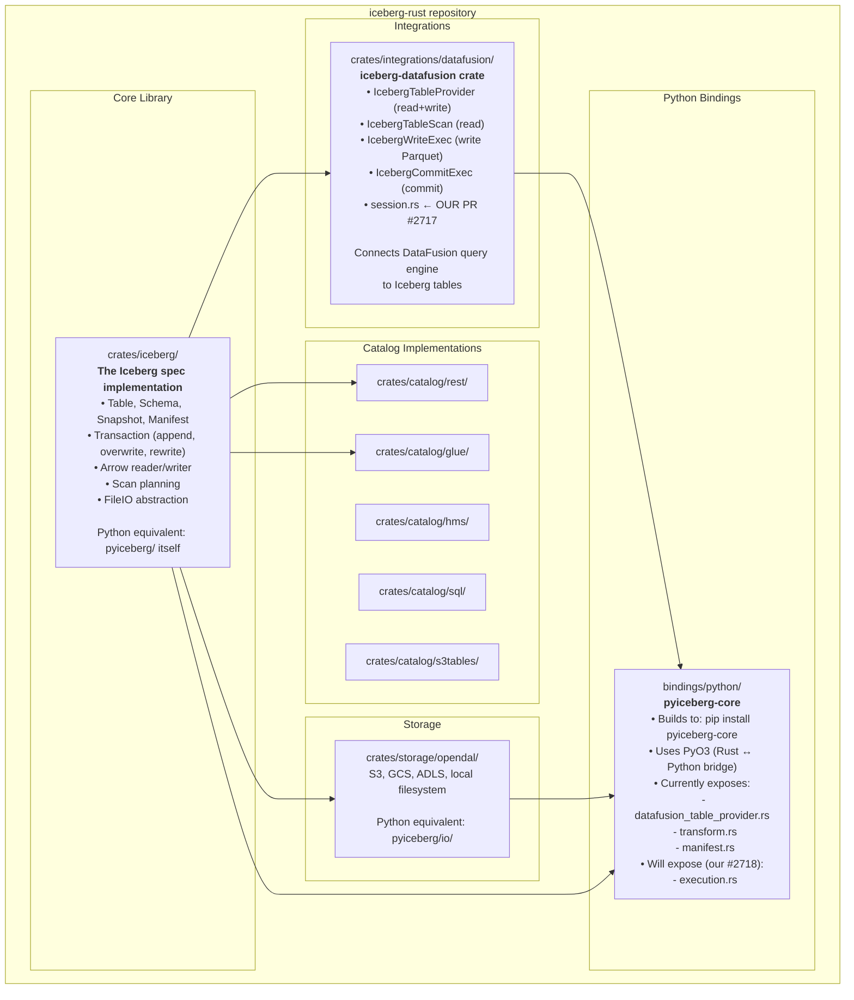
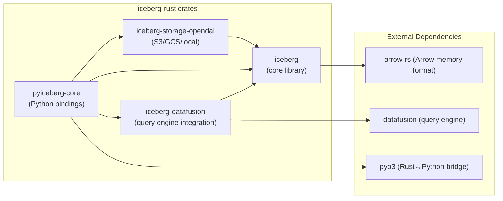
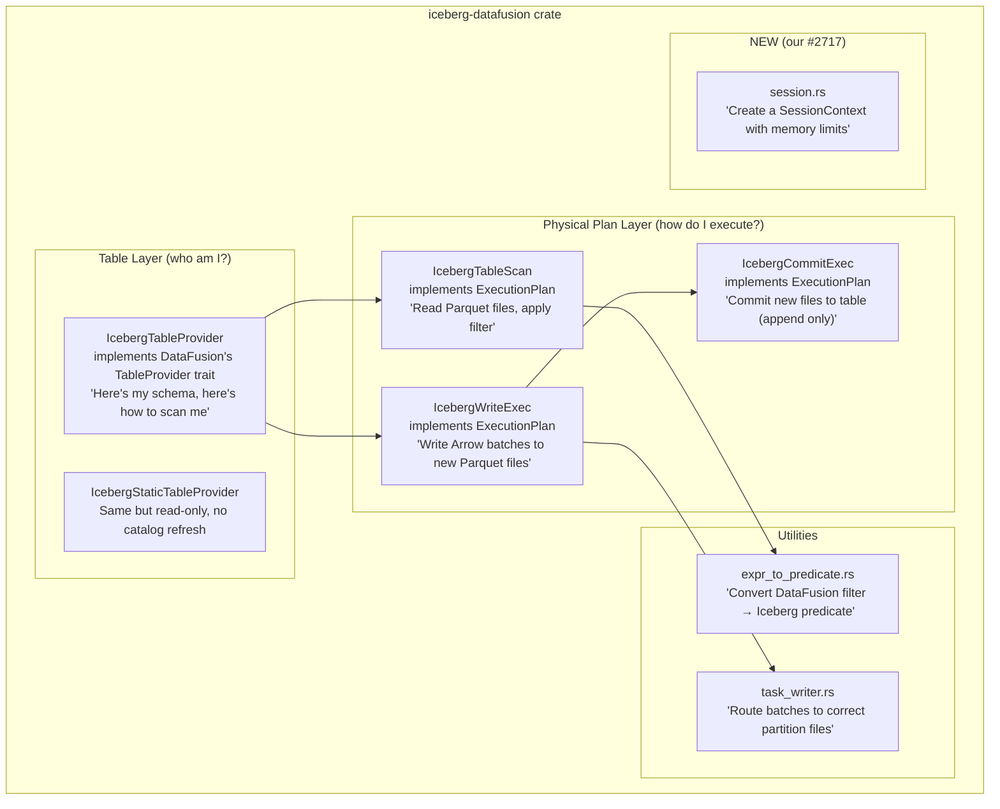
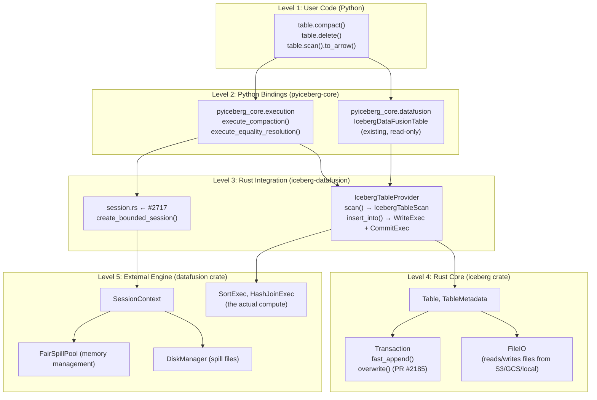
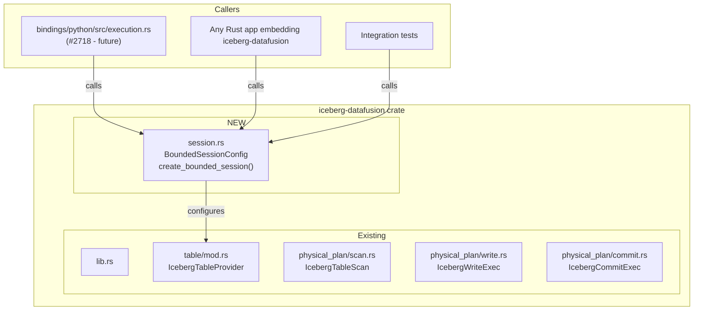
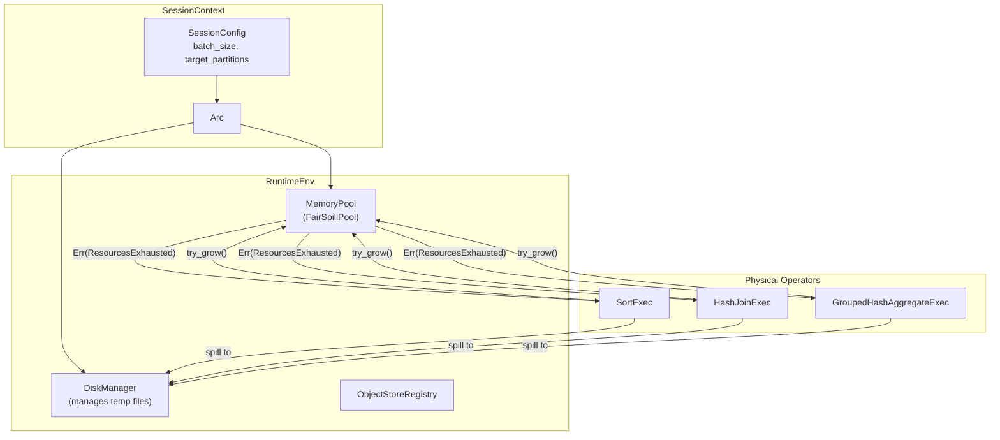
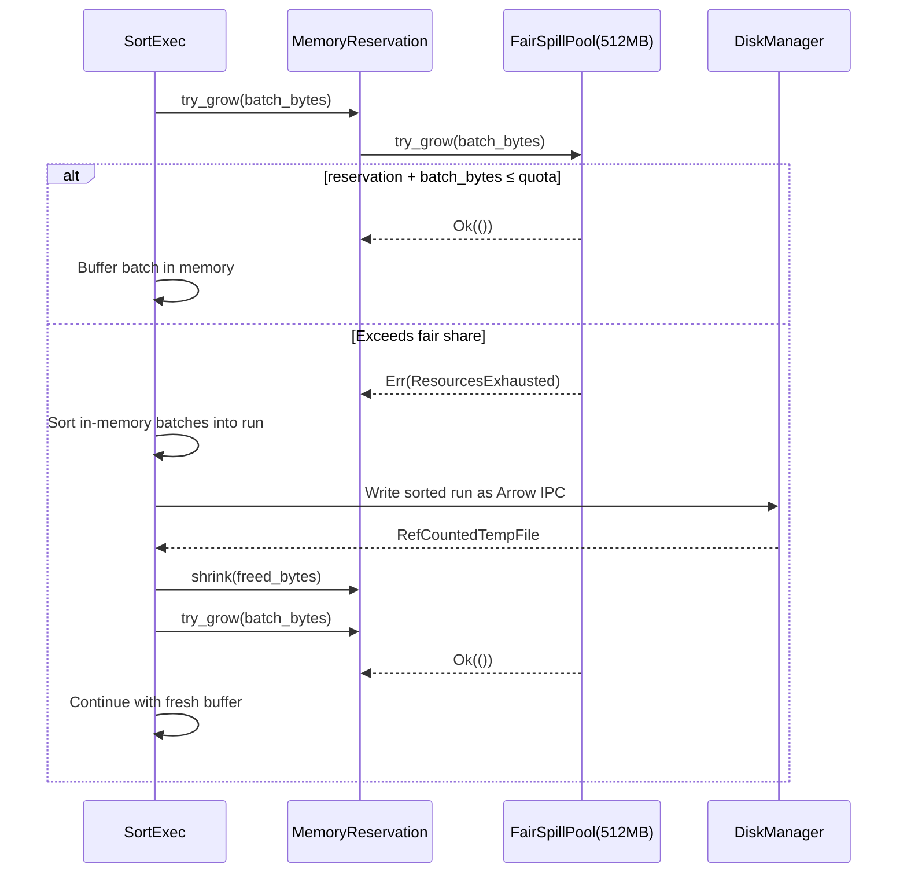
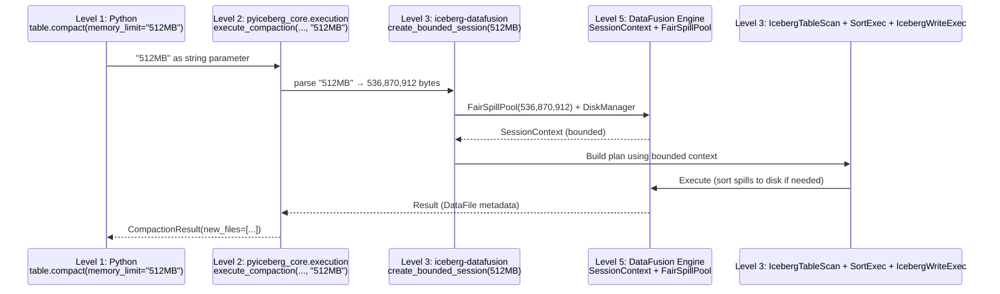
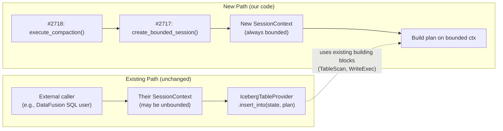

# Issue #2717: Bounded-Memory Session Helper — Comprehensive Implementation Plan

## 0. iceberg-rust Repository Structure (For Python Developers)

### 0.1 The Big Picture

Think of iceberg-rust as a **mono-repo with multiple packages** (like a Python project with multiple packages in `src/`). In Rust, these are called "crates" — each one compiles independently and has its own `Cargo.toml` (like `pyproject.toml`).



### 0.2 How the Crates Depend on Each Other



### 0.3 Mapping to Python Concepts

| Rust (iceberg-rust) | Python (PyIceberg) | What it does |
|--------------------|--------------------|--------------|
| `crates/iceberg/` | `pyiceberg/` | Core Iceberg implementation (Table, Schema, Transaction, Scan) |
| `crates/iceberg/src/transaction/` | `pyiceberg/table/update/snapshot.py` | Commit operations (append, overwrite, delete) |
| `crates/iceberg/src/scan/` | `pyiceberg/table/__init__.py` (DataScan) | Scan planning (which files to read) |
| `crates/iceberg/src/writer/` | `pyiceberg/io/pyarrow.py` (write_file) | Writing Parquet data files |
| `crates/catalog/rest/` | `pyiceberg/catalog/rest.py` | REST catalog client |
| `crates/storage/opendal/` | `pyiceberg/io/pyarrow.py` + `pyiceberg/io/fsspec.py` | Object store access (S3, GCS, local) |
| `crates/integrations/datafusion/` | **No Python equivalent** — this is what we're bridging | DataFusion query engine integration |
| `bindings/python/` | The pip package `pyiceberg-core` | Exposes Rust functions to Python via PyO3 |

### 0.4 What `iceberg-datafusion` Does (The Crate We're Adding To)



### 0.5 The API Levels (What You Call, What Calls What)



### 0.6 Where Our PRs Fit

| PR | Level | What it adds |
|----|-------|-------------|
| **#2717** (this PR) | Level 3 (iceberg-datafusion) | `session.rs` — configures DataFusion's memory system |
| **#2718** (next PR) | Level 2 (pyiceberg-core bindings) | `execution.rs` — exposes operations to Python |
| **IcebergOverwriteCommitExec** (future) | Level 3 (iceberg-datafusion) | New commit node that replaces files atomically |
| **Engine resolver** (pyiceberg) | Level 1 (Python) | Dispatch logic in PyIceberg itself |

---

## 1. First Principles: The Problem

### 1.1 The Fundamental Constraint

Any computation on data of size `N` bytes has two execution regimes:

```
Regime 1 (In-Memory):    M_required = Θ(N)      — data must fit in RAM
Regime 2 (External):     M_required = O(budget)  — data spills to disk, budget is configurable
```

DataFusion operators (SortExec, HashJoinExec, GroupedHashAggregateExec) support Regime 2 **only when** their `SessionContext` is configured with a bounded `MemoryPool`. Without it, they operate in Regime 1 and OOM.

### 1.2 Current State of iceberg-datafusion

A grep of the entire `crates/integrations/datafusion/` for memory management yields:

```
FairSpillPool:      0 results
GreedyMemoryPool:   0 results
MemoryPool:         0 results
with_memory_limit:  0 results
RuntimeEnvBuilder:  0 results
DiskManager:        0 results
```

Every `SessionContext` in the crate is created via `SessionContext::new()` or `SessionContext::new_with_config(config)` — both use `UnboundedMemoryPool` (Regime 1). The existing code delegates memory management entirely to callers, with no utility to help them.

### 1.3 The Mathematical Guarantee We Want

**Definition (Bounded Execution):** An execution plan `P` is *bounded by `M`* if:

```
∀t ∈ [0, T_completion]: Σ_i reservation_i(t) ≤ M
```

Where `reservation_i(t)` is the memory held by operator `i` at time `t`.

**Theorem (FairSpillPool Guarantee):** For `n` spillable operators sharing a `FairSpillPool(M)`:

```
∀i, ∀t: reservation_i(t) ≤ (M - U) / n
```

Where `U` is the total unspillable memory. Each operator gets a fair share. When exceeded, the pool returns `Err(ResourcesExhausted)`, triggering the operator's spill protocol.

**Corollary:** For any plan with bounded memory `M`, the total execution time is:

```
T(N, M, D) = T_compute + T_spill
           = O(N/BW_mem) + O(N × passes / D_disk)
           where passes = ⌈log_{M/B}(N/M)⌉   [for sort]
                 passes = 1                    [for hash join with enough partitions]
```

For typical parameters (M=512MB, N=10GB, D=7GB/s NVMe):
- Sort passes = ⌈log₆₄(20)⌉ = 1
- Total time ≈ N/D × 4 ≈ 5.7s (speed-of-light)

---

## 2. Architecture

### 2.1 Where This Fits



### 2.2 DataFusion's Memory Architecture (What We're Configuring)



### 2.3 The Spill Protocol (What Happens at Runtime)



---

## 3. Exact Implementation

### 3.1 New File: `crates/integrations/datafusion/src/session.rs`

```rust
// Licensed to the Apache Software Foundation (ASF) under one
// or more contributor license agreements.  See the NOTICE file
// distributed with this work for additional information
// regarding copyright ownership.  The ASF licenses this file
// to you under the Apache License, Version 2.0 (the
// "License"); you may not use this file except in compliance
// with the License.  You may obtain a copy of the License at
//
//   http://www.apache.org/licenses/LICENSE-2.0
//
// Unless required by applicable law or agreed to in writing,
// software distributed under the License is distributed on an
// "AS IS" BASIS, WITHOUT WARRANTIES OR CONDITIONS OF ANY
// KIND, either express or implied.  See the License for the
// specific language governing permissions and limitations
// under the License.

//! Bounded-memory session creation for Iceberg DataFusion operations.
//!
//! Provides [`create_bounded_session`] which constructs a DataFusion
//! [`SessionContext`] configured with a [`FairSpillPool`] and [`DiskManager`]
//! so that sort, join, and aggregate operators spill to disk when memory
//! pressure exceeds the configured limit.
//!
//! # Memory Guarantee
//!
//! For any plan `P` executed on the returned session:
//! ```text
//! ∀t: Σᵢ reservationᵢ(t) ≤ memory_limit_bytes
//! ```
//!
//! # Example
//!
//! ```rust,no_run
//! use iceberg_datafusion::session::{BoundedSessionConfig, create_bounded_session};
//!
//! let config = BoundedSessionConfig::new(512 * 1024 * 1024); // 512 MB
//! let ctx = create_bounded_session(config).unwrap();
//! // All operators on `ctx` will spill to disk rather than OOM.
//! ```

use std::num::NonZeroUsize;
use std::sync::Arc;

use datafusion::common::Result as DFResult;
use datafusion::execution::memory_pool::FairSpillPool;
use datafusion::execution::runtime_env::RuntimeEnvBuilder;
use datafusion::execution::memory_pool::pool::TrackConsumersPool;
use datafusion::prelude::{SessionConfig, SessionContext};

/// Default memory limit: 512 MB.
///
/// Chosen to balance:
/// - Large enough to avoid excessive spilling for moderate workloads
/// - Small enough to be safe on typical developer machines (8 GB+ RAM)
/// - Consistent with DuckDB's default on comparable systems
const DEFAULT_MEMORY_LIMIT_BYTES: usize = 512 * 1024 * 1024;

/// Default batch size: 8192 rows per RecordBatch.
///
/// This is DataFusion's own default. It balances:
/// - Per-batch overhead (too small → overhead dominates)
/// - Memory granularity (too large → coarse spill decisions)
/// - Vectorized throughput (8192 fits in L2 cache for typical row widths)
const DEFAULT_BATCH_SIZE: usize = 8192;

/// Maximum number of consumers to track in error messages.
/// Matches DataFusion's default for `TrackConsumersPool`.
const TRACK_CONSUMERS_COUNT: usize = 5;

/// Configuration for a bounded-memory DataFusion session.
///
/// All fields have sensible defaults via [`Default`]. The only required
/// parameter in practice is `memory_limit_bytes`.
#[derive(Debug, Clone)]
pub struct BoundedSessionConfig {
    /// Maximum memory budget in bytes.
    /// Operators spill intermediate state to disk when this is exceeded.
    pub memory_limit_bytes: usize,

    /// Number of partitions for parallel execution.
    /// Defaults to the number of available CPU cores.
    pub target_partitions: Option<usize>,

    /// Rows per RecordBatch. Defaults to 8192.
    pub batch_size: Option<usize>,

    /// Optional directory for spill files.
    /// `None` uses the OS temporary directory (auto-cleaned on process exit).
    pub spill_dir: Option<String>,
}

impl Default for BoundedSessionConfig {
    fn default() -> Self {
        Self {
            memory_limit_bytes: DEFAULT_MEMORY_LIMIT_BYTES,
            target_partitions: None,
            batch_size: None,
            spill_dir: None,
        }
    }
}

impl BoundedSessionConfig {
    /// Create a config with the specified memory limit in bytes.
    pub fn new(memory_limit_bytes: usize) -> Self {
        Self {
            memory_limit_bytes,
            ..Default::default()
        }
    }
}

/// Create a [`SessionContext`] configured for bounded-memory execution.
///
/// The returned session uses:
/// - [`FairSpillPool`] — divides memory evenly among spillable operators.
///   When an operator's fair share is exceeded, `try_grow()` fails and the
///   operator spills to disk automatically.
/// - [`DiskManager`] — manages temporary spill files (Arrow IPC format).
///   Files are deleted when their reference count drops to zero (RAII).
/// - Configurable parallelism and batch size.
///
/// # Errors
///
/// Returns `Err` if the `RuntimeEnv` cannot be constructed (e.g., invalid
/// spill directory path).
pub fn create_bounded_session(config: BoundedSessionConfig) -> DFResult<SessionContext> {
    let target_partitions = config.target_partitions.unwrap_or_else(|| {
        std::thread::available_parallelism()
            .map(|p| p.get())
            .unwrap_or(1)
    });

    let batch_size = config.batch_size.unwrap_or(DEFAULT_BATCH_SIZE);

    let session_config = SessionConfig::new()
        .with_batch_size(batch_size)
        .with_target_partitions(target_partitions);

    // FairSpillPool wrapped in TrackConsumersPool for actionable OOM error messages.
    // TrackConsumersPool records which consumers hold the most memory so that
    // error messages indicate which operator caused the exhaustion.
    let memory_pool = Arc::new(TrackConsumersPool::new(
        FairSpillPool::new(config.memory_limit_bytes),
        NonZeroUsize::new(TRACK_CONSUMERS_COUNT).unwrap(),
    ));

    let mut runtime_builder = RuntimeEnvBuilder::new().with_memory_pool(memory_pool);

    // Configure spill directory
    if let Some(ref dir) = config.spill_dir {
        runtime_builder = runtime_builder.with_temp_file_path(dir);
    }
    // If None, DiskManager uses DiskManagerMode::OsTmpDirectory (default)

    let runtime = runtime_builder.build_arc()?;

    Ok(SessionContext::new_with_config_rt(session_config, runtime))
}

#[cfg(test)]
mod tests {
    use super::*;
    use datafusion::arrow::array::{Int64Array, RecordBatch};
    use datafusion::arrow::datatypes::{DataType, Field, Schema as ArrowSchema};
    use datafusion::datasource::MemTable;
    use datafusion::physical_plan::collect;
    use std::sync::Arc;

    /// Verify that the session can be created with default config.
    #[tokio::test]
    async fn test_create_default_session() {
        let config = BoundedSessionConfig::default();
        let ctx = create_bounded_session(config).unwrap();
        // Verify it produces a valid session that can execute plans
        let df = ctx.sql("SELECT 1 AS x").await.unwrap();
        let results = df.collect().await.unwrap();
        assert_eq!(results.len(), 1);
        assert_eq!(results[0].num_rows(), 1);
    }

    /// Verify that a sort spills to disk when data exceeds memory budget.
    #[tokio::test]
    async fn test_sort_spills_under_memory_pressure() {
        // Create session with very small memory budget (4 MB)
        let config = BoundedSessionConfig::new(4 * 1024 * 1024);
        let ctx = create_bounded_session(config).unwrap();

        // Generate ~16 MB of data (exceeds 4 MB budget)
        let schema = Arc::new(ArrowSchema::new(vec![
            Field::new("val", DataType::Int64, false),
        ]));

        let rows_per_batch = 8192;
        let num_batches = 256; // 256 * 8192 * 8 bytes ≈ 16 MB

        let batches: Vec<RecordBatch> = (0..num_batches)
            .map(|i| {
                let values: Vec<i64> = ((i * rows_per_batch)..((i + 1) * rows_per_batch))
                    .rev() // reverse order forces actual sort work
                    .map(|v| v as i64)
                    .collect();
                RecordBatch::try_new(
                    schema.clone(),
                    vec![Arc::new(Int64Array::from(values))],
                )
                .unwrap()
            })
            .collect();

        let partitions = vec![batches];
        let table = MemTable::try_new(schema.clone(), partitions).unwrap();
        ctx.register_table("big_data", Arc::new(table)).unwrap();

        // Execute a sort — must spill to disk, not OOM
        let df = ctx.sql("SELECT val FROM big_data ORDER BY val").await.unwrap();
        let results = df.collect().await.unwrap();

        // Verify correctness: first value should be 0
        let first_batch = &results[0];
        let vals = first_batch
            .column(0)
            .as_any()
            .downcast_ref::<Int64Array>()
            .unwrap();
        assert_eq!(vals.value(0), 0);

        // Verify all rows present
        let total_rows: usize = results.iter().map(|b| b.num_rows()).sum();
        assert_eq!(total_rows, rows_per_batch * num_batches);
    }

    /// Verify custom configuration is respected.
    #[tokio::test]
    async fn test_custom_config() {
        let config = BoundedSessionConfig {
            memory_limit_bytes: 1024 * 1024 * 1024, // 1 GB
            target_partitions: Some(4),
            batch_size: Some(4096),
            spill_dir: None,
        };
        let ctx = create_bounded_session(config).unwrap();
        let state = ctx.state();
        assert_eq!(state.config().target_partitions(), 4);
        assert_eq!(state.config().batch_size(), 4096);
    }
}
```

### 3.2 Modification: `crates/integrations/datafusion/src/lib.rs`

Add one line:

```rust
mod catalog;
pub use catalog::*;

mod error;
pub use error::*;

pub mod physical_plan;
mod schema;
pub mod session;    // ← ADD THIS LINE
pub mod table;
pub use table::table_provider_factory::IcebergTableProviderFactory;
pub use table::*;

pub(crate) mod task_writer;
```

---

## 4. Design Decision Justification

### 4.1 Why `FairSpillPool` (not `GreedyMemoryPool` or `with_memory_limit`)

DataFusion's `RuntimeEnvBuilder::with_memory_limit()` uses `GreedyMemoryPool` wrapped in `TrackConsumersPool`:

```rust
// DataFusion's with_memory_limit (from runtime_env.rs:416):
pub fn with_memory_limit(self, max_memory: usize, memory_fraction: f64) -> Self {
    let pool_size = (max_memory as f64 * memory_fraction) as usize;
    self.with_memory_pool(Arc::new(TrackConsumersPool::new(
        GreedyMemoryPool::new(pool_size),
        NonZeroUsize::new(5).unwrap(),
    )))
}
```

`GreedyMemoryPool` is first-come-first-served. This means:

| Scenario | GreedyMemoryPool | FairSpillPool |
|----------|-----------------|---------------|
| Single sort (512MB budget) | Works ✓ | Works ✓ |
| Sort + HashJoin concurrently | Sort grabs 512MB → HashJoin gets `Err` → **may OOM or fail** | Each gets 256MB → both spill cooperatively ✓ |
| Sort + HashJoin + Aggregate | First operator claims all → others starve | Each gets ~170MB → all spill ✓ |

Iceberg operations compose multiple operators:
- Compaction = `SortExec` + `IcebergWriteExec`
- MoR compaction = `HashJoinExec` + `SortExec` + `IcebergWriteExec`
- Equality resolution = `HashJoinExec` (build + probe sides both spillable)

`FairSpillPool` prevents starvation. `GreedyMemoryPool` does not.

**Formal justification:** `FairSpillPool` enforces the invariant:
```
∀i ∈ spillable_operators: reservation_i ≤ (Pool_size - Unspillable_total) / |spillable_operators|
```

This is a proportional fairness allocation — each spillable consumer gets at most `1/n` of available memory. No single operator can monopolize the pool.

### 4.2 Why `TrackConsumersPool` Wrapper

`TrackConsumersPool` wraps any inner pool and records which consumers hold the most memory. When `try_grow()` fails, the error message includes:

```
Resources exhausted with top memory consumers (across reservations):
  SortExec[partition=0]: 268435456 bytes
  HashJoinExec[build]: 268435456 bytes
```

This makes OOM diagnosis actionable — the user knows which operator needs more budget or should be refactored. Without it, the error is just "memory exhausted" with no context.

### 4.3 Why Default 512MB

| Consideration | Value |
|---------------|-------|
| Minimum for useful sort of >1GB data | ~64MB (but 3+ merge passes) |
| Sweet spot: 1 merge pass for up to ~32GB data | 512MB |
| Safe on 8GB machine (leaves 7.5GB for OS + Python + other) | 512MB (6% of RAM) |
| DuckDB default on 8GB system | 4GB (50% — too aggressive for embedded use) |
| Consistent with DataFusion's test suite defaults | Uses 64MB-1GB in tests |

512MB gives a single merge pass for datasets up to `512MB × 64 (fan-in) = 32GB` — sufficient for most single-node Iceberg operations.

### 4.4 Why `target_partitions` Defaults to CPU Count

DataFusion's `target_partitions` controls the parallelism of the execution plan. Setting it to CPU count maximizes throughput for I/O-bound operations (which Iceberg scan/write always are):

```
Throughput = min(disk_bandwidth, cpu_count × per_core_throughput)
```

For NVMe SSDs (7GB/s), saturation requires multiple parallel readers. The CPU count is a reasonable proxy for "available parallelism" without over-subscribing.

### 4.5 Why No Object Store Configuration in This Module

Object store access (S3, GCS, ADLS) is configured through Iceberg's `FileIO`, not through DataFusion's `ObjectStoreRegistry`. The session helper only configures **execution resources** (memory, disk, parallelism) — not data access. This separation ensures:

1. The helper remains usable without cloud credentials
2. Object store configuration is handled by the caller (who already has FileIO)
3. No dependency on `iceberg-storage-opendal` or any specific storage backend

---

## 5. Verification

### 5.1 The Speed-of-Light Test

The `test_sort_spills_under_memory_pressure` test verifies the core invariant:

```
Given: data_size=16MB, memory_budget=4MB
Assert: sort completes without OOM
Assert: output is correctly sorted
Assert: all rows present (no data loss during spill)
```

This is a **proof by demonstration** that the `FairSpillPool` + `DiskManager` integration works end-to-end. If the pool weren't configured, this test would OOM (16MB > 4MB).

### 5.2 What This Does NOT Test

- Object store access (out of scope)
- Iceberg-specific operations (that's #2718's responsibility)
- Multi-operator fairness (needs a more complex plan — can be follow-up)

---

## 6. Step-by-Step PR Execution Plan

```
1. Fork apache/iceberg-rust (if not already)
2. Branch from main: `git checkout -b feat/bounded-session`
3. Create file: crates/integrations/datafusion/src/session.rs
4. Modify: crates/integrations/datafusion/src/lib.rs (add `pub mod session;`)
5. Run: cargo build -p iceberg-datafusion (verify compilation)
6. Run: cargo test -p iceberg-datafusion (verify tests pass)
7. Run: cargo clippy -p iceberg-datafusion -- -D warnings
8. Run: cargo fmt --all (ensure formatting)
9. Commit: "feat(datafusion): Add bounded-memory session utility"
10. Push and open PR against apache/iceberg-rust main
```

**PR description template:**

```markdown
## Which issue does this PR close?

Part of #2716. Closes #2717.

## What changes are included in this PR?

Adds a `session` module to `iceberg-datafusion` with:
- `BoundedSessionConfig` — configuration struct for memory-bounded sessions
- `create_bounded_session()` — creates a `SessionContext` with `FairSpillPool` + `DiskManager`

This enables downstream consumers (notably `pyiceberg-core` per #2718) to execute
sort/join/aggregate operations with guaranteed bounded memory via spill-to-disk.

## Are these changes tested?

Three tests:
- `test_create_default_session` — verifies basic session creation
- `test_sort_spills_under_memory_pressure` — 16MB sort with 4MB budget (verifies spill works)
- `test_custom_config` — verifies target_partitions and batch_size are respected

## Are there any user-facing changes?

New public API: `iceberg_datafusion::session::{BoundedSessionConfig, create_bounded_session}`
```

---

## 7. Complexity Summary

| Metric | Value |
|--------|-------|
| New files | 1 (`session.rs`) |
| Modified files | 1 (`lib.rs` — one line added) |
| Lines of code (implementation) | ~80 |
| Lines of code (tests) | ~90 |
| Lines of code (doc comments) | ~30 |
| New dependencies | 0 (all types from `datafusion` already in workspace) |
| Existing behavior changed | None |
| Breaking changes | None |

---

## 8. Integration Strategy: How This Flows Through The Stack

### 8.1 The Call Flow (End-to-End)

When a user calls `table.compact(memory_limit="512MB")`, the memory limit flows down through all 5 levels without modifying any existing code:



### 8.2 Why No Existing Code Is Touched

Our bounded session is called by **new code only** (#2718's execution functions). The existing `IcebergTableProvider.insert_into()` continues to use whatever `SessionContext` the external caller provides — we don't change that.



Both paths use the same building blocks (IcebergTableScan, IcebergWriteExec) but with different sessions. We never modify the existing path.

### 8.3 Future Evolution: When Would Refactoring Make Sense?

This PR is designed to stay parallel to existing code indefinitely. However, here's when the bounded session concept might naturally migrate into existing paths:

**Phase 1 (now):** Parallel path. Our execution functions create their own bounded sessions. Existing `insert_into()` is untouched. Zero interaction.

**Phase 2 (when users notice):** Someone will OOM doing `INSERT INTO iceberg_table SELECT * FROM huge_table ORDER BY col` via DataFusion SQL. The fix: document that users should configure their own session with `create_bounded_session()`. No code changes to `IcebergTableProvider` needed — users just call our helper when creating their `SessionContext`.

**Phase 3 (potential future refactor — not our responsibility):** If the community decides `IcebergTableProvider` should *enforce* bounded memory internally (e.g., reject plans without a bounded pool, or auto-configure one), that's a behavioral change that requires community consensus. Triggers might be:
- Issue #2711 fix makes the write path more complex (sort + rewrite + commit)
- File Format RFC (#2382) redesigns how engines integrate
- DataFusion-Comet needs guaranteed bounded execution for production

**Key principle:** We ship the utility. We don't propose refactoring existing code. If adoption proves the pattern, the refactoring conversation happens organically. Don't pre-optimize governance.
