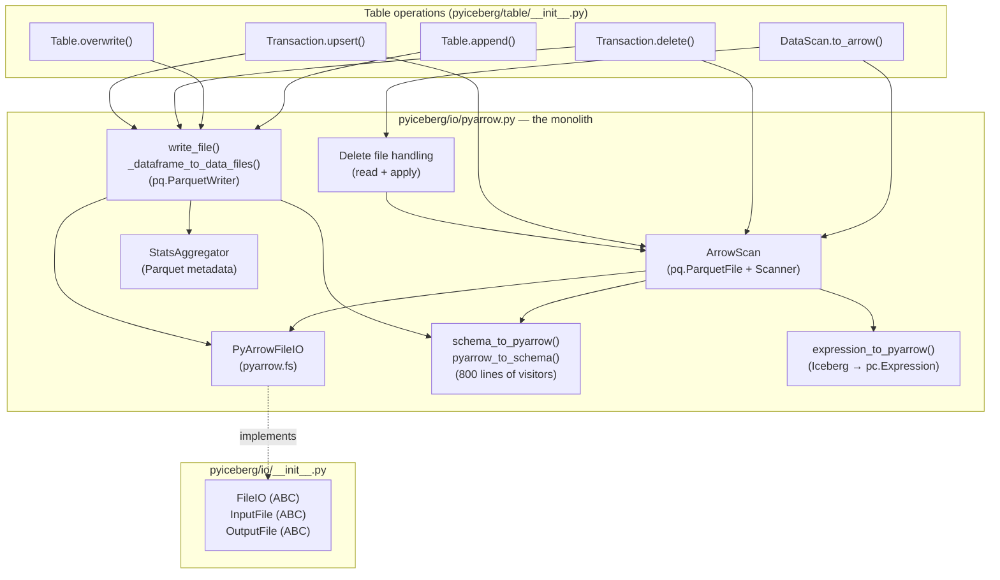
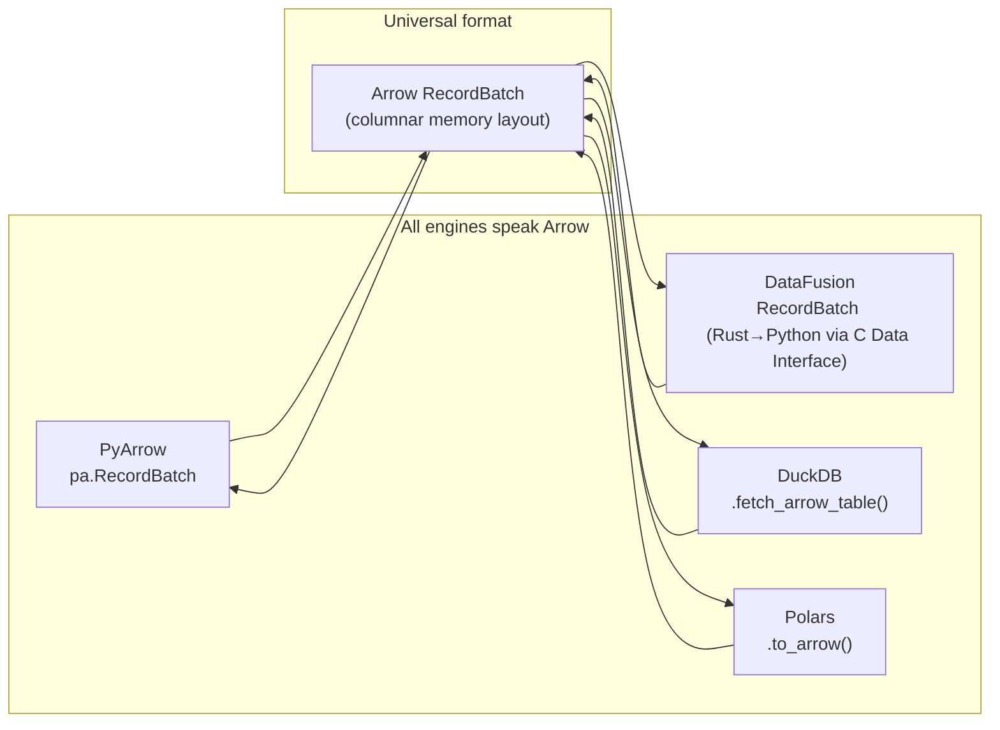
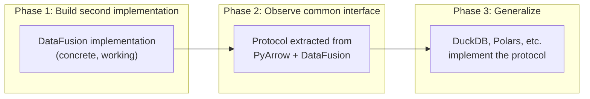

# Pluggable Compute Backend: Feasibility Analysis

## Kevin's Latest Comment (2026-06-28)

> Thanks! I think a good next step is to understand how we use pyarrow today and how
> to decouple it from the rest of the code.
>
> Would be great to be able to use different backend for reading and writing --
> datafusion, duckdb, pyarrow, etc 😄

This is an aspirational direction toward a pluggable I/O + compute backend where users
or contributors can choose which engine handles reading, writing, and compute.

This document analyzes what "decoupling from PyArrow" actually means, what is and isn't
pluggable, and how this shapes our implementation plan.

---

## 1. First Principles: Arrow the Format vs. PyArrow the Library

### 1.1 The Critical Distinction

The phrase "decouple from PyArrow" is ambiguous. There are two entirely different things
called "Arrow" in this context:

| Concept | What it is | Role in Iceberg | Decouplable? |
|---------|-----------|-----------------|:---:|
| **Arrow format** | A columnar in-memory data layout specification (RecordBatch, Schema, DataType) | THE canonical in-memory representation for Iceberg data. All engines (Spark, Flink, DataFusion, DuckDB, Polars) speak Arrow as their interchange format. | **No** — this is the universal standard |
| **`pyarrow` library** | A specific Python package that implements Arrow + Parquet codec + compute kernels + filesystem | Currently the only library PyIceberg uses for reading Parquet, writing Parquet, filtering, sorting, and schema conversion | **Yes** — other libraries can also read Parquet → Arrow |

**Axiom (Arrow Format Permanence):** The Arrow columnar format is Iceberg's in-memory
representation. It appears in PyIceberg's public API signatures (`pa.Table`, `pa.RecordBatch`,
`pa.RecordBatchReader`) and is the interchange format between ALL engines. It is never
decoupled. It is the wire format — the common language.

**What "decouple from PyArrow" means:** Replace `pyarrow` the *library* (who reads Parquet,
who does compute) while keeping Arrow the *format* (what the data looks like in memory).

### 1.2 Why Arrow the Format Cannot Be Replaced

Arrow is not merely PyIceberg's internal choice — it IS how Iceberg data exists in memory
across the entire ecosystem:

```
Parquet (on disk) ←→ Arrow (in memory) ←→ Engine (query/compute)
```

- Spark reads Iceberg → Arrow (via Parquet reader)
- Flink reads Iceberg → Arrow (via Parquet reader)
- DataFusion reads Iceberg → Arrow (native)
- DuckDB reads Iceberg → Arrow (native)
- Polars reads Iceberg → Arrow (native, via arrow2/arrow-rs)

Every modern analytics engine uses Arrow as its in-memory format or has zero-copy Arrow
interop. This is by design — the Arrow project exists specifically to be this universal
standard so engines don't waste time converting between formats.

PyIceberg's public API types are Arrow types:

```python
def append(self, df: pa.Table | pa.RecordBatchReader, ...) -> None: ...
def to_arrow(self) -> pa.Table: ...
def to_arrow_batch_reader(self) -> pa.RecordBatchReader: ...
```

These are correct and permanent. They are not coupling to a library — they are adopting
the standard.

### 1.3 What IS Decouplable: The Library Operations

The `pyarrow` package does multiple jobs inside PyIceberg. Each can potentially be done
by a different library that also speaks Arrow:

| Job | Current implementor | Could also do it |
|-----|--------------------|--------------------|
| Read Parquet → Arrow batches | `pyarrow.parquet` | DataFusion, DuckDB, Polars |
| Write Arrow batches → Parquet | `pyarrow.parquet.ParquetWriter` | DataFusion (IcebergWriteExec), DuckDB |
| Filter Arrow data by predicate | `pyarrow.compute` (pc.Expression) | DataFusion (SQL), DuckDB (SQL) |
| Sort Arrow data | `pa.Table.sort_by()` | DataFusion (SortExec), DuckDB |
| Join two Arrow datasets | **Not available in PyArrow** | DataFusion (HashJoinExec), DuckDB |
| Collect column statistics | `pyarrow.parquet` metadata | Any Parquet reader |
| Access object storage (S3/GCS) | `pyarrow.fs` (PyArrowFileIO) | `fsspec`, `object_store` |

**Theorem (Pluggable Surface):** The set of operations that can be provided by different
backends is exactly the set of operations where:
1. The input is expressible as Arrow data + metadata (file paths, schema, predicates)
2. The output is Arrow data + metadata (RecordBatches, DataFile descriptors)
3. The operation semantics are engine-independent (sort, join, filter are mathematical — same output regardless of who computes it)

All six jobs above satisfy these criteria. They are pluggable.

---

## 2. How PyArrow Is Coupled in PyIceberg Today

### 2.1 The Monolith

`pyiceberg/io/pyarrow.py` is a **3,046-line file** that performs all six jobs listed above.
It is not structured as a pluggable backend — it directly calls `pyarrow` APIs throughout:

```
pyiceberg/io/pyarrow.py (3,046 lines):
├── FileIO implementation (PyArrowFileIO) — L393-697
│   └── Uses pyarrow.fs for S3/GCS/local access
├── Schema conversion (Iceberg ↔ Arrow) — L699-1575
│   └── 800+ lines of visitor pattern code
├── Expression conversion — L853-1069
│   └── Iceberg BooleanExpression → pc.Expression
├── Reading (ArrowScan) — L1728-1914
│   └── Uses pq.ParquetFile, pyarrow.dataset.Scanner
├── Writing — L2617-2960
│   └── Uses pq.ParquetWriter
├── Statistics collection — L2198-2500
│   └── Reads Parquet row group metadata
└── Delete file handling — L1070-1727
    └── Reads delete files, applies positional deletes
```

### 2.2 Dependency Graph



### 2.3 The Three Layers of Coupling

**Layer 1: Byte-level I/O — Already abstract**

`FileIO` is an ABC: `new_input(path) → InputFile`, `new_output(path) → OutputFile`,
`delete(path)`. `PyArrowFileIO` implements it via `pyarrow.fs`. This is already pluggable.

**Layer 2: Parquet Read/Write — Tightly coupled to `pyarrow.parquet`**

`ArrowScan` calls `pq.ParquetFile()` and `Scanner.to_batches()`. `write_file` calls
`pq.ParquetWriter()`. These are direct API calls to the `pyarrow` library, not behind
any interface.

However: all inputs/outputs at this layer are Arrow types (RecordBatch, Schema). A
different Parquet library (DataFusion, DuckDB) would produce the same Arrow types.
The coupling is to the **library**, not to the **format**.

**Layer 3: Compute — Partially coupled**

- `pa.Table.sort_by()` — coupled to PyArrow
- `pc.is_in()` for delete resolution — coupled to PyArrow
- No join capability exists in PyArrow at all (the gap that motivates this entire project)

This layer is where DataFusion provides capabilities PyArrow structurally lacks.

---

## 3. The Pluggable Interface: What It Looks Like

### 3.1 Formal Decomposition

```
Backend = ParquetReader × ParquetWriter × ComputeEngine

Where all three communicate exclusively via Arrow RecordBatch/Table.
```

Since Arrow is the fixed wire format, the interface between PyIceberg and any backend
is purely:

```
Input:  Arrow data (RecordBatch/Table) + metadata (file paths, Schema, predicates)
Output: Arrow data (RecordBatch/Table) + metadata (DataFile descriptors)
```

### 3.2 Interface Definition

```python
class IOBackend(Protocol):
    """Who reads and writes Parquet files."""

    def read_parquet(
        self,
        location: str,
        schema: Schema,
        projection: list[int],           # field IDs to project
        filter: BooleanExpression,
        io_properties: dict[str, str],
    ) -> Iterator[pa.RecordBatch]: ...

    def write_parquet(
        self,
        batches: Iterator[pa.RecordBatch],
        location: str,
        schema: Schema,
        properties: dict[str, str],       # target file size, compression, etc.
        io_properties: dict[str, str],
    ) -> DataFile: ...                    # returns metadata about written file

    def collect_statistics(
        self,
        location: str,
        schema: Schema,
        io_properties: dict[str, str],
    ) -> dict[int, ColumnStatistics]: ... # field_id → stats


class ComputeBackend(Protocol):
    """Who does sort/join/filter on Arrow data."""

    def sort(
        self,
        data: pa.Table | Iterator[pa.RecordBatch],
        sort_keys: list[tuple[str, str]],  # (column, "ascending"/"descending")
        memory_limit: int,
    ) -> Iterator[pa.RecordBatch]: ...

    def anti_join(
        self,
        left: pa.Table | Iterator[pa.RecordBatch],
        right: pa.Table | Iterator[pa.RecordBatch],
        on: list[str],
        memory_limit: int,
    ) -> Iterator[pa.RecordBatch]: ...

    def filter(
        self,
        data: pa.Table | Iterator[pa.RecordBatch],
        predicate: BooleanExpression,
    ) -> Iterator[pa.RecordBatch]: ...
```

**Key property:** Every input and output is Arrow. The interface is engine-agnostic
at the type level. Any engine that can produce/consume Arrow RecordBatches can implement it.

### 3.3 Why Arrow Makes This Tractable



Because Arrow is the universal interchange format, there is **zero serialization cost**
between backends. DataFusion produces an Arrow RecordBatch; PyIceberg's write layer
(even if still using PyArrow's ParquetWriter) consumes it directly. No copy, no
conversion.

This means a hybrid approach works: DataFusion for compute, PyArrow for writing.
Or DuckDB for reading, DataFusion for compute, PyArrow for writing. The Arrow format
makes composition free.

---

## 4. Speed-of-Light Analysis: What Does Pluggability Cost?

### 4.1 The Overhead of Indirection

A pluggable interface adds one virtual dispatch per operation call. Cost:

```
T_dispatch = O(1) ≈ 50ns (Python attribute lookup + function call)
T_operation = O(N/D) ≈ seconds (I/O + compute)
T_dispatch / T_operation ≈ 10⁻⁸ — negligible
```

### 4.2 The Real Cost: Refactoring the Monolith

The actual cost is human effort to decompose `pyiceberg/io/pyarrow.py`:

| Task | Effort | Risk |
|------|--------|------|
| Define `IOBackend` + `ComputeBackend` protocols | Small | Low |
| Extract `PyArrowIOBackend` from monolith (move code, no behavior change) | **Large** | Medium (3K lines, many internal dependencies) |
| Schema conversion stays shared (Arrow format is fixed) | None | None |
| Implement `DataFusionComputeBackend` | Medium | Low (new code) |
| Implement `DataFusionIOBackend` (read via register_parquet) | Medium | Low |
| Wire up backend selection in table operations | Medium | Low |

### 4.3 The Schema Conversion Is NOT Backend-Specific

A crucial insight: `schema_to_pyarrow()` and `pyarrow_to_schema()` (800 lines) are NOT
"coupling to PyArrow." They convert between Iceberg's schema model and the Arrow format's
schema model. Since Arrow is the universal format, this conversion is needed by ALL
backends. DataFusion, DuckDB, and Polars all use Arrow schemas.

These 800 lines are **shared infrastructure**, not backend-specific code. They stay
regardless of which backend reads/writes. This significantly reduces the actual
refactoring surface — the schema code doesn't move; it's already in the right place.

### 4.4 Expression Conversion IS Backend-Specific

`expression_to_pyarrow()` converts Iceberg predicates → `pc.Expression`. A DataFusion
backend would need `expression_to_sql()`. A DuckDB backend would need its own conversion.

This is a genuine per-backend cost. But expressions are comparatively simple — a typical
predicate converts to one line of SQL. The 200-line PyArrow expression visitor is large
because of PyArrow's verbose API, not because the logic is complex.

---

## 5. Feasibility Verdict

### 5.1 Is It Tangible?

**Yes, but with the correct ordering.**

The interface is narrow (~7 methods). Arrow as the wire format means zero-copy
composition. The refactoring is large but mechanical (move existing code behind a
protocol without changing behavior). New backends are moderate effort because they
just need to produce/consume Arrow.

### 5.2 Is It Worth Doing Now?

**No — but it's worth designing toward.**

The cost-benefit today:
```
Cost_now  = R (refactor monolith) + I_interface + M (maintenance)
Benefit_now = B_datafusion (only one new backend exists)
```

The cost-benefit after DataFusion implementation proves the pattern:
```
Cost_later = R (refactor monolith, with benefit of hindsight)
Benefit_later = B_datafusion + B_duckdb + B_polars + community contributions
```

Doing the refactoring NOW gives us one new backend (DataFusion) but risks getting
the interface wrong. Doing it AFTER gives us a proven DataFusion implementation to
generalize from, and the interface emerges from real usage rather than speculation.

---

## 6. The Phased Strategy

### Phase 1 (Now): Build DataFusion Directly, Interface Emerges Implicitly

Build `pyiceberg/execution/compute.py` with DataFusion. The function signatures ARE the
implicit interface:

```python
def anti_join(left: pa.Table, right: pa.Table, on: list[str], ...) -> pa.Table: ...
def sort_batches(data: pa.Table, sort_keys: list[str], ...) -> pa.Table: ...
def filter_parquet(file_path: str, predicate_sql: str, ...) -> pa.Table: ...
```

These signatures are engine-agnostic: accept Arrow, return Arrow. The implementation
uses DataFusion. Swapping to DuckDB later means changing function bodies, not signatures.

**This is the second concrete implementation** (alongside PyArrow). After two exist, the
shared interface becomes obvious.

### Phase 2 (After DataFusion is proven): Formalize the Protocol

Extract `ComputeBackend` and `IOBackend` protocols by observing what PyArrow and
DataFusion have in common. Refactor `pyiceberg/io/pyarrow.py` into a `PyArrowBackend`
that implements the protocol.

This is a **pure refactoring** — no new features, just restructuring. Behavior is
unchanged. Fully testable by running existing test suite against the extracted backend.

### Phase 3 (Community-driven): Additional Backends

With the protocol defined, contributors can add:
- `DuckDBBackend` (read + compute via DuckDB)
- `PolarsBackend` (read + compute via Polars)
- Hybrid configurations (DuckDB for read, DataFusion for compute, PyArrow for write)

Backend selection could be configured via `.pyiceberg.yaml`:
```yaml
execution:
  backend: datafusion  # or: pyarrow, duckdb
```

### Why This Ordering Is Correct



**CS Principle (Interface Emergence — Fowler):** Correct abstractions emerge from
generalizing concrete implementations, not from speculative design.

> "When you have two or three implementations of something, then you can see what
> the interface should be. When you have one implementation, you're just guessing."

We have one implementation today (PyArrow). We're building a second (DataFusion). After
both exist, the shared interface becomes obvious. Building the abstraction before the
second implementation violates this principle.

---

## 7. Does This Change Our Immediate Plan?

**No.** Kevin's comment signals long-term direction, not a prerequisite for our first PR.
Our plan stays:

1. Engine resolution module
2. Bounded-session helpers
3. Object store bridge
4. First operation (upsert or equality deletes)

The function signatures we write will naturally form the protocol that Phase 2 extracts.
We are building toward pluggability by writing clean Arrow-in/Arrow-out functions — not
by building the abstraction layer first.

---

## 8. Summary

| Question | Answer |
|----------|--------|
| Can we decouple from Arrow the format? | **No** — it's the universal standard, in the public API, correct and permanent |
| Can we decouple from `pyarrow` the library? | **Yes** — other libraries can read/write Parquet and compute on Arrow |
| Is the interface narrow? | Yes — ~7 methods, all Arrow-in/Arrow-out |
| Is refactoring the monolith feasible? | Yes, but large (3K lines) and best done after Phase 1 |
| Should we build the pluggable interface now? | No — build DataFusion first, extract protocol after |
| Does this change our immediate plan? | No — we write clean Arrow-based functions that ARE the implicit interface |
