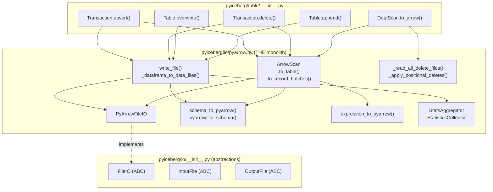
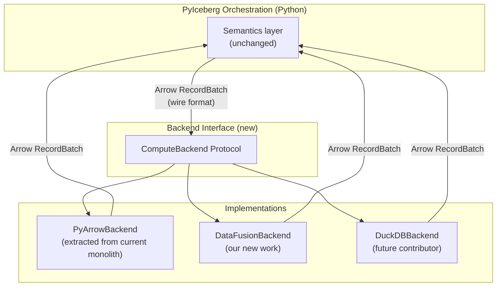

# Pluggable Compute Backend: Feasibility Analysis

## Kevin's Latest Comment (2026-06-28)

> Thanks! I think a good next step is to understand how we use pyarrow today and how
> to decouple it from the rest of the code.
>
> Would be great to be able to use different backend for reading and writing --
> datafusion, duckdb, pyarrow, etc 😄

This represents a shift from Kevin's earlier comment (which said "use DataFusion like
PyArrow is used today") toward a more ambitious goal: **a pluggable I/O + compute backend**
where users can choose their engine.

This document rigorously analyzes whether this is feasible, what it would take, and
whether it changes our immediate implementation plan.

---

## 1. How PyArrow Is Actually Coupled in PyIceberg Today

### 1.1 The Coupling Topology

`pyiceberg/io/pyarrow.py` is a **3,046-line monolith** that handles:

```
pyiceberg/io/pyarrow.py (3,046 lines):
├── FileIO implementation (PyArrowFileIO) — L393-697
│   ├── new_input() → PyArrowFile
│   ├── new_output() → PyArrowFile
│   └── delete()
├── Schema conversion (Iceberg ↔ Arrow) — L699-1575
│   ├── schema_to_pyarrow()
│   ├── pyarrow_to_schema()
│   └── Multiple visitor classes
├── Expression conversion (Iceberg → PyArrow filter) — L853-1069
│   └── expression_to_pyarrow()
├── Reading (ArrowScan) — L1728-1914
│   ├── to_table() → pa.Table
│   └── to_record_batches() → Iterator[RecordBatch]
├── Writing — L2617-2960
│   ├── write_file() → Iterator[DataFile]
│   └── _dataframe_to_data_files()
├── Statistics collection — L2198-2500
├── Delete file handling — L1070-1727
└── Projection/type conversion utilities
```

### 1.2 Formal Dependency Graph



### 1.3 The Three Layers of Coupling

**Layer 1: FileIO (Already Abstract)**

`FileIO` is an ABC with `new_input()`, `new_output()`, `delete()`. `PyArrowFileIO` is
one implementation. This layer is **already pluggable** — you could write a DuckDB-backed
FileIO or a DataFusion-backed one. However, `FileIO` only handles byte-level I/O (open
file, read bytes, write bytes). It doesn't handle Parquet decoding, schema conversion, or
expression evaluation.

**Layer 2: Parquet Read/Write (Tightly Coupled to PyArrow)**

`ArrowScan` and `write_file()` use `pyarrow.parquet` directly:
- `pq.ParquetFile(input_file)` for reading
- `pq.ParquetWriter(output_file, schema)` for writing
- `pa.RecordBatch` / `pa.Table` as the in-memory format
- `pyarrow.dataset.Scanner` for predicate pushdown

These are NOT behind an interface. They call PyArrow APIs directly.

**Layer 3: Schema + Expression + Statistics (Deeply Intertwined)**

- `schema_to_pyarrow()` converts Iceberg schema → `pa.Schema`
- `expression_to_pyarrow()` converts Iceberg filter → `pc.Expression`
- `StatsAggregator` computes Parquet column statistics via PyArrow

These involve 800+ lines of visitor pattern code specific to PyArrow's type system.

---

## 2. What Would a Pluggable Backend Require?

### 2.1 Formal Interface Definition

To support multiple backends (PyArrow, DataFusion, DuckDB), we'd need to abstract over:

```python
class ComputeBackend(Protocol):
    """Abstract interface for read/write/compute operations."""

    # Reading
    def read_parquet(
        self,
        file: InputFile,
        schema: Schema,
        projection: list[str],
        filter: BooleanExpression,
    ) -> RecordBatchIterator: ...

    def read_parquet_to_table(
        self,
        file: InputFile,
        schema: Schema,
        projection: list[str],
        filter: BooleanExpression,
    ) -> pa.Table: ...  # ← Problem: return type is already PyArrow!

    # Writing
    def write_parquet(
        self,
        data: pa.Table | RecordBatchIterator,
        output_file: OutputFile,
        schema: Schema,
        properties: dict[str, str],
    ) -> DataFile: ...

    # Compute
    def sort(self, data, keys, memory_limit) -> ...: ...
    def anti_join(self, left, right, cols, memory_limit) -> ...: ...
    def filter(self, data, predicate) -> ...: ...

    # Statistics
    def collect_statistics(self, data, schema) -> DataFileStatistics: ...

    # Schema
    def iceberg_schema_to_native(self, schema: Schema) -> Any: ...
    def native_schema_to_iceberg(self, native_schema: Any) -> Schema: ...
```

### 2.2 The Arrow Problem: Data Format Is Not Pluggable

Here's the fundamental issue: **PyArrow isn't just a compute library — it's the in-memory
data format.**

Every interface in PyIceberg that touches data uses `pa.Table` or `pa.RecordBatch`:

```python
# Table API
def append(self, df: pa.Table | pa.RecordBatchReader, ...) -> None: ...
def overwrite(self, df: pa.Table | pa.RecordBatchReader, ...) -> None: ...

# Scan API
def to_arrow(self) -> pa.Table: ...
def to_arrow_batch_reader(self) -> pa.RecordBatchReader: ...

# Output methods
def to_pandas(self) -> pd.DataFrame: ...  # via pa.Table.to_pandas()
def to_duckdb(self, ...) -> DuckDBPyConnection: ...  # registers pa.Table
def to_ray(self) -> ray.data.Dataset: ...  # from pa.Table
```

Arrow is the **lingua franca** — the interchange format between PyIceberg and all
external engines. You can't replace Arrow without replacing the public API contract.

### 2.3 Formal Decomposition: What Is Actually Pluggable

```
PyIceberg's "backend" = FileIO × ParquetCodec × ComputeEngine × DataFormat

Where:
  FileIO        = {PyArrowFS, fsspec, ...}           — ALREADY PLUGGABLE (ABC)
  ParquetCodec  = {PyArrow Parquet, DuckDB Parquet}  — COULD be abstracted
  ComputeEngine = {PyArrow compute, DataFusion, ...} — COULD be abstracted
  DataFormat    = {Arrow RecordBatch}                 — FIXED (public API contract)
```

**Theorem (Minimal Pluggable Surface):** The minimum viable abstraction that enables
backend swapping while preserving API compatibility is:

```
Pluggable = ParquetCodec × ComputeEngine
Fixed     = FileIO (already abstract) × DataFormat (Arrow, public API)
```

You cannot swap the data format (Arrow) because it's in the public API signatures.
You CAN swap who reads/writes Parquet and who does compute.

---

## 3. The Abstraction Cost: Speed-of-Light Analysis

### 3.1 Interface Surface Area

To abstract `ParquetCodec × ComputeEngine`, you need:

| Concern | Current PyArrow API calls | Interface methods needed |
|---------|--------------------------|------------------------|
| Read Parquet file | `pq.ParquetFile`, `Scanner.to_batches()` | `read_file(path, schema, filter, projection) → Iterator[RecordBatch]` |
| Write Parquet file | `pq.ParquetWriter.write_batch()` | `write_file(batches, path, schema, props) → DataFile` |
| Expression eval | `pc.Expression`, visitor pattern | `apply_filter(batches, expression) → Iterator[RecordBatch]` |
| Statistics | `ParquetFile.metadata.row_group.statistics` | `collect_stats(file) → ColumnStats` |
| Sort | `pa.Table.sort_by()` | `sort(data, keys, memory_limit) → Iterator[RecordBatch]` |
| Join | Not in PyArrow (the gap!) | `anti_join(left, right, cols, memory_limit) → Iterator[RecordBatch]` |
| Schema convert | `schema_to_pyarrow()` (800 lines) | Each backend needs its own converter |

**Total new interface: ~7 abstract methods + schema conversion per backend.**

That's actually not enormous. The problem isn't the interface width — it's the **implementation depth** per backend.

### 3.2 Implementation Effort Per Backend

| Backend | Read impl | Write impl | Compute impl | Schema impl | Effort |
|---------|-----------|------------|--------------|-------------|--------|
| PyArrow (current) | Extract from monolith | Extract from monolith | Already exists (partial) | Already exists (800 lines) | Refactor |
| DataFusion | `register_parquet` + SQL | Not needed (PyArrow writes) | `SessionContext` + SQL | Arrow schema (same as PyArrow) | New |
| DuckDB | `duckdb.read_parquet()` | `duckdb.write_parquet()` | DuckDB SQL | DuckDB → Arrow conversion | New |
| Polars | `pl.scan_parquet()` | `pl.DataFrame.write_parquet()` | Polars expressions | Polars → Arrow conversion | New |

### 3.3 The Key Insight: Arrow Stays as the Wire Format

All backends would still use Arrow `RecordBatch` as the interchange format between
PyIceberg's orchestration layer and the backend. The abstraction is over *who reads
Parquet* and *who does compute* — not over the in-memory representation.



---

## 4. Is This Feasible? Honest Assessment

### 4.1 What Makes It Hard

1. **The 3,046-line monolith must be decomposed.** `pyiceberg/io/pyarrow.py` mixes
   FileIO, Parquet codec, compute, schema conversion, and statistics in one file.
   Extracting a clean interface requires understanding every coupling point.

2. **Schema conversion is backend-specific.** Each backend has its own type system
   (even if Arrow-based, they differ in how they represent timestamps, decimals,
   nested types). The 800-line visitor code is PyArrow-specific.

3. **Statistics collection is Parquet-format-specific.** Column min/max/null counts
   come from Parquet metadata. Each backend accesses this differently.

4. **Expression pushdown differs per engine.** PyArrow uses `pc.Expression`,
   DataFusion uses SQL strings, DuckDB uses its own expression objects.

### 4.2 What Makes It Tractable

1. **The interface is narrow.** Read file, write file, sort, join, filter, stats.
   Seven methods.

2. **Arrow as wire format means zero-copy between backends.** DataFusion and DuckDB
   both consume/produce Arrow natively. No serialization at the boundary.

3. **The refactor can be incremental.** Extract `PyArrowBackend` first (move existing
   code behind the interface without changing behavior), then add new backends.

4. **Not every backend needs every method.** A backend could implement `read` + `compute`
   but delegate `write` to PyArrow. Composition is valid.

### 4.3 Mathematical Cost-Benefit

Let:
- `R` = refactoring cost (extract interface from monolith)
- `I_n` = implementation cost for backend `n`
- `B_n` = benefit of backend `n`
- `M` = maintenance cost of the interface over time

**Without pluggable interface:**
```
Cost = I_datafusion (implement DataFusion directly, no abstraction)
Benefit = B_datafusion
```

**With pluggable interface:**
```
Cost = R + I_pyarrow_extract + I_datafusion + M
Benefit = B_datafusion + Σ B_n for future backends
```

The question: is `R + I_pyarrow_extract + M > 0` worth the option value of future backends?

**Current assessment:**
- `R` is large (decomposing a 3K-line monolith with many internal dependencies)
- `I_pyarrow_extract` is medium (moving code behind interface without changing behavior)
- `M` is ongoing (interface must evolve as new operations are added)
- Future `B_n` is speculative (DuckDB backend — who would implement/maintain it?)

---

## 5. Recommendation: Phased Approach

### Phase 1 (Now): Implement DataFusion Directly, Design Interface Implicitly

Build `pyiceberg/execution/compute.py` with DataFusion. The function signatures
(`sort_batches`, `anti_join`, `filter_parquet`) ARE the implicit interface. They accept
and return Arrow data. They don't import or depend on any specific engine at the
signature level.

```python
# pyiceberg/execution/compute.py
def anti_join(left: pa.Table, right: pa.Table, on: list[str], ...) -> pa.Table: ...
def sort_batches(data: pa.Table, sort_keys: list[str], ...) -> pa.Table: ...
def filter_parquet(file_path: str, predicate_sql: str, ...) -> pa.Table: ...
```

These signatures work for ANY backend. The implementation happens to use DataFusion.
Swapping to DuckDB later means rewriting the function bodies, not the signatures.

### Phase 2 (After proven): Extract PyArrow Read/Write Behind Interface

Once `pyiceberg/execution/` is proven, propose extracting `ArrowScan` and `write_file`
behind a `ReadWriteBackend` protocol:

```python
class ReadWriteBackend(Protocol):
    def read_file(self, task: FileScanTask, ...) -> Iterator[pa.RecordBatch]: ...
    def write_file(self, batches: Iterator[pa.RecordBatch], ...) -> DataFile: ...
```

This is the refactoring Kevin is asking about. It's big but well-scoped — the interface
is narrow (read + write) and Arrow is the wire format.

### Phase 3 (Future): Multiple Backends

With the interface in place, contributors can add:
- `DuckDBBackend` — uses DuckDB for read + compute
- `PolarsBackend` — uses Polars for read + compute
- Keep `PyArrowBackend` as the always-available fallback

### Why This Ordering Is Correct

1. **Phase 1 delivers value immediately** with zero refactoring risk. Users get
   bounded-memory operations now.

2. **Phase 1 implicitly designs the interface** through concrete function signatures.
   The interface emerges from real implementation, not speculative abstraction.

3. **Phase 2 is a pure refactoring** that changes no behavior — it just moves
   existing code behind a protocol. Reviewable, testable, low-risk.

4. **Phase 3 is community-driven** — we don't need to implement DuckDB/Polars
   backends ourselves. We provide the interface; others contribute backends.

---

## 6. Does This Change Our Immediate Plan?

**No.** Kevin's comment is aspirational ("would be great to...") not prescriptive
("you must build a pluggable interface first"). Our immediate plan stays:

1. Engine resolution module
2. Bounded-session helpers
3. Object store bridge
4. First operation (upsert or equality deletes)

The function signatures we write in `compute.py` will naturally form the interface
that a future `ComputeBackend` protocol extracts from. We're building toward
pluggability by writing good interfaces — not by building the abstraction layer first.

**What to say to Kevin:**

> Agreed — decoupling PyArrow is a great long-term goal. I think the right approach
> is to start with concrete DataFusion implementations behind clean function signatures
> (accept Arrow, return Arrow), and then extract the interface once we have two backends
> to generalize from. The initial `pyiceberg/execution/compute.py` functions are
> designed to be backend-agnostic at the signature level, making future pluggability
> straightforward.
>
> For the first PR, I'll focus on the engine resolution module. The read/write
> decoupling (extracting ArrowScan and write_file behind a protocol) could be a
> great follow-up epic once the compute layer is proven.

---

## 7. The CS Principle: Interface Discovery vs. Interface Invention

**Theorem (Interface Emergence — Fowler, Refactoring):** Correct abstractions emerge
from generalizing concrete implementations, not from speculative design.

> "When you have two or three implementations of something, then you can see what
> the interface should be. When you have one implementation, you're just guessing."
> — Martin Fowler

We have one implementation today (PyArrow) and are building a second (DataFusion).
After both exist, the shared interface becomes obvious — it's whatever signatures they
have in common. Building the abstraction BEFORE the second implementation exists
violates this principle and produces interfaces that don't fit actual usage.

**Applied here:**
- Phase 1: Build DataFusion implementation (second concrete example)
- Phase 2: Observe the common interface between PyArrow and DataFusion
- Phase 3: Extract the protocol (generalization from two concrete examples)

This is the **correct** ordering per software engineering theory. The alternative
(invent interface first, then implement backends) produces speculative abstractions
that don't match real requirements.
