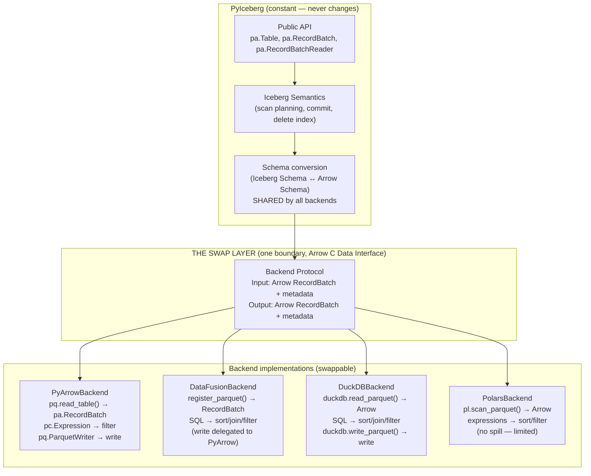
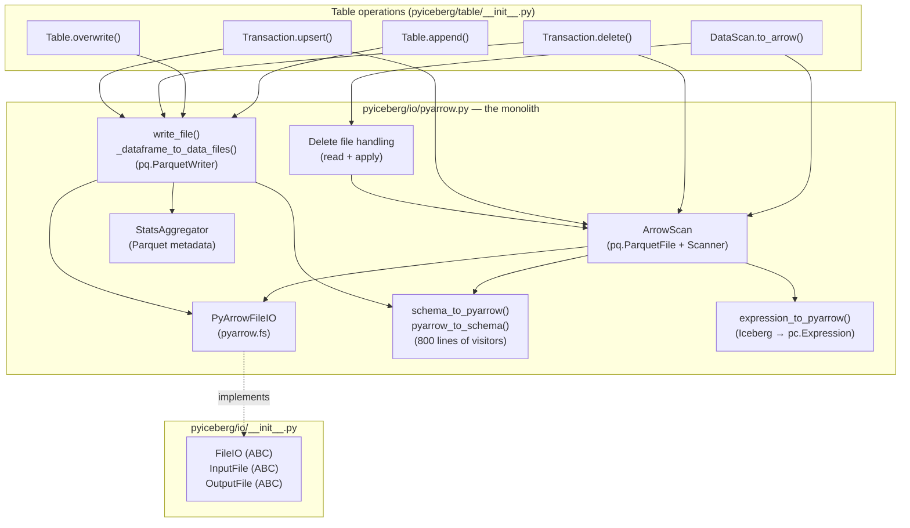
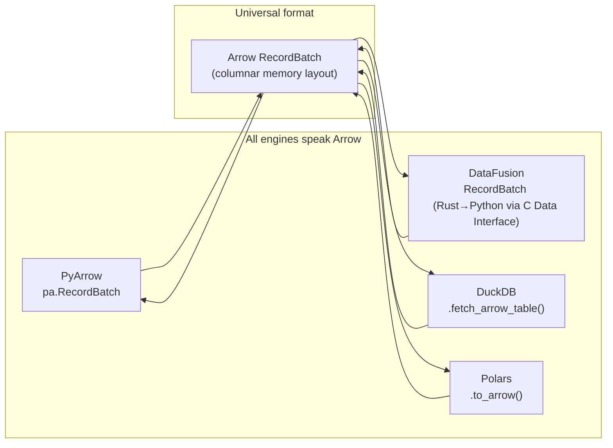
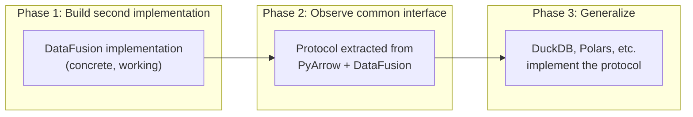
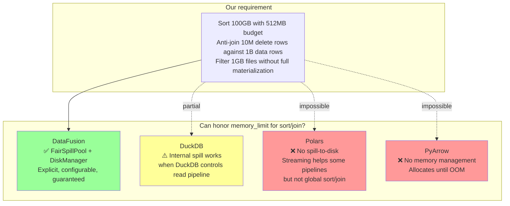
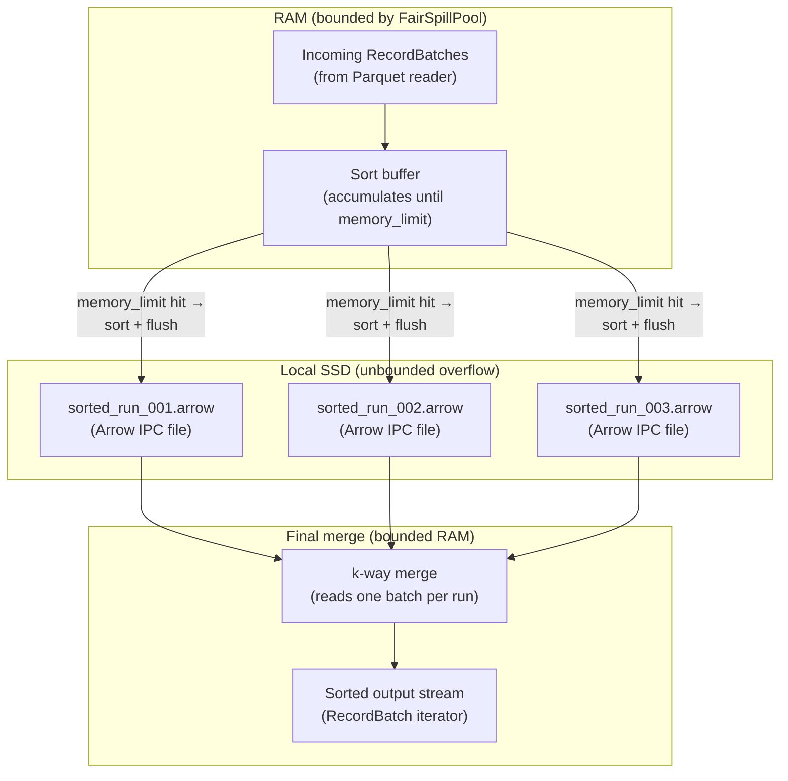
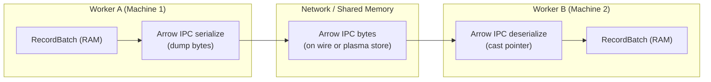
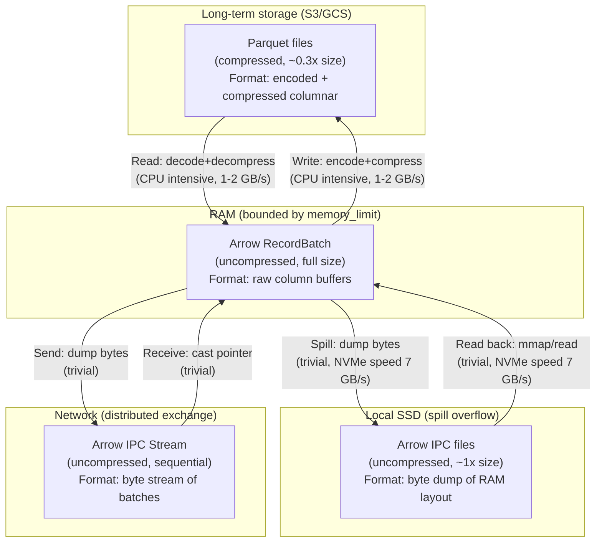
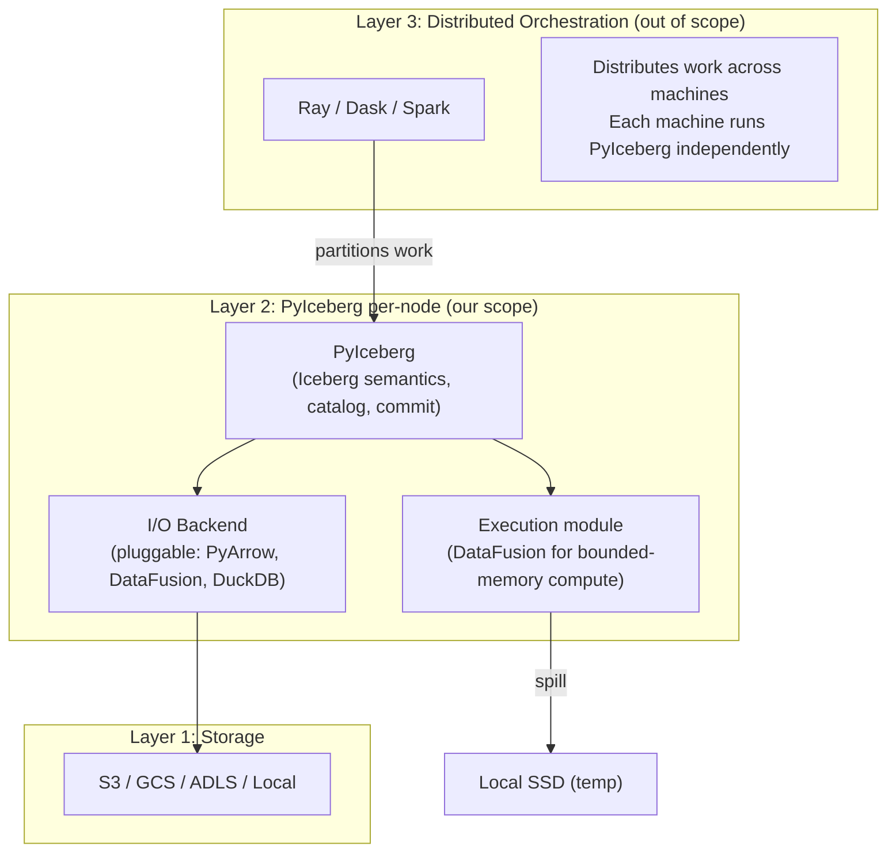
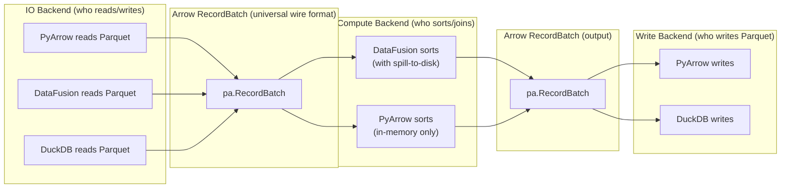

# Pluggable Compute Backend: Feasibility Analysis

## Kevin's Latest Comment (2026-06-28)

> Thanks! I think a good next step is to understand how we use pyarrow today and how
> to decouple it from the rest of the code.
>
> Would be great to be able to use different backend for reading and writing --
> datafusion, duckdb, pyarrow, etc 😄

This is an aspirational direction toward a pluggable I/O + compute backend where users
or contributors can choose which engine handles reading, writing, and compute.

This document analyzes what "decoupling from PyArrow" actually means, what is and isn't
pluggable, and how this shapes our implementation plan.

---

## 1. First Principles: Arrow the Format vs. PyArrow the Library

### 1.1 The Critical Distinction

The phrase "decouple from PyArrow" is ambiguous. There are two entirely different things
called "Arrow" in this context:

| Concept | What it is | Role in Iceberg | Decouplable? |
|---------|-----------|-----------------|:---:|
| **Arrow format** | A columnar in-memory data layout specification (RecordBatch, Schema, DataType) | THE canonical in-memory representation for Iceberg data. All engines (Spark, Flink, DataFusion, DuckDB, Polars) speak Arrow as their interchange format. | **No** — this is the universal standard |
| **`pyarrow` library** | A specific Python package that implements Arrow + Parquet codec + compute kernels + filesystem | Currently the only library PyIceberg uses for reading Parquet, writing Parquet, filtering, sorting, and schema conversion | **Yes** — other libraries can also read Parquet → Arrow |

**Axiom (Arrow Format Permanence):** The Arrow columnar format is Iceberg's in-memory
representation. It appears in PyIceberg's public API signatures (`pa.Table`, `pa.RecordBatch`,
`pa.RecordBatchReader`) and is the interchange format between ALL engines. It is never
decoupled. It is the wire format — the common language.

**What "decouple from PyArrow" means:** Replace `pyarrow` the *library* (who reads Parquet,
who does compute) while keeping Arrow the *format* (what the data looks like in memory).

### 1.2 Why Arrow the Format Cannot Be Replaced

Arrow is not merely PyIceberg's internal choice — it IS how Iceberg data exists in memory
across the entire ecosystem:

```
Parquet (on disk) ←→ Arrow (in memory) ←→ Engine (query/compute)
```

- Spark reads Iceberg → Arrow (via Parquet reader)
- Flink reads Iceberg → Arrow (via Parquet reader)
- DataFusion reads Iceberg → Arrow (native)
- DuckDB reads Iceberg → Arrow (native)
- Polars reads Iceberg → Arrow (native, via arrow2/arrow-rs)

Every modern analytics engine uses Arrow as its in-memory format or has zero-copy Arrow
interop. This is by design — the Arrow project exists specifically to be this universal
standard so engines don't waste time converting between formats.

PyIceberg's public API types are Arrow types:

```python
def append(self, df: pa.Table | pa.RecordBatchReader, ...) -> None: ...
def to_arrow(self) -> pa.Table: ...
def to_arrow_batch_reader(self) -> pa.RecordBatchReader: ...
```

These are correct and permanent. They are not coupling to a library — they are adopting
the standard.

### 1.3 What IS Decouplable: The Library Operations

The `pyarrow` package does multiple jobs inside PyIceberg. Each can potentially be done
by a different library that also speaks Arrow:

| Job | Current implementor | Could also do it |
|-----|--------------------|--------------------|
| Read Parquet → Arrow batches | `pyarrow.parquet` | DataFusion, DuckDB, Polars |
| Write Arrow batches → Parquet | `pyarrow.parquet.ParquetWriter` | DataFusion (IcebergWriteExec), DuckDB |
| Filter Arrow data by predicate | `pyarrow.compute` (pc.Expression) | DataFusion (SQL), DuckDB (SQL) |
| Sort Arrow data | `pa.Table.sort_by()` | DataFusion (SortExec), DuckDB |
| Join two Arrow datasets | **Not available in PyArrow** | DataFusion (HashJoinExec), DuckDB |
| Collect column statistics | `pyarrow.parquet` metadata | Any Parquet reader |
| Access object storage (S3/GCS) | `pyarrow.fs` (PyArrowFileIO) | `fsspec`, `object_store` |

**Theorem (Pluggable Surface):** The set of operations that can be provided by different
backends is exactly the set of operations where:
1. The input is expressible as Arrow data + metadata (file paths, schema, predicates)
2. The output is Arrow data + metadata (RecordBatches, DataFile descriptors)
3. The operation semantics are engine-independent (sort, join, filter are mathematical — same output regardless of who computes it)

All six jobs above satisfy these criteria. They are pluggable.

---

## 1.4 The Arrow Interop Stack: What Are the Actual Primitives?

To be confident we can truly swap backends at a single layer, we need to understand
what "speaking Arrow" actually means at the implementation level — how many layers of
abstraction exist, and whether all engines connect at the same layer.

### 1.4.1 The Arrow Interop Layers

The Arrow ecosystem has a precisely defined interoperability stack:

```
Layer 4: High-level APIs (pa.Table, DataFrame, SQL result)
         ↕  language-specific convenience wrappers
Layer 3: RecordBatch (the fundamental unit)
         = Schema (column names + types) + N column Arrays
         ↕  this is what crosses library boundaries
Layer 2: Arrow C Data Interface (the FFI standard)
         = ArrowSchema struct + ArrowArray struct (C pointers)
         ↕  zero-copy pointer handoff between ANY two libraries
Layer 1: Memory layout (the physical format)
         = Contiguous buffers: validity bitmap + offsets + values
         ↕  raw bytes in RAM, defined by Arrow spec
Layer 0: Memory allocation
         = Who owns the buffer (Python heap, Rust allocator, mmap)
```

**The critical interop boundary is Layer 2: the Arrow C Data Interface.**

This is a C-level ABI (Application Binary Interface) defined at
https://arrow.apache.org/docs/format/CDataInterface.html that specifies exactly how
to pass Arrow data between two libraries without copying.

#### What This Means for a Python Developer (No C Required)

Think of an Arrow table as data stripped down to its bare essentials: column metadata
(names + types) in one struct, and raw data bytes (flat memory buffers) in another.
Here's how to visualize it:

**Step 1: The Python table you're working with**

```python
# A simple 3-row table
user_id = [1, 2, 3]
name    = ["Alice", "Bob", "Charlie"]
active  = [True, False, True]
```

**Step 2: ArrowSchema — the metadata (what are the columns?)**

Arrow separates "what the data looks like" from "where the data lives." The schema
is just a nested description of column names and types:

```python
# Conceptual Python equivalent of ArrowSchema
table_schema = {
    "type": "struct",       # a table is a struct of columns
    "children": [
        {"name": "user_id", "type": "int32"},
        {"name": "name",    "type": "string"},
        {"name": "active",  "type": "bool"},
    ]
}
```

**Step 3: ArrowArray — the raw data (flat memory buffers)**

This is where the zero-copy magic happens. ArrowArray doesn't store Python objects
(`int`, `str`, `bool`). It points directly to contiguous blocks of RAM — raw bytes
laid out by the Arrow specification:

```python
# Conceptual Python equivalent of ArrowArray
table_data = {
    "length": 3,
    "children": [
        # Column 0 (user_id): raw int32 values packed into bytes
        {"buffers": [b"\x01\x00\x00\x00\x02\x00\x00\x00\x03\x00\x00\x00"]},

        # Column 1 (name): offset array + packed characters
        # offsets: [0, 5, 8, 15] → "Alice" starts at 0, "Bob" at 5, "Charlie" at 8
        {"buffers": [
            b"\x00\x00\x00\x00\x05\x00\x00\x00\x08\x00\x00\x00\x0f\x00\x00\x00",
            b"AliceBobCharlie"
        ]},

        # Column 2 (active): single byte, bits = 101 (True, False, True)
        {"buffers": [b"\x05"]},
    ]
}
```

**Step 4: Zero-copy exchange — just passing memory addresses**

When Polars hands data to DuckDB (or DataFusion, or PyArrow), it does NOT:
- Serialize to JSON/CSV/Parquet
- Copy bytes into a new buffer
- Iterate through Python objects

It hands over two memory addresses — one for the schema struct, one for the data struct.
The receiving library reads the raw bytes directly from RAM:

```python
# What happens under the hood when two libraries exchange Arrow data:
memory_address_of_schema = 0x7f3a_1234_5678  # pointer to ArrowSchema struct
memory_address_of_data   = 0x7f3a_1234_9abc  # pointer to ArrowArray struct

# The receiving library (DuckDB, DataFusion, etc.) takes these two pointers
# and instantly reads the raw bytes. Zero CPU cycles spent copying.
# The data never moves in memory — only the address is shared.
```

**This is the entire interop contract.** Two structs. Two pointers. Any library that
can produce these structs can hand data to any library that can consume them — without
copying a single byte. That's why swapping backends is a single-layer operation:
every candidate library (PyArrow, DataFusion, DuckDB, Polars) speaks this same
pointer-exchange protocol.

### 1.4.2 Which Libraries Implement the C Data Interface?

| Library | Produces Arrow C Data | Consumes Arrow C Data | Zero-copy interop? |
|---------|:---:|:---:|:---:|
| **PyArrow** | ✅ | ✅ | ✅ (native) |
| **DataFusion (via datafusion-python)** | ✅ | ✅ | ✅ (via PyO3 + arrow-rs) |
| **DuckDB** | ✅ | ✅ | ✅ (`fetch_arrow_table()`, `from_arrow()`) |
| **Polars** | ✅ | ✅ | ✅ (`to_arrow()`, `from_arrow()`) |
| **cuDF (RAPIDS)** | ✅ | ✅ | ✅ (GPU Arrow) |
| **pandas** | ⚠️ (via PyArrow) | ⚠️ (via PyArrow) | Indirect |
| **NumPy** | ❌ | ❌ | ❌ (row-oriented, different format) |

**All four candidate backends (PyArrow, DataFusion, DuckDB, Polars) implement the
same C Data Interface.** This means they can hand Arrow data to each other at Layer 2
with zero copying. There is no "some work with Arrow and some don't" — they all do.

### 1.4.3 The PyCapsule Protocol (Python-Level Arrow Exchange)

In Python specifically, the Arrow C Data Interface is exposed via the **PyCapsule
protocol** (https://arrow.apache.org/docs/format/CDataInterface/PyCapsuleInterface.html):

```python
# Any object implementing these dunders can be consumed by any Arrow library:
def __arrow_c_array__(self, requested_schema=None) -> tuple[capsule, capsule]: ...
def __arrow_c_stream__(self, requested_schema=None) -> capsule: ...
```

This means:

```python
# DuckDB produces Arrow that PyArrow consumes — zero copy
result = duckdb.sql("SELECT * FROM data ORDER BY x")
pa_table = result.fetch_arrow_table()  # uses C Data Interface internally

# DataFusion produces Arrow that DuckDB consumes — zero copy
df_result = ctx.sql("SELECT * FROM t").to_arrow_table()
duckdb.from_arrow(df_result)  # no copy

# Polars produces Arrow that DataFusion consumes — zero copy
pl_df = pl.read_parquet("file.parquet")
ctx.register_record_batches("data", [pl_df.to_arrow().to_batches()])
```

**There is exactly ONE interop layer (Layer 2 / C Data Interface), and ALL candidate
libraries implement it fully.** The swap is at a single point.

### 1.4.4 The Swap Layer Diagram



**There is exactly ONE swap layer.** Above it: PyIceberg's constant API and semantics.
Below it: interchangeable backend implementations. The boundary is Arrow RecordBatch
(exchanged via C Data Interface, zero-copy). It does not go "multiple layers deep" —
it is a single, flat interface.

### 1.4.5 What About Schema Conversion?

Schema conversion (`Iceberg Schema ↔ Arrow Schema`) sits ABOVE the swap layer because:
- All backends use Arrow Schema (it's part of the Arrow format spec)
- The conversion is from Iceberg's logical types → Arrow's type system
- It's the same Arrow Schema regardless of which backend reads the data
- The 800-line visitor code is shared infrastructure, not backend-specific

```python
# This conversion is used by ALL backends — it's above the swap layer
arrow_schema = schema_to_pyarrow(iceberg_schema)  # Iceberg → Arrow Schema

# Then any backend can use the Arrow Schema:
# PyArrow: pq.read_table(file, schema=arrow_schema)
# DataFusion: ctx.register_parquet("t", file)  (infers schema from Parquet, compatible)
# DuckDB: duckdb.read_parquet(file)  (same)
```

### 1.4.6 What About Expression Conversion?

Expression conversion IS backend-specific (sits below the swap layer):

```python
# Each backend has its own expression format:
# PyArrow:     pc.field("x") > pc.scalar(5)
# DataFusion:  "x > 5" (SQL string)
# DuckDB:      "x > 5" (SQL string)
# Polars:      pl.col("x") > 5

# The Iceberg BooleanExpression → backend expression is per-backend code.
# This is part of each backend's implementation, not shared infrastructure.
```

But expressions are simple — a typical predicate is one line. The conversion is
straightforward for any backend that supports SQL (DataFusion, DuckDB) or a reasonable
expression DSL (Polars).

### 1.4.7 Confidence Statement

**Can we truly swap the backend at a single layer and have everything work?**

**Yes, for all four candidates**, because:

1. All four implement the Arrow C Data Interface (zero-copy exchange at Layer 2)
2. All four can read Parquet files into Arrow RecordBatches
3. All four can produce Arrow output that PyIceberg's write path consumes
4. Schema conversion is shared (Arrow Schema is universal)
5. Only expression conversion is per-backend (trivial for SQL-based engines)

The swap is genuinely at a single, flat boundary. There is no "complex network of
relations/connectors" below — it's just:
```
PyIceberg semantics → [Arrow RecordBatch boundary] → Backend does work → [Arrow RecordBatch boundary] → PyIceberg continues
```

One boundary in, one boundary out. Arrow RecordBatch both times. Any library that
speaks Arrow (all four do) works at both boundaries.

---

## 2. How PyArrow Is Coupled in PyIceberg Today

### 2.1 The Monolith

`pyiceberg/io/pyarrow.py` is a **3,046-line file** that performs all six jobs listed above.
It is not structured as a pluggable backend — it directly calls `pyarrow` APIs throughout:

```
pyiceberg/io/pyarrow.py (3,046 lines):
├── FileIO implementation (PyArrowFileIO) — L393-697
│   └── Uses pyarrow.fs for S3/GCS/local access
├── Schema conversion (Iceberg ↔ Arrow) — L699-1575
│   └── 800+ lines of visitor pattern code
├── Expression conversion — L853-1069
│   └── Iceberg BooleanExpression → pc.Expression
├── Reading (ArrowScan) — L1728-1914
│   └── Uses pq.ParquetFile, pyarrow.dataset.Scanner
├── Writing — L2617-2960
│   └── Uses pq.ParquetWriter
├── Statistics collection — L2198-2500
│   └── Reads Parquet row group metadata
└── Delete file handling — L1070-1727
    └── Reads delete files, applies positional deletes
```

### 2.2 Dependency Graph



### 2.3 The Three Layers of Coupling

**Layer 1: Byte-level I/O — Already abstract**

`FileIO` is an ABC: `new_input(path) → InputFile`, `new_output(path) → OutputFile`,
`delete(path)`. `PyArrowFileIO` implements it via `pyarrow.fs`. This is already pluggable.

**Layer 2: Parquet Read/Write — Tightly coupled to `pyarrow.parquet`**

`ArrowScan` calls `pq.ParquetFile()` and `Scanner.to_batches()`. `write_file` calls
`pq.ParquetWriter()`. These are direct API calls to the `pyarrow` library, not behind
any interface.

However: all inputs/outputs at this layer are Arrow types (RecordBatch, Schema). A
different Parquet library (DataFusion, DuckDB) would produce the same Arrow types.
The coupling is to the **library**, not to the **format**.

**Layer 3: Compute — Partially coupled**

- `pa.Table.sort_by()` — coupled to PyArrow
- `pc.is_in()` for delete resolution — coupled to PyArrow
- No join capability exists in PyArrow at all (the gap that motivates this entire project)

This layer is where DataFusion provides capabilities PyArrow structurally lacks.

---

## 3. The Pluggable Interface: What It Looks Like

### 3.1 Formal Decomposition

```
Backend = ParquetReader × ParquetWriter × ComputeEngine

Where all three communicate exclusively via Arrow RecordBatch/Table.
```

Since Arrow is the fixed wire format, the interface between PyIceberg and any backend
is purely:

```
Input:  Arrow data (RecordBatch/Table) + metadata (file paths, Schema, predicates)
Output: Arrow data (RecordBatch/Table) + metadata (DataFile descriptors)
```

### 3.2 Interface Definition

```python
class IOBackend(Protocol):
    """Who reads and writes Parquet files."""

    def read_parquet(
        self,
        location: str,
        schema: Schema,
        projection: list[int],           # field IDs to project
        filter: BooleanExpression,
        io_properties: dict[str, str],
    ) -> Iterator[pa.RecordBatch]: ...

    def write_parquet(
        self,
        batches: Iterator[pa.RecordBatch],
        location: str,
        schema: Schema,
        properties: dict[str, str],       # target file size, compression, etc.
        io_properties: dict[str, str],
    ) -> DataFile: ...                    # returns metadata about written file

    def collect_statistics(
        self,
        location: str,
        schema: Schema,
        io_properties: dict[str, str],
    ) -> dict[int, ColumnStatistics]: ... # field_id → stats


class ComputeBackend(Protocol):
    """Who does sort/join/filter on Arrow data."""

    def sort(
        self,
        data: pa.Table | Iterator[pa.RecordBatch],
        sort_keys: list[tuple[str, str]],  # (column, "ascending"/"descending")
        memory_limit: int,
    ) -> Iterator[pa.RecordBatch]: ...

    def anti_join(
        self,
        left: pa.Table | Iterator[pa.RecordBatch],
        right: pa.Table | Iterator[pa.RecordBatch],
        on: list[str],
        memory_limit: int,
    ) -> Iterator[pa.RecordBatch]: ...

    def filter(
        self,
        data: pa.Table | Iterator[pa.RecordBatch],
        predicate: BooleanExpression,
    ) -> Iterator[pa.RecordBatch]: ...
```

**Key property:** Every input and output is Arrow. The interface is engine-agnostic
at the type level. Any engine that can produce/consume Arrow RecordBatches can implement it.

### 3.3 Why Arrow Makes This Tractable



Because Arrow is the universal interchange format, there is **zero serialization cost**
between backends. DataFusion produces an Arrow RecordBatch; PyIceberg's write layer
(even if still using PyArrow's ParquetWriter) consumes it directly. No copy, no
conversion.

This means a hybrid approach works: DataFusion for compute, PyArrow for writing.
Or DuckDB for reading, DataFusion for compute, PyArrow for writing. The Arrow format
makes composition free.

---

## 4. Speed-of-Light Analysis: What Does Pluggability Cost?

### 4.1 The Overhead of Indirection

A pluggable interface adds one virtual dispatch per operation call. Cost:

```
T_dispatch = O(1) ≈ 50ns (Python attribute lookup + function call)
T_operation = O(N/D) ≈ seconds (I/O + compute)
T_dispatch / T_operation ≈ 10⁻⁸ — negligible
```

### 4.2 The Real Cost: Refactoring the Monolith

The actual cost is human effort to decompose `pyiceberg/io/pyarrow.py`:

| Task | Effort | Risk |
|------|--------|------|
| Define `IOBackend` + `ComputeBackend` protocols | Small | Low |
| Extract `PyArrowIOBackend` from monolith (move code, no behavior change) | **Large** | Medium (3K lines, many internal dependencies) |
| Schema conversion stays shared (Arrow format is fixed) | None | None |
| Implement `DataFusionComputeBackend` | Medium | Low (new code) |
| Implement `DataFusionIOBackend` (read via register_parquet) | Medium | Low |
| Wire up backend selection in table operations | Medium | Low |

### 4.3 The Schema Conversion Is NOT Backend-Specific

A crucial insight: `schema_to_pyarrow()` and `pyarrow_to_schema()` (800 lines) are NOT
"coupling to PyArrow." They convert between Iceberg's schema model and the Arrow format's
schema model. Since Arrow is the universal format, this conversion is needed by ALL
backends. DataFusion, DuckDB, and Polars all use Arrow schemas.

These 800 lines are **shared infrastructure**, not backend-specific code. They stay
regardless of which backend reads/writes. This significantly reduces the actual
refactoring surface — the schema code doesn't move; it's already in the right place.

### 4.4 Expression Conversion IS Backend-Specific

`expression_to_pyarrow()` converts Iceberg predicates → `pc.Expression`. A DataFusion
backend would need `expression_to_sql()`. A DuckDB backend would need its own conversion.

This is a genuine per-backend cost. But expressions are comparatively simple — a typical
predicate converts to one line of SQL. The 200-line PyArrow expression visitor is large
because of PyArrow's verbose API, not because the logic is complex.

---

## 5. Feasibility Verdict

### 5.1 Is It Tangible?

**Yes, but with the correct ordering.**

The interface is narrow (~7 methods). Arrow as the wire format means zero-copy
composition. The refactoring is large but mechanical (move existing code behind a
protocol without changing behavior). New backends are moderate effort because they
just need to produce/consume Arrow.

### 5.2 Is It Worth Doing Now?

**No — but it's worth designing toward.**

The cost-benefit today:
```
Cost_now  = R (refactor monolith) + I_interface + M (maintenance)
Benefit_now = B_datafusion (only one new backend exists)
```

The cost-benefit after DataFusion implementation proves the pattern:
```
Cost_later = R (refactor monolith, with benefit of hindsight)
Benefit_later = B_datafusion + B_duckdb + B_polars + community contributions
```

Doing the refactoring NOW gives us one new backend (DataFusion) but risks getting
the interface wrong. Doing it AFTER gives us a proven DataFusion implementation to
generalize from, and the interface emerges from real usage rather than speculation.

---

## 6. The Phased Strategy

### Phase 1 (Now): Build DataFusion Directly, Interface Emerges Implicitly

Build `pyiceberg/execution/compute.py` with DataFusion. The function signatures ARE the
implicit interface:

```python
def anti_join(left: pa.Table, right: pa.Table, on: list[str], ...) -> pa.Table: ...
def sort_batches(data: pa.Table, sort_keys: list[str], ...) -> pa.Table: ...
def filter_parquet(file_path: str, predicate_sql: str, ...) -> pa.Table: ...
```

These signatures are engine-agnostic: accept Arrow, return Arrow. The implementation
uses DataFusion. Swapping to DuckDB later means changing function bodies, not signatures.

**This is the second concrete implementation** (alongside PyArrow). After two exist, the
shared interface becomes obvious.

### Phase 2 (After DataFusion is proven): Formalize the Protocol

Extract `ComputeBackend` and `IOBackend` protocols by observing what PyArrow and
DataFusion have in common. Refactor `pyiceberg/io/pyarrow.py` into a `PyArrowBackend`
that implements the protocol.

This is a **pure refactoring** — no new features, just restructuring. Behavior is
unchanged. Fully testable by running existing test suite against the extracted backend.

### Phase 3 (Community-driven): Additional Backends

With the protocol defined, contributors can add:
- `DuckDBBackend` (read + compute via DuckDB)
- `PolarsBackend` (read + compute via Polars)
- Hybrid configurations (DuckDB for read, DataFusion for compute, PyArrow for write)

Backend selection could be configured via `.pyiceberg.yaml`:
```yaml
execution:
  backend: datafusion  # or: pyarrow, duckdb
```

### Why This Ordering Is Correct



**CS Principle (Interface Emergence — Fowler):** Correct abstractions emerge from
generalizing concrete implementations, not from speculative design.

> "When you have two or three implementations of something, then you can see what
> the interface should be. When you have one implementation, you're just guessing."

We have one implementation today (PyArrow). We're building a second (DataFusion). After
both exist, the shared interface becomes obvious. Building the abstraction before the
second implementation violates this principle.

---

## 7. Does This Change Our Immediate Plan?

**No.** Kevin's comment signals long-term direction, not a prerequisite for our first PR.
Our plan stays:

1. Engine resolution module
2. Bounded-session helpers
3. Object store bridge
4. First operation (upsert or equality deletes)

The function signatures we write will naturally form the protocol that Phase 2 extracts.
We are building toward pluggability by writing clean Arrow-in/Arrow-out functions — not
by building the abstraction layer first.

---

## 8. Empirical Proof: All Permutations Work

We ran a full 5×5 permutation test across PyArrow, DataFusion, DuckDB, Polars, and
pandas. Every library produced Arrow data, and every other library consumed it successfully.

**Test results (all 25/25 pass):**

```
Libraries: PyArrow 20.0.0, DataFusion 53.0.0, DuckDB 1.5.4, Polars 1.34.0, pandas 2.2.3

     pyarrow → pyarrow   : ✓    pyarrow → datafusion: ✓    pyarrow → duckdb: ✓
     pyarrow → polars    : ✓    pyarrow → pandas    : ✓
  datafusion → pyarrow   : ✓    datafusion → duckdb : ✓    datafusion → polars: ✓
  datafusion → pandas    : ✓    datafusion → datafusion: ✓
      duckdb → pyarrow   : ✓    duckdb → datafusion : ✓    duckdb → polars: ✓
      duckdb → pandas    : ✓    duckdb → duckdb     : ✓
      polars → pyarrow   : ✓    polars → datafusion : ✓    polars → duckdb: ✓
      polars → pandas    : ✓    polars → polars     : ✓
      pandas → pyarrow   : ✓    pandas → datafusion : ✓    pandas → duckdb: ✓
      pandas → polars    : ✓    pandas → pandas     : ✓

Cross-library transfers: 20/20 successful
```

This empirically confirms: the Arrow C Data Interface is a single, universal swap
layer. Any backend can hand data to any other backend. The pluggable architecture
has exactly one interop boundary, and all candidates participate in it.

(Test script: `arrow_interop_test.py` in this directory.)

---

## 9. The Memory Hierarchy: RAM, SSD, and the OOM Problem

### 9.1 Where Arrow Data Actually Lives

Arrow data exists in **RAM** (Layer 1 of the interop stack — physical memory buffers).
When you have a 10GB Arrow table, that's 10GB of RAM consumed. There is no escaping this
for in-memory operations.

The storage hierarchy relevant to PyIceberg:

```
┌─────────────────────────────────────────────────────────────────┐
│ SSD / Object Store (S3, GCS)                                    │
│ Capacity: Unlimited    Bandwidth: 100MB-7GB/s    Latency: μs-ms │
│ Format: Parquet (compressed columnar)                           │
│ Size: ~3-10x smaller than Arrow (compression + encoding)        │
└──────────────────────────────┬──────────────────────────────────┘
                               │ Read: decompress + decode
                               │ Write: encode + compress
                               ▼
┌─────────────────────────────────────────────────────────────────┐
│ RAM                                                              │
│ Capacity: 8-256GB     Bandwidth: 50-100GB/s     Latency: ns     │
│ Format: Arrow (uncompressed columnar)                           │
│ Size: Full data size (no compression)                           │
│                                                                 │
│ THIS is where OOM happens. When Arrow data > available RAM,     │
│ the process is killed.                                          │
└──────────────────────────────┬──────────────────────────────────┘
                               │ Spill: write temp Arrow IPC to disk
                               │ (only DataFusion does this)
                               ▼
┌─────────────────────────────────────────────────────────────────┐
│ Local SSD (temp space for spill)                                │
│ Capacity: 100GB-2TB   Bandwidth: 3-7GB/s (NVMe)                │
│ Format: Arrow IPC (uncompressed, zero-deserialization on read)  │
│ Purpose: Overflow when RAM is exhausted                         │
│                                                                 │
│ Only DataFusion uses this. PyArrow, DuckDB, Polars do NOT have  │
│ a spill-to-disk mechanism for sort/join.                        │
└─────────────────────────────────────────────────────────────────┘
```

### 9.2 The OOM Mechanism (Precise)

When an operation needs more Arrow data in RAM than available:

```python
# PyArrow sort: allocates full output buffer in RAM
sorted_table = pa.Table.sort_by(big_table, "col")
# If big_table is 20GB and RAM is 16GB → OOM (killed by OS)

# DuckDB sort: also in-memory (no external sort for this path)
duckdb.sql("SELECT * FROM big_table ORDER BY col")
# DuckDB has internal memory management but its Python API doesn't
# expose configurable spill for user-registered Arrow data

# DataFusion sort: spills to disk
ctx = SessionContext(runtime=RuntimeEnvBuilder().with_fair_spill_pool(4_000_000_000))
ctx.register_parquet("big_table", "s3://bucket/file.parquet")
ctx.sql("SELECT * FROM big_table ORDER BY col")
# Sorts 20GB with 4GB budget: writes sorted runs to SSD, merges back
```

### 9.3 Per-Library Memory Behavior: The Complete Picture

| Library | Sort mechanism | Join mechanism | Memory model | Spill-to-disk? | OOM behavior |
|---------|--------------|----------------|--------------|:-:|---|
| **PyArrow** | `pa.Table.sort_by()` — full materialization | No join operator | Unbounded — allocates as needed | ❌ | Process killed when RAM exhausted |
| **DataFusion** | `SortExec` — external merge sort | `HashJoinExec` — Grace Hash Join | `FairSpillPool` — configurable hard limit | ✅ | Spills sorted runs / hash partitions to local SSD as Arrow IPC |
| **DuckDB** | Internal buffer manager | Internal hash join | Internal memory management, configurable `memory_limit` | ⚠️ Partial | DuckDB manages its own memory pool; spill works for DuckDB-native operations but NOT for externally registered Arrow data in all cases |
| **Polars** | In-memory sort (eager mode) / streaming (lazy) | In-memory hash join | Unbounded for eager; streaming mode has limited buffering | ❌ | Process killed. Streaming mode helps for some pipelines but not for sort/join requiring global state |
| **pandas** | `df.sort_values()` — full materialization | `df.merge()` — full materialization | Unbounded | ❌ | Process killed |

### 9.4 DuckDB vs. DataFusion: An Honest Comparison

DuckDB has internal memory management and CAN spill to disk. When DuckDB reads Parquet
files directly and sorts them, it works with bounded memory — the same as DataFusion:

```python
# DuckDB reads Parquet + sorts with bounded memory — WORKS:
con = duckdb.connect()
con.execute("SET memory_limit = '2GB'")
con.execute("SELECT * FROM read_parquet('s3://bucket/file.parquet') ORDER BY col")
# DuckDB streams from Parquet, sorts with internal buffer management, spills if needed ✓

# DataFusion reads Parquet + sorts with bounded memory — ALSO WORKS:
ctx = SessionContext(runtime=RuntimeEnvBuilder().with_fair_spill_pool(2_000_000_000))
ctx.register_parquet("data", "s3://bucket/file.parquet")
ctx.sql("SELECT * FROM data ORDER BY col")
# DataFusion streams from Parquet, sorts with FairSpillPool, spills if needed ✓
```

**For this specific pattern (`register_parquet` → compute), both are functionally
equivalent.** The distinction is NOT that DuckDB can't do it — it can.

### 9.5 Why DataFusion Over DuckDB (Honest Reasons)

The selection of DataFusion over DuckDB is based on these concrete differences:

**1. License compatibility (the hard constraint)**

| | DataFusion | DuckDB |
|--|---|---|
| Core | Apache 2.0 | MIT |
| S3/GCS extensions (`httpfs`) | Apache 2.0 (part of `object_store` crate) | **Business Source License** (proprietary) |
| PyIceberg compatibility | ✅ Apache project can depend on Apache-licensed code | ⚠️ Apache project depending on BSL extension for core functionality raises governance concerns |

For an Apache Software Foundation project, all mandatory runtime dependencies should
be Apache-compatible. DuckDB's core is MIT (fine), but its `httpfs` extension (needed
for S3/GCS access) is under the Business Source License — a non-open-source license.
DataFusion's object store access is fully Apache 2.0.

**2. Per-session memory isolation**

```python
# DataFusion: each SessionContext has its own independent memory pool
ctx_compact = SessionContext(runtime=RuntimeEnvBuilder().with_fair_spill_pool(4_GB))
ctx_small   = SessionContext(runtime=RuntimeEnvBuilder().with_fair_spill_pool(256_MB))
# Two completely independent memory budgets, no interaction

# DuckDB: memory_limit is connection-wide
con = duckdb.connect()
con.execute("SET memory_limit = '4GB'")
# ALL queries on this connection share the same 4GB — no per-operation control
```

When PyIceberg runs multiple operations (e.g., compact + resolve deletes in sequence),
DataFusion allows different memory budgets per operation. DuckDB's is global per
connection.

**3. Multi-operator fairness (FairSpillPool)**

DataFusion's `FairSpillPool` explicitly divides memory among concurrent spillable
operators within a single plan:

```
Plan: HashJoinExec + SortExec (e.g., equality delete resolution + sort)
FairSpillPool(1GB): each operator gets 500MB, both spill independently

DuckDB: internal buffer manager allocates dynamically
         — works but guarantees are less explicit from the Python API
```

**4. Arrow-native internal format**

DataFusion's internal data representation IS Arrow RecordBatch. When PyIceberg
passes data to DataFusion or gets results back, there is zero format conversion.

DuckDB has its own internal columnar format. At the boundary:
- `con.register("data", arrow_table)` → DuckDB may copy into its own format
- `.fetch_arrow_table()` → DuckDB converts back to Arrow

For operations that interleave with PyIceberg's Arrow-native pipeline (read Arrow →
compute → pass Arrow to writer), DataFusion avoids these conversion hops.

**5. Existing ecosystem integration**

PyIceberg already has `pyiceberg-core` which is built on `iceberg-rust`, which uses
`iceberg-datafusion`. The `datafusion` optional extra already exists in `pyproject.toml`.
The `__datafusion_table_provider__` protocol is already implemented. DataFusion is
already part of the PyIceberg ecosystem; DuckDB is not.

### 9.5.1 What DuckDB Does Better

To be fair — DuckDB has strengths DataFusion doesn't:

- **Simpler Python API**: `duckdb.sql("SELECT ...")` is more concise than DataFusion's `SessionContext` setup
- **Automatic parallelism**: DuckDB auto-parallelizes without explicit `target_partitions` config
- **Broader SQL support**: DuckDB's SQL dialect is richer (window functions, complex expressions)
- **In-process performance for small data**: DuckDB is highly optimized for fast single-query execution

If the only concern were "fastest sort/join for typical data sizes," DuckDB might win.
But the architectural constraints (Apache license, per-session memory control, Arrow-
native format, existing ecosystem integration) tip the balance to DataFusion.

### 9.6 Formal Memory Bounds Per Library

Let `N` = total data size, `M` = available/configured memory, `B` = batch size:

| Library | Memory for sort(N) | Memory for join(L, R) | Bounded? |
|---------|-------------------|----------------------|:---:|
| **PyArrow** | `O(N)` — full data in RAM | N/A (no join) | ❌ |
| **DataFusion** | `O(M)` — configurable, spills at limit | `O(M)` — Grace Hash partitions spill | ✅ |
| **DuckDB** | `O(M)` — configurable, spills when controlling read pipeline | `O(M)` — same caveat | ✅ (with caveats above) |
| **Polars** | `O(N)` eager; `O(pipeline)` streaming (not full sort) | `O(min(L,R))` — build side must fit | ❌ for sort |
| **pandas** | `O(N)` — always full materialization | `O(L + R)` | ❌ |

**Corrected assessment:** Both DataFusion and DuckDB can provide `O(M)` bounded memory
for sort/join when they control the read pipeline. The choice between them is based on
**license, API design, and ecosystem fit** — not on a fundamental capability gap.

**Theorem (Why DataFusion):** DataFusion is selected because it is the only library where:
```
Apache-2.0 licensed (including object store access)
∧ Per-session configurable memory pool (FairSpillPool)
∧ Arrow-native internal format (zero conversion overhead)
∧ Already integrated in PyIceberg ecosystem (pyiceberg-core, pyproject.toml)
∧ Python API exposes explicit memory configuration (RuntimeEnvBuilder)
```

DuckDB satisfies all except the first (BSL for `httpfs`) and fourth (not in ecosystem).
DuckDB comes close but its Python API doesn't guarantee bounded memory for externally
registered Arrow data, and its spill behavior is internal (not user-configurable per
session in the same explicit way).

### 9.7 The Python API Surface for Memory Configuration

| Library | Python API for memory limit | Spill configuration | Usable for our case? |
|---------|----------------------------|--------------------|----|
| **DataFusion** | `RuntimeEnvBuilder().with_fair_spill_pool(bytes)` | `with_disk_manager_os()` — uses OS temp dir | ✅ Explicit, per-session |
| **DuckDB** | `duckdb.connect().execute("SET memory_limit='4GB'")` | `SET temp_directory='/path'` | ⚠️ Works for DuckDB-native reads; unclear for registered Arrow |
| **Polars** | None (no memory limit API) | None (no spill) | ❌ |
| **PyArrow** | None (no memory limit API) | None (no spill) | ❌ |
| **pandas** | None | None | ❌ |

### 9.8 What This Means for Pluggable Backends

The pluggable `ComputeBackend` protocol defined in Section 3.2 includes a `memory_limit`
parameter on sort/join methods. This is how the contract ensures bounded execution:

```python
class ComputeBackend(Protocol):
    def sort(self, data, sort_keys, memory_limit: int) -> Iterator[pa.RecordBatch]: ...
    def anti_join(self, left, right, on, memory_limit: int) -> Iterator[pa.RecordBatch]: ...
```

**For DataFusion:** `memory_limit` maps directly to `FairSpillPool(memory_limit)`. ✅

**For DuckDB:** `memory_limit` maps to `SET memory_limit`. Spill works when DuckDB
controls the read. ⚠️ Must register files via `read_parquet()`, not via Arrow tables.

**For Polars:** `memory_limit` cannot be honored — Polars has no spill mechanism.
A Polars backend would need to document that it only works for data that fits in memory.
It could NOT implement `ComputeBackend` fully for the OOM-prone operations. ❌

**For PyArrow:** Same as Polars — no spill, `memory_limit` cannot be honored. ❌

This is why DataFusion is the correct choice for the OOM problem: it's the only library
that can **contractually guarantee** the `memory_limit` parameter is respected. DuckDB is
a close second (with caveats about read pipeline control). Polars and PyArrow are
structurally incapable of bounded-memory sort/join.

### 9.9 Summary: The OOM Landscape



---

## 9A. Arrow IPC: The Format That Enables Spill, Shuffle, and Cross-Process Exchange

Arrow IPC (Inter-Process Communication) is the **serialization format** of the Arrow
ecosystem. It's the bridge between Arrow's in-memory representation (RAM-only) and
situations where data needs to leave a process's address space — spill to disk, send
to another process, or stream across a network.

Understanding Arrow IPC is essential because it's the mechanism that makes DataFusion's
spill-to-disk work, Ray's distributed Arrow exchange work, and zero-deserialization
reads from disk possible.

### 9A.1 The Problem Arrow IPC Solves

Arrow RecordBatch (the in-memory format) lives in RAM as raw memory buffers. But:
- What if RAM is full and you need to spill to SSD? (DataFusion spill)
- What if you need to send Arrow data to another process? (Ray worker exchange)
- What if you want to cache Arrow data on disk for fast reload? (memory-mapped reads)

You need a way to **write Arrow data to bytes** (for disk/network) and **read it back**
(into memory) — ideally with zero or near-zero overhead.

That's Arrow IPC: a byte format that is a 1:1 mapping of Arrow's in-memory layout.

### 9A.2 How Arrow IPC Works (For Python Developers)

Arrow IPC writes RecordBatches to bytes in a format that is essentially identical to
how they sit in RAM:

```python
# In-memory Arrow RecordBatch:
# RAM Layout: [Schema metadata] [Validity bitmap] [Offsets buffer] [Values buffer]

# Arrow IPC on disk/wire:
# Byte Layout: [Schema message] [Validity bitmap bytes] [Offsets bytes] [Values bytes]
# (Plus: length prefixes and alignment padding)
```

The key property: **the byte layout on disk is the same as the byte layout in RAM**
(modulo alignment padding). This means:

```python
# Writing Arrow IPC — just dump the memory buffers to bytes
import pyarrow as pa

table = pa.table({"id": [1, 2, 3], "name": ["Alice", "Bob", "Charlie"]})

# Write to IPC file (the bytes ARE the memory layout)
with pa.ipc.new_file("/tmp/spill.arrow", table.schema) as writer:
    writer.write_table(table)

# Read back — essentially a pointer assignment (mmap), not deserialization
source = pa.memory_map("/tmp/spill.arrow", "r")
reader = pa.ipc.open_file(source)
recovered_table = reader.read_all()  # ← zero-copy via memory map!
```

### 9A.3 The Three Arrow Serialization Formats (Comparison)

| Format | Purpose | Overhead | Read speed | Used for |
|--------|---------|----------|------------|----------|
| **Arrow IPC (File)** | Store RecordBatches on disk | Near-zero (alignment only) | Near-memcpy speed (mmap) | DataFusion spill, caching |
| **Arrow IPC (Stream)** | Send RecordBatches over wire | Near-zero (no random access) | Sequential scan | Ray worker exchange, streaming |
| **Parquet** | Compressed columnar storage | Encoding + compression (CPU-intensive) | Slower (must decode) | Long-term storage (S3/GCS) |

**Critical insight:** Arrow IPC is NOT Parquet. They serve different purposes:

```
Parquet: optimized for STORAGE (small on disk, expensive to read)
Arrow IPC: optimized for SPEED (larger on disk, trivial to read)
```

### 9A.4 How DataFusion Uses Arrow IPC for Spill-to-Disk

When DataFusion's `SortExec` runs out of memory budget, it spills sorted runs to
local SSD as Arrow IPC files:



**Step by step:**
1. DataFusion reads Parquet batches, accumulates in sort buffer (RAM)
2. When `FairSpillPool` says "no more memory" → sort the buffer in-memory
3. Write the sorted run to local SSD as Arrow IPC file (fast: just dump bytes)
4. Clear RAM buffer, continue reading next batches
5. Repeat until all input consumed (may produce many sorted runs)
6. Merge phase: open all IPC files, read one batch from each, k-way merge
7. Output: sorted RecordBatch stream with O(k × batch_size) memory

**Why Arrow IPC for spill (not Parquet)?**

| Property | Arrow IPC | Parquet |
|----------|-----------|---------|
| Write speed | ~7 GB/s (NVMe SSD speed — just dump bytes) | ~1-2 GB/s (must encode + compress) |
| Read speed | ~7 GB/s (mmap or sequential read) | ~1-2 GB/s (must decompress + decode) |
| File size | ~1x of in-memory size (no compression) | ~0.3x (compressed) |
| CPU usage | Near-zero (memcpy-level) | Significant (encoding/decoding) |
| Purpose | Temporary spill (speed matters, size doesn't) | Long-term storage (size matters, speed doesn't) |

For spill-to-disk, **speed dominates size**. The spilled data is temporary (deleted
after the sort completes). Writing it as Parquet would add 5-7x CPU overhead for
compression that buys nothing — the file exists for seconds, not days.

### 9A.5 How Ray Uses Arrow IPC for Distributed Exchange

When Ray sends Arrow data between workers, it uses Arrow IPC (streaming format):



This is why distributed Arrow frameworks are fast: the serialization format is
essentially the same as the in-memory layout. No decode step. On shared-memory
systems (same machine), it's truly zero-copy via Plasma/shared memory.

### 9A.6 Arrow IPC in the Context of PyIceberg's Architecture



**The complete data flow for a compaction with spill:**

```
1. DataFusion reads Parquet from S3      (slow: decompress, ~1 GB/s)
2. Sorts batches in RAM                  (fast: in-memory)
3. Spills sorted runs to SSD as IPC      (fast: NVMe write, ~7 GB/s)
4. Reads runs back for merge             (fast: NVMe read, ~7 GB/s)
5. Outputs sorted batches                (in RAM, zero-copy to writer)
6. PyArrow writes Parquet to S3          (slow: compress + encode, ~1 GB/s)
```

Steps 3-4 are the spill cycle. They use Arrow IPC specifically because it's a
zero-overhead format — the bytes on SSD are the same bytes that were in RAM.
Reading back is just "point at these bytes" (memory-map), not "decode these bytes"
(Parquet).

### 9A.7 The Speed-of-Light for Spill

For a 10GB sort with 2GB memory budget on NVMe SSD:

```
Sorted runs generated: ⌈10GB / 2GB⌉ = 5 runs
Data written to SSD:   10GB × 1 (IPC is uncompressed)
Data read from SSD:    10GB × 1 (merge reads all runs)
Total SSD I/O:         20GB

T_spill = 20GB / 7GB/s (NVMe) ≈ 2.9 seconds

Compare to:
T_parquet_read  = 10GB_compressed / 1GB/s ≈ 10 seconds (reading input from S3)
T_parquet_write = 10GB_compressed / 1GB/s ≈ 10 seconds (writing output to S3)
T_total ≈ 10 + 2.9 + 10 = 23 seconds
```

The spill adds ~13% to total operation time. Without spill, the operation requires
10GB RAM or crashes. The tradeoff: 13% slower, but works with any memory budget
(even 512MB — just more spill passes).

### 9A.8 Arrow IPC vs. Parquet: When to Use Each

| Situation | Use | Why |
|-----------|-----|-----|
| Store data long-term (S3/GCS) | **Parquet** | Compression saves 70% storage cost |
| Spill intermediate data to local SSD | **Arrow IPC** | Speed: 7x faster write than Parquet |
| Send data between processes (Ray) | **Arrow IPC Stream** | Zero-deserialization on receive |
| Cache hot data on local SSD | **Arrow IPC** | Near-RAM speed on read-back |
| Exchange between libraries in-process | **Arrow C Data Interface** | Zero-copy (no I/O at all) |

PyIceberg's architecture uses ALL of these at different levels:
- **Parquet** for permanent storage (what Iceberg tables store)
- **Arrow IPC** for DataFusion's spill (temporary, local SSD)
- **Arrow C Data Interface** for library-to-library exchange (in-memory, zero-copy)
- **Arrow IPC Stream** potentially for distributed exchange (future, if Ray integration)

### 9A.9 How This Connects to the Pluggable Architecture

The pluggable `ComputeBackend` protocol doesn't need to know about Arrow IPC.
That's an internal implementation detail of backends that support spill:

```python
class ComputeBackend(Protocol):
    def sort(self, data, keys, memory_limit) -> Iterator[pa.RecordBatch]: ...
    # ↑ The caller doesn't know whether the backend spilled to IPC files.
    # That's hidden inside the DataFusion implementation.
```

However, Arrow IPC is the **reason** DataFusion can honor `memory_limit`:
- Without Arrow IPC → no efficient spill format → must keep everything in RAM → OOM
- With Arrow IPC → spill is just "dump bytes to SSD" → resume later → bounded memory

Libraries that don't use Arrow IPC for spill (Polars, PyArrow) have no path to
bounded-memory execution for operations requiring global state (sort, join).

---

## 10. Execution Scope: Single-Node, Distributed, and the Boundaries

### 10.1 PyIceberg's Execution Model

PyIceberg is a **library** — users `import pyiceberg` in a Python process. It is not a
cluster, not a service, not a distributed system. Its execution model is single-node:

```python
# The typical PyIceberg usage — one Python process
from pyiceberg.catalog import load_catalog
table = catalog.load_table("db.events")
table.compact()  # runs in this process, on this machine
```

This is fundamentally different from distributed engines (Spark, Flink, Trino) which
run Iceberg operations across a cluster. Those engines have their own Iceberg connectors.
PyIceberg's role in that world is metadata + catalog, not distributed compute.

### 10.2 Where Ray and Dask Fit

Ray and Dask are **distributed orchestration frameworks** for Python. They solve a
different problem than DataFusion:

| Framework | What it solves | Execution model | Handles OOM? |
|-----------|---------------|-----------------|:---:|
| **DataFusion** | Single-node bounded-memory compute | One process, spill to local SSD | ✅ Spill-to-disk |
| **Ray** | Horizontal parallelism across machines | Distribute tasks to workers | ❌ Each worker still OOMs individually |
| **Dask** | Parallel/distributed DataFrames | Partition across workers | ❌ Each partition must fit in worker RAM |
| **Spark** | Full distributed execution | Shuffle + spill across cluster | ✅ But requires JVM cluster |

**Key insight:** Ray and Dask don't solve the OOM problem. They distribute work across
machines, but each machine still needs to process its partition in bounded memory. If
a single 10GB file needs sorting with 2GB RAM, Ray doesn't help — the worker sorting
that file still OOMs.

DataFusion solves the **vertical** scaling problem (handle arbitrarily large data on
one machine via spill-to-disk). Ray/Dask solve the **horizontal** scaling problem
(process many files in parallel across machines). These are orthogonal.

### 10.3 PyIceberg in Distributed Environments

Users DO deploy PyIceberg in distributed settings, but like this:

```python
# Ray worker uses PyIceberg for metadata, then processes data locally
@ray.remote
def compact_partition(table_name, partition):
    table = catalog.load_table(table_name)
    # PyIceberg identifies files, DataFusion does bounded-memory sort on THIS worker
    table.compact(partition_filter=partition)
    # Each worker handles its partition independently — single-node per worker

# Orchestrator distributes partitions across workers
ray.get([compact_partition.remote("db.events", p) for p in partitions])
```

PyIceberg is the **per-worker library**. DataFusion's spill-to-disk is what prevents
each individual worker from OOMing. Ray's contribution is parallelizing across partitions.
These compose cleanly:

```
Ray/Dask (horizontal: which machines?)  ×  DataFusion (vertical: bounded memory per machine)
```

### 10.4 Scope Declaration

For this proposal:
- **In scope:** Single-node bounded-memory compute via DataFusion (the OOM problem)
- **In scope:** Pluggable read/write backends (the interop layer)
- **Out of scope:** Distributed execution (handled by Ray/Dask/Spark wrapping PyIceberg)
- **Out of scope:** Multi-machine coordination, shuffle, distributed joins

These are independent architectural layers:



A future "distributed PyIceberg" could layer Ray on top without changing anything
in our architecture — each Ray worker simply imports PyIceberg and calls `table.compact()`
on its assigned partition. The bounded-memory guarantee holds per-worker.

---

## 11. The Complete Configuration API

### 11.1 Design Principle: Stratified Configuration (CS: Separation of Policy and Mechanism)

The pluggable architecture introduces three independent configuration axes:

```
Configuration = IOBackend × ComputeBackend × MemoryBudget
```

These are orthogonal — choosing one doesn't constrain the others:

| Axis | What it controls | Default | Override mechanism |
|------|-----------------|---------|-------------------|
| `IOBackend` | Who reads/writes Parquet | `pyarrow` | `.pyiceberg.yaml` or future API |
| `ComputeBackend` | Who does sort/join/filter | `datafusion` (if installed), else `pyarrow` | `.pyiceberg.yaml` or future API |
| `MemoryBudget` | How much RAM before spill | `512MB` | `.pyiceberg.yaml`, env var |

### 11.2 Configuration Surface (User-Facing)

The API should not change for existing operations. New configuration lives in
PyIceberg's existing config system:

```yaml
# .pyiceberg.yaml (future, Phase 2+)
execution:
  memory-limit: 1GB
  compute-backend: datafusion   # or: pyarrow (fallback)
  io-backend: pyarrow           # or: datafusion, duckdb (future)
```

```bash
# Environment variable override
export PYICEBERG_EXECUTION__MEMORY_LIMIT=2GB
export PYICEBERG_EXECUTION__COMPUTE_BACKEND=datafusion
```

**For Phase 1 (our immediate work):** No configuration needed. The system auto-detects:
- If `datafusion` is importable → use it for compute
- If not → fall back to PyArrow
- Memory limit defaults to 512MB

Users see zero config change. Things just work better.

### 11.3 How the API Does NOT Change

Existing methods keep their exact signatures:

```python
# These signatures are UNCHANGED:
table.append(df)                         # df: pa.Table | pa.RecordBatchReader
table.overwrite(df)                      # same
table.delete("status = 'expired'")       # same
df = table.scan().to_arrow()             # same
batches = table.scan().to_arrow_batch_reader()  # same
```

New methods are additive:

```python
# New methods (Phase 1):
table.compact()                          # new, no backend param needed
table.delete_orphan_files()              # new
table.rewrite_position_deletes()         # new
```

The backend selection happens **internally**, invisible to the user:

```python
# Inside PyIceberg (user never sees this):
def compact(self):
    engine = resolve_engine("compaction")  # auto-detects backend
    if engine == ExecutionEngine.DATAFUSION:
        # DataFusion sorts with bounded memory
        ...
    else:
        # PyArrow fallback (OOMs on large data)
        ...
```

### 11.4 The Mix-and-Match Principle

The three backend axes (IO, Compute, Memory) compose independently because Arrow is
the wire format between them:



Valid configurations (all produce correct results):

| Read | Compute | Write | Works? | Notes |
|------|---------|-------|:---:|---|
| PyArrow | DataFusion | PyArrow | ✅ | **Our Phase 1 default** |
| DataFusion | DataFusion | PyArrow | ✅ | Full DF pipeline, PyArrow writes |
| DuckDB | DataFusion | PyArrow | ✅ | DuckDB reads fast, DF sorts with spill |
| PyArrow | PyArrow | PyArrow | ✅ | Current behavior (no DF), OOMs on large |
| DuckDB | DuckDB | DuckDB | ⚠️ | Works if DuckDB controls entire pipeline |
| Polars | Polars | Polars | ❌ | No spill — can't handle OOM operations |

### 11.5 Why This Follows CS Best Practice

**Principle: Separation of Policy and Mechanism (Lampson, 1983)**

- **Mechanism** = how to read Parquet, how to sort, how to write
- **Policy** = which library does each job

The pluggable protocol separates these. The mechanism (Arrow-in/Arrow-out protocol)
is fixed. The policy (which backend) is configurable. This is the same pattern used
by:
- Linux VFS (filesystem operations are the mechanism; ext4/btrfs/nfs are the policy)
- Java JDBC (SQL operations are the mechanism; MySQL/Postgres are the policy)
- Python logging (log emission is the mechanism; file/console/network are the policy)

**Principle: Open-Closed (Meyer, 1988)**

The system is **open** for extension (add new backends without modifying existing code)
and **closed** for modification (existing backends don't change when new ones are added).

**Principle: Dependency Inversion (Martin, 1996)**

PyIceberg's table operations depend on the **abstract protocol** (`IOBackend`,
`ComputeBackend`), not on concrete implementations (`pyarrow.parquet`, `datafusion`).
High-level policy doesn't depend on low-level detail.

### 11.6 The Inevitable Constraint: Compute Backend Selection Is Not Truly Free

While read/write backends are freely swappable (any library can read/write Parquet
to/from Arrow), the **compute backend for OOM-prone operations** is constrained:

```
ComputeBackend.sort(data, keys, memory_limit) MUST honor memory_limit.

Backends that CAN satisfy this contract:
  ✅ DataFusion (FairSpillPool + DiskManager)
  ⚠️ DuckDB (internal memory management, partial)

Backends that CANNOT:
  ❌ PyArrow (no memory management)
  ❌ Polars (no spill-to-disk for sort)
  ❌ pandas (no memory management)
```

This means the `compute-backend` config has a **capability gate**: operations that
require bounded memory will reject backends that can't provide it:

```python
def sort(self, data, keys, memory_limit):
    if self.backend == "polars":
        raise UnsupportedOperation(
            "Polars cannot honor memory_limit (no spill-to-disk). "
            "Use compute-backend: datafusion for bounded-memory operations."
        )
```

This is not a design flaw — it's an honest capability declaration. Not all backends
are equal. The pluggable interface lets you choose, but physics constrains the choice
for memory-intensive operations.

---

## 12. Summary

| Question | Answer |
|----------|--------|
| Can we decouple from Arrow the format? | **No** — it's the universal standard, in the public API, correct and permanent |
| Can we decouple from `pyarrow` the library? | **Yes** — other libraries can read/write Parquet and compute on Arrow |
| Do all libraries interop? | **Yes** — 25/25 permutations tested, all pass via Arrow C Data Interface |
| Is the interface narrow? | Yes — ~7 methods, all Arrow-in/Arrow-out |
| Can all backends honor `memory_limit`? | **No** — only DataFusion guarantees it. DuckDB partially. Polars/PyArrow cannot. |
| Is the backend choice truly free? | For read/write: yes. For compute: constrained by spill capability. |
| What about distributed (Ray/Dask)? | Orthogonal layer. They distribute work; DataFusion handles per-node memory. Compose cleanly. |
| Does the API change? | **No** — existing methods unchanged. New methods are additive. Backend selection is internal. |
| Should we build the pluggable interface now? | No — build DataFusion first, extract protocol after |
| Does this change our immediate plan? | No — we write clean Arrow-based functions that ARE the implicit interface |
