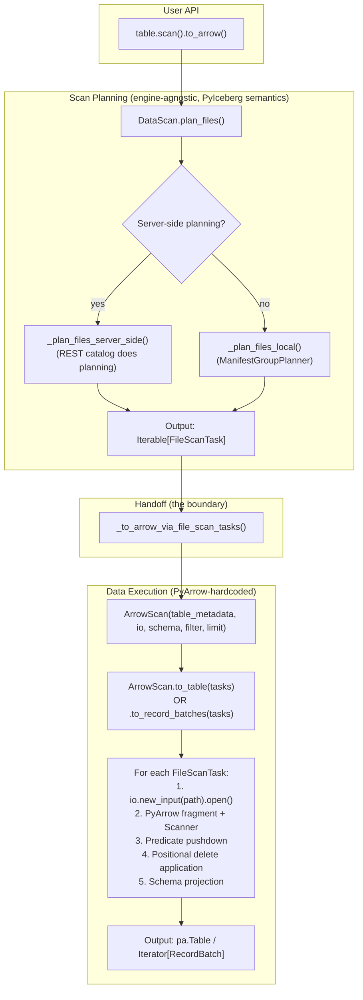
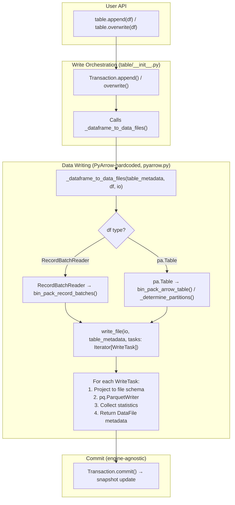
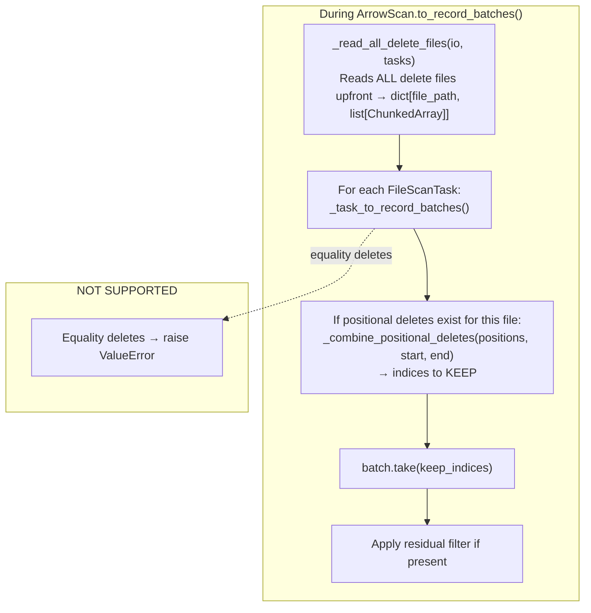

# Pluggable Backend Discovery: iceberg-python Codebase Analysis

Branch: `pluggable-backend-discovery` (iceberg-python)
Base: `main` @ commit `9d36e236` (Bump to Java Iceberg 1.11.0)

---

## 1. Current Architecture: The Exact Data Path

### 1.1 The Read Pipeline (scan → Arrow output)



### 1.2 The Write Pipeline (Arrow → Parquet files)



### 1.3 The Delete Resolution Pipeline



---

## 2. The Exact Coupling Points (What Uses PyArrow)

### 2.1 File: `pyiceberg/io/pyarrow.py` (3,100+ lines)

| Line Range | Responsibility | PyArrow APIs Used | Pluggable? |
|-----------|---------------|-------------------|:---:|
| 246-390 | `PyArrowFileIO` + `PyArrowFile` | `pyarrow.fs.*` | Already abstract (FileIO ABC) |
| 699-710 | `schema_to_pyarrow()` | `pa.Schema`, visitor pattern | Shared infra (all backends need Arrow Schema) |
| 853-1069 | Expression → PyArrow filter | `pc.Expression`, `pc.field()`, `pc.scalar()` | **Backend-specific** |
| 1120-1165 | `_read_deletes()` | `ds.Scanner.from_fragment().to_table()`, `pc.filter` | **Backend-specific** |
| 1167-1220 | `pyarrow_to_schema()` | `pa.Schema` visitor | Shared infra |
| 1616-1727 | `_task_to_record_batches()` | `ds.Scanner.from_fragment()`, `pq.ParquetFile` equivalent | **Core read — must be abstracted** |
| 1728-1870 | `ArrowScan` class | Orchestrates tasks → batches | **The execution layer to replace** |
| 2198-2500 | `StatsAggregator`, statistics | Parquet metadata access | **Backend-specific** |
| 2617-2700 | `write_file()` | `pq.ParquetWriter` | **Core write — must be abstracted** |
| 2869-2970 | `_dataframe_to_data_files()` | `pa.Table`, `pa.RecordBatchReader` | **Write orchestration — must be abstracted** |

### 2.2 File: `pyiceberg/table/__init__.py` (key coupling points)

| Line | What | Coupling |
|------|------|---------|
| 2186-2215 | `_to_arrow_via_file_scan_tasks()`, `_to_arrow_batch_reader_via_file_scan_tasks()` | Import `ArrowScan` from pyarrow.py — **the bridge functions to replace** |
| 2285-2315 | `DataScan.to_arrow()`, `.to_arrow_batch_reader()` | Call the bridge functions |
| 460-800 | `Transaction.append()`, `.overwrite()`, `.delete()`, `.upsert()` | Call `_dataframe_to_data_files()` from pyarrow.py |
| 2721-2755 | `WriteTask` dataclass | Uses `pa.RecordBatch` in type — Arrow FORMAT coupling (permanent, correct) |

### 2.3 Other files with PyArrow coupling

| File | Nature |
|------|--------|
| `pyiceberg/table/upsert_util.py` | Uses `pa.Table`, `pc.is_in()` for key matching — **compute coupling** |
| `pyiceberg/table/inspect.py` | Uses `pa.table()` for metadata inspection results — lightweight |
| `pyiceberg/table/deletion_vector.py` | Uses `pa.ChunkedArray` for DV representation — Arrow format coupling |
| `pyiceberg/transforms.py` | Uses `pc.*` for transform computation OR delegates to `pyiceberg_core` |
| `pyiceberg/expressions/visitors.py` | Uses `pc.*` for expression evaluation — **backend-specific** |

---

## 3. The Natural Interface Boundary: FileScanTask

### 3.1 FileScanTask as the Contract

```python
@dataclass(init=False)
class FileScanTask(ScanTask):
    file: DataFile           # What to read (path, format, partition, stats)
    delete_files: set[DataFile]  # What deletes apply (positional only currently)
    residual: BooleanExpression  # Filter after partition pruning
```

This is already:
- **Engine-agnostic** — no PyArrow types in it
- **Complete** — contains everything a backend needs to produce correct output
- **Serializable** — can cross process boundaries (REST scan planning already serializes it)
- **The same structure regardless of who planned it** (local, REST, or Rust)

### 3.2 What a Backend Receives

To execute a scan, a backend needs:
1. `Iterable[FileScanTask]` — what to read and what deletes apply
2. `Schema` (Iceberg) — what columns to project
3. `BooleanExpression` (Iceberg) — residual filter
4. `FileIO` properties — how to access storage (S3 credentials, etc.)
5. `TableMetadata` — for schema reconciliation context
6. Optional: `memory_limit` — for bounded-memory execution

And returns:
- `Iterator[pa.RecordBatch]` — the Arrow data (streaming)

### 3.3 What a Write Backend Receives

To execute a write:
1. `Iterator[pa.RecordBatch]` — data to write
2. `Schema` (Iceberg) — target schema
3. `TableMetadata` — for properties (target file size, compression, etc.)
4. `FileIO` properties — where to write
5. Partition routing info — which partition each batch belongs to

And returns:
- `Iterable[DataFile]` — metadata about written files (for commit)

---

## 4. Engine API Discovery

### 4.1 DataFusion (datafusion-python)

```python
from datafusion import SessionContext, RuntimeEnvBuilder

# Session setup (bounded memory)
runtime = RuntimeEnvBuilder().with_fair_spill_pool(512_000_000).with_disk_manager_os()
ctx = SessionContext(runtime=runtime)

# READ: Register Parquet file, apply filter, project columns
ctx.register_parquet("data", "s3://bucket/file.parquet")
result = ctx.sql("SELECT col1, col2 FROM data WHERE col1 > 5 ORDER BY col2")
arrow_table = result.to_arrow_table()
# Or streaming: result.execute_stream() → RecordBatchStream

# COMPUTE: Sort
ctx.register_record_batches("input", [batches])
sorted_result = ctx.sql("SELECT * FROM input ORDER BY key")

# COMPUTE: Anti-join (equality delete resolution)
ctx.register_record_batches("data", [data_batches])
ctx.register_record_batches("deletes", [delete_batches])
resolved = ctx.sql("SELECT d.* FROM data d LEFT ANTI JOIN deletes e ON d.id = e.id")

# COMPUTE: Filter
ctx.register_record_batches("data", [batches])
filtered = ctx.sql("SELECT * FROM data WHERE status != 'deleted'")

# WRITE: DataFusion doesn't have a direct "write Parquet" from Python
# → Delegate to PyArrow ParquetWriter (or use Rust-side IcebergWriteExec via pyiceberg-core)

# OBJECT STORE: Configured via RuntimeEnvBuilder or environment
# Supports S3, GCS, ADLS, local via object_store crate (Apache 2.0)
```

**Key APIs:**
- `SessionContext(runtime=...)` — per-session memory isolation
- `RuntimeEnvBuilder().with_fair_spill_pool(N)` — explicit memory budget
- `ctx.register_parquet(name, path)` — read from storage
- `ctx.register_record_batches(name, batches)` — register existing Arrow data
- `ctx.sql(query)` — execute SQL
- `.to_arrow_table()` / `.execute_stream()` — get Arrow output

**Capabilities:** ✅ Sort+spill, ✅ Join+spill, ✅ Filter (streaming), ✅ Aggregate+spill
**Limitations:** No direct Parquet write from Python API (delegate to PyArrow)
**License:** Apache 2.0 (including object store)
**Memory model:** Per-session `FairSpillPool` — explicit, configurable, isolated

### 4.2 DuckDB (duckdb-python)

```python
import duckdb

# Session setup
con = duckdb.connect()
con.execute("SET memory_limit = '2GB'")
con.execute("SET temp_directory = '/tmp/duckdb_spill'")

# READ: Read Parquet with pushdown
result = con.execute("""
    SELECT col1, col2 FROM read_parquet('s3://bucket/file.parquet')
    WHERE col1 > 5
""")
arrow_table = result.to_arrow_table()  # was fetch_arrow_table(), deprecated

# COMPUTE: Sort
con.register("input", arrow_table)
sorted_result = con.execute("SELECT * FROM input ORDER BY key").to_arrow_table()

# COMPUTE: Anti-join
con.register("data_tbl", data_table)
con.register("deletes_tbl", delete_table)
resolved = con.execute("""
    SELECT d.* FROM data_tbl d
    LEFT ANTI JOIN deletes_tbl e ON d.id = e.id
""").to_arrow_table()

# WRITE: DuckDB can write Parquet
con.execute("COPY (SELECT * FROM input) TO 'output.parquet' (FORMAT PARQUET)")

# OBJECT STORE: httpfs extension (BSL license!)
con.execute("SET s3_region = 'us-east-1'")
con.execute("SET s3_access_key_id = '...'")
con.execute("SET s3_secret_access_key = '...'")
```

**Key APIs:**
- `duckdb.connect()` — create connection
- `con.execute("SET memory_limit = '2GB'")` — memory config (connection-wide)
- `con.register(name, arrow_table)` — register Arrow data
- `con.execute(sql).to_arrow_table()` — execute + get Arrow
- `read_parquet(path)` — direct Parquet read in SQL

**Capabilities:** ✅ Sort+spill, ✅ Join+spill, ✅ Filter, ✅ Aggregate, ✅ Write Parquet
**Limitations:** Connection-wide memory (not per-query), BSL license for S3
**License:** Core: MIT. httpfs (S3/GCS): **Business Source License** (non-open-source)
**Memory model:** Connection-wide `SET memory_limit` — less granular than DataFusion

### 4.3 Polars

```python
import polars as pl

# READ: Lazy scan with pushdown
lf = pl.scan_parquet("s3://bucket/file.parquet")
result = lf.filter(pl.col("col1") > 5).select(["col1", "col2"]).collect()
arrow_table = result.to_arrow()

# COMPUTE: Sort (in-memory only, no spill)
sorted_df = df.sort("key")

# COMPUTE: Anti-join (in-memory only)
resolved = data_df.join(deletes_df, on="id", how="anti")

# WRITE: Write Parquet
df.write_parquet("output.parquet")

# OBJECT STORE: Built-in cloud support
# Configured via storage_options={"aws_access_key_id": "...", ...}
```

**Key APIs:**
- `pl.scan_parquet(path, storage_options={})` — lazy Parquet scan
- `.filter()`, `.select()`, `.sort()`, `.join()` — lazy expressions
- `.collect()` — execute the lazy plan
- `.to_arrow()` — convert to Arrow

**Capabilities:** ✅ Sort (in-memory), ✅ Join (in-memory), ✅ Filter (streaming in lazy mode), ✅ Write
**Limitations:** ❌ No spill-to-disk for sort or join. Large data OOMs.
**License:** MIT
**Memory model:** No configurable limit. Uses all available RAM.

### 4.4 cuDF (RAPIDS)

```python
import cudf

# READ: GPU-accelerated Parquet read
gdf = cudf.read_parquet("file.parquet")

# COMPUTE: GPU sort
sorted_gdf = gdf.sort_values("key")

# COMPUTE: GPU anti-join
resolved = data_gdf.merge(deletes_gdf, on="id", how="leftanti")

# EXCHANGE: GPU → CPU Arrow
cpu_table = sorted_gdf.to_arrow()

# LIMITATIONS:
# - Requires NVIDIA GPU + CUDA
# - Data must fit in GPU VRAM (8-80GB)
# - No spill to system RAM or SSD equivalent to DataFusion
# - S3 access via separate cudf.io or fsspec
```

**Capabilities:** ✅ Sort (GPU), ✅ Join (GPU), ✅ Filter (GPU), ✅ Arrow interop
**Limitations:** ❌ Hardware-dependent, ❌ VRAM-limited (no spill), ❌ Not pip-installable on all systems
**License:** Apache 2.0
**Memory model:** GPU VRAM. No configurable CPU memory budget.

### 4.5 Ray (ray.data)

```python
import ray

# READ: Distributed Parquet read
ds = ray.data.read_parquet("s3://bucket/table/")

# COMPUTE: Distributed sort (across workers)
sorted_ds = ds.sort("key")

# COMPUTE: No native anti-join
# Must convert to Arrow/pandas per-block and use another library

# EXCHANGE: To Arrow
arrow_table = ds.to_arrow_refs()  # distributed Arrow blocks
```

**Key insight:** Ray is NOT a compute backend — it's a **distribution layer**. It
distributes work across machines. Per-worker compute still needs PyArrow/DataFusion/DuckDB.
It doesn't implement sort/join itself for single-node bounded memory.

**Capabilities:** ✅ Distributed reads, ⚠️ Sort (distributed, not bounded-memory per-node)
**Limitations:** ❌ Not a single-node compute engine, ❌ No anti-join primitive
**Role:** Orchestration layer ABOVE our backend protocol (see Section 6 of pluggable_scan_task.md)

---

## 5. Protocol Derivation: What's Common Across All Engines

### 5.1 Read Operation

Every engine accepts:
- A file path (string)
- Column projection (list of column names or indices)
- A filter predicate (each engine's own format)

And returns: Arrow RecordBatch/Table

```python
# The common signature (derived from all engines):
def read_parquet(
    location: str,
    projected_columns: list[str],
    filter_expression: BooleanExpression,  # Iceberg expression, converted per-backend
    io_properties: dict[str, str],         # Credentials, region, endpoint
) -> Iterator[pa.RecordBatch]:
```

**Per-backend variation:** Expression format
- DataFusion: SQL string (`"col1 > 5 AND col2 = 'x'"`)
- DuckDB: SQL string (same)
- Polars: `pl.col("col1") > 5` expression objects
- PyArrow: `pc.field("col1") > pc.scalar(5)` expression objects
- cuDF: Boolean mask or query string

**Resolution:** The protocol accepts `BooleanExpression` (Iceberg's own format). Each
backend implements its own converter: `expression_to_sql()`, `expression_to_polars()`, etc.
This is a small per-backend cost (~50-100 lines each for SQL-based engines).

### 5.2 Write Operation

Every engine accepts:
- Arrow data (RecordBatch/Table)
- Output path (string)
- Write properties (compression, row group size, etc.)

And returns: File metadata (size, statistics)

```python
def write_parquet(
    batches: Iterator[pa.RecordBatch],
    location: str,
    schema: Schema,
    write_properties: dict[str, str],
    io_properties: dict[str, str],
) -> DataFile:
```

**Per-backend variation:** Minimal. All write Arrow → Parquet.
**Note:** DataFusion doesn't have a Python-side write API. It delegates to PyArrow.
This is fine — write is I/O-bound, not compute-bound. PyArrow writing is sufficient.

### 5.3 Compute Operations

| Operation | Common signature | Per-backend conversion |
|-----------|-----------------|----------------------|
| Sort | `sort(data: Iterator[RecordBatch], keys: list[str], memory_limit: int)` | SQL ORDER BY vs. `.sort_by()` vs. `.sort_values()` |
| Anti-join | `anti_join(left: Iterator[RB], right: Iterator[RB], on: list[str], memory_limit: int)` | SQL LEFT ANTI JOIN vs. `.join(how="anti")` vs. `pc.is_in()` |
| Filter | `filter(data: Iterator[RB], predicate: BooleanExpression)` | SQL WHERE vs. `.filter()` vs. expression |
| Hash join | `hash_join(left: Iterator[RB], right: Iterator[RB], on: list[str], join_type: str, memory_limit: int)` | SQL JOIN vs. `.join()` |

### 5.4 The Capability Declaration

```python
class ComputeBackend(Protocol):
    @property
    def supports_bounded_memory(self) -> bool:
        """Can this backend honor memory_limit (spill-to-disk)?"""
        ...

    @property
    def supports_anti_join(self) -> bool:
        """Can this backend perform LEFT ANTI JOIN natively?"""
        ...
```

| Backend | `supports_bounded_memory` | `supports_anti_join` |
|---------|:---:|:---:|
| DataFusion | ✅ | ✅ |
| DuckDB | ✅ | ✅ |
| Polars | ❌ | ✅ (in-memory only) |
| PyArrow | ❌ | ❌ (workaround via `pc.is_in`) |
| cuDF | ❌ (VRAM only) | ✅ (GPU) |

---

## 6. Identified Nuances and Edge Cases

### 6.1 Delete File Handling: The Critical Difference

Currently, `ArrowScan` reads ALL delete files upfront into memory (`_read_all_delete_files()`).
This is where OOM happens for large delete sets.

In the pluggable model:
- **Positional deletes:** Backend receives the delete file paths in `FileScanTask.delete_files`.
  It reads them and applies the position filter. This is a streaming operation (per-batch).
- **Equality deletes:** Backend receives data file + delete files. It performs an ANTI JOIN.
  This is the operation that REQUIRES spill-capable compute.

The interface must accommodate both:
```python
def execute_scan(
    tasks: Iterable[FileScanTask],  # Each task has .delete_files
    ...
) -> Iterator[pa.RecordBatch]:
    # Backend internally:
    # 1. For each task, read data file
    # 2. If task has positional deletes: apply position filter
    # 3. If task has equality deletes: anti-join against delete file(s)
    # 4. Apply residual filter
    # 5. Project to requested schema
```

### 6.2 Schema Reconciliation

Iceberg tables evolve schemas. A file written with schema v1 may be read with schema v5.
The `_task_to_record_batches()` function handles:
- Column projection by field ID (not name)
- Missing columns → fill with null
- Type promotion (int32 → int64)
- Column reordering

This logic is ABOVE the backend — it's Iceberg semantics. The backend produces raw
batches from the file; PyIceberg handles reconciliation via `_to_requested_schema()`.

**Decision:** Schema reconciliation stays in PyIceberg (shared logic). Backends just
read the physical file schema. PyIceberg transforms the output to match the projected schema.

### 6.3 Object Store Credentials

Each engine configures object store differently:
- **PyArrow:** `pyarrow.fs.S3FileSystem(access_key=..., secret_key=..., region=...)`
- **DataFusion:** `RuntimeEnvBuilder` or environment variables / `SessionContext` URL config
- **DuckDB:** `SET s3_region`, `SET s3_access_key_id`, etc.
- **Polars:** `storage_options={"aws_access_key_id": "...", ...}`
- **cuDF:** Environment variables or `fsspec` storage options

**Resolution:** The `IOBackend` interface accepts `io_properties: dict[str, str]` (same
dict PyIceberg's `FileIO` already uses). Each backend translates these to its native format.
This is a one-time `_configure_object_store(backend, io_properties)` call.

### 6.4 Streaming vs. Materialized Results

- **DataFusion:** Can stream results via `execute_stream()` → `RecordBatchStream`
- **DuckDB:** Results are materialized by `.to_arrow_table()` (can chunk with `.fetchmany()`)
- **Polars:** Lazy execution → `.collect()` materializes; no streaming iterator
- **PyArrow:** `Scanner.to_batches()` is streaming (iterator of RecordBatch)

**Resolution:** The protocol uses `Iterator[pa.RecordBatch]` as the output type.
Backends that materialize internally (DuckDB, Polars) convert to an iterator post-hoc.
The contract is streaming — backends that can truly stream (DataFusion, PyArrow) are
more memory-efficient, but all can satisfy the contract.

### 6.5 Parallelism Within a Backend

- **PyArrow:** Uses `ExecutorFactory` (thread pool) to read files in parallel
- **DataFusion:** Internal Tokio async runtime, `target_partitions` for parallelism
- **DuckDB:** Automatic parallelism (no config needed)
- **Polars:** Automatic parallelism in lazy mode

**Resolution:** Parallelism is internal to each backend. The protocol doesn't specify
how backends parallelize — only what they produce (correct output, within memory budget).

---

## 7. The Proposed Protocol (Validated Against All Engines)

Based on the discovery above, the protocol that fits ALL engines:

```python
from typing import Protocol, Iterator, Literal
import pyarrow as pa
from pyiceberg.schema import Schema
from pyiceberg.expressions import BooleanExpression
from pyiceberg.table import FileScanTask, DataFile, TableMetadata

class IOBackend(Protocol):
    """Reads Parquet → Arrow and writes Arrow → Parquet."""

    def read_parquet(
        self,
        location: str,
        projected_schema: Schema,
        row_filter: BooleanExpression,
        io_properties: dict[str, str],
    ) -> Iterator[pa.RecordBatch]: ...

    def write_parquet(
        self,
        batches: Iterator[pa.RecordBatch],
        location: str,
        schema: Schema,
        write_properties: dict[str, str],
        io_properties: dict[str, str],
    ) -> DataFile: ...

    def list_objects(
        self,
        prefix: str,
        io_properties: dict[str, str],
    ) -> Iterator[str]: ...


class ComputeBackend(Protocol):
    """Executes sort/join/filter/aggregate on Arrow data."""

    @property
    def supports_bounded_memory(self) -> bool: ...

    def sort(
        self,
        data: Iterator[pa.RecordBatch],
        sort_keys: list[tuple[str, Literal["ascending", "descending"]]],
        memory_limit: int | None = None,
    ) -> Iterator[pa.RecordBatch]: ...

    def anti_join(
        self,
        left: Iterator[pa.RecordBatch],
        right: Iterator[pa.RecordBatch],
        on: list[str],
        memory_limit: int | None = None,
    ) -> Iterator[pa.RecordBatch]: ...

    def hash_join(
        self,
        left: Iterator[pa.RecordBatch],
        right: Iterator[pa.RecordBatch],
        on: list[str],
        join_type: Literal["inner", "left", "right", "outer", "semi", "anti"],
        memory_limit: int | None = None,
    ) -> Iterator[pa.RecordBatch]: ...

    def filter(
        self,
        data: Iterator[pa.RecordBatch],
        predicate: BooleanExpression,
    ) -> Iterator[pa.RecordBatch]: ...


class ExecutionBackend(Protocol):
    """Composite: executes complete scan tasks (read + delete resolution + filter)."""

    def execute_scan(
        self,
        tasks: Iterable[FileScanTask],
        table_metadata: TableMetadata,
        projected_schema: Schema,
        row_filter: BooleanExpression,
        io_properties: dict[str, str],
        memory_limit: int | None = None,
    ) -> Iterator[pa.RecordBatch]: ...
```

### 7.1 Why This Works for Each Engine

| Engine | `read_parquet` | `write_parquet` | `sort` | `anti_join` | `filter` |
|--------|:---:|:---:|:---:|:---:|:---:|
| **PyArrow** | `Scanner.to_batches()` | `pq.ParquetWriter` | `pa.Table.sort_by()` (no limit) | `pc.is_in()` workaround | `table.filter(expr)` |
| **DataFusion** | `register_parquet` + SQL | Delegate to PyArrow | SQL ORDER BY (spills) | SQL LEFT ANTI JOIN (spills) | SQL WHERE |
| **DuckDB** | `read_parquet()` | `COPY TO` | SQL ORDER BY (spills) | SQL LEFT ANTI JOIN (spills) | SQL WHERE |
| **Polars** | `pl.scan_parquet().collect()` | `write_parquet()` | `.sort()` (no limit) | `.join(how="anti")` | `.filter()` |
| **cuDF** | `cudf.read_parquet()` | delegate | `.sort_values()` (VRAM) | `.merge(how="leftanti")` | mask filter |

Every cell has a concrete API call. The protocol fits all five without special-casing.

---

## 8. Summary of Findings

### 8.1 The Interface Is Correct

The `FileScanTask` boundary between planning and execution is clean, engine-agnostic,
and already exists. The proposed `IOBackend + ComputeBackend + ExecutionBackend` protocol
maps naturally to all 5 studied engines with no special-casing.

### 8.2 The First PR Scope (PyArrow + DataFusion)

- Extract `PyArrowIOBackend` from the monolith (move `ArrowScan` read logic + `write_file`)
- Extract `PyArrowComputeBackend` (sort via `sort_by`, filter via `pc.Expression`)
- Implement `DataFusionComputeBackend` (sort/join/filter via SQL with `FairSpillPool`)
- Implement `DataFusionIOBackend` (read via `register_parquet`)
- Wire `resolve_backend()` into `DataScan.to_arrow()` and `_to_arrow_via_file_scan_tasks()`
- Schema reconciliation (`_to_requested_schema`) stays in shared PyIceberg code

### 8.3 Known Gaps to Address

1. **Expression conversion:** Need `expression_to_sql()` for DataFusion/DuckDB (currently only `expression_to_pyarrow()` exists)
2. **Object store bridge:** Need `configure_object_store(ctx, io_properties)` per backend
3. **Write delegation:** DataFusion backend delegates writes to PyArrow (acceptable — write is I/O-bound)
4. **Streaming DuckDB results:** DuckDB materializes; need to chunk into iterator
5. **Equality deletes:** Not yet supported — the protocol enables it (via `anti_join`), implementation is a separate PR
