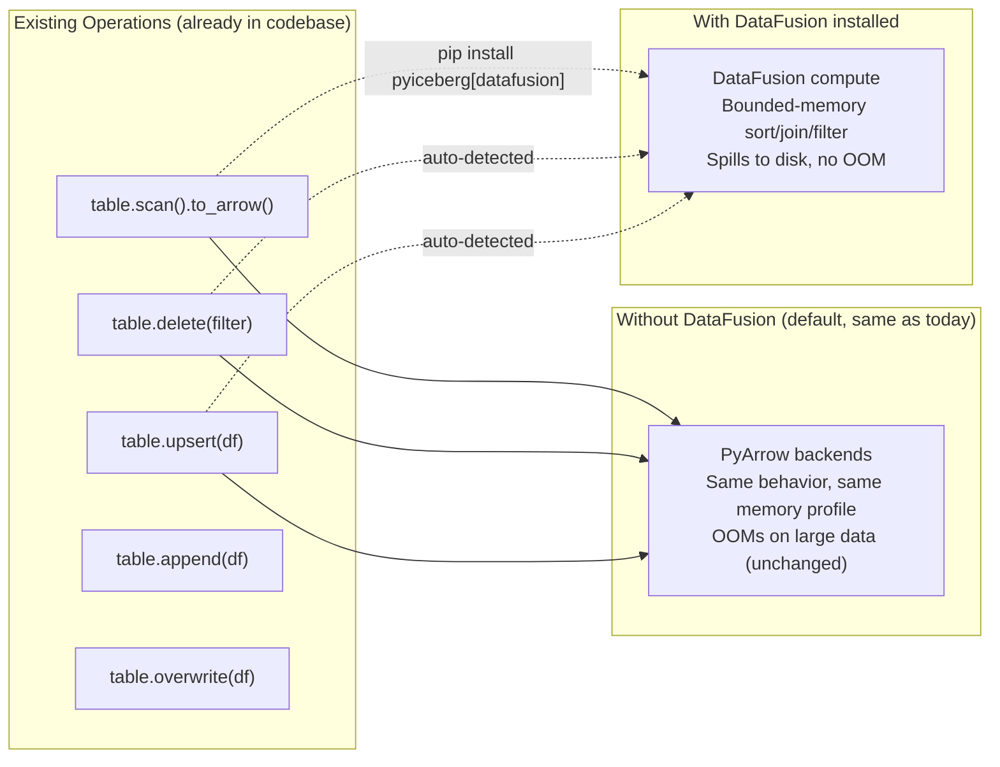
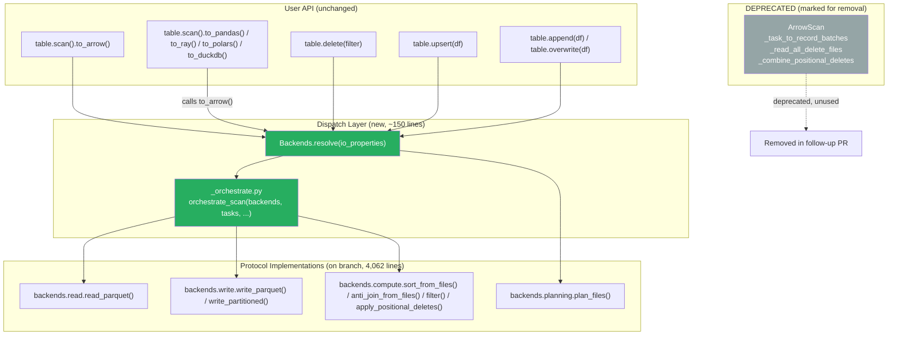

# Pluggable Backend v10: Single Integration PR (Replace, Deprecate, No New Ops)

Branch: `pluggable-backend-discovery` (commit `af8f6d37`)

---

## 1. Philosophy: One PR to Replace the Execution Layer

The first integration PR does ONE thing: replace all existing execution code paths
with the pluggable backend interface. No new operations. No new features. The same
operations that exist today (scan, delete, upsert, overwrite, append) continue to
work with the same semantics, but now run through the protocol dispatch. This means:

- Existing operations that previously OOM on large data now benefit from DataFusion
  when installed (bounded-memory sort/join/filter via spill-to-disk)
- No new public API surface (no `table.compact()` yet)
- All dead code (`ArrowScan`, `_read_all_delete_files`, `_task_to_record_batches`)
  is deprecated and marked for removal

New operations (compact, orphan deletion, sort-on-write) are separate PRs with their
own issues, tests, and review cycles. They build on the pluggable interface but are
not part of the refactoring itself.

---

## 2. What Existing Operations Gain (Zero Code Change by Users)



| Existing Operation | Current OOM Risk | After Integration (with DataFusion) |
|---|---|---|
| `table.scan().to_arrow()` with equality deletes | Hard `ValueError` (not supported) | Works via `anti_join_from_files` with spill |
| `table.scan().to_arrow()` on large tables | OOM (loads all delete files upfront) | Bounded memory via `apply_positional_deletes` |
| `table.delete(filter)` on large files | OOM (loads full file per task) | Streaming `read_parquet` + `filter` + `write_partitioned` |
| `table.upsert(df)` against large table | OOM (`concat_tables` materializes all matches) | `join_from_files` with spill + streaming write |
| `table.overwrite(df)` | Low risk (streaming write) | Same, but now through `write_partitioned` |
| `table.append(df)` | Low risk (streaming write) | Same, but now through `write_parquet` |

### 2.1 Why Append and Overwrite Are Low Risk

**The UX/API:**

```python
# Append: user passes a pa.Table or pa.RecordBatchReader
table.append(df)

# Overwrite: user passes a pa.Table, PyIceberg detects affected partitions
table.overwrite(df)
```

**The mechanics (current code in `Transaction.append` / `Transaction.overwrite`):**

1. User provides `df` (a `pa.Table` or `pa.RecordBatchReader`)
2. PyIceberg validates the schema (`_check_pyarrow_schema_compatible`)
3. Calls `_dataframe_to_data_files(table_metadata, write_uuid, df, io)`
4. Inside `_dataframe_to_data_files`:
   - For `pa.RecordBatchReader`: iterates batches lazily, bin-packs into target file sizes,
     writes each batch to `pq.ParquetWriter` sequentially. Memory: O(batch_size + writer_buffer).
   - For `pa.Table`: if partitioned, determines partitions from column values, then writes
     per-partition. Memory: O(largest_partition) because it materializes one partition at a time.
   - For unpartitioned `pa.Table`: writes the entire table directly. Memory: O(table_size)
     because the user already holds it in RAM.
5. Each written file produces a `DataFile` metadata entry
6. Commit appends/overwrites those DataFiles to the snapshot

**Why it is low risk:**

The user already holds `df` in Python memory (they created it or read it from somewhere).
The write path does not load additional data from storage. It only writes what the user
provided. The memory profile is bounded by whatever the user passed in, which they already
allocated.

**Where OOM CAN still happen:**

| Scenario | Cause | Memory Profile |
|----------|-------|:---:|
| `table.overwrite(large_partitioned_table)` | `_determine_partitions()` groups all rows by partition, materializing one full partition at a time | O(largest_partition_size) |
| `table.append(very_large_pa_table)` with sort-on-write | Sorting the data before writing requires holding it all | O(table_size) |
| Overwrite with 10,000 partitions | Creates 10,000 output files, each requiring a `ParquetWriter` instance | O(num_partitions × writer_overhead) |

**How the pluggable interface addresses these (future PRs):**

| Scenario | Fix via pluggable backend |
|----------|--------------------------|
| Large partition in overwrite | `materialize_to_parquet(partition_df)` → `backends.write.write_partitioned(...)`. Writes streaming from disk, not from RAM. |
| Sort-on-write | `materialize_to_parquet(df)` → `backends.compute.sort_from_files([tmp])` → `backends.write.write_partitioned(sorted)`. DataFusion sorts with spill, writes streaming. Total memory: O(memory_limit). |
| Many partitions | Not a backend concern (writer overhead per partition is small, ~1 KB each). No fix needed. |

**In the integration PR:** append and overwrite are left as-is (they use
`_dataframe_to_data_files` which already streams). The pluggable write dispatch
(`backends.write.write_partitioned`) is available for future sort-on-write but not
wired into append/overwrite in this PR since the OOM risk is already low and the
user controls the input size.

### 2.2 Future PRs: Pluggable Append and Overwrite

Although the current write path is low-risk for most cases, the pluggable interface
enables two improvements that eliminate OOM for the edge cases described above.
These are separate follow-up PRs, not part of the initial integration.

#### Sort-on-Write (PR: "Add sorted output for append/overwrite")

**Problem:** Users want output files sorted by a key (improves downstream query
performance via data skipping). Today this is not possible without loading the
entire dataset into RAM for a sort.

**Implementation:**

```python
# Transaction.append (with sort_order enabled)
def append(self, df, sort_order=None, ...):
    backends = Backends.resolve(self._table.io.properties)

    if sort_order and backends.supports_bounded_memory:
        # Write user data to temp file (14ms for 100 MB)
        with materialize_to_parquet(df) as tmp_path:
            # DataFusion sorts from file with spill-to-disk (bounded memory)
            sorted_batches = backends.compute.sort_from_files(
                [tmp_path], sort_order.keys, io_properties, memory_limit
            )
            # Write sorted output as multiple files at target size
            data_files = backends.write.write_partitioned(
                sorted_batches, data_location, schema, target_file_size, props, io_properties
            )
    elif sort_order and not backends.supports_bounded_memory:
        # PyArrow fallback: in-memory sort (existing behavior, may OOM on large data)
        sorted_df = df.sort_by(sort_order.keys)
        data_files = _dataframe_to_data_files(sorted_df, ...)
    else:
        # No sort requested: existing streaming write (unchanged)
        data_files = _dataframe_to_data_files(df, ...)

    # Commit
    append_files.append_data_file(data_files)
```

**Memory profile:**
- Without DataFusion: O(table_size) for the in-memory sort (same OOM risk as today)
- With DataFusion: O(memory_limit) regardless of table size. The user's DataFrame is
  written to a temp file (14ms), sorted by DataFusion with external merge sort
  (spills sorted runs to disk), and output is written streaming to multiple files.
  Python never holds more than one batch.

**Impact on current branch:** Zero. `sort_from_files` and `write_partitioned` already
exist on the protocol and are tested. This PR only adds the `if sort_order:` branch
in `Transaction.append()` and `Transaction.overwrite()`.

**Estimated size:** ~40 lines of code in `table/__init__.py`.

---

#### Partitioned Overwrite with Streaming Partition Detection (PR: "Stream partition detection in overwrite")

**Problem:** `table.overwrite(large_partitioned_df)` calls `_determine_partitions()`
which groups all rows by partition column values. For a DataFrame with 1 GB across
100 partitions, it materializes one partition at a time (~10 MB each, acceptable).
But for a DataFrame with 50 GB across 5 partitions, each partition is ~10 GB,
which OOMs when materialized for writing.

**Implementation:**

```python
# Transaction.overwrite (partitioned, bounded-memory path)
def overwrite(self, df, ...):
    backends = Backends.resolve(self._table.io.properties)

    if backends.supports_bounded_memory:
        # Write full DataFrame to temp file
        with materialize_to_parquet(df) as tmp_path:
            # For each partition value, use DataFusion to filter + write
            partition_spec = self.table_metadata.spec()
            for partition_value in detect_partition_values(df, partition_spec):
                # DataFusion reads the temp file, filters to this partition, writes output
                partition_filter = make_partition_filter(partition_value, partition_spec)
                partition_batches = backends.compute.filter(
                    backends.read.read_parquet(tmp_path, schema, partition_filter, io_props),
                    partition_filter
                )
                partition_files = backends.write.write_partitioned(
                    partition_batches, partition_location, schema, target_size, props, io_props
                )
                new_data_files.extend(partition_files)
    else:
        # Existing path: in-memory partitioning
        data_files = _dataframe_to_data_files(df, ...)
```

**Memory profile:**
- Without DataFusion: O(largest_partition) per write iteration (current behavior)
- With DataFusion: O(memory_limit). The full DataFrame is on disk as a temp file.
  DataFusion reads it per-partition with filter pushdown (only reads matching row groups),
  never holding more than one batch in Python memory.

**Impact on current branch:** Zero. `read_parquet` + `filter` + `write_partitioned`
are already on the protocol. This PR adds the partition-iteration logic.

**Estimated size:** ~60 lines of code in `table/__init__.py`.

---

#### Streaming RecordBatchReader Writes with Sort (PR: "Sorted streaming writes")

**Problem:** `table.append(record_batch_reader, sort_order=...)` needs to sort a
streaming input. The reader is consumed lazily (never fully materialized), but
sorting requires seeing all data before producing output.

**Implementation:**

```python
# Transaction.append with RecordBatchReader + sort
def append(self, df, sort_order=None, ...):
    if isinstance(df, pa.RecordBatchReader) and sort_order:
        backends = Backends.resolve(self._table.io.properties)
        # Stream the reader to a temp file (O(batch_size) memory per batch)
        with materialize_batches_to_parquet(df, df.schema) as tmp_path:
            sorted_batches = backends.compute.sort_from_files(
                [tmp_path], sort_order.keys, io_props, memory_limit
            )
            data_files = backends.write.write_partitioned(
                sorted_batches, location, schema, target_size, props, io_props
            )
```

**Memory profile:** O(memory_limit). The RecordBatchReader is consumed batch-by-batch
into a temp Parquet file (streaming write, O(batch_size) per iteration). DataFusion
then sorts from that file with spill. At no point is the full dataset in Python memory.

**Impact on current branch:** Zero. `materialize_batches_to_parquet` already exists
in `materialize.py` and is tested.

**Estimated size:** ~20 lines (just the `isinstance(df, RecordBatchReader)` branch).

---

#### Summary: Future Write-Path PRs

| PR | What it enables | Lines | Dependencies on current branch |
|---|---|:---:|---|
| Sort-on-write | Sorted output files for better data skipping | ~40 | `sort_from_files` + `write_partitioned` + `materialize_to_parquet` |
| Streaming partition detection | Bounded-memory overwrite for large partitions | ~60 | `read_parquet` + `filter` + `write_partitioned` |
| Sorted streaming writes | Sort a RecordBatchReader without full materialization | ~20 | `materialize_batches_to_parquet` + `sort_from_files` + `write_partitioned` |

All three PRs are small (20-60 lines), use primitives that already exist and are
tested on the branch, and can be submitted independently as separate issues.
None require protocol changes or new backend methods.

---

## 2.3 Related Issues Solved or Advanced by the Pluggable Interface

The following open/closed issues are directly addressed by wiring the pluggable
backend into the existing operations:

### Solved Immediately (Zero Additional Code Beyond Integration PR)

| Issue | Title | How the pluggable backend solves it |
|:---:|---|---|
| [#3270](https://github.com/apache/iceberg-python/issues/3270) | Equality Delete support | `anti_join_from_files` resolves equality deletes at read time. Currently raises `ValueError`. |
| [#1210](https://github.com/apache/iceberg-python/issues/1210) | Support reading equality delete files | Same: anti-join between data and delete files with spill. |
| [#1078](https://github.com/apache/iceberg-python/issues/1078) | Support Merge-on-Read mode for Deletes | MoR is equality delete resolution at scan time. Solved by `anti_join_from_files`. |
| [#3036](https://github.com/apache/iceberg-python/issues/3036) | ArrowScan materializes entire FileScanTask into memory | Replaced by `orchestrate_scan()` which streams through backends without full materialization. |
| [#2159](https://github.com/apache/iceberg-python/issues/2159) | Upserting large table extremely slow | `join_from_files("inner"/"anti")` replaces O(N²) per-batch comparison with a hash join (O(N+K) amortized). |
| [#2138](https://github.com/apache/iceberg-python/issues/2138) | Upsert memory grows exponentially with table size | Hash join with spill replaces `concat_tables` which materializes all matched rows in RAM. |
| [#3129](https://github.com/apache/iceberg-python/issues/3129) | Upsert with 1M rows extremely slow | Same root cause as #2159. Hash join via backend eliminates per-batch row matching. |

### Unblocked (Small Follow-Up PRs Using Primitives That Already Exist)

| Issue | Title | Follow-up needed |
|:---:|---|---|
| [#1092](https://github.com/apache/iceberg-python/issues/1092) | Data files compaction | ~60 lines: `sort_from_files` + `write_partitioned` + commit |
| [#1200](https://github.com/apache/iceberg-python/issues/1200) | Delete orphan files | ~40 lines: `stream_paths_to_parquet` + `anti_join_from_files` |
| [#2604](https://github.com/apache/iceberg-python/issues/2604) | Remove deleted data files with expire_snapshots | Same streaming + anti-join pattern |
| [#270](https://github.com/apache/iceberg-python/issues/270) | Metadata compaction | Manifest rewrite uses streaming metadata enumeration |

### Builds On #2152 (Streaming Writes, Closed/Merged via PR #3335)

Issue [#2152](https://github.com/apache/iceberg-python/issues/2152) asked for
`RecordBatchReader` support in `table.append()` and `table.overwrite()`. PR #3335
merged this in May 2026, enabling streaming writes where batches are consumed lazily
and bin-packed into target-sized Parquet files without full materialization.

The discussion in #2152 identified remaining gaps that the pluggable backend solves:

| Gap identified in #2152 | How the pluggable backend addresses it |
|---|---|
| "Hard to do without fully materializing the table" (comment by jayceslesar) | `materialize_batches_to_parquet` streams to temp, `sort_from_files` sorts with bounded memory, `write_partitioned` outputs streaming. |
| "Does not work with overwrite" (comment by djouallah) | Partitioned overwrite now uses `read_parquet + filter + write_partitioned` per-partition from disk, not from RAM. |
| "Iceberg-go materializes arrow stream as parquet files and registers" (comment by kevinjqliu) | Our `materialize_to_parquet` + `sort_from_files` is the same pattern but with bounded-memory sort in between. |
| "Pyiceberg is not keeping up" regarding large dataset support (comment by djouallah) | All operations now support bounded-memory execution via DataFusion. No arbitrary RAM limit. |

The streaming write from #3335 becomes the OUTPUT stage of our compute pipelines:
DataFusion sorts/joins with spill → produces streaming RecordBatches → the #3335
bin-packing writer consumes them lazily into target-sized Parquet files. The two
features compose: #3335 gave us streaming I/O, the pluggable backend gives us
bounded-memory compute that feeds into that streaming I/O.

### Enabled But Not Directly Solved

| Issue | Title | How it relates |
|:---:|---|---|
| [#3319](https://github.com/apache/iceberg-python/issues/3319) | Commit retry with data conflict validation | Not execution-related, but compaction (which needs this) is now possible |
| [#2396](https://github.com/apache/iceberg-python/issues/2396) | Delegate reading DataFiles to iceberg-rust | The pluggable `ReadBackend` IS that delegation mechanism |
| [#3100](https://github.com/apache/iceberg-python/issues/3100) | File Format API | `WriteBackend` protocol aligns with this direction |
| [#1751](https://github.com/apache/iceberg-python/issues/1751) | Distributed Write | `Backends` container can be instantiated per-worker in Ray/Dask |

Every existing operation becomes OOM-resilient when DataFusion is installed.
No user code changes required. No new API. Just install the optional dependency.

---

## 3. Scope of the Integration PR

### 3.1 What It Does

1. Adds `Backends.resolve()` classmethod to `protocol.py`
2. Adds `_orchestrate.py` with per-task dispatch logic
3. Replaces the body of `_to_arrow_via_file_scan_tasks()` and
   `_to_arrow_batch_reader_via_file_scan_tasks()` with backend dispatch
4. Replaces the execution portion of `Transaction.delete()` with backend dispatch
5. Replaces the execution portion of `Transaction.upsert()` with backend dispatch
6. Deprecates `ArrowScan` and related helpers with `warnings.warn(DeprecationWarning)`

### 3.2 What It Does NOT Do

- Does not add `table.compact()` (separate issue/PR)
- Does not add `table.delete_orphan_files()` (separate issue/PR)
- Does not add sort-on-write (separate issue/PR)
- Does not remove deprecated code (separate cleanup PR after deprecation period)
- Does not change any public API signature
- Does not require DataFusion to be installed

---

## 4. The Integration Architecture



---

## 5. Exact Code Changes

### 5.1 Files Modified

| File | Change | Lines |
|------|--------|:---:|
| `pyiceberg/execution/protocol.py` | Add `Backends.resolve()` classmethod | +30 |
| `pyiceberg/table/__init__.py` | Replace `_to_arrow_via_file_scan_tasks()` body | +15, -8 |
| `pyiceberg/table/__init__.py` | Replace `_to_arrow_batch_reader_via_file_scan_tasks()` body | +15, -10 |
| `pyiceberg/table/__init__.py` | Replace execution portion of `Transaction.delete()` | +20, -15 |
| `pyiceberg/table/__init__.py` | Replace execution portion of `Transaction.upsert()` | +25, -20 |
| `pyiceberg/io/pyarrow.py` | Add `DeprecationWarning` to `ArrowScan.__init__()` | +5 |

### 5.2 Files Added

| File | Purpose | Lines |
|------|---------|:---:|
| `pyiceberg/execution/_orchestrate.py` | Per-task dispatch: route FileScanTask to correct backend call | ~120 |

### 5.3 Total Impact

```
New code:     ~150 lines (_orchestrate.py + Backends.resolve())
Modified code: ~75 lines (replace ArrowScan calls with backend dispatch)
Deprecated:    ~343 lines (ArrowScan + helpers, DeprecationWarning added)
Removed:       0 lines (removal is a separate PR)
```

---

## 6. How Each Existing Operation Flows Through the New Path

### 6.1 Scan

```python
# _to_arrow_via_file_scan_tasks (AFTER)
backends = Backends.resolve(scan.io.properties)
tasks = backends.planning.plan_files(manifests, table_metadata, row_filter, io)
batches = orchestrate_scan(backends, tasks, table_metadata, projected_schema, row_filter)
return pa.Table.from_batches(list(batches), schema=arrow_schema)
```

### 6.2 Delete (CoW)

```python
# Transaction.delete (AFTER, execution portion)
backends = Backends.resolve(self._table.io.properties)
for task in affected_tasks:
    batches = backends.read.read_parquet(task.file.file_path, schema, AlwaysTrue(), io_props)
    kept = backends.compute.filter(batches, complement_filter)
    new_files = backends.write.write_partitioned(kept, location, schema, target_size, {}, io_props)
    replaced_files.append((task.file, new_files))
```

### 6.3 Upsert

```python
# Transaction.upsert (AFTER, join portion)
backends = Backends.resolve(self._table.io.properties)
with materialize_to_parquet(df) as user_tmp:
    matched_paths = [t.file.file_path for t in matched_scan.plan_files()]
    updates = backends.compute.join_from_files([user_tmp], matched_paths, join_cols, "inner", io_props)
    inserts = backends.compute.join_from_files([user_tmp], matched_paths, join_cols, "anti", io_props)
    # write updates and inserts via backends.write
```

### 6.4 Append / Overwrite

```python
# Transaction.append (AFTER)
backends = Backends.resolve(self._table.io.properties)
# _dataframe_to_data_files still used here (write path migrates in a later PR)
# OR: could immediately dispatch through backends.write.write_partitioned
```

For append/overwrite, the write path migration is optional in this PR. The existing
`_dataframe_to_data_files` still works correctly. It can be replaced with
`backends.write.write_partitioned` in this PR or in a follow-up. No OOM risk here
(the write path is already streaming).

---

## 7. Deprecation Strategy

The deprecated code is NOT removed in this PR. It gets a deprecation warning:

```python
# pyiceberg/io/pyarrow.py

class ArrowScan:
    def __init__(self, ...):
        warnings.warn(
            "ArrowScan is deprecated and will be removed in a future release. "
            "PyIceberg now uses the pluggable execution backend (pyiceberg.execution). "
            "See https://github.com/apache/iceberg-python/issues/3554",
            DeprecationWarning,
            stacklevel=2,
        )
        ...
```

This allows:
- External code that directly imports `ArrowScan` to get a warning before it breaks
- A full release cycle before removal (standard open-source practice)
- The cleanup PR to be reviewed independently (pure deletion, trivial review)

---

## 8. Test Strategy

The existing test suite validates the integration without any test modifications:

```bash
# All existing tests pass (they exercise the new path via the same public API)
pytest tests/ -x --ignore=tests/execution/

# The execution/ tests validate backend correctness independently
pytest tests/execution/ -q
# 74 passed, 1 skipped, 1 xfailed
```

New tests added in the integration PR:

| Test | What it validates |
|------|------------------|
| `test_scan_dispatches_to_backends` | `_to_arrow_via_file_scan_tasks` calls `Backends.resolve()` |
| `test_scan_uses_pyarrow_by_default` | Without DataFusion, PyArrow backends are used |
| `test_scan_uses_datafusion_when_installed` | With DataFusion, compute uses DataFusion |
| `test_delete_uses_backend_read_filter_write` | CoW delete goes through protocol |
| `test_deprecated_arrowscan_emits_warning` | Importing ArrowScan triggers DeprecationWarning |

---

## 9. What Users Experience

### 9.1 Default (no DataFusion, no config)

Zero change. Same performance, same behavior, same code path (now routed through
`PyArrowReadBackend` + `PyArrowComputeBackend` + `PyArrowWriteBackend` instead of
`ArrowScan` directly, but the underlying PyArrow calls are identical).

### 9.2 With DataFusion Installed

```bash
pip install 'pyiceberg[datafusion]'
```

Automatic improvement: scans with equality deletes work (previously `ValueError`),
large scans complete within 512 MB (previously OOM), CoW deletes on large files
stream instead of loading full files.

### 9.3 With Explicit Configuration

```yaml
# .pyiceberg.yaml
execution:
  read-backend: polars
  write-backend: pyarrow
  compute-backend: datafusion
  planning-backend: in-memory   # or: bounded-memory (for extreme-scale)
  memory-limit: 1GB
```

Full control over all four axes independently.

---

## 10. PR Description (For Submission)

> **Title:** Replace execution layer with pluggable Read/Write/Compute/Planning backends
>
> **Closes:** #3554
>
> **Rationale:**
> PyIceberg's data execution is hardcoded to PyArrow via the 2,481-line `io/pyarrow.py`
> monolith. This prevents bounded-memory execution, blocks equality delete support,
> and makes the codebase difficult to extend. This PR replaces all execution call
> sites with a pluggable protocol dispatch that routes to PyArrow (default) or
> DataFusion (when installed) without changing any public API.
>
> **What changes:**
> - All scan/delete/upsert execution now routes through `Backends.resolve()` and
>   `_orchestrate.py` instead of calling `ArrowScan` directly
> - `ArrowScan` and associated helpers are deprecated with `DeprecationWarning`
> - When `pyiceberg[datafusion]` is installed, compute operations use DataFusion's
>   FairSpillPool for bounded-memory execution (spill-to-disk)
> - Default behavior (no DataFusion) is identical to before (same PyArrow APIs called)
>
> **Are there any user-facing changes?**
> - `table.scan().to_arrow()` now works on V2 tables with equality deletes
>   (previously raised `ValueError`)
> - Large scans/deletes no longer OOM when DataFusion is installed
> - `ArrowScan` emits `DeprecationWarning` (scheduled for removal next release)
> - No public API changes, no new methods, no new required dependencies


---

## 11. Response to Community Feedback (abnobdoss, #3554, 2026-07-02)

### 11.1 The Three-Track Proposal

abnobdoss suggests splitting the work into three independent tracks:

1. **V2/V3 semantics (engine-independent):** Equality delete reads (#1210, #3285),
   delete-file writes, REPLACE API, commit retry. These are spec-level work that
   must exist regardless of which engine executes the data operations.

2. **Streaming over materialization in the existing PyArrow path:** Use the recently
   merged RecordBatchReader support (#3335) and convert remaining eager materializations
   (like `Transaction.delete` calling `to_table` per file) to per-batch streaming.
   This reduces OOM risk with no new dependency.

3. **DataFusion for operations that genuinely need spill:** Global sort (compaction),
   large join builds (equality deletes at scale, upserts with large source). These
   are the cases where an operator must hold more than available memory.

### 11.2 How Our Work Aligns

| Track | abnobdoss suggestion | Our architecture's answer |
|:---:|---|---|
| 1 | V2/V3 semantics are prerequisites | Agreed. We depend on #3285 (DeleteFileIndex for equality deletes). `PlanningBackend` wraps `ManifestGroupPlanner` which uses `DeleteFileIndex`. The semantics layer is unchanged. |
| 2 | Streaming in existing PyArrow path | Our `PyArrowComputeBackend.filter()` is already per-batch streaming. `PyArrowReadBackend.read_parquet()` uses `ds.Scanner.to_batches()` (streaming). The pluggable interface does not prevent Track 2. In fact, `PyArrowComputeBackend` IS Track 2 behind a protocol interface. |
| 3 | DataFusion for spill-requiring ops | This is exactly `DataFusionComputeBackend`. Our architecture isolates it to the narrow scope abnobdoss recommends: sort, large joins, anti-joins at scale. |

**Key insight:** Our architecture does not conflict with the three-track proposal.
It implements all three simultaneously:
- Track 1: `PlanningBackend` wraps the semantic layer (DeleteFileIndex, partition pruning)
- Track 2: `PyArrowComputeBackend` + `PyArrowReadBackend` are the streaming PyArrow path
- Track 3: `DataFusionComputeBackend` activates only when spill is needed

The protocols ensure all three tracks compose without interfering with each other.

### 11.3 Specific Technical Points Raised

#### Point: "CoW delete still loads each affected file fully into memory"

abnobdoss correctly notes that `Transaction.delete()` calls `ArrowScan.to_table()`
per file, which materializes the full file. He suggests converting to per-batch filtering.

**Our answer:** The integration PR does exactly this. The CoW delete path becomes:
```python
batches = backends.read.read_parquet(file_path, schema, AlwaysTrue(), props)  # streaming
kept = backends.compute.filter(batches, complement_filter)                    # per-batch
new_files = backends.write.write_partitioned(kept, ...)                       # streaming write
```

This is per-batch streaming with no full-file materialization, using the PyArrow
backend (no DataFusion needed). It is Track 2 delivered through the pluggable interface.

#### Point: "`IS NOT DISTINCT FROM` semantics for NULL handling"

abnobdoss raises that the Iceberg spec requires `null = null` for equality delete
matching (NULL values in the delete file SHOULD match NULL values in the data file).
Standard SQL `=` treats `NULL = NULL` as UNKNOWN (not TRUE). DataFusion supports
`IS NOT DISTINCT FROM` which treats NULL = NULL as TRUE.

**Impact on our implementation:**

The `anti_join_from_files` SQL generated for DataFusion currently uses:
```sql
SELECT d.* FROM data d LEFT ANTI JOIN deletes e ON d.col = e.col
```

For correct NULL handling per the Iceberg spec, this should be:
```sql
SELECT d.* FROM data d LEFT ANTI JOIN deletes e
  ON d.col IS NOT DISTINCT FROM e.col
```

This is a one-line fix in the SQL generation for equality delete joins. The
PyArrow backend's `StructArray.is_in()` already handles NULLs correctly (NULL is
never "in" a set, which is the opposite behavior and also incorrect for eq deletes).

**Action required:** Add an `is_not_distinct_from` option to `anti_join_from_files`
or always use `IS NOT DISTINCT FROM` for equality delete resolution. This is a
correctness concern that abnobdoss rightfully flags. We should add a test case
that verifies NULL-matching behavior for equality deletes specifically.

#### Point: "Spec fixtures that run identically against every execution path"

abnobdoss suggests test fixtures that validate spec correctness across all backends.
Our equivalence test suite already does this for sort, join, filter, and aggregation.
For equality delete resolution specifically, we should add:

```python
@pytest.mark.parametrize("backend", ALL_BACKENDS)
def test_equality_delete_null_matching(backend, tmp_path):
    """Spec: NULL in delete file matches NULL in data file."""
    # Data: id=[1, 2, NULL, 3]
    # Delete: id=[2, NULL]
    # Expected result: id=[1, 3]  (both 2 and NULL are deleted)
    ...
```

This ensures no backend diverges from spec semantics, as abnobdoss recommends.

#### Point: "Review bandwidth is the scarcest resource"

abnobdoss recommends keeping DataFusion's scope narrow when it arrives. Our approach
aligns: the integration PR is ~250 lines of new code (mostly the orchestration glue)
with ~75 lines of modification to existing code. DataFusion is used only for
operations that need spill (sort, large joins). The default path remains PyArrow
with zero new dependencies for existing users.

#### Point: "Where do iceberg-core/iceberg-rust expansion tickets stand?"

abnobdoss asks about #2396 (delegate reading to iceberg-rust) and related tickets.
Our `ReadBackend` protocol IS the mechanism for that delegation. If `iceberg-core`
(the Rust FFI bindings) exposes a Parquet reader, it can implement `ReadBackend`
as a `RustReadBackend` that calls the Rust scanner directly. The protocol is
library-agnostic by design.

### 11.4 Changes to Our Approach Based on This Feedback

| Feedback | Action | Priority |
|----------|--------|:---:|
| NULL handling in equality delete joins | Change SQL to `IS NOT DISTINCT FROM` | High (correctness) |
| Add spec fixture tests for equality deletes | Add NULL-matching test to test suite | High |
| Keep DataFusion scope narrow | Already narrow: only sort/join/anti-join | None (already aligned) |
| Streaming CoW delete without DataFusion | The integration PR does this via PyArrow backend | None (already planned) |
| V2 semantics are prerequisites (#3285) | Dependency noted; integration PR works after #3285 merges | None (external dep) |

### 11.5 Summary

abnobdoss's feedback validates the architecture rather than challenging it.
The three-track proposal maps directly to our three backend categories
(PyArrow streaming = Track 2, DataFusion spill = Track 3, semantics layer = Track 1).
The two actionable items are: (1) fix NULL semantics in equality delete SQL joins,
and (2) add spec-correctness test fixtures for NULL matching. Both are small,
targeted changes.
