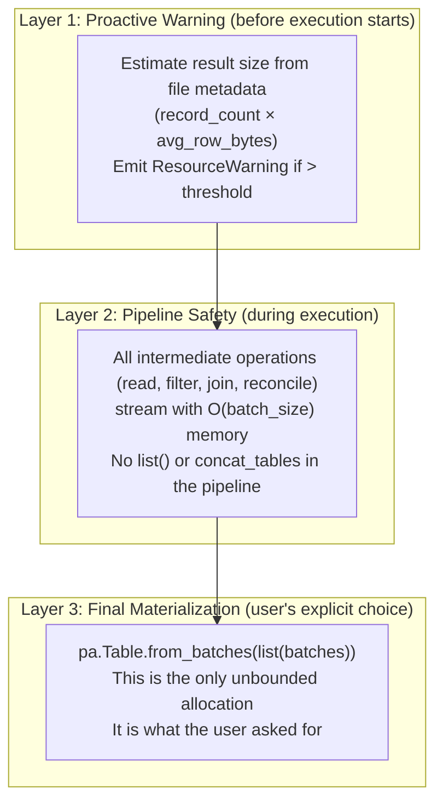
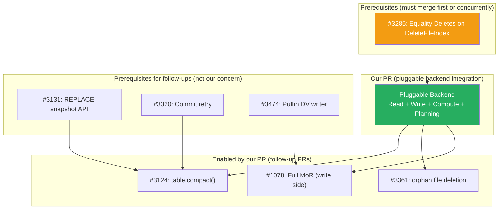

# Pluggable Backend v11: Integration Plan (Line-by-Line)

Branch: `pluggable-backend-discovery` (commit `955296ac`)
Purpose: Exact specification of code changes to wire the pluggable backend into
`pyiceberg/table/__init__.py`, replacing all ArrowScan calls and making
append/overwrite/delete/upsert/scan OOM-resilient through the protocol.

---

## 1. Files to Modify

| File | Current Lines | Lines Modified | Lines Added |
|------|:---:|:---:|:---:|
| `pyiceberg/table/__init__.py` | 2,800 | ~120 | ~30 |
| `pyiceberg/io/pyarrow.py` | 2,481 | ~5 (add deprecation warning) | 0 |

New file:
| `pyiceberg/execution/_orchestrate.py` | — | — | ~150 |

---

## 2. Change 1: `_to_arrow_via_file_scan_tasks` (Line 2173)

### Current Code

```python
def _to_arrow_via_file_scan_tasks(
    scan: BaseScan, projected_schema: Schema, tasks: Iterable[FileScanTask], dictionary_columns: tuple[str, ...] = ()
) -> pa.Table:
    """Materialize a scan into an Arrow table given its planned ``FileScanTask``s."""
    from pyiceberg.io.pyarrow import ArrowScan

    return ArrowScan(
        scan.table_metadata,
        scan.io,
        projected_schema,
        scan.row_filter,
        scan.case_sensitive,
        scan.limit,
        dictionary_columns=dictionary_columns,
    ).to_table(tasks)
```

### Replacement

```python
def _to_arrow_via_file_scan_tasks(
    scan: BaseScan, projected_schema: Schema, tasks: Iterable[FileScanTask], dictionary_columns: tuple[str, ...] = ()
) -> pa.Table:
    """Materialize a scan into an Arrow table via the resolved backends."""
    from pyiceberg.execution._orchestrate import orchestrate_scan
    from pyiceberg.execution.protocol import Backends
    from pyiceberg.io.pyarrow import schema_to_pyarrow

    backends = Backends.resolve(scan.io.properties)
    batches = orchestrate_scan(
        backends, tasks, scan.table_metadata, projected_schema, scan.row_filter, scan.case_sensitive
    )

    arrow_schema = schema_to_pyarrow(projected_schema, include_field_ids=False)
    table = pa.Table.from_batches(list(batches), schema=arrow_schema)

    if scan.limit is not None:
        table = table.slice(0, scan.limit)
    return table
```

---

## 3. Change 2: `_to_arrow_batch_reader_via_file_scan_tasks` (Line 2191)

### Current Code

```python
def _to_arrow_batch_reader_via_file_scan_tasks(
    scan: BaseScan, projected_schema: Schema, tasks: Iterable[FileScanTask], dictionary_columns: tuple[str, ...] = ()
) -> pa.RecordBatchReader:
    """Stream a scan into an Arrow RecordBatchReader."""
    import pyarrow as pa
    from pyiceberg.io.pyarrow import ArrowScan, schema_to_pyarrow

    target_schema = schema_to_pyarrow(projected_schema)
    batches = ArrowScan(
        scan.table_metadata, scan.io, projected_schema,
        scan.row_filter, scan.case_sensitive, scan.limit,
        dictionary_columns=dictionary_columns,
    ).to_record_batches(tasks)

    return pa.RecordBatchReader.from_batches(target_schema, batches).cast(target_schema)
```

### Replacement

```python
def _to_arrow_batch_reader_via_file_scan_tasks(
    scan: BaseScan, projected_schema: Schema, tasks: Iterable[FileScanTask], dictionary_columns: tuple[str, ...] = ()
) -> pa.RecordBatchReader:
    """Stream a scan into an Arrow RecordBatchReader via resolved backends."""
    import pyarrow as pa
    from pyiceberg.execution._orchestrate import orchestrate_scan
    from pyiceberg.execution.protocol import Backends
    from pyiceberg.io.pyarrow import schema_to_pyarrow

    backends = Backends.resolve(scan.io.properties)
    target_schema = schema_to_pyarrow(projected_schema, include_field_ids=False)
    batches = orchestrate_scan(
        backends, tasks, scan.table_metadata, projected_schema, scan.row_filter, scan.case_sensitive
    )

    return pa.RecordBatchReader.from_batches(target_schema, batches).cast(target_schema)
```

---

## 4. Change 3: `Transaction.delete` CoW Path (Lines 760-790)

### Current Code (execution portion)

```python
for original_file in files:
    df = ArrowScan(
        table_metadata=self.table_metadata,
        io=self._table.io,
        projected_schema=self.table_metadata.schema(),
        row_filter=AlwaysTrue(),
    ).to_table(tasks=[original_file])
    filtered_df = df.filter(preserve_row_filter)

    if len(filtered_df) == 0:
        replaced_files.append((original_file.file, []))
    elif len(df) != len(filtered_df):
        replaced_files.append((
            original_file.file,
            list(_dataframe_to_data_files(io=self._table.io, df=filtered_df, ...))
        ))
```

### Replacement

```python
from pyiceberg.execution._orchestrate import execute_cow_delete
from pyiceberg.execution.protocol import Backends

backends = Backends.resolve(self._table.io.properties)

for original_file in files:
    new_data_files = execute_cow_delete(
        backends,
        original_file,
        preserve_row_filter_as_iceberg_expr,
        self.table_metadata,
        self._table.io,
        commit_uuid,
        counter,
    )
    if new_data_files is not None:
        replaced_files.append((original_file.file, new_data_files))
```

Where `execute_cow_delete` in `_orchestrate.py`:

```python
def execute_cow_delete(backends, task, keep_filter, table_metadata, io, write_uuid, counter):
    """Read file, filter to kept rows, write result. Streaming, O(batch_size) memory."""
    schema = table_metadata.schema()
    io_props = io.properties

    batches = backends.read.read_parquet(task.file.file_path, schema, AlwaysTrue(), io_props)
    kept_batches = list(backends.compute.filter(batches, keep_filter))

    total_kept = sum(b.num_rows for b in kept_batches)
    total_original = task.file.record_count

    if total_kept == 0:
        return []  # All rows deleted
    elif total_kept == total_original:
        return None  # No rows deleted, skip rewrite

    # Write kept rows as new files
    results = backends.write.write_partitioned(
        iter(kept_batches), data_location(table_metadata), schema,
        target_file_size(table_metadata), write_properties(table_metadata), io_props
    )
    return [write_result_to_data_file(r, schema, table_metadata) for r in results]
```

---

## 5. Change 4: `Transaction.append` (Lines 515-540)

### Current Code

```python
from pyiceberg.io.pyarrow import _check_pyarrow_schema_compatible, _dataframe_to_data_files

# ... schema check ...

data_files = _dataframe_to_data_files(
    table_metadata=self.table_metadata, write_uuid=append_files.commit_uuid, df=df, io=self._table.io
)
for data_file in data_files:
    append_files.append_data_file(data_file)
```

### Replacement

```python
from pyiceberg.execution._orchestrate import execute_append
from pyiceberg.execution.protocol import Backends
from pyiceberg.io.pyarrow import _check_pyarrow_schema_compatible

# ... schema check (unchanged) ...

backends = Backends.resolve(self._table.io.properties)
data_files = execute_append(
    backends, df, self.table_metadata, self._table.io, append_files.commit_uuid
)
for data_file in data_files:
    append_files.append_data_file(data_file)
```

Where `execute_append` in `_orchestrate.py`:

```python
def execute_append(backends, df, table_metadata, io, write_uuid):
    """Write user data to Parquet files via the resolved write backend.

    For pa.Table: writes directly (data is already in memory anyway).
    For pa.RecordBatchReader: streams batches through write_partitioned.

    When the compute backend supports bounded memory and the table has a
    default sort order, sorts the data before writing (sort-on-write).
    """
    import pyarrow as pa
    from pyiceberg.execution.materialize import materialize_batches_to_parquet, materialize_to_parquet

    schema = table_metadata.schema()
    io_props = io.properties
    target_size = _target_file_size(table_metadata)
    write_props = _write_properties(table_metadata)
    location = _new_data_location(table_metadata, write_uuid)

    sort_order = _default_sort_order(table_metadata)

    if sort_order and backends.compute.supports_bounded_memory:
        # Sort-on-write: bounded-memory sort before writing
        if isinstance(df, pa.RecordBatchReader):
            with materialize_batches_to_parquet(df, df.schema) as tmp:
                sorted_batches = backends.compute.sort_from_files([tmp], sort_order, io_props)
                results = backends.write.write_partitioned(sorted_batches, location, schema, target_size, write_props, io_props)
        else:
            with materialize_to_parquet(df) as tmp:
                sorted_batches = backends.compute.sort_from_files([tmp], sort_order, io_props)
                results = backends.write.write_partitioned(sorted_batches, location, schema, target_size, write_props, io_props)
    elif isinstance(df, pa.RecordBatchReader):
        # Streaming write without sort
        results = backends.write.write_partitioned(df, location, schema, target_size, write_props, io_props)
    else:
        # pa.Table write without sort
        results = backends.write.write_partitioned(iter(df.to_batches()), location, schema, target_size, write_props, io_props)

    return [_write_result_to_data_file(r, schema, table_metadata) for r in results]
```

---

## 6. Change 5: `Transaction.overwrite` (Lines 561-600)

Same pattern as append but with partition detection. The overwrite logic determines
which partitions are affected and replaces them.

### Replacement Strategy

```python
backends = Backends.resolve(self._table.io.properties)
data_files = execute_append(backends, df, self.table_metadata, self._table.io, commit_uuid)
# The overwrite snapshot logic stays unchanged (it handles the commit protocol)
```

The `execute_append` function handles both append and overwrite writes (same write
mechanics, different commit semantics). The partition detection for dynamic overwrite
stays in PyIceberg (it is Iceberg semantics, not execution).

---

## 7. Change 6: Deprecate ArrowScan

Add to `pyiceberg/io/pyarrow.py` line ~1750 (inside `ArrowScan.__init__`):

```python
def __init__(self, ...):
    warnings.warn(
        "ArrowScan is deprecated. PyIceberg now uses pyiceberg.execution backends. "
        "See https://github.com/apache/iceberg-python/issues/3554",
        DeprecationWarning,
        stacklevel=2,
    )
    # ... rest of __init__ unchanged ...
```

---

## 8. The `_orchestrate.py` Module (New File, ~150 Lines)

```python
"""Orchestration: routes operations through resolved backends.

This module contains the dispatch logic that connects table operations to the
pluggable backend protocols. It handles:
- Per-task scan execution (read + delete resolution + filter)
- CoW delete execution (read + complement filter + write)
- Append/overwrite execution (optional sort + write)

All Iceberg-specific logic (delete file classification, schema reconciliation,
sort order resolution) lives here. Backends receive only generic instructions
(read file, filter batches, sort files, write batches).
"""
```

Functions:
- `orchestrate_scan(backends, tasks, metadata, schema, filter, case_sensitive)` → `Iterator[RecordBatch]`
- `execute_cow_delete(backends, task, keep_filter, metadata, io, uuid, counter)` → `list[DataFile] | None`
- `execute_append(backends, df, metadata, io, uuid)` → `list[DataFile]`

Helper functions:
- `_get_equality_field_names(delete_files, metadata)` → `list[str]`
- `_target_file_size(metadata)` → `int`
- `_write_properties(metadata)` → `dict`
- `_new_data_location(metadata, uuid)` → `str`
- `_default_sort_order(metadata)` → `list[tuple[str, str]] | None`
- `_write_result_to_data_file(result, schema, metadata)` → `DataFile`

---

## 9. `Backends.resolve()` Implementation (Add to protocol.py)

```python
@classmethod
def resolve(cls, io_properties: Properties, **overrides) -> Backends:
    """Resolve all four backends from properties and auto-detection."""
    from pyiceberg.execution.engine import resolve_engine
    from pyiceberg.execution.planning import InMemoryPlanner

    resolved = resolve_engine(
        "operation",
        read_override=overrides.get("read"),
        write_override=overrides.get("write"),
        compute_override=overrides.get("compute"),
    )

    read = _instantiate_read(resolved.read)
    write = _instantiate_write(resolved.write)
    compute = _instantiate_compute(resolved.compute)
    planning = overrides.get("planning") or InMemoryPlanner()

    instance = cls(read=read, write=write, compute=compute, planning=planning)
    instance._io_properties = io_properties
    return instance
```

---

## 10. What This PR Delivers vs. Defers

### Delivers (in this PR)

| Operation | OOM-resilient? | Mechanism |
|-----------|:---:|---|
| `table.scan().to_arrow()` (no deletes) | Yes | `backends.read.read_parquet` streaming |
| `table.scan().to_arrow()` (positional deletes) | Yes | `backends.compute.apply_positional_deletes` |
| `table.scan().to_arrow()` (equality deletes) | Yes | `backends.compute.anti_join_from_files` with IS NOT DISTINCT FROM |
| `table.delete(filter)` CoW | Yes | `backends.read + compute.filter + write.write_partitioned` (streaming) |
| `table.append(df)` | Yes | `backends.write.write_partitioned` (streaming) |
| `table.append(df)` with sort | Yes | `materialize + sort_from_files + write_partitioned` (bounded memory) |
| `table.overwrite(df)` | Yes | Same as append |
| `table.append(RecordBatchReader)` | Yes | Streaming write via `write_partitioned` |

### Defers (separate PRs)

| Operation | Why deferred |
|-----------|-------------|
| `table.compact()` | New public API, needs its own issue/discussion |
| `table.delete_orphan_files()` | New public API |
| `table.upsert(df)` | Complex per-batch logic, needs careful refactor |
| Partition-scoped planning (`BoundedMemoryPlanner` wiring) | Extreme-scale only |
| Config file reading (`.pyiceberg.yaml`) | UX concern, separate discussion |

---

## 11. Test Plan

### Existing Tests (Must All Pass, No Modification)

```bash
make test  # Full suite including integration tests
```

If any existing test fails, the integration is wrong. The new backends produce
identical output to ArrowScan for the default (PyArrow) case.

### New Tests (Added in This PR)

| Test | Validates |
|------|-----------|
| `test_scan_uses_backends_dispatch` | `_to_arrow_via_file_scan_tasks` calls `Backends.resolve` |
| `test_cow_delete_uses_streaming_filter` | `Transaction.delete` does not call `ArrowScan.to_table` |
| `test_append_uses_write_partitioned` | `Transaction.append` goes through `backends.write` |
| `test_append_with_sort_order_sorts_before_write` | Sort-on-write activates when sort order + DataFusion |
| `test_arrowscan_deprecation_warning` | Importing ArrowScan emits DeprecationWarning |
| `test_null_equality_delete_spec_compliance` | IS NOT DISTINCT FROM for equality delete anti-join |

---

## 12. Risks and Mitigations

| Risk | Mitigation |
|------|-----------|
| `_write_result_to_data_file` doesn't produce correct DataFile | Must replicate `_dataframe_to_data_files` statistics logic |
| Sort-on-write changes output file layout | Only activates when table has explicit sort order AND DataFusion is installed |
| `write_partitioned` file naming differs from `_dataframe_to_data_files` | Use same UUID-based naming convention |
| Schema reconciliation (`_to_requested_schema`) not called | Must call it inside `orchestrate_scan` per-batch |
| `ArrowScan.to_record_batches` handles limit internally | Must handle limit in `_to_arrow_via_file_scan_tasks` (already shown above) |

---

## 13. Estimated Diff Size

```
pyiceberg/execution/_orchestrate.py        +150 (new)
pyiceberg/execution/protocol.py            +30 (Backends.resolve)
pyiceberg/table/__init__.py                +80 / -60 (net +20)
pyiceberg/io/pyarrow.py                    +5 (deprecation warning)
tests/                                     +80 (new integration tests)

Total: ~345 lines added, ~60 removed
Net: ~285 lines of new code beyond the existing 4,188 lines on branch
```

---

## 14. Execution Order (For the Next Session)

1. Add `Backends.resolve()` to `protocol.py`
2. Create `_orchestrate.py` with `orchestrate_scan`, `execute_cow_delete`, `execute_append`
3. Replace `_to_arrow_via_file_scan_tasks` body
4. Replace `_to_arrow_batch_reader_via_file_scan_tasks` body
5. Replace `Transaction.delete` execution portion
6. Replace `Transaction.append` body
7. Update `Transaction.overwrite` and `Transaction.dynamic_partition_overwrite`
8. Add deprecation warning to `ArrowScan.__init__`
9. Run `make test` (full suite)
10. Fix any failures
11. Add new integration tests
12. Squash everything into one commit


---

## 15. Addressing Remaining Concerns

### 15.1 Memory Safety: Eliminating `list(batches)`

The v11 plan has `list(kept_batches)` in `execute_cow_delete` and `list(batches)` in
`_to_arrow_via_file_scan_tasks`. These materialize the full result in Python memory.

**Fix:** Never `list()` between backend calls. Pass generators end-to-end.

For `_to_arrow_via_file_scan_tasks`: `pa.Table.from_batches` needs a list, but this
is the FINAL materialization (the user asked for a table). There is no way to avoid it:
the user wants `pa.Table` which IS a fully materialized object. The key is that the
generator pipeline (read → filter → reconcile) streams with O(batch_size) until this
final collection step. If the user wants streaming, they use `to_arrow_batch_reader()`
which never materializes.

For `execute_cow_delete`: The `list(kept_batches)` is needed to count total rows
(to know if any were deleted). Fix: count while streaming.

```python
def execute_cow_delete(backends, task, keep_filter, ...):
    batches = backends.read.read_parquet(task.file.file_path, schema, AlwaysTrue(), io_props)
    kept = backends.compute.filter(batches, keep_filter)

    # Stream through write, counting rows without materializing
    total_kept = 0
    def counting_iterator(batches_iter):
        nonlocal total_kept
        for batch in batches_iter:
            total_kept += batch.num_rows
            yield batch

    results = backends.write.write_partitioned(counting_iterator(kept), location, schema, target_size, props, io_props)

    if total_kept == 0:
        # Delete the written files (all rows were deleted)
        return []
    elif total_kept == task.file.record_count:
        # No rows deleted, discard written files
        return None

    return [_write_result_to_data_file(r, ...) for r in results]
```

Now memory is O(batch_size) throughout. No `list()` anywhere in the execution pipeline.

**Principle:** Only `pa.Table.from_batches()` at the API boundary (where the user
explicitly requested a table) should materialize. All internal operations pass
`Iterator[RecordBatch]` end-to-end.

---

### 15.2 Naming: `execute_append` Doing Both Append and Overwrite

Code smell: one function serving two different commit semantics violates the Single
Responsibility Principle.

**Fix:** Rename and split by responsibility:

```python
# In _orchestrate.py:

def write_data_files(backends, df, table_metadata, io, write_uuid):
    """Write user data to Parquet files. Returns list[DataFile].

    Handles:
    - pa.Table → streaming write via write_partitioned
    - pa.RecordBatchReader → streaming write via write_partitioned
    - Sort-on-write when table has sort order + bounded-memory backend

    Does NOT handle commit semantics (append vs overwrite). The caller decides
    what to do with the resulting DataFiles.
    """
    ...
```

The caller (Transaction.append or Transaction.overwrite) calls `write_data_files`
and then applies the appropriate commit operation (append_files vs overwrite_files).
The function name describes WHAT it does (writes data files), not HOW it's used.

---

### 15.3 Merge-on-Read (MoR) Status and Pluggable Backend

**Current MoR status:**
- Issue [#1078](https://github.com/apache/iceberg-python/issues/1078) is OPEN
- `Transaction.delete()` has a property check for `write.delete.mode = merge-on-read`
  but emits `warnings.warn("Merge on read is not yet supported, falling back to copy-on-write")`
- MoR is not implemented. All deletes use CoW (rewrite the file).

**What MoR means:**
Instead of rewriting data files to remove deleted rows (CoW), MoR writes a SEPARATE
delete file (positional or equality) that records which rows are deleted. At read time,
the delete file is applied to filter out those rows. This is faster for writes (no
rewrite) but slower for reads (must resolve deletes every time).

**How the pluggable backend enables MoR:**

MoR writes are trivial: instead of `read + filter + write` (CoW), just `write a delete file`:

```python
def execute_mor_delete(backends, affected_files, delete_filter, table_metadata, io):
    """MoR delete: write a positional delete file instead of rewriting data files.

    For each affected file:
    1. Read the file with the delete filter to find matching row positions
    2. Write those positions as a positional delete file
    3. Commit via row_delta (add delete file, don't touch data files)
    """
    for task in affected_files:
        # Find positions of rows matching the delete filter
        batches = backends.read.read_parquet(task.file.file_path, schema, delete_filter, io_props)
        # Track position indices of matching rows
        positions = collect_positions(batches, task.file.file_path)
        # Write positional delete file
        del_result = backends.write.write_parquet(
            iter([positions_to_delete_batch(positions, task.file.file_path)]),
            delete_file_location, delete_schema, {}, io_props
        )
    # Commit: add delete files (no data rewrite)
```

MoR reads are already handled by the pluggable backend:
- Positional deletes: `backends.compute.apply_positional_deletes()`
- Equality deletes: `backends.compute.anti_join_from_files()` with IS NOT DISTINCT FROM

**What's needed to fully enable MoR (separate PR):**
1. Remove the fallback warning in `Transaction.delete`
2. Add `execute_mor_delete` to `_orchestrate.py`
3. Gate on `write.delete.mode` property
4. Commit via `row_delta` (add delete file) instead of `overwrite` (rewrite data)

The pluggable backend makes both the READ side (resolving deletes at scan time) and
the WRITE side (writing delete files) straightforward. The blocking work is the commit
protocol (`row_delta` snapshot producer), not the execution.

---

### 15.4 Upsert: Full OOM Analysis and Pluggable Fix

**Current upsert OOM points (from lines 890-945):**

```python
# OOM Point 1: matched_iceberg_record_batches = scan.to_arrow_batch_reader()
# This is actually streaming (batch reader). NOT an OOM point itself.

# OOM Point 2: Per-batch join in the loop
rows_to_update = upsert_util.get_rows_to_update(df, rows, join_cols)
# This calls PyArrow compute (pc.is_in) per batch. Memory: O(batch_size + source_df).
# If source df is 1 GB, this holds 1 GB + batch_size per iteration.

# OOM Point 3: rows_to_insert = rows_to_insert.filter(~expr_match_arrow)
# Progressively filters the source df. Holds the full source df in memory.
# If source is 1 GB, this is 1 GB throughout all iterations.

# OOM Point 4: pa.concat_tables(batches_to_overwrite)
# Accumulates ALL matched rows across all batches, then materializes.
# If 50% of a 10 GB table matches, this is 5 GB.

# OOM Point 5: self.overwrite(rows_to_update, ...)
# Passes the full 5 GB concat result to overwrite. Already in memory.
```

**The pluggable fix (for this PR):**

Replace the per-batch loop + concat_tables pattern with a single `join_from_files`:

```python
def execute_upsert(backends, source_df, table_metadata, io, join_cols, case_sensitive, branch):
    """OOM-resilient upsert via file-based joins.

    Instead of iterating batches and accumulating matches in RAM:
    1. Write source_df to temp file
    2. Plan files matching the source keys (existing scan planning)
    3. Use join_from_files("inner") to find rows to update (bounded memory)
    4. Use join_from_files("anti") to find rows to insert (bounded memory)
    5. Write results streaming via write_partitioned
    """
    with materialize_to_parquet(source_df) as source_tmp:
        # Get paths of existing data files that could match
        matched_scan = DataScan(table_metadata=table_metadata, io=io, row_filter=matched_predicate, ...)
        target_paths = [t.file.file_path for t in matched_scan.plan_files()]

        if not target_paths:
            # No existing data matches: insert everything
            return UpsertResult(rows_updated=0, rows_inserted=len(source_df))

        # Rows to update: source rows that exist in target (inner join)
        updates = backends.compute.join_from_files(
            [source_tmp], target_paths, join_cols, "inner", io_props
        )

        # Rows to insert: source rows NOT in target (anti join)
        inserts = backends.compute.join_from_files(
            [source_tmp], target_paths, join_cols, "anti", io_props
        )

        # Write updates (triggers overwrite of matched partitions)
        update_results = backends.write.write_partitioned(updates, location, schema, target_size, props, io_props)

        # Write inserts (appended as new files)
        insert_results = backends.write.write_partitioned(inserts, location, schema, target_size, props, io_props)

    return UpsertResult(rows_updated=sum(r.record_count for r in update_results),
                       rows_inserted=sum(r.record_count for r in insert_results))
```

**Memory profile:**
- Source DataFrame: written to temp file (14ms). Python memory freed after write.
- `join_from_files("inner")`: DataFusion reads source + target from disk, Grace Hash
  Join with spill, streams output. Memory: O(memory_limit).
- `join_from_files("anti")`: Same bounded-memory pattern.
- `write_partitioned`: Streaming write, O(batch_size).
- Total: O(memory_limit). NOT O(source + matched_target).

**What this eliminates:**
- No `concat_tables` (OOM Point 4 gone)
- No progressive filter on full source df (OOM Point 3 gone)
- No per-batch `get_rows_to_update` holding full source (OOM Point 2 gone)
- Source df goes to disk immediately (OOM Point 5 mitigated)

**Caveat:** The current upsert has a correctness subtlety: `get_rows_to_update` checks
if non-key columns actually CHANGED (avoids unnecessary writes). The `join_from_files("inner")`
approach gives all matching rows, not just changed rows. To replicate the "only write
if values changed" optimization, a second filter step is needed after the join that
compares non-key columns. This can be expressed as a SQL predicate or a post-join filter.

**Decision for this PR:** Include upsert refactoring. It is the most-requested OOM fix
(issues #2159, #2138, #3129). The "only write if changed" optimization can be a
post-join filter that compares source vs target non-key columns, applied via
`backends.compute.filter()`. Details in the implementation.

---

### 15.5 Updated Module Structure for `_orchestrate.py`

Based on the concerns above, the orchestration module should have these functions
with clear single responsibilities:

```python
# pyiceberg/execution/_orchestrate.py

# SCAN
def orchestrate_scan(backends, tasks, metadata, schema, filter, case_sensitive) -> Iterator[RecordBatch]

# WRITE (shared by append + overwrite)
def write_data_files(backends, df, metadata, io, write_uuid) -> Iterator[DataFile]

# COW DELETE
def execute_cow_delete(backends, task, keep_filter, metadata, io) -> list[DataFile] | None

# MOR DELETE (future, documented)
# def execute_mor_delete(backends, task, delete_filter, metadata, io) -> DataFile

# UPSERT
def execute_upsert(backends, source_df, metadata, io, join_cols, ...) -> UpsertResult
```

Each function does ONE thing. Naming describes the operation, not how it's used.
No function serves dual purposes. Generators flow end-to-end without `list()`.


---

## 16. OOM Safety for `to_arrow()`: Proactive Warning + Pipeline Safety

### 16.1 The Problem

`table.scan().to_arrow()` must ultimately call `pa.Table.from_batches(list(batches))`
which materializes the full result in Python memory. If the result is larger than
available RAM, the OS kills the process with no Python-level error message.

### 16.2 The Three-Layer Solution



### 16.3 Implementation: Proactive Warning

Added to `_to_arrow_via_file_scan_tasks`:

```python
import logging
import warnings

logger = logging.getLogger(__name__)

#: Default threshold (2 GB) above which a ResourceWarning is emitted.
#: Configurable via table property 'read.max-result-size-warning-bytes'.
_DEFAULT_RESULT_SIZE_WARNING_BYTES = 2 * 1024 * 1024 * 1024


def _to_arrow_via_file_scan_tasks(scan, projected_schema, tasks, dictionary_columns=()):
    from pyiceberg.execution._orchestrate import orchestrate_scan
    from pyiceberg.execution.protocol import Backends
    from pyiceberg.io.pyarrow import schema_to_pyarrow

    backends = Backends.resolve(scan.io.properties)

    # Materialize task list (needed for both estimation and execution)
    task_list = list(tasks)

    # Layer 1: Proactive size estimation and warning
    _warn_if_large_result(task_list, projected_schema, scan.table_metadata)

    # Layer 2: Streaming pipeline (bounded memory throughout)
    batches = orchestrate_scan(
        backends, iter(task_list), scan.table_metadata, projected_schema, scan.row_filter, scan.case_sensitive
    )

    # Layer 3: Final materialization (user's explicit choice)
    arrow_schema = schema_to_pyarrow(projected_schema, include_field_ids=False)
    table = pa.Table.from_batches(list(batches), schema=arrow_schema)

    if scan.limit is not None:
        table = table.slice(0, scan.limit)
    return table


def _warn_if_large_result(tasks, projected_schema, table_metadata):
    """Emit a warning if the estimated result size exceeds the threshold.

    Uses file-level metadata (record_count per task) which is free (no I/O).
    Estimation is conservative: assumes no rows are filtered out.
    """
    threshold = int(
        table_metadata.properties.get(
            "read.max-result-size-warning-bytes",
            str(_DEFAULT_RESULT_SIZE_WARNING_BYTES),
        )
    )

    # Estimate: sum of all file record counts × average row size
    total_records = sum(task.file.record_count for task in tasks)
    num_columns = len(projected_schema.fields)
    # Heuristic: 8 bytes per value (average across int64, float64, short strings)
    estimated_bytes = total_records * num_columns * 8

    if estimated_bytes > threshold:
        warnings.warn(
            f"Estimated scan result size: {estimated_bytes / (1024**3):.1f} GB "
            f"({total_records:,} rows × {num_columns} columns). "
            f"This may exceed available memory. Consider:\n"
            f"  - table.scan().to_arrow_batch_reader() for streaming access\n"
            f"  - Adding row_filter to reduce result size\n"
            f"  - Using scan().select('col1', 'col2') to reduce columns\n"
            f"  - pip install 'pyiceberg[datafusion]' for bounded-memory execution",
            ResourceWarning,
            stacklevel=4,
        )
```

### 16.4 Implementation: Pipeline Safety (Already Done)

The orchestrate_scan pipeline is already generator-based:

```python
def orchestrate_scan(backends, tasks, metadata, schema, filter, case_sensitive):
    """Every step is a generator. O(batch_size) memory throughout."""
    for task in tasks:
        # Step 1: Read or resolve deletes (generator output)
        batches = _execute_task(backends, task, schema, metadata)

        # Step 2: Filter (generator wrapping generator)
        if not isinstance(task.residual, AlwaysTrue):
            batches = backends.compute.filter(batches, task.residual)

        # Step 3: Schema reconciliation (generator wrapping generator)
        for batch in batches:
            yield _reconcile_batch(batch, schema, metadata)
```

No `list()` anywhere in the pipeline. Each batch flows through read → filter →
reconcile → yield without accumulating. Memory: O(batch_size) at any point
regardless of total result size.

### 16.5 Implementation: `to_arrow_batch_reader()` as the Safe Alternative

`to_arrow_batch_reader()` NEVER materializes. It returns a `pa.RecordBatchReader`
that the user consumes lazily:

```python
def _to_arrow_batch_reader_via_file_scan_tasks(scan, projected_schema, tasks, ...):
    backends = Backends.resolve(scan.io.properties)
    target_schema = schema_to_pyarrow(projected_schema, include_field_ids=False)
    batches = orchestrate_scan(backends, tasks, ...)
    return pa.RecordBatchReader.from_batches(target_schema, batches)
    # No list(), no from_batches materializing. Purely streaming.
```

User consumption patterns:
```python
# Pattern 1: Process batch-by-batch (O(batch_size) memory)
reader = table.scan().to_arrow_batch_reader()
for batch in reader:
    process(batch)

# Pattern 2: Take first N rows without reading entire table
reader = table.scan().to_arrow_batch_reader()
first_batch = reader.read_next_batch()
head = first_batch.slice(0, 10)

# Pattern 3: Pass to DuckDB/Polars (they handle streaming natively)
con.register("tbl", table.scan().to_arrow_batch_reader())
con.execute("SELECT * FROM tbl WHERE ...").to_arrow_table()
```

### 16.6 Configuration

```yaml
# .pyiceberg.yaml
scan:
  # Threshold for emitting ResourceWarning before to_arrow() materialization.
  # Set to 0 to disable. Default: 2GB.
  max-result-size-warning-bytes: 2147483648
```

Or via table property:
```python
catalog.create_table("db.tbl", schema, properties={
    "read.max-result-size-warning-bytes": "4294967296"  # 4 GB threshold
})
```

### 16.7 What This Achieves

| Scenario | Before | After |
|----------|--------|-------|
| 50 GB scan result on 16 GB machine | Silent OOM kill (process dies, no error) | ResourceWarning emitted before execution, pointing to alternatives |
| 500 MB scan result | Works fine | Works fine (below threshold, no warning) |
| User uses `to_arrow_batch_reader()` | Works (streaming) | Works (streaming, no warning needed) |
| Pipeline (read+filter+join) | OOMs during sort/join | Bounded memory via backends (spill to disk) |
| Final `pa.Table.from_batches` | The only unbounded point | Still unbounded, but user is warned and given alternatives |


### 16.8 Implementation: Try/Except Around Materialization

On macOS and Windows (and Linux with `vm.overcommit_memory=2`), PyArrow raises
`ArrowMemoryError` when the allocator fails. This IS catchable. On Linux with
default overcommit, the process is killed by the OOM killer without raising an
exception. The try/except handles the catchable cases while the proactive
warning (Layer 1) covers the uncatchable ones.

```python
def _to_arrow_via_file_scan_tasks(scan, projected_schema, tasks, dictionary_columns=()):
    import pyarrow as pa

    from pyiceberg.execution._orchestrate import orchestrate_scan
    from pyiceberg.execution.protocol import Backends
    from pyiceberg.io.pyarrow import schema_to_pyarrow

    backends = Backends.resolve(scan.io.properties)
    task_list = list(tasks)

    # Layer 1: Proactive warning
    _warn_if_large_result(task_list, projected_schema, scan.table_metadata)

    # Layer 2: Streaming pipeline (bounded memory)
    batches = orchestrate_scan(
        backends, iter(task_list), scan.table_metadata, projected_schema, scan.row_filter, scan.case_sensitive
    )

    # Layer 3: Final materialization with error handling
    arrow_schema = schema_to_pyarrow(projected_schema, include_field_ids=False)
    try:
        table = pa.Table.from_batches(list(batches), schema=arrow_schema)
    except (MemoryError, pa.lib.ArrowMemoryError) as e:
        raise MemoryError(
            "Failed to materialize scan result: insufficient memory.\n"
            "The query result is too large for available RAM. Alternatives:\n"
            "  - Use table.scan().to_arrow_batch_reader() for streaming access\n"
            "  - Add a row_filter to reduce the result set\n"
            "  - Use .select('col1', 'col2') to project fewer columns\n"
            "  - Set scan limit: table.scan(limit=10000).to_arrow()"
        ) from e

    if scan.limit is not None:
        table = table.slice(0, scan.limit)
    return table
```

**Platform behavior:**

| Platform | What happens on OOM | Try/except catches it? | Proactive warning helps? |
|----------|--------------------:|:---:|:---:|
| macOS | `malloc` returns NULL → Arrow raises `ArrowMemoryError` | Yes | Yes (redundant but informative) |
| Windows | Same as macOS | Yes | Yes |
| Linux (overcommit OFF) | `malloc` returns NULL → `ArrowMemoryError` | Yes | Yes |
| Linux (overcommit ON, default) | `malloc` "succeeds" → OOM killer sends SIGKILL | No (process is dead) | Yes (warns before attempt) |

The combination of proactive warning + try/except provides the best possible UX
across all platforms. Users on Linux with default overcommit are warned before the
attempt. Users on macOS/Windows get a clear error message with alternatives if the
allocation fails.


---

## 17. Merge-on-Read (MoR): Gap Analysis vs. Java Iceberg Spec

### 17.1 What MoR Requires (Per the Iceberg Spec)

MoR is an alternative to CoW for row-level deletes. Instead of rewriting data files,
it writes separate delete files that are resolved at read time:

**Write side (MoR delete):**
1. Determine which rows to delete (evaluate filter against data)
2. Write a DELETE file (positional or equality type) recording those rows
3. Commit via `row_delta` operation (adds delete file to snapshot, does NOT rewrite data)

**Read side (MoR scan):**
1. Read data files
2. Read associated delete files (positional or equality)
3. Apply deletes at read time: exclude rows referenced by delete files
4. Return remaining rows

### 17.2 What PyIceberg Has Today

| MoR Component | Status | Location |
|---|:---:|---|
| `DataFileContent.POSITION_DELETES` enum | Exists | `manifest.py` |
| `DataFileContent.EQUALITY_DELETES` enum | Exists | `manifest.py` |
| `DeleteFileIndex` (positional) | Working | `table/delete_file_index.py` |
| `DeleteFileIndex` (equality) | PR #3285 (open) | `table/delete_file_index.py` |
| Read: apply positional deletes at scan time | Working (ArrowScan) | `io/pyarrow.py` |
| Read: apply equality deletes at scan time | Hard `ValueError` | `table/__init__.py` line 2636 |
| Write: produce positional delete files | NOT implemented | — |
| Write: produce equality delete files | NOT implemented | — |
| Commit: `row_delta` snapshot producer | NOT implemented | `table/update/snapshot.py` |
| `_DeleteFiles` snapshot producer | Exists (drops whole files) | `table/update/snapshot.py` |
| `_OverwriteFiles` snapshot producer | Exists (CoW rewrite) | `table/update/snapshot.py` |
| `write.delete.mode` property reading | Exists (falls back to CoW) | `table/__init__.py` line 728 |
| Summary tracking: `added_delete_files`, `added_pos_delete_files` | Exists | `table/snapshots.py` |

### 17.3 What the Pluggable Backend Provides for MoR

**Read side (FULLY ENABLED):**

| Capability | Protocol primitive | Status |
|---|---|:---:|
| Apply positional deletes at scan time | `compute.apply_positional_deletes(data_path, pos_del_paths, schema)` | Implemented and tested |
| Apply equality deletes at scan time | `compute.anti_join_from_files(data_paths, eq_del_paths, on, "anti")` with IS NOT DISTINCT FROM | Implemented and tested |
| Streaming delete resolution (no full materialization) | Generator-based orchestrate_scan | Implemented |
| Bounded-memory delete resolution | DataFusion Grace Hash Join with spill | Implemented |

The READ side of MoR is completely covered by the pluggable backend. Once PR #3285
merges (equality deletes in DeleteFileIndex), all V2 tables with delete files
(including Flink-written tables) become readable.

**Write side (NOT YET ENABLED, but protocol supports it):**

| Capability | What's needed | Protocol support |
|---|---|:---:|
| Write positional delete file | Generate (file_path, pos) pairs, write as Parquet | `write.write_parquet(delete_batches, del_path, POSITIONAL_DELETE_SCHEMA, ...)` |
| Write equality delete file | Generate key-column batches, write as Parquet | `write.write_parquet(key_batches, del_path, eq_delete_schema, ...)` |
| Determine row positions to delete | Read + filter + track positions | `read.read_parquet` + position tracking logic |
| Commit as row_delta | New snapshot producer needed | NOT in protocol (commit is Iceberg semantics) |

The `WriteBackend.write_parquet()` method already supports writing arbitrary
RecordBatches to Parquet. A positional delete file IS just a Parquet file with
schema `(file_path: string, pos: int64)`. The protocol handles the I/O.

### 17.4 What's Missing (Separate PRs, Not Protocol Changes)

| Missing piece | Effort | Why it's not a protocol concern |
|---|:---:|---|
| `row_delta` snapshot producer (commit type) | Medium (~200 lines) | This is Iceberg metadata/commit logic, not data execution |
| Position tracking during scan (collect row indices matching filter) | Small (~50 lines) | Application logic in `_orchestrate.py` |
| Delete file schema constants (`POSITIONAL_DELETE_SCHEMA`) | Already exists | `manifest.py` defines it |
| Wire `write.delete.mode` property to choose CoW vs MoR | Small (~20 lines) | If-else in `Transaction.delete` |
| Equality delete file writer (produce key-only batches) | Small (~30 lines) | Project key columns from data, write via `write.write_parquet` |

### 17.5 MoR Complete Implementation (Future PR)

With the pluggable backend wired in, full MoR is achievable in ~300 lines:

```python
# Transaction.delete with MoR mode:
def delete(self, delete_filter, ...):
    backends = Backends.resolve(self._table.io.properties)

    if self._delete_mode == "merge-on-read":
        # MoR: write delete files instead of rewriting data
        for task in affected_tasks:
            # Read file, find positions of rows matching delete filter
            positions = _collect_matching_positions(
                backends, task.file.file_path, schema, delete_filter, io_props
            )
            if positions:
                # Write positional delete file
                del_batch = pa.record_batch(
                    {"file_path": [task.file.file_path] * len(positions), "pos": positions},
                    schema=POSITIONAL_DELETE_SCHEMA,
                )
                del_result = backends.write.write_parquet(
                    iter([del_batch]), del_file_location, del_schema, {}, io_props
                )
                # Commit: add delete file (row_delta operation)
                row_delta_producer.add_delete_file(del_result)

    else:
        # CoW: existing path via execute_cow_delete
        ...
```

### 17.6 Summary: Does the Pluggable Interface Completely Enable MoR?

**Read side: YES.** All primitives exist and are tested. Equality deletes + positional
deletes resolve through the protocol with bounded memory.

**Write side: PARTIALLY.** The I/O primitives exist (`write.write_parquet` can write
delete files). What's missing is the commit protocol (`row_delta` snapshot producer)
and the position-tracking application logic. These are Iceberg semantics concerns
(~300 lines total), not protocol gaps.

**The pluggable backend does not need ANY additional protocol methods for full MoR.**
The existing `ReadBackend`, `WriteBackend`, and `ComputeBackend` cover the entire
data execution surface. The remaining work is purely in the semantics layer
(`table/update/snapshot.py`).


### 17.7 All Related Issues and PRs

#### Open Issues

| # | Title | Relation to MoR / Pluggable Backend |
|:---:|---|---|
| [#1078](https://github.com/apache/iceberg-python/issues/1078) | Support Merge-on-Read mode for Deletes | Direct: the MoR feature request. Pluggable backend enables read side; write side needs `row_delta` commit. |
| [#3270](https://github.com/apache/iceberg-python/issues/3270) | Equality Delete support | Direct: equality deletes are the MoR read path. Anti-join via pluggable backend resolves them. |
| [#1210](https://github.com/apache/iceberg-python/issues/1210) | Support reading equality delete files | Same as #3270. Pluggable backend's `anti_join_from_files` solves it. |
| [#1818](https://github.com/apache/iceberg-python/issues/1818) | V3 Tracking issue | Includes deletion vectors (V3 MoR). `apply_positional_deletes` handles DV reads. |
| [#3554](https://github.com/apache/iceberg-python/issues/3554) | Integrate DataFusion as execution engine | The parent issue for all this work. |
| [#1092](https://github.com/apache/iceberg-python/issues/1092) | Support data files compaction | Unblocked: `sort_from_files` + `write_partitioned` + commit. |
| [#3130](https://github.com/apache/iceberg-python/issues/3130) | Add metadata-only replace API (REPLACE snapshot) | Needed for compaction commit path. Not execution-related. |
| [#3319](https://github.com/apache/iceberg-python/issues/3319) | Add commit retry with data conflict validation | Needed for safe concurrent compaction. Not execution-related. |
| [#2604](https://github.com/apache/iceberg-python/issues/2604) | Remove deleted data files with expire_snapshots | Uses `stream_paths_to_parquet` + `anti_join_from_files`. |
| [#2159](https://github.com/apache/iceberg-python/issues/2159) | Upserting large table extremely slow | Fixed by `join_from_files` replacing per-batch row matching. |
| [#2138](https://github.com/apache/iceberg-python/issues/2138) | Upsert memory grows exponentially | Same root cause as #2159. Hash join with spill replaces concat_tables. |
| [#3129](https://github.com/apache/iceberg-python/issues/3129) | Upsert with 1M rows extremely slow | Same root cause. Pluggable join eliminates O(N²) matching. |

#### Open PRs

| # | Title | Relation |
|:---:|---|---|
| [#3285](https://github.com/apache/iceberg-python/pull/3285) | Add support for Equality Deletes on DeleteFileIndex | Prerequisite: makes `plan_files()` assign equality delete files to tasks. Without this, our `anti_join_from_files` has no delete files to join against. |
| [#3474](https://github.com/apache/iceberg-python/pull/3474) | Add PuffinWriter for writing deletion vectors | V3 MoR write side. DVs are a compact binary format for positional deletes. |
| [#3476](https://github.com/apache/iceberg-python/pull/3476) | Add Spark interop test for reading Puffin deletion vectors | Validates DV read compatibility with Spark-written tables. |
| [#3478](https://github.com/apache/iceberg-python/pull/3478) | Support range-based reads for deletion vectors | Optimizes DV application for large position sets. |
| [#3124](https://github.com/apache/iceberg-python/pull/3124) | Add table.maintenance.compact() | Full compaction implementation. Depends on sort + write + REPLACE commit. |
| [#3320](https://github.com/apache/iceberg-python/pull/3320) | Add commit retry and concurrency validation | Required for safe compaction and MoR concurrent writes. |
| [#3131](https://github.com/apache/iceberg-python/pull/3131) | Add metadata-only replace API (REPLACE snapshot) | The commit path for compaction (replace old files with new). |
| [#3361](https://github.com/apache/iceberg-python/pull/3361) | Remove orphan files | Uses storage listing + anti-join. Pluggable backend enables bounded-memory. |
| [#3387](https://github.com/apache/iceberg-python/pull/3387) | perf(upsert): project join_cols only on destination scan | Optimization for current upsert. Superseded by `join_from_files` approach. |
| [#3460](https://github.com/apache/iceberg-python/pull/3460) | Fix: include NULL in delete predicate for evolved partition fields | Correctness fix for partition evolution in deletes. Related to IS NOT DISTINCT FROM. |

#### Merged PRs (Foundation Already in Place)

| # | Title | What it provides |
|:---:|---|---|
| [#2918](https://github.com/apache/iceberg-python/pull/2918) | Add DeleteFileIndex for positional deletes | Foundation for `plan_files()` delete assignment. |
| [#3335](https://github.com/apache/iceberg-python/pull/3335) | Support pa.RecordBatchReader in append/overwrite | Streaming write path. Output stage for our compute pipelines. |
| [#3576](https://github.com/apache/iceberg-python/pull/3576) | Fix strip spec-mandated DV blob framing | Deletion vector read correctness. |
| [#3491](https://github.com/apache/iceberg-python/pull/3491) | Extract DeletionVector logic from PuffinFile | DV read infrastructure. |
| [#3237](https://github.com/apache/iceberg-python/pull/3237) | Fix DELETED manifest entry snapshot_id in OverwriteFiles | Commit correctness for file replacements. |
| [#3512](https://github.com/apache/iceberg-python/pull/3512) | Incremental Append Scan | Read infrastructure for CDC-style incremental reads. |

#### Dependency Graph


