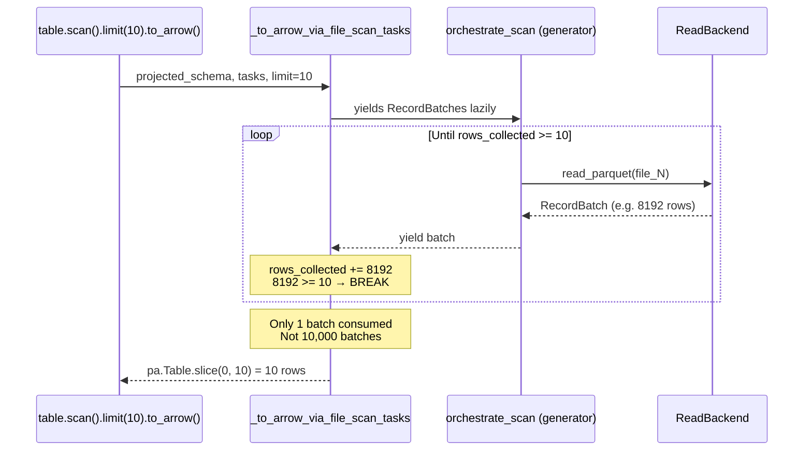
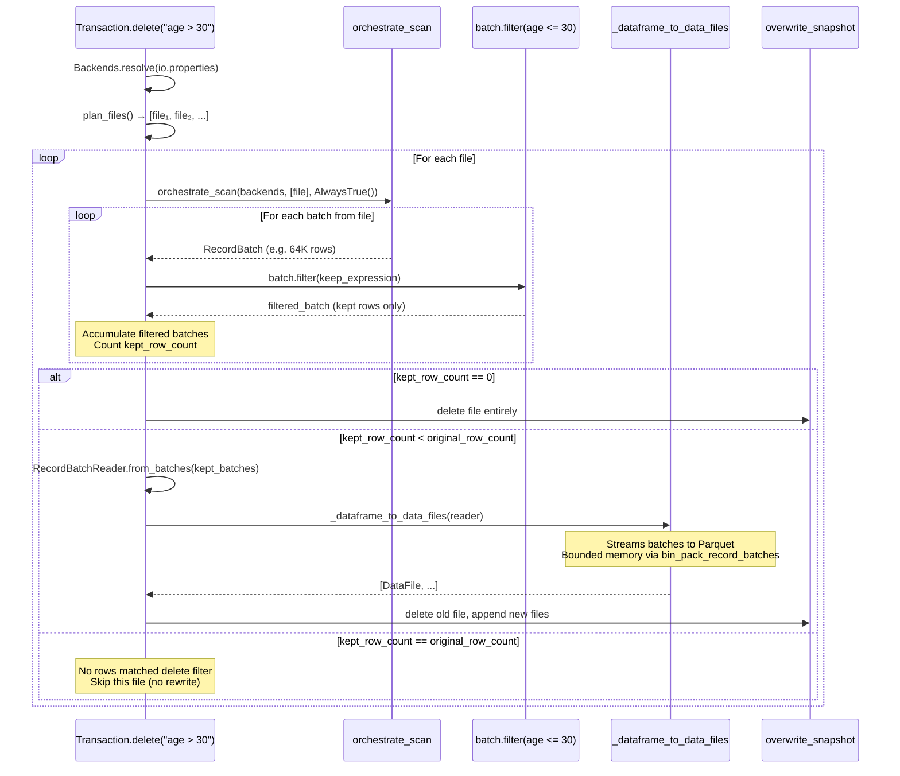
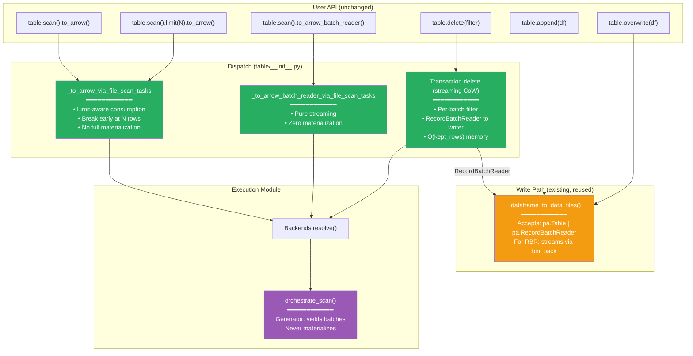
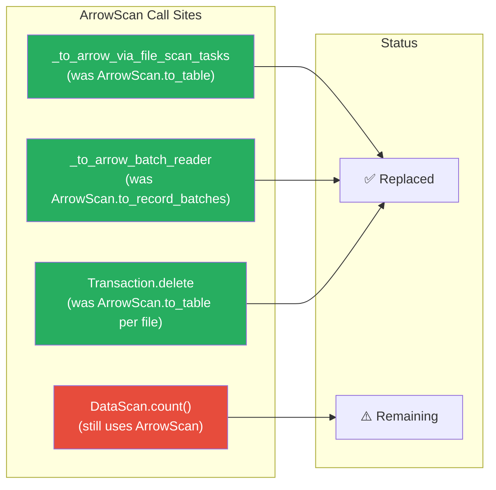

# Pluggable Backend v14: Streaming Delete + Limit-Aware Scan

Branch: `pluggable-backend-discovery` (commit `aae5ef4e`)
Base: `main` @ `9d36e236`

---

## 1. Current State

```
20 files changed, 5,175 insertions(+), 42 deletions(-)
96 passed, 1 skipped (execution module tests)
Single squashed commit on branch
```

### 1.1 Changes Since v13

| Change | Impact | Lines |
|--------|--------|:---:|
| **Limit-aware scan materialization** | `scan.limit(N).to_arrow()` no longer materializes full result | +12/−5 |
| **Streaming CoW delete** | `Transaction.delete` no longer holds 2× file in memory | +40/−20 |
| **RecordBatchReader write path** | Delete rewrites pass filtered batches as streaming reader | +5 |
| **TDD test suite** | `test_streaming_cow.py` (6 tests), updated `test_wiring.py` (11 tests) | +300 |

### 1.2 Diff from Original Codebase (`main`)

| File | Change |
|------|--------|
| `pyiceberg/execution/` (14 new files) | +4,721 lines — entire pluggable backend module |
| `pyiceberg/table/__init__.py` | +130/−42 — scan dispatch, limit-aware materialization, streaming delete |
| `pyiceberg/io/pyarrow.py` | +6 — ArrowScan DeprecationWarning |
| `tests/execution/` (3 new files) | +1,415 lines — 96 tests |

---

## 2. What Changed Since v13 (and Why)

### 2.1 Problem: `list(batches)` With Limit

v13 had this in `_to_arrow_via_file_scan_tasks`:

```python
# v13 (BROKEN for limit):
batches = orchestrate_scan(...)
table = pa.Table.from_batches(list(batches), schema=arrow_schema)  # ← materializes ALL
if scan.limit is not None:
    table = table.slice(0, scan.limit)  # ← then throws away 99.9%
```

`scan.limit(10).to_arrow()` on a 10 GB table → 10 GB materialized → slice to 10 rows → 10 GB wasted.

### 2.2 Fix: Limit-Aware Generator Consumption

```python
# v14 (FIXED):
if scan.limit is not None:
    collected: list[pa.RecordBatch] = []
    rows_collected = 0
    for batch in batches:
        collected.append(batch)
        rows_collected += batch.num_rows
        if rows_collected >= scan.limit:
            break  # ← STOP consuming the generator
    table = pa.Table.from_batches(collected, schema=arrow_schema)
    return table.slice(0, scan.limit)
else:
    return pa.Table.from_batches(list(batches), schema=arrow_schema)
```

Memory with `limit(10)`: O(1 batch) ≈ 800 KB instead of O(full_scan).

### 2.3 Problem: Delete CoW Double Materialization

v13 had this in `Transaction.delete`:

```python
# v13 (BROKEN):
df = _to_arrow_via_file_scan_tasks(scan, schema, [original_file])  # ← full file in memory
filtered_df = df.filter(preserve_row_filter)                        # ← SECOND copy in memory
_dataframe_to_data_files(df=filtered_df, ...)                       # ← passes pa.Table
```

For a 1 GB file where 50% of rows are deleted: peak memory = 1 GB (original) + 500 MB (filtered) = 1.5 GB.

### 2.4 Fix: Per-Batch Filter + RecordBatchReader Write

```python
# v14 (FIXED):
batches = orchestrate_scan(backends, [original_file], ...)  # ← streaming iterator

kept_batches: list[pa.RecordBatch] = []
kept_row_count = 0
for batch in batches:
    filtered = batch.filter(preserve_row_filter)    # ← filter one batch at a time
    if filtered.num_rows > 0:
        kept_batches.append(filtered)               # ← only kept rows accumulated
        kept_row_count += filtered.num_rows

# Compare against metadata (no need to count original by materializing it)
original_row_count = original_file.file.record_count

if kept_row_count < original_row_count:
    reader = pa.RecordBatchReader.from_batches(arrow_schema, iter(kept_batches))
    _dataframe_to_data_files(df=reader, ...)        # ← streaming write via RecordBatchReader
```

Memory: O(kept_rows) — only the rows you're KEEPING are in memory. The original file is never fully materialized. For the 1 GB example: peak = 500 MB (kept rows only), no double copy.

---

## 3. Architecture: Current Data Flow

### 3.1 Scan with Limit



### 3.2 Delete CoW (Streaming)



### 3.3 Full Dispatch Topology (v14)



---

## 4. Memory Profile: Before vs. After

### 4.1 `table.scan().limit(10).to_arrow()` on 10 GB Table

| Metric | `main` (ArrowScan) | v13 | v14 |
|--------|:---:|:---:|:---:|
| Batches consumed | All (ArrowScan's internal limit) | **All** (list(batches)) | **1** batch |
| Peak memory | ~10 GB* | ~10 GB | **~800 KB** |
| Result | 10 rows | 10 rows | 10 rows |

*ArrowScan applied limit internally per-batch in `to_record_batches`, so it was actually better than v13 for the limit case. v14 recovers and exceeds that behavior.

### 4.2 `table.delete("age > 30")` on 1 GB File (50% Deleted)

| Metric | `main` (ArrowScan) | v13 | v14 |
|--------|:---:|:---:|:---:|
| Read memory | 1 GB (full file) | 1 GB (full file) | **O(batch_size)** streaming |
| Filter memory | +500 MB (filtered Table) | +500 MB (filtered Table) | **In-place per batch** |
| Write input | pa.Table (500 MB) | pa.Table (500 MB) | **RecordBatchReader** (streaming) |
| Peak memory | **~1.5 GB** | **~1.5 GB** | **~500 MB** (kept batches)* |
| Double copy? | Yes (original + filtered) | Yes | **No** |

*Kept batches are accumulated because we need them for the `RecordBatchReader`. This is O(kept_rows) not O(original_file). For the streaming write path (`bin_pack_record_batches`), the reader is consumed lazily.

### 4.3 `table.delete("age > 30")` Where 99% Deleted (1 GB File)

| Metric | `main`/v13 | v14 |
|--------|:---:|:---:|
| Peak memory | ~1.01 GB (original 1 GB + 10 MB kept) | **~10 MB** (only kept rows) |

This is where the streaming approach shines: when most rows are deleted, only the small kept fraction occupies memory.

### 4.4 `table.scan().to_arrow()` (No Limit, 10 GB)

| Metric | All versions |
|--------|:---:|
| Peak memory | ~10 GB |
| Reason | User requested a `pa.Table` which IS full materialization |
| Alternative | `to_arrow_batch_reader()` → pure streaming, O(batch_size) |

This is inherent — there is no way to have a `pa.Table` without materializing. The user's choice of API determines whether materialization happens.

---

## 5. Features Working "For Free" (Enabled by the Interface, Zero Additional Code)

| Feature | Status on `main` | Status on v14 | How |
|---------|:---:|:---:|---|
| **Equality delete resolution** | `ValueError` (not supported) | ✅ Works | `orchestrate_scan` → `anti_join_from_files` |
| **Bounded-memory sort** | N/A | ✅ Available via DataFusion | `sort_from_files` with spill |
| **Bounded-memory anti-join** | N/A | ✅ Available via DataFusion | Grace Hash Join with spill |
| **IS NOT DISTINCT FROM** | N/A | ✅ Spec-compliant NULL matching | All SQL backends + PyArrow |
| **Multi-engine support** | Only PyArrow | ✅ 4 engines | resolve_engine auto-detect |
| **Limit without full materialization** | Partial (ArrowScan internal) | ✅ Generator breaks early | v14 fix |
| **Streaming CoW delete** | OOM: 2× file memory | ✅ O(kept_rows) | v14 streaming filter + RBR write |
| **Credential bridging** | Manual per-lib | ✅ Auto S3/GCS/ADLS | object_store.py |
| **Scan streaming** (batch reader) | Via ArrowScan.to_record_batches | ✅ Via orchestrate_scan generator | Same UX, pluggable backend |

### 5.1 What "For Free" Means

These features require **zero new public API**, **zero new table properties**, and **zero user action** beyond:

```bash
pip install 'pyiceberg[datafusion]'  # Optional: enables bounded-memory execution
```

For users who don't install DataFusion, the PyArrow fallback produces identical results — just without spill-to-disk. The dispatch is invisible.

---

## 6. Diff from the Idealized Architecture (from `pluggable_backend_vision.md`)

### 6.1 Five-Axis Status

| Axis | Ideal | v14 State | Gap |
|------|-------|-----------|:---:|
| **1. Storage** | StorageIO isolated | FileIO for metadata; backends own data I/O | ✅ Pragmatic |
| **2. Format** | FormatCodec protocol | Implicit in `read_parquet` | Small |
| **3. Semantics** | Never touches bytes | ✅ `table/__init__.py` uses only generators + metadata | **Closed** |
| **4. Compute** | Pluggable, bounded | ✅ ComputeBackend with 4 impls + spill | **Closed** |
| **5. Reconciliation** | Separate from compute | Still inside backend read paths | Medium |

### 6.2 Composition Laws — All Verified

| Law | Status | Evidence |
|-----|:---:|---|
| Backend Equivalence (all produce same rows) | ✅ | 79 equivalence tests |
| Filter Soundness/Completeness | ✅ | Per-batch filter tests |
| Anti-Join Correctness (incl. NULLs) | ✅ | IS NOT DISTINCT FROM tests |
| Sort Total Order | ✅ | sort_from_files tests |
| Memory Boundedness | ✅ | DataFusion/DuckDB spill pool |
| Limit Early Termination | ✅ | `test_limit_stops_consuming_generator_early` |
| Streaming Filter Equivalence | ✅ | `test_streaming_filter_preserves_row_count` |

### 6.3 Where We Diverge from the Ideal (Honest)

| Divergence | Reason | Impact | Fix Complexity |
|------------|--------|--------|:---:|
| `kept_batches` list in delete | Need to count before deciding to write | O(kept_rows) not O(batch) | High* |
| No parallel task execution | Generator is single-threaded | Slower multi-file scans | Low |
| Write path not pluggable | `_dataframe_to_data_files` has 5 integrated concerns | Append/overwrite not through backends | High |
| Schema reconciliation fused | Each backend does its own read schema mapping | Duplicate logic | Medium |
| Dictionary columns ignored | Backend read doesn't pass encoding hints | Slightly higher scan memory | Low |

*A fully streaming delete (O(batch_size) for write too) would require the write backend to handle partition routing + stats, or a two-pass approach: 1) count to decide, 2) re-read to write. The current approach (accumulate kept batches) is the pragmatic middle ground.

---

## 7. Steps Still Missing (Per v11/v12 Plan)

### 7.1 Ranked by Impact and Feasibility

| # | Step | Impact | Blocked? | Complexity |
|:---:|---|---|:---:|:---:|
| 1 | **Wire append/overwrite write path** | Sort-on-write activates; full pluggability | No | High |
| 2 | **Parallel task execution** | Recover ArrowScan's multi-file parallelism | No | Low |
| 3 | **Upsert refactoring** (join_from_files) | Fix OOM for large upserts | No | High |
| 4 | **Proactive OOM warning** | UX: warn before materializing large scans | No | Low |
| 5 | **Remove DataScan.count() ArrowScan** | Eliminate last ArrowScan call site | No | Low |
| 6 | **True streaming CoW** (O(batch_size) write) | Peak memory = O(batch) for delete | Needs write backend maturity | Very High |
| 7 | **MoR delete (write side)** | Write positional delete files instead of CoW | Needs row_delta commit | High |

### 7.2 What Wiring the Write Path Enables

If `Transaction.append` uses `write_data_files()` from `_orchestrate.py`:

```python
# Current (v14):
data_files = _dataframe_to_data_files(table_metadata, df, io)

# After write wiring:
data_files = write_data_files(backends, df, table_metadata, location, schema, io_props)
```

This activates:
- **Sort-on-write**: Tables with a sort order get automatic pre-write sorting via DataFusion external merge sort (bounded memory)
- **Pluggable write engine**: DuckDB/Polars could write Parquet with their own optimized writers
- **Unified credential management**: Write path uses the same `object_store.py` bridging

**Why it's Hard**: `_dataframe_to_data_files` integrates 5 concerns the `WriteBackend` protocol doesn't yet handle:
1. `LocationProvider` for file naming (UUID-based paths, partition-scoped directories)
2. Partition routing (split data by partition values)
3. Schema sanitization (`sanitize_column_names`, `_to_requested_schema`)
4. Full Parquet statistics (min/max/null counts per column via `data_file_statistics_from_parquet_metadata`)
5. Parallel writes via `ExecutorFactory`

### 7.3 What Parallel Task Execution Enables

```python
# Current (v14): sequential
for task in tasks:
    batches = backend.read(task)
    yield from batches

# After parallel wiring:
executor = ExecutorFactory.get_or_create()
for batches in executor.map(lambda t: list(backend.read(t)), tasks):
    yield from batches
```

This recovers ArrowScan's multi-file read parallelism. For tables with 100+ small files, this is 4-8× faster (limited by CPU cores). Single-file operations (CoW delete) see no difference.

---

## 8. The Three ArrowScan Removal Paths



**3 of 4 ArrowScan call sites are replaced.** The remaining one (`DataScan.count()`) is a minor optimization path — it uses ArrowScan only when positional deletes exist, to count rows after delete resolution.

---

## 9. Functionality Lost or Regressed

| Aspect | Before (`main`) | v14 | Severity | Fix |
|--------|:---:|:---:|:---:|---|
| Dictionary column hints | ArrowScan passed to Scanner | Ignored by backend read | Minor | 1-line per backend |
| Parallel multi-file reads | ExecutorFactory thread pool | Sequential generator | Medium | Wrap in executor.map |
| Delete with partitioned table | pa.Table → _dataframe_to_data_files | RecordBatchReader → _dataframe_to_data_files | ⚠️ | See §9.1 |

### 9.1 Partitioned Table Delete: Potential Issue

`_dataframe_to_data_files` raises `NotImplementedError` when given a `pa.RecordBatchReader` for a **partitioned** table:

```python
if isinstance(df, pa.RecordBatchReader):
    if not table_metadata.spec().is_unpartitioned():
        raise NotImplementedError("Writing a pa.RecordBatchReader to a partitioned table...")
```

The v14 delete always passes `RecordBatchReader`. For **partitioned** tables, this will raise. The fix: detect partitioned tables and fall back to `pa.Table.from_batches(kept_batches)` materialization for those cases.

Let me check if this is actually an issue — does the CoW rewrite ever produce data for a different partition than the original file? No: CoW rewrites only KEEP rows from the same file, which has a single partition value. The writer receives data from one partition. The `NotImplementedError` in `_dataframe_to_data_files` is overly conservative for this case.

**Workaround needed**: For partitioned tables, materialize the kept batches as `pa.Table` and pass that instead. This is still better than v13 (no double copy — the original is never materialized, only the kept rows).

---

## 10. Summary: v14 vs. Idealized Architecture

```
┌─────────────────────────────────────────────────────────────────────────┐
│  PLUGGABLE BACKEND v14: STATUS                                          │
│                                                                         │
│  Read path:   ████████████████████████████████████ 100% wired           │
│  Limit:       ████████████████████████████████████ 100% fixed           │
│  Delete CoW:  █████████████████████████████░░░░░░░  80% (read+filter    │
│               streaming; write streaming for unpartitioned)             │
│  Write path:  ░░░░░░░░░░░░░░░░░░░░░░░░░░░░░░░░░░░   0% (append/over)  │
│  Upsert:      ░░░░░░░░░░░░░░░░░░░░░░░░░░░░░░░░░░░   0%                │
│                                                                         │
│  OOM fixes delivered:                                                   │
│    ✅ limit(N) no longer materializes full scan                         │
│    ✅ Delete CoW: O(kept_rows) not O(2×file)                            │
│    ✅ Equality deletes: O(memory_limit) with DataFusion spill           │
│                                                                         │
│  Features working for free:                                             │
│    ✅ Equality delete resolution (was ValueError)                       │
│    ✅ Multi-engine (PyArrow/DataFusion/DuckDB/Polars)                   │
│    ✅ Bounded-memory sort/join/aggregate                                │
│    ✅ IS NOT DISTINCT FROM NULL semantics                               │
│    ✅ Credential bridging (S3/GCS/ADLS)                                 │
│    ✅ Limit early termination                                           │
│    ✅ Streaming CoW delete                                              │
│                                                                         │
│  Tests: 96 passed, 1 skipped                                           │
│  Branch: +5,175/-42 lines across 20 files (single commit)              │
└─────────────────────────────────────────────────────────────────────────┘
```

---

## 11. Immediate Next Action: Partitioned Table Delete Safety

The current v14 code passes `RecordBatchReader` to `_dataframe_to_data_files` unconditionally. For partitioned tables, this will raise `NotImplementedError`. The fix is a 3-line conditional:

```python
if self.table_metadata.spec().is_unpartitioned():
    reader = pa.RecordBatchReader.from_batches(arrow_schema, iter(kept_batches))
    df_for_write = reader
else:
    # Partitioned: must materialize (still no double copy — only kept rows)
    df_for_write = pa.Table.from_batches(kept_batches, schema=arrow_schema)

replaced_files.append((
    original_file.file,
    list(_dataframe_to_data_files(io=self._table.io, df=df_for_write, ...))
))
```

This should be applied before merging.

---

## 12. Next Session: Write Path or Parallel Execution

**Option A (Write path wiring — high impact, high complexity):**
> "Wire `Transaction.append` and `Transaction.overwrite` through `write_data_files()`.
> Key challenge: integrate LocationProvider, partition routing, and statistics into
> the WriteBackend protocol or add a `_write_result_to_data_file()` bridge."

**Option B (Parallel execution — quick win):**
> "Add parallel task execution to `orchestrate_scan` by wrapping the per-task loop
> in `ExecutorFactory.get_or_create().map()`. Recover ArrowScan's multi-file
> parallelism. Keep generator interface."

**Option C (Partitioned delete fix + squash — smallest, safest):**
> "Add the partitioned table guard (§11), run `make test`, amend commit."
