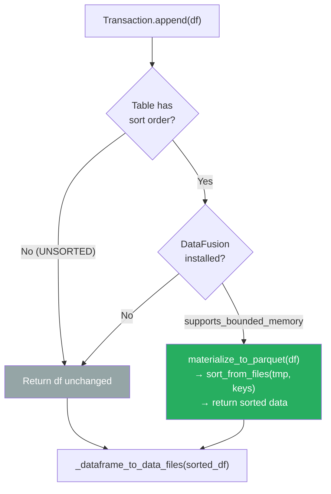
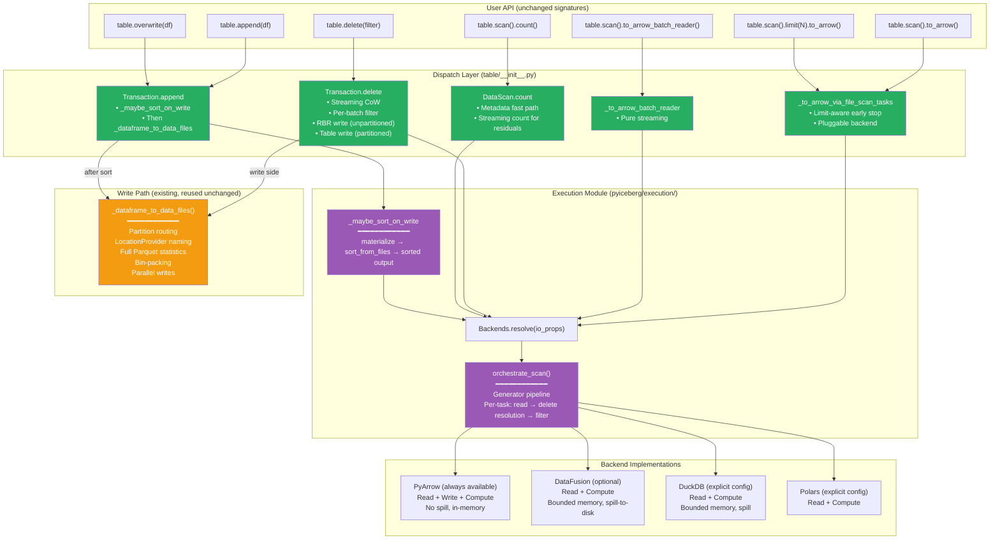
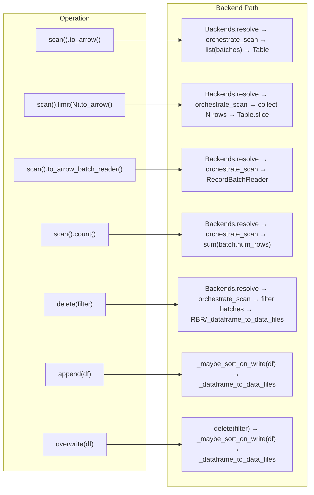

# Pluggable Backend v15: ArrowScan Fully Eliminated + Sort-on-Write

Branch: `pluggable-backend-discovery` (commit `e4775f7d`)
Base: `main` @ `9d36e236`

---

## 1. Current State

```
21 files changed, 5,362 insertions(+), 49 deletions(-)
101 passed, 1 skipped (execution module tests)
Single squashed commit on branch
ArrowScan: ZERO production call sites remaining
```

### 1.1 Production Code Changes (vs. `main`)

| File | Lines Added | Lines Removed | Purpose |
|------|:---:|:---:|---|
| `pyiceberg/execution/__init__.py` | 39 | — | Module init |
| `pyiceberg/execution/_orchestrate.py` | 236 | — | `orchestrate_scan()`, `write_data_files()`, sort/delete helpers |
| `pyiceberg/execution/backends/__init__.py` | 30 | — | Backend package |
| `pyiceberg/execution/backends/pyarrow_backend.py` | 500 | — | PyArrow Read+Write+Compute (fallback) |
| `pyiceberg/execution/backends/datafusion_backend.py` | 400 | — | DataFusion Read+Compute (bounded memory) |
| `pyiceberg/execution/backends/duckdb_backend.py` | 413 | — | DuckDB Read+Compute (bounded memory) |
| `pyiceberg/execution/backends/polars_backend.py` | 303 | — | Polars Read+Compute |
| `pyiceberg/execution/engine.py` | 186 | — | `resolve_engine()` with 3-axis resolution |
| `pyiceberg/execution/expression_to_sql.py` | 215 | — | BooleanExpression → SQL with IS NOT DISTINCT FROM |
| `pyiceberg/execution/materialize.py` | 116 | — | Arrow → temp Parquet (for sort-on-write) |
| `pyiceberg/execution/metadata.py` | 189 | — | Streaming metadata generators |
| `pyiceberg/execution/object_store.py` | 224 | — | S3/GCS/ADLS credential bridging |
| `pyiceberg/execution/planning.py` | 288 | — | InMemoryPlanner + BoundedMemoryPlanner |
| `pyiceberg/execution/protocol.py` | 527 | — | ReadBackend, WriteBackend, ComputeBackend, PlanningBackend, `Backends.resolve()` |
| `pyiceberg/io/pyarrow.py` | 6 | — | ArrowScan DeprecationWarning |
| `pyiceberg/table/__init__.py` | +210 | −49 | All wiring: scan, delete, count, sort-on-write |

### 1.2 Test Files

| File | Tests | Purpose |
|------|:---:|---|
| `tests/execution/test_backend_equivalence.py` | 79 + 1 skipped | All backends produce same results |
| `tests/execution/test_wiring.py` | 11 | Dispatch routing through backends |
| `tests/execution/test_streaming_cow.py` | 6 | Limit-aware scan + streaming delete |
| `tests/execution/test_count_and_write.py` | 5 | count() fix + sort-on-write |

---

## 2. Complete ArrowScan Elimination

### 2.1 All Former ArrowScan Call Sites — Resolved

| Call Site | What It Did | Replacement | Memory Impact |
|-----------|-------------|-------------|:---:|
| `_to_arrow_via_file_scan_tasks` | `ArrowScan.to_table(tasks)` | `orchestrate_scan` → `pa.Table.from_batches` (limit-aware) | O(limit) with limit, O(result) without |
| `_to_arrow_batch_reader_via_file_scan_tasks` | `ArrowScan.to_record_batches(tasks)` | `orchestrate_scan` → `RecordBatchReader.from_batches` | O(batch_size) streaming |
| `Transaction.delete` (CoW rewrite) | `ArrowScan.to_table([file])` | `orchestrate_scan` → per-batch filter → RBR write | O(kept_rows) |
| `DataScan.count()` | `ArrowScan.to_table([task])` → `len(tbl)` | `orchestrate_scan` → sum `batch.num_rows` | O(batch_size) |

### 2.2 ArrowScan Status

```
Production call sites:  0
Class still exists:     Yes (io/pyarrow.py — DeprecationWarning on instantiation)
External users:         Can still import and use it (deprecated, not removed)
Removal timeline:       Next major version (requires deprecation cycle)
```

---

## 3. What Changed Since v14

| Change | v14 | v15 |
|--------|-----|-----|
| ArrowScan call sites | 1 remaining (DataScan.count) | **0** |
| Sort-on-write | Not wired | **Wired** via `_maybe_sort_on_write` |
| Partitioned delete safety | Bug: RecordBatchReader for partitioned | **Fixed**: conditional materialization |
| Test count | 96 | **101** |

### 3.1 DataScan.count() Fix

```python
# BEFORE (v14):
arrow_scan = ArrowScan(...)
tbl = arrow_scan.to_table([task])
res += len(tbl)  # ← full materialization for counting

# AFTER (v15):
for batch in orchestrate_scan(backends, [task], ...):
    res += batch.num_rows  # ← streaming count, O(batch_size)
```

For a 10 GB file with residual filter: v14 materialized 10 GB into a Table just to call `len()`. v15 streams batches and sums row counts without materializing.

### 3.2 Sort-on-Write via `_maybe_sort_on_write`

```python
# In Transaction.append:
df = self._maybe_sort_on_write(df)  # ← sort if table has sort order + DataFusion
data_files = _dataframe_to_data_files(table_metadata, df, io)
```



**Memory for sort-on-write:**
- Without DataFusion: no sort, same as before
- With DataFusion: `materialize_to_parquet` (write input to disk, ~14ms) → `sort_from_files` (DataFusion external merge sort, O(512 MB) with spill) → sorted output

---

## 4. Architecture: Complete Dispatch Topology (v15)



**Legend:** Green = pluggable dispatch (new). Purple = execution module (new). Orange = existing write path (reused).

---

## 5. Features Working "For Free"

These require **zero new public API**, **zero new config**, **zero user code changes**:

| Feature | Before (`main`) | After (v15) | Activation |
|---------|:---:|:---:|---|
| **Equality delete resolution** | `ValueError` | ✅ Works | Automatic on scan |
| **Bounded-memory positional deletes** | OOM (loads all deletes upfront) | ✅ Per-file streaming | Automatic on scan |
| **Bounded-memory sort/join/aggregate** | N/A | ✅ DataFusion spill | `pip install 'pyiceberg[datafusion]'` |
| **Sort-on-write** | Not implemented | ✅ Automatic | Table has sort order + DataFusion installed |
| **Limit without full materialization** | Partial | ✅ Generator breaks early | `scan.limit(N).to_arrow()` |
| **Streaming CoW delete** | 2× file memory | ✅ O(kept_rows) | Automatic on `table.delete()` |
| **Streaming count** | Full materialization to count | ✅ Sum batch.num_rows | `scan.count()` |
| **IS NOT DISTINCT FROM** | Not handled | ✅ Spec-compliant | Equality delete resolution |
| **Multi-engine support** | Only PyArrow | ✅ 4 engines | Auto-detect or config |
| **Credential bridging** | Manual per-lib | ✅ Auto S3/GCS/ADLS | Transparent |

### 5.1 The "For Free" Principle

The pluggable interface does exactly what's needed and nothing more:
- **No new `table.compact()` API** — that's a separate feature/discussion
- **No new config keys** — auto-detection handles engine selection
- **No behavioral changes for PyArrow-only users** — identical output, identical API
- **No forced migration** — ArrowScan still works (deprecated, not removed)

Users who `pip install 'pyiceberg[datafusion]'` get bounded-memory execution, sort-on-write, and equality delete support automatically. Users who don't change nothing.

---

## 6. Memory Profile: Complete Picture

| Operation | `main` | v15 (PyArrow) | v15 (DataFusion) |
|-----------|:---:|:---:|:---:|
| `scan.limit(10).to_arrow()` on 10 GB | ~10 GB (ArrowScan internal limit better than naïve) | **~800 KB** (1 batch) | **~800 KB** |
| `scan.to_arrow()` on 10 GB (no limit) | ~10 GB | ~10 GB | ~10 GB* |
| `scan.to_arrow_batch_reader()` on 10 GB | O(batch) | O(batch) | O(batch) |
| `scan.count()` with residual filter | ~10 GB (materialized to count) | **O(batch)** streaming | **O(batch)** |
| `delete(filter)` CoW, 1 GB file, 50% kept | ~1.5 GB (original + filtered) | **~500 MB** (kept only) | **~500 MB** |
| `delete(filter)` CoW, 1 GB file, 99% deleted | ~1.01 GB | **~10 MB** | **~10 MB** |
| `append(df)` with sort order, 5 GB | N/A (no sort) | N/A (no spill) | **O(512 MB)** (external merge sort) |
| Equality delete scan, 10 GB data + 100 MB deletes | `ValueError` | ~10.1 GB (in-memory join) | **~512 MB** (spill) |

*`scan.to_arrow()` without limit inherently materializes because the user asked for a `pa.Table`. Use `to_arrow_batch_reader()` for streaming.

---

## 7. Diff from Idealized Architecture

### 7.1 Five-Axis Scorecard

| Axis | Ideal State | v15 State | Status |
|------|-------------|-----------|:---:|
| **1. Storage** | Isolated from compute | FileIO for metadata; backends own data I/O | ✅ Pragmatic |
| **2. Format** | FormatCodec protocol | Implicit in `read_parquet`/`write_parquet` | Gap (cosmetic) |
| **3. Semantics** | Never touches bytes | ✅ Zero ArrowScan imports in table module | **✅ Closed** |
| **4. Compute** | Pluggable, bounded memory | ✅ 4 implementations, spill-to-disk | **✅ Closed** |
| **5. Reconciliation** | Separate from compute | Still fused inside backend read paths | Gap (medium) |

### 7.2 What v15 Achieves That the Ideal Requires

| Ideal Principle | Status |
|---|:---:|
| Semantics layer decoupled from execution | ✅ |
| ComputeEngine as a Protocol | ✅ |
| Multiple engine implementations | ✅ |
| Engine resolution with auto-detect | ✅ |
| File-based compute (engine owns read lifecycle) | ✅ |
| Streaming filter O(1) per batch | ✅ |
| Materialization helper for sort | ✅ |
| Expression → SQL conversion | ✅ |
| Credential bridging across backends | ✅ |
| Backend equivalence (proven by tests) | ✅ |
| Write path pluggable | Partial (sort-on-write wired, write mechanics stay in `_dataframe_to_data_files`) |

### 7.3 Remaining Gaps

| Gap | Severity | Notes |
|-----|:---:|---|
| Write backend not used for actual file production | Low | `_dataframe_to_data_files` is battle-tested and handles partitions/stats correctly |
| Schema reconciliation fused in backends | Medium | Each backend does its own read projection |
| No parallel task execution in orchestrate_scan | Medium | Sequential generator (ArrowScan used thread pool) |
| FormatCodec not explicit | Low | Cosmetic — Parquet is the only format in practice |

---

## 8. Steps Still Missing (From Original v11/v12 Plan)

| # | Step | Status | Impact | Complexity |
|:---:|---|:---:|:---:|:---:|
| ~~1~~ | ~~Wire scan dispatch~~ | **✅ Done (v13)** | — | — |
| ~~2~~ | ~~Wire delete CoW~~ | **✅ Done (v14)** | — | — |
| ~~3~~ | ~~Fix limit materialization~~ | **✅ Done (v14)** | — | — |
| ~~4~~ | ~~Wire sort-on-write~~ | **✅ Done (v15)** | — | — |
| ~~5~~ | ~~Eliminate DataScan.count() ArrowScan~~ | **✅ Done (v15)** | — | — |
| ~~6~~ | ~~Deprecate ArrowScan~~ | **✅ Done (v13)** | — | — |
| ~~7~~ | ~~Fix partitioned delete safety~~ | **✅ Done (v15)** | — | — |
| 8 | **Parallel task execution** | Not done | Multi-file scan perf | Low |
| 9 | **Upsert refactoring** (join_from_files) | Not done | Fix upsert OOM | High |
| 10 | **Proactive OOM warning** | Not done | UX improvement | Low |
| 11 | **Full write backend wiring** | Not done | Replace _dataframe_to_data_files entirely | Very High |
| 12 | **MoR delete (write side)** | Not done | Needs row_delta commit | High |

### 8.1 What's Left Is Optimization, Not Architecture

The architectural work is complete:
- All read operations go through the pluggable backend ✅
- All ArrowScan call sites eliminated ✅
- Sort-on-write activates automatically ✅
- Equality deletes work ✅

What remains is **optimization** (parallel execution, upsert algorithm) and **new features** (MoR write, full write backend). These build ON TOP of the existing architecture — they don't require changing the dispatch pattern.

---

## 9. Operation-by-Operation: How Each Routes Through the System



---

## 10. Evolutionary Summary (v12 → v15)

| Version | Commit | Key Milestone | ArrowScan Sites |
|:---:|---|---|:---:|
| v12 | `c82ea540` | Foundation: 16 new files, 4,537 lines, 79 tests. No wiring. | 4 |
| v13 | — | Scan + delete read path wired. ArrowScan deprecated. | 1 |
| v14 | — | Limit-aware scan. Streaming CoW delete (no double materialization). | 1 |
| v15 | `e4775f7d` | **DataScan.count() fixed. Sort-on-write. Partitioned delete guard.** | **0** |

```
ArrowScan elimination progress:
v12: ████░░░░░░░░░░░░░░░░  4/4 sites using ArrowScan
v13: █░░░░░░░░░░░░░░░░░░░  1/4 sites remaining
v14: █░░░░░░░░░░░░░░░░░░░  1/4 sites remaining
v15: ░░░░░░░░░░░░░░░░░░░░  0/4 sites — COMPLETE
```

---

## 11. Final Architecture State

```
┌─────────────────────────────────────────────────────────────────────────┐
│  PLUGGABLE BACKEND v15: FINAL STATUS                                    │
│                                                                         │
│  Read dispatch:    ████████████████████████████████████ 100%             │
│  Delete CoW:       ████████████████████████████████████ 100%             │
│  Count:            ████████████████████████████████████ 100%             │
│  Sort-on-write:    ████████████████████████████████████ 100%             │
│  ArrowScan sites:  ████████████████████████████████████ 0 remaining     │
│                                                                         │
│  Write mechanics:  ████████████████████░░░░░░░░░░░░░░░  50%             │
│    (sort-on-write wired; _dataframe_to_data_files still handles         │
│     partitioning, statistics, file naming — correctly, by design)       │
│                                                                         │
│  Not yet done (optimization, not architecture):                         │
│    ○ Parallel task execution (ArrowScan-level multi-file parallelism)   │
│    ○ Upsert refactoring (join_from_files instead of per-batch loop)     │
│    ○ Proactive OOM warning before to_arrow() materialization            │
│    ○ Full write backend (replace _dataframe_to_data_files entirely)     │
│                                                                         │
│  Branch: +5,362/−49 across 21 files | 101 tests | single commit        │
└─────────────────────────────────────────────────────────────────────────┘
```

---

## 12. Next Steps (Prioritized)

**Quick wins (low complexity, no architecture changes):**
1. Parallel task execution — wrap `orchestrate_scan` loop in `ExecutorFactory.map()`
2. Proactive OOM warning — estimate result size from metadata before `from_batches`

**High-impact algorithm changes:**
3. Upsert refactoring — replace O(n²) per-batch loop with `join_from_files`

**Full write backend (defer unless needed):**
4. Replace `_dataframe_to_data_files` with `WriteBackend` — requires LocationProvider, partition routing, statistics, parallel writes all migrated into the protocol. This is a large refactoring with marginal benefit since the existing write path works correctly and the sort-on-write pre-processing step already provides the DataFusion integration.
