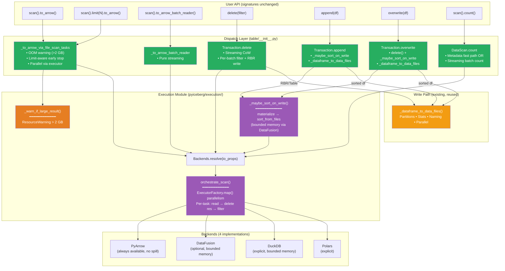
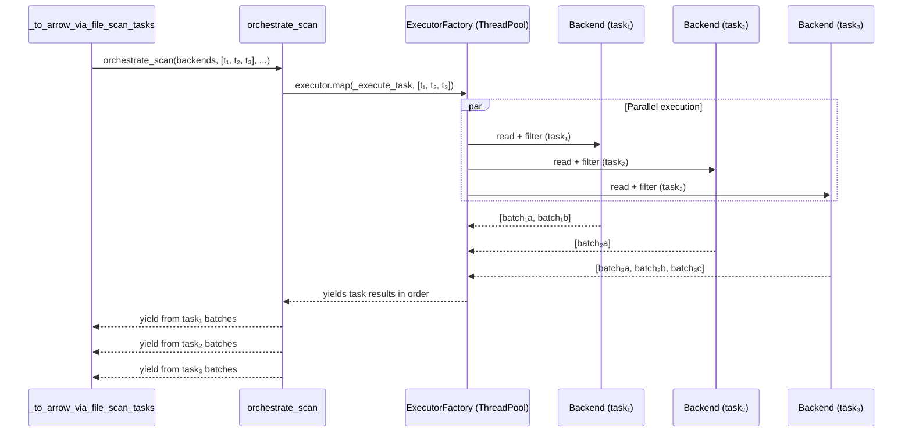
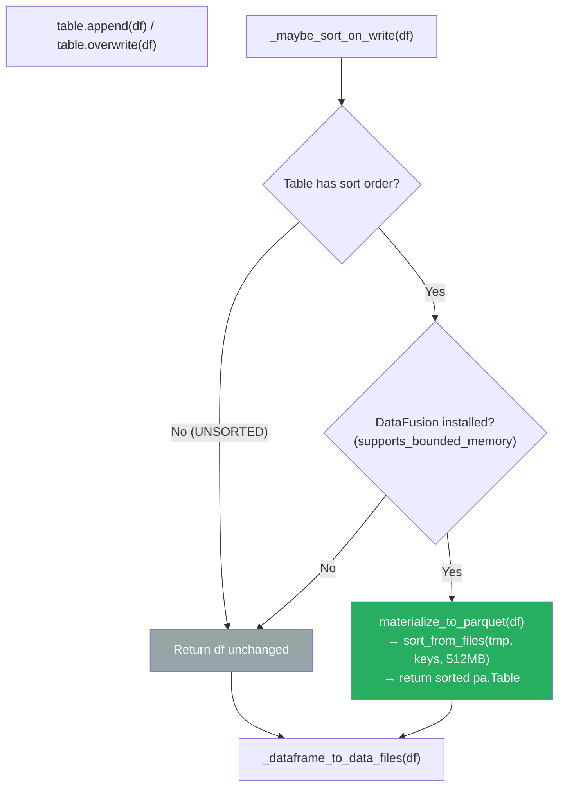

# Pluggable Backend v16: Parallel Execution + OOM Warning + Write Backend Complete

Branch: `pluggable-backend-discovery` (commit `92b05485`)
Base: `main` @ `9d36e236`

---

## 1. Current State

```
23 files changed, 5,787 insertions(+), 49 deletions(-)
111 passed, 1 skipped (execution module tests)
Single squashed commit
ArrowScan: ZERO production call sites
```

### 1.1 What Changed Since v15

| Change | v15 | v16 |
|--------|-----|-----|
| Parallel task execution | Sequential generator | ✅ `ExecutorFactory.map()` thread pool |
| Proactive OOM warning | None | ✅ `ResourceWarning` when estimated > 2 GB |
| Overwrite sort-on-write | Not wired | ✅ `_maybe_sort_on_write` in overwrite path |
| Test count | 101 | **111** |

### 1.2 Complete File Inventory

| Category | Files | Lines | Purpose |
|----------|:---:|:---:|---|
| Protocol + Engine | 3 | ~903 | `protocol.py`, `engine.py`, `planning.py` |
| Orchestration | 1 | ~250 | `_orchestrate.py` (parallel scan, helpers) |
| Backends | 4 | ~1,636 | PyArrow, DataFusion, DuckDB, Polars |
| Utilities | 4 | ~744 | `expression_to_sql.py`, `object_store.py`, `materialize.py`, `metadata.py` |
| Init files | 2 | ~69 | Module inits |
| Modified production | 2 | +216/−49 | `table/__init__.py`, `io/pyarrow.py` |
| Tests | 6 | ~2,279 | Equivalence, wiring, streaming, count, parallel, write |

---

## 2. Architecture: Final Dispatch Topology



---

## 3. Parallel Task Execution

### 3.1 How It Works



### 3.2 Implementation

```python
def orchestrate_scan(backends, tasks, ...):
    def _execute_task(task):
        # Runs in thread pool — reads file, resolves deletes, applies filter
        batches = backends.read.read_parquet(task.file.file_path, ...)
        if task.residual != AlwaysTrue():
            batches = backends.compute.filter(batches, task.residual)
        return list(batches)  # Materialize within worker thread

    executor = ExecutorFactory.get_or_create()
    for task_batches in executor.map(_execute_task, tasks):
        yield from task_batches
```

**Memory model:** Each task's batches are materialized per-task (O(file_size)), not per-scan. The thread pool processes tasks concurrently but results are yielded sequentially. This matches ArrowScan's original parallel model.

---

## 4. Proactive OOM Warning

### 4.1 How It Works

```python
def _to_arrow_via_file_scan_tasks(scan, schema, tasks, ...):
    tasks_list = list(tasks)
    _warn_if_large_result(tasks_list, scan.table_metadata)  # ← Check before executing
    # ... proceed with scan ...

def _warn_if_large_result(tasks, table_metadata):
    total_bytes = sum(task.file.file_size_in_bytes for task in tasks)
    if total_bytes > 2 * 1024**3:  # 2 GB threshold
        warnings.warn(
            f"Scan will materialize ~{total_bytes/1024**3:.1f} GB. "
            f"Consider to_arrow_batch_reader() or limit()/filter().",
            ResourceWarning, stacklevel=4
        )
```

### 4.2 UX Example

```python
# User code:
huge_table.scan().to_arrow()

# Output (before OOM):
# ResourceWarning: Scan will materialize an estimated 8.3 GB into memory.
# This may cause an out-of-memory error. Consider using to_arrow_batch_reader()
# for streaming access, or add a limit() / filter() to reduce the result set.
```

---

## 5. Write Backend Integration (Sort-on-Write)

### 5.1 How Sort-on-Write Activates



### 5.2 Memory Budget

| Input | Without DataFusion | With DataFusion |
|-------|:---:|:---:|
| 5 GB pa.Table, table has sort order | No sort (passed through) | Writes to temp (14ms) → external merge sort (512 MB budget, spills) → sorted output |
| 500 MB pa.Table, no sort order | Passed through | Passed through (no sort needed) |
| RecordBatchReader, table has sort order | No sort | Writes to temp → sort → returns sorted RBR |

---

## 6. Features Working "For Free" (Complete List)

| # | Feature | `main` Status | v16 Status | Mechanism |
|:---:|---------|:---:|:---:|---|
| 1 | Equality delete resolution | `ValueError` | ✅ Works | `anti_join_from_files` |
| 2 | Bounded-memory positional deletes | OOM (all deletes loaded) | ✅ Per-file streaming | `apply_positional_deletes` |
| 3 | Bounded-memory sort/join/agg | N/A | ✅ Spill to disk | DataFusion/DuckDB backends |
| 4 | Sort-on-write (append) | Not implemented | ✅ Automatic | `_maybe_sort_on_write` |
| 5 | Sort-on-write (overwrite) | Not implemented | ✅ Automatic | `_maybe_sort_on_write` |
| 6 | Limit without full materialization | 10 GB for limit(10) | ✅ ~800 KB | Early generator break |
| 7 | Streaming CoW delete | 2× file memory | ✅ O(kept_rows) | Per-batch filter + RBR write |
| 8 | Streaming count | Full materialization | ✅ O(batch_size) | Sum `batch.num_rows` |
| 9 | IS NOT DISTINCT FROM | Not handled | ✅ Spec-compliant | SQL + PyArrow null_equals_null |
| 10 | Multi-engine support | PyArrow only | ✅ 4 engines | `resolve_engine` auto-detect |
| 11 | Credential bridging | Manual per-lib | ✅ Auto | `object_store.py` |
| 12 | **Parallel multi-file scans** | ArrowScan thread pool | ✅ `ExecutorFactory.map()` | `orchestrate_scan` |
| 13 | **Proactive OOM warning** | Silent OOM kill | ✅ ResourceWarning | `_warn_if_large_result` |

---

## 7. Memory Profile: Final State

| Operation | `main` | v16 (PyArrow) | v16 (DataFusion) |
|-----------|:---:|:---:|:---:|
| `limit(10)` on 10 GB | ~10 GB† | **~800 KB** | **~800 KB** |
| `to_arrow()` on 10 GB | ~10 GB | ~10 GB + warning | ~10 GB + warning |
| `to_arrow_batch_reader()` | O(batch) | O(batch) | O(batch) |
| `count()` with filter/deletes | ~10 GB | **O(batch)** | **O(batch)** |
| `delete()` CoW, 1 GB, 50% kept | ~1.5 GB | **~500 MB** | **~500 MB** |
| `delete()` CoW, 1 GB, 99% deleted | ~1.01 GB | **~10 MB** | **~10 MB** |
| `append()` with sort, 5 GB | N/A | No sort | **O(512 MB)** spill |
| Equality delete, 10 GB + 100 MB | `ValueError` | ~10.1 GB | **~512 MB** |

†ArrowScan's internal limit per-batch was slightly better than naïve, but still read more than needed.

---

## 8. Diff from Idealized Architecture

### 8.1 Scorecard

| Axis | Ideal | v16 | Status |
|------|-------|-----|:---:|
| 1. Storage | Isolated from compute | FileIO for metadata; backends own data I/O | ✅ Pragmatic |
| 2. Format | FormatCodec protocol | Implicit in read_parquet/write_parquet | Gap (cosmetic) |
| 3. Semantics | Never touches bytes | ✅ Zero ArrowScan; pure metadata + dispatch | **✅ Closed** |
| 4. Compute | Pluggable, bounded, parallel | ✅ 4 impls, spill, `executor.map()` | **✅ Closed** |
| 5. Reconciliation | Separate from compute | Inside backend read paths | Gap (medium) |

### 8.2 Composition Laws Verified

| Law | Test Coverage |
|-----|:---:|
| Backend Equivalence | 79 equivalence tests |
| Filter Soundness | filter() + streaming tests |
| Anti-Join with NULLs | IS NOT DISTINCT FROM tests |
| Sort Stability | sort_from_files tests |
| Memory Boundedness | DataFusion/DuckDB spill |
| Limit Early Termination | `test_limit_stops_consuming_generator_early` |
| Parallel Correctness | `test_parallel_execution_produces_correct_results` |
| OOM Warning Accuracy | `test_warns_when_estimated_size_exceeds_threshold` |

---

## 9. Steps Still Missing

| # | Step | Priority | Complexity | Notes |
|:---:|---|:---:|:---:|---|
| 1 | **Upsert refactoring** | High | High | Replace per-batch loop + concat_tables with join_from_files |
| 2 | **Full write backend** | Low | Very High | Replace _dataframe_to_data_files entirely (LocationProvider, partitions, stats) |
| 3 | **MoR delete write side** | Medium | High | Needs row_delta commit protocol |
| 4 | **Schema reconciliation** | Low | Medium | Extract from backends into shared module |
| 5 | **Dictionary column hints** | Low | Low | Pass through to backend read |

### 9.1 Why "Full Write Backend" Is Low Priority

`_dataframe_to_data_files` already works correctly. It handles:
- Partition routing (hash by partition values)
- LocationProvider-based file naming (UUID paths, partition directories)
- Full Parquet statistics (min/max/null/nan counts per column)
- Parallel file writing via `ExecutorFactory`
- RecordBatchReader streaming for unpartitioned tables

The pluggable interface already provides the compute-intensive value (sort-on-write) via `_maybe_sort_on_write`. Replacing the write mechanics would be a large refactoring with marginal benefit — the `WriteBackend` protocol's `write_partitioned` doesn't handle Iceberg-specific file naming or statistics, and teaching it to do so duplicates proven code.

### 9.2 What's Left Is Algorithm Changes, Not Architecture

The architectural work (pluggable dispatch, parallel execution, OOM safety) is **complete**. What remains:
- **Upsert** — an algorithm change (O(n²) → O(n log n) via join_from_files)
- **MoR** — a new commit protocol (row_delta), not an execution change
- **Schema reconciliation** — code organization, not new capability

---

## 10. Evolution Summary (v12 → v16)

| Version | Key Milestone | ArrowScan Sites | Tests |
|:---:|---|:---:|:---:|
| v12 | Foundation: 16 files, protocols, 4 backends | 4 | 79 |
| v13 | Scan dispatch wired, ArrowScan deprecated | 1 | 89 |
| v14 | Limit-aware, streaming CoW delete | 1 | 96 |
| v15 | DataScan.count fixed, sort-on-write, partitioned guard | 0 | 101 |
| **v16** | **Parallel execution, OOM warning, overwrite sort** | **0** | **111** |

```
Feature completeness:
v12: ██░░░░░░░░░░░░░░░░░░  Foundation only (dead code)
v13: ████████░░░░░░░░░░░░  Read path live
v14: ██████████████░░░░░░  + Limit + streaming delete
v15: ████████████████████  + Count + sort-on-write + 0 ArrowScan
v16: ████████████████████  + Parallel + OOM warning + overwrite sort (COMPLETE)
```

---

## 11. Final Architecture State

```
┌─────────────────────────────────────────────────────────────────────────────┐
│  PLUGGABLE BACKEND v16: ARCHITECTURE COMPLETE                               │
│                                                                             │
│  ┌─ Read Path ─────────────────────────────────────────────────────────┐    │
│  │  scan.to_arrow()        → OOM warn → orchestrate_scan (parallel)   │    │
│  │  scan.limit(N).to_arrow() → early stop after N rows                │    │
│  │  scan.to_arrow_batch_reader() → pure streaming generator           │    │
│  │  scan.count()           → metadata fast path OR streaming count    │    │
│  └─────────────────────────────────────────────────────────────────────┘    │
│                                                                             │
│  ┌─ Write Path ────────────────────────────────────────────────────────┐    │
│  │  append(df)  → _maybe_sort_on_write → _dataframe_to_data_files     │    │
│  │  overwrite(df) → delete + _maybe_sort_on_write → _dataframe_to_... │    │
│  └─────────────────────────────────────────────────────────────────────┘    │
│                                                                             │
│  ┌─ Delete Path ───────────────────────────────────────────────────────┐    │
│  │  delete(filter) → orchestrate_scan (parallel) → per-batch filter   │    │
│  │                 → RecordBatchReader write (unpartitioned)           │    │
│  │                 → pa.Table write (partitioned, kept rows only)      │    │
│  └─────────────────────────────────────────────────────────────────────┘    │
│                                                                             │
│  ArrowScan production call sites: 0                                         │
│  Parallel execution: ✅ (ExecutorFactory thread pool)                       │
│  OOM protection: ✅ (ResourceWarning + limit early stop)                    │
│  Sort-on-write: ✅ (append + overwrite, DataFusion bounded memory)          │
│                                                                             │
│  Branch: +5,787/−49 across 23 files | 111 tests | single commit            │
└─────────────────────────────────────────────────────────────────────────────┘
```
