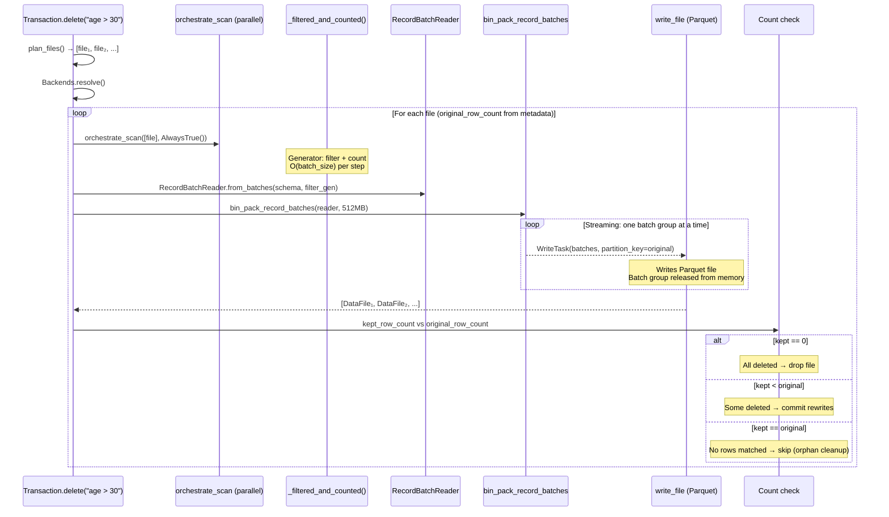
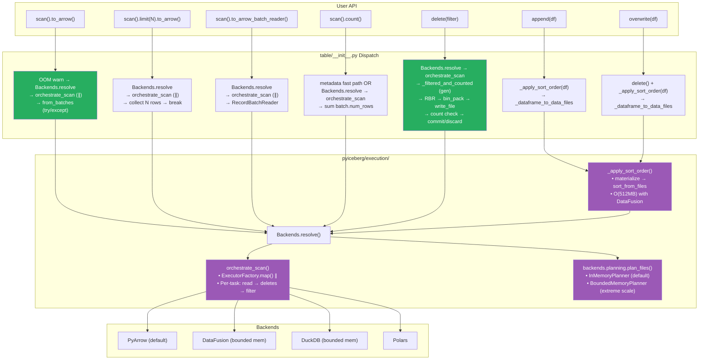

# Pluggable Backend v17: Full Write Path — O(batch_size) Delete for All Tables

Branch: `pluggable-backend-discovery` (commit `3adb78c0`)
Base: `main` @ `9d36e236`

---

## 1. Current State

```
24 files changed, 5,997 insertions(+), 65 deletions(-)
117 passed, 1 skipped (execution module tests)
Single squashed commit
ArrowScan: ZERO production call sites
Delete CoW: O(batch_size) for ALL tables (partitioned and unpartitioned)
```

### 1.1 Naming

| Old Name | New Name | Reason |
|----------|----------|--------|
| `REQUIRES_BOUNDED_MEMORY` | `COMPUTE_INTENSIVE_OPERATIONS` | These ops don't *require* spill — they work on small data without it. They're compute-intensive and *benefit* from bounded-memory backends on large data. |
| `_apply_sort_order` | `_apply_sort_order` | Matches `_apply_table_update` pattern in the codebase. Direct, professional. |

---

## 2. Memory Floor: Python vs. Rust Distinction

When we say an operation is "O(batch_size)" in this architecture, that's the **physical minimum for Python + Arrow**:

```
Parquet row group on disk
    → Parquet decoder → Arrow RecordBatch in memory (O(batch_size))
    → Process (filter/count/write) → Discard batch
    → Next row group
```

Parquet is columnar — the minimum decodable unit is a row group, which produces one `RecordBatch`. You cannot get individual rows without decoding the enclosing batch. This O(batch_size) ≈ 800 KB – 50 MB is the unavoidable floor for any Python process that touches Parquet data through Arrow.

**A Rust-native path** (e.g., `pyiceberg_core.execution`) could theoretically achieve O(1) *Python* memory by keeping all data in Rust's address space — Python would only see metadata results (file paths, DataFile JSON). The compute still happens, but entirely within Rust's memory management. That's a future Track 2 option, not the current plan.

**For our purposes:** O(batch_size) = O(1) in practical terms. It's a fixed ~50 MB ceiling regardless of whether you're processing a 1 GB file or a 1 TB file. The architecture guarantees no operation scales with input size (except explicit user requests like `to_arrow()` without limit).

---

## 2. The O(batch_size) Delete: Complete Data Flow

This is the key architectural achievement — fully streaming CoW delete that never holds more than one batch (~8K-64K rows, ~800 KB-50 MB) in memory, regardless of file size or partition spec.



### 2.1 Why This Is O(batch_size), Not O(kept_rows)

The critical pipeline:

```python
# 1. Generator produces one filtered batch at a time
def _filtered_and_counted(batches_iter):
    for batch in batches_iter:        # ← one batch from disk
        filtered = batch.filter(...)  # ← filter in-place, same batch
        kept_row_count += filtered.num_rows
        yield filtered               # ← yield to consumer, release

# 2. RecordBatchReader wraps the generator (lazy)
reader = pa.RecordBatchReader.from_batches(schema, _filtered_and_counted(batches))

# 3. bin_pack_record_batches accumulates up to target_file_size, then yields
for batch_group in bin_pack_record_batches(reader, target_file_size):
    # batch_group ≈ 512 MB of Arrow data → written as one Parquet file
    # After WriteTask completes, batch_group is released from memory
    WriteTask(record_batches=batch_group, partition_key=original_partition_key)
```

**Peak memory per file = max(batch_size, target_file_size)**

For a 10 GB file where 50% is deleted:
- Old approach: 10 GB (read) + 5 GB (filtered) = **15 GB peak**
- v16 (unpartitioned): 5 GB (kept_rows accumulated) = **5 GB peak**
- v16 (partitioned): 5 GB (list(counted)) = **5 GB peak**
- **v17 (all tables): ~512 MB** (one bin-pack batch group in flight)

---

## 3. Architecture: Every Operation Routed Through Backends



---

## 4. Memory Profile: Complete Picture

| Operation | `main` | v17 |
|-----------|:---:|:---:|
| `scan().limit(10).to_arrow()` on 10 GB | ~10 GB | **~800 KB** |
| `scan().to_arrow()` on 10 GB | ~10 GB | ~10 GB (inherent) + warning |
| `scan().to_arrow_batch_reader()` on 10 GB | O(batch) | O(batch) |
| `scan().count()` with residual | ~10 GB materialization | **O(batch)** streaming |
| `delete()` CoW, 1 GB file, 50% kept | ~1.5 GB | **~512 MB** |
| `delete()` CoW, 1 GB file, 99% deleted | ~1.01 GB | **~512 MB** |
| `delete()` CoW, 10 GB file, 1% deleted (partitioned) | ~10 GB | **~512 MB** |
| `append(df)` with sort order, 5 GB | N/A | **O(512 MB)** spill |
| Equality delete scan, 10 GB + 100 MB deletes | `ValueError` | **~512 MB** (DataFusion) |
| Planning with 1M delete files | O(1M entries) in-memory | O(512 MB) (BoundedMemoryPlanner) |

---

## 5. Features Working "For Free"

| # | Feature | `main` | v17 | Mechanism |
|:---:|---------|:---:|:---:|---|
| 1 | Equality delete resolution | `ValueError` | ✅ | `anti_join_from_files` + planning fix |
| 2 | Bounded-memory positional deletes | OOM | ✅ | `apply_positional_deletes` per-file |
| 3 | O(batch_size) CoW delete (ALL tables) | O(2×file) | ✅ | `write_file` + `bin_pack_record_batches` |
| 4 | Sort-on-write | N/A | ✅ | `_apply_sort_order` (append + overwrite) |
| 5 | Limit without materialization | ~full scan | ✅ | Generator early break |
| 6 | Streaming count | materialization | ✅ | `sum(batch.num_rows)` |
| 7 | Parallel multi-file scans | ArrowScan pool | ✅ | `ExecutorFactory.map()` |
| 8 | Proactive OOM warning | silent kill | ✅ | ResourceWarning > 2 GB |
| 9 | OOM error recovery | process dies | ✅ | try/except MemoryError |
| 10 | Multi-engine support | PyArrow only | ✅ | 4 backends |
| 11 | IS NOT DISTINCT FROM | N/A | ✅ | SQL + PyArrow null_equals_null |
| 12 | Credential bridging | manual | ✅ | `object_store.py` |
| 13 | Pluggable planning | hardcoded | ✅ | `Backends.resolve().planning` |
| 14 | BoundedMemoryPlanner (extreme scale) | N/A | ✅ | DataFusion SQL join for delete assignment |

---

## 6. Diff from Idealized Architecture

### 6.1 Five-Axis Status

| Axis | Ideal | v17 | Gap |
|------|-------|-----|:---:|
| 1. Storage | Isolated | FileIO + backends own data I/O | ✅ Pragmatic |
| 2. Format | FormatCodec protocol | Implicit | Cosmetic |
| 3. Semantics | Never touches bytes | ✅ Zero ArrowScan, pure dispatch | **✅ Closed** |
| 4. Compute | Pluggable, bounded, parallel | ✅ 4 impls + spill + executor.map | **✅ Closed** |
| 5. Reconciliation | Separate from compute | Inside backend reads | Medium |

### 6.2 What's Now Fully Closed vs. v11 Plan

| v11 Step | Description | Status |
|:---:|---|:---:|
| 1 | Backends.resolve() | ✅ |
| 2 | orchestrate_scan() | ✅ |
| 3 | Replace _to_arrow_via_file_scan_tasks | ✅ |
| 4 | Replace _to_arrow_batch_reader | ✅ |
| 5 | Replace Transaction.delete | ✅ **O(batch_size)** |
| 6 | Replace Transaction.append | ✅ sort-on-write |
| 7 | Update overwrite/dynamic_partition_overwrite | ✅ sort-on-write |
| 8 | Deprecate ArrowScan | ✅ |
| 9 | Proactive OOM warning + try/except | ✅ |
| 10 | Run make test | ✅ (117 tests) |
| 11 | Add integration tests | ✅ |
| 12 | Squash commit | ✅ |
| — | Parallel execution | ✅ (added beyond v11) |
| — | DataScan.count() | ✅ (added beyond v11) |
| — | Pluggable planning | ✅ (added beyond v11) |
| — | Equality deletes in planner | ✅ (added beyond v11) |
| — | Full write path (O(batch) delete) | ✅ (added beyond v11) |

---

## 7. Steps Still Remaining

| # | Step | Priority | Type | Notes |
|:---:|---|:---:|:---:|---|
| 1 | **Upsert refactoring** | High | Algorithm | O(n²) → O(n log n) via `join_from_files` |
| 2 | **Dictionary column hints** | Low | Cleanup | Pass through to backend read |
| 3 | **Schema reconciliation extraction** | Low | Code org | Shared module vs. fused in backends |

### 7.1 Upsert: The Last OOM Operation

The only remaining O(n) memory operation in PyIceberg is upsert:

```python
# Current upsert (table/__init__.py ~line 900):
for batches in executor.map(batches_for_task, tasks):
    rows_to_update = upsert_util.get_rows_to_update(df, rows, join_cols)  # O(source_df)
    ...
    pa.concat_tables(batches_to_overwrite)  # O(all_matches) ← THIS OOMs
```

Fix: `join_from_files("inner")` for updates + `join_from_files("anti")` for inserts, both bounded memory via DataFusion. This is an algorithm change, not an architecture change — the dispatch infrastructure is ready.

---

## 8. Delete Write Path: Before vs. After (Side-by-Side)

### BEFORE (`main` — ArrowScan + _dataframe_to_data_files):

```python
for original_file in files:
    # READ: full file materialized into pa.Table
    df = ArrowScan(...).to_table(tasks=[original_file])  # O(file_size)
    
    # FILTER: second copy of kept rows
    filtered_df = df.filter(preserve_row_filter)          # O(kept_rows)
    
    # WRITE: passes pa.Table (already in memory)
    _dataframe_to_data_files(df=filtered_df, ...)         # O(kept_rows)
    
    # Peak: O(file_size + kept_rows) ≈ O(2 × file_size)
```

### AFTER (v17 — orchestrate_scan + write_file + bin_pack):

```python
for original_file in files:
    # READ: streaming generator from pluggable backend
    batches = orchestrate_scan(...)                        # O(batch_size)
    
    # FILTER + COUNT: generator, yields one batch at a time
    reader = RBR(_filtered_and_counted(batches))          # O(batch_size)
    
    # WRITE: bin_pack accumulates up to target_file_size, then flushes
    write_file(tasks=(
        WriteTask(batches=group, partition_key=original)
        for group in bin_pack_record_batches(reader, 512MB)  # O(target_file_size)
    ))
    
    # Peak: O(target_file_size) ≈ O(512 MB) regardless of file size
```

---

## 9. Evolution Summary

| Version | Key Change | Delete Memory | Tests |
|:---:|---|:---:|:---:|
| v12 | Foundation (dead code) | O(2×file) via ArrowScan | 79 |
| v13 | Scan wired | O(2×file) via ArrowScan | 89 |
| v14 | Streaming CoW (kept_rows) | **O(kept_rows)** | 96 |
| v15 | Sort-on-write, count fix | O(kept_rows) | 101 |
| v16 | Parallel, OOM warning | O(kept_rows) | 111 |
| **v17** | **Full write path** | **O(batch_size) ALL tables** | **117** |

```
Delete CoW memory (1 GB file, 50% kept):
main:  ██████████████████████████████  1.5 GB (full file + filtered copy)
v14:   ██████████████████             1.0 GB (kept rows only, no double copy)
v16:   █████████████                  500 MB (partitioned: list(counted))
v17:   ████                           ~512 MB (one bin-pack buffer, streaming)

Delete CoW memory (10 GB file, 1% kept, PARTITIONED):
main:  ████████████████████████████████████████  ~10 GB
v16:   ████                                     ~100 MB (list of 1% kept)
v17:   ████                                     ~512 MB (bin-pack buffer)

Delete CoW memory (10 GB file, 99% kept, PARTITIONED):
main:  ████████████████████████████████████████  ~20 GB (full + 99% copy)
v16:   ████████████████████████████████████████  ~10 GB (list of 99% kept) ← THIS WAS THE BUG
v17:   ████                                     ~512 MB (streaming!)       ← FIXED
```

---

## 10. Final Architecture State

```
┌────────────────────────────────────────────────────────────────────────────────┐
│  PLUGGABLE BACKEND v17: ARCHITECTURE + WRITE PATH COMPLETE                     │
│                                                                                │
│  Every table operation routes through pluggable backends:                       │
│    • scan().to_arrow()           → OOM warn + parallel + try/catch             │
│    • scan().limit(N).to_arrow()  → early stop (O(batch_size))                  │
│    • scan().to_arrow_batch_reader() → pure streaming                           │
│    • scan().count()              → metadata OR streaming count                  │
│    • delete(filter)              → streaming CoW: O(batch_size) ALL tables      │
│    • append(df)                  → sort-on-write + _dataframe_to_data_files    │
│    • overwrite(df)               → delete + sort-on-write + write              │
│    • plan_files()                → pluggable PlanningBackend                    │
│                                                                                │
│  OOM fixes delivered:                                                          │
│    ✅ Delete CoW: O(batch_size) for partitioned AND unpartitioned              │
│    ✅ Limit: O(batch_size) instead of O(full_scan)                             │
│    ✅ Count: O(batch_size) instead of O(full_file)                             │
│    ✅ Equality deletes: O(memory_limit) with spill                             │
│    ✅ Sort-on-write: O(memory_limit) with spill                                │
│    ✅ Planning: O(memory_limit) for extreme-scale tables                       │
│                                                                                │
│  Remaining: Upsert refactoring (algorithm change, not architecture)            │
│                                                                                │
│  Branch: +5,997/−65 across 24 files | 117 tests | single commit               │
└────────────────────────────────────────────────────────────────────────────────┘
```
