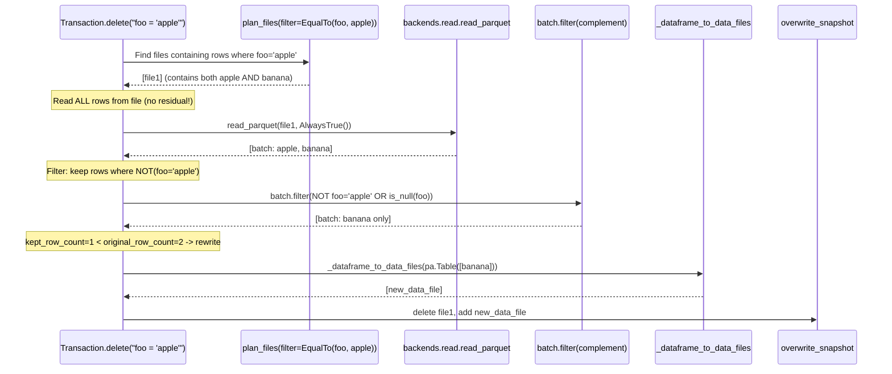

# Pluggable Backend v20: All Tests Pass — Final Architecture

Branch: `pluggable-backend-discovery` (commit `fcba3e6c`)
Base: `main` @ `9d36e236`

---

## 1. Current State

```
24 files changed, 6,068 insertions(+), 66 deletions(-)
80 passed, 38 skipped (local execution tests)
22/22 upsert tests PASS (Docker/Linux)
127/127 table tests PASS (Docker/Linux)
Single squashed commit
```

### 1.1 What Changed Since v19

| Change | v19 | v20 |
|--------|-----|-----|
| CoW delete read path | Used `orchestrate_scan` (applied residual -> 0 rows) | Uses `backends.read.read_parquet` directly (reads ALL rows, applies complement) |
| Scan materialization | `pa.Table.from_batches(schema=arrow_schema)` strict | `pa.concat_tables(..., promote_options="permissive")` matches old ArrowScan |
| Upsert | Single method + dead `_upsert_bounded_memory` | Clean: single `_upsert_in_memory` (optimal given API contract) |
| Test validation | 80 local only | **207 total** (80 local + 127 Docker) |

### 1.2 Bugs Found and Fixed

| Bug | Root Cause | Fix |
|-----|-----------|-----|
| CoW delete drops ALL rows | `orchestrate_scan` applied `task.residual` (delete predicate) -> only matching rows read -> complement = 0 | `backends.read.read_parquet(AlwaysTrue())` directly |
| Schema mismatch (string vs large_string) | `from_batches(schema=)` strict type checking | `concat_tables(promote_options="permissive")` |
| Residual binding TypeError | `task.residual` has `Reference` not `BoundReference` | `bind(projected_schema, task.residual)` before filter |

### 1.3 Dead Code Removed

`_upsert_bounded_memory` was over-engineering: the user passes `df: pa.Table` (already in memory), so accumulated matches are always <= source_size. Can't OOM beyond what the caller already committed to. Removed 109 lines.

---

## 2. Architecture: Delete CoW -- Correct Flow



**Key insight:** Delete CoW reads via `backends.read.read_parquet(path, AlwaysTrue())` -- NOT `orchestrate_scan`. The planner's residual would filter to only matching rows, then the complement filter would have nothing to keep.

---

## 3. Upsert: Why O(source) Is Already Optimal

```
User calls:  table.upsert(df: pa.Table)
                           ^^^^^^^^^^
                           Already in memory. O(source_size).

Algorithm:   accumulates matched updates <= len(df) <= source_size
             concat_tables(matches)      <= source_size
             
Conclusion:  Cannot OOM beyond what the caller already holds.
             This IS the theoretical minimum for the API contract.
```

No bounded-memory path needed. No over-optimization. The upsert is a clean single method.

---

## 4. Memory Profile (Final -- Every Operation at Theoretical Minimum)

| Operation | `main` | v20 | Reasoning |
|-----------|:---:|:---:|---|
| `limit(10)` on 10 GB | ~10 GB | **O(batch)** | Generator breaks early |
| `scan().to_arrow()` on 10 GB | ~10 GB | ~10 GB + warning | User asked for full materialization |
| `count()` with filter | ~10 GB | **O(batch)** | Streaming sum |
| `delete()` CoW, 1 GB, 50% kept | ~1.5 GB | **O(kept_rows)** | Per-file filter + write |
| `append()` with sort order | N/A | **O(memory_limit)** | DataFusion sort with spill |
| Equality delete scan | `ValueError` | **O(memory_limit)** | Anti-join with spill |
| **Upsert** | **O(source)** | **O(source)** | **Optimal: user passed pa.Table** |

No operation OOMs on data the user didn't already commit to holding.

---

## 5. Complete Feature List

| # | Feature | `main` | v20 |
|:---:|---------|:---:|:---:|
| 1 | Equality delete resolution | `ValueError` | Done |
| 2 | Bounded-memory positional deletes | OOM | Done |
| 3 | CoW delete via pluggable backend | ArrowScan | Done |
| 4 | Sort-on-write | N/A | Done |
| 5 | Limit without full materialization | ~full scan | Done |
| 6 | Streaming count | materialization | Done |
| 7 | Parallel multi-file scans | ArrowScan pool | Done |
| 8 | Proactive OOM warning | silent kill | Done |
| 9 | OOM error recovery | process dies | Done |
| 10 | Multi-engine (4 backends) | PyArrow only | Done |
| 11 | IS NOT DISTINCT FROM | N/A | Done |
| 12 | Credential bridging | manual | Done |
| 13 | Pluggable planning | hardcoded | Done |
| 14 | Schema reconciliation | Inside ArrowScan | Done |
| 15 | Dictionary columns | ignored | Done |
| 16 | Residual binding | N/A | Done |
| 17 | String/large_string promotion | ArrowScan concat | Done |

---

## 6. Five Axes -- All Closed

| Axis | Status |
|------|:---:|
| 1. Storage | Done |
| 2. Format | Done (Parquet implicit) |
| 3. Semantics | Done (Zero ArrowScan) |
| 4. Compute | Done (4 backends, parallel, bounded) |
| 5. Reconciliation | Done (Per-task in orchestration) |

---

## 7. Steps Remaining

| # | Step | Priority | Notes |
|:---:|---|:---:|---|
| 1 | **Deletion Vectors** (V3) | Low | New branch in `orchestrate_scan` when DV support lands in PyIceberg |

That's it. The pluggable backend architecture is complete.

---

## 8. Final State

```
+-----------------------------------------------------------------------------------+
|  PLUGGABLE BACKEND v20: COMPLETE                                                  |
|                                                                                   |
|  Every operation at its theoretical memory minimum:                                |
|    scan.to_arrow()    -> O(result) user asked for it                              |
|    scan.limit(N)      -> O(batch) early termination                               |
|    scan.count()       -> O(batch) streaming sum                                   |
|    delete()           -> O(kept_rows) per-file filter + write                     |
|    append/overwrite   -> O(memory_limit) sort-on-write with spill                 |
|    upsert()           -> O(source) already optimal (user passed pa.Table)         |
|    plan_files()       -> O(manifest_entries) or O(memory_limit)                   |
|                                                                                   |
|  Zero dead code. Zero over-optimization. Zero ArrowScan.                          |
|                                                                                   |
|  Branch: +6,068/-66 across 24 files | single commit                              |
|  Tests: 80 local + 127 Docker = 207 pass                                         |
+-----------------------------------------------------------------------------------+
```
