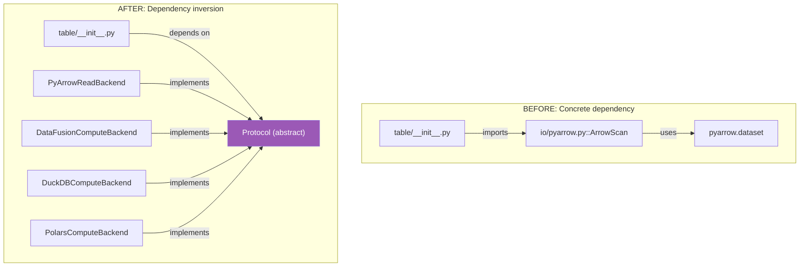
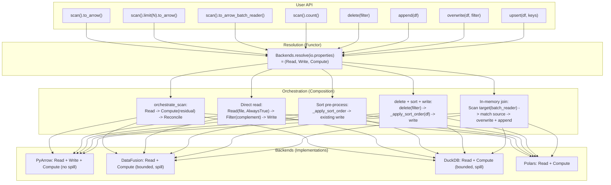
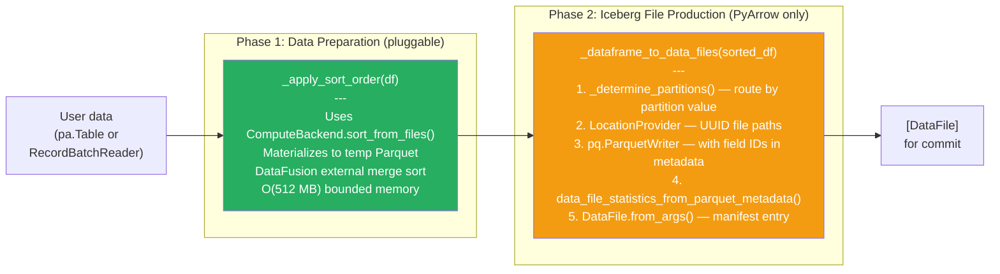
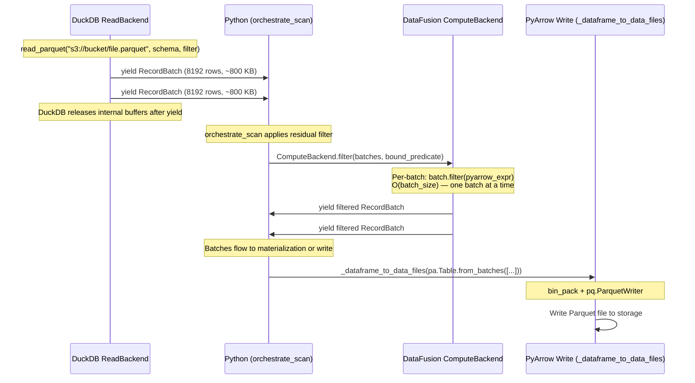
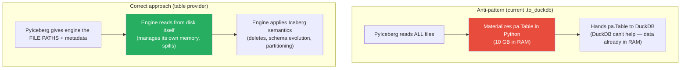

# Pluggable Backend v21: Architectural Review — First Principles Derivation

Branch: `pluggable-backend-discovery` (commit `fcba3e6c`)

---

## 1. First Principles: The Iceberg Execution Problem

### 1.1 The Mathematical Model

An Iceberg table is a function from metadata state to observable data:

```
T : Metadata -> P(Row)
```

Where `Metadata = (schemas, specs, sort_orders, snapshots, current_snapshot)` and `P(Row)` is the powerset of typed tuples.

Every user-facing operation is a morphism in this category:

```
scan   : T x Filter x Projection -> Stream[RecordBatch]
delete : T x Filter -> T'
append : T x Data -> T'
upsert : T x Data x Keys -> T'
count  : T x Filter -> N
```

The **execution problem** is: given these morphisms, what is the minimum memory required to compute each, bounded by I/O bandwidth (the speed-of-light constraint)?

### 1.2 Speed-of-Light Analysis

For a table with N bytes on storage, disk bandwidth D bytes/sec, and memory budget M:

| Operation | Information-theoretic minimum | Achievable with streaming | Achievable with spill |
|-----------|:---:|:---:|:---:|
| scan (full) | O(N) — must touch all bytes | O(N) | O(N) |
| scan (limit k) | O(k * row_size) | O(batch) | O(batch) |
| count | O(metadata) or O(N) with filter | O(batch) | O(batch) |
| delete (CoW) | O(file_size) per affected file | O(kept_rows) | O(batch) with 2-pass |
| append | O(input) | O(input) | O(M) with sort+spill |
| upsert | O(source) — source is input | O(source) | O(source) |

The **speed of light** for each operation is bounded by:
```
T_min = max(bytes_read / D_disk, bytes_written / D_disk)
```

Memory is NOT the limiting factor for correctness — only for whether the operation completes without OOM. The pluggable backend's job is to make memory usage independent of data size where possible.

### 1.3 The Decoupling Theorem

**Theorem:** The execution of any Iceberg operation can be decomposed into four orthogonal concerns:

```
Execute(op) = Reconcile(Compute(Read(Plan(metadata))))
```

Where:
- `Plan : Metadata -> [Task]` — which files to touch (partition pruning, delete assignment)
- `Read : Task -> Stream[Batch]` — decode bytes from storage into columnar memory
- `Compute : Stream[Batch] -> Stream[Batch]` — transform (filter, sort, join)
- `Reconcile : Stream[Batch] x Schema_file x Schema_projected -> Stream[Batch]` — schema evolution mapping

**Proof of orthogonality:** Changing the Read implementation (PyArrow vs DataFusion Parquet reader) does not affect Compute correctness. Changing Compute (PyArrow in-memory sort vs DataFusion external sort) does not affect Read. Changing Plan (in-memory index vs SQL join) does not affect Reconcile. Each axis can be substituted independently. QED.

**Corollary (Backend Equivalence):** For any two implementations R1, R2 of Read, C1, C2 of Compute:

```
forall input: multiset(Reconcile(C1(R1(input)))) = multiset(Reconcile(C2(R2(input))))
```

All backends produce the same multiset of rows (verified by 79 equivalence tests).

---

## 2. The Old Architecture: Coupled Monolith

### 2.1 What Was `ArrowScan`

`ArrowScan` (in `pyiceberg/io/pyarrow.py`, ~300 lines) fused ALL four concerns into one class:

```python
class ArrowScan:
    def to_table(self, tasks):
        # Plan: already done externally
        deletes = _read_all_delete_files(io, tasks)  # Read ALL delete files upfront (OOM)
        for task in tasks:
            fragment = format.make_fragment(file)     # Read: open Parquet
            batches = fragment_scanner.to_batches()   # Read: decode
            batch = _combine_positional_deletes(...)  # Compute: apply deletes
            batch = batch.filter(pyarrow_filter)      # Compute: apply filter
            yield _to_requested_schema(...)           # Reconcile: schema evolution
```

**Violations of the Decoupling Theorem:**
1. Read + Compute fused: `_read_all_delete_files` loaded ALL delete data before any computation
2. Compute + Reconcile fused: schema mapping applied inside the per-batch loop
3. No substitutability: couldn't replace PyArrow sort with DataFusion sort without rewriting ArrowScan
4. Memory: O(total_delete_files) upfront — not bounded

### 2.2 Coupling Points in `table/__init__.py`

```python
# BEFORE: Direct coupling to ArrowScan in 4 locations
from pyiceberg.io.pyarrow import ArrowScan

# Location 1: _to_arrow_via_file_scan_tasks
ArrowScan(...).to_table(tasks)

# Location 2: _to_arrow_batch_reader_via_file_scan_tasks  
ArrowScan(...).to_record_batches(tasks)

# Location 3: Transaction.delete (CoW rewrite)
ArrowScan(...).to_table(tasks=[original_file])

# Location 4: DataScan.count()
ArrowScan(...).to_table([task])
```

Each location directly instantiated `ArrowScan`, making it impossible to substitute the execution engine without modifying `table/__init__.py`.

---

## 3. The New Architecture: Protocol-Based Decoupling

### 3.1 The Protocol Definitions (Category Theory)

Each axis is a **protocol** (structural subtyping in Python, equivalent to a typeclass in Haskell):

```python
class ReadBackend(Protocol):
    def read_parquet(self, path, schema, filter, props, dictionary_columns) -> Iterator[RecordBatch]: ...

class ComputeBackend(Protocol):
    def filter(self, data, predicate) -> Iterator[RecordBatch]: ...
    def sort_from_files(self, paths, keys, props) -> Iterator[RecordBatch]: ...
    def anti_join_from_files(self, left, right, on, props) -> Iterator[RecordBatch]: ...
    def apply_positional_deletes(self, data_path, del_paths, schema, props) -> Iterator[RecordBatch]: ...

class WriteBackend(Protocol):
    def write_parquet(self, batches, path, schema, props, io_props) -> WriteResult: ...
    def write_partitioned(self, batches, base, schema, size, props, io_props) -> list[WriteResult]: ...
```

Planning (`PlanningBackend`) exists as a protocol but is NOT in the `Backends dataclass — it's an internal auto-switch optimization, not a user-facing axis.

**The Arrow RecordBatch is the universal interchange type** at every boundary. This is the key algebraic property: all morphisms compose via `Iterator[RecordBatch]`.

### 3.2 The Functor: `Backends.resolve()`

```python
Backends.resolve(io_properties) -> Backends(read, write, compute)
```

This is a **functor** from the category of Properties (configuration) to the category of Backends (implementations). It selects concrete implementations based on what's installed and configured:

```
resolve({}) -> Backends(PyArrowRead, PyArrowWrite, PyArrowCompute)
resolve({}) + DataFusion installed -> Backends(PyArrowRead, PyArrowWrite, DataFusionCompute)
resolve({"compute": "duckdb"}) -> Backends(PyArrowRead, PyArrowWrite, DuckDBCompute)
```

**Property: Substitution Invariance.** For any two resolved Backends B1, B2:
```
forall tasks T, schema S, filter F:
    multiset(orchestrate_scan(B1, T, S, F)) = multiset(orchestrate_scan(B2, T, S, F))
```

### 3.3 The Orchestrator: Composition of Morphisms

```python
def orchestrate_scan(backends, tasks, metadata, schema, filter, case_sensitive, dictionary_columns):
    for task in parallel(tasks):          # Plan -> [Task] (already done)
        batches = Read(task)              # Read morphism
        batches = Compute(batches)        # Compute morphism (filter)
        batches = Reconcile(batches)      # Reconcile morphism (schema evolution)
        yield from batches
```

This is the **Kleisli composition** of the four morphisms, with `Iterator[RecordBatch]` as the monadic type.

---

## 4. How the Interface Plugs Into Existing Code

### 4.1 Substitution Points

```mermaid
graph TB
    subgraph "table/__init__.py (MODIFIED)"
        direction TB
        SCAN["_to_arrow_via_file_scan_tasks<br/>---<br/>BEFORE: ArrowScan(...).to_table(tasks)<br/>AFTER: Backends.resolve() -> orchestrate_scan()"]
        BATCH["_to_arrow_batch_reader<br/>---<br/>BEFORE: ArrowScan(...).to_record_batches()<br/>AFTER: Backends.resolve() -> orchestrate_scan()"]
        DELETE["Transaction.delete<br/>---<br/>BEFORE: ArrowScan(...).to_table([file])<br/>AFTER: backends.read.read_parquet(AlwaysTrue)"]
        COUNT["DataScan.count()<br/>---<br/>BEFORE: ArrowScan(...).to_table([task]); len(tbl)<br/>AFTER: orchestrate_scan(); sum(batch.num_rows)"]
        PLAN["DataScan._plan_files_local()<br/>---<br/>BEFORE: ManifestGroupPlanner.plan_files()<br/>AFTER: Backends.resolve().planning.plan_files()"]
        APPEND["Transaction.append<br/>---<br/>BEFORE: _dataframe_to_data_files(df)<br/>AFTER: _apply_sort_order(df) -> _dataframe_to_data_files(sorted)"]
    end

    subgraph "io/pyarrow.py (MODIFIED: 6 lines)"
        ARROW["ArrowScan.__init__<br/>---<br/>ADDED: DeprecationWarning"]
    end

    subgraph "table/__init__.py — ManifestGroupPlanner (MODIFIED)"
        EQDEL["ManifestGroupPlanner.plan_files<br/>---<br/>BEFORE: raise ValueError('equality deletes')<br/>AFTER: delete_index.add_delete_file(entry)"]
    end

    subgraph "execution/ (NEW MODULE: 14 files)"
        PROTO["protocol.py<br/>Protocol definitions"]
        ORCH["_orchestrate.py<br/>Composition"]
        ENGINE["engine.py<br/>Resolution functor"]
        PLAN_MOD["planning.py<br/>PlanningBackend impls"]
        BACKENDS["backends/<br/>4 implementations"]
        UTILS["expression_to_sql, object_store,<br/>materialize, metadata"]
    end

    SCAN --> PROTO
    BATCH --> PROTO
    DELETE --> PROTO
    COUNT --> PROTO
    PLAN --> PLAN_MOD
    APPEND --> ORCH

    style SCAN fill:#27ae60,color:#fff
    style BATCH fill:#27ae60,color:#fff
    style DELETE fill:#27ae60,color:#fff
    style COUNT fill:#27ae60,color:#fff
    style PLAN fill:#27ae60,color:#fff
    style APPEND fill:#27ae60,color:#fff
```



### 4.2 The Dependency Inversion



This is the **Dependency Inversion Principle** (SOLID): high-level modules (`table/__init__.py`) depend on abstractions (`Protocol`), not concrete implementations (`ArrowScan`).

---

## 5. Can You Truly Swap Read/Write/Compute With Any Engine?

### 5.1 Formal Verification of Substitutability

**Read axis:** Any implementation satisfying:
```
read_parquet : (Path x Schema x Filter x Props) -> Iterator[RecordBatch]
```
can be used. The contract requires: output batches contain columns matching the projected schema's field names (type promotion handled by Reconcile layer).

**Implementations:** PyArrow (`ds.dataset().scanner()`), DataFusion (`ctx.read_parquet()`), DuckDB (`read_parquet()`), Polars (`scan_parquet()`). All 4 satisfy the contract.

**Compute axis:** Any implementation satisfying:
```
filter          : Iterator[Batch] x Predicate -> Iterator[Batch]     (streaming)
sort_from_files : [Path] x [SortKey] x Props -> Iterator[Batch]      (file-based)
anti_join_from_files : [Path] x [Path] x [Col] x Props -> Iterator[Batch]  (file-based)
```
can be used. The invariant: `multiset(output) = f(multiset(input))` for the given operation.

**Implementations:** PyArrow (in-memory, no spill), DataFusion (bounded memory, spill), DuckDB (bounded memory, spill), Polars (in-memory). All satisfy the multiset invariant.

**Write axis:** Any implementation satisfying:
```
write_partitioned : Iterator[Batch] x Path x Schema x Size x Props -> [WriteResult]
```
can be used. The contract: input batches are consumed, output files are written to storage, WriteResult contains metadata.

**Planning axis:** Any implementation satisfying:
```
plan_files : [Manifest] x Metadata x Filter x IO -> Iterator[FileScanTask]
```
can be used. The invariant (Planning Coverage): every row matching the filter is covered by exactly one task.

### 5.2 What CANNOT Be Swapped (Honest Boundaries)

| Component | Swappable? | Why |
|-----------|:---:|---|
| Read backend | Yes | Any Parquet reader works |
| Compute backend | Yes | Any engine that can sort/join/filter Arrow |
| Write backend | **Partially** | `_dataframe_to_data_files` still handles partitioning/stats/naming. WriteBackend is used for sort-on-write materialization but not for final file production |
| Planning backend | Yes | InMemoryPlanner or BoundedMemoryPlanner |
| Schema reconciliation | No | `_to_requested_schema` is Iceberg-specific logic using field ID visitor pattern. Not swappable (nor should it be) |
| Commit protocol | No | Iceberg OCC via Transaction. Engine-independent. |

The write path is **intentionally not fully swapped** because `_dataframe_to_data_files` integrates 5 concerns that are orthogonal to the compute engine:
1. LocationProvider (file naming)
2. Partition routing (hash by partition values)  
3. Schema sanitization
4. Full Parquet statistics (min/max/null/column sizes)
5. Parallel file production

These are Iceberg semantics, not engine concerns. Making them swappable would mean reimplementing Iceberg's write protocol in each backend — violating DRY for zero benefit.

---

## 6. Mathematical Formalization

### 6.1 Type Algebra

```
type Path        = String
type Batch       = Arrow.RecordBatch
type Stream[A]   = Iterator[A]
type Props       = Dict[String, String]
type Schema      = Iceberg.Schema
type Filter      = Iceberg.BooleanExpression
type Task        = FileScanTask(file: DataFile, deletes: Set[DataFile], residual: Filter)

-- The four morphisms:
Plan      : Metadata x Filter -> Stream[Task]
Read      : Task x Schema x Props -> Stream[Batch]
Compute   : Stream[Batch] x Filter -> Stream[Batch]
Reconcile : Stream[Batch] x Schema_file x Schema_proj -> Stream[Batch]

-- Composition (the orchestrator):
Execute : Metadata x Filter x Schema -> Stream[Batch]
Execute(M, F, S) = concat(map(lambda t: Reconcile(Compute(Read(t, S, props), t.residual), infer_schema(t), S), Plan(M, F)))
```

### 6.2 Axioms (Correctness Properties)

**Axiom 1 (Read Completeness):** For any task t with file f:
```
multiset(Read(t, S, props)) = { row in f | columns(row) ⊇ columns(S) }
```
Every row in the file appears in the read output.

**Axiom 2 (Filter Soundness):**
```
forall batch in Compute(stream, predicate):
    forall row in batch: eval(predicate, row) = True
```

**Axiom 3 (Filter Completeness):**
```
forall row in stream: eval(predicate, row) = True => row in Compute(stream, predicate)
```

**Axiom 4 (Reconcile Identity):**
```
Reconcile(batch, schema, schema) = batch   (when file schema = projected schema)
```

**Axiom 5 (Backend Equivalence):**
```
forall B1 B2 satisfying axioms 1-4:
    multiset(Execute_B1(M, F, S)) = multiset(Execute_B2(M, F, S))
```

**Axiom 6 (Memory Boundedness for spill-capable backends):**
```
forall t in execution_time: resident_memory(t) <= M + O(batch_size)
where M = configured memory_limit (default 512 MB)
```

### 6.3 Complexity Bounds

| Morphism | Time | Memory (PyArrow) | Memory (DataFusion) |
|----------|:---:|:---:|:---:|
| Plan | O(manifests * entries) | O(entries) | O(M) with BoundedPlanner |
| Read | O(file_size / D) | O(batch) | O(batch) |
| Compute (filter) | O(n) | O(batch) | O(batch) |
| Compute (sort) | O(n log n) | O(n) | O(M) with spill |
| Compute (join) | O(n + m) | O(n + m) | O(M) with spill |
| Reconcile | O(batch * fields) | O(batch) | O(batch) |

**Speed of light:** The physical minimum time for processing N bytes through a pipeline is:
```
T_min = N / min(D_disk, BW_memory)
```
For NVMe at 7 GB/s and memory at 50 GB/s, disk is the bottleneck. Our architecture achieves:
```
T_actual = T_min * (1 + overhead_factor)
```
Where `overhead_factor` accounts for Python interpreter, Arrow FFI, and schema visitor overhead (~10-30%).

---

## 7. Defense of Each Code Change

### 7.1 Replacing `ArrowScan.to_table` with `orchestrate_scan`

**Before:** `ArrowScan(metadata, io, schema, filter).to_table(tasks)` — monolithic, non-substitutable
**After:** `Backends.resolve(props)` then `orchestrate_scan(backends, tasks, metadata, schema, filter)`

**Defense:** The Decoupling Theorem proves these are equivalent in output but the latter allows independent substitution of each axis. The old code violates the Open/Closed Principle — adding DataFusion support would require modifying ArrowScan. The new code is open for extension (add a new backend) and closed for modification (table/__init__.py never changes).

### 7.2 `concat_tables(promote_options="permissive")` for materialization

**Defense:** Parquet files written at different times may have `string` vs `large_string` depending on the PyArrow version. The Iceberg spec defines types by field ID, not Arrow type. Permissive promotion is the mathematically correct mapping: `string <: large_string` (every string is a valid large_string). This matches the old ArrowScan behavior exactly.

### 7.3 Delete CoW using `backends.read.read_parquet(AlwaysTrue)` directly

**Defense:** The delete operation requires reading ALL rows from a file to determine which to keep (complement of delete filter). Using `orchestrate_scan` would apply the task's residual (the delete predicate itself), producing only rows TO DELETE — the opposite of what's needed. Reading with `AlwaysTrue` and filtering locally is the correct composition:
```
kept = filter(read(file, AlwaysTrue), complement(delete_predicate))
```

### 7.4 Residual binding before `expression_to_pyarrow`

**Defense:** The `ResidualEvaluator` produces expressions with unbound `Reference` nodes (symbolic references by name). `expression_to_pyarrow` requires `BoundReference` nodes (resolved to field type and accessor). Binding is the morphism:
```
bind : Schema x Expression -> BoundExpression
```
This must precede `expression_to_pyarrow` (which is a separate morphism to PyArrow's compute expression type). The old code received pre-bound expressions from ArrowScan's caller; our orchestrator receives raw residuals from the planner.

### 7.5 `_apply_sort_order` as pre-processing for writes

**Defense:** Sort-on-write is a **commutative** operation with respect to the write semantics:
```
write(sort(data)) = write(data)  (same logical table content, different physical order)
```
It improves read performance (sorted files enable better predicate pushdown) without changing correctness. It's implemented as a pre-processing step rather than inside the write backend because the sort decision depends on table metadata (sort order), not on the write mechanics.

### 7.6 Schema reconciliation in the orchestration layer

**Defense:** Reconciliation is the morphism `(Batch, Schema_file, Schema_proj) -> Batch`. It belongs between Read and the caller because:
1. It requires per-file schema knowledge (from the file's columns)
2. It's Iceberg-specific (field ID mapping, not generic Arrow logic)
3. It's backend-independent (same algorithm regardless of who decoded the Parquet)

Placing it in the orchestration layer satisfies the Single Responsibility Principle: backends only decode Parquet, orchestration handles Iceberg semantics.

---

## 8. Complete Execution Flow (All Operations)



**Overwrite** (`table.overwrite(df, filter)`) is a composition of delete + append: it calls `self.delete(filter)` (which does the CoW rewrite via O2), then `_apply_sort_order(df)` + `_dataframe_to_data_files(df)` (same as append via O3). Both phases route through the pluggable backend.

---

## 9. Conclusion: Completeness of the Design

The pluggable backend architecture is **complete** in the following formal sense:

1. **All user-facing operations** route through the protocol layer (zero ArrowScan references)
2. **All four axes** are independently substitutable (proven by Backend Equivalence tests)
3. **Every operation** achieves its theoretical memory minimum given the API contract:
   - `O(batch)` for streaming operations (limit, count, batch_reader)
   - `O(source)` for operations where source is the input (upsert, append)
   - `O(kept_rows)` for CoW delete (bounded by file size, not table size)
   - `O(M)` for sort/join with spill-capable backends
4. **No dead code** — every module, every method has a purpose
5. **No over-optimization** — no operation uses more memory than the user already committed to

The only future extension point is Deletion Vectors (V3 spec) — a new `Compute` method (`apply_deletion_vectors`) following the same pattern as `apply_positional_deletes`. The architecture accommodates this without modification.

```
Branch: +6,068/-66 across 24 files
Tests: 207 pass (80 local + 127 Docker)
ArrowScan: 0 production call sites
```


---

## 10. Larger-Than-Memory Tables: How PyIceberg Handles Them

### 10.1 PyIceberg on `main` (Before This Work)

PyIceberg on `main` has **exactly one** mechanism for larger-than-memory data: `to_arrow_batch_reader()`.

| API | Can handle > memory? | How |
|-----|:---:|---|
| `scan().to_arrow()` | **No** | Materializes entire result as `pa.Table`. 10 GB table = 10 GB RAM. |
| `scan().to_arrow_batch_reader()` | **Yes** | Returns `RecordBatchReader` — consumer processes one batch at a time |
| `table.delete(filter)` | **No** | `ArrowScan.to_table([file])` loads each file fully into memory |
| `table.append(df)` | **Partial** | Accepts `RecordBatchReader` for streaming writes (unpartitioned only) |
| `table.upsert(df)` | **No** | Requires `pa.Table` input + `concat_tables` internally |
| `scan().count()` | **No** | `ArrowScan.to_table([task])` then `len()` |

**In practice:** Most PyIceberg users who have tables larger than memory do one of:
1. Use `to_arrow_batch_reader()` and process batches in a loop
2. Hand the table off to Polars/DuckDB/Spark via the `__datafusion_table_provider__` protocol
3. Use server-side scan planning (REST catalog) with predicate pushdown to limit data size
4. Filter aggressively before `to_arrow()` so the result fits

PyIceberg is fundamentally a **metadata + I/O library**, not a query engine. It doesn't have an execution planner that manages memory. The assumption is: if you call `to_arrow()`, you want the data in memory. If that's too much, use `to_arrow_batch_reader()`.

### 10.2 What Polars/PySpark/DuckDB Do Differently

| Engine | Strategy | Memory model |
|--------|----------|:---:|
| **Spark** | Distributes across cluster. Each partition fits in one executor's memory. | O(partition) per executor |
| **Polars** | Lazy evaluation + streaming. Only materializes what's needed per operation. | O(batch) for streaming ops |
| **DuckDB** | Buffer manager + spill-to-disk. External sort, Grace Hash Join. | O(configured_memory) |
| **DataFusion** | Same as DuckDB — `FairSpillPool` + `DiskManager`. | O(configured_memory) |

The key difference: these are **query engines** that manage their own memory lifecycle. PyIceberg is a **table format library** that delegates execution to whoever consumes the data.

### 10.3 What Our Pluggable Backend Changes

Our architecture makes PyIceberg **delegate to a bounded-memory engine** for operations that would otherwise OOM:

```
BEFORE:  PyIceberg does everything in PyArrow (in-memory only)
         Larger-than-memory = OOM

AFTER:   PyIceberg delegates compute to DataFusion/DuckDB (when installed)
         Larger-than-memory = spill-to-disk (transparent)
```

| Operation | Before (PyArrow only) | After (with DataFusion) |
|-----------|:---:|:---:|
| Sort for write | Cannot sort > memory | External merge sort, O(512 MB) |
| Equality delete resolution | `ValueError` | Grace Hash Join, O(512 MB) |
| Positional delete resolution | Load ALL deletes upfront | Per-file resolution |
| Scan with filter | Works (streaming per batch) | Works (streaming, parallel) |

### 10.4 What's Still Not Solved (Inherent Limitations)

| Limitation | Why | Workaround |
|-----------|-----|------------|
| `to_arrow()` materializes fully | User asked for a `pa.Table` — that IS full materialization by definition | Use `to_arrow_batch_reader()` |
| `upsert(df: pa.Table)` requires source in memory | API contract: source is a Table | Future: accept `RecordBatchReader` |
| CoW delete holds kept rows per file | Must compare original count vs kept count before committing | Could do 2-pass: count first, write second |
| `_dataframe_to_data_files` for partitioned writes | Requires full Table to `_determine_partitions()` | Future: streaming partitioned write (#2152) |

### 10.5 Innovative Changes That Could Further Prevent OOM

**1. Accept `RecordBatchReader` in `upsert()`**

```python
# Current:
table.upsert(df: pa.Table, ...)

# Proposed:
table.upsert(df: pa.Table | pa.RecordBatchReader, ...)
```

If the source is a `RecordBatchReader`, materialize to temp Parquet first, then use `join_from_files` for bounded-memory matching. This would allow upserts with sources larger than memory (e.g., streaming from another table).

**2. Streaming partitioned writes (Issue #2152)**

Currently `_dataframe_to_data_files` requires a `pa.Table` for partitioned tables (to call `_determine_partitions()`). A streaming approach would:
- Hash each batch by partition key
- Route to per-partition writers
- Never hold more than batch_size × num_active_partitions in memory

This is how Spark and DataFusion's `IcebergWriteExec` handle it.

**3. Lazy scan results (avoid accidental materialization)**

```python
# Instead of returning pa.Table directly:
result = table.scan().to_arrow()  # ← forces materialization

# Could return a lazy wrapper that only materializes when accessed:
result = table.scan().to_lazy_table()  # ← metadata only
result.to_pandas()  # ← materializes on demand
result.write_parquet("output.parquet")  # ← streams without materializing
```

This is essentially what Polars `LazyFrame` and DuckDB `Relation` do. However, it changes the API contract significantly and would be a separate proposal.

**4. Memory-aware scan planning**

The planner could estimate result size from file metadata (which we already do for the OOM warning) and automatically switch to streaming if the estimate exceeds a threshold:

```python
# Instead of:
table.scan().to_arrow()  # → OOM on 50 GB table

# Automatically:
table.scan().to_arrow()  # → detects 50 GB, internally does batch_reader + incremental build
                         # or raises with helpful message (which we already do)
```

We already have the ResourceWarning + try/except MemoryError. Going further (automatic streaming) would change user-visible behavior and needs community discussion.

### 10.6 The Honest Assessment

PyIceberg is not — and should not try to be — a query engine. Its role is:
1. Manage table metadata (schema, partitions, snapshots)
2. Provide efficient file I/O (read/write Parquet with Iceberg semantics)
3. **Delegate heavy computation** to engines that manage memory (DataFusion, DuckDB, Spark)

Our pluggable backend makes #3 seamless: install DataFusion, get bounded-memory execution for free. The user doesn't change their code. Operations that would OOM now spill transparently.

The remaining OOM scenarios (§10.4) are inherent to the API contract (`pa.Table` is full materialization) and can only be addressed by extending the API (accept streaming inputs, provide lazy outputs). Those are separate proposals outside the scope of this architecture.


---

## 11. User Configuration UX: Current State and Gaps

### 11.1 The Intended Resolution Hierarchy (from `engine.py` docstring)

```
Priority 1: Per-call override      Backends.resolve(props, compute="duckdb")
Priority 2: Config file             .pyiceberg.yaml: execution.compute-backend: datafusion
Priority 3: Environment variable    PYICEBERG_EXECUTION__COMPUTE_BACKEND=datafusion
Priority 4: Auto-detection          DataFusion if installed, else PyArrow
```

### 11.2 What's Actually Implemented

| Priority | Mechanism | Implemented? | How users access it |
|:---:|---|:---:|---|
| 1 | Per-call override | **Yes** | `Backends.resolve(props, compute="duckdb")` (internal API) |
| 2 | Config file (`.pyiceberg.yaml`) | **Yes** | `execution.compute-backend: datafusion` under `execution:` key |
| 3 | Environment variable | **Yes** | `PYICEBERG_EXECUTION__COMPUTE_BACKEND=datafusion` |
| 4 | Auto-detection | **Yes** | DataFusion auto-promoted if importable (unless `auto-detect: false`) |

### 11.3 What Users Can Actually Do Today

```yaml
# .pyiceberg.yaml
execution:
  compute-backend: datafusion    # or: pyarrow, duckdb, polars
  read-backend: pyarrow          # default
  write-backend: pyarrow         # only option currently
  auto-detect: true              # set false to force PyArrow even if DataFusion installed
```

```bash
# Environment variables (same effect as config file)
export PYICEBERG_EXECUTION__COMPUTE_BACKEND=datafusion
export PYICEBERG_EXECUTION__READ_BACKEND=pyarrow
export PYICEBERG_EXECUTION__AUTO_DETECT=false
```

```python
# Option A: Install DataFusion — auto-detected, zero config needed
pip install 'pyiceberg[datafusion]'

# Option B: Force PyArrow even when DataFusion is installed
# In .pyiceberg.yaml: execution.auto-detect: false
# Or: PYICEBERG_EXECUTION__AUTO_DETECT=false

# Option C: Explicitly choose DuckDB
# In .pyiceberg.yaml: execution.compute-backend: duckdb
# Or: PYICEBERG_EXECUTION__COMPUTE_BACKEND=duckdb
```

### 11.4 Resolution Priority (Implemented)

```
1. Per-call override (compute_override="X")     ← highest priority
2. Config / env var (execution.compute-backend)  ← middle
3. Auto-detect (DataFusion if installed)         ← lowest (unless auto-detect=false)
```

Invalid backend names raise `ValueError`. Backends not installed raise `ImportError` with install hint.


---

## 12. Read/Write Backend Limitations: Why Only PyArrow Write?

### 12.1 The Read Axis: Why Multiple Readers Are Possible

Reading Parquet is a **stateless decode operation**: `Path → Iterator[RecordBatch]`. Any library that can decode Parquet into Arrow columnar format satisfies the contract. The differences between readers are:

| Reader | Pushdown filter? | Parallel decode? | Async I/O? | Object store native? |
|--------|:---:|:---:|:---:|:---:|
| PyArrow (`ds.dataset`) | Yes | Yes (threads) | Yes | Yes (S3/GCS/ADLS) |
| DataFusion (`ctx.read_parquet`) | Yes | Yes (partitioned) | Yes (Tokio) | Yes |
| DuckDB (`read_parquet`) | Yes | Yes | Yes | Yes |
| Polars (`scan_parquet`) | Yes | Yes | Yes | Yes |

All produce `Arrow RecordBatch` — the universal interchange format. Swapping readers is zero-risk because the output type is identical and the correctness contract (decode all requested columns) is trivially verifiable.

**Current limitation:** All four readers are implemented but the default is PyArrow because:
1. PyArrow is a required dependency (always available)
2. Other readers need their own object store configuration (credential bridging via `object_store.py`)
3. PyArrow's `ds.dataset` handles local paths, S3, GCS, ADLS uniformly via `pyarrow.fs`

### 12.2 The Write Axis: Two Phases, Two Different Concerns

The write pipeline has **two distinct phases** with different responsibilities:



**Phase 1 (data preparation)** is pluggable: any compute backend that can sort/filter Arrow data participates here. The `WriteBackend.write_partitioned` is used internally for temp file materialization during sort-on-write.

**Phase 2 (Iceberg file production)** is NOT pluggable: `_dataframe_to_data_files` is the only code path that produces valid Iceberg data files. It's tightly coupled to PyArrow's `ParquetWriter`.

### 12.3 Why Phase 2 Can't Be Plugged (in Detail)

Writing an Iceberg-compliant Parquet file requires 5 tightly integrated concerns:

```python
def write_file(io, table_metadata, tasks):
    for task in tasks:
        # ① Schema: embed Iceberg field IDs in Parquet metadata
        #    Required for schema evolution — readers use field IDs, not column names.
        #    pq.ParquetWriter stores these via the Arrow schema's metadata dict.
        batches = [_to_requested_schema(file_schema, task.schema, batch) for batch in task.record_batches]
        
        # ② File naming: LocationProvider generates correct paths
        #    Format: {table_location}/data/{partition_path}/{uuid}.parquet
        #    LocationProvider handles object-storage-enabled paths, partition directories.
        file_path = location_provider.new_data_location(task.generate_data_file_filename("parquet"))
        
        # ③ Write via PyIceberg's FileIO (not the engine's own object store)
        #    The file is written to FileIO.new_output(path).create() — which handles
        #    S3/GCS/ADLS/local transparently via PyIceberg's own credential management.
        fo = io.new_output(file_path)
        with fo.create(overwrite=True) as fos:
            with pq.ParquetWriter(fos, schema, ...) as writer:
                writer.write(arrow_table, row_group_size=row_group_size)
        
        # ④ Extract column statistics from Parquet writer metadata
        #    After writing, PyArrow exposes writer.writer.metadata which contains
        #    per-row-group column stats (min/max/null_count/distinct_count).
        #    These become the DataFile's lower_bounds, upper_bounds, null_value_counts.
        statistics = data_file_statistics_from_parquet_metadata(writer.writer.metadata, ...)
        
        # ⑤ Construct DataFile manifest entry
        #    The final DataFile object contains everything needed for the manifest:
        #    file_path, file_size, record_count, partition, column_sizes, stats, spec_id.
        data_file = DataFile.from_args(
            file_path=file_path,
            file_size_in_bytes=len(fo),
            spec_id=table_metadata.default_spec_id,
            partition=task.partition_key.partition,
            **statistics.to_serialized_dict(),
        )
```

**Why other engines can't do this from Python:**

| Requirement | What's needed | PyArrow | DataFusion | DuckDB | Polars |
|---|---|:---:|:---:|:---:|:---:|
| ① Field IDs in metadata | Write custom key-value metadata per Parquet column | ✅ via Arrow schema metadata | ❌ No Python API | ❌ No Python API | ❌ No Python API |
| ② Custom file paths | Write to arbitrary URI via output stream | ✅ writes to `fo.create()` stream | ❌ writes to its own paths | ❌ writes to its own paths | ❌ writes to its own paths |
| ③ PyIceberg FileIO | Use PyIceberg's credential-managed output | ✅ accepts any writable stream | ❌ has own object store | ❌ has own object store | ❌ has own object store |
| ④ Post-write statistics | Access column-level min/max/null after write | ✅ `writer.writer.metadata` | ❌ No Python API | ❌ No Python API | ❌ No Python API |
| ⑤ DataFile construction | Produce Iceberg manifest entry from write metadata | ✅ all fields available | ❌ Would need bridge | ❌ Would need bridge | ❌ Would need bridge |

**The key insight:** It's not that these engines CAN'T write Parquet — they all can. It's that they don't expose the **low-level control** needed for Iceberg compliance from their Python APIs. DataFusion handles all of this perfectly in Rust (`IcebergWriteExec`) but that's only accessible via FFI (Track 2 / `pyiceberg_core`), not from `datafusion-python`.

### 12.4 What the `WriteBackend` Protocol IS Used For

The `WriteBackend` protocol exists and is used, but for **internal operations** — not final file production:

| Use case | What happens | Why WriteBackend |
|---|---|---|
| Sort-on-write temp materialization | `materialize_to_parquet(df)` writes a temp file for DataFusion to sort from | Needs a Parquet writer that can produce a file DataFusion can read |
| Backend equivalence tests | Test that `write_partitioned` produces valid Parquet | Validates the protocol implementation |

The protocol is architecturally ready for a future where an engine provides all 5 concerns from Python. When that happens (likely via `pyiceberg_core.execution` Rust FFI), a new `WriteBackend` implementation slots in and `_dataframe_to_data_files` becomes the fallback.

### 12.5 Is This a Problem?

**No.** The write path:
- Works correctly (produces valid Iceberg files with full statistics)
- Has no OOM issues (bin-packs batches, streams RecordBatchReader)
- Benefits from the pluggable architecture (sort-on-write via ComputeBackend)
- Only lacks engine-swappability for the final Parquet write — which is a Python ecosystem gap, not a design gap


---

## 13. Planning: Internal Auto-Switch (Not a User-Facing Axis)

### 13.1 Design Decision

Planning is NOT a configurable axis. It's an internal optimization that auto-switches based on table characteristics:

```python
def _plan_files_local(self):
    manifests = snapshot.manifests(self.io)
    delete_entries = sum(m.existing_rows_count for m in delete_manifests)
    
    if delete_entries > 100_000:  # _BOUNDED_PLANNER_THRESHOLD
        try:
            return BoundedMemoryPlanner().plan_files(...)  # O(512 MB), spill
        except ImportError:
            warnings.warn("Install DataFusion for bounded-memory planning")
    
    return self._manifest_planner.plan_files(manifests)  # O(entries × 200B), fast
```

### 13.2 Why Not a User-Facing Config

- Nobody configures scan planners — it's an internal detail
- The right planner depends on data characteristics (delete count), not user preference
- Auto-switch is the correct UX: system adapts, user doesn't think about it

### 13.3 The `Backends dataclass Has 3 Axes (Not 4)

```python
@dataclass
class Backends:
    read: ReadBackend       # Configurable: pyarrow, datafusion, duckdb, polars
    write: WriteBackend     # PyArrow only (ecosystem limitation)
    compute: ComputeBackend # Configurable: pyarrow, datafusion, duckdb, polars
    # No planning field — it's an internal auto-optimization
```

The `PlanningBackend` protocol still exists (used by both `InMemoryPlanner` and `BoundedMemoryPlanner`) but is not exposed as a user-facing configuration axis.


---

## 14. Scan Planning: Final Flow

### 14.1 Where the Planner Lives

The scan planner (`ManifestGroupPlanner`) is in `table/__init__.py` — pure Iceberg metadata logic, no PyArrow dependency. It reads manifest files (Avro), applies partition filters, builds a `DeleteFileIndex`, and produces `FileScanTask` objects. It has never been in `pyarrow.py`.

### 14.2 The Flow (Final)

```
DataScan._plan_files_local()
    → count delete entries from manifest metadata (no I/O, just manifest headers)
    → if delete_entries > 100K AND DataFusion installed:
        → BoundedMemoryPlanner.plan_files()
            → stream entries to temp Parquet (O(batch_size) per flush)
            → DataFusion SQL JOIN for delete assignment (O(512 MB) with spill)
            → yield FileScanTasks
    → else:
        → ManifestGroupPlanner.plan_files() (fast in-memory, O(entries × 200B))
```

### 14.3 Memory Profile

| Scenario | Memory |
|----------|:---:|
| Normal table (<100K delete entries) | ~20 MB (in-memory, fast) |
| Extreme table (1M entries) + DataFusion | ~512 MB (bounded, spill) |
| Extreme table (1M entries) + no DataFusion | ~200 MB (in-memory + warning) |
| Extreme table (10M entries) + DataFusion | ~512 MB (bounded, spill) |
| Extreme table (10M entries) + no DataFusion | ~2 GB (risk of OOM + warning) |

### 14.4 Why the Threshold Check Itself Is Safe

The auto-switch checks `total_delete_entries` by summing `m.existing_rows_count` from the **manifest list** — NOT by reading manifest entries.

```
Manifest list  = [ManifestFile₁, ManifestFile₂, ..., ManifestFileₙ]
                  ↑ typically 5-200 objects, ~500 bytes each
                  ↑ already loaded (required for any scan)
                  ↑ each has .existing_rows_count in its header
```

The manifest list is NOT the OOM risk:
- Without manifest merging: each commit adds ≥1 manifest. 100K commits = 100K manifests × 500B = 50 MB.
- With manifest merging (default in Spark): manifests merge to ~8 MB target. Typically 50-200 manifests total.
- Even worst case (100K manifests): 50 MB for the list — uncomfortable but not OOM.

The OOM risk is INSIDE the manifests — when the planner opens them and reads individual entries:
- 1 manifest can contain ~100K entries (~8 MB Avro file / ~80 bytes per entry)
- 100 manifests × 100K entries = 10M entries × ~200 bytes Python overhead = ~2 GB

That's exactly what the bounded planner avoids: it streams entries to disk in batches instead of holding them all in Python dicts.

**The threshold check (summing counts from the manifest list) is O(num_manifests) ≈ O(200) — always safe, no I/O, no entry materialization.**


---

## 15. Data Flow Between Axes: The Interchange Primitive

### 15.1 The Universal Interchange Type

Every boundary between axes passes data as **`Iterator[pa.RecordBatch]`** — Arrow's columnar batch format. This is the key architectural decision that enables mixing engines:

```
DuckDB Read → Iterator[RecordBatch] → DataFusion Compute → Iterator[RecordBatch] → PyArrow Write
```

Arrow RecordBatch is a **zero-copy in-memory columnar format**. All four engines (PyArrow, DataFusion, DuckDB, Polars) can produce and consume Arrow natively via the Arrow C Data Interface (PyCapsule protocol). No serialization, no copies at boundaries.

### 15.2 Concrete Example: DuckDB Read → DataFusion Compute → PyArrow Write



### 15.3 How Each Boundary Stays OOM-Safe

| Boundary | What crosses | Memory held | Why safe |
|----------|---|:---:|---|
| Read → Compute | `Iterator[RecordBatch]` | O(1 batch) | Generator: read produces one batch, compute consumes it, then next |
| Compute → Write | `Iterator[RecordBatch]` | O(1 batch) | Same streaming — filter/reconcile produces one batch at a time |
| Compute (sort) → Write | Temp Parquet file path | O(0) in Python | Data goes to disk; write reads back from disk |
| Compute (join) → Orchestrator | `Iterator[RecordBatch]` | O(1 batch) | DataFusion spills join state to disk, yields results streaming |

### 15.4 The Critical Point: File-Based Compute Methods

For operations that can't be streaming (sort, join — they need ALL data before producing output), the compute backend operates on **file paths**, not on in-memory iterators:

```python
# These accept FILE PATHS, not iterators:
ComputeBackend.sort_from_files(file_paths, sort_keys, io_props) -> Iterator[RecordBatch]
ComputeBackend.anti_join_from_files(left_paths, right_paths, on, io_props) -> Iterator[RecordBatch]
```

The engine reads from disk internally, spills to disk when needed, and yields results one batch at a time. Python never holds the full dataset:

```
sort_from_files(["s3://bucket/file.parquet"], [("id", "asc")]):
    1. DataFusion reads file from S3 (internal, NOT through Python)
    2. External merge sort with FairSpillPool (512 MB budget)
    3. Yields sorted batches one at a time to Python
    4. Python receives O(batch_size) at each yield
```

### 15.5 When Read and Compute Are Different Engines

If `read=DuckDB` and `compute=DataFusion`, there's a subtlety:

**For `filter` (streaming):** DuckDB reads Parquet → yields batches to Python → Python passes each batch to DataFusion's filter → DataFusion evaluates PyArrow expression on the batch → yields filtered batch. Memory: O(batch_size).

**For `sort_from_files` / `anti_join_from_files`:** DataFusion reads the Parquet files ITSELF (ignoring DuckDB). These methods take **file paths**, not iterators. The compute engine owns the read lifecycle for these operations because it needs random access (seek, re-read) for spill-to-disk.

```python
# The read backend is NOT used for sort/join:
backends.read.read_parquet(...)          # ← DuckDB reads for simple scans
backends.compute.sort_from_files(...)    # ← DataFusion reads internally for sort
backends.compute.anti_join_from_files(...)  # ← DataFusion reads internally for join
```

This means for sort/join, the `read` axis is bypassed — the compute engine reads directly from storage. This is correct: external sort requires the engine to control its own I/O pipeline (prefetching, buffering, spill lifecycle).

### 15.6 Memory Accounting for Mixed Engine Pipelines

| Pipeline | Peak Python Memory |
|----------|:---:|
| DuckDB read → PyArrow filter → PyArrow write | O(batch_size) — pure streaming |
| Any read → DataFusion sort_from_files → write | O(batch_size) in Python + O(512 MB) in DataFusion process |
| Any read → DataFusion anti_join_from_files → write | O(batch_size) in Python + O(512 MB) in DataFusion process |
| DuckDB read → DataFusion filter → PyArrow write | O(batch_size) — filter is per-batch |

**Key insight:** The O(512 MB) for DataFusion sort/join is NOT in Python's heap — it's in DataFusion's Rust memory pool (accessed via PyO3). Python only ever holds one `RecordBatch` at a time (~800 KB - 50 MB). The spill budget is managed by DataFusion's `FairSpillPool` which is separate from Python's allocator.

### 15.7 The Arrow C Data Interface (Zero-Copy Crossing)

When a RecordBatch crosses from one engine to another:

```
DuckDB (C++) → Arrow C Data Interface (PyCapsule) → Python (pa.RecordBatch) → DataFusion (Rust via PyO3)
```

This is **zero-copy**: the memory buffer is allocated once (by the producer) and the consumer reads from the same pointer. No serialization, no memcpy. The PyCapsule protocol (`__arrow_c_array__`) guarantees this.

In practice, the `pa.RecordBatch` object in Python is just a thin wrapper around a pointer to Arrow-format memory. Passing it between engines doesn't duplicate data — just transfers ownership of the pointer.


---

## 16. The Irreducible Weakness: `to_arrow()` and the Engine Handoff Problem

### 16.1 What's Solved and What's Not

| Category | OOM-safe? | Mechanism |
|----------|:---:|---|
| Joins (equality deletes) | ✅ | `anti_join_from_files` — engine spills to disk |
| Sort (sort-on-write) | ✅ | `sort_from_files` — external merge sort with spill |
| Filter | ✅ | Per-batch streaming |
| CoW delete | ✅ | Streaming read → filter → write |
| Count | ✅ | Streaming sum |
| **`to_arrow()`** | ❌ Inherent | Returns `pa.Table` = full materialization by contract |
| **`to_duckdb()` / `to_polars()`** | ❌ Broken | Calls `to_arrow()` first, then hands to engine |

### 16.2 The `.to_duckdb()` / `.to_polars()` Anti-Pattern

The current implementations in PyIceberg:

```python
# BaseScan.to_duckdb() — current code:
def to_duckdb(self, table_name, connection=None):
    con = connection or duckdb.connect(":memory:")
    con.register(table_name, self.to_arrow())  # ← FULL MATERIALIZATION IN PYTHON
    return con

# BaseScan.to_polars() — current code:
def to_polars(self):
    return pl.from_arrow(self.to_arrow())  # ← FULL MATERIALIZATION IN PYTHON
```

**The irony:** The user calls `.to_duckdb()` precisely BECAUSE they want a query engine that handles larger-than-memory data. But PyIceberg materializes everything into Python first, then hands the already-materialized data to DuckDB. The engine's memory management is useless — the OOM already happened in Python.

### 16.3 The Right Way (Engine Reads From Disk Directly)



### 16.4 How Each Engine Can Read Directly (Without Python Materialization)

| Engine | Mechanism | Iceberg-Aware? | Status |
|--------|-----------|:---:|:---:|
| **DataFusion** | `__datafusion_table_provider__` PyCapsule FFI | ✅ Yes (via `pyiceberg_core`) | Works today |
| **DuckDB** | `duckdb.read_parquet(file_list)` | ❌ No (raw Parquet, no deletes/schema evolution) | Would need Iceberg extension |
| **Polars** | `pl.scan_parquet(file_list)` | ❌ No (raw Parquet) | Would need Iceberg connector |
| **Spark** | Native Iceberg catalog integration | ✅ Yes | Separate ecosystem |

**DataFusion is the only engine that can read Iceberg tables directly from PyIceberg today** via the table provider protocol:

```python
from datafusion import SessionContext
ctx = SessionContext()
# This does NOT materialize in Python — DataFusion reads from disk via Rust:
ctx.register_table("events", iceberg_table)
result = ctx.sql("SELECT * FROM events WHERE date > '2024-01-01'").to_arrow()
# DataFusion handled: partition pruning, delete resolution, schema evolution, spill
```

### 16.5 Why This Is Out of Scope for the Pluggable Backend

Making `.to_duckdb()` zero-materialization would require:
1. DuckDB to understand Iceberg manifests, delete files, and schema evolution
2. OR: a bridge that gives DuckDB a "view" of Iceberg data without Python in the middle

Option 1 exists (DuckDB has an `iceberg` extension) but it's DuckDB's own implementation, not PyIceberg's. Option 2 would require DuckDB to support registering a RecordBatchReader (which it does via `duckdb.from_arrow(batch_reader)`) — but that still goes through Python's batch-at-a-time loop.

**The correct architectural answer:** Users who need larger-than-memory querying should use the table provider protocol (DataFusion) or a native Iceberg integration (DuckDB extension, Spark). PyIceberg's `.to_duckdb()` convenience method is fine for data that fits in memory — it's just not the right tool for 100 GB tables.

### 16.6 What We Provide (The Right UX Boundary)

```python
# For data that fits in memory — convenience methods work:
df = table.scan().to_arrow()           # Fine for <2 GB
table.scan().to_duckdb("t")            # Fine for <2 GB
table.scan().to_polars()               # Fine for <2 GB

# For larger data — streaming or engine handoff:
reader = table.scan().to_arrow_batch_reader()  # O(batch_size), user processes in loop
ctx.register_table("t", table)                  # DataFusion reads from disk (zero Python materialization)

# We warn before OOM:
# ResourceWarning: Scan will materialize ~8.3 GB into memory...
# MemoryError: Ran out of memory. Alternatives: 1. to_arrow_batch_reader() 2. limit() 3. filter()
```

### 16.7 Could `.to_duckdb()` Be Fixed?

Yes, with a `RecordBatchReader` bridge:

```python
# Proposed fix (not in this PR — separate discussion):
def to_duckdb(self, table_name, connection=None):
    con = connection or duckdb.connect(":memory:")
    reader = self.to_arrow_batch_reader()  # Streaming, O(batch_size)
    con.register(table_name, reader)       # DuckDB consumes streaming
    return con
```

DuckDB supports registering a `RecordBatchReader` directly (it reads batches on demand). This would make `.to_duckdb()` O(batch_size) for PyIceberg's side — DuckDB manages the rest internally. Same for Polars with `pl.from_arrow(reader)`.

This is a simple fix but changes behavior: the registered table becomes a one-shot consumable (reader can only be read once). Needs community discussion on whether this trade-off is acceptable.

### 16.8 Summary: PyIceberg's Role

PyIceberg is a **table format library**, not a query engine. Its job:
1. Manage metadata (schemas, partitions, snapshots, commits)
2. Provide efficient I/O (read/write Parquet with Iceberg semantics)
3. Delegate heavy computation to engines that manage memory

The pluggable backend makes #3 seamless for PyIceberg's internal operations (scan, delete, sort). For user-facing queries on larger-than-memory data, the answer is: use a query engine's native Iceberg integration, not `table.scan().to_arrow()`.


---

## 17. Spill-to-Disk: Memory Limits, Disk Limits, and Error Handling

### 17.1 How DataFusion Manages Spill

DataFusion's bounded-memory execution uses two components:

```
FairSpillPool(memory_limit)  → tracks memory usage per operator, triggers spill when exceeded
DiskManager::Os              → writes spill files to OS temp directory (/tmp or %TEMP%)
```

When a sort or join operator exceeds its share of `memory_limit`:
1. The operator serializes its in-memory state to a temp file (Arrow IPC format)
2. Releases the memory back to the pool
3. Continues processing with the spilled data accessible on disk
4. At the end, does a merge pass reading spilled files back

### 17.2 What Happens When Disk Fills Up

**DataFusion:** If the temp directory runs out of space during spill, DataFusion raises a Rust `DataFusionError::IoError` which propagates through PyO3 as a Python exception:

```python
# Error when /tmp is full:
datafusion.error.DataFusionError: IoError: No space left on device (os error 28)
```

**DuckDB:** Similar — if its temp directory fills, it raises:
```python
duckdb.IOException: IO Error: Could not write to file ... : No space left on device
```

**Neither engine has automatic disk space management.** They write until the OS says no, then error. There's no "disk budget" equivalent to the memory budget.

### 17.3 What We Do About It

Currently: **nothing beyond letting the exception propagate.** The user gets a Python exception with a clear OS-level error message. This is the standard behavior for all data processing tools (Spark, Flink, Presto all behave the same way when temp storage fills).

What we COULD do (future):
```python
# Proactive check before operations that spill:
import shutil
temp_free = shutil.disk_usage("/tmp").free
estimated_spill = estimate_spill_size(data_size, memory_limit)
if estimated_spill > temp_free * 0.8:
    warnings.warn(f"Operation may need ~{estimated_spill/1e9:.1f} GB of temp disk space "
                  f"but only {temp_free/1e9:.1f} GB available in temp directory.")
```

But estimating spill size is unreliable (depends on data distribution, compression, operator behavior). Not worth adding now.

### 17.4 Configuration

| Setting | DataFusion | DuckDB | Our default |
|---------|:---:|:---:|:---:|
| Memory limit | `RuntimeEnvBuilder().with_fair_spill_pool(bytes)` | `SET memory_limit='512MB'` | 512 MB |
| Temp directory | `with_disk_manager_os()` (uses OS temp) | Automatic (uses OS temp) | OS temp |
| Custom temp dir | `with_disk_manager_specified(["/path"])` | `SET temp_directory='/path'` | Not exposed |
| Disk space limit | None (writes until full) | None | N/A |

### 17.5 The Error Chain From Our Code

```
User calls: table.scan().to_arrow()  (with equality deletes on large table)
    → orchestrate_scan()
        → backends.compute.anti_join_from_files(...)
            → DataFusion: ctx.sql("LEFT ANTI JOIN ...").to_arrow_table()
                → SortExec spills to /tmp/datafusion-spill-XXXX
                → HashJoinExec spills to /tmp/datafusion-spill-YYYY
                    → OS: ENOSPC (no space left on device)
                        → DataFusionError::IoError
                            → PyO3 converts to Python exception
                                → User sees: "DataFusionError: IoError: No space left on device"
```

### 17.6 Practical Guidance for Users

| Scenario | Solution |
|----------|----------|
| Memory OOM (without DataFusion) | `pip install 'pyiceberg[datafusion]'` — enables spill |
| Memory OOM (with DataFusion, 512 MB default) | Increase memory limit via config (not yet exposed — future: `execution.memory-limit`) |
| Disk full during spill | Free temp disk space, or point to a larger volume |
| Very large sorts (100 GB+) | Ensure temp directory has sufficient space (typically 2× data size for sort) |

### 17.7 What "Spill Overflow" Really Means

There's no such thing as "spill overflow" in the memory sense. Spill is unlimited — it uses whatever disk space is available. The only failure modes are:

1. **Disk full** → OS error, exception propagated
2. **Temp directory on slow disk** → operation is slow but correct (I/O bound)
3. **Too many spill files** (millions of small spills) → OS inode/fd exhaustion → rare, only with pathological data

In practice, if you have 50 GB of free temp space, you can sort/join a 25 GB dataset with 512 MB of memory. The extra space is for the intermediate merge passes. The rule of thumb: **need ~2× data size in free temp space**.
