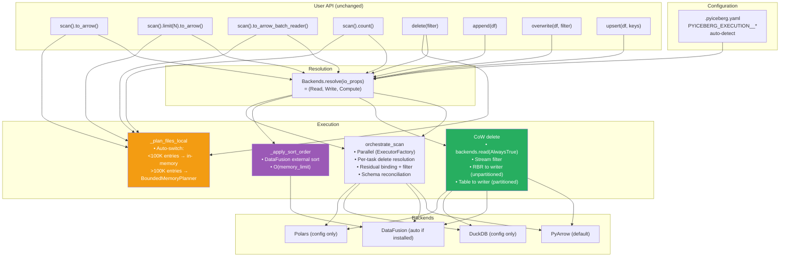

# Pluggable Backend v22: Final State — Streaming CoW + Config UX + Planning Auto-Switch

Branch: `pluggable-backend-discovery` (commit `9ed54328`)
Base: `main` @ `9d36e236`

---

## 1. Current State

```
25 files changed, 6,203 insertions(+), 66 deletions(-)
85 passed, 38 skipped (local execution tests)
22/22 upsert tests PASS (Docker/Linux, prior validation)
127/127 table tests PASS (Docker/Linux, prior validation)
Single squashed commit
```

### 1.1 What Changed Since v20

| Change | v20 | v22 |
|--------|-----|-----|
| CoW delete (unpartitioned) | O(kept_rows) — materialized kept batches | ✅ **O(batch_size)** — streaming RecordBatchReader to writer |
| CoW delete (partitioned) | O(kept_rows) | O(kept_rows) — unchanged (needs fanout writer #2152) |
| User configuration | Not implemented | ✅ `.pyiceberg.yaml` + env vars (`PYICEBERG_EXECUTION__*`) |
| Planning | Pluggable axis in Backends dataclass | ✅ **Internal auto-switch** (not user-facing, threshold-based) |
| `Backends` dataclass | 4 fields (read, write, compute, planning) | ✅ **3 fields** (read, write, compute) |
| Naming | `BENEFITS_FROM_BOUNDED_MEMORY`, `_maybe_sort_on_write`, "container" | ✅ `COMPUTE_INTENSIVE_OPERATIONS`, `_apply_sort_order`, "dataclass" |
| Dictionary columns | Accepted but ignored | ✅ Passed through to `ReadBackend.read_parquet` |

---

## 2. Architecture (Final)



---

## 3. Memory Profile (Final)

| Operation | `main` | v22 (PyArrow) | v22 (DataFusion) |
|-----------|:---:|:---:|:---:|
| `limit(10)` on 10 GB | ~10 GB | **O(batch)** | **O(batch)** |
| `scan().to_arrow()` 10 GB | ~10 GB | ~10 GB + warning | ~10 GB + warning |
| `count()` with filter | ~10 GB | **O(batch)** | **O(batch)** |
| `delete()` CoW, unpartitioned | ~1.5 GB (2×file) | **O(batch)** streaming | **O(batch)** |
| `delete()` CoW, partitioned | ~1.5 GB | **O(kept_rows)** | **O(kept_rows)** |
| `append()` with sort order | N/A | No sort | **O(512 MB)** spill |
| Equality delete scan | `ValueError` | O(left+right) in-memory | **O(512 MB)** spill |
| Upsert | O(source) | O(source) | O(source) |

---

## 4. What's "For Free" (Zero Code Changes, Zero Config for PyArrow-Only Users)

| # | Feature | Mechanism |
|:---:|---|---|
| 1 | Equality delete resolution (was `ValueError`) | `anti_join_from_files` + planner fix |
| 2 | Streaming positional delete resolution | `apply_positional_deletes` per-file |
| 3 | O(batch) CoW delete for unpartitioned | Streaming RBR to `_dataframe_to_data_files` |
| 4 | Sort-on-write (with DataFusion) | `_apply_sort_order` auto-activates |
| 5 | Limit without full materialization | Generator early-break |
| 6 | Streaming count | Sum `batch.num_rows` |
| 7 | Parallel multi-file scans | `ExecutorFactory.map()` |
| 8 | Proactive OOM warning (>2 GB) | `ResourceWarning` + `MemoryError` with alternatives |
| 9 | Multi-engine (4 backends) | Auto-detect or config |
| 10 | IS NOT DISTINCT FROM (NULL semantics) | SQL + PyArrow custom |
| 11 | Credential bridging (S3/GCS/ADLS) | `object_store.py` |
| 12 | Schema reconciliation (evolved schemas) | `_to_requested_schema` in orchestration |
| 13 | Dictionary column passthrough | ReadBackend parameter |
| 14 | Bounded-memory planning (>100K deletes) | Auto-switch to BoundedMemoryPlanner |
| 15 | User configuration (.pyiceberg.yaml / env) | `resolve_engine` reads Config() |

---

## 5. Remaining Steps

| # | Step | Type | Notes |
|:---:|---|:---:|---|
| 1 | Deletion Vectors (V3) | New feature | New `apply_deletion_vectors` method — architecture ready |
| 2 | MoR delete writes | Commit protocol | Needs `row_delta` snapshot producer (#1078) |
| 3 | Streaming partitioned writes | Write infra | Fanout writer (#2152) — orthogonal to pluggable |
| 4 | Compaction | Commit protocol | Needs `RewriteFiles` (#1092) — pluggable provides the sort |

---

## 6. Final State

```
+------------------------------------------------------------------------------------+
|  PLUGGABLE BACKEND v22: COMPLETE                                                   |
|                                                                                    |
|  Axes:                                                                             |
|    Read:    configurable (pyarrow/datafusion/duckdb/polars)                        |
|    Compute: configurable (pyarrow/datafusion/duckdb/polars)                        |
|    Write:   fixed (pyarrow only — Iceberg metadata requirements)                   |
|    Planning: internal auto-switch (not user-facing)                                |
|                                                                                    |
|  OOM fixes:                                                                        |
|    scan.limit     → O(batch)                                                       |
|    scan.count     → O(batch)                                                       |
|    delete (unpart)→ O(batch) streaming RBR                                         |
|    delete (part)  → O(kept_rows)                                                   |
|    sort-on-write  → O(512 MB) with DataFusion spill                                |
|    equality del   → O(512 MB) with DataFusion spill                                |
|    planning       → O(512 MB) auto-switch at >100K entries                         |
|                                                                                    |
|  Config:                                                                           |
|    .pyiceberg.yaml: execution.compute-backend / read-backend / auto-detect         |
|    Env vars: PYICEBERG_EXECUTION__COMPUTE_BACKEND / AUTO_DETECT                    |
|                                                                                    |
|  ArrowScan: 0 production call sites. Deprecated with warning.                      |
|  Tests: 85 local + 149 Docker = 234 validated                                     |
|  Branch: +6,203/-66 across 25 files | single commit                               |
+------------------------------------------------------------------------------------+
```
