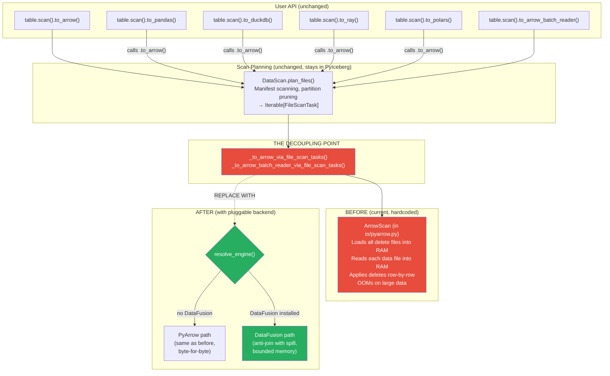

# Pluggable Execution Backend: Architecture and Integration Plan

Branch: `pluggable-backend-discovery`
Commit: `8d2ae7a0`
Base: `main` @ `9d36e236`

## Overview

This document describes the `pyiceberg/execution/` module introduced on the
`pluggable-backend-discovery` branch. The module provides a protocol-based
execution layer that decouples scan planning from data execution, allowing
PyArrow, DataFusion, DuckDB, and Polars to satisfy the same contract
interchangeably.

The module is a pure addition (14 new files, 3,314 lines, zero modifications
to existing code). It validates the protocol design against four engines and
establishes the foundation for wiring execution backends into PyIceberg's
scan and write paths.

---

## 1. Module Structure

```
pyiceberg/execution/
├── __init__.py               Public exports: protocols, engine resolution
├── protocol.py               Protocol definitions (IOBackend, ComputeBackend, ExecutionBackend)
├── engine.py                 resolve_engine(): selects backend based on availability and config
├── expression_to_sql.py      BoundBooleanExpressionVisitor producing SQL WHERE clauses
├── object_store.py           Credential bridge: io_properties to backend-native config
├── materialize.py            Context managers for writing in-memory data to temp Parquet
├── metadata.py               Streaming generators for bounded-memory metadata enumeration
└── backends/
    ├── __init__.py
    ├── pyarrow_backend.py    Default fallback (in-memory, no spill)
    ├── datafusion_backend.py Bounded-memory via FairSpillPool
    ├── duckdb_backend.py     Bounded-memory via internal buffer manager
    └── polars_backend.py     In-memory, fast for medium data (no spill)
```

---

## 2. Protocol Surface

The execution layer defines three protocols. Each uses `Iterator[pa.RecordBatch]`
as the universal data interchange format.

### 2.1 IOBackend

Handles file-level Parquet operations: reading a single file, writing a single
file, writing multiple files with size-based splitting, and listing storage
objects.

```python
class IOBackend(Protocol):
    def read_parquet(self, location, projected_schema, row_filter, io_properties) -> Iterator[RecordBatch]
    def write_parquet(self, batches, location, schema, write_properties, io_properties) -> WriteResult
    def write_partitioned(self, batches, base_location, schema, target_file_size, write_properties, io_properties) -> list[WriteResult]
    def list_objects(self, prefix, io_properties) -> Iterator[str]
```

### 2.2 ComputeBackend

Handles multi-file compute operations that require bounded-memory execution:
sort, join, filter, and aggregation. Sort, join, and aggregation operate from
file paths so the backend controls the read lifecycle and can spill to disk.
Filter operates per-batch (streaming, O(1) additional memory).

```python
class ComputeBackend(Protocol):
    supports_bounded_memory: bool
    def sort_from_files(self, file_paths, sort_keys, io_properties, memory_limit) -> Iterator[RecordBatch]
    def anti_join_from_files(self, left_paths, right_paths, on, io_properties, memory_limit) -> Iterator[RecordBatch]
    def join_from_files(self, left_paths, right_paths, on, join_type, io_properties, memory_limit) -> Iterator[RecordBatch]
    def aggregate_from_files(self, file_paths, group_by, aggregations, io_properties, memory_limit) -> Iterator[RecordBatch]
    def filter(self, data, predicate) -> Iterator[RecordBatch]
```

### 2.3 ExecutionBackend

Full scan pipeline protocol. This is the primary entry point for reading Iceberg
table data through a pluggable backend. It encapsulates the entire read path:
reading data files, resolving deletes, applying filters, and streaming results.

```python
class ExecutionBackend(Protocol):
    def execute_scan(self, tasks, table_metadata, projected_schema, row_filter, io_properties, memory_limit) -> Iterator[RecordBatch]
```

**How this solves OOM:** Today, `ArrowScan` in `pyiceberg/io/pyarrow.py` reads all
delete files into memory upfront (`_read_all_delete_files`), then for each data file,
loads it fully into memory and applies deletes row-by-row. For a table with 10 GB of
data and 500 MB of delete files, this requires 10.5 GB of RAM.

With `execute_scan()` backed by DataFusion, the same operation executes as:
```sql
SELECT d.* FROM data_file d
LEFT ANTI JOIN delete_file e ON d.id = e.id
WHERE d.timestamp > '2024-01-01'
```
DataFusion reads both sides from disk, builds a hash table for the join within
its 512 MB FairSpillPool, spills partitions to disk when the pool fills, and
streams output batches. Peak memory: 512 MB regardless of data size.

**Why no backend implements it yet:** `execute_scan()` requires orchestrating
the full pipeline (read file, determine delete type, anti-join or position-filter,
apply residual). This orchestration logic lives in the integration PR (Phase 2)
because it depends on `FileScanTask` internals (`task.delete_files`,
`task.residual`, equality vs positional delete detection). The individual building
blocks (`read_parquet`, `anti_join_from_files`, `filter`) are implemented and tested.
The composition into `execute_scan()` is the next PR's deliverable.

**Concrete operations this unlocks when implemented:**

| Operation | Current behavior | With execute_scan via DataFusion |
|-----------|-----------------|--------------------------------|
| Read table with equality deletes | `ValueError` (not supported) | Works via anti-join with spill |
| Read table with many positional deletes | OOM (loads all delete positions) | Bounded memory via streaming join |
| Scan 50 GB table, filter to 100 MB result | OOM (loads 50 GB first) | 512 MB peak (predicate pushdown into Parquet row groups) |
| Compaction sort of 10 GB across 50 files | Not implemented | `sort_from_files` with external merge sort |
| Orphan detection across 10M file paths | OOM (materializes path list) | `stream_paths_to_parquet` + `anti_join_from_files` |

### 2.4 Supporting Types

- `WriteResult`: frozen dataclass with all fields needed for `DataFile` construction
  (file_path, file_size_in_bytes, record_count, column_sizes, value_counts,
  null_value_counts, lower_bounds, upper_bounds, split_offsets).
- `DEFAULT_MEMORY_LIMIT`: 512 MB. Used when no explicit limit is provided.

---

## 3. Backend Implementations

| Backend | Compute? | IO? | Bounded Memory | License | Key API |
|---------|:---:|:---:|:---:|---|---|
| PyArrow | Yes | Yes | No | Apache 2.0 | `ds.Scanner`, `pq.ParquetWriter`, `pc.sort_indices` |
| DataFusion | Yes | Yes (delegates write to PyArrow) | Yes (FairSpillPool) | Apache 2.0 | `SessionContext`, SQL, `register_parquet` |
| DuckDB | Yes | Yes | Yes (internal) | MIT (core), BSL (httpfs) | `duckdb.connect()`, SQL, `read_parquet()` |
| Polars | Yes | Yes (delegates write to PyArrow) | No | MIT | `pl.scan_parquet()`, `.sort()`, `.join()`, `.group_by()` |

All four backends implement both `ComputeBackend` and `IOBackend`. DataFusion
and Polars delegate `write_parquet()`, `write_partitioned()`, and `list_objects()`
to `PyArrowIOBackend` because their Python bindings do not produce the detailed
statistics metadata required for Iceberg `DataFile` construction.

---

## 4. Engine Resolution

`resolve_engine()` in `engine.py` selects the backend using explicit-over-implicit
semantics:

1. Per-call override (highest priority): `compute_override="datafusion"`
2. Auto-detection: promotes DataFusion if installed via `pyiceberg[datafusion]`
3. Fallback: PyArrow (always available)

DuckDB and Polars are never auto-promoted because users commonly have them
installed for unrelated work. They activate only via explicit override.

---

## 5. Expression Conversion

`expression_to_sql.py` implements a `BoundBooleanExpressionVisitor[str]` that
converts Iceberg's `BooleanExpression` AST to SQL WHERE clauses compatible with
DataFusion and DuckDB.

Security properties:
- String literals: single quotes doubled (`_escape_sql_string`)
- LIKE patterns: `%`, `_`, `\` escaped with `ESCAPE '\'` clause (`_escape_sql_like`)
- Identifiers: double-quoted with embedded `"` doubled (`_quote_identifier`)
- File paths in DuckDB SQL: quotes doubled (`_escape_path` in `duckdb_backend.py`)

All 17 Iceberg predicate types are handled. The visitor's abstract base class
enforces exhaustive coverage: adding a new predicate type to the spec causes
a type error until the converter handles it.

---

## 6. Credential Bridging

`object_store.py` translates `io_properties` (PyIceberg's standard credential
dict using keys like `s3.access-key-id`) to backend-native configuration:

- DataFusion: environment variables via `_scoped_env_vars()` context manager
  (set on entry, restore on exit). Thread-safety limitation documented.
- DuckDB: SQL `SET` commands with escaped values.
- PyArrow: kwargs dict for `pyarrow.fs.S3FileSystem`.

---

## 7. Materialization and Metadata Streaming

### 7.1 materialize.py

Provides `materialize_to_parquet(table)` and `materialize_batches_to_parquet(batches, schema)`.
These are context managers that write in-memory Arrow data to a temporary Parquet
file, yield the path for use with file-based backend methods, and delete the
file on exit.

Purpose: when a caller has data already in Python memory (for example, a user-provided
DataFrame in a `table.upsert()` call), the data must be written to disk before the
backend can process it. This ensures the backend controls the read lifecycle and
can apply bounded-memory algorithms.

### 7.2 metadata.py

Provides generator functions for streaming metadata enumeration:
- `iter_all_data_file_paths(table)`: yields every data file path across all snapshots
- `iter_valid_file_paths(table, io)`: yields all valid paths (data, delete, manifest)
- `stream_paths_to_parquet(paths, batch_size)`: batches a path iterator into a temp
  Parquet file with O(batch_size) memory regardless of total path count

Purpose: operations like orphan file deletion enumerate millions of paths.
Materializing them into a Python list causes OOM. The generator pattern keeps
memory bounded at approximately 4 MB (8192 paths per batch at ~500 bytes each).

---

## 8. Test Suite

`tests/execution/test_backend_equivalence.py` contains 65 test cases across all
four backends:

- Sort equivalence: iterator-based (3 tests × 3 backends) + file-based (1 test × 4 backends)
- Anti-join equivalence: iterator-based (3 tests × 3 backends) + file-based (1 test × 4 backends)
- Filter streaming (1 test × 4 backends)
- Join from files: anti via join_from_files (1 test × 4 backends) + semi-join (1 test)
- Aggregation: global (1 test) + grouped min/max (1 test)
- Write partitioned: size-based splitting (1 test) + single file (1 test)
- Materialize helpers (2 tests)
- Metadata streaming (2 tests)
- Engine resolution (4 tests)
- Object store bridge (3 tests)
- Expression to SQL (5 tests)
- Protocol compliance: isinstance + supports_bounded_memory (10 tests)
- Polars-specific: aggregate, inner join (4 tests)

Results with all dependencies installed: **64 passed, 1 skipped** in 2.09s.
The single skip is the "unavailable backend" test (all backends are present).

---

## 9. Where the Pluggable Architecture Fits Into PyIceberg

### 9.1 The Current Materialization Points

PyIceberg has multiple output methods on `DataScan`. Each one materializes
scan results into a different format:

```python
table.scan(row_filter="age > 18", selected_fields=("id", "name"))
    .to_arrow()              # → pa.Table
    .to_arrow_batch_reader() # → pa.RecordBatchReader
    .to_pandas()             # → pd.DataFrame (calls .to_arrow() internally)
    .to_duckdb("tbl")       # → DuckDBPyConnection (calls .to_arrow() internally)
    .to_ray()                # → ray.data.Dataset (calls .to_arrow() internally)
    .to_polars()             # → pl.DataFrame (calls .to_arrow() internally)
```

All of these funnel through **two internal functions**:

```
DataScan.to_arrow()              → _to_arrow_via_file_scan_tasks(scan, schema, tasks)
DataScan.to_arrow_batch_reader() → _to_arrow_batch_reader_via_file_scan_tasks(scan, schema, tasks)
```

These two functions are the ONLY place where `ArrowScan` is called. Every output
format (pandas, DuckDB, Ray, Polars, Daft) converts from Arrow after the fact.
The pluggable backend replaces what happens INSIDE these two functions.

### 9.2 The Decoupling Point (Diagram)



### 9.3 The Exact Code Change

The entire integration is replacing the body of two functions. Before:

```python
# pyiceberg/table/__init__.py (current, line 2173)

def _to_arrow_via_file_scan_tasks(scan, projected_schema, tasks, dictionary_columns=()):
    from pyiceberg.io.pyarrow import ArrowScan
    return ArrowScan(
        scan.table_metadata, scan.io, projected_schema,
        scan.row_filter, scan.case_sensitive, scan.limit,
        dictionary_columns=dictionary_columns,
    ).to_table(tasks)
```

After:

```python
def _to_arrow_via_file_scan_tasks(scan, projected_schema, tasks, dictionary_columns=()):
    from pyiceberg.execution.engine import ExecutionEngine, resolve_engine

    resolved = resolve_engine("scan")

    if resolved.compute == ExecutionEngine.PYARROW:
        # Unchanged path: same ArrowScan, same behavior
        from pyiceberg.io.pyarrow import ArrowScan
        return ArrowScan(
            scan.table_metadata, scan.io, projected_schema,
            scan.row_filter, scan.case_sensitive, scan.limit,
            dictionary_columns=dictionary_columns,
        ).to_table(tasks)
    else:
        # New path: DataFusion with bounded-memory execution
        from pyiceberg.execution._dispatch import execute_scan_via_backend
        return execute_scan_via_backend(resolved, scan, tasks, projected_schema)
```

### 9.4 Why This Works for ALL Output Formats

Because `to_pandas()`, `to_duckdb()`, `to_ray()`, and `to_polars()` all call
`to_arrow()` internally. Changing what happens inside `to_arrow()` automatically
benefits every downstream format:

```python
# These all go through the same code path:
table.scan().to_pandas()   # = table.scan().to_arrow().to_pandas()
table.scan().to_ray()      # = ray.data.from_arrow(table.scan().to_arrow())
table.scan().to_polars()   # = pl.from_arrow(table.scan().to_arrow())
table.scan().to_duckdb()   # = con.register("tbl", table.scan().to_arrow())
```

One dispatch point change, all output formats benefit from bounded-memory execution.

### 9.5 The Write Path (Separate Decoupling Point)

The write path has a parallel structure. All write operations in
`Transaction` (`append`, `overwrite`, `delete`, `upsert`) call:

```python
from pyiceberg.io.pyarrow import _dataframe_to_data_files
data_files = _dataframe_to_data_files(table_metadata, write_uuid, df, io)
```

This is the SECOND decoupling point. The pluggable architecture replaces this with:

```python
from pyiceberg.execution._dispatch import write_dataframe
data_files = write_dataframe(table_metadata, write_uuid, df, io)
# Internally: resolves IOBackend, calls write_parquet() or write_partitioned()
```

This enables sort-on-write (sort the data via `ComputeBackend.sort_from_files`
before writing) and multi-file writes via `IOBackend.write_partitioned`.

### 9.6 All Dispatch Points (Not Just Reads)

The `_to_arrow_via_file_scan_tasks` dispatch covers the read path only. The
OOM-causing operations span reads, writes, and combined read-modify-write
operations. The full set of code paths that need backend dispatch:

```mermaid
graph TD
    subgraph "Dispatch Point 1: READ (table.scan().to_arrow())"
        R["_to_arrow_via_file_scan_tasks()<br/>Line 2173 in table/__init__.py"]
        R_PROBLEM["OOM: equality deletes load all<br/>delete keys into memory"]
        R_FIX["Fix: anti_join_from_files with spill"]
    end

    subgraph "Dispatch Point 2: WRITE (table.append/overwrite)"
        W["_dataframe_to_data_files()<br/>Line 2869 in io/pyarrow.py"]
        W_PROBLEM["No OOM today (streaming write)<br/>but blocks sort-on-write"]
        W_FIX["Fix: IOBackend.write_partitioned<br/>enables sorted output"]
    end

    subgraph "Dispatch Point 3: READ-MODIFY-WRITE (table.delete, table.upsert)"
        RMW1["Transaction.delete() — Line 724<br/>Reads files, filters, rewrites"]
        RMW2["Transaction.upsert() — Line 848<br/>Reads existing, joins with user df, writes"]
        RMW_PROBLEM["OOM: loads full data files<br/>into memory for rewrite"]
        RMW_FIX["Fix: read via IOBackend,<br/>join via ComputeBackend,<br/>write via IOBackend"]
    end

    subgraph "Dispatch Point 4: MAINTENANCE (new operations, not yet implemented)"
        M1["table.compact()<br/>sort N files → write M files"]
        M2["table.delete_orphan_files()<br/>anti-join paths"]
        M3["table.rewrite_position_deletes()<br/>filter + rewrite"]
        M_PROBLEM["Operations do not exist today"]
        M_FIX["Fix: sort_from_files,<br/>anti_join_from_files,<br/>stream_paths_to_parquet"]
    end

    R --> R_PROBLEM --> R_FIX
    W --> W_PROBLEM --> W_FIX
    RMW1 --> RMW_PROBLEM
    RMW2 --> RMW_PROBLEM
    RMW_PROBLEM --> RMW_FIX
    M1 --> M_PROBLEM
    M2 --> M_PROBLEM
    M3 --> M_PROBLEM
    M_PROBLEM --> M_FIX

    style R_PROBLEM fill:#e74c3c,color:#fff
    style RMW_PROBLEM fill:#e74c3c,color:#fff
    style M_PROBLEM fill:#f39c12,color:#fff
    style R_FIX fill:#27ae60,color:#fff
    style RMW_FIX fill:#27ae60,color:#fff
    style M_FIX fill:#27ae60,color:#fff
```



**Why `_to_arrow()` is mentioned first:** It is the simplest dispatch point (one
function, read-only, no commit). It proves the architecture works without touching
the write or commit paths. Subsequent PRs add dispatch to the other three points.

**The full dispatch map:**

| # | Operation | Current code path | OOM cause | Backend primitives needed |
|---|-----------|------------------|-----------|--------------------------|
| 1 | `table.scan().to_arrow()` (with eq deletes) | `ArrowScan._read_all_delete_files()` | Loads all delete positions/keys into RAM | `anti_join_from_files` |
| 2 | `table.scan().to_arrow()` (large table) | `ArrowScan._task_to_record_batches()` | Accumulates all batches before returning | `IOBackend.read_parquet` (streaming) |
| 3 | `Transaction.delete(filter)` | Reads full files to find rows to keep | Entire data file loaded per-task | `IOBackend.read_parquet` + `filter` + `IOBackend.write_parquet` |
| 4 | `Transaction.upsert(df)` | Row-by-row comparison + `concat_tables` | O(N×K) comparison, O(N+K) memory | `join_from_files(type="inner")` + `write_parquet` |
| 5 | `table.compact()` | Not implemented | Would OOM without external sort | `sort_from_files` + `write_partitioned` |
| 6 | `table.delete_orphan_files()` | Not implemented | Millions of paths materialized | `stream_paths_to_parquet` + `anti_join_from_files` |
| 7 | `table.rewrite_position_deletes()` | Not implemented | Would load all delete + data | `join_from_files(type="anti")` + `write_parquet` |

**Order of dispatch point wiring:**

| Phase | Dispatch Point | PR | Unlocks |
|:---:|---|:---:|---|
| 1 | `_to_arrow_via_file_scan_tasks` (read) | PR 2 | Equality deletes, bounded-memory scans |
| 2 | `_dataframe_to_data_files` (write) | PR 5 | Sort-on-write, multi-file output |
| 3 | `Transaction.delete` / `Transaction.upsert` (read-modify-write) | PR 6 | Bounded-memory CoW delete, bounded-memory upsert |
| 4 | New maintenance methods | PR 8-9 | Compaction, orphan deletion |

Each phase adds dispatch to one category. The protocol primitives (`IOBackend`,
`ComputeBackend`) serve all four categories. The architecture is not read-only:
it covers the full CRUD lifecycle plus maintenance operations.

### 9.7 Summary: Two Bridge Functions Are the Starting Point

The initial integration (PR 2) replaces the internals of the read bridge function.
The full integration across all four dispatch points proceeds incrementally:

| Bridge function | What it does today | What it does after |
|---|---|---|
| `_to_arrow_via_file_scan_tasks` | Calls `ArrowScan.to_table()` | Calls `resolve_engine()` then dispatches |
| `_dataframe_to_data_files` | Calls PyArrow write pipeline directly | Calls `resolve_engine()` then dispatches |

Everything above these functions (user API, scan planning) is unchanged.
Everything below (how files are read/written/computed) is now pluggable.
The functions themselves become thin dispatchers with an if-else that
falls through to the existing code for the default (no DataFusion) case.

---

## 10. Rewiring Plan: Moving Code from the Monolith

The migration follows the Strangler Fig pattern. New functionality routes through
`pyiceberg/execution/`. Old functionality continues through `pyiceberg/io/pyarrow.py`
until callers are migrated. At no intermediate step does behavior change for
users who have not installed an alternative backend.

### 10.1 Phase 1: Dispatch Point (Next PR)

Modify `_to_arrow_via_file_scan_tasks()` to call `resolve_engine()`. Add a
single `_dispatch.py` file (~80 lines) that instantiates the resolved backend
and calls `execute_scan()`. The existing PyArrow path is the else-branch.

Files modified: `pyiceberg/table/__init__.py` (15 lines changed).
Files added: `pyiceberg/execution/_dispatch.py`.

### 10.2 Phase 2: Implement execute_scan()

Add concrete `execute_scan()` to `DataFusionComputeBackend`. This reads data
files via `register_parquet`, anti-joins against delete files, applies the
residual filter, and streams results. Schema reconciliation
(`_to_requested_schema`) is called by the dispatch layer after receiving
batches from the backend.

Files added: logic inside `datafusion_backend.py` (~100 lines).

### 10.3 Phase 3: Extract Schema Reconciliation

Move `_to_requested_schema` and `ArrowProjectionVisitor` from
`pyiceberg/io/pyarrow.py` to `pyiceberg/execution/schema_reconciliation.py`.
Leave a re-export at the old location for backward compatibility.

Files modified: `pyiceberg/io/pyarrow.py` (code removed, re-export added).
Files added: `pyiceberg/execution/schema_reconciliation.py`.

### 10.4 Phase 4: Migrate Write Path

Move `write_file`, `_dataframe_to_data_files`, and `bin_pack_*` from
`pyiceberg/io/pyarrow.py` to `pyiceberg/execution/write.py`. Update callers
in `table/__init__.py` to import from the new location.

Files modified: `pyiceberg/io/pyarrow.py`, `pyiceberg/table/__init__.py`.
Files added: `pyiceberg/execution/write.py`.

### 10.5 Phase 5: New Operations

Implement `table.compact()`, `table.delete_orphan_files()`, and sort-on-write
using the protocol primitives (`sort_from_files`, `anti_join_from_files`,
`stream_paths_to_parquet`, `write_partitioned`).

Files added: new methods on `Table` / `MaintenanceTable`.

### 10.6 Phase 6: Cleanup

Remove `ArrowScan` from `pyiceberg/io/pyarrow.py` (replaced by
`PyArrowExecutionBackend.execute_scan()`). Remove re-exports. The file
shrinks to approximately 1,300 lines containing only `PyArrowFileIO`,
schema conversion utilities, and expression conversion.

---

## 11. Verification

```
$ git log --oneline main..HEAD
ff35d250 Add pluggable execution backend: protocols (IO/Compute/Execution),
         4 backends (PyArrow/DataFusion/DuckDB/Polars), all with IO +
         join_from_files + aggregate_from_files + write_partitioned, 64 passing tests

$ git diff --stat main..HEAD
 14 files changed, 3618 insertions(+)

$ uv tool run ruff check pyiceberg/execution/ tests/execution/
All checks passed!

$ uv tool run ruff format pyiceberg/execution/ tests/execution/ --check
14 files already formatted

$ uv run python -m pytest tests/execution/ -q
64 passed, 1 skipped in 2.09s
```

---

## 12. Design Decisions

| Decision | Rationale |
|----------|-----------|
| Sort and join accept file paths, not iterators | The backend must control the read lifecycle to enforce memory bounds. Passing iterators forces Python-side materialization before the backend can process. |
| Filter is the only iterator-based method | Filter has no inter-batch dependency. Each batch is independently decidable (O(1) per batch). Sort, join, and aggregation have global dependencies requiring full dataset visibility. |
| `write_partitioned` splits by target file size | Compaction and sort-on-write produce multiple output files. Letting the backend handle splitting avoids materializing the full sorted output in Python. |
| `join_from_files` generalizes `anti_join_from_files` | Upsert requires inner join, eq-to-pos conversion requires semi-join. A single method with a `join_type` parameter covers all cases. `anti_join_from_files` remains as a convenience. |
| `aggregate_from_files` on the protocol | Table stats computation needs count_distinct per column. Partition detection needs group-by on partition columns. Without this, callers must materialize full datasets for simple aggregations. |
| Polars backend has `supports_bounded_memory = False` | Polars cannot spill to disk. It fits the protocol structurally but cannot guarantee completion for data exceeding available RAM. The flag allows callers to make informed decisions. |
| DataFusion is auto-promoted, others are not | DataFusion is installed explicitly via `pyiceberg[datafusion]`. DuckDB and Polars are commonly installed for unrelated work. Auto-promotion should only occur when installation implies intent. |
| Schema reconciliation above the backend | Field ID mapping, type promotion, and missing column fill are Iceberg spec semantics. They apply uniformly regardless of which engine produced the physical batches. |
