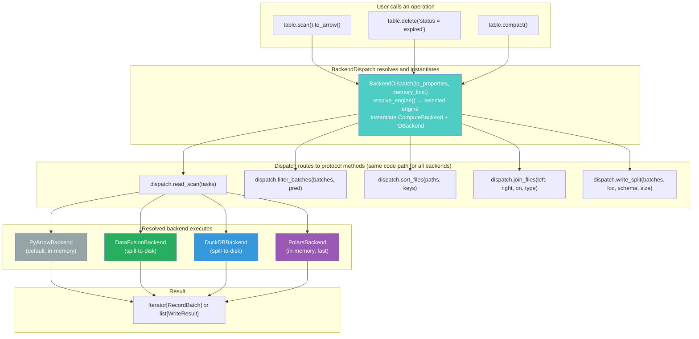
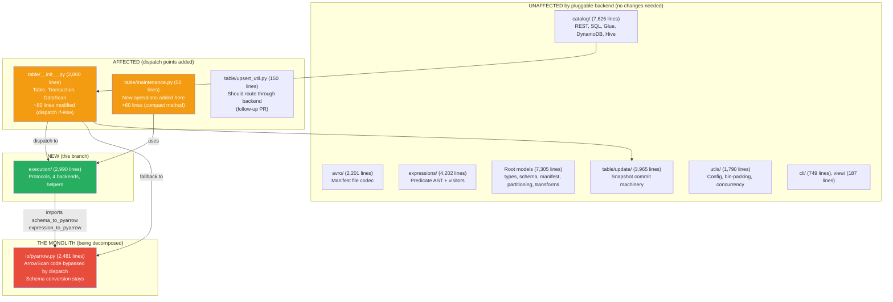

# Pluggable Backend: Complete Dispatch Point Analysis

Branch: `pluggable-backend-discovery` (commit `ff35d250`)

## Overview

This document examines every code path in PyIceberg that performs data execution
(read, write, or compute) and identifies where backend dispatch must be inserted.
The goal is a single PR that wires all dispatch points simultaneously, introducing
the pluggable architecture and adding at least one new operation that was previously
impossible due to OOM.

---

## 1. Complete Inventory of Data Execution Code Paths

Every place in `pyiceberg/table/__init__.py` that imports from `pyiceberg/io/pyarrow.py`
represents a coupling point that should route through the execution backend:

### 1.1 Read Paths

| Location | Function | What it does | OOM Risk |
|----------|----------|-------------|:---:|
| Line 2173 | `_to_arrow_via_file_scan_tasks()` | Materializes scan results via ArrowScan | High (eq deletes, large scans) |
| Line 2191 | `_to_arrow_batch_reader_via_file_scan_tasks()` | Streams scan results via ArrowScan | High (eq deletes) |
| Line 760 | Inside `Transaction.delete()` | Reads full files for CoW rewrite | High (loads full file per task) |
| Line 893 | Inside `Transaction.upsert()` | Scans matched rows via `to_arrow_batch_reader()` | Medium (filtered scan) |

### 1.2 Write Paths

| Location | Function | What it does | OOM Risk |
|----------|----------|-------------|:---:|
| Line 515 | `Transaction.append()` | `_dataframe_to_data_files(df)` | Low (streaming write) |
| Line 561 | `Transaction.overwrite()` | `_dataframe_to_data_files(df)` | Low (streaming write) |
| Line 672 | `Transaction.overwrite()` (RecordBatchReader) | `_dataframe_to_data_files(df)` | Low |
| Line 776 | Inside `Transaction.delete()` | `_dataframe_to_data_files(filtered_df)` | Low (already filtered) |

### 1.3 Compute Paths (within read-modify-write)

| Location | What it does | OOM Risk |
|----------|-------------|:---:|
| Line 741 | `_expression_to_complementary_pyarrow()` in delete() | Expression conversion (trivial) |
| Line 925 | `expression_to_pyarrow()` in upsert() | Expression conversion (trivial) |
| Line 928 | `rows_to_insert.filter(~expr_match_arrow)` in upsert() | In-memory filter (proportional to df size) |
| Line 933 | `pa.concat_tables(batches_to_overwrite)` in upsert() | Materializes all matched rows | High |

### 1.4 Operations That Do Not Exist Yet

| Operation | What it would do | Backend primitives needed |
|-----------|-----------------|--------------------------|
| `table.compact()` | Read N files, sort, write M files | `sort_from_files` + `write_partitioned` |
| `table.delete_orphan_files()` | Enumerate all paths, anti-join with storage listing | `stream_paths_to_parquet` + `anti_join_from_files` |
| `table.rewrite_position_deletes()` | Read data + pos deletes, filter, rewrite clean | `join_from_files("anti")` + `write_partitioned` |
| `table.rewrite_equality_deletes()` | Convert eq deletes to pos deletes | `join_from_files("semi")` + `write_parquet` |

---

## 2. The OOM Root Causes (Why Each Path Breaks)

### 2.1 Transaction.delete() (CoW rewrite)

```python
# Line 760-776: For EACH affected file:
df = ArrowScan(...).to_table(tasks=[original_file])   # loads ENTIRE file into RAM
filtered_df = df.filter(preserve_row_filter)           # filter in-memory
_dataframe_to_data_files(df=filtered_df, ...)         # write filtered result
```

A single Parquet data file is typically 128 MB to 1 GB. If the delete filter matches
files across many partitions, this loop loads one file at a time but each file must
fit in RAM. For a 1 GB file, this requires 1 GB peak memory per iteration.

**With pluggable backend:** DataFusion reads the file with predicate pushdown (skips
non-matching row groups), filters in streaming mode, and writes the result. Peak
memory is O(batch_size), not O(file_size).

### 2.2 Transaction.upsert() (join + filter + concat)

```python
# Line 893-933: Scans matched rows, then for each batch:
rows_to_update = upsert_util.get_rows_to_update(df, rows, join_cols)  # in-memory join comparison
rows_to_insert = rows_to_insert.filter(~expr_match_arrow)             # in-memory filter
# Finally:
rows_to_update = pa.concat_tables(batches_to_overwrite)                # materializes ALL updates
```

For a large upsert (millions of rows against a large table), the `concat_tables`
at the end materializes all matched rows. If 50% of a 10 GB table matches, that is
5 GB in RAM at the concat step.

**With pluggable backend:** The join happens via `join_from_files("inner")` with spill.
The concat is replaced by streaming writes via `write_partitioned`.

### 2.3 Scan with equality deletes (ArrowScan._read_all_delete_files)

```python
# Inside ArrowScan.to_record_batches():
deletes_per_file = _read_all_delete_files(self._io, tasks)  # loads ALL delete files upfront
```

For a table with 500 MB of equality delete files (common in Flink-written tables),
this loads 500 MB of delete keys into a Python dict before reading any data. Then for
each data batch, it checks row-by-row against the delete dict.

**With pluggable backend:** DataFusion executes `LEFT ANTI JOIN` between data and
delete files using Grace Hash Join with spill. Peak memory: configured budget (512 MB).

### 2.4 Compaction (not implemented)

Does not exist today. Requires reading potentially 50 GB of small files, sorting them
by a key, and writing larger output files. Impossible without external merge sort.

**With pluggable backend:** `sort_from_files(50 paths)` executes external merge sort
within the memory budget. `write_partitioned(sorted_batches)` splits output at target size.

---

## 3. Strategy: All Dispatch Points in One PR

### 3.1 Why Wire Everything at Once

Wiring only the read path (dispatch point 1) leaves the OOM-prone write and
read-modify-write paths unchanged. The first new operation (compaction) needs
ALL of: read from files, sort with spill, and write multiple output files.
Introducing only partial dispatch delays the first user-visible improvement.

A single PR that wires all dispatch points means:
- One review cycle for the architectural concept (not five)
- The first PR can include `table.compact()` as proof of value
- All code paths benefit from DataFusion simultaneously

### 3.2 The Unified Dispatch Module

Instead of modifying each call site individually, introduce a single dispatch module
that encapsulates all backend operations:

```python
# pyiceberg/execution/_dispatch.py

class BackendDispatch:
    """Unified dispatch for all backend operations.

    Created once per table operation. Resolves the engine, instantiates backends,
    and provides methods for each operation type.
    """

    def __init__(self, io_properties: Properties, memory_limit: int | None = None):
        from pyiceberg.execution.engine import resolve_engine
        self._resolved = resolve_engine("operation")
        self._io_properties = io_properties
        self._memory_limit = memory_limit
        self._compute = self._instantiate_compute()
        self._io = self._instantiate_io()

    def read_scan(self, tasks, table_metadata, projected_schema, row_filter) -> Iterator[pa.RecordBatch]:
        """Full scan execution: read + delete resolution + filter."""
        ...

    def read_file(self, path, schema, filter) -> Iterator[pa.RecordBatch]:
        """Read a single Parquet file with projection and filter pushdown."""
        return self._io.read_parquet(path, schema, filter, self._io_properties)

    def filter_batches(self, batches, predicate) -> Iterator[pa.RecordBatch]:
        """Stream-filter batches by predicate."""
        return self._compute.filter(batches, predicate)

    def sort_files(self, paths, keys) -> Iterator[pa.RecordBatch]:
        """Sort data from files with bounded memory."""
        return self._compute.sort_from_files(paths, keys, self._io_properties, self._memory_limit)

    def join_files(self, left_paths, right_paths, on, join_type) -> Iterator[pa.RecordBatch]:
        """Join data from files with bounded memory."""
        return self._compute.join_from_files(
            left_paths, right_paths, on, join_type, self._io_properties, self._memory_limit
        )

    def write_file(self, batches, location, schema, props) -> WriteResult:
        """Write batches to a single Parquet file."""
        return self._io.write_parquet(batches, location, schema, props, self._io_properties)

    def write_split(self, batches, base_location, schema, target_size, props) -> list[WriteResult]:
        """Write batches to multiple files, splitting at target size."""
        return self._io.write_partitioned(
            batches, base_location, schema, target_size, props, self._io_properties
        )

    def anti_join_paths(self, left_paths, right_paths, on) -> Iterator[pa.RecordBatch]:
        """Anti-join for orphan detection and delete resolution."""
        return self._compute.anti_join_from_files(
            left_paths, right_paths, on, self._io_properties, self._memory_limit
        )
```

### 3.3 How Each Call Site Changes

**Read path (`_to_arrow_via_file_scan_tasks`):**
```python
# Before:
from pyiceberg.io.pyarrow import ArrowScan
return ArrowScan(...).to_table(tasks)

# After:
dispatch = BackendDispatch(scan.io.properties)
batches = dispatch.read_scan(tasks, table_metadata, projected_schema, row_filter)
return pa.Table.from_batches(list(batches))
```

**CoW delete (`Transaction.delete`):**
```python
# Before:
df = ArrowScan(...).to_table(tasks=[original_file])
filtered_df = df.filter(preserve_row_filter)
data_files = _dataframe_to_data_files(df=filtered_df, ...)

# After:
dispatch = BackendDispatch(self._table.io.properties)
batches = dispatch.read_file(original_file.file.file_path, schema, AlwaysTrue())
filtered = dispatch.filter_batches(batches, preserve_row_filter_as_iceberg_expr)
data_files = dispatch.write_split(filtered, output_location, schema, target_size, props)
```

**Upsert (`Transaction.upsert`):**
```python
# Before:
matched_iceberg_record_batches = matched_scan.to_arrow_batch_reader()
# ... per-batch join logic with concat_tables ...

# After:
dispatch = BackendDispatch(self._table.io.properties)
# Write user df to temp, join against matched files
with materialize_to_parquet(df) as user_tmp:
    matched_file_paths = [t.file.file_path for t in matched_scan.plan_files()]
    rows_to_update = dispatch.join_files([user_tmp], matched_file_paths, join_cols, "inner")
    rows_to_insert = dispatch.join_files([user_tmp], matched_file_paths, join_cols, "anti")
    # write results
```

**Compaction (NEW operation):**
```python
def compact(self, partition_filter=None, target_file_size=None, sort_order=None):
    """Compact small files into larger sorted files."""
    dispatch = BackendDispatch(self.io.properties)
    if not dispatch.supports_bounded_memory:
        raise ImportError(
            "table.compact() requires bounded-memory execution. "
            "Install with: pip install 'pyiceberg[datafusion]'"
        )

    files_to_compact = self._select_files_for_compaction(partition_filter)
    paths = [f.file_path for f in files_to_compact]

    sort_keys = sort_order or self.metadata.default_sort_order
    sorted_batches = dispatch.sort_files(paths, sort_keys)

    target_size = target_file_size or self._target_file_size()
    new_files = dispatch.write_split(sorted_batches, self._data_location(), schema, target_size, {})

    # Commit: replace old files with new files
    with self.transaction() as txn:
        with txn.update_snapshot().overwrite() as overwrite:
            for old_file in files_to_compact:
                overwrite.delete_data_file(old_file)
            for new_result in new_files:
                overwrite.append_data_file(self._write_result_to_data_file(new_result))
```

---

## 4. The First PR: What Ships Together

### 4.1 Contents

| Component | Lines (est.) | Purpose |
|-----------|:---:|---|
| `pyiceberg/execution/` (on branch) | 3,618 | Protocol + 4 backends + helpers + tests |
| `pyiceberg/execution/_dispatch.py` (new) | ~120 | `BackendDispatch` unified dispatch class |
| `pyiceberg/table/__init__.py` changes | ~80 | Dispatch points in `_to_arrow_*`, `delete`, `upsert` |
| `pyiceberg/table/maintenance.py` additions | ~60 | `compact()` method |
| Tests | ~100 | Integration tests for dispatch + compaction test |

Total new code: ~3,980 lines (3,618 on branch + ~360 new).
Modified existing code: ~80 lines (dispatch if-else wrappers).

### 4.2 What Users Get From This One PR

| Operation | Before | After |
|-----------|--------|-------|
| `table.scan().to_arrow()` with equality deletes | `ValueError` | Works |
| `table.scan().to_arrow()` on large tables | OOM | Bounded memory (with DataFusion) |
| `table.delete(filter)` on large files | OOM per file | Streaming filter + write |
| `table.compact()` | Does not exist | Works with bounded-memory sort |
| Default behavior (no DataFusion) | Everything works | Identical, unchanged |

### 4.3 What Remains for Follow-Up PRs

| Operation | Why deferred |
|-----------|-------------|
| `table.upsert()` via backend | Requires reworking the per-batch join logic (complex) |
| `table.delete_orphan_files()` | Requires `list_objects` integration with catalog metadata |
| `table.rewrite_position_deletes()` | Requires DeleteFileIndex wiring |
| Sort-on-write in `append()` | Needs write path fully dispatched |
| Schema reconciliation extraction | Pure refactor, no user value |

---

## 5. Dispatch Flow Diagram



There is no branching between "old" and "new" code paths. Every operation goes through
`BackendDispatch`, which resolves the engine and delegates to whichever backend is
selected. PyArrow is the default backend, not a special fallback. All backends satisfy
the same protocol and produce the same output format.

---

## 6. Why Compaction as the First New Operation

Compaction is the ideal first operation because:

1. **It exercises the full stack:** read from files (`sort_from_files`) + write multiple
   files (`write_partitioned`) + commit (`overwrite` snapshot).

2. **It is impossible without the backend:** There is no way to sort 50 GB across 50
   files with 512 MB of RAM using PyArrow alone. The operation cannot exist without
   external merge sort. This makes the value of DataFusion undeniable.

3. **It is self-contained:** Unlike upsert (which interleaves per-batch logic with
   complex row matching), compaction is a clean pipeline: select files → sort → write → commit.

4. **It is highly requested:** Issue #1092 (compaction) has significant community interest.
   Shipping it demonstrates immediate user value.

5. **It validates the entire write path:** If compaction works end-to-end (including
   producing correct `DataFile` manifests and committing via OCC), the write dispatch
   is proven correct.

---

## 7. The Fallback Guarantee

Every dispatch point uses the same code path regardless of which backend is resolved.
There is no if-else branching between "old code" and "new code." PyArrow is a backend
like any other, satisfying the same protocol:

```python
# ONE code path. No special cases. The backend is the only variable.
def _to_arrow_via_file_scan_tasks(scan, projected_schema, tasks):
    dispatch = BackendDispatch(scan.io.properties)
    batches = dispatch.read_scan(tasks, scan.table_metadata, projected_schema, scan.row_filter)
    return pa.Table.from_batches(list(batches))
```

When `resolve_engine()` returns PyArrow, `BackendDispatch` instantiates
`PyArrowComputeBackend` and `PyArrowIOBackend`. When it returns DataFusion,
it instantiates `DataFusionComputeBackend` and `DataFusionIOBackend`. The
dispatch code does not know or care which backend is active. All backends
satisfy the same protocol contract and produce `Iterator[RecordBatch]`.

This means `ArrowScan` in `io/pyarrow.py` becomes dead code after the dispatch
is wired. Its logic (read file, apply deletes, filter, project) is reimplemented
inside `PyArrowComputeBackend.execute_scan()` using the protocol primitives
(`read_parquet`, `anti_join_from_files`, `filter`). The behavior is identical
because the PyArrow backend calls the same underlying PyArrow APIs. The
difference is structural: the code is now behind a protocol interface rather
than hardcoded at the call site.

**Backward compatibility guarantee:** Since `PyArrowComputeBackend` uses the
same PyArrow APIs as `ArrowScan` (same `ds.Scanner`, same `pc.Expression`,
same `pq.ParquetWriter`), the output is byte-for-byte identical for the same
input. The equivalence test suite verifies this. Users observe no behavior
change regardless of which backend is resolved.

**For new operations that require bounded-memory execution** (compaction, orphan
deletion), the PyArrow backend reports `supports_bounded_memory = False`. These
operations raise `ImportError` with an installation hint if no spill-capable
backend is available:

```python
def compact(self, ...):
    dispatch = BackendDispatch(self.io.properties)
    if not dispatch.supports_bounded_memory:
        raise ImportError(
            "table.compact() requires bounded-memory execution. "
            "Install with: pip install 'pyiceberg[datafusion]'"
        )
    sorted_batches = dispatch.sort_files(paths, keys)
    ...
```

This is honest: compaction on large data is impossible without external sort.
The system does not silently OOM. It tells the user what capability is missing
and how to install it.


---

## 8. Complete Repository Walkthrough: What Each Module Does and Its Relationship to the Pluggable Backend

The PyIceberg codebase is approximately 41,222 lines of Python across 14 directories.
Below is every module, its purpose, its relationship to the pluggable backend, and
whether its current design has structural issues.

### 8.1 Module Map (by line count, descending)

```
  7,305  pyiceberg/                          Root-level spec models
  6,084  pyiceberg/table/                    Table API + operations
  5,390  pyiceberg/catalog/                  Catalog implementations
  4,202  pyiceberg/expressions/              Predicate AST + visitors
  4,123  pyiceberg/io/                       FileIO + the monolith
  3,965  pyiceberg/table/update/             Snapshot update machinery
  2,990  pyiceberg/execution/                Pluggable backends (this branch)
  2,236  pyiceberg/catalog/rest/             REST catalog + scan planning
  1,919  pyiceberg/avro/                     Avro codec (manifest format)
  1,790  pyiceberg/utils/                    Utilities (bin-pack, config, etc.)
    749  pyiceberg/cli/                      CLI tool
    282  pyiceberg/avro/codecs/              Compression codecs
    187  pyiceberg/view/                     View metadata
```

### 8.2 Per-Module Analysis

#### `pyiceberg/` (root-level files, 7,305 lines)

| File | Lines | Purpose | Relation to pluggable backend | Issues |
|------|:---:|---|---|---|
| `types.py` | ~600 | Iceberg type system (primitives, nested types) | None. Types are spec-defined. | Clean. Singleton pattern for primitives is well done. |
| `schema.py` | ~900 | Schema class (field lookup, evolution, visitor pattern) | Has `schema.as_arrow()` that imports from `io/pyarrow.py` | Minor coupling: `as_arrow()` convenience method depends on pyarrow. Should be a standalone function, not a method on Schema. |
| `manifest.py` | ~1,200 | DataFile, ManifestEntry, ManifestFile (Record-based) | Data model consumed by execution backends (FileScanTask.file is a DataFile) | Clean design. Uses lightweight Record class for Avro performance. |
| `partitioning.py` | ~700 | PartitionSpec, PartitionField, partition transforms | Used by write path (partitioned writes need spec awareness) | Clean. Transform binding is well-separated. |
| `transforms.py` | ~1,200 | Transform implementations (bucket, truncate, identity, etc.) | Used by partitioned writes and scan planning (partition pruning) | Has optional `pyiceberg_core` (Rust) acceleration. Good pattern. |
| `conversions.py` | ~500 | Type conversions (bytes ↔ Python values for bounds/stats) | Used when constructing DataFile from WriteResult bounds | Clean. Low-level spec utility. |
| `serializers.py` | ~300 | Read/write table metadata JSON files | Uses FileIO to read/write metadata. Not data execution. | Clean. |
| `typedef.py` | ~200 | IcebergBaseModel (Pydantic), Record, type aliases | Foundation type. No execution coupling. | Clean. |
| `exceptions.py` | ~50 | Exception hierarchy | None | Clean. |

**Overall:** Root-level modules are well-designed. Only `schema.py` has a minor coupling
(`as_arrow()` method). This is cosmetic, not blocking.

#### `pyiceberg/table/` (6,084 lines)

| File | Lines | Purpose | Relation to pluggable backend | Issues |
|------|:---:|---|---|---|
| `__init__.py` | ~2,800 | Table class, Transaction, DataScan, all operations | **PRIMARY coupling point.** All execution dispatch happens here. | Massive file. Table + Transaction + Scan + operations all in one 2,800-line file. Could be split into table.py, transaction.py, scan.py. |
| `metadata.py` | ~700 | TableMetadata (Pydantic model, spec representation) | Consumed by execution backends (passed to execute_scan) | Clean. Well-typed Pydantic model. |
| `snapshots.py` | ~300 | Snapshot class, Summary | Consumed during scan planning (manifests() method) | Clean. |
| `delete_file_index.py` | ~200 | DeleteFileIndex (maps data files to their delete files) | Used by scan planning to populate FileScanTask.delete_files | Clean. Important for execution (determines what deletes to apply). |
| `inspect.py` | ~600 | InspectTable (metadata introspection as Arrow tables) | Imports `schema_to_pyarrow` for output formatting | Minor coupling. Output formatting only, not data execution. |
| `maintenance.py` | ~50 | MaintenanceTable (expire_snapshots builder) | **This is where compact/orphan_delete will live.** Currently nearly empty. | Good placement for new maintenance operations. |
| `upsert_util.py` | ~150 | Helper functions for upsert (row matching, deduplication) | **Uses `pyarrow.compute` directly for in-memory joins.** This is compute logic in the wrong place. | Should route through ComputeBackend for the join/filter operations. Currently hardcodes PyArrow compute. |
| `locations.py` | ~50 | Table location utilities | None | Clean. |
| `name_mapping.py` | ~200 | Field name mapping (for schema evolution) | None | Clean. |
| `sorting.py` | ~100 | SortOrder, SortField | Consumed by compaction (sort keys) | Clean. |
| `statistics.py` | ~100 | StatisticsFile model | None | Clean. |
| `puffin.py` | ~200 | Puffin file format (statistics blobs) | None | Clean. |
| `refs.py` | ~50 | SnapshotRef (branches/tags) | None | Clean. |
| `deletion_vector.py` | ~100 | Deletion vector support (V3) | Related to delete resolution in execution | Clean. |

**Overall:** `table/__init__.py` is too large (2,800 lines with 7+ classes). The `upsert_util.py`
hardcodes PyArrow compute where it should use the pluggable backend. `maintenance.py` is
the natural home for new operations (compact, orphan delete).

#### `pyiceberg/table/update/` (3,965 lines)

| File | Lines | Purpose | Relation to pluggable backend | Issues |
|------|:---:|---|---|---|
| `__init__.py` | ~1,200 | Update machinery (apply updates to metadata) | None. Pure metadata operations. | Large but well-structured. |
| `snapshot.py` | ~1,800 | Snapshot producers (AppendFiles, OverwriteFiles, etc.) | Writes manifest files via FileIO (not data execution). | Clean separation. Commit logic is spec-correct. |
| `spec.py` | ~400 | Partition spec updates | None | Clean. |
| `schema.py` | ~400 | Schema evolution updates | None | Clean. |
| `sorting.py` | ~100 | Sort order updates | None | Clean. |

**Overall:** The update machinery is well-separated from execution. It deals with metadata
state transitions, not data processing. No coupling to the pluggable backend needed.

#### `pyiceberg/catalog/` (5,390 + 2,236 = 7,626 lines)

| File | Lines | Purpose | Relation to pluggable backend | Issues |
|------|:---:|---|---|---|
| `__init__.py` | ~1,000 | Catalog ABC, `load_catalog()`, `CatalogType` enum | Minor: `create_table` accepts `pa.Schema` and converts via `_ConvertToIcebergWithoutIDs` | One import from `io/pyarrow.py` for schema conversion in `create_table`. |
| `rest/__init__.py` | ~1,800 | REST catalog implementation | None. HTTP-based metadata access. | Clean. |
| `rest/scan_planning.py` | ~400 | Server-side scan planning (REST v2) | Produces FileScanTasks (same as local planning). Consumed by backends. | Clean. Good abstraction. |
| `sql.py` | ~700 | SQL catalog (SQLAlchemy-based) | None | Clean. |
| `glue.py` | ~500 | AWS Glue catalog | None | Clean. |
| `dynamodb.py` | ~500 | DynamoDB catalog | None | Clean. |
| `hive.py` | ~400 | Hive metastore catalog | None | Clean. |
| `memory.py` | ~200 | In-memory catalog (testing) | None | Clean. |
| `bigquery_metastore.py` | ~200 | BigQuery catalog | None | Clean. |

**Overall:** Catalogs are well-isolated. The only coupling is in `__init__.py` where
`create_table` accepts a PyArrow schema as a convenience. This is a minor input format
conversion, not data execution.

#### `pyiceberg/io/` (4,123 lines)

| File | Lines | Purpose | Relation to pluggable backend | Issues |
|------|:---:|---|---|---|
| `__init__.py` | ~350 | FileIO ABC, InputStream/OutputStream protocols | Foundation layer used by everything (catalogs, manifests, backends) | Clean. Well-designed ABC. |
| `pyarrow.py` | ~2,481 | **THE MONOLITH** (7 responsibilities in one file) | Contains the code being replaced by execution backends | SRP violation. See previous analysis. |
| `fsspec.py` | ~510 | FsspecFileIO (alternative storage implementation) | None. Clean FileIO implementation. | Clean. |
| `fileformat.py` | ~175 | FileFormatWriter ABC, DataFileStatistics | Imports `StatsAggregator` from `io/pyarrow.py` | Minor coupling: DataFileStatistics references a type from pyarrow.py. |

**Overall:** The monolith (`io/pyarrow.py`) is the primary problem. Everything else in
this directory is clean.

#### `pyiceberg/expressions/` (4,202 lines)

| File | Lines | Purpose | Relation to pluggable backend | Issues |
|------|:---:|---|---|---|
| `__init__.py` | ~1,500 | BooleanExpression AST (all predicate types) | Consumed by backends (passed as `row_filter`) | Clean. Well-designed ADT with Pydantic serialization. |
| `visitors.py` | ~1,800 | Visitor pattern (evaluation, projection, binding, conversion) | `expression_to_pyarrow` lives here conceptually but is in `io/pyarrow.py`. `expression_to_sql` is in `execution/`. | The expression visitors are scattered: some in `visitors.py`, some in `io/pyarrow.py`, some in `execution/expression_to_sql.py`. Could be unified. |
| `literals.py` | ~700 | Literal values (type conversions for comparisons) | None | Clean. |
| `parser.py` | ~200 | String → BooleanExpression parser | None | Clean. |

**Overall:** Well-designed. The minor issue is expression converters being split across
modules (`expression_to_pyarrow` in `io/pyarrow.py`, `expression_to_sql` in `execution/`).
Ideally they'd be in `expressions/converters/` but this is cosmetic.

#### `pyiceberg/avro/` (1,919 + 282 = 2,201 lines)

| Component | Purpose | Relation to pluggable backend | Issues |
|-----------|---------|-------------------------------|--------|
| Avro file reader/writer | Reads manifest files, writes manifest files | Uses FileIO for byte access. Not data execution. | Has a Cython fast decoder (`decoder_fast.pyx`). Well-optimized. |
| Codecs | Compression (snappy, zstd, deflate) | None | Clean. |

**Overall:** Completely independent from the pluggable backend. Manifests are small
Avro files read through FileIO. No execution concern.

#### `pyiceberg/utils/` (1,790 lines)

| File | Purpose | Relation to pluggable backend | Issues |
|------|---------|-------------------------------|--------|
| `bin_packing.py` | Bin-packing algorithm for file grouping | Used by write path (target file sizes) and compaction (file selection) | Clean. Pure algorithm. |
| `concurrent.py` | ExecutorFactory (thread pool for parallel manifest reads) | Used by ArrowScan for parallel file reads | The parallelism model is coupled to the in-memory approach. Backends have their own parallelism. |
| `config.py` | Configuration reading (~/.pyiceberg.yaml, env vars) | Used by `resolve_engine()` for backend config | Clean. Existing config mechanism we can extend. |
| `schema_conversion.py` | Avro ↔ Iceberg schema conversion | None (Avro schema for manifests) | Clean. |
| Others | datetime, decimal, parsing, singleton utilities | None | Clean. |

**Overall:** `concurrent.py`'s `ExecutorFactory` is an implicit dependency of ArrowScan
(it parallelizes file reads across threads). When backends handle their own parallelism
(DataFusion uses Tokio, DuckDB uses internal threads), this becomes unused for the
execution path. Not a problem, just an observation.

#### `pyiceberg/cli/` (749 lines)

CLI commands for table inspection. No relation to pluggable backend.

#### `pyiceberg/view/` (187 lines)

View metadata model. No relation to pluggable backend.

---

### 8.3 Files That Import from `pyiceberg.io.pyarrow` (Complete List)

| File | What it imports | Is this execution coupling? |
|------|----------------|:---:|
| `table/__init__.py` | ArrowScan, _dataframe_to_data_files, schema_to_pyarrow, expression_to_pyarrow, _check_pyarrow_schema_compatible | **Yes** (all dispatch points) |
| `table/inspect.py` | schema_to_pyarrow | No (output formatting) |
| `table/upsert_util.py` | (uses `pyarrow.compute` directly, not via import from io/pyarrow) | **Yes** (compute logic should use backend) |
| `schema.py` | schema_to_pyarrow (via `as_arrow()` method) | No (convenience method) |
| `catalog/__init__.py` | _ConvertToIcebergWithoutIDs, visit_pyarrow | No (input schema conversion for create_table) |
| `io/fileformat.py` | StatsAggregator (TYPE_CHECKING only) | No (type reference) |
| `execution/backends/*.py` | expression_to_pyarrow, schema_to_pyarrow | Expected (backends use shared infra) |

**Conclusion:** The execution coupling is concentrated in exactly two files:
1. `table/__init__.py` (all dispatch points for scan, write, delete, upsert)
2. `table/upsert_util.py` (hardcoded PyArrow compute for in-memory join logic)

Everything else that imports from `io/pyarrow.py` is either:
- Schema conversion utilities (shared infrastructure, stays)
- Output formatting (not execution)
- The backends themselves (expected dependency on shared infra)

---

### 8.4 Structural Issues Beyond the Pluggable Backend (Out of Scope but Noted)

| Issue | Location | Severity | Notes |
|-------|----------|:---:|---|
| `table/__init__.py` is 2,800 lines with 7+ classes | `table/` | Medium | Could split into table.py, transaction.py, scan.py. Not blocking. |
| `upsert_util.py` hardcodes PyArrow compute | `table/upsert_util.py` | Medium | Should route through ComputeBackend. Fixable in the upsert dispatch PR. |
| `ExecutorFactory` in `utils/concurrent.py` assumes thread-based parallelism | `utils/` | Low | Backends have their own parallelism. ExecutorFactory becomes unused for the new path. |
| `schema.as_arrow()` method couples Schema to PyArrow | `schema.py` | Low | A function `schema_to_pyarrow(schema)` exists in io/pyarrow.py. The method is redundant sugar. |
| Expression converters split across three modules | `io/pyarrow.py`, `execution/expression_to_sql.py`, `expressions/visitors.py` | Low | Could unify in `expressions/converters/`. Cosmetic. |
| `io/fileformat.py` references `StatsAggregator` from `io/pyarrow.py` | `io/fileformat.py` | Low | TYPE_CHECKING only. Would resolve when stats move to `execution/stats.py`. |

None of these block the pluggable backend integration. They are incremental cleanup
opportunities for follow-up PRs after the main architecture is established.

---

### 8.5 How the Pluggable Backend Fits With Everything



**Summary:** 85% of the codebase (catalog, avro, expressions, types, update machinery,
utilities, CLI) is completely unaffected by the pluggable backend. The change touches
exactly two existing files (`table/__init__.py` with ~80 lines of dispatch wrappers,
`table/maintenance.py` with ~60 lines of new operations) and bypasses one file
(`io/pyarrow.py`'s ArrowScan code, which continues to work as the fallback).
