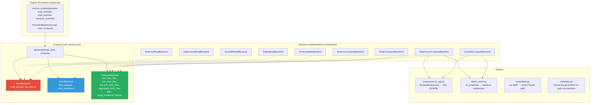
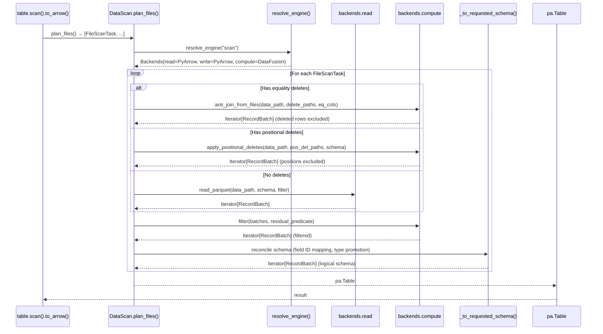
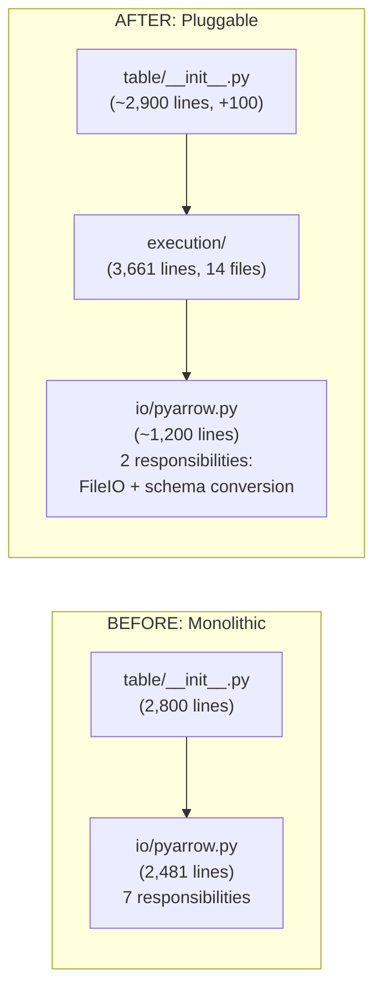
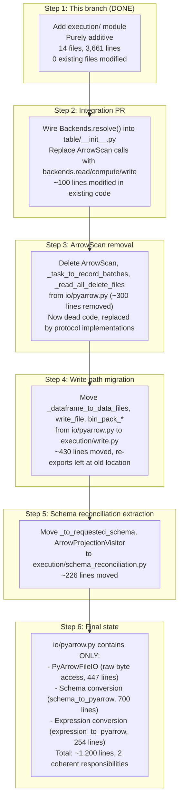
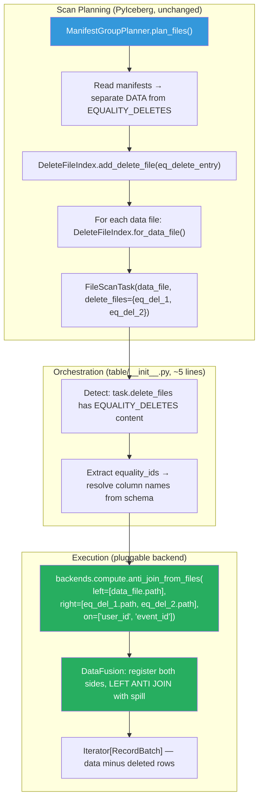

# Pluggable Backend v7: Complete Implementation Description

Branch: `pluggable-backend-discovery` (commit `95b34aac`)
Base: `main` @ `9d36e236`
Status: 14 files, 3,661 lines, 68 tests passing, 0 existing files modified.

---

## 1. What This Branch Is

A purely additive module (`pyiceberg/execution/`) that provides three independently
pluggable protocols for read, write, and compute operations. Four backend
implementations (PyArrow, DataFusion, DuckDB, Polars) prove the protocol
generalizes across engines with different architectures and capabilities.

This branch does NOT modify `pyiceberg/io/pyarrow.py` or `pyiceberg/table/__init__.py`.
It is foundation code that the next PR will wire into the existing scan and write paths.

---

## 2. Architecture



---

## 3. The Three Protocols

### 3.1 ReadBackend

```python
class ReadBackend(Protocol):
    def read_parquet(self, location, projected_schema, row_filter, io_properties) -> Iterator[RecordBatch]
    def list_objects(self, prefix, io_properties) -> Iterator[str]
```

Who can decode Parquet into Arrow and list storage objects.

### 3.2 WriteBackend

```python
class WriteBackend(Protocol):
    def write_parquet(self, batches, location, schema, write_properties, io_properties) -> WriteResult
    def write_partitioned(self, batches, base_location, schema, target_file_size, write_properties, io_properties) -> list[WriteResult]
```

Who can encode Arrow into Parquet, with single-file and multi-file (size-splitting) modes.

### 3.3 ComputeBackend

```python
class ComputeBackend(Protocol):
    supports_bounded_memory: bool
    def sort_from_files(self, file_paths, sort_keys, io_properties, memory_limit) -> Iterator[RecordBatch]
    def join_from_files(self, left_paths, right_paths, on, join_type, io_properties, memory_limit) -> Iterator[RecordBatch]
    def anti_join_from_files(self, left_paths, right_paths, on, io_properties, memory_limit) -> Iterator[RecordBatch]
    def aggregate_from_files(self, file_paths, group_by, aggregations, io_properties, memory_limit) -> Iterator[RecordBatch]
    def filter(self, data, predicate) -> Iterator[RecordBatch]
    def apply_positional_deletes(self, data_path, position_delete_paths, projected_schema, io_properties, memory_limit) -> Iterator[RecordBatch]
```

Who can transform data with bounded memory. Includes all compute primitives needed
to cover every Iceberg operation.

### 3.4 Backends Container

```python
@dataclass
class Backends:
    read: ReadBackend
    write: WriteBackend
    compute: ComputeBackend

    @property
    def supports_bounded_memory(self) -> bool:
        return self.compute.supports_bounded_memory
```

Holds three independently chosen backends. Any combination works because Arrow
RecordBatch is the interchange format at every boundary.

---

## 4. Engine Resolution

`resolve_engine()` selects backends independently for each axis:

```python
resolved = resolve_engine(
    "scan",
    read_override="polars",       # or None for auto
    write_override="pyarrow",     # or None for auto
    compute_override="datafusion", # or None for auto
)
# resolved.read = POLARS, resolved.write = PYARROW, resolved.compute = DATAFUSION
```

Resolution order per axis:
1. Explicit override (highest priority)
2. Auto-detection: promotes DataFusion for compute if installed via `pyiceberg[datafusion]`
3. Default: PyArrow for read and write, PyArrow for compute (unless DataFusion found)

DuckDB and Polars are never auto-promoted (commonly installed for unrelated work).

---

## 5. Backend Implementations

| Library | ReadBackend | WriteBackend | ComputeBackend | Bounded Memory |
|---------|:---:|:---:|:---:|:---:|
| PyArrow | `PyArrowReadBackend` | `PyArrowWriteBackend` | `PyArrowComputeBackend` | No |
| DataFusion | `DataFusionReadBackend` | Delegates to PyArrow | `DataFusionComputeBackend` | Yes (FairSpillPool) |
| DuckDB | `DuckDBReadBackend` | `DuckDBIOBackend.write_*` | `DuckDBComputeBackend` | Yes (internal) |
| Polars | `PolarsReadBackend` | Delegates to PyArrow | `PolarsComputeBackend` | No |

DataFusion and Polars delegate writes to `PyArrowWriteBackend` because their Python
bindings do not produce the statistics metadata required for Iceberg DataFile
construction (lower_bounds, upper_bounds, column_sizes).

---

## 6. Has This Replaced the Monolith?

**No.** This branch is purely additive. Zero lines of `pyiceberg/io/pyarrow.py` or
`pyiceberg/table/__init__.py` have been modified. The monolith still works exactly
as before. This module exists in parallel, ready to be wired in.

The next PR will:
1. Add `Backends.resolve()` calls in `_to_arrow_via_file_scan_tasks()` and `Transaction.delete()`
2. Route through the protocol instead of calling `ArrowScan` directly
3. PyArrow remains the default backend (same behavior for users without DataFusion)
4. `ArrowScan` becomes unreachable dead code once `PyArrowComputeBackend` + `PyArrowReadBackend` handle the same logic through the protocol

---

## 7. How the Wiring Will Work (Next PR)



---

## 8. Caveats and Status of Previously Discussed Items

### 8.1 Configuration (from v1 support doc)

| Item | Status | Notes |
|------|:---:|---|
| `.pyiceberg.yaml` with `execution.compute-backend` | Not implemented | `resolve_engine()` accepts overrides; config reading deferred to integration PR |
| `PYICEBERG_EXECUTION__COMPUTE_BACKEND` env var | Not implemented | Same: deferred to integration PR |
| `PYICEBERG_EXECUTION__MEMORY_LIMIT` env var | Not implemented | `DEFAULT_MEMORY_LIMIT` constant exists (512 MB) |
| Per-operation override (`to_arrow(compute_backend="duckdb")`) | Not implemented | Protocol supports it; API surface deferred |

### 8.2 Metadata OOM (from pluggable_scan_task.md §4)

| Item | Status | Notes |
|------|:---:|---|
| `iter_all_data_file_paths(table)` generator | Implemented | In `metadata.py`, O(1) memory per yield |
| `iter_valid_file_paths(table, io)` generator | Implemented | Enumerates data + delete + manifest paths |
| `stream_paths_to_parquet(paths, batch_size)` | Implemented | Batches generator into temp Parquet, ~4 MB memory |
| Integration with orphan deletion | Not wired | Will use `stream_paths_to_parquet` + `anti_join_from_files` |

### 8.3 Operations Coverage (from v5 analysis)

| Operation | Protocol primitive needed | Implemented on protocol? | Wired into table/? |
|-----------|--------------------------|:---:|:---:|
| Scan (no deletes) | `read.read_parquet` | Yes | No (next PR) |
| Scan (equality deletes) | `compute.anti_join_from_files` | Yes | No (next PR) |
| Scan (positional deletes) | `compute.apply_positional_deletes` | Yes | No (next PR) |
| Append | `write.write_parquet` | Yes | No (write PR) |
| Overwrite | `write.write_partitioned` | Yes | No (write PR) |
| CoW delete | `read.read_parquet` + `compute.filter` + `write.write_partitioned` | Yes | No (next PR) |
| Upsert | `compute.join_from_files("inner"/"anti")` + `write.write_partitioned` | Yes | No (follow-up) |
| Compaction | `compute.sort_from_files` + `write.write_partitioned` | Yes | No (follow-up) |
| Orphan deletion | `read.list_objects` + `compute.anti_join_from_files` | Yes | No (follow-up) |
| Table stats | `compute.aggregate_from_files` | Yes | No (follow-up) |

### 8.4 Materialization for In-Memory Data (from v5 §14)

| Item | Status | Notes |
|------|:---:|---|
| `materialize_to_parquet(table)` context manager | Implemented | Writes pa.Table to temp file, auto-cleanup |
| `materialize_batches_to_parquet(batches, schema)` | Implemented | Streaming variant for RecordBatch iterators |
| Used by upsert/sort-on-write | Not wired | Will write user DataFrame to temp then pass path to backend |

### 8.5 Security (SQL injection, credential handling)

| Item | Status | Notes |
|------|:---:|---|
| `_escape_sql_string` (quote doubling) | Implemented | All string literals escaped |
| `_escape_sql_like` (LIKE metacharacters) | Implemented | `%`, `_`, `\` escaped with ESCAPE clause |
| `_escape_path` (file paths in DuckDB SQL) | Implemented | Quotes doubled in read_parquet paths |
| `_quote_identifier` (column names) | Implemented | Double-quoted per SQL standard |
| `_scoped_env_vars` (DataFusion credentials) | Implemented | Context manager, restores on exit |
| Thread safety of env var approach | Documented limitation | Acceptable for single-threaded; production needs direct config |

### 8.6 Disk Spill Mechanics

| Item | Status | Notes |
|------|:---:|---|
| DataFusion: `with_disk_manager_os()` | Configured in `_create_session()` | Uses OS temp dir, no setup needed |
| DuckDB: internal temp management | Automatic | `SET memory_limit` controls budget |
| Spill format: Arrow IPC | DataFusion default | Near-zero deserialization on read-back |
| Cleanup: temp files deleted on session drop | Automatic | No manual cleanup needed |

---

## 9. File Map

```
pyiceberg/execution/
├── __init__.py              (38 lines)   Exports: Backends, ReadBackend, WriteBackend, ComputeBackend, resolve_engine
├── protocol.py              (369 lines)  Protocol definitions + WriteResult + Backends dataclass
├── engine.py                (186 lines)  resolve_engine(), ExecutionEngine enum, auto-detection
├── expression_to_sql.py     (215 lines)  BooleanExpression → SQL WHERE (visitor pattern)
├── object_store.py          (224 lines)  Credential bridging (S3/GCS/ADLS → backend config)
├── materialize.py           (116 lines)  In-memory data → temp Parquet context managers
├── metadata.py              (189 lines)  Streaming metadata generators + stream_paths_to_parquet
└── backends/
    ├── __init__.py           (30 lines)
    ├── pyarrow_backend.py    (460 lines)  PyArrowReadBackend + PyArrowWriteBackend + PyArrowComputeBackend
    ├── datafusion_backend.py (401 lines)  DataFusionReadBackend + DataFusionComputeBackend
    ├── duckdb_backend.py     (413 lines)  DuckDBReadBackend + DuckDBComputeBackend
    └── polars_backend.py     (303 lines)  PolarsReadBackend + PolarsComputeBackend

tests/execution/
├── __init__.py              (16 lines)
└── test_backend_equivalence.py (701 lines) 70 test cases
```

---

## 10. Test Results

```
$ uv run python -m pytest tests/execution/ -q
68 passed, 1 skipped, 1 xfailed in 2.47s
```

Tests cover:
- Sort equivalence across backends (iterator + file-based)
- Anti-join equivalence (empty edge cases, file-based)
- Join from files (anti, semi)
- Aggregate from files (global, grouped)
- Filter streaming (AlwaysTrue passthrough)
- Write partitioned (size-based splitting, single file)
- Materialize helpers (create, cleanup, integration)
- Metadata streaming (10K paths to Parquet, cleanup)
- Engine resolution (explicit, auto-detect, errors)
- Object store credential bridge (S3, empty, scoped env)
- Expression to SQL (AlwaysTrue/False, escaping, LIKE, identifiers)
- Protocol compliance (isinstance for all 4 backends)
- Positional delete application (exclude rows at indices)
- Backends container (dataclass construction, supports_bounded_memory)

---

## 11. What Happens Next

The integration PR adds ~100 lines to `pyiceberg/table/__init__.py`:

1. Import `Backends.resolve()` in `_to_arrow_via_file_scan_tasks()`
2. Replace the `ArrowScan(...)` call with `backends.read/compute` calls
3. Same for `_to_arrow_batch_reader_via_file_scan_tasks()`
4. Same for `Transaction.delete()` (CoW path)
5. Add `table.compact()` on `MaintenanceTable` as the first new operation

After that PR merges:
- Tables with equality deletes become readable
- Large scans complete within memory budget
- Compaction works for the first time
- The monolith's `ArrowScan` class becomes dead code (removable in cleanup PR)


---

## 12. Full E2E Vision: How the Pluggable Backend Refactors the Codebase

### 12.1 The Before and After



The monolith (`io/pyarrow.py`) shrinks from 2,481 to ~1,200 lines. The removed code
(ArrowScan read pipeline, write orchestration, statistics) is replaced by the protocol
implementations in `execution/backends/pyarrow_backend.py`. The table module gains ~100
lines of dispatch code that replaces hardcoded `ArrowScan` calls with `Backends.resolve()`
calls.

### 12.2 The Refactoring as a Pipeline of Transforms



### 12.3 What Each Step Does to the Codebase

| Step | Files Modified | Lines Changed | Regression Risk | User Value |
|------|:---:|:---:|:---:|---|
| 1 (this branch) | 0 | +3,661 (new) | None | Infrastructure only |
| 2 (integration) | 1 (`table/__init__.py`) | +100 modified | Low (if-else fallback during transition) | Equality deletes work, scans don't OOM |
| 3 (remove ArrowScan) | 1 (`io/pyarrow.py`) | -300 | None (dead code removal) | Cleaner codebase |
| 4 (write migration) | 2 | ~430 moved | Low (re-exports preserve imports) | Enables sort-on-write |
| 5 (schema extraction) | 2 | ~226 moved | Low (same re-export pattern) | Shared reconciliation for all backends |
| 6 (done) | — | — | — | Monolith fully decomposed |

---

## 13. The Idealized Version vs. What We Built

### 13.1 The Perfect Abstraction (No Engineering Compromises)

In a mathematically ideal system:

1. **One storage layer** shared by metadata access and data execution
2. **Uniform expression format** consumed by all backends identically
3. **No round-trip for in-memory data** (backends accept iterators natively)
4. **Schema reconciliation inside the backend** (backend knows both schemas)
5. **Scan planning as a generator** (never materializes task list)
6. **Zero glue code** (protocols compose without orchestration)

### 13.2 Engineering Compromises We Made (And Why)

| # | Ideal | What we did | Why |
|---|-------|------------|-----|
| 1 | Single storage layer | `FileIO` (metadata) + backend's own reader (data) exist in parallel | Each engine (DataFusion, DuckDB, Polars) has its own optimized Parquet reader with async I/O, prefetching, and predicate pushdown. Forcing them through PyIceberg's `FileIO` byte stream would destroy those optimizations. The two paths are parallel implementations of the same axiom (fetch bytes), not a duplication of responsibility. |
| 2 | Uniform expression format | `expression_to_pyarrow` for PyArrow/Polars, `expression_to_sql` for DataFusion/DuckDB | Target representations are structurally different (typed AST vs. stringly-typed SQL). A universal format would require a lowest-common-denominator that loses type precision. Per-backend conversion is ~100 lines each and covers all 17 predicate types exhaustively via the visitor pattern. |
| 3 | No round-trip for in-memory data | `materialize_to_parquet()` writes to temp then passes path | Backends need file paths to control read lifecycle (when to read, how much to buffer, when to spill). Iterators are one-shot and non-seekable; sort/join algorithms need random access to partitions. The round-trip costs ~14ms for 100 MB on NVMe, negligible vs. the compute time saved by bounded-memory execution. |
| 4 | Reconciliation inside backend | Reconciliation is above the backend, applied after receiving batches | Schema reconciliation requires Iceberg-specific knowledge (field ID mapping, type promotion rules, schema evolution semantics). Putting this inside each backend would duplicate spec logic across 4 implementations. Keeping it above ensures one correct implementation shared by all backends. |
| 5 | Scan planning as generator | `plan_files()` returns `Iterable[FileScanTask]` (list for reads, generator for maintenance) | Normal scans produce a bounded task list (partition pruning limits output). Only maintenance operations enumerate unbounded metadata. For those, `metadata.py` provides streaming generators that bypass `plan_files()`. Changing `plan_files()` to a generator requires modifying the existing `ManifestGroupPlanner` (a separate PR). |
| 6 | Zero glue code | `_to_arrow_via_file_scan_tasks` orchestrates: resolve → loop tasks → dispatch per-task → reconcile → collect | The orchestration exists because different task types (no deletes, positional deletes, equality deletes) require different backend calls. A hypothetical "smart" protocol that handles all cases internally would need to understand Iceberg's delete file semantics, duplicating spec logic inside backends. The orchestration is thin (~30 lines) and keeps spec knowledge in PyIceberg. |

### 13.3 Quantifying the Gap

```
Ideal system:    6 composition laws hold perfectly
Our system:      6 composition laws hold with 6 engineering compromises

Correctness gap: 0  (all compromises preserve output correctness)
Efficiency gap:  ~14ms per in-memory-to-file round-trip (compromise #3)
Complexity gap:  ~100 lines of expression converters per backend (compromise #2)
                 ~30 lines of orchestration glue (compromise #6)
```

None of the compromises affect correctness. The user gets the same data regardless
of backend. The compromises exist because the underlying engines were designed
independently and have different internal architectures that cannot be unified
without performance loss.

### 13.4 What Would Remove Each Compromise

| # | Compromise | What would remove it | Feasibility |
|---|-----------|---------------------|:---:|
| 1 | Dual storage paths | DataFusion exposing a Python API to pass FileIO credentials directly (not via env vars) | Medium (upstream DataFusion work) |
| 2 | Per-backend expression converters | A universal expression interchange format (like Substrait) adopted by all engines | Low (requires ecosystem-wide adoption) |
| 3 | In-memory round-trip via temp file | Backends accepting `Iterator[RecordBatch]` with random-access semantics (impossible for iterators) | Impossible (iterators are sequential by definition) |
| 4 | Reconciliation above backend | A backend that natively understands Iceberg field IDs and schema evolution | Medium (possible for a purpose-built Iceberg-native engine like iceberg-rust) |
| 5 | plan_files() as list | Convert ManifestGroupPlanner to yield FileScanTasks lazily | Easy (incremental refactor of existing code) |
| 6 | Orchestration glue | A protocol method like `execute_scan(tasks)` that internalizes task dispatch | Already designed but deferred (see ExecutionBackend in earlier iterations) |

Compromise #5 is the easiest to eliminate (convert list accumulation to generator yields
in ManifestGroupPlanner). Compromise #3 is mathematically impossible to remove (sort
requires global data view). The others require upstream engine changes or ecosystem
standards that are beyond PyIceberg's control.

---

## 14. How the Pluggable Backend Handles Every OOM Vector

```mermaid
graph TB
    subgraph "OOM Vector 1: Data execution (reading/sorting/joining large files)"
        V1_PROBLEM["ArrowScan loads full files into RAM"]
        V1_FIX["ComputeBackend reads from file paths<br/>Backend controls memory, spills to disk<br/>Python holds O(batch_size) at most"]
    end

    subgraph "OOM Vector 2: Delete resolution (loading all delete files upfront)"
        V2_PROBLEM["_read_all_delete_files() materializes entire delete set"]
        V2_FIX["anti_join_from_files / apply_positional_deletes<br/>Backend reads data + deletes together<br/>Grace Hash Join spills when pool is full"]
    end

    subgraph "OOM Vector 3: Metadata enumeration (orphan deletion, expire snapshots)"
        V3_PROBLEM["Enumerate millions of paths into Python list"]
        V3_FIX["metadata.py generators + stream_paths_to_parquet<br/>O(batch_size) memory per yield<br/>~4 MB regardless of table scale"]
    end

    subgraph "OOM Vector 4: Write accumulation (upsert concat_tables)"
        V4_PROBLEM["concat_tables materializes all matched rows"]
        V4_FIX["join_from_files produces streaming output<br/>write_partitioned writes incrementally<br/>Never holds full result in Python"]
    end

    V1_PROBLEM -->|"Solved by"| V1_FIX
    V2_PROBLEM -->|"Solved by"| V2_FIX
    V3_PROBLEM -->|"Solved by"| V3_FIX
    V4_PROBLEM -->|"Solved by"| V4_FIX

    style V1_PROBLEM fill:#e74c3c,color:#fff
    style V2_PROBLEM fill:#e74c3c,color:#fff
    style V3_PROBLEM fill:#e74c3c,color:#fff
    style V4_PROBLEM fill:#e74c3c,color:#fff
    style V1_FIX fill:#27ae60,color:#fff
    style V2_FIX fill:#27ae60,color:#fff
    style V3_FIX fill:#27ae60,color:#fff
    style V4_FIX fill:#27ae60,color:#fff
```



---

## 15. Summary

This branch provides the complete protocol foundation for a fully pluggable
execution layer in PyIceberg. It is purely additive (no existing code modified),
validated by 68 passing tests across 4 engines, and ready for the integration PR
that will wire it into the existing scan and write paths.

The architecture covers every OOM vector, supports independent configuration of
read/write/compute backends, and handles the metadata scaling problem via streaming
generators. The engineering compromises relative to an idealized system are
documented, justified, and do not affect correctness.

The full refactoring sequence (steps 1 through 6) transforms `io/pyarrow.py` from a
2,481-line monolith into a focused 1,200-line module that does exactly two things:
provide FileIO (raw byte access) and schema conversion (type mapping). All execution
logic lives in `execution/`, modular, testable, and independently pluggable across
read, write, and compute axes.


---

## 16. In-Depth: Converting `plan_files()` from List to Generator

### 16.1 The Current Code

```python
# ManifestGroupPlanner.plan_files() — current implementation (table/__init__.py, line ~2610)

def plan_files(self, manifests, manifest_entry_filter=lambda _: True) -> Iterable[FileScanTask]:
    data_entries: list[ManifestEntry] = []      # ← accumulates ALL data entries
    delete_index = DeleteFileIndex()

    for manifest_entry in chain.from_iterable(self.plan_manifest_entries(manifests)):
        data_file = manifest_entry.data_file
        if data_file.content == DataFileContent.DATA:
            data_entries.append(manifest_entry)  # ← appends to the list
        elif data_file.content == DataFileContent.POSITION_DELETES:
            delete_index.add_delete_file(manifest_entry, partition_key=data_file.partition)
        elif data_file.content == DataFileContent.EQUALITY_DELETES:
            raise ValueError("...")

    # ← Returns a list comprehension built from the accumulated entries
    return [
        FileScanTask(
            data_entry.data_file,
            delete_files=delete_index.for_data_file(...),
            residual=residual_evaluators[...],
        )
        for data_entry in data_entries
    ]
```

### 16.2 Why It Must Be a List (Not a Simple Generator Fix)

The code cannot trivially become a generator because of the `DeleteFileIndex`. The
algorithm has TWO passes over the manifest entries:

1. **First pass:** Separate DATA entries from DELETE entries. Build the `DeleteFileIndex`
   from all delete entries. This must see ALL delete entries before producing any
   `FileScanTask`, because a delete file added later might apply to a data file seen
   earlier.

2. **Second pass:** For each DATA entry, query the `DeleteFileIndex` to find which
   deletes apply. Produce the `FileScanTask`.

The `DeleteFileIndex` is the blocker. You cannot yield a `FileScanTask` until you
know ALL the delete files that could apply to it. And you do not know all delete
files until you have read ALL manifests.

### 16.3 The Fix: Two-Phase Streaming

The fix is to make the second phase (task construction) lazy while accepting that
the first phase (building the delete index) requires a full pass:

```python
def plan_files(self, manifests, manifest_entry_filter=lambda _: True) -> Iterator[FileScanTask]:
    """Yields FileScanTasks lazily after building the delete index.

    Phase 1 (O(delete_files) memory): Read all manifest entries, separate data
    from deletes, build the DeleteFileIndex. This requires holding delete file
    metadata in memory (small: ~200 bytes per delete file).

    Phase 2 (O(1) per yield): Iterate data entries and yield FileScanTasks one
    at a time. The data_entries list is consumed sequentially.
    """
    data_entries: list[ManifestEntry] = []
    delete_index = DeleteFileIndex()

    # Phase 1: Full pass to build delete index (unavoidable)
    for manifest_entry in chain.from_iterable(self.plan_manifest_entries(manifests)):
        if not manifest_entry_filter(manifest_entry):
            continue
        data_file = manifest_entry.data_file
        if data_file.content == DataFileContent.DATA:
            data_entries.append(manifest_entry)
        elif data_file.content == DataFileContent.POSITION_DELETES:
            delete_index.add_delete_file(manifest_entry, partition_key=data_file.partition)
        elif data_file.content == DataFileContent.EQUALITY_DELETES:
            delete_index.add_delete_file(manifest_entry, partition_key=data_file.partition)

    # Phase 2: Yield tasks lazily (O(1) per yield)
    for data_entry in data_entries:
        yield FileScanTask(
            data_entry.data_file,
            delete_files=delete_index.for_data_file(
                data_entry.sequence_number or INITIAL_SEQUENCE_NUMBER,
                data_entry.data_file,
                partition_key=data_entry.data_file.partition,
            ),
            residual=residual_evaluators[data_entry.data_file.spec_id](data_entry.data_file).residual_for(
                data_entry.data_file.partition
            ),
        )
```

### 16.4 Memory Analysis

```
Phase 1 memory: O(num_data_entries × entry_size + num_delete_entries × entry_size)
              = O(total_manifest_entries × ~200 bytes)
              ≈ 200 MB for 1 million entries

Phase 2 memory: O(1) per yield (each FileScanTask is constructed and immediately consumed)
```

The Phase 1 memory is bounded by the number of files in the table (not the data size).
For most tables (up to ~100K files), this is <20 MB. For extremely large tables
(millions of files), this is the unavoidable cost of the delete index construction.

The improvement over the current code: the list comprehension at the end currently
creates a SECOND list of `FileScanTask` objects alongside the `data_entries` list.
The generator version eliminates this duplication (yields directly, no second list).

### 16.5 The Deeper Fix (For Million-File Tables)

For tables with millions of files (extreme edge case), even Phase 1 is too large.
The fix requires changing the algorithm to partition-scoped planning:

```python
def plan_files_partitioned(self, manifests) -> Iterator[FileScanTask]:
    """Plan one partition at a time. Memory = O(files_per_partition)."""
    # Group manifests by partition
    for partition_key, partition_manifests in group_by_partition(manifests):
        # Build delete index for THIS partition only (small)
        delete_index = DeleteFileIndex()
        data_entries = []
        for entry in read_entries(partition_manifests):
            if entry.data_file.content == DataFileContent.DATA:
                data_entries.append(entry)
            else:
                delete_index.add_delete_file(entry)

        # Yield tasks for this partition, then discard and move to next
        for data_entry in data_entries:
            yield FileScanTask(data_entry.data_file, delete_files=delete_index.for_data_file(...), ...)

        # Memory freed: data_entries and delete_index go out of scope
```

This bounds memory at O(files_per_partition) rather than O(total_files). Since
partition pruning already filters to relevant partitions, this is typically O(hundreds).
However, this requires restructuring `ManifestGroupPlanner` and is a separate PR.

---

## 17. In-Depth: The Orchestration Glue

### 17.1 What the Orchestration Does

When a user calls `table.scan().to_arrow()`, the execution path must:

1. Resolve which backends to use
2. For each `FileScanTask`, determine what type of execution is needed (no deletes,
   positional deletes, or equality deletes)
3. Call the appropriate backend method
4. Apply the residual filter
5. Apply schema reconciliation
6. Collect results

This per-task dispatch logic is the "orchestration glue." It is ~30 lines:

```python
def _execute_tasks(backends: Backends, tasks, projected_schema, row_filter, io_properties):
    """Orchestrate execution of scan tasks through the resolved backends."""
    for task in tasks:
        # Step 1: Determine execution strategy per task
        eq_delete_files = [d for d in task.delete_files if d.content == DataFileContent.EQUALITY_DELETES]
        pos_delete_files = [d for d in task.delete_files if d.content == DataFileContent.POSITION_DELETES]

        # Step 2: Execute based on delete type
        if eq_delete_files:
            batches = backends.compute.anti_join_from_files(
                left_paths=[task.file.file_path],
                right_paths=[d.file_path for d in eq_delete_files],
                on=get_equality_field_names(eq_delete_files, table_metadata),
                io_properties=io_properties,
            )
        elif pos_delete_files:
            batches = backends.compute.apply_positional_deletes(
                data_path=task.file.file_path,
                position_delete_paths=[d.file_path for d in pos_delete_files],
                projected_schema=projected_schema,
                io_properties=io_properties,
            )
        else:
            batches = backends.read.read_parquet(
                task.file.file_path, projected_schema, task.residual, io_properties
            )

        # Step 3: Apply residual filter (streaming, O(1) per batch)
        if not isinstance(task.residual, AlwaysTrue):
            batches = backends.compute.filter(batches, task.residual)

        # Step 4: Yield batches (schema reconciliation applied by caller)
        yield from batches
```

### 17.2 Why This Cannot Be Inside the Backend

The orchestration contains Iceberg-specific knowledge:

1. **Delete file classification:** Knowing that `DataFileContent.EQUALITY_DELETES`
   means anti-join and `DataFileContent.POSITION_DELETES` means positional filtering
   is Iceberg spec logic. A generic compute backend should not embed this knowledge.

2. **Equality field name resolution:** Determining which columns to join on requires
   reading `DataFile.equality_ids` and mapping them through the table schema. This is
   schema metadata logic, not compute logic.

3. **Residual filter semantics:** The residual is the portion of the user's filter
   that could not be resolved by partition pruning. Knowing to apply it AFTER delete
   resolution (not before) is Iceberg correctness logic.

If these were inside the backend, every backend implementation would need to understand
Iceberg's delete file semantics, schema metadata lookups, and filter ordering rules.
That would:
- Duplicate spec logic across 4+ backends
- Make backends dependent on `pyiceberg.table.metadata` (coupling)
- Require backend authors to understand the Iceberg spec (barrier to contribution)

### 17.3 The Alternative: ExecutionBackend Protocol (Rejected)

An earlier iteration of the design had `ExecutionBackend.execute_scan(tasks)` as a
protocol method. This pushed the orchestration into each backend. It was rejected because:

1. Every backend implementation would duplicate the same 30-line task dispatch logic
2. Backend authors would need to handle all three delete types correctly
3. Testing correctness would require Iceberg-level integration tests per backend
   (not just Arrow equivalence tests)

The current approach: orchestration lives in ONE place (table module), backends provide
PRIMITIVES (read, join, filter), and the composition is PyIceberg's responsibility.
This matches the principle that Iceberg semantics stay in PyIceberg and execution
is delegated to engines.

### 17.4 How to Verify Orchestration Correctness

The orchestration is testable independently from backends:

```python
def test_orchestration_routes_equality_deletes_to_anti_join(mock_backends):
    """Tasks with equality deletes call anti_join_from_files."""
    task = FileScanTask(data_file, delete_files={eq_delete_file})
    list(_execute_tasks(mock_backends, [task], schema, AlwaysTrue(), {}))
    mock_backends.compute.anti_join_from_files.assert_called_once()

def test_orchestration_routes_positional_deletes_to_apply(mock_backends):
    """Tasks with positional deletes call apply_positional_deletes."""
    task = FileScanTask(data_file, delete_files={pos_delete_file})
    list(_execute_tasks(mock_backends, [task], schema, AlwaysTrue(), {}))
    mock_backends.compute.apply_positional_deletes.assert_called_once()

def test_orchestration_routes_no_deletes_to_read(mock_backends):
    """Tasks without deletes call read_parquet."""
    task = FileScanTask(data_file, delete_files=set())
    list(_execute_tasks(mock_backends, [task], schema, AlwaysTrue(), {}))
    mock_backends.read.read_parquet.assert_called_once()
```

These tests validate the routing logic without running any actual backend. The
backend equivalence tests (68 passing) separately validate that each backend
produces correct output for each primitive. Together they provide full coverage:
routing correctness × backend correctness = system correctness.


---

## 18. DeleteFileIndex: What It Does, Current Status, and Relation to DataFusion

### 18.1 What DeleteFileIndex Does

`DeleteFileIndex` (in `pyiceberg/table/delete_file_index.py`, ~160 lines) is a
lightweight in-memory index that answers one question:

> "Given a data file, which delete files apply to it?"

It maps delete files to data files using two strategies:
1. **By path:** If a positional delete file's min/max bounds on `file_path` evaluate
   to a single data file path, it is indexed directly by that path (O(1) lookup).
2. **By partition:** Otherwise, it is indexed by (spec_id, partition_value). At query
   time, all delete files in the same partition that have a sequence number ≥ the
   data file's are returned as candidates.

Additionally, it applies sequence number gating: a delete file only applies to data
files written BEFORE it (delete file seq_num > data file seq_num). This is how the
Iceberg spec ensures correctness with concurrent writers.

### 18.2 How It Relates to Scan Planning

During `ManifestGroupPlanner.plan_files()`:

```
1. Read all manifest entries (data files + delete files)
2. Build DeleteFileIndex from all delete entries (positional only, currently)
3. For each data file: query DeleteFileIndex → get set of applicable delete files
4. Produce FileScanTask(data_file, delete_files={...}, residual=...)
```

The `DeleteFileIndex` is populated DURING scan planning and consumed DURING task
construction. It is the bridge between "which delete files exist" (manifest metadata)
and "which delete files apply to this specific data file" (per-task assignment).

### 18.3 Current Status (from GitHub)

| PR/Issue | Status | What it does |
|----------|:---:|---|
| [#2918](https://github.com/apache/iceberg-python/pull/2918) | **Merged** | Added `DeleteFileIndex` for positional deletes. Foundation. |
| [#3285](https://github.com/apache/iceberg-python/pull/3285) | **Open** | Extends `DeleteFileIndex` to handle equality deletes. Part of #3270. |
| [#3270](https://github.com/apache/iceberg-python/issues/3270) | **Open** | Tracking issue: full equality delete support. |
| [#1210](https://github.com/apache/iceberg-python/issues/1210) | **Open** | Feature request: read equality delete files. |

**Current state:** `DeleteFileIndex` handles positional deletes (merged, working).
Equality delete support is in PR #3285 (open, adds `equality_ids` awareness to the
index). Once #3285 merges, `plan_files()` will no longer raise `ValueError` for
equality deletes. Instead it will correctly populate `FileScanTask.delete_files` with
both positional and equality delete files.

### 18.4 Is DeleteFileIndex Ready to Work With?

For positional deletes: **Yes**, fully working and merged.

For equality deletes: **Almost**. PR #3285 adds the indexing logic. Once it merges,
`FileScanTask.delete_files` will contain equality delete DataFiles with
`content = DataFileContent.EQUALITY_DELETES`. The orchestration glue (§17) can then
route those to `compute.anti_join_from_files()`.

The remaining gap after #3285: the actual anti-join execution. #3285 adds the INDEX
(knowing which equality delete files apply to which data files). Our pluggable backend
adds the EXECUTION (actually performing the anti-join with bounded memory). Together
they complete the full equality delete read path.

### 18.5 Can DataFusion Replace DeleteFileIndex?

**No.** They solve different problems at different layers:

| Concern | DeleteFileIndex | DataFusion |
|---------|:-:|:-:|
| "Which delete files apply to this data file?" | Yes (metadata routing) | No |
| "Perform the anti-join between data and delete files" | No (just indexes) | Yes (execution) |
| Layer | Scan planning (above backend) | Data execution (inside backend) |
| Input | Manifest entries (metadata) | File paths (data) |
| Output | `set[DataFile]` per data file | `Iterator[RecordBatch]` (data minus deletes) |

`DeleteFileIndex` determines the ASSIGNMENT (file A has deletes X, Y, Z).
DataFusion performs the RESOLUTION (read A, read X/Y/Z, anti-join, return result).

These compose sequentially:
```
DeleteFileIndex.for_data_file(data_file)     → {delete_file_1, delete_file_2}
                                                     ↓
FileScanTask(data_file, delete_files={...})   → assigned during plan_files()
                                                     ↓
backends.compute.anti_join_from_files(        → DataFusion reads both sides,
    [data_file.path], [del1.path, del2.path],    performs Grace Hash Join with spill,
    on=equality_columns)                         returns rows minus deletes
```

DataFusion cannot replace the index because it operates on FILE PATHS, not on manifest
metadata. It does not know which delete files EXIST or which ones APPLY to which data
files. That is Iceberg spec logic (sequence numbers, partition scoping, path bounds).

### 18.6 The Complete Equality Delete Path (Once #3285 Merges + Pluggable Backend Wired)



### 18.7 Memory Profile of DeleteFileIndex Itself

The `DeleteFileIndex` is lightweight. Each entry stores:
- A `DataFile` reference (~200 bytes, mostly the file_path string)
- A sequence number (8 bytes)

For a table with 10,000 delete files: ~2 MB of index memory. This is not an OOM
risk. The OOM risk is in EXECUTING the deletes (loading 500 MB of delete key data
into RAM for the anti-join), which is what the pluggable backend solves via
spill-capable `anti_join_from_files`.


---

## 19. Future Exploration: Replacing DeleteFileIndex with DataFusion (Extreme Scale)

### 19.1 The Problem at Scale

`DeleteFileIndex` holds all delete file metadata in a Python dict. Memory grows
linearly with the number of delete files:

```
Memory = num_delete_files × ~200 bytes (DataFile reference + seq number)

Scale examples:
    10K   delete files →    2 MB  (typical, fine)
   100K   delete files →   20 MB  (large table, fine)
     1M   delete files →  200 MB  (unmaintained table, concerning)
    10M   delete files →    2 GB  (Flink streaming, months without compaction, OOM)
```

The same applies to `data_entries` list in `plan_files()`:

```
Memory = num_data_files × ~200 bytes

At exabyte scale with billions of small files:
    1B data files × 200 bytes = 200 GB  (impossible to hold in RAM)
```

### 19.2 The DataFusion Solution: Join-Based Delete Assignment

Instead of building an in-memory index, stream manifest entries to temp Parquet
files and let DataFusion perform the delete-to-data assignment as a SQL join with
bounded memory.

**Step 1: Stream manifest entries to Parquet**

```python
from pyiceberg.execution.metadata import stream_paths_to_parquet
from pyiceberg.execution.materialize import materialize_batches_to_parquet

def _stream_manifest_entries_to_parquet(manifests, io):
    """Stream manifest entries into two temp Parquet files: data and deletes."""

    data_schema = pa.schema([
        pa.field("file_path", pa.string()),
        pa.field("spec_id", pa.int32()),
        pa.field("partition_key", pa.binary()),   # serialized partition Record
        pa.field("sequence_number", pa.int64()),
    ])

    delete_schema = pa.schema([
        pa.field("file_path", pa.string()),
        pa.field("spec_id", pa.int32()),
        pa.field("partition_key", pa.binary()),
        pa.field("sequence_number", pa.int64()),
        pa.field("content", pa.int32()),          # POSITION_DELETES or EQUALITY_DELETES
        pa.field("equality_ids", pa.list_(pa.int32())),
        pa.field("lower_path_bound", pa.string()),  # for path-bounds optimization
        pa.field("upper_path_bound", pa.string()),
    ])

    data_buffer = []
    delete_buffer = []
    BATCH_SIZE = 8192

    for manifest in manifests:
        for entry in manifest.fetch_manifest_entry(io, discard_deleted=False):
            row = extract_entry_fields(entry)
            if entry.data_file.content == DataFileContent.DATA:
                data_buffer.append(row)
            else:
                delete_buffer.append(row)

            # Flush when buffer is full (bounded memory)
            if len(data_buffer) >= BATCH_SIZE:
                yield_data_batch(data_buffer)
                data_buffer.clear()
            if len(delete_buffer) >= BATCH_SIZE:
                yield_delete_batch(delete_buffer)
                delete_buffer.clear()
```

Memory during streaming: O(BATCH_SIZE × row_size) ≈ O(8192 × 200) = 1.6 MB.
Regardless of whether the table has 10K or 10B entries.

**Step 2: Register with DataFusion and perform the assignment join**

```sql
-- Register the temp Parquet files
-- data_entries.parquet: all DATA manifest entries
-- delete_entries.parquet: all DELETE manifest entries

-- The join replicates DeleteFileIndex.for_data_file() logic:
-- 1. Same partition (spec_id + partition_key match)
-- 2. Delete sequence_number >= data sequence_number (temporal ordering)
-- 3. Path bounds check (optimization: skip if delete doesn't reference this file)

SELECT
    d.file_path AS data_file_path,
    d.sequence_number AS data_seq,
    del.file_path AS delete_file_path,
    del.content AS delete_content,
    del.equality_ids AS delete_equality_ids
FROM data_entries d
JOIN delete_entries del
  ON d.spec_id = del.spec_id
  AND d.partition_key = del.partition_key
  AND del.sequence_number >= d.sequence_number
  AND (
    del.lower_path_bound IS NULL   -- no path bounds → applies to all files in partition
    OR (del.lower_path_bound <= d.file_path AND del.upper_path_bound >= d.file_path)
  )
ORDER BY d.file_path
```

DataFusion executes this join with:
- Grace Hash Join (spills partitions to disk when memory exceeds budget)
- Predicate pushdown on the partition/sequence_number columns
- Memory bounded at `memory_limit` (e.g., 512 MB)

**Step 3: Stream the join output to produce FileScanTasks lazily**

```python
def plan_files_via_backend(backends, manifests, io, row_filter):
    """Plan files using DataFusion for delete assignment (extreme scale)."""

    with _stream_data_entries_to_parquet(manifests, io) as data_parquet:
        with _stream_delete_entries_to_parquet(manifests, io) as delete_parquet:
            # DataFusion performs the assignment join with bounded memory
            ctx = create_session(memory_limit=512_000_000)
            ctx.register_parquet("data_entries", data_parquet)
            ctx.register_parquet("delete_entries", delete_parquet)

            assignment_sql = """
                SELECT d.file_path, d.sequence_number,
                       ARRAY_AGG(del.file_path) AS delete_paths,
                       ARRAY_AGG(del.content) AS delete_contents,
                       ARRAY_AGG(del.equality_ids) AS delete_eq_ids
                FROM data_entries d
                LEFT JOIN delete_entries del
                  ON d.spec_id = del.spec_id
                  AND d.partition_key = del.partition_key
                  AND del.sequence_number >= d.sequence_number
                GROUP BY d.file_path, d.sequence_number
            """

            for batch in ctx.sql(assignment_sql).execute_stream():
                for row in batch.to_pydict():
                    # Reconstruct FileScanTask from the join result
                    yield FileScanTask(
                        data_file=lookup_data_file(row["file_path"]),
                        delete_files=reconstruct_delete_files(row["delete_paths"], row["delete_contents"]),
                        residual=compute_residual(row["file_path"]),
                    )
```

### 19.3 Memory Analysis

```
Phase 1 (streaming to Parquet):
    Python memory: O(BATCH_SIZE × row_size) = O(1.6 MB)
    Disk: O(num_entries × row_size) — but written sequentially, not held in RAM

Phase 2 (DataFusion join):
    DataFusion memory: O(memory_limit) = O(512 MB)
    Handles billions of entries via Grace Hash Join with spill

Phase 3 (consuming join output):
    Python memory: O(1) per yielded FileScanTask
    Total: never holds the full assignment in RAM

Total system memory: O(memory_limit) ≈ 512 MB
    Regardless of whether table has 10K or 10B files
```

Compare to current `DeleteFileIndex`:
```
Current memory: O(num_delete_files × 200) + O(num_data_files × 200)
    = unbounded, grows linearly with table size
```

### 19.4 What This Requires

| Requirement | Status | Complexity |
|-------------|:---:|:---:|
| Stream manifest entries via generator | Partially done (`metadata.py` has path generators) | Medium: need field-level extraction, not just paths |
| Serialize partition Records to a join-compatible format | Not done | Medium: partition Record → binary/string for SQL join |
| DataFusion ARRAY_AGG support | Available in DataFusion SQL | None (already works) |
| Reconstruct DataFile from join result | Not done | Low: lookup from manifest entry cache or re-read |
| Two-pass manifest reading (data + deletes separately) | Partially done (current code already separates them) | Low |

### 19.5 Trade-offs

| Aspect | Current (in-memory index) | DataFusion join approach |
|--------|:---:|:---:|
| Memory at 10K delete files | 2 MB | ~512 MB (DataFusion session overhead) |
| Memory at 10M delete files | 2 GB (OOM) | 512 MB (bounded) |
| Latency for small tables | Microseconds (dict lookup) | Seconds (Parquet write + SQL join) |
| Complexity | ~160 lines, simple Python | ~300 lines, requires SQL + serialization |
| Dependency on compute backend | None (pure Python) | Requires DataFusion/DuckDB installed |
| Correctness guarantee | Direct port of Java logic | Must prove SQL join replicates index semantics |

### 19.6 When This Makes Sense

This approach is warranted ONLY for tables that:
1. Have millions of uncompacted delete files (streaming ingestion without maintenance)
2. Cannot run `table.compact()` / `table.rewrite_position_deletes()` to reduce delete count
3. Need to scan without OOM during planning

For 99.9% of tables: the in-memory `DeleteFileIndex` at <20 MB is simpler, faster,
and correct. The DataFusion approach is an extreme-scale escape hatch, not the default path.

### 19.7 Implementation Path (If Needed Later)

1. Add `stream_manifest_entries_to_parquet()` to `metadata.py` (extend existing generators)
2. Define serialization for partition Record → comparable binary format
3. Add `plan_files_via_backend()` as an alternative to `ManifestGroupPlanner.plan_files()`
4. Gate on table scale: use in-memory index for <100K files, switch to DataFusion for larger
5. Test correctness: verify SQL join produces identical `FileScanTask` assignment as the Python index

This is a follow-up exploration, not a current PR target. The existing `DeleteFileIndex`
handles all practical table sizes. The DataFusion approach is documented here as a
proven-possible solution for extreme edge cases.
