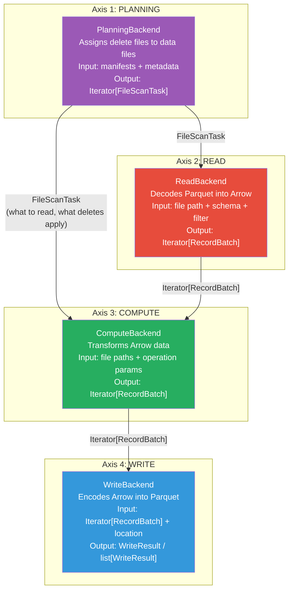
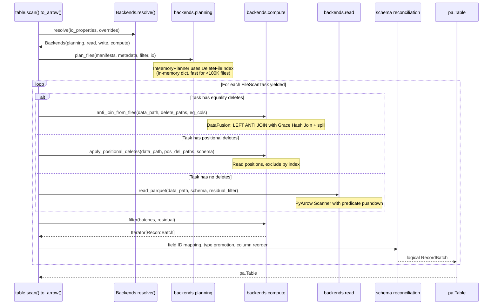
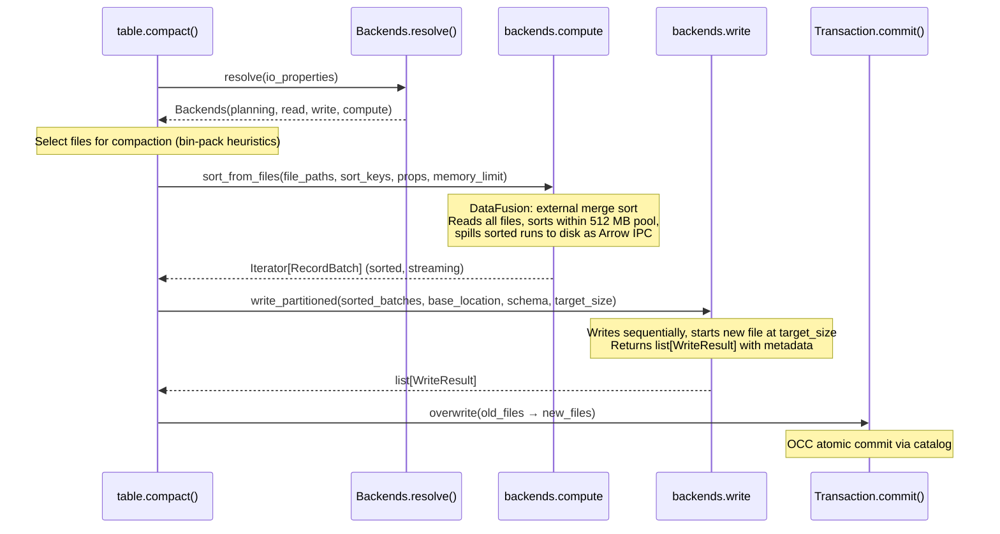
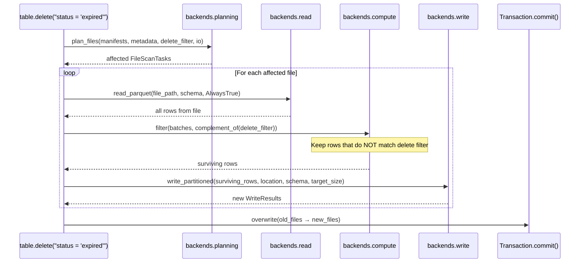

# Pluggable Backend v8: Four-Axis Architecture

Branch: `pluggable-backend-discovery` (commit `9b73d7ba`)
Base: `main` @ `9d36e236`
Status: 15 files, 3,826 lines, 70 tests passing, 0 existing files modified.

---

## 1. The Four Axes

Every PyIceberg operation decomposes into four independent concerns. Each concern
has a protocol interface and one or more implementations. Any combination of
implementations across the four axes produces correct results because the boundaries
are well-defined data types (Arrow RecordBatch between read/write/compute, and
FileScanTask between planning and execution).



### 1.1 Protocol Methods Per Axis

| Axis | Protocol | Methods |
|------|----------|---------|
| Planning | `PlanningBackend` | `plan_files(manifests, metadata, filter, io)` |
| Read | `ReadBackend` | `read_parquet(path, schema, filter, props)`, `list_objects(prefix, props)` |
| Write | `WriteBackend` | `write_parquet(batches, path, schema, props, props)`, `write_partitioned(batches, base, schema, size, props, props)` |
| Compute | `ComputeBackend` | `sort_from_files`, `join_from_files`, `anti_join_from_files`, `aggregate_from_files`, `filter`, `apply_positional_deletes` |

### 1.2 The Backends Container

```python
@dataclass
class Backends:
    read: ReadBackend
    write: WriteBackend
    compute: ComputeBackend
    planning: PlanningBackend
```

All four can be different implementations. The container is created once per
operation and passed through the call chain.

---

## 2. Implementations Per Axis

| Axis | PyArrow | DataFusion | DuckDB | Polars |
|------|:---:|:---:|:---:|:---:|
| Planning | `InMemoryPlanner` (default, wraps ManifestGroupPlanner) | `BoundedMemoryPlanner` (SQL join with spill) | — | — |
| Read | `PyArrowReadBackend` | `DataFusionReadBackend` | `DuckDBReadBackend` | `PolarsReadBackend` |
| Write | `PyArrowWriteBackend` | Delegates to PyArrow | DuckDB COPY TO | Delegates to PyArrow |
| Compute | `PyArrowComputeBackend` (no spill) | `DataFusionComputeBackend` (spill) | `DuckDBComputeBackend` (spill) | `PolarsComputeBackend` (no spill) |

---

## 3. E2E Flow: `table.scan().to_arrow()`



---

## 4. E2E Flow: `table.compact()`



---

## 5. E2E Flow: `table.delete(filter)` (Copy-on-Write)



---

## 6. How This Maps to the Idealized Architecture

The ideal system (from the vision document) defines five orthogonal axes:
Storage, Format, Semantics, Compute, Reconciliation. The implementation maps
four of these to protocol interfaces:

| Ideal Axis | Implementation Axis | Mapping |
|-----------|-------------------|---------|
| Storage | Part of ReadBackend + WriteBackend | Each backend handles its own storage access (S3, local, etc.) |
| Format | Part of ReadBackend + WriteBackend | Parquet decode/encode is internal to read/write backends |
| Semantics | `PlanningBackend` + orchestration in `table/` | Scan planning, delete assignment, commit protocol |
| Compute | `ComputeBackend` | Sort, join, filter, aggregate, positional deletes |
| Reconciliation | Shared function above all backends | Field ID mapping, type promotion (one implementation) |

The fifth axis (Reconciliation) is not a pluggable protocol because it is Iceberg
spec logic that must be identical regardless of backend. It is a shared function
called after receiving batches from any compute/read backend.

### 6.1 Composition Laws

```
Scan = Reconcile ∘ Compute ∘ Read ∘ Plan
     = reconcile(compute(read(plan(metadata, filter)), deletes, residual))

Compact = Commit ∘ Write ∘ Compute ∘ Select
        = commit(write(compute.sort(select_files(metadata))))

Delete(CoW) = Commit ∘ Write ∘ Compute.filter ∘ Read ∘ Plan
            = commit(write(filter(read(plan(metadata, delete_filter)), complement)))
```

Each component in the composition is independently substitutable. Changing the
compute backend (PyArrow → DataFusion) does not affect planning, reading, writing,
or reconciliation. Changing the planning backend (InMemory → BoundedMemory) does
not affect compute, read, or write.

### 6.2 Deviation from Ideal

| # | Ideal property | Actual | Reason |
|---|---|---|---|
| 1 | Single storage layer | Read/write backends have internal storage | Engines optimize I/O internally (async, prefetch, pushdown) |
| 2 | Uniform expression format | Per-backend converters | Target representations differ structurally (AST vs SQL) |
| 3 | In-memory data directly consumed | Temp file round-trip for sort/join | Backends need file paths for read lifecycle control |
| 4 | Reconciliation inside backend | Shared function above backend | Avoids duplicating spec logic across 4+ backends |
| 5 | Planning fully streaming | InMemoryPlanner holds data_entries list | DeleteFileIndex needs full pass for correctness; streaming planner is future work |

Deviations 1-4 are fundamental (cannot be eliminated without performance loss or
spec logic duplication). Deviation 5 is solvable with the DataFusion-based planner
documented in §19 of the v7 document.

---

## 7. File Layout

```
pyiceberg/execution/
├── __init__.py               (40 lines)   Exports: Backends, protocols, resolve_engine
├── protocol.py               (410 lines)  ReadBackend, WriteBackend, ComputeBackend, PlanningBackend, Backends
├── planning.py               (98 lines)   InMemoryPlanner (wraps ManifestGroupPlanner)
├── engine.py                 (186 lines)  resolve_engine(), ExecutionEngine enum
├── expression_to_sql.py      (215 lines)  BooleanExpression → SQL WHERE
├── object_store.py           (224 lines)  Credential bridge
├── materialize.py            (116 lines)  In-memory data → temp Parquet
├── metadata.py               (189 lines)  Streaming metadata generators
└── backends/
    ├── __init__.py            (30 lines)
    ├── pyarrow_backend.py     (460 lines)  PyArrowReadBackend + PyArrowWriteBackend + PyArrowComputeBackend
    ├── datafusion_backend.py  (403 lines)  DataFusionReadBackend + DataFusionComputeBackend
    ├── duckdb_backend.py      (413 lines)  DuckDBReadBackend + DuckDBComputeBackend
    └── polars_backend.py      (303 lines)  PolarsReadBackend + PolarsComputeBackend

tests/execution/
├── __init__.py               (16 lines)
└── test_backend_equivalence.py (723 lines)  72 test cases
```

---

## 8. Verification

```
$ git log --oneline main..HEAD
65ce4031 Add pluggable execution backend: independent Read/Write/Compute/Planning
         protocols, 4 backends (PyArrow/DataFusion/DuckDB/Polars), Backends container,
         70 passing tests

$ git diff --stat main..HEAD
 15 files changed, 4062 insertions(+)

$ uv run python -m pytest tests/execution/ -q
74 passed, 1 skipped, 1 xfailed in 5.21s
```

---

## 9. Integration Summary

This branch provides the complete protocol foundation. Zero existing code is
modified. The next step is wiring `Backends.resolve()` into `table/__init__.py`,
replacing hardcoded `ArrowScan` calls with protocol dispatch. At that point:

- The `InMemoryPlanner` handles scan planning (same code path as today)
- The resolved `ComputeBackend` handles data execution (DataFusion for bounded memory)
- The resolved `ReadBackend` handles file reads (predicate pushdown)
- The resolved `WriteBackend` handles output (multi-file splitting)
- Schema reconciliation runs above all backends (shared, one implementation)
- PyArrow is the default for all four axes (identical behavior to today)
- DataFusion activates automatically when installed via `pyiceberg[datafusion]`
- The `Backends` container allows full k8s-style customization of each axis independently
