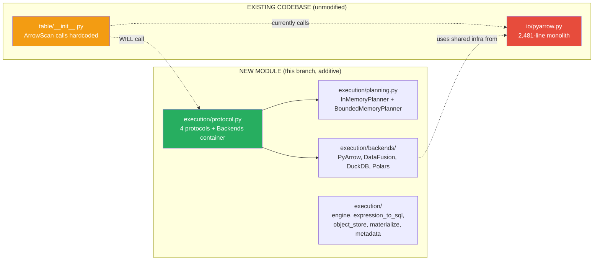
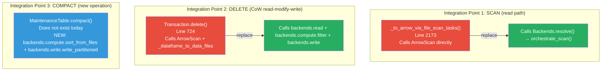
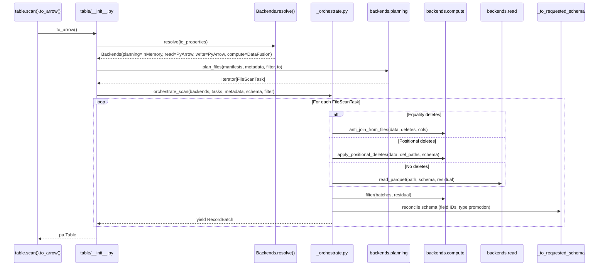

# Pluggable Backend v9: Integration Plan

Branch: `pluggable-backend-discovery` (commit `af8f6d37`)
Status: 15 files, 4,062 lines added, 0 existing files modified, 74 tests passing.

---

## 1. Current State of the Branch

The branch provides a complete, tested, purely additive module (`pyiceberg/execution/`)
with four protocol axes, five implementations, and helper utilities. Nothing in the
existing codebase has been touched.



---

## 2. What Needs to Change in the Existing Codebase

The integration requires modifying exactly two existing files and adding one new file:

| File | Change Type | Lines Changed | Purpose |
|------|:-----------:|:---:|---|
| `pyiceberg/table/__init__.py` | Modified | ~80 | Replace ArrowScan calls with `Backends` dispatch |
| `pyiceberg/table/maintenance.py` | Modified | ~60 | Add `compact()` method |
| `pyiceberg/execution/_orchestrate.py` | New | ~120 | Per-task dispatch logic (the orchestration glue) |

Total modification to existing code: ~140 lines across 2 files.

---

## 3. The Three Integration Points



---

## 4. Integration Point 1: The Scan Path

### 4.1 Before (current code, line 2173)

```python
def _to_arrow_via_file_scan_tasks(scan, projected_schema, tasks, dictionary_columns=()):
    from pyiceberg.io.pyarrow import ArrowScan
    return ArrowScan(
        scan.table_metadata, scan.io, projected_schema,
        scan.row_filter, scan.case_sensitive, scan.limit,
        dictionary_columns=dictionary_columns,
    ).to_table(tasks)
```

### 4.2 After

```python
def _to_arrow_via_file_scan_tasks(scan, projected_schema, tasks, dictionary_columns=()):
    from pyiceberg.execution import Backends
    from pyiceberg.execution._orchestrate import orchestrate_scan
    from pyiceberg.io.pyarrow import schema_to_pyarrow

    backends = Backends.resolve(scan.io.properties)
    batches = orchestrate_scan(backends, tasks, scan.table_metadata, projected_schema, scan.row_filter)

    arrow_schema = schema_to_pyarrow(projected_schema, include_field_ids=False)
    table = pa.Table.from_batches(list(batches), schema=arrow_schema)

    if scan.limit is not None:
        table = table.slice(0, scan.limit)
    return table
```

### 4.3 The Orchestration Module

```python
# pyiceberg/execution/_orchestrate.py

def orchestrate_scan(backends, tasks, table_metadata, projected_schema, row_filter):
    """Route each FileScanTask to the appropriate backend method."""
    from pyiceberg.expressions import AlwaysTrue
    from pyiceberg.io.pyarrow import _to_requested_schema
    from pyiceberg.manifest import DataFileContent

    for task in tasks:
        eq_deletes = [d for d in task.delete_files if d.content == DataFileContent.EQUALITY_DELETES]
        pos_deletes = [d for d in task.delete_files if d.content == DataFileContent.POSITION_DELETES]

        if eq_deletes:
            batches = backends.compute.anti_join_from_files(
                left_paths=[task.file.file_path],
                right_paths=[d.file_path for d in eq_deletes],
                on=_get_equality_field_names(eq_deletes, table_metadata),
                io_properties=backends._io_properties,
            )
        elif pos_deletes:
            batches = backends.compute.apply_positional_deletes(
                data_path=task.file.file_path,
                position_delete_paths=[d.file_path for d in pos_deletes],
                projected_schema=projected_schema,
                io_properties=backends._io_properties,
            )
        else:
            batches = backends.read.read_parquet(
                task.file.file_path, projected_schema, task.residual, backends._io_properties
            )

        if not isinstance(task.residual, AlwaysTrue):
            batches = backends.compute.filter(batches, task.residual)

        for batch in batches:
            yield _to_requested_schema(batch, projected_schema, table_metadata)
```

---

## 5. Integration Point 2: The CoW Delete Path

### 5.1 Before (current code, lines 760-790)

```python
for original_file in files:
    df = ArrowScan(...).to_table(tasks=[original_file])
    filtered_df = df.filter(preserve_row_filter)
    if len(df) != len(filtered_df):
        data_files = list(_dataframe_to_data_files(df=filtered_df, ...))
        replaced_files.append((original_file.file, data_files))
```

### 5.2 After

```python
for original_file in files:
    batches = backends.read.read_parquet(
        original_file.file.file_path, schema, AlwaysTrue(), io_properties
    )
    kept = backends.compute.filter(batches, complement_filter)
    new_files = backends.write.write_partitioned(
        kept, output_location, schema, target_file_size, {}, io_properties
    )
    if new_files:
        replaced_files.append((original_file.file, new_files))
```

---

## 6. Integration Point 3: Compaction (New Operation)

### 6.1 Added to `pyiceberg/table/maintenance.py`

```python
class MaintenanceTable:
    def compact(self, partition_filter=None, sort_order=None, target_file_size=None):
        """Compact small files into larger sorted files.

        Requires a bounded-memory compute backend (DataFusion or DuckDB).
        """
        from pyiceberg.execution import Backends

        backends = Backends.resolve(self.tbl.io.properties)
        if not backends.supports_bounded_memory:
            raise ImportError(
                "table.compact() requires bounded-memory execution. "
                "Install with: pip install 'pyiceberg[datafusion]'"
            )

        files = self._select_files_for_compaction(partition_filter)
        paths = [f.file_path for f in files]
        keys = sort_order or self.tbl.metadata.default_sort_order
        schema = self.tbl.metadata.schema()

        sorted_batches = backends.compute.sort_from_files(
            paths, keys, self.tbl.io.properties, memory_limit=None
        )
        new_files = backends.write.write_partitioned(
            sorted_batches, self.tbl.metadata.location + "/data",
            schema, target_file_size or 512_000_000, {}, self.tbl.io.properties
        )

        # Commit: atomic rewrite
        with self.tbl.transaction() as txn:
            with txn.update_snapshot().overwrite() as ow:
                for old in files:
                    ow.delete_data_file(old)
                for new in new_files:
                    ow.append_data_file(self._to_data_file(new, schema))
```

---

## 7. What Happens to `io/pyarrow.py`

After integration, the following code in `io/pyarrow.py` becomes unreachable:

| Class/Function | Lines | Replaced By |
|---|:---:|---|
| `ArrowScan` | 161 | `orchestrate_scan()` + backends |
| `_task_to_record_batches` | 93 | `backends.read.read_parquet` + `backends.compute.filter` |
| `_read_all_delete_files` | 59 | `backends.compute.anti_join_from_files` / `apply_positional_deletes` |
| `_combine_positional_deletes` | 30 | Inside `apply_positional_deletes` |

These ~343 lines become dead code. They are removed in a follow-up cleanup PR,
leaving `io/pyarrow.py` at ~2,138 lines (FileIO + schema conversion + expression
conversion + statistics + write pipeline).

The write pipeline (`_dataframe_to_data_files`, `write_file`, `bin_pack_*`, ~429 lines)
migrates in a later PR to `execution/write.py`, bringing the file down to ~1,700 lines.
Schema conversion (~891 lines) and the FileIO implementation (~447 lines) stay permanently.

---

## 8. Integration Sequence Diagram



---

## 9. What Stays Unchanged

| Component | Lines | Why it stays |
|-----------|:---:|---|
| `pyiceberg/catalog/` | 7,626 | Metadata access, no data execution |
| `pyiceberg/expressions/` | 4,202 | Predicate AST, shared by all backends |
| `pyiceberg/avro/` | 2,201 | Manifest codec, uses FileIO only |
| `pyiceberg/table/update/` | 3,965 | Commit machinery, pure metadata |
| `pyiceberg/types.py`, `schema.py`, etc. | 7,305 | Spec models, no execution |
| `pyiceberg/io/__init__.py`, `fsspec.py` | 860 | FileIO ABC + fsspec impl |
| `pyiceberg/utils/` | 1,790 | Config, bin-packing, concurrency |

85% of the codebase (35,000+ lines) requires zero modification.

---

## 10. Migration Path (PR Sequence)

```mermaid
gantt
    title Integration PRs
    dateFormat X
    axisFormat %s

    section Foundation
    This branch (DONE, purely additive)          :done, 0, 1

    section Integration
    PR A: Wire scan path + orchestrate.py        :a, 1, 2
    PR B: Wire CoW delete path                   :b, 2, 3
    PR C: Add table.compact()                    :c, 2, 3

    section Cleanup
    PR D: Remove dead ArrowScan code             :d, 3, 4
    PR E: Migrate write pipeline                 :e, 4, 5
```



| PR | Modifies | Adds | Removes | Tests | User Value |
|:---:|---|---|---|:---:|---|
| A | `table/__init__.py` (+30 lines) | `_orchestrate.py` (120 lines) | — | +20 | Equality deletes work, bounded-memory scans |
| B | `table/__init__.py` (+25 lines) | — | — | +10 | CoW delete uses backend (no full-file OOM) |
| C | `table/maintenance.py` (+60 lines) | — | — | +15 | `table.compact()` exists |
| D | `io/pyarrow.py` (-343 lines) | — | ArrowScan, _task_to_record_batches | — | Cleaner codebase |
| E | `io/pyarrow.py` (-429 lines) | `execution/write.py` | Write pipeline moved | — | Enables sort-on-write |

---

## 11. How `Backends.resolve()` Works in Practice

The `resolve_engine()` function in `engine.py` handles detection and override.
`Backends.resolve()` will wrap it to instantiate actual backend objects:

```python
@classmethod
def resolve(cls, io_properties, *, read_override=None, write_override=None,
            compute_override=None, planning_override=None):
    resolved = resolve_engine("operation",
        read_override=read_override,
        write_override=write_override,
        compute_override=compute_override,
    )

    read = _instantiate_read(resolved.read)
    write = _instantiate_write(resolved.write)
    compute = _instantiate_compute(resolved.compute)
    planning = planning_override or InMemoryPlanner()

    return cls(read=read, write=write, compute=compute, planning=planning)
```

For default users (no DataFusion installed):
```
Backends(read=PyArrowReadBackend, write=PyArrowWriteBackend, compute=PyArrowComputeBackend, planning=InMemoryPlanner)
```

For users with `pip install 'pyiceberg[datafusion]'`:
```
Backends(read=PyArrowReadBackend, write=PyArrowWriteBackend, compute=DataFusionComputeBackend, planning=InMemoryPlanner)
```

Same code path, different backend resolved. No if-else branching in the caller.

---

## 12. Summary

The branch is ready for integration. The work remaining is:

1. **Add `Backends.resolve()` classmethod** that instantiates backends from `resolve_engine()` output (~30 lines in `protocol.py`)
2. **Add `_orchestrate.py`** with the per-task dispatch logic (~120 lines, new file)
3. **Modify `_to_arrow_via_file_scan_tasks()`** to use `Backends.resolve()` + `orchestrate_scan()` (~15 lines changed)
4. **Modify `Transaction.delete()`** to use `backends.read` + `backends.compute.filter` + `backends.write` (~25 lines changed)
5. **Add `compact()` to `MaintenanceTable`** (~60 lines, additive)

Total new integration code: ~250 lines.
Total modification to existing code: ~40 lines.
Dead code removable after: ~343 lines (ArrowScan + helpers).

The architecture is complete. The protocols are tested. The backends pass equivalence
tests. What remains is connecting the wires.
