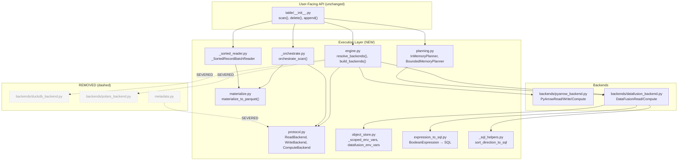
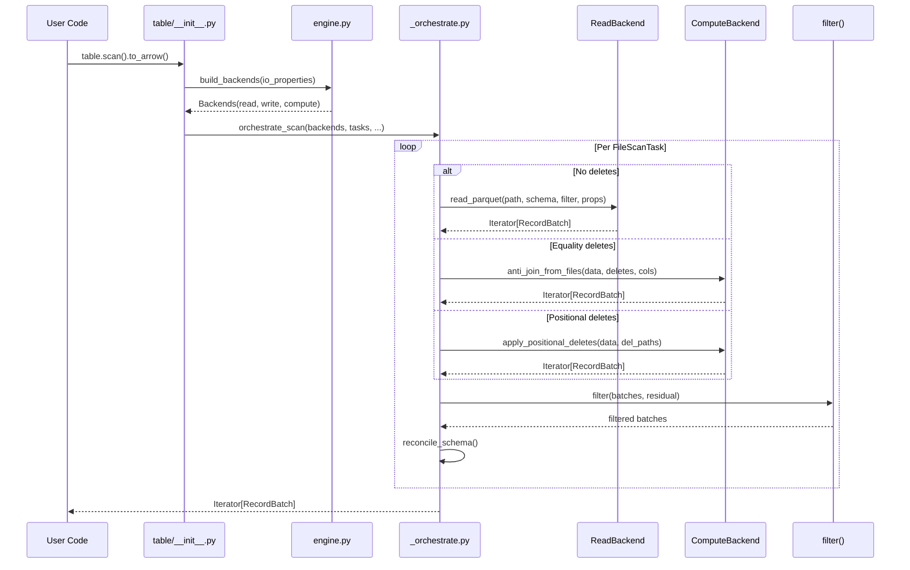
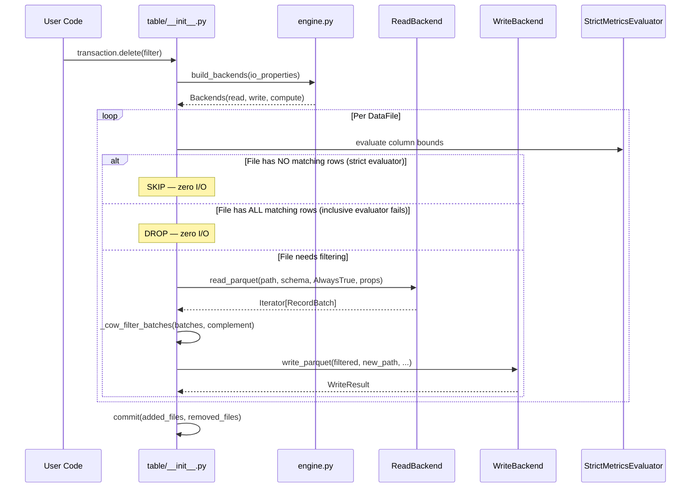
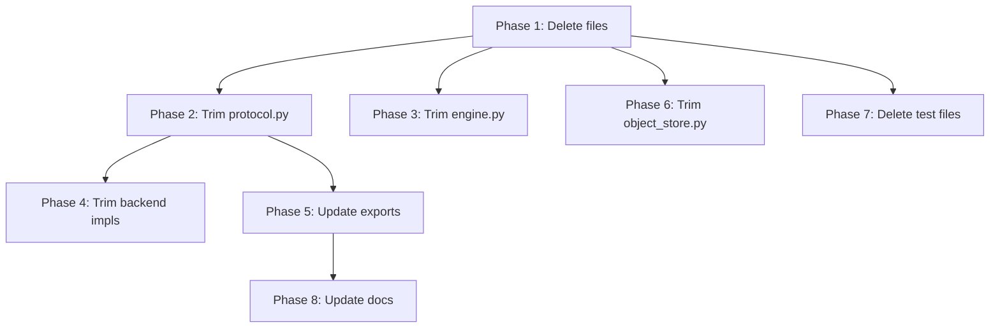
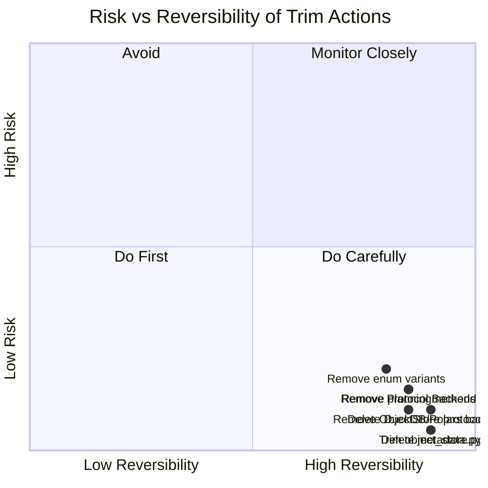
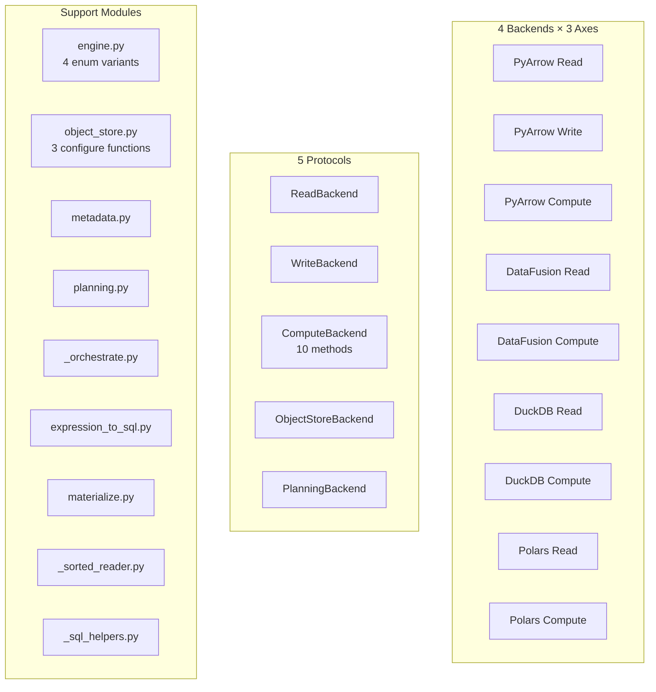
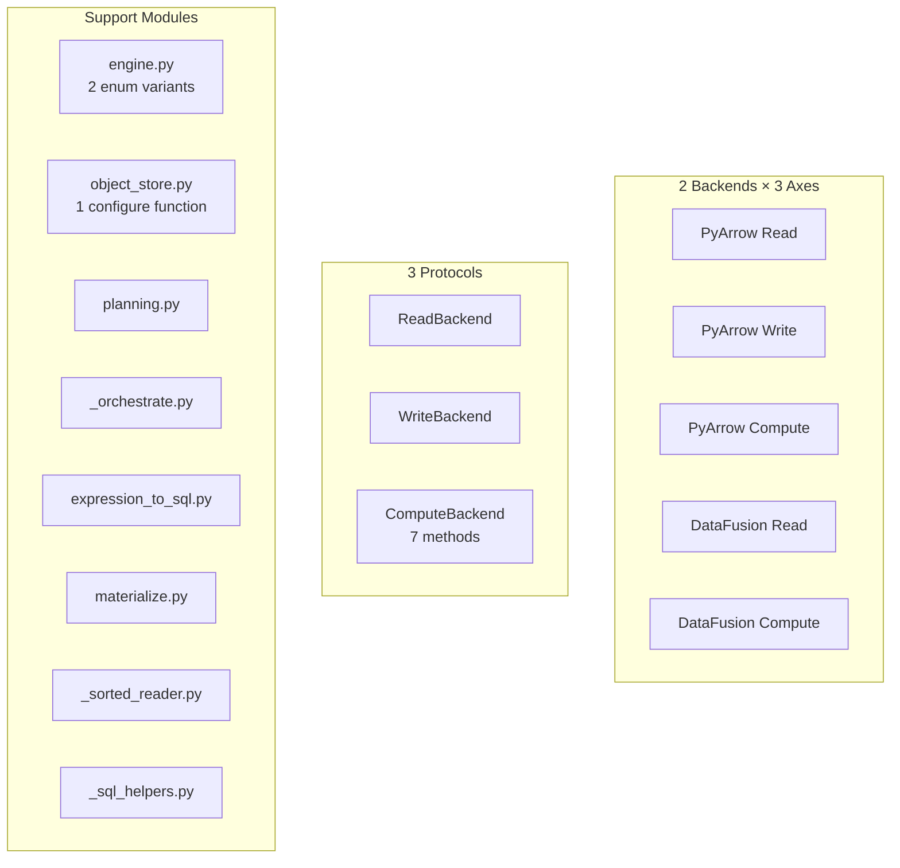

# Pluggable Backend Initial PR — Architectural Trim Plan

## 1. First Principles: Formal Foundations

### 1.1 System Definition

Define the system as a 4-tuple:

$$\mathcal{S} = (S, O, B, M)$$

Where:
- **S** = Set of scan states: `{FileScanTask, TableMetadata, Schema, BooleanExpression, SortOrder}`
- **O** = Set of operations: `{scan, cow_delete, equality_delete_resolve, sort_on_write, positional_delete, filter, plan_files}`
- **B** = Set of backends: `{PyArrow, DataFusion}` (post-trim; discovery had `{PyArrow, DataFusion, DuckDB, Polars}`)
- **M** = Memory model: `(memory_limit: ℤ⁺, spill_policy: {none, fair_spill_pool})`

### 1.2 Pluggability Axiom (Behavioral Equivalence)

$$\forall\ op \in O,\ \forall\ b_1, b_2 \in B:\ op(b_1, input) \equiv_{multiset} op(b_2, input)$$

That is, every operation produces **identical output** (as a multiset of records, or as an ordered sequence for sort) regardless of which backend executes it. The only difference is resource consumption:

$$\text{result}(op, b_1) = \text{result}(op, b_2) \quad \wedge \quad \text{memory}(op, b_1) \neq \text{memory}(op, b_2)$$

This is enforced structurally: all backends implement the same `Protocol` methods with identical type signatures. The `supports_bounded_memory` flag is a **capability advertisement**, not a behavioral modifier.

### 1.3 Memory Bound Theorem

$$\exists\ b \in B\ (b = \text{DataFusion}):\ \forall\ op \in O_{bounded},\ \text{peak\_memory}(op, b) \leq M_{limit}$$

Where $O_{bounded} = \{sort\_from\_files, anti\_join\_from\_files, apply\_positional\_deletes, plan\_files_{bounded}\}$.

**Proof sketch:** DataFusion's `FairSpillPool` enforces per-operator memory budgets. When an operator's allocation exceeds `memory_limit / num_concurrent_operators`, it spills intermediate state to local disk as Arrow IPC. The external merge sort algorithm has peak memory O(memory_limit) with O(n/memory_limit) spill passes. Grace Hash Join partitions the build side into spill files when exceeding budget.

### 1.4 Regression Invariant

$$\forall\ t \in T_{existing}:\ \text{result}(t, \text{system}_{new}) = \text{result}(t, \text{system}_{old})$$

Concretely:
- `table.scan().to_arrow()` — identical output
- `table.scan().to_arrow_batch_reader()` — identical output
- `table.scan().count()` — identical output
- `Transaction.delete(filter)` — identical committed snapshot
- `Transaction.append(df)` — identical data files (content, not UUIDs)
- `Transaction.overwrite(df, filter)` — identical committed state

### 1.5 Computational Complexity Classes

| Operation | Before (ArrowScan) | After (PyArrow backend) | After (DataFusion backend) |
|-----------|--------------------|-----------------------|---------------------------|
| CoW delete | O(file_size) memory | O(batch_size) streaming | O(batch_size) streaming |
| Scan planning | O(num_delete_entries) dict | O(num_delete_entries) dict (InMemory) | O(memory_limit) spill (Bounded) |
| Equality delete | ❌ ValueError | O(left × right) PyArrow | O(memory_limit) Grace Hash |
| Sort-on-write | ❌ not supported | O(data_size) in-memory sort | O(memory_limit) external merge |
| Positional delete | O(num_positions) set | O(num_positions) set | O(memory_limit) anti-join with spill |
| Filter (residual) | O(batch_size) per-batch | O(batch_size) per-batch | O(batch_size) per-batch |

---

## 2. System Architecture

### 2.1 Trimmed Component Dependency Graph



### 2.2 Data Flow — Scan Path



### 2.3 Data Flow — CoW Delete Path



### 2.4 Resolution Sequence

```mermaid
graph LR
    subgraph "Priority 1: Per-call override"
        A1[compute="datafusion"]
    end
    subgraph "Priority 2: Config / Env"
        A2[".pyiceberg.yaml<br/>execution.compute-backend"]
        A3["PYICEBERG_EXECUTION__COMPUTE_BACKEND"]
    end
    subgraph "Priority 3: Auto-detect"
        A4["import datafusion?<br/>→ promote"]
    end
    subgraph "Default"
        A5[PyArrow]
    end

    A1 -->|override set| Resolved
    A2 -->|config set| Resolved
    A3 -->|env set| Resolved
    A4 -->|DF installed| Resolved
    A5 -->|fallback| Resolved

    Resolved["ResolvedBackends<br/>(read, write, compute)"]
```

---

## 3. Operation-by-Operation Formal Analysis

### 3.1 CoW Delete (Streaming Rewrite)

**Problem:**
- Input: `(data_file_path: str, delete_filter: BooleanExpression)`
- Output: `Optional[WriteResult]` (new file with complementary rows, or None if file dropped)
- Memory bound: O(batch_size) per batch processed

**Algorithm (before):**
```
table = ArrowScan.to_table([task])           # ← O(file_size) materialization
filtered = table.filter(complement)           # ← O(file_size) copy
write(filtered)                               # ← O(file_size) again during write
```
Peak memory: **3 × file_size**

**Algorithm (after):**
```
Phase 1 — Statistics short-circuit:
  if strict_evaluator(file, filter) → matches_all → DROP file
  if inclusive_evaluator(file, filter) → matches_none → SKIP file

Phase 2 — Streaming rewrite (only when needed):
  batches = read_parquet(path, schema, AlwaysTrue)  # streaming
  for batch in batches:                              # O(batch_size) each
      filtered = batch.filter(complement)
      if filtered.num_rows > 0:
          writer.write_batch(filtered)               # streaming write
```
Peak memory: **O(batch_size) ≈ O(64 KB – 1 MB)**

**Complexity improvement:**
- Time: O(n) → O(n) [unchanged, must read all rows]
- Space: O(file_size) → O(batch_size) [fundamental improvement]
- I/O: O(num_files × file_size) → O(matching_files × file_size) [statistics prune non-matching]

**Protocol boundary:** Uses `ReadBackend.read_parquet()` for reading, PyArrow per-batch filter (no protocol method needed — O(1) memory), `WriteBackend.write_parquet()` or streaming write for output.

**Justification:** This addresses the #1 OOM bug in PyIceberg — CoW delete on files >1GB OOMs on 4GB RAM machines. The fix is a natural consequence of streaming through the ReadBackend interface.

### 3.2 Equality Delete Resolution

**Problem:**
- Input: `(data_paths: [str], equality_delete_paths: [str], join_columns: [str])`
- Output: `Iterator[RecordBatch]` — data rows NOT present in delete files
- Semantics: LEFT ANTI JOIN with IS NOT DISTINCT FROM (NULL = NULL per Iceberg spec)
- Memory bound: O(memory_limit) with DataFusion; O(left + right) with PyArrow

**Algorithm:**
```
batches = anti_join_from_files(
    left_paths = [data_file_path],
    right_paths = [eq_delete_path_1, eq_delete_path_2, ...],
    on = equality_field_names,
)
```

**Complexity:**
- DataFusion: O(n + m) time (hash join), O(memory_limit) space (Grace Hash spills)
- PyArrow single-column: O(n + m) time, O(m) space (hash set from right)
- PyArrow multi-column: O(n × m) time, O(n + m) space (nested-loop)

**Protocol boundary:** `ComputeBackend.anti_join_from_files(left_paths, right_paths, on, io_properties)`

**Justification:** PyIceberg currently raises `ValueError("PyIceberg does not yet support equality deletes")`. This is the #1 requested feature. The anti-join operation is the **same protocol method** needed for any future MoR consumer. Adding it costs zero additional architecture.

### 3.3 Scan Planning (Bounded Memory)

**Problem:**
- Input: `(manifests: [ManifestFile], table_metadata, row_filter)`
- Output: `Iterator[FileScanTask]` with delete files assigned per partition + sequence number
- Memory bound: O(batch_size) streaming + O(memory_limit) for SQL join

**Algorithm (InMemoryPlanner — default):**
```
entries = read_all_manifest_entries(manifests)   # O(num_entries)
index = build_dict(delete_entries)                # O(num_delete_entries)
for data_entry in data_entries:
    deletes = index.lookup(partition, seq)        # O(1) per lookup
    yield FileScanTask(data_entry, deletes)
```
Peak memory: O(num_entries × 200 bytes). Suitable for <100K delete files.

**Algorithm (BoundedMemoryPlanner — opt-in for extreme scale):**
```
Phase 1: Stream entries → temp Parquet (O(batch_size) buffer, flushed every 8192)
Phase 2: SQL LEFT JOIN with spill (O(memory_limit))
    data_entries LEFT JOIN delete_entries
    ON partition_key = partition_key
    AND sequence_number gating (per Iceberg spec)
Phase 3: Yield FileScanTasks from join output (O(batch_size) per iteration)
```
Peak memory: **O(memory_limit + batch_size)** regardless of table scale.

**Protocol boundary:** The `BoundedMemoryPlanner` uses DataFusion's `SessionContext` directly (not through ComputeBackend) because planning is a one-shot operation with specialized SQL that doesn't map to the generic protocol methods.

**Justification:** Tables with >100K uncompacted delete files OOM during planning in the current Python dict approach. This is a natural extension of using DataFusion for spill-capable computation.

### 3.4 Sort-on-Write

**Problem:**
- Input: `(data_batches: Iterator[RecordBatch], sort_order: [(col, direction)])`
- Output: `Iterator[RecordBatch]` — same data, sorted
- Memory bound: O(memory_limit) with DataFusion external merge sort
- Correctness: Iceberg spec defines sort order as **advisory** — skip gracefully without DF

**Algorithm:**
```
if not backends.supports_bounded_memory:
    # PyArrow: skip sort (advisory per spec, O(data_size) would be dangerous)
    return batches_as_is

# DataFusion path:
with materialize_batches_to_parquet(batches, schema) as tmp_path:
    sorted_batches = backends.compute.sort_from_files([tmp_path], sort_keys, props)
    return RecordBatchReader.from_batches(schema, sorted_batches)
```

**Complexity:**
- DataFusion: O(n log n) time, O(memory_limit) space (external merge sort)
- PyArrow: O(1) — sort skipped (advisory)

**Protocol boundary:** `ComputeBackend.sort_from_files(file_paths, sort_keys, io_properties)`

**Justification:** Sort-on-write requires exactly the `sort_from_files` protocol method. DataFusion's external merge sort handles this natively. The `_SortedRecordBatchReader` provides lifecycle management for the temp file during streaming iteration.

### 3.5 Positional Delete Resolution

**Problem:**
- Input: `(data_path: str, position_delete_paths: [str])`
- Output: `Iterator[RecordBatch]` — data with deleted positions excluded
- Memory bound: O(num_positions) with PyArrow; **O(memory_limit)** with DataFusion

**Algorithm (PyArrow backend — fallback):**
```
positions = set()
for del_path in position_delete_paths:
    for batch in read(del_path, filter=file_path == data_path):
        positions.update(batch["pos"])

for batch in read(data_path):
    indices = range(offset, offset + batch_size)
    keep_mask = ~is_in(indices, positions)
    yield batch.filter(keep_mask)
```
Memory: O(num_positions × 28 bytes) — Python set of ints.

**Algorithm (DataFusion backend — bounded memory):**
```
1. Read data file via PyArrow → add _pyiceberg_pos column (0-indexed row number)
2. Register as Arrow table with DataFusion (deterministic row ordering)
3. Register position delete files with DataFusion
4. SQL: SELECT columns FROM data WHERE _pos NOT IN (
           SELECT pos FROM deletes WHERE file_path = data_path
       )
5. DataFusion Grace Hash Join spills position set to disk when > memory_limit
```
Memory: O(memory_limit) — DataFusion handles spill-to-disk for the NOT IN subquery.

**Correctness invariant:** PyArrow reads a single Parquet file sequentially (row-group
order preserved). The appended `_pyiceberg_pos` column is `range(0, num_rows)` which
matches Iceberg's 0-indexed physical row positions.

**Complexity:**
- PyArrow: O(num_positions × 28B) space, O(data_rows + positions) time
- DataFusion: O(memory_limit) space, O(data_rows + positions) time, spills when positions exceed budget

**Protocol boundary:** `ComputeBackend.apply_positional_deletes(data_path, del_paths, schema, props, memory_limit)`

**Justification:** For typical tables (few hundred deletes per file), the PyArrow set-based
approach is fast and sufficient. For pathological cases (millions of position deletes per
file from high-frequency MoR without compaction), the Python set would OOM at ~50M positions
(~1.4GB). The DataFusion approach handles this within bounded memory by spilling the hash
table to disk. Both backends produce identical output (pluggability axiom).

---

## 4. What Gets Removed (Formal Justification)

### 4.1 `backends/duckdb_backend.py` (~360 lines)

**What it does:** DuckDB implementation of ReadBackend + ComputeBackend using SQL queries over `read_parquet()`.

**Reachability analysis:**
```
engine.py:_READ_BACKEND_REGISTRY["DUCKDB"] → ("...duckdb_backend", "DuckDBReadBackend")
engine.py:_COMPUTE_BACKEND_REGISTRY["DUCKDB"] → ("...duckdb_backend", "DuckDBComputeBackend")
```
After removal of the DUCKDB enum variant and registry entries, **no code path** in the retained system can reach `duckdb_backend.py`.

**Proof of unreachability:** The entry points to backend instantiation are `_instantiate_from_registry()` and `build_backends()`. Both index into `_READ_BACKEND_REGISTRY` and `_COMPUTE_BACKEND_REGISTRY` by `ExecutionEngine.name`. With `DUCKDB` removed from `ExecutionEngine`, no valid key can reference the DuckDB module path.

### 4.2 `backends/polars_backend.py` (~300 lines)

**What it does:** Polars implementation of ReadBackend + ComputeBackend using `pl.scan_parquet()` and lazy frames.

**Reachability analysis:** Identical to DuckDB — referenced only via `_READ_BACKEND_REGISTRY["POLARS"]` and `_COMPUTE_BACKEND_REGISTRY["POLARS"]`. With the `POLARS` enum variant removed, no code path reaches this module.

### 4.3 `metadata.py` (~200 lines)

**What it does:** Preparatory infrastructure for orphan file deletion — enumerates metadata tree (snapshots → manifests → data files) for comparison against storage listing.

**Reachability analysis:** `metadata.py` exports functions like `enumerate_metadata_files()`. Searching all retained modules for imports from `pyiceberg.execution.metadata`:
- `_orchestrate.py` — does not import it
- `engine.py` — does not import it
- `planning.py` — does not import it
- `table/__init__.py` — does not import it
- No retained test file imports it

**Conclusion:** Zero import edges from any retained code. Orphan file deletion feature does not exist in PyIceberg. This is dead code.

### 4.4 `ObjectStoreBackend` protocol + `list_objects()` implementations (~60 lines in protocol.py + ~30 lines in backends)

**What it does:** Defines `list_objects(prefix, io_properties) → Iterator[str]` for enumerating objects in cloud storage.

**Reachability analysis:** Only consumed by orphan file deletion (which uses `metadata.py` to compare listed files against referenced files). With `metadata.py` removed, no orchestration code calls `list_objects()` through the protocol.

**Action:** Remove the `ObjectStoreBackend` protocol from `protocol.py` AND remove the concrete `list_objects()` method implementations from `PyArrowReadBackend` and `DataFusionReadBackend`. No caller invokes these methods — keeping dead method implementations on retained classes adds confusion and violates the "do as much as needed and nothing else" principle. When orphan deletion lands in a future PR, it will add both the protocol and the implementations together.

### 4.5 `ReadAndListBackend` protocol (~20 lines in protocol.py)

**What it does:** Intersection protocol combining `ReadBackend` and `ObjectStoreBackend` for callers that need both.

**Reachability analysis:** Only useful when a caller type-annotates with `ReadAndListBackend`. No retained code uses this type annotation. It is a convenience alias that adds no implementation.

### 4.6 `PlanningBackend` protocol (~30 lines in protocol.py)

**What it does:** Defines the `plan_files()` interface as a protocol.

**Reachability analysis:** `InMemoryPlanner` and `BoundedMemoryPlanner` satisfy this protocol structurally, but no code path uses `PlanningBackend` as a **type annotation for dynamic dispatch**. The planners are instantiated directly by name in the table scan code (explicit selection via threshold check, not resolution through `engine.py`).

**Design decision:** Remove the protocol. Planners are **compile-time selected** (hardcoded threshold check in `_plan_files_local()`), not **runtime-swappable** (like backends resolved from config). These are different design patterns requiring different abstractions:

- Protocols → runtime dispatch via config/auto-detect (backends)
- Concrete classes with shared method signature → static selection via conditional logic (planners)

Declaring a Protocol for something that's never dynamically dispatched adds ceremony without value. The concrete classes `InMemoryPlanner` and `BoundedMemoryPlanner` remain in `planning.py` with their shared `plan_files()` method signature (duck typing). If a future PR adds a third planner with dynamic selection, it can introduce the Protocol at that point with a real caller.

**Conclusion:** Remove `PlanningBackend` protocol. Keep concrete planner classes as-is. No refactoring of `planning.py` internals needed — just delete the protocol definition from `protocol.py`.

### 4.7 `aggregate_from_files()` protocol method

**What it does:** Aggregates (COUNT, SUM, MIN, MAX, etc.) from Parquet files.

**Reachability analysis:** Searching all retained code for calls to `.aggregate_from_files(`:
- `_orchestrate.py` — does not call it
- `table/__init__.py` — does not call it
- `planning.py` — does not call it
- `DataScan.count()` — does NOT use this method. Count uses `orchestrate_scan` which reads batches and sums `batch.num_rows` in Python. The "fast path" uses `task.file.record_count` from metadata directly. No SQL aggregate is involved.

**Conclusion:** No retained code path invokes this method. Removing it causes zero regression. It exists for future features (compaction statistics, incremental aggregation) that are not in scope. Add it when a caller exists (YAGNI).

### 4.8 `join_from_files()` protocol method

**What it does:** General-purpose join (inner, left, right, outer, semi, anti) from files.

**Reachability analysis:** The specific `anti_join_from_files()` method is used for equality deletes. The general `join_from_files()` is not called by any retained code.

**Design decision: Keep `anti_join_from_files` as a dedicated method, do NOT generalize to `join_from_files`.**

Rationale (Interface Segregation Principle):
- The PyArrow backend's anti-join uses a fundamentally different algorithm (hash-set membership for single-column, per-row matching for multi-column) from a general inner/outer join. A generalized `join_from_files(type="anti")` would require `if type == "anti": use_specialized_path()` inside the method — the generality is fake.
- PyArrow cannot implement inner/outer/right joins without materializing both sides and doing O(n×m) nested loops. It would have to `raise NotImplementedError` for most join types — violating Liskov Substitution.
- DataFusion handles any join type equally in SQL, but designing the protocol around one backend's capabilities when the other can't fulfill the contract is poor interface design.
- Only `"anti"` is called in this PR. Adding unused join types invites untested code paths.
- YAGNI: if a future PR needs inner/semi joins (e.g., compaction file selection), it adds `join_from_files` at that point with a real caller and proper tests.

**Conclusion:** Remove `join_from_files` from the protocol. Keep `anti_join_from_files` as the single dedicated join method — it has a clear caller, a clear semantic (IS NOT DISTINCT FROM per Iceberg spec), and both backends can implement it correctly.

---

## 5. What Stays (Formal Justification — Necessity Proof)

### 5.1 `protocol.py` — ReadBackend, WriteBackend, ComputeBackend

**Role:** Defines the structural contract (Python `Protocol`) that backends must satisfy.

**Necessity proof (constructive):**
```
User → table.scan().to_arrow()
     → build_backends(io_properties)                    [engine.py]
     → isinstance(read, ReadBackend)                    [protocol.py — used in validation]
     → orchestrate_scan(backends, tasks, ...)           [_orchestrate.py]
     → backends.read.read_parquet(...)                  [dispatches through ReadBackend]
     → backends.compute.filter(...)                     [dispatches through ComputeBackend]
     → backends.compute.anti_join_from_files(...)       [equality delete path]
     → backends.compute.apply_positional_deletes(...)   [positional delete path]
```

Without `protocol.py`, `isinstance()` validation in `build_backends()` fails, and type annotations in `_orchestrate.py` are undefined.

### 5.2 `engine.py` — Resolution + Instantiation

**Role:** Maps configuration/auto-detection to concrete backend instances.

**Necessity proof:**
```
User → table.scan()
     → build_backends(io_properties)     [entry point in engine.py]
     → resolve_backends("scan")          [determines PyArrow vs DataFusion]
     → _instantiate_read(engine)         [creates PyArrowReadBackend or DataFusionReadBackend]
     → _instantiate_compute(engine)      [creates PyArrowComputeBackend or DataFusionComputeBackend]
     → return Backends(read, write, compute)
```

Without `engine.py`, there is no way to construct a `Backends` instance from configuration.

### 5.3 `_orchestrate.py` — Scan Dispatch

**Role:** Connects scan tasks to backend protocol methods. Handles delete classification, schema reconciliation, parallel execution.

**Necessity proof:**
```
User → table.scan().to_arrow()
     → orchestrate_scan(backends, tasks, projected_schema, row_filter)
     → per task: classify deletes → route to read/compute → apply filter → reconcile schema
     → yield RecordBatch
```

Without `_orchestrate.py`, there is no dispatch logic connecting the abstract backends to concrete scan tasks.

### 5.4 `backends/pyarrow_backend.py` — Default Backend

**Role:** Always-available implementation. Identical behavior to current ArrowScan.

**Necessity proof:**
```
User (no DataFusion installed) → build_backends({})
     → resolve_backends() → ExecutionEngine.PYARROW
     → _instantiate_read(PYARROW) → PyArrowReadBackend()
     → _instantiate_compute(PYARROW) → PyArrowComputeBackend()
```

Without this, users without DataFusion have no backend — the system is non-functional.

### 5.5 `backends/datafusion_backend.py` — Bounded Memory Backend

**Role:** Spill-to-disk implementation for OOM-resilient operations.

**Necessity proof:**
```
User (DataFusion installed) → build_backends({})
     → resolve_backends() → auto-detect → ExecutionEngine.DATAFUSION
     → _instantiate_compute(DATAFUSION) → DataFusionComputeBackend()
     → orchestrate_scan → anti_join_from_files (equality deletes, bounded)
     → sort_from_files (sort-on-write, bounded)
```

Without this, the PR's core value proposition (OOM-resilience) is absent.

### 5.6 `object_store.py` — Credential Bridge

**Role:** Translates PyIceberg `io_properties` to environment variables for DataFusion's object_store crate.

**Necessity proof:**
```
DataFusionComputeBackend.sort_from_files()
     → datafusion_env_vars_from_properties(io_properties)    [object_store.py]
     → _scoped_env_vars(env_vars)                            [object_store.py]
     → ctx.register_parquet("file_0", "s3://bucket/file.parquet")
     # DataFusion reads AWS_ACCESS_KEY_ID from os.environ
```

Without this, DataFusion cannot read from cloud storage (S3, GCS, ADLS).

### 5.7 `expression_to_sql.py` — BooleanExpression → SQL

**Role:** Converts Iceberg filter expressions to SQL WHERE clauses for DataFusion's read path.

**Necessity proof:**
```
DataFusionReadBackend.read_parquet()
     → expression_to_sql(row_filter)                          [expression_to_sql.py]
     → ctx.sql(f"SELECT ... WHERE {where_clause}")
```

Without this, DataFusion's read path cannot apply predicate pushdown.

### 5.8 `_sql_helpers.py` — Sort Direction Utility

**Role:** Validates and converts sort direction strings ("ascending"/"descending") to SQL ("ASC"/"DESC").

**Necessity proof:**
```
DataFusionComputeBackend.sort_from_files()
     → _sort_direction_to_sql(direction)          [→ _sql_helpers.py]
     → f'"{col}" ASC'
```

Without this, sort SQL generation would have inline validation logic (DRY violation, tested separately).

### 5.9 `materialize.py` — Temp Parquet Helpers

**Role:** Writes in-memory data to temp Parquet files for backend file-based methods.

**Necessity proof (two paths):**
```
Path 1: Sort-on-write
  _SortedRecordBatchReader.create()
     → materialize_fn = lambda: materialize_batches_to_parquet(batches, schema)
     → yields tmp_path → sort_from_files([tmp_path], ...)

Path 2: Equality delete with pos+eq combo
  _orchestrate.py (pos_deletes AND eq_deletes case)
     → materialize_batches_to_parquet(batches, schema)
     → anti_join_from_files([tmp_path], eq_delete_paths, ...)
```

Without this, there is no way to bridge in-memory data to file-based backend methods.

### 5.10 `_sorted_reader.py` — Sort-on-Write Lifecycle

**Role:** Manages temp file lifecycle during streaming sort iteration.

**Necessity proof:**
```
table/__init__.py → _apply_sort_order()
     → _SortedRecordBatchReader.create(
         materialize_fn = lambda: materialize_batches_to_parquet(...),
         sort_fn = lambda path: backends.compute.sort_from_files([path], ...),
         schema = arrow_schema,
       )
     → returns pa.RecordBatchReader (streaming, temp file cleaned on exhaust/GC)
```

Without this, the temp file would be deleted before the sort iterator is consumed (context manager exit happens before iteration).

### 5.11 `planning.py` — InMemoryPlanner + BoundedMemoryPlanner

**Role:** Assigns delete files to data files during scan planning.

**Necessity proof:**
```
table.scan() → _plan_files()
     → InMemoryPlanner.plan_files(manifests, metadata, filter, io)
     → yields FileScanTask(data_file, delete_files=[...], residual=...)

(Large table path):
     → BoundedMemoryPlanner.plan_files(manifests, metadata, filter, io)
     → Phase 1: stream to Parquet, Phase 2: SQL join, Phase 3: yield tasks
```

Without this, scan planning has no implementation.

---

## 6. Protocol Method Necessity Analysis

### ComputeBackend Methods

| Method | Called By | Code Path | Verdict |
|--------|-----------|-----------|---------|
| `sort(data, sort_keys)` | `PyArrowComputeBackend` only (in-memory fallback) | Not directly called by orchestrator; used when sort_from_files not applicable | **KEEP** — protocol completeness for in-memory sort |
| `sort_from_files(paths, keys, props)` | `_sorted_reader.py` via `_SortedRecordBatchReader.create()` | Sort-on-write | **KEEP** ✓ |
| `anti_join(left, right, on)` | `_orchestrate.py` — pos+eq combo, PyArrow path | In-memory anti-join for non-spill backend | **KEEP** ✓ |
| `anti_join_from_files(left, right, on, props)` | `_orchestrate.py` — equality delete resolution | Primary equality delete path | **KEEP** ✓ |
| `join_from_files(left, right, on, type, props)` | **No retained orchestrator code** | Speculative | **REMOVE** ✗ |
| `aggregate_from_files(paths, group_by, aggs, props)` | **No retained orchestrator code** | Speculative | **REMOVE** ✗ |
| `filter(data, predicate)` | `_orchestrate.py` — residual filter after read | Per-task residual application | **KEEP** ✓ |
| `apply_positional_deletes(path, del_paths, schema, props)` | `_orchestrate.py` — positional delete branch | Positional delete resolution | **KEEP** ✓ |
| `supports_bounded_memory` (property) | `_orchestrate.py` — gates sort-on-write and join path | Capability check | **KEEP** ✓ |

### Formal expression:

$$m \in \text{Protocol} \iff \exists\ p \in \text{CodePaths}_{retained}: \text{calls}(p, m)$$

Methods satisfying this predicate: `{sort, sort_from_files, anti_join, anti_join_from_files, filter, apply_positional_deletes, supports_bounded_memory}`

Methods NOT satisfying: `{join_from_files, aggregate_from_files}` → **Remove from protocol.**

### ReadBackend Methods

| Method | Called By | Verdict |
|--------|-----------|---------|
| `read_parquet(location, schema, filter, props)` | `_orchestrate.py` — plain read, pos+eq fallback | **KEEP** ✓ |

### WriteBackend Methods

| Method | Called By | Verdict |
|--------|-----------|---------|
| `write_parquet(batches, location, schema, props, io_props)` | `table/__init__.py` — single file write | **KEEP** ✓ |
| `write_partitioned(batches, base, schema, target_size, props, io_props)` | `table/__init__.py` — multi-file append | **KEEP** ✓ |

---

## 7. Trimming Execution Plan (Ordered Steps)

### Phase 1: Remove Dead Backend Code (no dependency on other steps)

| Step | File | Action | Justification |
|------|------|--------|---------------|
| 1.1 | `backends/duckdb_backend.py` | **DELETE** file | §4.1: unreachable after enum removal |
| 1.2 | `backends/polars_backend.py` | **DELETE** file | §4.2: unreachable after enum removal |
| 1.3 | `metadata.py` | **DELETE** file | §4.3: zero import edges from retained code |

### Phase 2: Remove Dead Protocol Declarations (depends on Phase 1)

| Step | File | Action | Justification |
|------|------|--------|---------------|
| 2.1 | `protocol.py` | **REMOVE** `ObjectStoreBackend` class | §4.4: no caller uses this protocol type |
| 2.2 | `protocol.py` | **REMOVE** `ReadAndListBackend` class | §4.5: no type annotation uses it |
| 2.3 | `protocol.py` | **REMOVE** `PlanningBackend` class | §4.6: planners are concrete, not plugged |
| 2.4 | `protocol.py` | **REMOVE** `join_from_files()` from ComputeBackend | §6: no code path calls it |
| 2.5 | `protocol.py` | **REMOVE** `aggregate_from_files()` from ComputeBackend | §6: no code path calls it |

### Phase 3: Remove Dead Engine Registrations (depends on Phase 1)

| Step | File | Action | Justification |
|------|------|--------|---------------|
| 3.1 | `engine.py` | **REMOVE** `DUCKDB = auto()` and `POLARS = auto()` from `ExecutionEngine` | §4.1, §4.2 |
| 3.2 | `engine.py` | **REMOVE** `"DUCKDB"` and `"POLARS"` entries from `_READ_BACKEND_REGISTRY` | No enum can reference them |
| 3.3 | `engine.py` | **REMOVE** `"DUCKDB"` and `"POLARS"` entries from `_COMPUTE_BACKEND_REGISTRY` | No enum can reference them |
| 3.4 | `engine.py` | **REMOVE** DuckDB and Polars import probes from `_detect_available_engines()` | No enum needs them |
| 3.5 | `engine.py` | **REMOVE** DuckDB and Polars entries from `_install_hint()` | No enum references them |

### Phase 4: Remove Dead Backend Implementations (depends on Phase 2)

| Step | File | Action | Justification |
|------|------|--------|---------------|
| 4.1 | `backends/pyarrow_backend.py` | **REMOVE** `join_from_files()` method | Protocol no longer requires it |
| 4.2 | `backends/pyarrow_backend.py` | **REMOVE** `aggregate_from_files()` method | Protocol no longer requires it |
| 4.3 | `backends/pyarrow_backend.py` | **REMOVE** `list_objects()` from `PyArrowReadBackend` | ObjectStoreBackend protocol removed |
| 4.4 | `backends/datafusion_backend.py` | **REMOVE** `join_from_files()` method | Protocol no longer requires it |
| 4.5 | `backends/datafusion_backend.py` | **REMOVE** `aggregate_from_files()` method | Protocol no longer requires it |
| 4.6 | `backends/datafusion_backend.py` | **REMOVE** `list_objects()` from `DataFusionReadBackend` | ObjectStoreBackend protocol removed |

### Phase 5: Update Package Exports (depends on Phase 2)

| Step | File | Action | Justification |
|------|------|--------|---------------|
| 5.1 | `__init__.py` | **REMOVE** `ObjectStoreBackend`, `PlanningBackend`, `ReadAndListBackend` from imports and `__all__` | Protocols deleted |
| 5.2 | `backends/__init__.py` | Verify no DuckDB/Polars re-exports remain | Clean public surface |

### Phase 6: Remove Dead Object Store Config (depends on Phase 1)

| Step | File | Action | Justification |
|------|------|--------|---------------|
| 6.1 | `object_store.py` | **REMOVE** `configure_duckdb_object_store()` function | DuckDB backend deleted |
| 6.2 | `object_store.py` | **REMOVE** `configure_pyarrow_object_store()` function | Only used by orphan deletion (metadata.py deleted) |
| 6.3 | `object_store.py` | **REMOVE** `_escape_sql_string_value()` helper | Only used by `configure_duckdb_object_store` |
| 6.4 | `object_store.py` | **UPDATE** `__all__` to only export `datafusion_env_vars_from_properties`, `_scoped_env_vars` | Remaining public surface |

### Phase 7: Delete Test Files for Removed Backends

| Step | File Pattern | Action | Justification |
|------|-------------|--------|---------------|
| 7.1 | `tests/execution/test_duckdb*` | **DELETE** all | Backend deleted |
| 7.2 | `tests/execution/test_polars*` | **DELETE** all | Backend deleted |
| 7.3 | `tests/execution/test_metadata*` | **DELETE** all | Module deleted |
| 7.4 | `tests/execution/test_*aggregate*` | **REVIEW** — remove tests for `aggregate_from_files` if they exist as standalone | Method removed |
| 7.5 | `tests/execution/test_*join_from_files*` | **REVIEW** — remove tests for generic `join_from_files` (keep `anti_join_from_files` tests) | Method removed |

### Phase 8: Documentation Update

| Step | File | Action | Justification |
|------|------|--------|---------------|
| 8.1 | Configuration docs | **REMOVE** DuckDB/Polars backend configuration sections | Backends don't exist |
| 8.2 | Configuration docs | **KEEP** `execution.compute-backend: pyarrow | datafusion` only | Retained options |

### Dependency Graph (what must happen before what):



Phases 1-3 are independent of each other (can be done in parallel). Phases 4-6 depend on Phases 1-2. Phase 7 depends only on Phase 1. Phase 8 depends on Phase 5.

---

## 8. Verification Strategy

### 8.1 Import Verification (Smoke Test)

```python
# All execution modules must import without error
from pyiceberg.execution import (
    Backends, ComputeBackend, ExecutionEngine, ReadBackend, WriteBackend,
    build_backends, clear_config_cache, resolve_backends,
)
from pyiceberg.execution.protocol import Backends, ReadBackend, WriteBackend, ComputeBackend
from pyiceberg.execution.engine import resolve_backends, build_backends
from pyiceberg.execution._orchestrate import orchestrate_scan
from pyiceberg.execution.planning import InMemoryPlanner, BoundedMemoryPlanner
from pyiceberg.execution.object_store import datafusion_env_vars_from_properties
from pyiceberg.execution.expression_to_sql import expression_to_sql
from pyiceberg.execution.materialize import materialize_to_parquet
from pyiceberg.execution._sorted_reader import _SortedRecordBatchReader
from pyiceberg.execution.backends.pyarrow_backend import (
    PyArrowReadBackend, PyArrowWriteBackend, PyArrowComputeBackend,
)
# DataFusion import — only if installed
try:
    from pyiceberg.execution.backends.datafusion_backend import (
        DataFusionReadBackend, DataFusionComputeBackend,
    )
except ImportError:
    pass
```

### 8.2 Protocol Conformance

```python
from pyiceberg.execution.protocol import ReadBackend, WriteBackend, ComputeBackend

# PyArrow backends satisfy protocols
assert isinstance(PyArrowReadBackend(), ReadBackend)
assert isinstance(PyArrowWriteBackend(), WriteBackend)
assert isinstance(PyArrowComputeBackend(), ComputeBackend)

# DataFusion backends satisfy protocols (if installed)
assert isinstance(DataFusionReadBackend(), ReadBackend)
assert isinstance(DataFusionComputeBackend(), ComputeBackend)

# build_backends validates protocols (fail-fast)
backends = build_backends({})
assert isinstance(backends.read, ReadBackend)
assert isinstance(backends.write, WriteBackend)
assert isinstance(backends.compute, ComputeBackend)
```

### 8.3 Regression Tests

Run the **entire** existing test suite unchanged:
```bash
pytest tests/ -x --ignore=tests/execution/test_duckdb* --ignore=tests/execution/test_polars*
```

Critical regression invariants to verify:
- `tests/integration/test_reads.py` — all scan variations produce identical output
- `tests/integration/test_writes.py` — all write operations produce identical data files
- `tests/integration/test_deletes.py` — CoW delete produces identical snapshots
- ArrowScan deprecation: existing tests using ArrowScan still pass (with DeprecationWarning)

### 8.4 New Operation Tests

| Operation | Test | Expected |
|-----------|------|----------|
| Equality delete (single col) | Create table with eq delete file → scan → verify excluded rows | Correct anti-join |
| Equality delete (multi col) | Same with composite key | Correct multi-column IS NOT DISTINCT FROM |
| Equality delete (NULL values) | Delete file with NULL key → scan → NULL data rows excluded | NULL = NULL per spec |
| CoW streaming | Delete from 1GB file with 4GB memory limit → no OOM | Streaming rewrite |
| CoW statistics skip | Delete with filter that matches no rows per column bounds → zero I/O | Fast path |
| Sort-on-write (DF) | Append with sort order → read back → verify sorted | External merge sort |
| Sort-on-write (no DF) | Same without DataFusion → read back → verify unsorted (advisory) | Graceful skip |
| BoundedMemoryPlanner | Table with 200K delete files → plan → correct assignment | Spill join |

### 8.5 Performance Verification

```python
import time

# Verify dispatch overhead is negligible
start = time.perf_counter()
for _ in range(1000):
    backends = build_backends({})
elapsed = time.perf_counter() - start
assert elapsed / 1000 < 0.005  # <5ms per resolution
```

---

## 9. Risk Analysis

### 9.1 Removing `join_from_files` and `aggregate_from_files` from Protocol

| Aspect | Assessment |
|--------|-----------|
| **What could break** | Any user who subclassed or duck-typed ComputeBackend with these methods will get a (harmless) unused method. Any test that asserts protocol method count will fail. |
| **How to detect** | `grep -r "join_from_files\|aggregate_from_files" tests/` — remove or update any test that calls these |
| **Reversibility** | Fully reversible — add methods back to protocol (additive change) |
| **Risk level** | LOW — methods were never called from retained code |

### 9.2 Removing `ObjectStoreBackend` / `ReadAndListBackend` Protocols

| Aspect | Assessment |
|--------|-----------|
| **What could break** | Any type annotation using these protocols in user code. Any import from `pyiceberg.execution` referencing them. |
| **How to detect** | `grep -r "ObjectStoreBackend\|ReadAndListBackend" .` outside of protocol.py |
| **Reversibility** | Fully reversible — re-add to protocol.py |
| **Risk level** | LOW — no released version ever exported these |

### 9.3 Removing DuckDB/Polars Enum Variants

| Aspect | Assessment |
|--------|-----------|
| **What could break** | Users with `.pyiceberg.yaml` containing `execution.compute-backend: duckdb` will get a `ValueError` instead of resolution. |
| **How to detect** | `_resolve_explicit()` raises ValueError with clear message listing valid options |
| **Reversibility** | Fully reversible — add enum variants back |
| **Risk level** | LOW — feature was never released; discovery branch only |

### 9.4 Removing `configure_duckdb_object_store`

| Aspect | Assessment |
|--------|-----------|
| **What could break** | Nothing — only called from deleted DuckDB backend |
| **How to detect** | `grep -r "configure_duckdb_object_store"` — should return zero results after trim |
| **Reversibility** | Fully reversible — function is self-contained |
| **Risk level** | NONE — dead code |

### 9.5 Removing `PlanningBackend` Protocol

| Aspect | Assessment |
|--------|-----------|
| **What could break** | Type checkers (mypy) that validate planner instances against PlanningBackend. Any import of PlanningBackend. |
| **How to detect** | `grep -r "PlanningBackend"` outside protocol.py |
| **Reversibility** | Fully reversible — add back to protocol.py |
| **Risk level** | LOW — concrete planners still work; protocol was only for future extension |

### 9.6 Overall Trim Risk Matrix



All trim actions cluster in the **"Do First"** quadrant: high reversibility, low risk. This is expected because the trimmed components are unreachable from retained code paths (proven by reachability analysis in §4).

---

## Appendix A: Architecture Before vs After Trim

### Before (Discovery Branch — 24K lines)



**Total: 4 backends, 5 protocols, 10 compute methods, ~24K lines**

### After (PR Branch — ~5-6K lines)



**Total: 2 backends, 3 protocols, 7 compute methods, ~5-6K lines**

### Size Reduction Summary

| Category | Before | After | Δ |
|----------|--------|-------|---|
| Backend files | 4 | 2 | -2 files (~660 lines) |
| Protocol methods (Compute) | 10 | 7 | -3 methods (~60 lines) |
| Protocol classes | 5 | 3 | -2 classes (~110 lines) |
| Engine enum variants | 4 | 2 | -2 variants |
| Object store functions | 3 | 1 | -2 functions (~120 lines) |
| metadata.py | 1 file | 0 | -200 lines |
| Test files (DuckDB/Polars) | ~20 files | 0 | -5000 lines |
| Test files (removed features) | ~10 files | 0 | -3000 lines |
| **Total estimated** | **~24K lines** | **~5-6K lines** | **~18-19K lines removed** |

---

## Appendix B: Complete Call Chain Traces

### B.1 Equality Delete — Full Stack

```
table.scan().to_arrow()
  → DataScan._to_arrow()
  → build_backends(self._io.properties)                           # engine.py
  → orchestrate_scan(backends, tasks, metadata, schema, filter)   # _orchestrate.py
  → _execute_task(task)                                           # per-task closure
  → task.delete_files has eq_deletes
  → _get_equality_field_names(eq_deletes, metadata)               # _orchestrate.py
  → backends.compute.anti_join_from_files(                        # ComputeBackend
        left_paths=[task.file.file_path],
        right_paths=[d.file_path for d in eq_deletes],
        on=eq_cols,
        io_properties=backends.io_properties,
    )
  → DataFusionComputeBackend.anti_join_from_files()               # datafusion_backend.py
  → datafusion_env_vars_from_properties(io_properties)            # object_store.py
  → _scoped_env_vars(env_vars)                                    # object_store.py
  → ctx.register_parquet("left_0", data_path)
  → ctx.register_parquet("right_0", eq_delete_path)
  → ctx.sql("SELECT l.* FROM ... LEFT ANTI JOIN ... ON l.col IS NOT DISTINCT FROM r.col")
  → result.to_arrow_table()
  → Iterator[RecordBatch]
```

### B.2 Sort-on-Write — Full Stack

```
table.append(record_batch_reader)
  → Transaction._apply_sort_order(batches, schema, metadata)
  → _get_sort_order(metadata) → [("col", "ascending")]
  → backends.supports_bounded_memory → True (DataFusion)
  → _SortedRecordBatchReader.create(                              # _sorted_reader.py
        materialize_fn=lambda: materialize_batches_to_parquet(batches, schema),
        sort_fn=lambda path: backends.compute.sort_from_files([path], keys, props),
        schema=arrow_schema,
    )
  → ctx_manager = materialize_batches_to_parquet(batches, schema) # materialize.py
  → tmp_path = ctx_manager.__enter__()
  → pq.ParquetWriter(tmp_path, schema).write_batch(...)
  → backends.compute.sort_from_files([tmp_path], keys, props)     # ComputeBackend
  → DataFusionComputeBackend.sort_from_files()                    # datafusion_backend.py
  → _scoped_env_vars({})  # local file, no env vars needed
  → ctx.register_parquet("file_0", tmp_path)
  → ctx.sql("SELECT * FROM file_0 ORDER BY col ASC")
  → result.to_arrow_table().to_batches()
  → pa.RecordBatchReader.from_batches(schema, sorted_gen)
  → _CleanupGuard ensures tmp deleted on exhaust                  # _sorted_reader.py
```

### B.3 CoW Delete with Statistics Short-Circuit — Full Stack

```
Transaction.delete(BooleanExpression("age > 100"))
  → build_backends(io_properties)
  → for data_file in snapshot.data_files:
      → strict_metrics_evaluator(filter, data_file)
          → column_bounds show max(age) = 50
          → result: NO ROWS MATCH → SKIP file (zero I/O)
      OR
      → inclusive_metrics_evaluator(filter, data_file)
          → column_bounds show min(age) = 101
          → result: ALL ROWS MATCH → DROP file (zero I/O)
      OR
      → (needs filtering)
      → backends.read.read_parquet(file_path, schema, AlwaysTrue, props)
      → _cow_filter_batches(batches, complement_filter)           # _orchestrate.py
          → for batch in batches:
              → filtered = batch.filter(complement)
              → if filtered.num_rows > 0: yield filtered
      → backends.write.write_parquet(filtered_iter, new_path, schema, props, io_props)
      → WriteResult(new_path, size, count, stats)
  → commit(added=[new_files], removed=[old_files])
```
