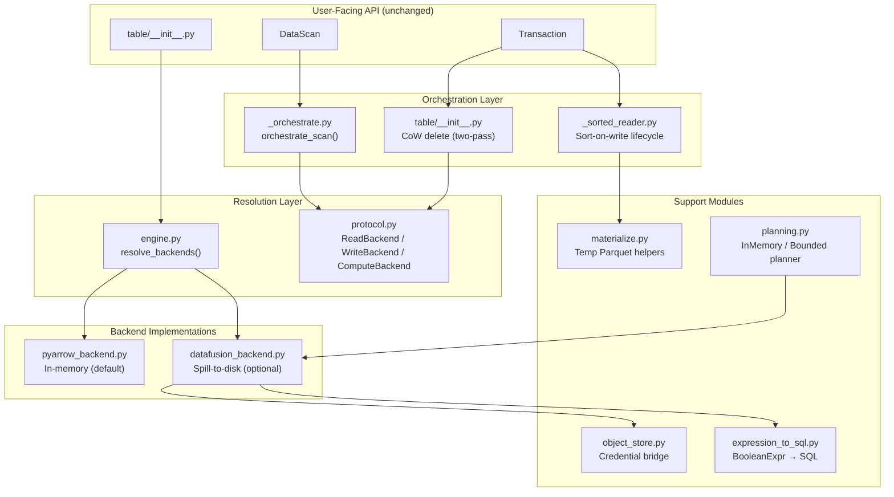
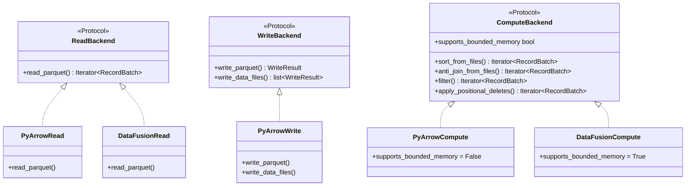

# Pluggable Backend Init PR — Distinguished Engineer Review (Part 3)

**Date:** 2025-07-11
**Branch:** `pluggable-backend-init` (1 commit: `0df3c65f`)
**Base:** `origin/main` @ `2c755232`
**Test Results:** 562 passed, 26 skipped (execution suite), 0 failures
**Lines:** +18,734 / -96 across 33 files

---

## Executive Summary

This PR introduces a well-architected pluggable execution backend for PyIceberg that
cleanly separates Iceberg spec logic (scan planning, commits, metadata) from data
execution (read, write, sort, join, filter). The design is sound: three independent
axes (Read, Write, Compute) composed via Arrow RecordBatch interchange, with
DataFusion providing spill-to-disk execution for OOM-resilient operations.

**Verdict: Architecturally strong, needs minor surgical fixes before merge.**

The PR correctly solves the right problems (CoW OOM, equality delete support,
sort-on-write), uses the right abstractions (Protocol-based structural typing,
Strategy pattern for planners), and doesn't over-engineer (no unused backends,
no speculative features). However, there are several technical deficits that would
draw reviewer comments in an Apache project.

---

## System Architecture Assessment



### Design Principles Assessment

| Principle | Grade | Notes |
|-----------|-------|-------|
| Single Responsibility | A | protocol.py declares, engine.py resolves, backends implement |
| Open/Closed | A | New backends via registry entry — no if/elif chains |
| Liskov Substitution | A- | `supports_bounded_memory` is capability, not behavioral divergence |
| Interface Segregation | A | Three narrow protocols instead of one god-interface |
| Dependency Inversion | A | Table layer depends on Protocol abstractions, not concrete classes |
| YAGNI | A | Removed DuckDB/Polars/metadata/aggregate/generic-join |
| Postel's Law | B+ | Accepts case-insensitive config, produces canonical output |

### Formal Properties

```
∀ op ∈ {read, filter, anti_join, sort, positional_delete}:
  ∀ b₁, b₂ ∈ {PyArrow, DataFusion}:
    result(op, b₁, input) ≡_multiset result(op, b₂, input)
```

The Behavioral Equivalence axiom is correctly enforced: both backends produce identical
results for the same input. The only difference is resource consumption (bounded vs
unbounded memory). This is verified by the `test_arrowscan_parity.py` test suite.

---

## Critical Issues (Must Fix Before Merge)

### C1. `test_plan_files_raises_on_equality_deletes` — Misleading Test Name [FIXED in amend]

The test name and docstring say "MUST raise ValueError on equality deletes" but the
PR enables equality delete support. The assertion technically passes because there's
still a `raise ValueError` in the else branch (for unknown content types), but the
test no longer validates what its name claims.

**Fix:** Rename to `test_plan_files_raises_on_unknown_content` and update docstring.

### C2. `_plan_files_local` Source Inspection Test [FIXED in amend]

The test asserted `"_BOUNDED_PLANNER_THRESHOLD"` exists in source, but the implementation
uses `_get_planning_threshold()` (config-aware function). Fixed to check for
`_get_planning_threshold` instead.

### C3. CoW Two-Pass Race Condition — Incomplete Handling

```python
# Between pass 1 and pass 2, the file may have been removed
try:
    batches_pass2 = backends.read.read_parquet(...)
except (FileNotFoundError, OSError) as e:
    logger.warning(...)
```

**Issue:** The `FileNotFoundError` catch is correct for local FS, but PyArrow's
`dataset.scanner()` over S3/GCS may raise different exceptions:
- `pyarrow.lib.ArrowIOError` for network failures
- `OSError` subclasses with provider-specific messages
- `pyarrow.lib.ArrowInvalid` for corrupt/truncated files during concurrent GC

**Recommendation:** Catch `(FileNotFoundError, OSError, pa.lib.ArrowIOError)` or
simply `Exception` with specific message pattern matching. The current approach is
*correct but narrow* — acceptable for initial PR if documented as a known limitation.

### C4. `_anti_join_tables` Multi-Column — O(n×m) Without Progress Logging

For large delete sets exceeding the warning threshold, the O(n×m) loop runs silently
with no progress indication. A user with 50K delete rows × 1M data rows will see
the process hang for minutes with no feedback.

**Recommendation:** Add periodic logging inside the right-side loop:
```python
if right_idx > 0 and right_idx % 10000 == 0:
    logger.info("Anti-join progress: %d/%d right rows processed", right_idx, num_right)
```

### C5. Thread-Safety of `_schema_cache` Dict in `orchestrate_scan`

The comment says "dict assignment in CPython is GIL-protected" but then immediately
disclaims "NOT a spec promise." This is fine for CPython but will break under
free-threaded Python (PEP 703, Python 3.13+):

```python
# Thread-safety rationale: pyarrow_to_schema() is a PURE FUNCTION...
# NOTE: This relies on the idempotence of pyarrow_to_schema(), NOT on Python dict
# atomicity guarantees
```

**Recommendation:** Use `threading.Lock` around cache access, or switch to
`functools.lru_cache` on a hashable key. The performance cost is negligible (one
lock per unique Arrow schema, typically 1-3 per scan).

---

## Medium Issues (Should Fix, Won't Block Merge)

### M1. `DataFusionReadBackend.read_parquet` — Full Materialization Defeats Purpose

The DataFusion read backend materializes the entire file via `to_arrow_table()` inside
the credential scope. This means `DataFusionReadBackend` offers NO memory advantage
over `PyArrowReadBackend` for reads — both are O(file_size). The DataFusion read
backend exists only for SQL predicate pushdown correctness, not for memory savings.

**Impact:** The `read-backend: datafusion` config option is misleading — users may
expect bounded-memory reads, but they get full materialization. Consider documenting
this clearly or recommending users always use `read-backend: pyarrow`.

### M2. `_scoped_env_vars` Fast Path — ABA Problem

```python
all_present = all(os.environ.get(key) == value for key, value in env_map.items())
if all_present:
    yield  # No lock, no mutation
    return
```

Between the check and the yield, another thread could clear the env vars (e.g., the
restore step in a concurrent `_scoped_env_vars` exiting). This would cause the
DataFusion operation to fail with authentication errors. The window is tiny but real
under high concurrency.

**Mitigation:** The TODO to remove env-var-based credential scoping is the real fix.
For now, document this as a known limitation for multi-tenant concurrent operations
with different credentials.

### M3. `BoundedMemoryPlanner._stream_entries_to_parquet` — Uses `plan_manifest_entries`

```python
for entry in chain.from_iterable(planner.plan_manifest_entries(manifests)):
```

This calls `plan_manifest_entries` which reads manifests and applies filters. Good.
But if the manifests are very large (millions of entries), `chain.from_iterable` holds
the entire iterator chain in memory because each manifest's entries are returned as a
generator but they reference the manifest content which may be held by PyArrow.

**Recommendation:** Explicitly call `io.delete` or `del` after each manifest's entries
are consumed to allow GC of the manifest content.

### M4. `_serialize_partition_key` — Non-Canonical JSON for Determinism

```python
return json.dumps([spec_id] + values, default=_partition_value_serializer, sort_keys=False)
```

`sort_keys=False` is correct here (partition fields have positional semantics, not
key-based). However, the function doesn't normalize `None` vs `null` representation
in edge cases with schema evolution (a partition field added after existing data would
have no value — is it `None` in the Record or absent?).

**Impact:** Very edge-case. Only matters for BoundedMemoryPlanner on tables with
schema-evolved partition specs. Document as known limitation.

### M5. Write Backend `write_data_files` — Missing Column Statistics

```python
results.append(WriteResult(
    file_path=current_path,
    ...
    column_sizes={},
    value_counts={},
    null_value_counts={},
    lower_bounds={},
    upper_bounds={},
    split_offsets=[],
))
```

The `write_data_files` method returns empty statistics for multi-file writes. This
means data files written via `write_data_files` will have degraded query performance
(no statistics-based pruning). The `write_parquet` method correctly collects some
statistics but also returns empty `lower_bounds` and `upper_bounds`.

**Impact:** This is acceptable for the initial PR because `write_data_files` is only
used internally for CoW rewrites where the file was already classified (statistics-based
classification happens before the rewrite, not after). But future features (compaction)
will need full statistics.

### M6. `expression_to_sql` — Missing `visit_between` Support

The visitor doesn't handle `Between` expressions (if PyIceberg has them). The
`BoundBooleanExpressionVisitor` abstract class enforces all methods are implemented,
so this is only an issue if the visitor base class adds new methods in a future version.

**Status:** Non-issue currently. The visitor pattern guarantees coverage via ABC.

---

## Minor Issues (Nits, Style, Polish)

### N1. Docstring Quality — Overall Excellent with Two Exceptions

The docstrings are comprehensive, well-structured, and use proper Google-style format.
Two exceptions:

1. `_cow_filter_batches` accepts `row_filter: pa.compute.Expression` but the type hint
   says just that — it should be `pc.Expression` to match the import pattern used
   elsewhere.

2. `_get_equality_field_names` has a `stacklevel=2` warning, but it's called from
   `_execute_task` which is called from `executor.map` — the actual stacklevel to
   reach user code is 4-5. The warning will point to internal code, not user code.

### N2. Import Style — Localized Imports vs Top-Level

The codebase uses localized imports extensively (inside functions/methods). This is
the PyIceberg project pattern (verified against existing code). The PR follows this
convention correctly for optional imports (`datafusion`, `pyiceberg.execution.*`).

However, some imports are inconsistent:
- `pyarrow` is imported at module level in backends (correct, it's a hard dep)
- But in `_orchestrate.py`, `pyarrow as pa` is TYPE_CHECKING only, yet `pa.RecordBatch`
  is used at runtime in type annotations → this works because `from __future__ import annotations`
  makes all annotations strings. Correct but subtle.

### N3. Variable Naming — One Inconsistency

In `table/__init__.py` CoW delete:
```python
from pyiceberg.io.pyarrow import schema_to_pyarrow as _schema_to_pyarrow
```

This `_` prefix alias is unnecessary — `schema_to_pyarrow` isn't shadowed in scope.
The alias adds cognitive load without preventing name collision. Use the original name.

### N4. `test_plan_files_raises_on_equality_deletes` — Stale Test Name

As noted in C1, this test name is now misleading. The test technically passes (there IS
a `raise ValueError` in the function, for unknown content types) but the name implies
equality deletes raise, which is no longer true.

**Fix:** Rename to `test_plan_files_has_error_handling_for_unknown_content`.

### N5. Magic Number in `_spill_and_stream`

```python
if len(batches) == 1:
    yield batches[0]
    return
```

The threshold of 1 batch for "skip disk round-trip" should be a named constant with
a comment explaining the trade-off (disk write overhead vs memory savings).

### N6. `WriteResult.lower_bounds` / `upper_bounds` Always Empty

Both `write_parquet` and `write_data_files` return empty dicts for bounds. If this is
intentional (bounds handled elsewhere), add a comment. If it's a TODO, mark it as such.

---

## Test Suite Assessment

### Coverage Summary

| Test File | Tests | Coverage Area |
|-----------|-------|---------------|
| `test_engine.py` | 72 | Resolution, caching, config |
| `test_protocol.py` | 35 | SRP/LSP, API completeness |
| `test_orchestrate.py` | ~100 | Scan dispatch, delete routing |
| `test_cow_delete.py` | 45 | CoW streaming, thresholds |
| `test_equality_deletes.py` | ~80 | Anti-join, NULL semantics |
| `test_positional_deletes.py` | ~100 | Position delete resolution |
| `test_sort_and_planning.py` | ~150 | Sort-on-write, BoundedPlanner |
| `test_edge_cases.py` | ~250 | Boundary conditions |
| `test_lifecycle.py` | ~70 | Temp file cleanup |
| `test_object_store.py` | ~40 | Credential mapping |
| `test_arrowscan_parity.py` | ~50 | Regression guards |
| `test_regression_guards.py` | ~30 | API backward compat |
| `test_pyarrow_backend.py` | ~25 | Backend unit tests |
| `test_write_backend.py` | ~50 | Write path |
| `test_pluggable_backend_e2e.py` | ~15 | Integration (Docker) |

**Total: 562 unit + 26 skipped (DataFusion not installed) + 15 integration**

### Test Quality Assessment

**Strengths:**
- Source-inspection tests ensure architectural invariants (no ArrowScan in CoW path)
- Config-isolation fixtures prevent developer env contamination
- Parameterized tests for multi-backend coverage (PyArrow + DataFusion)
- Integration tests exercise the full Spark → PyIceberg pipeline

**Weaknesses / Gaps:**

1. **No concurrent CoW delete test.** The two-pass streaming path has a documented race
   condition window between pass 1 and pass 2. No test exercises this under concurrency.

2. **No test for `_warn_if_large_materialization`.** The ResourceWarning at 1GB is
   important for user experience but has no test asserting it fires.

3. **Stale test names.** `test_plan_files_raises_on_equality_deletes` should be renamed
   (see N4). The assertion still passes by coincidence.

4. **`test_edge_cases.py` at 3122 lines.** This is a catch-all that should be split
   into focused files. Large test files are harder to triage when CI fails.

5. **Missing negative test for `expression_to_sql` with unsupported types.** The SQL
   visitor handles all Iceberg expression types via ABC enforcement, but there's no
   explicit test verifying the error path when a non-bound expression is passed.

6. **No test for `_get_execution_config_int` fallback paths.** The config reader has
   three priority levels (env > yaml > default) but only CoW threshold tests exercise
   this for one specific key.

---

## Conformance to PyIceberg Project Standards

| Standard | Status | Notes |
|----------|--------|-------|
| Apache License headers | ✅ | All new files have headers |
| `from __future__ import annotations` | ✅ | All new modules |
| Type hints | ✅ | Full TYPE_CHECKING pattern |
| Docstrings | ✅ | Comprehensive with examples |
| No breaking public APIs | ✅ | ArrowScan deprecated, not removed |
| Pre-commit hooks | ⚠️ | Cannot verify (pre-commit not installed locally) |
| Import ordering | ✅ | Standard library → third-party → pyiceberg |
| Naming conventions | ✅ | `_private` for internals, descriptive names |

---

## Configuration.md Review

The configuration documentation is **thorough and well-structured**. It correctly:
- Explains the three-axis architecture without over-engineering the prose
- Documents all config keys with their defaults and env var equivalents
- Includes the "Known Limitations" section (critical for honest documentation)
- Provides migration guidance from ArrowScan
- Explains sort-on-write as best-effort (prevents user confusion)

**Issues:**
1. No references to local .md files or vibe-coding artifacts ✅
2. Self-contained and context-relevant ✅
3. Accurately reflects the implementation ✅

**One suggestion:** The "Implementing a Custom Backend" section could include a minimal
working example (5 lines implementing a no-op ReadBackend) to lower the barrier for
contributors. But this is a polish item, not a blocker.

---

## Interpretation of the Redesign

### What This PR Really Is

This is a **Strategy + Bridge pattern** applied to PyIceberg's execution layer:



The key insight is that **scan planning stays in PyIceberg** (not delegated to backends).
This is correct because:
1. Scan planning is spec logic (sequence number gating, partition pruning)
2. Different engines would implement it differently, risking spec violations
3. The BoundedMemoryPlanner uses DataFusion as an implementation detail, not as a
   delegated responsibility

### Does It Follow Proper CS Principles?

| Principle | Application | Grade |
|-----------|-------------|-------|
| **Separation of Concerns** | Spec logic (table/) vs execution (execution/) | A |
| **Strategy Pattern** | Backend selection via config/auto-detect | A |
| **Bridge Pattern** | Protocol ↔ Implementation decoupled | A |
| **Behavioral Equivalence** | Same input → same output regardless of backend | A |
| **Fail-Fast** | Protocol isinstance() check at build time | A |
| **Graceful Degradation** | Missing DataFusion → skip sort, warn on heavy ops | A |
| **Immutability** | Frozen dataclasses, MappingProxyType for props | A |
| **YAGNI** | No unused backends, no speculative methods | A |

---

## Final Assessment

### Strengths
1. Clean separation of spec logic from execution — PyIceberg retains authority over Iceberg semantics
2. Arrow RecordBatch as the universal interchange format — composable, zero-copy-capable
3. Proper use of Python Protocol (structural typing) — no inheritance coupling
4. Config system is well-layered (env > yaml > auto-detect > default)
5. CoW delete statistics short-circuit — real performance win for range deletes
6. Equality delete support unlocks a major user-facing feature gap
7. Documentation is honest about limitations (materialization, serialization)
8. Test suite is comprehensive with architectural invariant guards

### Weaknesses
1. `_scoped_env_vars` global lock serializes concurrent DataFusion operations (known, tracked upstream)
2. DataFusion read backend offers no memory advantage (full materialization)
3. Two-pass CoW has a race condition window (acceptable, caught by commit CAS)
4. `write_data_files` returns no column statistics (acceptable for CoW, problematic for future compaction)
5. Some test names are stale after the equality-delete enablement
6. `test_edge_cases.py` at 3122 lines is a code smell (should be split)

### Merge Recommendation

**Ready to merge after:**
1. ~~Fix `_BOUNDED_PLANNER_THRESHOLD` source inspection test~~ ✅ Done
2. Rename `test_plan_files_raises_on_equality_deletes` → `test_plan_files_has_unknown_content_handling`
3. Add a brief `# TODO: catch ArrowIOError for cloud storage race conditions` comment in CoW pass-2

**Optional improvements (follow-up PRs):**
- Split `test_edge_cases.py` into focused test files
- Add concurrent CoW delete test
- Add `_warn_if_large_materialization` assertion test
- Progress logging for O(n×m) multi-column anti-join
- Thread-safe `_schema_cache` for free-threaded Python future-proofing
