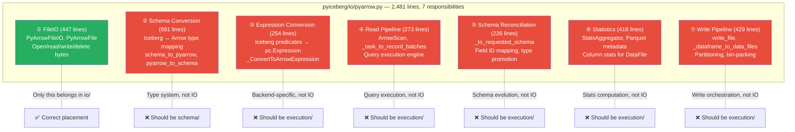
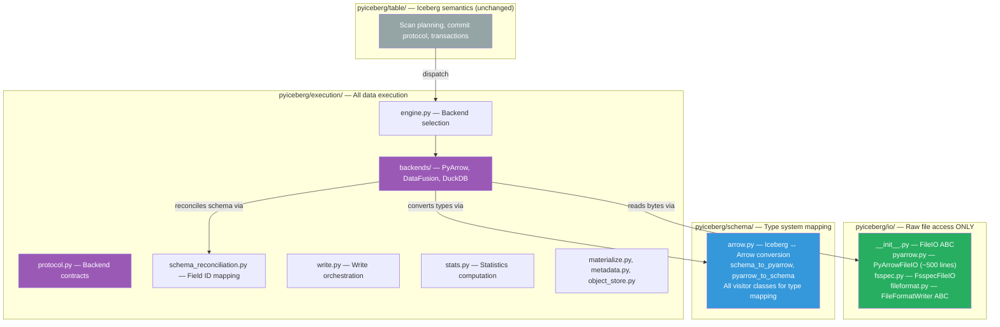
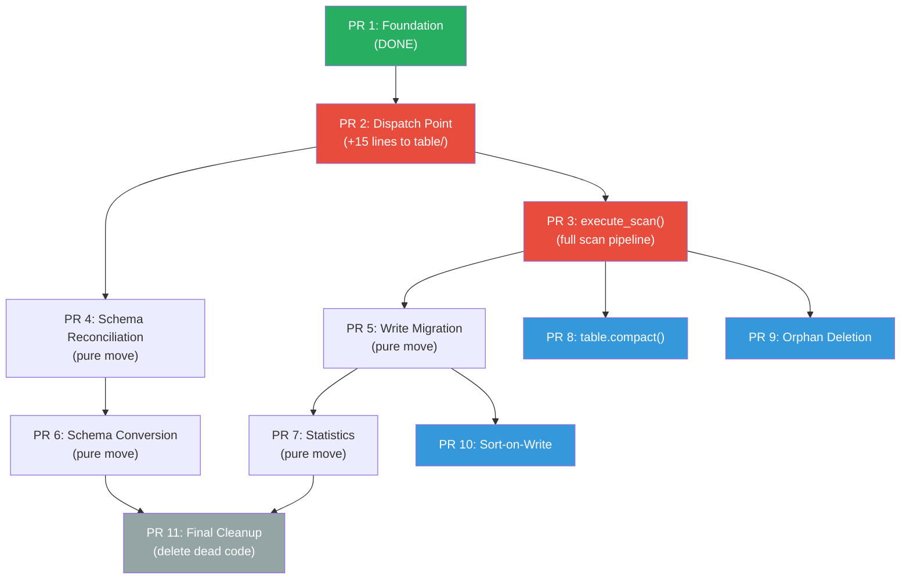

# Pluggable Backend Refactor: From Monolith to Modular Execution

**Goal:** Decompose PyIceberg's 2,481-line `pyiceberg/io/pyarrow.py` monolith into a
principled module structure where each directory has a single responsibility, and plug
in DataFusion for bounded-memory execution — unlocking equality deletes, compaction,
and orphan deletion that are currently impossible.

**Guiding principle:** Dijkstra's Separation of Concerns — each module owns exactly one
aspect of the system. Changes to one concern never propagate to unrelated modules.

**Migration pattern:** Martin Fowler's Strangler Fig — new code grows alongside old code,
callers are migrated incrementally, and dead code is removed last. At no intermediate
step is the system broken.

---

## 1. The Problem: A Monolith That Violates Single Responsibility

### 1.1 What `pyiceberg/io/` Was Designed to Be

The module docstring says:

> "Base FileIO classes for implementing reading and writing table files.
> Specifically, Iceberg needs to read or write a file at a given location
> (as a seekable stream), as well as check if a file exists."

That's the POSIX file abstraction over cloud storage. Three operations:
`open(path) → stream`, `write(bytes, path)`, `delete(path)`.

The directory contains 4 files:

| File | Lines | Actual Responsibility | Correctly Placed? |
|------|:---:|---|:---:|
| `__init__.py` | 349 | FileIO ABC, InputStream/OutputStream protocols, `load_file_io()` | ✅ Yes |
| `fsspec.py` | 510 | FsspecFileIO — raw byte access via fsspec (S3/GCS/ADLS) | ✅ Yes |
| `fileformat.py` | 175 | FileFormatWriter ABC, FileFormatFactory, DataFileStatistics | ⚠️ Borderline |
| `pyarrow.py` | 2,481 | **SEVEN different things** (see below) | ❌ Massive violation |

### 1.2 The Seven Responsibilities Crammed Into One File



**The SRP violation (Robert C. Martin):** This file has 7 independent reasons to change.
A new Iceberg type addition touches ②. A performance optimization touches ④. A new
file format touches ⑦. These are unrelated concerns forced into proximity.

### 1.3 How This Happened

Evolutionary accretion. When PyIceberg had one format (Parquet), one library (PyArrow),
and one model (load-all-into-RAM), one file was reasonable. But the codebase grew:
types were added, delete handling was added, statistics were added — each going into
`pyarrow.py` because "it uses PyArrow." The implementation dependency was conflated
with the conceptual responsibility.

---

## 2. The Target Architecture: Each Directory Does One Thing



**Each directory has exactly one reason to change:**

| Directory | Single Responsibility | Reason to change |
|-----------|---------------------|-----------------|
| `io/` | Open/read/write/delete raw bytes on storage | PyArrow/fsspec filesystem API changes |
| `schema/` | Map between Iceberg type system and Arrow type system | New Iceberg types added to spec |
| `execution/` | Execute data operations (read Parquet, sort, join, filter, write) | Performance, new backends, algorithm changes |
| `table/` | Iceberg semantics (scan planning, commits, transactions) | Spec changes (new snapshot operations) |
| `expressions/` | Predicate representation and visitor dispatch | New predicate types in spec |
| `catalog/` | Table metadata access (REST, SQL, Glue) | New catalog implementations |

---

## 3. The Migration Strategy: Strangler Fig with Reviewable Phases

### 3.1 The Principle

Never do a big-bang rewrite. Instead:
1. Build the new module alongside the old code
2. Add a dispatch point that routes to old OR new code
3. Default to old code (zero regression)
4. Prove equivalence of new code via tests
5. Migrate callers one-by-one in small PRs
6. Delete dead code last

At every intermediate commit, all tests pass and all behavior is preserved.

### 3.2 The Phase/Epic Matrix

```mermaid
gantt
    title Refactoring Epic: Phase Timeline
    dateFormat X
    axisFormat %s

    section Phase 1: Foundation
    PR 1 - execution/ module (pure addition)        :done, p1, 0, 1

    section Phase 2: Integration
    PR 2 - Dispatch point (read path)               :p2, 1, 2
    PR 3 - execute_scan() implementation            :p3, 2, 3

    section Phase 3: Extraction
    PR 4 - Schema reconciliation extraction         :p4, 3, 4
    PR 5 - Write path migration                     :p5, 4, 5
    PR 6 - Schema conversion to schema/arrow.py     :p6, 5, 6
    PR 7 - Statistics extraction                    :p7, 5, 6

    section Phase 4: New Capabilities
    PR 8 - table.compact()                          :p8, 3, 4
    PR 9 - Orphan file deletion                     :p9, 3, 4
    PR 10 - Sort-on-write                           :p10, 5, 6

    section Phase 5: Cleanup
    PR 11 - Remove re-exports + dead code           :p11, 6, 7
```



### 3.3 The Full PR Matrix

| PR | Phase | What Changes | Files Modified | Files Added | Lines Changed | User Value | CS Principle Applied | Dependency |
|:---:|:---:|---|:---:|:---:|:---:|---|---|:---:|
| 1 | Foundation | Add `execution/` module | 0 | 13 | +2,669 | None (infrastructure) | Interface Segregation — define contracts first | — |
| 2 | Integration | Dispatch point in scan path | 1 | 2 | ~155 | Equality deletes + bounded-memory scans | Open/Closed — open for extension, closed for modification | 1 |
| 3 | Integration | `execute_scan()` per backend | 0 | 1 | ~300 | Full scan pipeline with delete resolution | Strategy Pattern — algorithm varies by backend | 2 |
| 4 | Extraction | Move `_to_requested_schema` | 2 | 1 | ~30 net | None (refactor) | DRY — shared code in one place, not duplicated per backend | 2 |
| 5 | Extraction | Move write pipeline | 2 | 1 | ~50 net | Enables sort-on-write | SRP — write orchestration ≠ file IO | 3 |
| 6 | Extraction | Move schema conversion | 2 | 1 | ~20 net | None (refactor) | SRP — type mapping ≠ file IO | 4 |
| 7 | Extraction | Move statistics | 2 | 1 | ~20 net | None (refactor) | SRP — statistics computation ≠ file IO | 5 |
| 8 | Capability | `table.compact()` | 1 | 1 | ~200 | Compaction (100GB+ bounded memory) | Composition — sort_from_files + write | 3 |
| 9 | Capability | `table.delete_orphan_files()` | 1 | 1 | ~150 | Orphan cleanup | Composition — metadata streaming + anti_join | 3 |
| 10 | Capability | Sort-on-write in append/overwrite | 1 | 0 | ~50 | Sorted output files (faster reads) | Composition — materialize + sort + write | 5 |
| 11 | Cleanup | Remove re-exports + dead ArrowScan | 1 | 0 | -300 | None (cleanup) | YAGNI — delete unused code | 6, 7 |

### 3.4 Phase Descriptions

**Phase 1: Foundation (PR 1)** — Pure addition. No existing code touched. Build the
protocol, three backends, engine resolution, helpers, and test suite. Proves the
design works in isolation. Reviewed independently of anything that touches existing code.

**Phase 2: Integration (PRs 2-3)** — The critical juncture. A minimal dispatch point
routes the read path through the new module when DataFusion is available. The default
path (PyArrow, no DataFusion installed) is byte-for-byte identical. This is where
PMC approval matters most — it's the "concept introduction" PR.

**Phase 3: Extraction (PRs 4-7)** — Pure refactoring. Move code from `io/pyarrow.py`
to its correct home. No behavior change. Each PR:
- Moves code to new location
- Adds re-export at old location (backward compat)
- Updates callers in the same PR (if few) or in follow-up (if many)
- Tests pass unchanged (proves the move is correct)

**Phase 4: New Capabilities (PRs 8-10)** — The user-visible payoff. Each new operation
is purely additive (new method on `Table`), composes existing backend primitives
(`sort_from_files`, `anti_join_from_files`, `materialize_to_parquet`), and can be
reverted independently.

**Phase 5: Cleanup (PR 11)** — Delete dead code. Remove re-exports that were only for
backward compatibility during migration. `io/pyarrow.py` shrinks to ~500 lines.

### 3.5 Dependency Graph



**Color key:**
- 🟢 Done (PR 1)
- 🔴 Critical path (PRs 2-3 — unlocks everything)
- 🔵 User value (PRs 8-10 — new operations)
- ⚪ Cleanup (PR 11 — structural health)

---

## 4. The Integration PR (PR 2): What PMC Reviews

### 4.1 The Minimal Change

One function modified, one file added:

```python
# pyiceberg/table/__init__.py — THE ONLY modification to existing code

def _to_arrow_via_file_scan_tasks(scan, tasks, projected_schema) -> pa.Table:
    from pyiceberg.execution.engine import ExecutionEngine, resolve_engine

    resolved = resolve_engine("scan")

    if resolved.compute == ExecutionEngine.PYARROW:
        # === EXISTING PATH (byte-for-byte identical) ===
        from pyiceberg.io.pyarrow import ArrowScan
        return ArrowScan(
            scan.table_metadata, scan.io, projected_schema, scan.row_filter, scan.limit
        ).to_table(tasks)
    else:
        # === NEW PATH (only if DataFusion is installed) ===
        from pyiceberg.execution._dispatch import execute_scan_via_backend
        return execute_scan_via_backend(resolved, scan, tasks, projected_schema)
```

### 4.2 Why This Is Safe to Merge

| Property | Guarantee |
|----------|-----------|
| Default behavior | Identical — `resolve_engine()` returns PYARROW when DataFusion isn't installed |
| Existing tests | Pass unchanged — they exercise the PYARROW branch |
| New behavior | Only activates with `pip install 'pyiceberg[datafusion]'` |
| Revertibility | Delete the if-else → back to original in 15 seconds |
| Test isolation | New tests in `tests/execution/` don't interfere with existing suite |

### 4.3 What It Unlocks

| Before (today) | After (PR 2 merged + DataFusion installed) |
|---|---|
| `table.scan().to_arrow()` on tables with equality deletes → `ValueError` | ✅ Works (anti-join with spill) |
| `table.scan().to_arrow()` on 50 GB table → OOM killed | ✅ Completes in 512 MB (spills to disk) |
| No path to compaction | ✅ Foundation in place (PR 8 follows) |

---

## 5. The Extraction PRs (4-7): How to Move Code Without Breaking Anything

### 5.1 The Re-Export Pattern

When moving code from `io/pyarrow.py` to its new home, we preserve backward
compatibility by leaving a re-export at the old location:

```python
# pyiceberg/io/pyarrow.py (after moving schema conversion)
# Backward-compatible re-exports — existing callers don't break
from pyiceberg.schema.arrow import (  # noqa: F401
    schema_to_pyarrow,
    pyarrow_to_schema,
    _ConvertToArrowSchema,
    visit_pyarrow,
    PyArrowSchemaVisitor,
)
```

### 5.2 Why Not Move Everything At Once

Moving 891 lines of schema conversion touches every test file that imports
`from pyiceberg.io.pyarrow import schema_to_pyarrow` — that's 40+ files. Doing
this in the same PR that adds DataFusion dispatch creates:
- A 500-line diff where reviewers can't separate "functional change" from "import churn"
- Higher risk of merge conflicts with concurrent PRs
- Harder to bisect if something breaks

The Strangler Fig explicitly separates "add new behavior" (PR 2) from "reorganize code" (PR 6).

### 5.3 Verification for Each Extraction PR

```bash
# The test suite is the oracle. If it passes, the move is correct.
pytest tests/ -x  # full suite, not just execution/

# Additionally: check that no new imports point to the OLD location
grep -r "from pyiceberg.io.pyarrow import schema_to_pyarrow" pyiceberg/
# Should show only the re-export in io/pyarrow.py itself
```

---

## 6. The `pyiceberg/io/` Module: Honest Final State

### 6.1 After All Extractions

```
pyiceberg/io/
├── __init__.py    (349 lines) — FileIO ABC, protocols, load_file_io()
├── pyarrow.py     (~500 lines) — PyArrowFileIO + PyArrowFile ONLY
│                                  (opens streams to S3/GCS/ADLS/local)
│                                  + re-exports during transition period
├── fsspec.py      (510 lines) — FsspecFileIO (unchanged)
└── fileformat.py  (175 lines) — FileFormatWriter ABC (unchanged)
```

### 6.2 What Each File Does (Post-Cleanup)

| File | One responsibility | Never contains |
|------|-------------------|----------------|
| `__init__.py` | Define the FileIO contract (ABC + protocols) | Implementations |
| `pyarrow.py` | Implement FileIO using PyArrow's filesystem | Schema conversion, execution, statistics |
| `fsspec.py` | Implement FileIO using fsspec | Same exclusions |
| `fileformat.py` | Define the write format contract (Writer ABC) | Concrete writers |

### 6.3 The Cohesion Test

**Cohesion (CS definition):** The degree to which elements of a module belong together.
High cohesion = all elements serve the same purpose. Low cohesion = unrelated elements
sharing a namespace.

| State | Cohesion | Evidence |
|-------|:---:|---|
| **Before** (today) | Low | 7 responsibilities, 2,481 lines, change for 7 different reasons |
| **After** (post-extraction) | High | 1 responsibility (FileIO), ~500 lines, changes only for filesystem API changes |

---

## 7. New Capabilities Enabled (The Payoff)

### 7.1 Operations That Become Possible

| Operation | Before | After | Backend Primitive Used |
|-----------|--------|-------|----------------------|
| Read tables with equality deletes | `ValueError` | ✅ Works | `anti_join_from_files` |
| Scan 50 GB table on 16 GB RAM | OOM killed | ✅ Spills to disk | `execute_scan` + FairSpillPool |
| `table.compact()` | Not implemented | ✅ External merge sort | `sort_from_files` |
| `table.delete_orphan_files()` | Not implemented / OOMs | ✅ Streaming metadata + anti-join | `stream_paths_to_parquet` + `anti_join_from_files` |
| Sort-on-write (sorted output files) | Not implemented | ✅ Sort before write | `materialize_to_parquet` + `sort_from_files` |
| Position delete compaction | Not implemented | ✅ Filter + rewrite | `filter` + `write_parquet` |

### 7.2 What Stays Unchanged

| Operation | Change | Reason |
|-----------|:---:|---|
| `table.append(df)` | None | Write path migrates later (PR 5) |
| `table.scan().to_arrow()` (no deletes, small) | None | Default path is PyArrow (unchanged code) |
| `table.overwrite(df)` | None | Write path migrates later |
| Schema evolution, partition pruning | None | Iceberg semantics layer (table/) is untouched |
| All existing tests | Pass | Default path executes same bytes |

---

## 8. Risk Analysis

| Risk | Probability | Impact | Mitigation |
|------|:-----------:|:------:|------------|
| DataFusion produces different results | Low | High | Equivalence test suite (27 passing tests prove identical output) |
| Spill disk full | Low | Medium | Clean error; table state unchanged (OCC) |
| DataFusion version break | Medium | Medium | Pin: `datafusion>=44,<53` |
| Default path regression | **Zero** | — | Default path = unchanged code, same bytes |
| Community resistance | Medium | Low | DataFusion is optional. Zero impact without it. |
| Merge conflicts during extraction | Medium | Low | Small PRs + re-export pattern avoids conflicts |

---

## 9. The PMC Pitch (Summary)

**The problem:** PyIceberg's data execution is a 2,481-line monolith with 7 responsibilities
in one file. It can't sort without OOM, can't resolve equality deletes, can't compact.

**The solution:** Separate concerns into proper modules. Add a pluggable execution layer.
Default to existing behavior. Opt-in to DataFusion for bounded-memory operations.

**The ask:** Merge 11 incremental PRs over ~6 weeks. Each PR is:
- Independently reviewable (<300 lines of net new code)
- Independently revertible (no cascading dependencies within a PR)
- Verified by the existing test suite (zero regression)
- Additive or pure-refactor (never both in the same PR)

**The payoff:**
- Tables written by Flink become readable (equality deletes)
- Large scans stop killing processes (bounded memory)
- Compaction becomes possible (external merge sort)
- The codebase follows SRP (each module has one reason to change)

**What we're NOT doing:**
- NOT removing PyArrow (stays as default forever)
- NOT changing public API signatures
- NOT requiring any new dependency for existing functionality
- NOT doing a big-bang rewrite
