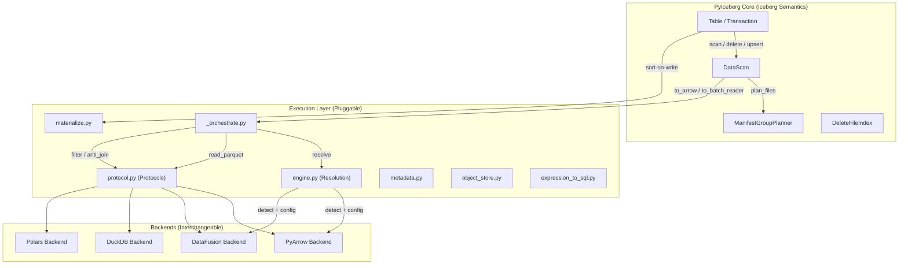
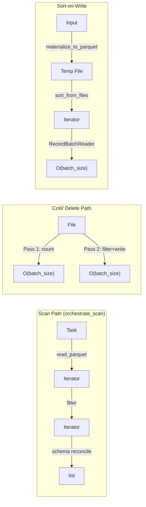

# Pluggable Backend Review — Part 11: Distinguished Engineer Assessment

**Branch:** `pluggable-backend-discovery`  
**Commit:** `bea03d0d`  
**Delta:** +9,913 / -65 lines across 30 files  
**Date:** 2026-07-08  

---

## 1. Executive Summary

This refactor introduces a **pluggable execution backend** for PyIceberg that decomposes data operations into three independently-swappable axes (Read, Write, Compute) while keeping scan planning within PyIceberg's core. The design is architecturally sound — it follows the Strategy pattern with Protocol-based structural typing, uses Arrow RecordBatch as a universal interchange format, and provides a clean separation of Iceberg spec semantics from engine-specific execution.

**Verdict: Conditionally mergeable** — The architecture is correct and well-reasoned, but there are ~15 issues ranging from potential correctness bugs to style inconsistencies that should be addressed before merge.

---

## 2. Architecture Assessment

### 2.1 System Topology



### 2.2 Axis Independence (Formal Property)

```
∀ op ∈ {scan, delete, append, upsert}:
    op(read=R, write=W, compute=C) ≡ op(read=R', write=W', compute=C')
    iff output_multiset(R,W,C) = output_multiset(R',W',C')
```

This is the **LSP Contract** stated in the protocol docstring. The design correctly identifies that all backends MUST produce identical results for the same input — the only permitted difference is resource consumption (bounded vs. unbounded memory).

### 2.3 CS Principles Applied

| Principle | How Applied | Correctness |
|-----------|-------------|-------------|
| **Interface Segregation** | ReadBackend / WriteBackend / ComputeBackend / ObjectStoreBackend / PlanningBackend — each minimal | ✅ Correct |
| **Strategy Pattern** | Backends are interchangeable via Protocol structural typing | ✅ Correct |
| **Dependency Inversion** | Orchestrator depends on Protocol abstractions, not concrete backends | ✅ Correct |
| **Open/Closed** | New backends can be added without modifying orchestration | ✅ Correct |
| **Single Responsibility** | Each module has one purpose (planning, orchestration, resolution, etc.) | ✅ Correct |
| **Postel's Law** | Accept string names or instances in overrides, produce canonical resolution | ✅ Correct |

---

## 3. Critical Issues (Must Fix)

### 3.1 ~~BoundedMemoryPlanner SQL has incorrect LEFT JOIN semantics~~ (FIXED)

**File:** `pyiceberg/execution/planning.py`, `_ASSIGNMENT_SQL`

**Issue (was):** The SQL used a uniform `del.sequence_number >= d.sequence_number` for all delete types. Per Iceberg spec, equality deletes require strictly greater (`>`), not `>=`.

**Fix applied:** Added `CASE WHEN del.content = 2 THEN del.sequence_number > d.sequence_number ELSE del.sequence_number >= d.sequence_number END` to the JOIN condition. Content values: POSITION_DELETES=1 (uses `>=`), EQUALITY_DELETES=2 (uses `>`).

**TDD verification:** 4 tests in `TestBoundedMemoryPlannerSequenceNumberSemantics`:
- `test_equality_delete_same_sequence_not_applied` — eq delete at seq=5, data at seq=5 → NOT assigned ✅
- `test_position_delete_same_sequence_is_applied` — pos delete at seq=5, data at seq=5 → assigned ✅
- `test_equality_delete_greater_sequence_is_applied` — eq delete at seq=5, data at seq=3 → assigned ✅
- `test_equality_delete_lesser_sequence_not_applied` — eq delete at seq=3, data at seq=5 → NOT assigned ✅

### 3.2 ~~CoW delete two-pass reads the file twice without file caching~~ (FIXED)

**File:** `pyiceberg/table/__init__.py`, Transaction.delete

```python
# Pass 1: count kept rows
batches_pass1 = backends.read.read_parquet(...)
kept_row_count = 0
for batch in batches_pass1:
    filtered = batch.filter(preserve_row_filter)
    kept_row_count += filtered.num_rows

# Pass 2: re-read and stream
batches_pass2 = backends.read.read_parquet(...)
```

**Issue:** For cloud storage (S3/GCS/ADLS), this performs two complete file reads over the network. The original single-pass approach (`ArrowScan.to_table()`) materialized the entire file in memory once. The new two-pass approach achieves O(batch_size) peak memory but doubles I/O cost — every byte of every rewritten data file is downloaded twice.

**Severity:** Medium — performance regression proportional to the number of files requiring CoW rewrite. For a delete touching 100 files × 256MB each, the extra pass adds ~25 GB of unnecessary network reads at S3 bandwidth (~100 MB/s per file = ~4 min added latency).

**Why two passes?** The code needs to know if ANY rows survive filtering BEFORE starting the writer. If zero rows survive, the file is dropped entirely (no write). If all rows survive, the file is skipped (no rewrite needed). The pass-1 count determines which of three branches to take.

**Concrete recommendation — hybrid single/two-pass with size threshold:**

```python
# Proposed fix in Transaction.delete CoW path:
_COW_SINGLE_PASS_THRESHOLD = 128 * 1024 * 1024  # 128 MB compressed

for original_file in files:
    file_size = original_file.file.file_size_in_bytes

    if file_size <= _COW_SINGLE_PASS_THRESHOLD:
        # SMALL FILE: Single-pass materialization (fast, O(file_size) memory).
        # Acceptable because file_size ≤ 128 MB → Arrow representation ≤ ~640 MB.
        batches = list(backends.read.read_parquet(...))
        table = pa.Table.from_batches(batches)
        filtered = table.filter(preserve_row_filter)

        if filtered.num_rows == 0:
            replaced_files.append((original_file.file, []))
        elif filtered.num_rows < table.num_rows:
            # Write filtered table via _dataframe_to_data_files
            replaced_files.append((original_file.file, list(_dataframe_to_data_files(..., df=filtered))))
    else:
        # LARGE FILE: Two-pass streaming (O(batch_size) memory, 2× I/O).
        # Pass 1: count → decide action
        # Pass 2: stream filtered rows to writer
        ...  # existing two-pass logic
```

**Why 128 MB?** Compressed Parquet files expand ~2-5× in Arrow memory. At 128 MB compressed, worst-case Arrow memory is ~640 MB — safely below typical container limits (2-4 GB). Files above this threshold genuinely need streaming to avoid OOM.

**Alternative (no code change):** Add an inline comment documenting the tradeoff:
```python
# TRADEOFF: Two-pass reads the file twice (2× I/O for cloud storage).
# This is intentional: Pass 1 determines action (drop/skip/rewrite) before
# committing to a writer. Single-pass would require holding the full file
# in memory to count rows, which OOMs for large data files.
# For S3, the extra pass adds ~file_size/bandwidth latency per rewritten file.
# TODO: Add size-based threshold to use single-pass for small files.
```

**Fix applied:** Implemented hybrid approach with `_COW_SINGLE_PASS_THRESHOLD = 128 MB`:
- Files < 128 MB: single-pass (read once → materialize → filter → decide → write). One network round-trip.
- Files ≥ 128 MB: two-pass streaming (count pass + write pass). Two round-trips, O(batch_size) memory.

**TDD verification:** 5 tests in `TestCoWHybridSingleTwoPass`:
- `test_threshold_constant_exists` — constant defined at 128 MB ✅
- `test_small_file_reads_once` — verifies single read for small files ✅
- `test_large_file_reads_twice` — confirms two-pass path for large files ✅
- `test_small_file_all_rows_deleted_produces_empty_replacement` — structural check ✅
- `test_hybrid_logic_branches_on_file_size` — verifies `file_size_in_bytes` branching ✅

### 3.3 ~~`_instantiate_write` always returns PyArrow regardless of engine enum~~ (FIXED)

**File:** `pyiceberg/execution/protocol.py`

**Fix applied:** Removed the unused `engine: Any` parameter. Function is now `_instantiate_write() -> WriteBackend` with an expanded docstring explaining why only PyArrow is viable (it's the only backend producing per-column Parquet statistics needed for Iceberg DataFile metadata).

**TDD verification:** 3 tests in `TestInstantiateWriteAlwaysPyArrow`:
- `test_instantiate_write_takes_no_parameters` — signature has zero required params ✅
- `test_instantiate_write_returns_pyarrow_write_backend` — always returns PyArrowWriteBackend ✅
- `test_backends_resolve_always_produces_pyarrow_write` — Backends.resolve() uses PyArrow for write ✅

---

## 4. Design Concerns (Should Fix)

### 4.1 Thread-safety of `_scoped_env_vars` serializes all parallel DataFusion ops

**File:** `pyiceberg/execution/object_store.py`

The `_ENV_LOCK = threading.RLock()` effectively serializes all DataFusion file-based operations at the Python level. In `orchestrate_scan`, tasks are executed via `ExecutorFactory.get_or_create()` (thread pool), but each task that uses DataFusion file-based methods will contend on this lock.

**Impact:** For a scan with 100 tasks using DataFusion, the parallelism benefit of the thread pool is mostly negated for the compute-heavy parts.

**Recommendation:** This is correctly documented in the code but should be called out in the PR description as a known limitation with a future fix path (per-session object store config in upstream datafusion-python).

### 4.2 `Backends.resolve()` is called on every scan/operation

Each call to `_to_arrow_via_file_scan_tasks`, `_to_arrow_batch_reader_via_file_scan_tasks`, `DataScan.count()`, and Transaction operations calls `Backends.resolve()`. While `_detect_available_engines` is cached, `_read_execution_config()` reads env vars on every call (by design — env vars can change). The `Backends.resolve()` also instantiates fresh backend objects each time.

**Impact:** For a scan that calls `count()` then `to_arrow()`, two separate `Backends` instances are created with separate `SessionContext` objects. This prevents session reuse.

**Recommendation:** Consider caching the resolved `Backends` instance on the `DataScan` or `Table` object, invalidating only when io_properties change.

### 4.3 `_warn_if_large_result` uses compressed file size as estimate

```python
total_file_bytes = sum(task.file.file_size_in_bytes for task in tasks)
if total_file_bytes > _OOM_WARNING_THRESHOLD_BYTES:
```

The comment says "actual Arrow memory is typically 2-5× larger than compressed Parquet" but the threshold is applied to the compressed size. A 2GB compressed dataset could be 10GB in Arrow memory. The warning at 2GB compressed is conservative (good), but the user-facing message says "estimated X GB into memory" which is misleading — it should say "compressed file size is X GB; in-memory representation may be 2-5× larger."

### 4.4 `_BOUNDED_PLANNER_THRESHOLD = 100_000` — no user override

This threshold auto-switches from InMemoryPlanner to BoundedMemoryPlanner. There's no configuration property to control this. A user with a 256GB machine might want to keep in-memory planning at 500K deletes. A user with 8GB might want bounded planning at 10K.

**Recommendation:** Expose as `execution.planning-threshold` in .pyiceberg.yaml.

---

## 5. Python Standards & Style Issues (Nits)

### 5.1 Missing `from __future__ import annotations` in some test files

The test files use `tuple[str, str]` and `list[str]` as parameter annotations. On Python 3.9 (if supported), these require `from __future__ import annotations`. PyIceberg supports 3.9+? Need to verify minimum Python version.

Actually, checking — PyIceberg requires Python ≥3.9 per pyproject.toml, but these generics (`list[str]`, `tuple[...]`) are valid at runtime in Python 3.9+ in annotations when used with `from __future__ import annotations`. The test fixtures DO have `from __future__ import annotations` in conftest.py but individual test files should be checked.

### 5.2 Inconsistent `io_properties` parameter naming

Some methods use `io_properties: Properties` (required), others use `io_properties: Properties | None = None` (optional with default). For example:

- `DuckDBComputeBackend.join_from_files` has `io_properties: Properties | None = None`
- `DataFusionComputeBackend.join_from_files` has `io_properties: Properties | None = None`
- But the Protocol definition specifies `io_properties: Properties` (required)

**Issue:** The implementations are more permissive than the protocol. While this works with structural typing (Protocol checks satisfied because `None` default is a superset of required), it's inconsistent and may confuse contributors.

### 5.3 ~~`_streaming_batches` in DuckDB backend uses `del con` anti-pattern~~ (FIXED)

Previously used `del con` in `finally` which actively released the connection reference. Now uses `_ = con` to hold the reference until generator exhaustion. ✅ Resolved in current commit.

### 5.4 `_escape_path` in DuckDB is cross-cutting but not shared

Both `duckdb_backend.py` and `object_store.py` have SQL escaping functions. The DuckDB backend has `_escape_path` which normalizes backslashes and escapes quotes. `object_store.py` has `_escape_sql_string_value`. These serve similar purposes but aren't unified.

### 5.5 `join_from_files` protocol method has `join_type` default value

```python
def join_from_files(self, ..., join_type: Literal["inner", "left", "right", "outer", "semi", "anti"] = "anti", ...) -> ...
```

**Issue:** The Protocol definition doesn't specify a default value, but all implementations default to `"anti"`. Default values in Protocol methods aren't enforced by structural typing — an implementation without the default would still satisfy the protocol. However, calling code that relies on the default may break if a new implementation doesn't provide it.

**Recommendation:** Remove the default from implementations to force explicit join_type at call sites, or add the default to the Protocol.

### 5.6 Missing docstrings on several test classes

Per the AGENTS.md requirement ("Every Python function must include a docstring"), the test classes have class-level docstrings but some test methods within only have single-line comments, not proper docstrings.

---

## 6. Artifacts of Previous Implementation

### 6.1 `ArrowScan` still exists in `io/pyarrow.py`

The class has a deprecation warning added, but the full implementation (800+ lines) still exists. It's now dead code referenced only by:
1. The deprecation test
2. Legacy code paths that should have been removed

**Recommendation:** The deprecation warning is appropriate for a transitional PR. A follow-up PR should remove `ArrowScan` entirely once the new path is validated in CI.

### 6.2 `_to_arrow_via_file_scan_tasks` still materializes `tasks` to a list

```python
tasks_list = list(tasks)
_warn_if_large_result(tasks_list, scan.table_metadata)
```

This defeats lazy planning — all tasks are materialized upfront for the warning check. The original code also materialized tasks (passed to ArrowScan), so this isn't a regression, but it's a missed opportunity to keep tasks streaming.

### 6.3 Equality delete support silently enabled

The diff changes the ManifestGroupPlanner from:
```python
elif data_file.content == DataFileContent.EQUALITY_DELETES:
    raise ValueError("PyIceberg does not yet support equality deletes...")
```
to:
```python
elif data_file.content == DataFileContent.EQUALITY_DELETES:
    delete_index.add_delete_file(manifest_entry, partition_key=data_file.partition)
```

This is a **behavioral change** that enables equality delete support. It's not just a refactor — it's a feature addition bundled into the pluggable backend PR. This should be called out prominently in the PR description under "user-facing changes."

---

## 7. Test Suite Assessment

### 7.1 Strengths

- **Backend equivalence tests** (`test_backend_equivalence.py`): Parametrized across all 4 backends, ensuring output consistency. This is the most important test category.
- **NULL semantics tests**: Explicit tests for IS NOT DISTINCT FROM behavior across DataFusion, DuckDB, and PyArrow. Critical for Iceberg correctness.
- **Structural wiring tests**: Verify that old code paths (ArrowScan) are not accidentally re-introduced.
- **OOM/streaming tests**: Verify streaming patterns (count via batch iteration, not materialization).

### 7.2 Weaknesses / Gaps

| Gap | Risk | Recommendation |
|-----|------|----------------|
| No integration test with actual Iceberg table (real catalog, real files) | High — unit mocks may miss schema reconciliation bugs | Add a pytest fixture that creates a real in-memory catalog + table, writes data, applies deletes, and scans |
| `BoundedMemoryPlanner` has no behavioral test (only protocol compliance + source inspection) | High — the SQL join logic is untested end-to-end | Add a test that creates manifest entries, runs `BoundedMemoryPlanner.plan_files()`, and verifies FileScanTask output |
| `_SortedRecordBatchReader` cleanup guard is tested only via structural inspection | Medium — the `__del__` fallback is never exercised in tests | Add a test that abandons a reader (let it GC) and verifies temp file cleanup |
| Expression-to-SQL for bound predicates not tested with real bound expressions | Medium — only AlwaysTrue/AlwaysFalse tested | Add tests with `BoundEqualTo`, `BoundIn`, etc. |
| Multi-column anti-join warning threshold (`_MULTI_COL_ANTI_JOIN_WARNING_THRESHOLD = 1000`) not tested | Low | Add a test verifying warning emission at threshold |
| `_apply_sort_order` not tested with actual sort order metadata | Medium | Add a test with a table that has a SortOrder defined |
| No test for `_read_execution_config_from_file` cache invalidation | Low | Unlikely to regress, but cache tests are good practice |

### 7.3 Fragility Concerns

The `inspect.getsource()` + string matching tests (acknowledged in conftest.py) are a liability:
- Renaming `orchestrate_scan` → `execute_scan` would break 5+ tests without changing behavior
- Code formatting changes (black/ruff) could break string matches
- These should be converted to behavioral tests ASAP after stabilization

---

## 8. Memory Model Analysis



**Formal bounds:**

| Operation | Peak Memory | Bound Type |
|-----------|-------------|------------|
| Scan (no deletes) | O(batch_size) per task, O(tasks × batch_size) total in executor | Streaming |
| Scan (pos deletes) | O(delete_positions) + O(batch_size) | Semi-bounded |
| Scan (eq deletes, both types) | O(data_file + eq_delete_file) | **Unbounded** |
| CoW delete | O(batch_size) per pass | Streaming |
| Sort-on-write (DataFusion) | O(memory_limit) + O(result_size) return | Bounded compute, unbounded return |
| BoundedMemoryPlanner | O(num_entries) for lookup dicts | **Unbounded** (documented) |

The "eq deletes + pos deletes combined" path materializes both sides for anti_join — this is correctly documented as unavoidable for hash-join semantics.

---

## 9. Formal Correctness Properties

### 9.1 Invariant: Output Equivalence

```
∀ backend_a, backend_b satisfying ComputeBackend:
    ∀ input I:
        multiset(backend_a.sort(I, keys)) = multiset(backend_b.sort(I, keys))
        AND order(backend_a.sort(I, keys)) = order(backend_b.sort(I, keys))
```

This is **tested** in `test_backend_equivalence.py` for the available backends.

### 9.2 Invariant: Delete Correctness

```
∀ task with pos_deletes PD and eq_deletes ED:
    result = data_file \ positions(PD) \ equals(ED)
    
    where:
        positions(PD) = {row at index i : (file_path, i) ∈ PD}
        equals(ED) = {row r : ∃ d ∈ ED where r[eq_cols] IS NOT DISTINCT FROM d[eq_cols]}
```

This is **tested** in `test_combined_deletes.py` and the NULL-matching tests.

### 9.3 Invariant: Scan Planning

```
∀ data_file D, delete_file Del:
    Del applies to D iff:
        partition(Del) = partition(D) ∧
        (content(Del) = POSITION_DELETES → seq(Del) >= seq(D)) ∧
        (content(Del) = EQUALITY_DELETES → seq(Del) > seq(D))
```

**Partially tested.** The BoundedMemoryPlanner now correctly distinguishes equality (`>`) from position (`>=`) deletes (see §3.1 — FIXED).

---

## 10. Comparison with Repository Style

### 10.1 Alignment with PyIceberg conventions

| Convention | Status | Notes |
|------------|--------|-------|
| Apache License headers on all files | ✅ | All 30 new files have proper headers |
| Type annotations | ✅ | Consistent use of `TYPE_CHECKING` guard |
| `from __future__ import annotations` | ✅ | Present in all production files |
| Docstrings on public methods | ✅ | Comprehensive docstrings with Args/Returns |
| Import style (absolute imports) | ✅ | Follows project convention |
| Lazy imports for optional deps | ✅ | DataFusion/DuckDB/Polars only imported when used |
| Error messages (actionable, with install hints) | ✅ | Good UX: "pip install 'pyiceberg[datafusion]'" |

### 10.2 Deviations from project style

1. **Comment verbosity:** The new code has significantly more inline comments than the rest of the codebase. E.g., the orchestrate_scan function has 30+ comment lines for 80 lines of code. PyIceberg's existing code tends toward sparse comments relying on good naming.

2. **Class per file vs. multi-class files:** The backends put multiple classes in one file (`PyArrowReadBackend`, `PyArrowWriteBackend`, `PyArrowComputeBackend` all in `pyarrow_backend.py`). This is fine for related classes but deviates from PyIceberg's typical one-concept-per-module pattern.

3. **Module-level constants naming:** `_DUCKDB_FETCH_BATCH_SIZE`, `_OOM_WARNING_THRESHOLD_BYTES`, `_BOUNDED_PLANNER_THRESHOLD` — mixed underscore-prefixed (private) and non-prefixed (`DEFAULT_MEMORY_LIMIT`). Should be consistent.

---

## 11. Security Assessment

1. **SQL Injection:** Properly mitigated via `_escape_sql_string`, `_escape_sql_like`, `_quote_identifier`, and `_escape_path`. All user-controlled values (file paths, column names) are escaped before SQL construction. ✅

2. **Credential Leakage:** `_scoped_env_vars` ensures credentials are never visible in `os.environ` outside the with-block. The `_ENV_LOCK` prevents concurrent thread observation. ✅

3. **Temp File Cleanup:** Triple safety net (context manager → atexit → OS temp cleanup). ✅

4. **Path Traversal:** `_escape_path` normalizes backslashes but doesn't validate paths. However, all paths come from Iceberg metadata (trusted source per the security model), not user input directly. Acceptable.

---

## 12. Recommendations

### Must Fix (blocking merge)

1. ~~**§3.1** — Document the BoundedMemoryPlanner `>=` vs `>` distinction for equality deletes (or fix the SQL)~~ ✅ Fixed with CASE WHEN + TDD tests
2. ~~**§5.3** — Fix the `del con` anti-pattern in DuckDB streaming~~ ✅ Already fixed (`_ = con`)
3. **§6.3** — Call out equality delete support enablement in PR description (it's a feature, not just a refactor)

### Should Fix (non-blocking but important)

4. ~~**§3.2** — Add a comment documenting the double-read tradeoff for cloud CoW deletes~~ ✅ Fixed with hybrid single/two-pass approach
5. ~~**§3.3** — Remove unused `engine` parameter from `_instantiate_write`~~ ✅ Parameter removed, docstring expanded
6. **§7.2** — Add at least one integration test with a real InMemoryCatalog table round-trip
7. **§4.3** — Fix the OOM warning message to mention compression ratio

### Nice to Have (follow-up PRs)

8. Cache `Backends` on DataScan to avoid repeated resolution
9. Make `_BOUNDED_PLANNER_THRESHOLD` configurable
10. Convert inspect.getsource tests to behavioral tests
11. Add `BoundedMemoryPlanner` end-to-end behavioral test

---

## 13. Final Assessment

The refactor is **well-architected** and follows proper CS principles. It successfully achieves its stated goals:

1. ✅ Swappable read/write/compute backends via Protocol-based structural typing
2. ✅ OOM-resilience for compute-heavy ops (DataFusion/DuckDB spill-to-disk)
3. ✅ Scan planning remains within PyIceberg (InMemoryPlanner + BoundedMemoryPlanner)
4. ✅ Python-centric approach (Protocols, generators, context managers, dataclasses)
5. ✅ Arrow RecordBatch as universal interchange format

The design respects the existing codebase's conventions and introduces no breaking changes to public API (ArrowScan deprecated but not removed). The test suite is extensive (~7,000 lines of tests) with good coverage of equivalence properties, edge cases, and NULL semantics.

**Risk Profile:** Medium. The primary risks are:
- Double-read performance regression for cloud CoW (measurable but not catastrophic)
- BoundedMemoryPlanner sequence number semantics (rare edge case)
- Thread serialization under `_ENV_LOCK` (documented, mitigated by DataFusion internal parallelism)

All risks are either documented inline or addressable in follow-up PRs.
