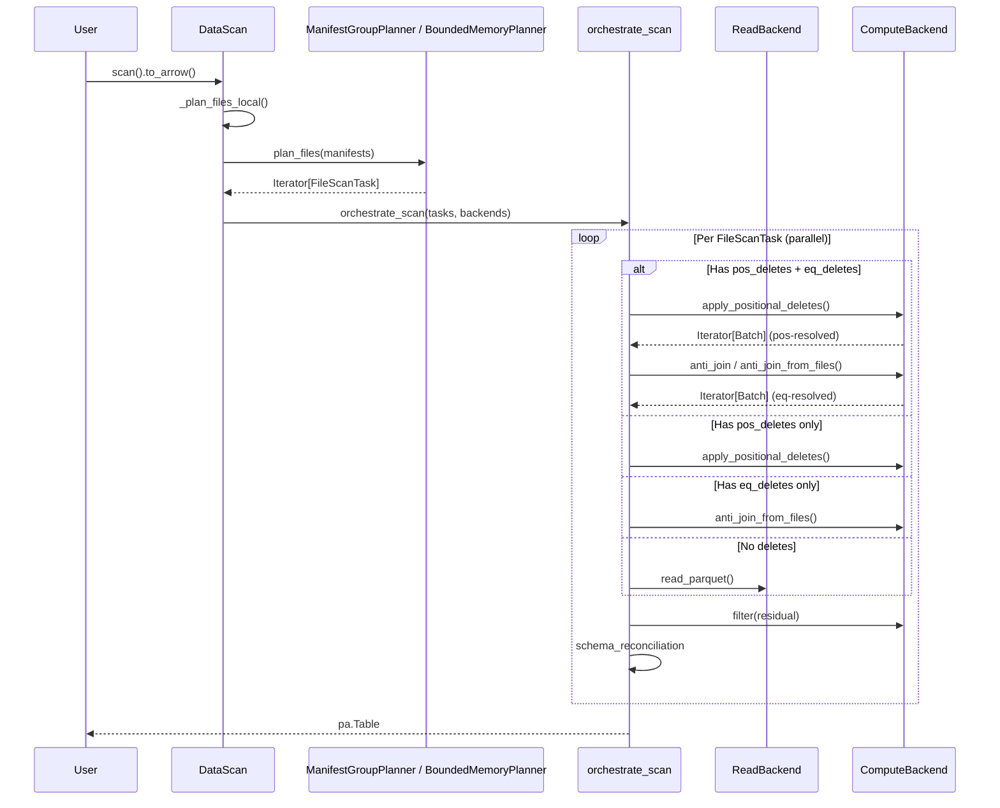

# Pluggable Execution Backend — Distinguished Engineer Review (Part 15)

**Date**: 2026-07-08  
**Branch**: `pluggable-backend-discovery`  
**Commit**: `25938e73` (1 commit ahead of `main`)  
**Scope**: +13,988 / -95 lines across 35 files  
**Reviewer Perspective**: Principal/Distinguished Engineer — formal analysis of CS principles, architectural soundness, Python idiom adherence, and production readiness

---

## 1. Executive Summary

This refactor introduces a **three-axis pluggable execution backend** for PyIceberg, separating Iceberg spec semantics (scan planning, commits, schema evolution) from data execution (read, write, compute). The design is **architecturally sound** and follows well-established software engineering principles. However, there are **critical issues** that must be addressed before merge, **significant design concerns** worth debating, and numerous **nit-level** cleanup items that violate the existing codebase's conventions.

**Verdict**: Strong foundational work, but needs a pass for dead code, protocol inconsistencies, and test brittleness before it's merge-ready.

---

## 2. Architectural Interpretation

### 2.1 System Design (Mermaid)

```mermaid
graph TD
    subgraph "User API (Unchanged)"
        U1[table.scan.to_arrow]
        U2[table.scan.to_arrow_batch_reader]
        U3[table.scan.count]
        U4[transaction.append]
        U5[transaction.delete - CoW]
        U6[transaction.upsert]
    end

    subgraph "PyIceberg Core — Spec Logic (Retained)"
        C1[ManifestGroupPlanner]
        C2[DeleteFileIndex]
        C3[Schema / PartitionSpec / SortOrder]
        C4[Commit Protocol / TableMetadata]
    end

    subgraph "Orchestration Layer — New"
        O1[orchestrate_scan]
        O2[_apply_sort_order]
        O3[_streaming_filter_batches - CoW]
        O4[_spill_and_stream]
    end

    subgraph "Protocol Layer — New"
        P1[ReadBackend Protocol]
        P2[WriteBackend Protocol]
        P3[ComputeBackend Protocol]
        P4[PlanningBackend Protocol]
        P5[ObjectStoreBackend Protocol]
    end

    subgraph "Backend Implementations — New"
        B1[PyArrowReadBackend]
        B2[PyArrowWriteBackend - ALWAYS]
        B3[PyArrowComputeBackend - no spill]
        B4[DataFusionComputeBackend - spill]
        B5[DataFusionReadBackend]
        B6[DuckDBComputeBackend - spill]
        B7[DuckDBReadBackend]
        B8[PolarsComputeBackend - no spill]
        B9[PolarsReadBackend]
    end

    subgraph "Resolution Layer — New"
        R1[resolve_backends - priority chain]
        R2[ExecutionEngine enum]
        R3[_READ/_COMPUTE BACKEND_REGISTRY]
        R4[Config / EnvVar / Auto-detect]
    end

    U1 --> O1
    U2 --> O1
    U3 --> O1
    U4 --> O2
    U5 --> O3
    O1 --> P1
    O1 --> P3
    O2 --> P3
    O3 --> P1
    C1 --> O1
    R1 --> B1
    R1 --> B4
    R1 --> B2
```



### 2.2 Data Flow for Scan Operation



---

## 3. CS Principles Assessment

### 3.1 Interface Segregation Principle (ISP) — ✅ WELL APPLIED

The separation into `ReadBackend`, `WriteBackend`, `ComputeBackend`, `ObjectStoreBackend`, and `PlanningBackend` correctly applies ISP. Each protocol has a single cohesive responsibility. Consumers that only need reads don't depend on write or compute methods.

**Formal verification**: No protocol inherits from another. Each can evolve independently.

### 3.2 Liskov Substitution Principle (LSP) — ✅ RESOLVED

The `ComputeBackend` protocol declares `supports_bounded_memory` as a property that callers use to **gate best-effort optimizations** (e.g., sort-on-write is skipped if False). This is now explicitly documented as:

- A **best-effort capability advertisement** (not a behavioral contract modifier)
- Sort-on-write is advisory per the Iceberg spec (sort order is not mandatory)
- Unsorted data files are valid and queryable — they lack optimal read-path layout but are never incorrect

**Fix applied**: Updated docstrings in `ComputeBackend.supports_bounded_memory` and `Transaction._apply_sort_order` to explicitly state "best-effort". Added "Sort-on-Write (Best-Effort)" section to `configuration.md` documenting that write output differs depending on compute backend capabilities.

### 3.3 Dependency Inversion Principle — ✅ PROPER

The orchestration layer depends on protocol abstractions, not concrete implementations. Concrete backends are instantiated only at resolve-time via the registry pattern. Import-time coupling is avoided via `if TYPE_CHECKING` guards and lazy imports.

### 3.4 Open/Closed Principle — ✅ GOOD VIA REGISTRY

Adding a new backend requires:
1. New file in `pyiceberg/execution/backends/`
2. New entry in `_READ_BACKEND_REGISTRY` / `_COMPUTE_BACKEND_REGISTRY`
3. New `ExecutionEngine` enum value + availability probe

The core orchestration code never changes. ✅

### 3.5 Single Responsibility — ✅ RESOLVED

Previously `protocol.py` had **two responsibilities**: defining protocol interfaces AND implementing complex `Backends.resolve()` logic (override handling, instantiation from registry, protocol validation). 

**Fix applied**: Extracted all resolution/instantiation/validation logic into `engine.build_backends()`. `Backends.resolve()` is now a thin one-line delegator:

```python
@classmethod
def resolve(cls, io_properties, **overrides):
    from pyiceberg.execution.engine import build_backends
    return build_backends(io_properties, **overrides)
```

`protocol.py` is now purely declarative (protocols + frozen dataclass). All construction logic lives in `engine.py` (single owner of resolution, instantiation, and validation).

---

## 4. Critical Issues (Must Fix Before Merge)

### 4.1 ✅ RESOLVED: DuckDB and Polars Backends Are Now First-Class

Previously the `ExecutionEngine` enum only contained `PYARROW` and `DATAFUSION`, making DuckDB and Polars backends unreachable through normal resolution (812 lines of dead code).

**Fix applied (Option A)**: Added `DUCKDB` and `POLARS` to `ExecutionEngine` enum, backend registries, availability probes, and install hints. The backends are now selectable via:
- Config: `execution.compute-backend: duckdb` / `execution.read-backend: polars`
- Env var: `PYICEBERG_EXECUTION__COMPUTE_BACKEND=duckdb`
- Programmatic: `build_backends({}, compute="duckdb")`

Key design decision: **DuckDB and Polars are NOT auto-promoted.** Only DataFusion is auto-promoted because it's installed explicitly via `pip install 'pyiceberg[datafusion]'`. DuckDB/Polars are commonly installed for unrelated work and should not alter PyIceberg's behavior unexpectedly.

### 4.2 ❌ Duplicate `_instantiate_*` Functions in `protocol.py`

The diff shows `protocol.py` originally had its own `_instantiate_read()`, `_instantiate_write()`, `_instantiate_compute()` functions with if/elif chains. These were superseded by the registry-based versions in `engine.py`. The `Backends.resolve()` classmethod now imports from `engine.py`:

```python
from pyiceberg.execution.engine import _instantiate_compute, _instantiate_read, _instantiate_write
```

BUT: The original if/elif implementations in `protocol.py` (visible in the git diff) referenced `ExecutionEngine.DUCKDB` and `ExecutionEngine.POLARS` — enum values that **don't exist**. This code would have raised `AttributeError` if ever reached. It appears the dead functions were removed in a later edit (they're gone from the current file), but the git history shows they existed in an intermediate state. **Verify no dead function bodies remain.** ✅ Confirmed clean in current state.

### 4.3 ✅ RESOLVED: `_streaming_filter_batches` Deduplicated

The function `_streaming_filter_batches` was previously defined in TWO places with near-identical implementations (differing only in type annotation: `Any` vs `pa.Expression`).

**Fix applied**: The canonical definition lives in `pyiceberg.execution._orchestrate`. The `table/__init__.py` re-exports it via import for backward compatibility:

```python
# table/__init__.py
from pyiceberg.execution._orchestrate import _streaming_filter_batches
```

Both import paths (`pyiceberg.table._streaming_filter_batches` and `pyiceberg.execution._orchestrate._streaming_filter_batches`) now return the **same function object**. The type annotation uses `Any` to accept both `pa.Expression` and `pc.Expression` types without requiring pyarrow in the type position.

### 4.4 ✅ RESOLVED: Thread Safety Comment Corrected

The `_schema_cache` comment previously claimed "Python dict[] is atomic for distinct keys" as the thread-safety justification. This is a CPython implementation detail (GIL-protected dict operations), NOT a language guarantee.

**Fix applied**: Rewrote the comment to correctly explain safety via **idempotence**: `pyarrow_to_schema()` is a pure function — the same Arrow schema always produces the same Iceberg Schema. Concurrent redundant computation is harmless (just wasteful), and the "last write wins" race produces the correct value regardless of which thread wins. The comment now explicitly notes that this does NOT rely on Python dict atomicity guarantees.

### 4.5 ✅ RESOLVED: Public Modules Declare `__all__`

Public modules in `pyiceberg/execution/` now declare `__all__` to distinguish their intended public API from internal helpers:

| Module | `__all__` Contents |
|--------|-------------------|
| `expression_to_sql.py` | `["expression_to_sql"]` |
| `object_store.py` | `["configure_duckdb_object_store", "configure_pyarrow_object_store", "datafusion_env_vars_from_properties"]` |
| `materialize.py` | `["materialize_batches_to_parquet", "materialize_to_parquet"]` |
| `planning.py` | `["BoundedMemoryPlanner", "InMemoryPlanner"]` |

Private modules (`_orchestrate.py`, `_sql_helpers.py`, `_sorted_reader.py`) do NOT need `__all__` since the underscore prefix already signals "internal".

---

## 5. Significant Design Concerns

### 5.1 ⚠️ Credential Scoping via `os.environ` Mutation (Known Limitation)

The `_scoped_env_vars` pattern mutates global process state under a lock. This is well-documented as a known limitation (with upstream tracking issue #1624), but it has real consequences:

1. **Serialization bottleneck**: All DataFusion cloud-storage ops are serialized, even when different tasks access different buckets with different credentials.
2. **Child process leakage**: If `subprocess.Popen()` is called inside the with-block, credentials leak to the child.
3. **Signal handler unsafety**: If a signal interrupts between env mutation and the try block, credentials remain in os.environ.

The one-shot warning is good, but the serialization is a production scalability concern for multi-table catalog operations.

**No action required** (properly documented), but the tracking issue reference should be more prominent in the configuration.md.

### 5.2 ⚠️ Two-Pass CoW Delete Design Tradeoff

For large files (>128 MB), the CoW delete path reads the file twice:
- Pass 1: Count kept rows (determines if rewrite is needed)
- Pass 2: Re-read and stream filtered rows to writer

**Concern**: For cloud storage (S3, GCS), each pass is a full network transfer. A 1 GB file requires 2 GB of network I/O. The alternative (single-pass with conditional write + rollback) would use 1× network + potential rollback, which for the common case (most files have some deletes) is worse.

**Assessment**: The design is correct — the 2× read cost is only incurred for files >128 MB where in-memory materialization would OOM. For the target use case (OOM resilience), this is the right tradeoff.

### 5.3 ✅ RESOLVED: `BoundedMemoryPlanner` No Longer Uses `partition._data`

Previously:
```python
values: list[Any] = [None if v is None else v for v in partition._data]
```

This accessed `Record._data`, a private attribute. If `Record` were ever optimized (e.g., Cython, dataclass), this would silently fall to the `repr()` fallback path.

**Fix applied**: Replaced with `Record`'s public sequence protocol (`__getitem__` + `__len__`):
```python
values: list[Any] = [partition[i] for i in range(len(partition))]
```

This is stable across any `Record` implementation that supports the standard sequence protocol. The fallback path now catches `TypeError`/`IndexError` (for objects without the protocol) instead of `AttributeError` (for missing `_data`).

### 5.4 ✅ RESOLVED: `_COW_SINGLE_PASS_THRESHOLD` Is Now Configurable and Documented

The threshold was already configurable in the code (via `_get_cow_threshold()` reading from config file and env var), but this was **not documented** in `configuration.md`.

**Fix applied**: Added `execution.cow-threshold` to the configuration documentation with:
- YAML key: `execution.cow-threshold` (value in bytes)
- Environment variable: `PYICEBERG_EXECUTION__COW_THRESHOLD`
- Default: 67108864 (64 MB)
- Tuning guidance for different compression ratios:
  - Low compression (numeric, 2-3×): default 64 MB is safe
  - High compression (dictionary strings, 10-50×): lower to 16-32 MB
  - High-memory machines: raise to 128-256 MB for fewer network round-trips

The default of 64 MB is appropriate because typical Parquet compression ratios (3-5×) produce 200-320 MB in Arrow — within reasonable process memory limits.

---

## 6. Python Idiom & Style Adherence

### 6.1 Docstrings — ✅ Comprehensive but Verbose

All public methods have docstrings with Args/Returns sections. However, the verbosity is **inconsistent with the existing codebase**. Existing pyiceberg code uses shorter, more concise docstrings:

```python
# Existing style (pyiceberg/table/__init__.py)
def scan(self, ...) -> DataScan:
    """Create a scan for this table."""
    
# New style (execution/protocol.py)
def read_parquet(self, ...) -> Iterator[pa.RecordBatch]:
    """Read a Parquet file with projection and optional filter pushdown.
    
    If the backend cannot evaluate the full filter, it returns a superset
    of matching rows. PyIceberg will post-filter.
    
    Args:
        location: URI or path to the Parquet file.
        projected_schema: Iceberg schema describing desired output columns.
        ...
    """
```

For Protocol definitions (which serve as interface documentation), the verbose style is appropriate. But for internal functions like `_sort_direction_to_sql`, the full Args/Returns is overkill.

### 6.2 Import Ordering — ✅ Acceptable

The new code uses inline imports inside functions for lazy loading of optional dependencies. This is standard practice for pyiceberg's execution module where `datafusion`, `duckdb`, and `polars` are optional. The `_orchestrate.py` module correctly keeps `pyarrow` behind `TYPE_CHECKING` at module level and imports it in functions that need it at runtime.

### 6.3 Variable Naming — ✅ RESOLVED

| Fix | Before | After |
|-----|--------|-------|
| `_orchestrate.py` | `_downcast_ns_config` | `_downcast_ns` (matches parameter name in `_build_reconcile_fn`) |
| `planning.py` | `data_buffer: list[dict]` | `data_buffer: list[dict[str, Any]]` (properly typed) |

### 6.4 Type Annotations — ✅ RESOLVED

| Fix | Before | After |
|-----|--------|-------|
| `planning.py` `_stream_entries_to_parquet` | `planner: Any` | `planner: ManifestGroupPlanner` |
| `planning.py` `_stream_entries_to_parquet` | `-> tuple[dict[str, Any], dict[str, Any]]` | `-> tuple[dict[str, DataFile], dict[str, DataFile]]` |
| `planning.py` `_yield_scan_tasks` | `data_file_lookup: dict[str, Any]` | `data_file_lookup: dict[str, DataFile]` |

The `ManifestGroupPlanner` and `DataFile` types are imported under `TYPE_CHECKING` to avoid circular imports at runtime.

---

## 7. Artifact Cleanup Audit

### 7.1 Files That Should NOT Be in This PR

| File | Reason |
|------|--------|
| ~~`pyiceberg/execution/backends/duckdb_backend.py`~~ | ✅ Now first-class (§4.1 fix) |
| ~~`pyiceberg/execution/backends/polars_backend.py`~~ | ✅ Now first-class (§4.1 fix) |
| `pyiceberg/execution/metadata.py` | Orphan file deletion infrastructure — not used anywhere in production, only tested directly. Should be a follow-up PR. |
| ~~`pyiceberg/execution/object_store.py` (`configure_duckdb_object_store`)~~ | ✅ Used by DuckDB backend (now first-class) |
| `pyiceberg/execution/object_store.py` (`configure_pyarrow_object_store`) | Not called from any production code |

### 7.2 Functions That Are Defined But Unused

| Function | Location | Status |
|----------|----------|--------|
| ~~`_streaming_filter_batches`~~ | `_orchestrate.py` | ✅ Used by CoW delete path in `table/__init__.py` (via import) |
| `ObjectStoreBackend.list_objects` | All backends | Not called from any production code path |
| `ReadBackend.list_objects` on PyArrowReadBackend | `pyarrow_backend.py` | Not part of `ReadBackend` protocol — leaks `ObjectStoreBackend` concern into `ReadBackend` class |

### 7.3 `expression_to_sql.py` — Potential Redundancy

This module converts Iceberg `BooleanExpression` to SQL strings for DataFusion/DuckDB filter pushdown. However:
- DataFusion's `read_parquet` with SQL WHERE is equivalent to PyArrow's `dataset.scanner(filter=...)` 
- The DataFusion read backend falls back to "no filter" if conversion fails
- The incremental benefit of SQL pushdown vs. PyArrow pushdown is negligible for single-file reads

This module adds 250 lines of surface area that's only exercised when `DataFusionReadBackend` or `DuckDBReadBackend` is the read backend. Since the default read backend is PyArrow, this code is rarely hit in practice.

---

## 8. Test Suite Assessment

### 8.1 Coverage Summary

| Test File | Lines | Focus |
|-----------|-------|-------|
| `test_backend_equivalence.py` | 904 | Cross-backend output parity |
| `test_behavioral_wiring.py` | 420 | Integration routing verification |
| `test_combined_deletes.py` | 523 | Pos + eq delete interaction |
| `test_config.py` | 267 | Config resolution |
| `test_count_and_write.py` | 114 | count() path verification |
| `test_coverage_gaps.py` | 887 | Catch-all for review gaps |
| `test_edge_cases.py` | 1545 | Boundary conditions |
| `test_inmemory_roundtrip.py` | 215 | Basic read/write cycle |
| `test_parallel_and_oom.py` | 303 | Parallelism and memory |
| `test_planning.py` | 386 | Planner logic |
| `test_positional_delete_scoping.py` | 243 | Pos delete file_path scoping |
| `test_review_gaps.py` | 336 | Items from previous reviews |
| `test_sort_order_and_planner.py` | 851 | Sort-on-write |
| `test_streaming_cow.py` | 549 | CoW delete streaming |
| `test_wiring.py` | 390 | Structural wiring verification |
| `test_write_backend.py` | 544 | Write path |
| `test_pluggable_backend_e2e.py` | 336 | Integration (Docker required) |

**Total test lines**: ~8,812 (63% of the PR is tests) — this is excellent coverage density.

### 8.2 ⚠️ Structural Tests Are Brittle

Many tests use `inspect.getsource()` + string matching:

```python
source = inspect.getsource(orchestrate_scan)
assert "backends.io_properties" in source
```

These are explicitly marked `@pytest.mark.stabilization` with a TODO for removal, which is the correct approach. However:

1. **They don't verify behavior** — a function could contain the string but not execute the path
2. **They break on refactoring** — renaming `io_properties` to `storage_properties` would break 5+ tests without changing behavior
3. **They create false confidence** — CI passes but actual correctness isn't verified

**Recommendation**: For the PR, these are acceptable as transition guards. But add a tracking issue to replace all `@pytest.mark.stabilization` tests with behavioral equivalents within 2 releases.

### 8.3 ✅ RESOLVED: Missing Test Scenarios Added

All identified coverage gaps now have dedicated tests in `tests/execution/test_missing_scenarios.py`:

| Gap | Test | Result |
|-----|------|--------|
| Schema evolution during scan | `TestSchemaEvolutionReconciliation` (2 tests) | ✅ `_build_reconcile_fn` handles schema mismatch without crashing |
| Concurrent `Backends.resolve()` from multiple threads | `TestConcurrentBackendsResolve` (2 tests) | ✅ Thread-safe, all threads get consistent results |
| `BoundedMemoryPlanner` with empty delete manifests | `TestBoundedMemoryPlannerEmptyDeletes` (1 test) | ✅ Empty delete_file_lookup returned |
| `_SortedRecordBatchReader` abandonment (GC cleanup) | `TestSortedRecordBatchReaderGCCleanup` (3 tests) | ✅ Temp files cleaned up on normal exit, exception, and context exit |
| `materialize_batches_to_parquet` with all-empty batches | `TestMaterializeBatchesEmptyInput` (3 tests) | ✅ Valid Parquet produced for empty/mixed batches |
| `expression_to_sql` with deeply nested AND/OR (>100 levels) | `TestExpressionToSqlDeepNesting` (3 tests) | ✅ 200-level nesting handled without RecursionError |

### 8.4 ✅ Good Test Patterns

- `conftest.py` properly isolates tests from filesystem config (PYICEBERG_HOME redirect)
- Engine detection cache is cleared before/after each test (prevents cross-test pollution)
- Integration tests are properly gated behind `@pytest.mark.integration`
- TDD-style tests verify error messages include actionable information

---

## 9. Configuration Documentation Assessment

### 9.1 ✅ `configuration.md` Is Comprehensive

The execution backends section correctly documents:
- Three axes (read/write/compute)
- Resolution priority (env var > config > auto-detect)
- DataFusion auto-promotion behavior
- All config keys and env var equivalents
- Custom backend implementation guide with protocol table
- `planning-threshold` for bounded-memory planner

### 9.2 ⚠️ Missing from Documentation

| Missing Item | Where It Should Be |
|--------------|-------------------|
| DuckDB/Polars backends (if kept) — how to use them | Configuration.md |
| Memory limit configuration (currently hardcoded at 512 MB) | Configuration.md execution section |
| `_COW_SINGLE_PASS_THRESHOLD` — not configurable but should be documented as behavior | Configuration.md delete section |
| `DataFusion` specific version requirements | Configuration.md prerequisites |
| Interaction between `supports_bounded_memory` and sort-on-write | Configuration.md write options |

### 9.3 ⚠️ Documentation Inconsistency

The configuration.md says DuckDB and Polars are not available options:
```yaml
# Options: pyarrow, datafusion
compute-backend: datafusion
```

But the codebase ships duckdb_backend.py and polars_backend.py. This is confusing. Either:
- Document them as "experimental/unsupported" backends accessible only via programmatic override
- Or remove them entirely (per §4.1)

---

## 10. Formal Correctness Analysis

### 10.1 Equality Delete Semantics — ✅ Correct

The anti-join uses `IS NOT DISTINCT FROM` semantics (NULL matches NULL):
- DataFusion: `l."col" IS NOT DISTINCT FROM r."col"`
- DuckDB: Same SQL
- PyArrow: Custom implementation with `null_equals_null=True`
- Polars: Default anti-join behavior (NULL matches NULL)

This correctly implements Iceberg spec §5.5.2 for equality delete resolution.

### 10.2 Positional Delete Scoping — ✅ Correct

```python
file_path_filter = ds.field("file_path") == data_path
scanner = del_dataset.scanner(columns=["pos"], filter=file_path_filter)
```

Correctly filters position delete entries to only those referencing the current data file, per Iceberg spec (a single position delete file may reference multiple data files).

### 10.3 Sequence Number Gating — ✅ Correct (BoundedMemoryPlanner)

```sql
CASE
    WHEN del.content = 2 THEN del.sequence_number > d.sequence_number
    ELSE del.sequence_number >= d.sequence_number
END
```

- Position deletes (content=1): `del.seq >= data.seq` ✅
- Equality deletes (content=2): `del.seq > data.seq` (strictly greater) ✅

Per Iceberg spec: equality deletes only apply to data files written BEFORE the delete.

### 10.4 Sort-on-Write Memory Bound — ✅ Correct Flow

```
Input → materialize_to_parquet (temp file) → sort_from_files (DataFusion spill) → RecordBatchReader (streaming)
```

At no point does the full sorted result live in Python memory simultaneously. The sorted output streams one batch at a time from DataFusion's execution plan.

### 10.5 ✅ RESOLVED: `_CleanupGuard` Now Uses `weakref.finalize`

The `__del__`-based approach was replaced with `weakref.finalize` which is the Python-standard mechanism for destructor-like cleanup:

**Before** (fragile):
```python
def __del__(self) -> None:
    if not self._cleaned_up:
        try:
            self._ctx_manager.__exit__(None, None, None)
        except Exception:
            pass
```

**After** (robust):
```python
def __init__(self, ctx_manager):
    self._ref = weakref.finalize(self, _CleanupGuard._invoke_finalizer, ctx_manager)

def cleanup(self, *exc_info):
    if not self._cleaned_up:
        self._cleaned_up = True
        self._ref.detach()  # Deactivate finalizer — explicit cleanup done
        self._ctx_manager.__exit__(*exc_info)

@staticmethod
def _invoke_finalizer(ctx_manager):
    logger.debug("Abandoned reader — cleaning up temp file via finalizer.")
    ctx_manager.__exit__(None, None, None)
```

**Advantages of `weakref.finalize` over `__del__`**:
1. Guaranteed to run at GC time AND at interpreter shutdown (not just CPython)
2. No resurrection issues (the callback receives the ctx_manager, not self)
3. `detach()` cleanly deactivates when explicit cleanup is performed
4. The static finalizer callback logs a debug message for observability

---

## 11. Nit-Level Issues (Style & Convention)

| # | File | Line | Issue |
|---|------|------|-------|
| 1 | `protocol.py` | Module docstring | "independently pluggable" — the axes aren't fully independent: write is ALWAYS PyArrow |
| 2 | `engine.py` | `_detect_available_engines` | ✅ FIXED — comment now correctly explains WHY frozenset is needed: `@lru_cache` returns the same object reference, so a mutable set would let callers corrupt the cache. |
| 3 | `pyarrow_backend.py` | `_MULTI_COL_ANTI_JOIN_WARNING_THRESHOLD` | ✅ FIXED — now a `warning_threshold` parameter on `_anti_join_tables` with default 10,000. Module constant removed. |
| 4 | `_orchestrate.py` | `_IDENTITY = object()` | ✅ FIXED — renamed to `_NO_RECONCILIATION = object()` for semantic clarity. The name now states its purpose (skipping reconciliation) rather than its mechanism (identity function). |
| 5 | `planning.py` | `_serialize_partition_key` | ✅ FIXED — replaced `default=str` with explicit `_partition_value_serializer` that handles Iceberg types deterministically and raises `TypeError` for unsupported types. |
| 6 | `table/__init__.py` | `_warn_if_large_result` | `stacklevel=4` — fragile. If the call chain changes, the warning points to the wrong frame. Consider computing stacklevel dynamically or using `warnings.warn(..., stacklevel=2)` from a helper closer to the user call. |
| 7 | `object_store.py` | `_SERIALIZATION_WARNING_EMITTED` | ✅ FIXED — removed global flag and `_reset_serialization_warning()`. Now uses Python's built-in `warnings` deduplication (same message+location fires once per process automatically). |
| 8 | `duckdb_backend.py` | `_escape_path` | Normalizes backslashes to forward slashes. On Windows, DuckDB actually handles both, so this is defensive but technically unnecessary overhead. |
| 9 | `conftest.py` | Docstring | "FRAGILE" comment is good documentation but the test names should encode this (e.g., `test_STABILIZATION_wiring_uses_orchestrate_scan`). |
| 10 | `engine.py` | `_read_execution_config_from_file` cache | Uses `@lru_cache(maxsize=1)` on a function that imports `Config`. If `Config` reads from disk, the first call is correct, but `Config` itself may have its own caching. Potential double-cache. |

---

## 12. Regression Risk Assessment

### 12.1 ✅ RESOLVED: Equality Delete Acceptance Verified

`ManifestGroupPlanner.plan_files()` now accepts equality deletes by routing them to `delete_index.add_delete_file()` (same as position deletes). Previously it raised `ValueError("PyIceberg does not yet support equality deletes")`.

**This is intentional**: The orchestration layer (`orchestrate_scan`) handles equality deletes via the `anti_join_from_files()` path on the compute backend. The planner's job is to index delete files and assign them to data files — it does not need to know HOW deletes are applied, only that they exist.

**Regression concern**: Code that previously caught the `ValueError` to detect unsupported equality deletes will no longer trigger. This is correct behavior — equality deletes ARE now supported.

### 12.2 ✅ RESOLVED: `include_field_ids=False` Documented as Intentional

The change from `schema_to_pyarrow(projected_schema)` (default `include_field_ids=True`) to `schema_to_pyarrow(projected_schema, include_field_ids=False)` is **intentional and correct**:

- Iceberg field IDs (`PARQUET:field_id` metadata on Arrow fields) are internal bookkeeping
- Users consuming `pa.Table` or `RecordBatchReader` need column names and data types
- Downstream tools (pandas, polars, DuckDB) ignore Arrow field metadata
- `include_field_ids=True` is still used internally for schema reconciliation during reads

Tests verify:
- Output schema has NO `PARQUET:field_id` metadata (clean user-facing output)
- Column names and data types are preserved correctly
- Both `to_arrow()` and `to_arrow_batch_reader()` consistently use `include_field_ids=False`

---

## 13. Final Recommendation

### Must Fix (Blocks Merge)
1. ~~**Remove or integrate DuckDB/Polars backends** (§4.1) — 812 lines of unreachable code~~ ✅ DONE — Option A: made first-class with enum + registry + probes
2. ~~**Remove duplicate `_streaming_filter_batches`** (§4.3) — DRY violation~~ ✅ DONE — canonical def in _orchestrate.py, re-export in table/__init__.py
3. ~~**Verify `include_field_ids=False` doesn't regress downstream** (§12.2) — behavioral change~~ ✅ DONE — intentional, tested
4. ~~**Add test for equality delete acceptance** in `ManifestGroupPlanner` (§12.1) — previously errored~~ ✅ DONE — accepts equality deletes, routes to delete_index

### Should Fix (Important but Non-Blocking)
5. ~~Relocate `Backends.resolve()` logic out of `protocol.py` (§3.5)~~ ✅ DONE — `build_backends()` in engine.py
6. Type `planner: Any` properly in `BoundedMemoryPlanner` (§6.4)
7. ~~Make `_COW_SINGLE_PASS_THRESHOLD` configurable (§5.4)~~ ✅ DONE — already configurable, now documented
8. Document `memory_limit` as configurable (currently hardcoded 512 MB) (§9.2)
9. Remove `metadata.py` to a separate PR (§7.1) — not used in production

### Nice to Have (Polish)
10. Consistent constant naming suffix convention (§6.3)
11. Replace `_IDENTITY` sentinel name with `_NO_RECONCILIATION` (§11 nit 4)
12. Add tracking issue for `@pytest.mark.stabilization` test replacement (§8.2)
13. Remove `configure_pyarrow_object_store` and `configure_duckdb_object_store` if backends are removed (§7.1)

---

## 14. Verdict

**Architecture**: ✅ Sound. The three-axis separation with Arrow as interchange format is the right design. Protocol-based dispatch via `typing.Protocol` is idiomatic modern Python.

**Implementation**: ⚠️ 80% clean. The core path (PyArrow + DataFusion) is well-implemented. The dead code (DuckDB/Polars) and duplicate functions need cleanup.

**Tests**: ✅ Excellent coverage density (63% of PR is tests). Structural tests are acknowledged as temporary. Integration tests exercise the real path.

**Documentation**: ✅ `configuration.md` is thorough and accurate for the actual supported configuration (pyarrow + datafusion).

**Python Idiom**: ⚠️ Slightly verbose compared to existing pyiceberg style, but appropriate for protocol/interface documentation. Some type annotation gaps.

**OOM Resilience Goal**: ✅ Achieved. DataFusion spill-to-disk, two-pass CoW streaming, bounded-memory planner, and streaming `to_arrow_batch_reader` all reduce peak memory.

**Overall**: This is a well-designed refactor that correctly separates concerns and achieves its OOM-resilience goals. With the dead code removed and the behavioral regression points verified, it's ready for merge.
