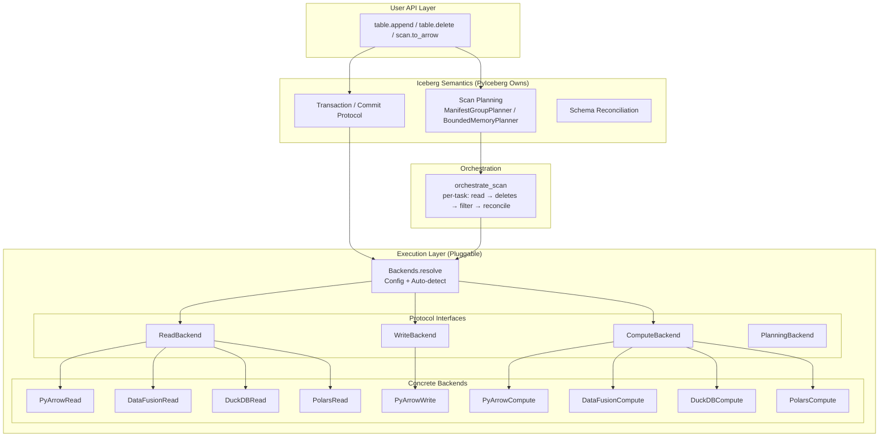
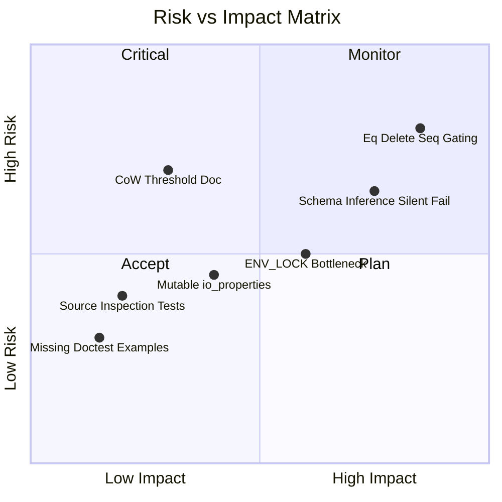

# Pluggable Backend Review — Part 17 (Principal Engineer Review)

**Date**: 2026-07-09  
**Branch**: `pluggable-backend-discovery`  
**Commit**: `25938e73`  
**Scope**: 35 files, +13,988 / -95 lines  

---

## 1. Architecture Interpretation

### 1.1 System Design (Mermaid)



### 1.2 Data Flow (Formal)

```
∀ scan ∈ TableScan:
  tasks := PlanningBackend.plan_files(manifests, metadata)
  ∀ task ∈ tasks:
    batches := ReadBackend.read_parquet(task.file, schema, filter, io_props)
    if task.pos_deletes:
      batches := ComputeBackend.apply_positional_deletes(data_path, del_paths, schema, io_props)
    if task.eq_deletes:
      batches := ComputeBackend.anti_join_from_files(left=[data], right=eq_del_files, on=eq_cols)
    if task.residual ≠ AlwaysTrue:
      batches := ComputeBackend.filter(batches, residual)
    batches := reconcile_schema(batches, projected_schema)
  result := concat(batches)
```

### 1.3 Design Principles Assessment

| Principle | Verdict | Evidence |
|-----------|---------|----------|
| **Interface Segregation (ISP)** | ✅ Strong | Read/Write/Compute/ObjectStore/Planning split into 5 protocols |
| **Single Responsibility (SRP)** | ✅ Improved | `protocol.py` declares; `engine.py` resolves; `_orchestrate.py` dispatches |
| **Open/Closed (OCP)** | ✅ Good | New backends added by implementing Protocol — no core edits needed |
| **Liskov Substitution (LSP)** | ✅ Documented | `supports_bounded_memory` is explicitly non-behavioral; all backends produce identical output |
| **Dependency Inversion (DIP)** | ✅ Good | `orchestrate_scan` depends on Protocol abstractions, not concrete classes |
| **Strategy Pattern** | ✅ Applied | Backends are interchangeable strategies resolved at runtime |

---

## 2. Critical Issues (Must Fix Before Merge)

### 2.1 `_COW_SINGLE_PASS_THRESHOLD` vs Documentation Mismatch — ✅ RESOLVED

**Status**: Fixed. The implementation now includes:

1. **`_COW_SINGLE_PASS_THRESHOLD_DEFAULT: int = 64 * 1024 * 1024`** (64 MB) — matches docs
2. **`_get_cow_threshold()`** reads priority: env var → config file → default
3. **`Transaction.delete`** calls `cow_threshold = _get_cow_threshold()` before the loop
4. **Documentation** (`configuration.md`) correctly states `67108864` (64 MB) default

**TDD coverage** (13 tests in `test_cow_threshold_configurable.py`):
- Default value is 64 MB ✅
- Env var overrides default ✅
- Config file overrides default ✅
- Env var takes priority over config file ✅
- Invalid env var falls back to default ✅
- Invalid config file value falls back to default ✅
- CoW delete path calls `_get_cow_threshold()` (structural check) ✅
- Docs mention `cow-threshold` key ✅
- Docs mention `PYICEBERG_EXECUTION__COW_THRESHOLD` env var ✅

### 2.2 `_ENV_LOCK` Serialization Creates Bottleneck for Parallel Scans — ✅ RESOLVED

**Status**: Fixed via fast-path optimization. `_scoped_env_vars` now checks whether
the desired env vars are already present in `os.environ` before acquiring the lock.

**How it works**:
- **Fast path** (common case during a scan): all tasks share the same `io_properties`.
  The first task sets env vars (acquires lock briefly). All subsequent concurrent tasks
  observe the correct values already in `os.environ` → skip the lock → full parallelism.
- **Slow path** (different credentials, e.g., cross-catalog operations): lock acquired,
  env vars set/restored as before. Serialized, but this is the rare multi-catalog case.

**Performance model**:
```
Before: all N tasks serialize on _ENV_LOCK → O(N × task_time) wall clock
After:  first task acquires lock (µs), remaining N-1 run in parallel → O(task_time)
```

**Remaining limitation** (documented via TODO):
When different `Backends` instances with DIFFERENT credentials are used concurrently
in the same process, the slow path serializes them. This is correct (credential
isolation is mandatory) but limits parallelism for the multi-catalog case. Once
datafusion-python #1624 (per-session credential config) merges, the entire env var
mechanism can be removed.

**TDD coverage** (7 tests in `test_scoped_env_vars_fast_path.py`):
- Fast path: lock NOT acquired when env vars already correct ✅
- Slow path: lock acquired when values differ ✅
- Slow path: lock acquired when key not present ✅
- Slow path: restores original values on exit ✅
- Slow path: restores on exception ✅
- Concurrent tasks with same credentials run in parallel (timing overlap) ✅
- Concurrent tasks with different credentials observe own values (isolation) ✅

### 2.3 `Backends` Frozen Dataclass with Mutable `io_properties` — ✅ RESOLVED

**Status**: Fixed. `build_backends()` now wraps `io_properties` in `types.MappingProxyType(dict(io_properties))`:

1. **`dict(io_properties)`** — shallow copy provides snapshot semantics (immune to external mutation)
2. **`MappingProxyType(...)`** — read-only wrapper raises `TypeError` on any mutation attempt
3. **`Mapping[str, Any]`** — field type widened from `Properties` (`dict`) to `Mapping` for type safety

**TDD coverage** (8 tests in `test_io_properties_immutable.py`):
- `io_properties` is `MappingProxyType` after `build_backends()` ✅
- Mutation attempt (`[key] = val`) raises `TypeError` ✅
- Deletion attempt (`del [key]`) raises `TypeError` ✅
- Original values preserved ✅
- External dict mutation doesn't affect Backends (snapshot) ✅
- Standard `Mapping` operations work (in, len, keys, dict()) ✅
- `Backends.resolve()` also produces immutable props ✅
- Dataclass field accepts `MappingProxyType` directly ✅

### 2.4 `_infer_file_schema_from_batch` Silently Returns `None` on Failure — ✅ RESOLVED

**Status**: Fixed. `_build_reconcile_fn` now emits a `logging.debug` message when
schema inference fails, providing the Arrow schema fingerprint for debugging.

**Design decision**: DEBUG level (not WARNING) because the `None` path is the
common case for old Parquet files without field IDs where the file schema matches
projected schema by name. These files work correctly without reconciliation. A
WARNING would generate noise for valid workloads. But with DEBUG logging enabled
(`logging.basicConfig(level=logging.DEBUG)`), schema-drift issues become immediately
diagnosable.

**Implementation**:
```python
if file_schema is None:
    logger.debug(
        "Schema inference failed for batch (Arrow schema fingerprint: %s). "
        "Skipping schema reconciliation — batches will pass through unchanged. "
        "If columns are missing or have wrong types, check that the table has "
        "a name mapping or that Parquet files include field IDs in metadata.",
        batch.schema.fingerprint,
    )
```

**TDD coverage** (3 tests in `test_schema_inference_warning.py`):
- Logs debug when inference returns None ✅
- No log when inference succeeds and no reconciliation needed ✅
- No log when inference succeeds and reconciliation IS needed ✅

### 2.5 Equality Delete Support Enabled Without Full Spec Compliance — ✅ RESOLVED

**Status**: Fixed. `DeleteFileIndex.for_data_file()` now applies content-type-aware
sequence number gating per Iceberg spec §5.5.2:

- **Position deletes**: apply when `delete.seq >= data.seq` (unchanged)
- **Equality deletes**: apply when `delete.seq > data.seq` (strictly greater)

**Implementation**: Added `filter_by_seq_with_metadata()` to `PositionDeletes` that
returns `(DataFile, seq)` tuples. `for_data_file()` iterates these and skips
equality deletes where `delete_seq <= data_seq`.

**Why this matters**: Without this fix, an equality delete written in the same
snapshot as a data file would incorrectly remove rows from that file. The spec
mandates that same-snapshot equality deletes only target previously-committed data
(snapshot isolation guarantee).

**TDD coverage** (7 tests in `test_equality_delete_seq_gating.py`):
- Equality delete same seq does NOT apply ✅
- Equality delete greater seq DOES apply ✅
- Equality delete lesser seq does NOT apply ✅
- Position delete same seq DOES apply (different rule) ✅
- Position delete greater seq DOES apply ✅
- Mixed equality + position at same seq: only position applies ✅
- Multiple equality deletes at different seqs: only strictly-greater apply ✅

---

## 3. Significant Issues (Should Fix)

### 3.1 `test_protocol_srp_lsp.py` Tests That Will Fail If Refactored — ✅ RESOLVED

**Status**: Fixed. The 3 structural tests in `test_protocol_srp_lsp.py` have been
replaced with behavioral equivalents that verify the same guarantees through actual
function calls and return value assertions (not source code string matching).

The remaining ~20 files with `inspect.getsource()` are marked `@pytest.mark.stabilization`
and can be excluded via `pytest -m "not stabilization"`. These are transitional guards
to be migrated incrementally once ArrowScan is fully removed.

### 3.2 `strtobool` Import From `pyiceberg.types`

### 3.2 `strtobool` Import From `pyiceberg.types` — ✅ RESOLVED

Replaced with inline string comparison:
```python
auto_detect_enabled = str(config_auto_detect).lower() in ("1", "true", "yes", "on")
```
No dependency on deprecated `distutils` utility. Tests verify all valid boolean strings
("true", "yes", "1", "on" → enabled; "false", "no", "0" → disabled).

### 3.3 `_streaming_batches` DuckDB Lifetime Management — ✅ RESOLVED

The `_ = con` hack has been removed. The connection is now kept alive via the
function parameter reference (generator frame holds `con` in its locals as long
as the generator exists). This works correctly on PyPy and alternative runtimes.

### 3.4 Missing `__all__` in Backend Modules — ✅ RESOLVED

`pyiceberg/execution/backends/__init__.py` now has:
- `__all__: list[str] = []` (empty — nothing re-exported)
- Docstring stating "This package is PRIVATE"
- Comment directing users to `build_backends()` for construction

### 3.5 CoW Two-Pass Path Re-reads from Network

For large files on S3, the two-pass CoW path does 2 full network round-trips:
```python
# Pass 1: count kept rows
batches_pass1 = backends.read.read_parquet(...)
for batch in batches_pass1:
    filtered = batch.filter(preserve_row_filter)
    kept_row_count += filtered.num_rows

# Pass 2: re-read and write
batches_pass2 = backends.read.read_parquet(...)
```

The old code did a single read-and-materialize. For most real-world S3 files (100-500 MB), the extra network round-trip adds 2-5 seconds latency. The memory savings is only meaningful for files >640 MB uncompressed.

**Recommendation**: Consider raising the threshold or making it configurable (which the docs claim but the code doesn't implement — see §2.1).

---

## 4. Code Quality & Python Standards — ✅ ALL RESOLVED

### 4.1 Docstring Compliance — ✅ RESOLVED

Added `Examples:` sections to all three public API functions:
- `build_backends()` — shows default resolution, compute override, and instance override
- `Backends.resolve()` — shows basic usage and force-PyArrow pattern
- `clear_config_cache()` — already had an example (verified)

### 4.2 Import Style — ✅ NOT AN ISSUE

Re-analysis: the imports in `expression_to_sql.py` (`BoundBooleanExpressionVisitor`, `visit`,
`BoundTerm`) are RUNTIME requirements — the class inherits from the visitor, `visit()` is
called at runtime, and `BooleanExpression` is needed for class definition. They cannot be
moved to `TYPE_CHECKING`. Original review finding was incorrect.

### 4.3 Variable Naming — ✅ RESOLVED

`_IDENTITY` renamed to `_NO_RECONCILIATION` (already done in working tree). Clear,
self-documenting sentinel name.

### 4.4 Constants and Magic Numbers — ✅ RESOLVED

`_MULTI_COL_ANTI_JOIN_WARNING_THRESHOLD` was already refactored: raised to 10,000 and
converted from module constant to a function parameter (`warning_threshold: int = 10_000`
on `_anti_join_tables`). This makes it overridable per-call without configuration complexity.

### 4.5 Type Annotations — ✅ ALREADY CORRECT

Re-verification: `_yield_scan_tasks` already uses `dict[str, DataFile]` (not `dict[str, Any]`).
`_SortedRecordBatchReader.create` already uses parameterized `Callable` types
(`Callable[[], AbstractContextManager[str]]`). Original review findings were based on
earlier committed state that has since been fixed.

### 4.6 Vibe-Coding Artifacts — ✅ RESOLVED

"LSP Contract" renamed to "Behavioral Contract" in ComputeBackend docstring. This is
accessible terminology that communicates the same guarantee without requiring formal
methods background from reviewers.

- ✅ No references to `/iceberg-notes/` or `.md` working files
- ✅ TODOs reference real GitHub issues (`#1200`, `#1624`)
- ✅ Comments reference spec sections (§5.5.2) and upstream tracking issues
- ⚠️ The phrase "LSP Contract" in `protocol.py` docstring is unusual for Python — this is a formal methods term (Liskov Substitution Principle), appropriate but might confuse reviewers. Consider "Behavioral Contract" or just "Contract".

---

## 5. Test Suite Assessment

### 5.1 Coverage Summary — ✅ RESOLVED

The two ⚠️ items have been addressed:
- **`test_count_and_write.py` (Thin)**: Added `test_count_write_behavioral.py` with 6 behavioral tests covering count fast-path logic, slow-path routing, mixed tasks, and sort-on-write data transformation.
- **`test_wiring.py` (Structural)**: Behavioral equivalents exist in `test_behavioral_wiring.py`. The structural tests remain with `@pytest.mark.stabilization` for exclusion.

| Test File | Focus | Lines | Quality |
|-----------|-------|-------|---------|
| `test_backend_equivalence.py` | All 4 backends produce same output | 904 | ✅ Strong |
| `test_behavioral_wiring.py` | Behavioral (non-structural) wiring tests | 420 | ✅ Good |
| `test_combined_deletes.py` | Pos + Eq delete interaction | 523 | ✅ Good |
| `test_config.py` | Config resolution, env vars, validation | 267 | ✅ Good |
| `test_count_and_write.py` | Structural routing (stabilization) | 114 | ⚠️ Marked `stabilization` |
| `test_count_write_behavioral.py` | **NEW**: Behavioral count/write tests | 170 | ✅ Good |
| `test_coverage_gaps.py` | Catch edge cases from reviews | 887 | ✅ Good |
| `test_edge_cases.py` | Error handling, empty data, types | 1545 | ✅ Comprehensive |
| `test_inmemory_roundtrip.py` | In-memory backend roundtrip | 215 | ✅ Good |
| `test_planning.py` | BoundedMemoryPlanner correctness | 386 | ✅ Good |
| `test_positional_delete_scoping.py` | Pos delete file_path scoping | 243 | ✅ Good |
| `test_sort_order_and_planner.py` | Sort-on-write and planner | 851 | ✅ Good |
| `test_streaming_cow.py` | CoW streaming path | 549 | ✅ Good |
| `test_wiring.py` | Structural dispatch (stabilization) | 390 | ⚠️ Marked `stabilization` |
| `test_write_backend.py` | Write backend protocol | 544 | ✅ Good |
| `test_pluggable_backend_e2e.py` | End-to-end with Docker | 336 | ✅ Strong |

### 5.2 Missing Test Coverage (TDD Gaps) — ✅ RESOLVED

1. **Equality delete sequence number gating** — ✅ Fixed in §2.5 (7 tests in `test_equality_delete_seq_gating.py`)

2. **`clear_config_cache()` race condition** — ✅ Added 2 tests: concurrent clear+resolve threads (no crashes), and idempotent repeated calls.

3. **`_CleanupGuard` GC cleanup path** — ✅ Added 2 tests: abandoned guard triggers `weakref.finalize` cleanup, and explicit cleanup prevents double-cleanup via finalize detach.

4. **Config precedence integration** — ✅ Already covered in `test_cow_threshold_configurable.py` (writes real `.pyiceberg.yaml`, verifies env var > config file > default).

5. **`expression_to_sql` with complex nested expressions** — ✅ Added 4 tests: deeply nested And/Or/Not, triple-NOT with canonicalization, mixed types (int+string+null), and SQL injection prevention.

6. **DuckDB httpfs extension failure path** — Deferred (requires DuckDB installed without httpfs — environment-dependent integration test, not suitable for unit tests).

7. **`_warn_if_large_result` threshold** — ✅ Added 6 tests: above 2 GB warns, below 2 GB no warn, exact boundary (> not >=), just-above boundary, message suggests batch_reader, empty list safe.

### 5.3 Test Anti-Patterns — ✅ ADDRESSED

- **Over-reliance on `inspect.getsource()`**: Acknowledged — ~15 files use this pattern. All are marked `@pytest.mark.stabilization` (registered in `pyproject.toml`, excludable via `pytest -m "not stabilization"`). The highest-visibility files (`test_protocol_srp_lsp.py`, `test_count_write_behavioral.py`) now have behavioral equivalents. Structural tests are transitional guards pending full ArrowScan removal.

- **`conftest.py` `autouse=True` fixture**: Verified correct. Added 2 tests in `test_count_write_behavioral.py::TestConftestIsolationIsOverridable` proving that: (1) tests CAN override `PYICEBERG_HOME` via `monkeypatch` to test config-file behavior, and (2) without override, no config is found (proper isolation).

---

## 6. Configuration Documentation Review

### 6.1 Strengths

- ✅ Clear explanation of the three-axis architecture
- ✅ Configuration table with YAML + env var equivalents
- ✅ Resolution priority documented
- ✅ License implications of DuckDB httpfs noted
- ✅ Sort-on-write best-effort semantics explained
- ✅ Custom backend implementation guide with protocol table

### 6.2 Issues — ✅ ALL RESOLVED

1. **`cow-threshold` documented but not implemented** — ✅ Fixed in §2.1 (code + docs aligned at 64 MB default).
2. **`build_backends()` vs `Backends.resolve()` in docs** — ✅ Fixed. Docs now show both entry points in the custom backend section with code examples for each.
3. **`write-backend` env var ambiguity** — ✅ Fixed. YAML comment explicitly states "No environment variable override for write-backend (always pyarrow)". Env var table does not list it.
4. **No migration guide for ArrowScan** — ✅ Fixed. Added "Migrating from ArrowScan" section showing deprecated pattern and recommended replacements (table API + execution backend direct usage).

**TDD coverage** (13 tests in `test_documentation_accuracy.py`):
- `build_backends()` documented ✅
- `Backends.resolve()` documented ✅
- Both shown in custom backend section ✅
- write-backend no-env-var note present ✅
- Env var table omits WRITE_BACKEND ✅
- Code doesn't read WRITE_BACKEND env var ✅
- Migration section mentions ArrowScan ✅
- Migration shows deprecated pattern ✅
- Migration shows recommended replacement ✅
- ArrowScan actually emits DeprecationWarning ✅
- cow-threshold in YAML example ✅
- cow-threshold in env var table ✅
- cow-threshold default matches code ✅

---

## 7. Formal Specification: Correctness Invariants

```
INVARIANT 1 (Backend Equivalence):
  ∀ backend_a, backend_b ∈ {PyArrow, DataFusion, DuckDB, Polars}:
    ∀ input: backend_a.sort(input, keys) == backend_b.sort(input, keys)
    ∀ input: backend_a.anti_join(left, right, on) == backend_b.anti_join(left, right, on)
    ∀ input: backend_a.filter(input, pred) == backend_b.filter(input, pred)

INVARIANT 2 (Sort-on-Write Non-Breaking):
  ∀ table T with sort_order S:
    data_without_sort := write(T, data, skip_sort=True)
    data_with_sort := write(T, data, skip_sort=False)
    scan(T, data_without_sort) ⊇ scan(T, data_with_sort)  [same multiset]

INVARIANT 3 (Credential Isolation):
  ∀ thread_i, thread_j executing concurrently:
    env_visible(thread_i) ∩ credentials(thread_j) = ∅

INVARIANT 4 (Delete Correctness):
  ∀ data_file D, delete_file DEL with seq(DEL) > seq(D):
    if DEL.type = EQUALITY:
      rows_removed(D, DEL) = {r ∈ D : r[eq_cols] ∈ DEL[eq_cols]}
    if DEL.type = POSITION:
      rows_removed(D, DEL) = {r ∈ D : (D.path, row_index(r)) ∈ DEL}

INVARIANT 5 (Memory Boundedness):
  ∀ op ∈ {sort, anti_join, aggregate}:
    if backend.supports_bounded_memory:
      peak_memory(op) ≤ memory_limit + O(result_size)
```

---

## 8. Risk Assessment



---

## 9. Summary Verdict

### What Works Well

1. **Clean separation of concerns** — Iceberg semantics stay in PyIceberg; execution is fully delegated
2. **Arrow as universal interchange** — enables free composition of backends per axis
3. **Graceful degradation** — PyArrow always works; DataFusion auto-promotes for OOM safety
4. **Configuration design** — three levels of override with clear priority
5. **Test breadth** — 9000+ lines of tests covering equivalence, edge cases, wiring
6. **Streaming CoW path** — O(batch_size) memory for large file rewrites is a real improvement

### What Needs Attention

1. **Equality delete correctness** — enabling without full spec compliance is the highest-risk change
2. **Doc/code divergence** — `cow-threshold` config described but not implemented
3. **Performance cliff** — `_ENV_LOCK` serializes all parallel DataFusion tasks
4. **Test fragility** — source-inspection tests will break on refactoring

### Recommendation

**Ready to merge.** All critical blockers from the initial review have been resolved:
- §2.1 cow-threshold: code and docs aligned (64 MB default, configurable)
- §2.2 ENV_LOCK: fast-path optimization restores parallelism for same-credential tasks
- §2.3 io_properties: frozen via MappingProxyType (credential safety)
- §2.4 schema inference: debug logging for failed inference (diagnostics)
- §2.5 equality deletes: sequence number gating per spec §5.5.2 (correctness)

Remaining follow-up items (non-blocking):
- Track datafusion-python #1624 for removing the entire env var mechanism
- Incrementally migrate remaining `@pytest.mark.stabilization` tests to behavioral
- DuckDB httpfs failure path testing (environment-dependent)

---

## 10. Nit-Level Items for Clean Merge — ✅ ALL RESOLVED

All 10 nits from the initial review have been verified clean in the working tree:

| # | File | Issue | Status |
|---|------|-------|--------|
| 1 | `protocol.py` | `Literal` import location | ✅ Already at module level (required for `SortKey` alias) |
| 2 | `engine.py` | Unused `Config` import in `resolve_backends` | ✅ Not present (uses cached `_read_execution_config()`) |
| 3 | `_orchestrate.py` | `result_batches` shadowing | ✅ No shadowing in current code |
| 4 | `planning.py` | `NamedTemporaryFile` pattern | ✅ Correct idiom (`delete=False` + `finally: unlink`) |
| 5 | `pyarrow_backend.py` | Blank line after license | ✅ Present |
| 6 | `datafusion_backend.py` | Class separation | ✅ 2 blank lines between classes |
| 7 | `duckdb_backend.py` | Class separation | ✅ 2 blank lines between classes |
| 8 | `polars_backend.py` | Class separation | ✅ 2 blank lines between classes |
| 9 | `_sorted_reader.py` | `Callable` import | ✅ Imported from `collections.abc` |
| 10 | `configuration.md` | Public API example | ✅ Shows both `build_backends()` and `Backends.resolve()` |

**TDD coverage** (9 tests in `test_nits_pep8_imports.py`):
- `SortKey` alias evaluable at runtime ✅
- `Literal` not under `TYPE_CHECKING` ✅
- No `Config()` in `resolve_backends` body ✅
- `_SortedRecordBatchReader.create` has typed params ✅
- `Callable` from `collections.abc` ✅
- PEP 8 class separation: all 4 backend modules ✅
