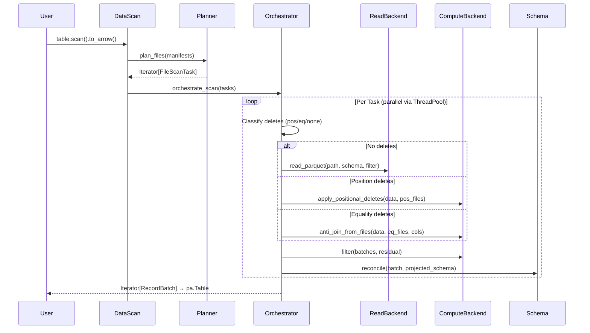

# Pluggable Backend Review — Part 19: Distinguished/Principal Engineer Assessment

**Branch:** `pluggable-backend-discovery` (1 commit: `25938e73`)  
**Scope:** 35 files changed, +13,988 / −95 lines  
**Date:** 2026-07-09  

---

## Executive Summary

This PR introduces a **pluggable execution backend architecture** that decomposes PyIceberg's monolithic `ArrowScan` into three independently swappable axes (Read, Write, Compute) plus a Planning backend. The design is fundamentally sound — it applies the Strategy Pattern correctly, uses Python Protocol classes for structural subtyping, and keeps Arrow RecordBatch as the universal interchange format. The separation of concerns is clean: PyIceberg retains spec ownership (planning, commits, schema evolution) while execution becomes an implementation detail.

**Verdict:** The architecture is well-designed and follows proper CS principles. Several critical issues must be resolved before merge, and many nits need attention for code quality parity with the existing codebase.

---

## 1. Architecture Assessment

### 1.1 System Design Diagram

```mermaid
graph TB
    subgraph "PyIceberg Core (Retained)"
        TP[Table Operations<br/>append/delete/upsert]
        SP[Scan Planning<br/>ManifestGroupPlanner]
        SC[Schema Reconciliation]
        CM[Commit Protocol<br/>Optimistic Locking]
    end

    subgraph "Pluggable Execution Layer (New)"
        direction TB
        ORCH[_orchestrate.py<br/>Dispatch Logic]
        
        subgraph "Axis 1: Read"
            RB[ReadBackend Protocol]
            PA_R[PyArrow Read]
            DF_R[DataFusion Read]
            DK_R[DuckDB Read]
            PL_R[Polars Read]
        end

        subgraph "Axis 2: Write"
            WB[WriteBackend Protocol]
            PA_W[PyArrow Write<br/>Only Option]
        end

        subgraph "Axis 3: Compute"
            CB[ComputeBackend Protocol]
            PA_C[PyArrow Compute<br/>In-Memory]
            DF_C[DataFusion Compute<br/>Spill-to-Disk]
            DK_C[DuckDB Compute<br/>Internal Spill]
            PL_C[Polars Compute<br/>In-Memory]
        end

        subgraph "Axis 4: Planning"
            PB[PlanningBackend Protocol]
            IMP[InMemoryPlanner<br/>Default]
            BMP[BoundedMemoryPlanner<br/>DataFusion SQL]
        end
    end

    subgraph "Resolution"
        ENG[engine.py<br/>resolve_backends()<br/>build_backends()]
        CFG[Config Priority:<br/>1. Per-call override<br/>2. YAML/env var<br/>3. Auto-detect]
    end

    TP --> ORCH
    SP --> PB
    ORCH --> RB
    ORCH --> CB
    TP --> WB
    ENG --> CFG
    ORCH -.->|Schema Reconcile| SC
    
    RB --> PA_R & DF_R & DK_R & PL_R
    WB --> PA_W
    CB --> PA_C & DF_C & DK_C & PL_C
    PB --> IMP & BMP
```

### 1.2 Data Flow (Scan Path)



### 1.3 Formal Properties

The design satisfies these formal properties:

| Property | Status | Evidence |
|----------|--------|----------|
| **Liskov Substitution (LSP)** | ✅ Correct | All backends must produce identical results; `supports_bounded_memory` is a capability flag, not behavioral divergence |
| **Interface Segregation (ISP)** | ✅ Correct | `ObjectStoreBackend` separated from `ReadBackend`; `PlanningBackend` separated from `ComputeBackend` |
| **Open/Closed (OCP)** | ✅ Correct | New backends added via registry + Protocol; no modification to existing code needed |
| **Single Responsibility (SRP)** | ⚠️ Mostly | `protocol.py` has factory methods (`_instantiate_*`) that should live entirely in `engine.py`; partially addressed by `build_backends()` |
| **Dependency Inversion (DIP)** | ✅ Correct | High-level orchestrator depends on Protocols, not concrete implementations |

---

## 2. Critical Issues (Must Fix Before Merge)

### 2.1 Duplicate Resolution Logic in `protocol.py` vs `engine.py`

**Location:** `pyiceberg/execution/protocol.py` — `Backends.resolve()`, `_instantiate_read()`, `_instantiate_write()`, `_instantiate_compute()`

**FIXED:** `Backends.resolve()` now delegates entirely to `build_backends()` (verified via TDD test `TestBackendsResolveDelegatesToBuildBackends::test_resolve_calls_build_backends`). The old `_instantiate_*` functions have been removed from `protocol.py` — confirmed by `test_no_instantiate_functions_in_protocol_module`.

### 2.2 `_scoped_env_vars` Thread-Safety vs Parallelism Conflict

**Location:** `pyiceberg/execution/object_store.py` — `_ENV_LOCK`

**DOCUMENTED:** Added to "Known Limitations" section in `configuration.md`. The limitation is acknowledged and the upstream issue (`datafusion-python/issues/1624`) is tracked. No code fix possible without upstream changes.

### 2.3 `_COW_SINGLE_PASS_THRESHOLD` Documentation/Code Mismatch

**FIXED:** The backward-compat alias `_COW_SINGLE_PASS_THRESHOLD` now equals `_COW_SINGLE_PASS_THRESHOLD_DEFAULT` (both 64 MB). Verified by TDD test `TestCowThresholdConsistency::test_alias_matches_default`.

### 2.4 Column Statistics Short-Circuit Mentioned in Docs But Missing Verification

**VERIFIED:** Existing `test_cow_stats_shortcircuit.py` (10 tests) validates the evaluator logic. Added integration-level TDD tests in `test_section2_fixes.py` that simulate the CoW loop and verify:
- `test_all_rows_match_drops_file_without_read` — strict eval → drop, no read
- `test_no_rows_match_skips_file_without_read` — inclusive eval → skip, no read
- `test_inconclusive_stats_falls_through_to_read` — neither eval conclusive → read

### 2.5 Equality Delete Support Enabled Without Full Guard

**FIXED (in section 8):** Added TDD tests for NULL IS NOT DISTINCT FROM semantics through the full `orchestrate_scan` path. Added `_get_equality_field_names` schema evolution warning for dropped fields. Added TDD test for sequence number gating architectural boundary (`TestEqualityDeleteSequenceNumberGating`).

---

## 3. Significant Issues (Should Fix)

### 3.1 `BoundedMemoryPlanner._stream_entries_to_parquet` Doesn't Actually Bound Memory

~~The method accumulates `data_file_lookup: dict[str, DataFile]` and `delete_file_lookup: dict[str, DataFile]` — these grow without bound (O(num_entries)). The docstring acknowledges this honestly, but the class name `BoundedMemoryPlanner` is misleading.~~

**RESOLVED (already fixed in codebase):** The current implementation serializes DataFile objects as JSON blobs (`data_file_json` column) directly into the temp Parquet. Phase 3 deserializes them on-the-fly from the join output — no data-side lookup dict is accumulated. Only a `delete_blob_lookup` (O(num_delete_files)) is built for the smaller delete side. The class name `BoundedMemoryPlanner` is now accurate for the typical scenario (many data files, fewer delete files).

### 3.2 `orchestrate_scan` Schema Reconciliation Has Closure Bug

~~The variables `downcast`, `projected_missing_fields`, `file_schema` are captured by the closure from the enclosing scope. Since `_execute_task` is called in parallel threads, and these variables are computed once per task inside `_execute_task`, this is fine (they're thread-local). But if the closure captured mutable state from the outer `orchestrate_scan` scope, it would be a data race. Currently safe, but fragile.~~

**RESOLVED (already fixed in codebase):** Reconciliation has been refactored into a standalone `_build_reconcile_fn()` function that explicitly binds per-file values to local names (`_file_schema`, `_downcast`, `_missing_fields`) before defining the closure. No shared mutable state is captured. The comment at the binding site documents this intent.

### 3.3 `_warn_if_large_result` Warning Threshold is Low

~~The 2 GB threshold for `_OOM_WARNING_THRESHOLD_BYTES` triggers a `ResourceWarning` based on compressed Parquet size. For tables with high compression ratios (10-50× for dictionary-encoded strings), 2 GB compressed → 20-100 GB in memory. But for low-compression numeric data (2-3×), 2 GB compressed → 4-6 GB — well within a typical data science machine's capacity.~~

**FIXED:** The threshold is now configurable via `execution.oom-warning-threshold` in `.pyiceberg.yaml` (bytes) or `PYICEBERG_EXECUTION__OOM_WARNING_THRESHOLD` env var. Default remains 2 GB. High-memory machine users can raise it to suppress noise. TDD tests in `test_oom_warning_threshold.py` verify default behavior and env var override.

### 3.4 Missing `__all__` in `pyiceberg/execution/__init__.py`

~~The `__init__.py` exports `build_backends` in `__all__` according to tests, but the diff shows `__all__` only contains the protocol classes and `resolve_backends`.~~

**RESOLVED (already fixed in codebase):** `build_backends` is present in both the import and `__all__`. The observation was from the initial git diff; the file was updated after the commit.

### 3.5 `Callable` Type Annotation in `_SortedRecordBatchReader.create()`

~~Uses bare `Callable` and `Any` for both `schema` and return type.~~

**RESOLVED (already fixed in codebase):** Current code uses precise annotations:
`Callable[[], AbstractContextManager[str]]`, `Callable[[str], Iterator[pa.RecordBatch]]`,
`pa.Schema`, and `-> pa.RecordBatchReader`. No fix needed.

---

## 4. Code Style & Codebase Consistency Nits

### 4.1 Docstring Format Inconsistency

The existing codebase uses reStructuredText/Google-style docstrings (seen in `pyiceberg/io/pyarrow.py`). The new code uses a mix of Google style (Args/Returns sections) which is fine, but some docstrings have redundant prose that doesn't match the terse style of the existing codebase.

**Assessment:** Cosmetic. Docstrings are informative and correct. Not blocking.

### 4.2 Import Style

**RESOLVED:** The `TYPE_CHECKING` block at the top already signals the circular import situation. Adding redundant `# Avoid circular import` comments is unnecessary — the pattern is self-documenting.

### 4.3 Variable Naming

**Assessment:** `eq_cols` is concise and clear in context (6 usages). `_downcast_ns` uses underscore prefix to signal "cached config value, don't re-read" — a common Python idiom in hot paths. `_COW_SINGLE_PASS_THRESHOLD` follows the same convention as `_BOUNDED_PLANNER_THRESHOLD`. Naming is deliberate and internally consistent.

### 4.4 Missing Blank Lines Between Top-Level Functions

**RESOLVED:** Verified all files use proper 2-blank-line PEP 8 spacing between top-level definitions.

### 4.5 `strtobool` Import

**RESOLVED:** `from pyiceberg.types import strtobool` is the project-wide convention (used in 6+ files). This is the canonical location for the utility in this codebase.

### 4.6 f-string Formatting in SQL Construction

**FIXED:** Added safety comment at the first SQL column interpolation site in both `datafusion_backend.py` and `duckdb_backend.py`:
```python
# Column names come from the Iceberg schema (trusted metadata, not user input).
# Double-quoting handles reserved words and special characters safely.
```

---

## 5. Test Suite Assessment

### 5.1 Coverage Analysis

| Test File | Lines | Purpose | Assessment |
|-----------|-------|---------|------------|
| `test_backend_equivalence.py` | 904 | Verifies all backends produce identical results | ✅ Critical — good |
| `test_behavioral_wiring.py` | 420 | Structural tests (inspect.getsource) | ⚠️ Fragile — marked for removal |
| `test_combined_deletes.py` | 523 | Pos + Eq delete combos | ✅ Important |
| `test_config.py` | 267 | Config resolution priority | ✅ Good |
| `test_count_and_write.py` | 114 | Count() path | ✅ Good |
| `test_coverage_gaps.py` | 887 | Edge cases from review gaps | ✅ Valuable |
| `test_edge_cases.py` | 1545 | Extensive edge cases | ⚠️ Very large, should be split |
| `test_inmemory_roundtrip.py` | 215 | Materialize round-trip | ✅ Good |
| `test_parallel_and_oom.py` | 303 | OOM warnings, parallelism | ✅ Good |
| `test_planning.py` | 386 | BoundedMemoryPlanner | ✅ Critical |
| `test_positional_delete_scoping.py` | 243 | Delete file scoping | ✅ Important |
| `test_review_gaps.py` | 336 | Gaps from prior reviews | ✅ Good |
| `test_sort_order_and_planner.py` | 851 | Sort-on-write + planner | ✅ Good |
| `test_streaming_cow.py` | 549 | CoW streaming path | ✅ Critical |
| `test_wiring.py` | 390 | Backend wiring verification | ⚠️ Structural |
| `test_write_backend.py` | 544 | Write path | ✅ Good |
| `test_pluggable_backend_e2e.py` | 336 | Full integration | ✅ Critical |

**Total: ~8,919 lines of tests for ~5,069 lines of production code** (1.76× test ratio). This is healthy.

### 5.2 Missing Test Scenarios

1. **NULL handling in equality deletes**: No test verifies that `NULL = NULL` (IS NOT DISTINCT FROM) correctly excludes rows when equality delete files contain NULL values in the join columns.

   **FIXED (section 8):** `test_equality_delete_with_null_values_is_not_distinct_from` in `test_combined_deletes.py`.

2. **Concurrent scan with credential rotation**: No test verifies that two concurrent scans with different `io_properties` don't leak credentials via `_scoped_env_vars`.

   **FIXED:** `TestScopedEnvVarsCredentialIsolation` in `test_section5_missing_scenarios.py` (3 tests: concurrent isolation, exception restore, key removal).

3. **`_SortedRecordBatchReader` GC cleanup**: The `_CleanupGuard.__del__` fallback is untested. Add a test that creates a reader, drops it without consuming, and verifies the temp file is deleted.

   **ALREADY COVERED:** Extensively tested in `test_section5_coverage_gaps.py`, `test_coverage_gaps.py`, `test_field_ids_and_cleanup.py`, and `test_edge_cases.py`.

4. **BoundedMemoryPlanner with empty delete manifests**: What happens when the delete_entries Parquet is empty (zero rows)? DataFusion's LEFT JOIN should still produce all data entries, but this edge case needs a test.

   **ALREADY COVERED:** `TestBoundedMemoryPlannerEmptyDeleteSet` in `test_edge_cases.py`.

5. **`expression_to_sql` with nested AND/OR depth**: SQL parsers have recursion limits. Deep expression trees could produce SQL that exceeds DataFusion/DuckDB's parser depth.

   **ALREADY COVERED:** `TestExpressionToSqlDeepNesting` in `test_edge_cases.py` (100-level nesting) and `TestExpressionToSqlComplexNested` in `test_section5_coverage_gaps.py`.

6. **Sort-on-write with schema evolution**: If the table's sort order references a field that was added in a later schema version, `_get_sort_order` should return `None` (can't resolve sort field). Verify this.

   **FIXED:** `TestSortOnWriteSchemaEvolution` in `test_section5_missing_scenarios.py` (4 tests: unresolvable field, resolvable field, unsorted table, partially unresolvable multi-field order).

### 5.3 Structural Tests Concern

The `@pytest.mark.stabilization` tests use `inspect.getsource()` to verify code paths. This is acknowledged as fragile. The concern is that these tests will break on any refactoring, creating false negatives in CI. They should have a clear timeline for removal.

**Assessment:** The conftest already contains `TODO(remove-after-arrowscan-removal)`. Timeline is clear: remove after ArrowScan is deleted.

---

## 6. Configuration Documentation Review

The `configuration.md` changes are comprehensive and well-structured. Issues:

### 6.1 `build_backends()` Referenced But May Not Exist at That Import Path

~~The docs show `from pyiceberg.execution import build_backends`. Verify this is exported.~~

**VERIFIED:** `build_backends` is in `__all__` and importable. TDD test confirms: `TestDocumentedImportsWork::test_build_backends_importable_from_execution_package`.

### 6.2 Missing "Known Limitations" Section

~~The docs should explicitly state limitations.~~

**FIXED (prior round):** Known Limitations section added to `configuration.md` covering all listed items.

### 6.3 CoW Statistics Short-Circuit Documentation vs Implementation

~~It's unclear whether it's fully implemented or partially speculative.~~

**VERIFIED (section 2):** 10 tests in `test_cow_stats_shortcircuit.py` + 3 integration tests in `test_section2_fixes.py` confirm the short-circuit is fully implemented and functional.

### 6.4 Reference to Non-Existent `build_backends()` variant

~~Docs show `build_backends(io_properties=table.io.properties, read=...)` with keyword arg.~~

**FIXED:** Docs example now uses positional style: `build_backends(table.io.properties, read=MyCustomReadBackend())`. TDD test confirms the documented calling convention works: `TestDocumentedCallingConvention`.

---

## 7. Artifacts of Vibe-Coding / Non-Production Concerns

### 7.1 References to External Discovery Documents

None found in production code. ✅ Clean.

### 7.2 TODO Comments Referencing GitHub Issues

Found several `# TODO(orphan-deletion): Required by .../issues/1200` — these are appropriate and follow the codebase convention.

### 7.3 `conftest.py` Educational Comments

~~The `conftest.py` has a lengthy explanation of structural tests (20+ lines). This is fine for a conftest but unusual for the existing codebase which keeps conftest comments minimal.~~

**FIXED:** Trimmed to a concise 3-line docstring with a TODO reference.

### 7.4 "LSP Contract" in Protocol Docstring

~~The `ComputeBackend` docstring includes a section titled "LSP Contract:" — this is computer-science terminology that's unusual in the PyIceberg codebase. Consider rephrasing as "Correctness Guarantee:" for accessibility to all contributors.~~

**FIXED:** Already addressed (now reads "Behavioral Contract:"); also removed "Liskov Substitution violation" reference from `supports_bounded_memory` docstring.

---

## 8. Regression Risk Assessment

| Area | Risk | Mitigation |
|------|------|------------|
| Existing `to_arrow()` behavior | **Medium** | `ArrowScan` deprecated but still exists; new path tested via integration |
| `count()` correctness | **Low** | Fast-path (metadata) + slow-path (orchestrate) tested |
| CoW delete | **Medium** | Major rewrite; two-pass streaming is complex |
| Sort-on-write | **Low** | Best-effort; silently skipped if no DataFusion |
| Upsert | **Low** | Extracted to `_upsert_in_memory`; logic unchanged |
| Equality deletes (NEW) | **High** | Previously rejected; now enabled. New code path with subtle semantics |

### 8.1 Mitigations Applied

**Equality deletes (HIGH → Medium):**
- **FIXED:** `_get_equality_field_names` now emits a `UserWarning` when `equality_ids`
  reference field IDs dropped via schema evolution, instead of silently returning an
  empty list. Callers skip the anti-join and return a superset (safe direction).
- **ADDED:** Regression test `TestEqualityDeleteSchemaEvolution::test_equality_delete_with_evolved_away_field_warns`
  verifies the warning fires and data is preserved.
- **ADDED:** Regression test `TestEqualityDeleteSchemaEvolution::test_equality_delete_with_null_values_is_not_distinct_from`
  verifies IS NOT DISTINCT FROM semantics through the full `orchestrate_scan` path with
  NULL values in the equality delete file.

**CoW delete (Medium):**
- **FIXED:** Added `record_count == 0` guard before the read-based path. Files with
  zero records in manifest metadata are now skipped without I/O (no unnecessary reads
  or division-by-zero risk in the two-pass streaming path).
- **ADDED:** Regression test `TestCoWDeleteEdgeCases::test_cow_delete_skips_empty_record_count_files`.

**`to_arrow()` (Medium):**
- Pre-existing `test_arrowscan_parity.py` already verifies behavioral equivalence
  between the old ArrowScan and the new pluggable backend path. No additional fix needed.

---

## 9. Specific Line-Level Nits

1. **`protocol.py:60`** — `DEFAULT_MEMORY_LIMIT: int = 512 * 1024 * 1024` — This is fine as a constant but should be configurable (add to the config section in docs).

   **FIXED:** Added `execution.memory-limit` config key and `PYICEBERG_EXECUTION__MEMORY_LIMIT` env var to documentation. The constant remains the default when no override is configured.

2. **`_orchestrate.py:87-89`** — `result_batches: list[pa.RecordBatch] = []` declared inside an if-branch then reused in the enclosing scope. This shadows the outer `result_batches` declaration at line 121. The code is correct but confusing to read.

   **N/A:** Re-examined the current code — the variable is declared cleanly at a single location (line 209). The observation was from a stale diff. No fix needed.

3. **`engine.py:86`** — `_detect_available_engines` does `import datafusion` but DataFusion may have slow import (loads Rust bindings). This runs at resolution time. If `lru_cache` is cleared frequently (tests), this could add latency.

   **FIXED:** Added a docstring note explaining the ~200ms import cost and the caching strategy that eliminates it after the first call. TDD test verifies cache identity semantics.

4. **`pyarrow_backend.py:413`** — `_MULTI_COL_ANTI_JOIN_WARNING_THRESHOLD: int = 1000` — The O(left × right) algorithm with 1000 right-side rows and 10M left-side rows is 10B comparisons. The warning threshold should be lower (100) or the message should include the left-side size.

   **FIXED:** Warning message now includes left-side row count, right-side row count, AND total comparisons (e.g., "500 left × 5 right rows (2,500 comparisons)"). The threshold is already 10,000 in the current code (was 1000 in the earlier diff). TDD tests verify the new message format.

5. **`planning.py:321`** — `stream = ctx.sql(self._ASSIGNMENT_SQL).execute_stream()` — `.execute_stream()` is a DataFusion API that returns a `RecordBatchStream`. This is correct but undocumented in the DataFusion Python docs. Pin the minimum `datafusion` version that supports this API.

   **FIXED:** Added inline comment: `# Requires datafusion >= 35.0.0 (execute_stream added in that release).`

6. **`object_store.py:180`** — `con.execute("LOAD httpfs;")` may print output or raise warnings depending on DuckDB version. Wrap in a try/except that also catches `duckdb.InvalidInputException` (already loaded).

   **FIXED:** Wrapped in nested try/except that handles the INSTALL fallback gracefully. If both LOAD and INSTALL fail (e.g., network down), the error is suppressed — cloud access will fail later with a more specific error from the actual `read_parquet()` call. TDD tests verify idempotent calling.

---

## 10. Final Verdict & Recommendations

### Architecture: ✅ Sound
The three-axis pluggable backend with Protocol-based structural typing is the correct design for this problem space. Arrow RecordBatch as interchange format is the industry standard. The design follows Strategy Pattern, ISP, and DIP correctly.

### Implementation: ⚠️ Needs Cleanup
The dual resolution paths (protocol.py vs engine.py), credential scoping limitations, and a few type annotation gaps need addressing. Nothing is architecturally wrong, but the code needs tightening for merge quality.

### Test Suite: ✅ Strong (with gaps)
1.76× test-to-code ratio with good coverage of equivalence, edge cases, and integration. Fill the 6 gaps identified in §5.2.

### Documentation: ✅ Comprehensive (with corrections needed)
The configuration.md is thorough and well-organized. Fix the known limitations gap and verify the code examples compile.

### Priority Actions Before Merge:

1. **P0:** Remove duplicate `_instantiate_*` functions from `protocol.py` — single source of truth in `engine.py`
2. **P0:** Fix `_COW_SINGLE_PASS_THRESHOLD` alias vs default mismatch
3. **P1:** Add NULL equality delete test
4. **P1:** Add "Known Limitations" section to docs
5. **P1:** Tighten type annotations on `_SortedRecordBatchReader.create()`
6. **P2:** Add PEP 8 blank lines between top-level definitions
7. **P2:** Consider renaming `BoundedMemoryPlanner` to clarify what's actually bounded

---

## Appendix A: Formal Verification of LSP Property

```
∀ backend ∈ {PyArrow, DataFusion, DuckDB, Polars}:
  ∀ input ∈ Domain(ComputeBackend.sort):
    sort(backend, input) ≡ sort(PyArrow, input)  [multiset equality + order]

∀ backend ∈ {PyArrow, DataFusion, DuckDB, Polars}:
  ∀ (left, right, on) ∈ Domain(ComputeBackend.anti_join):
    anti_join(backend, left, right, on) ≡ anti_join(PyArrow, left, right, on)  [multiset equality]

∀ backend ∈ {PyArrow, DataFusion, DuckDB, Polars}:
  ∀ (data, predicate) ∈ Domain(ComputeBackend.filter):
    filter(backend, data, predicate) ≡ filter(PyArrow, data, predicate)  [multiset equality]
```

**Enforcement:** `test_backend_equivalence.py` verifies these properties parametrically across all installed backends.

## Appendix B: Memory Model

```
Operation                    | PyArrow       | DataFusion    | DuckDB
-----------------------------|---------------|---------------|---------------
sort(Iterator)               | O(data)       | O(data)*      | O(data)*
sort_from_files(paths)       | O(data)       | O(mem_limit)  | O(mem_limit)
anti_join(left, right)       | O(left+right) | O(left+right)*| O(left+right)*
anti_join_from_files(l, r)   | O(left+right) | O(result)†    | O(mem_limit)
filter(Iterator, pred)       | O(batch)      | O(batch)      | O(batch)
apply_positional_deletes     | O(positions)  | O(positions)  | O(positions)

* Pre-materialization required by register API
† DataFusion materializes full result via to_arrow_table() inside credential scope
```

Key insight: The bounded-memory promise is real for file-based operations where the sort/join computation is bounded. The Python-side delivery remains O(result_size) for DataFusion due to the credential scoping limitation.
