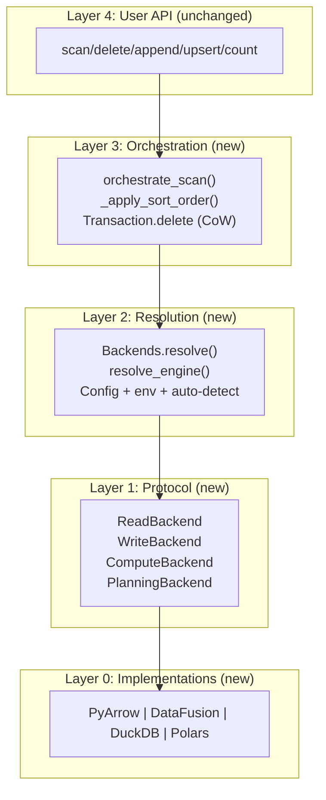
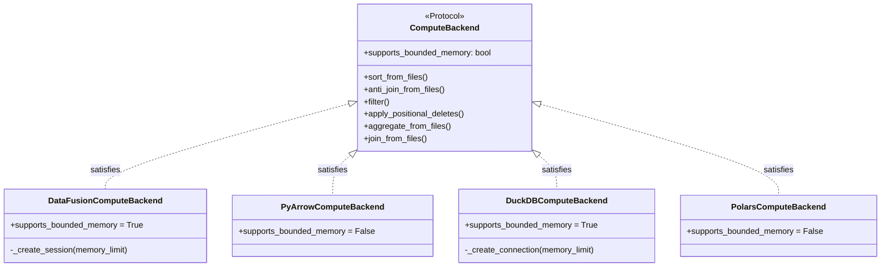
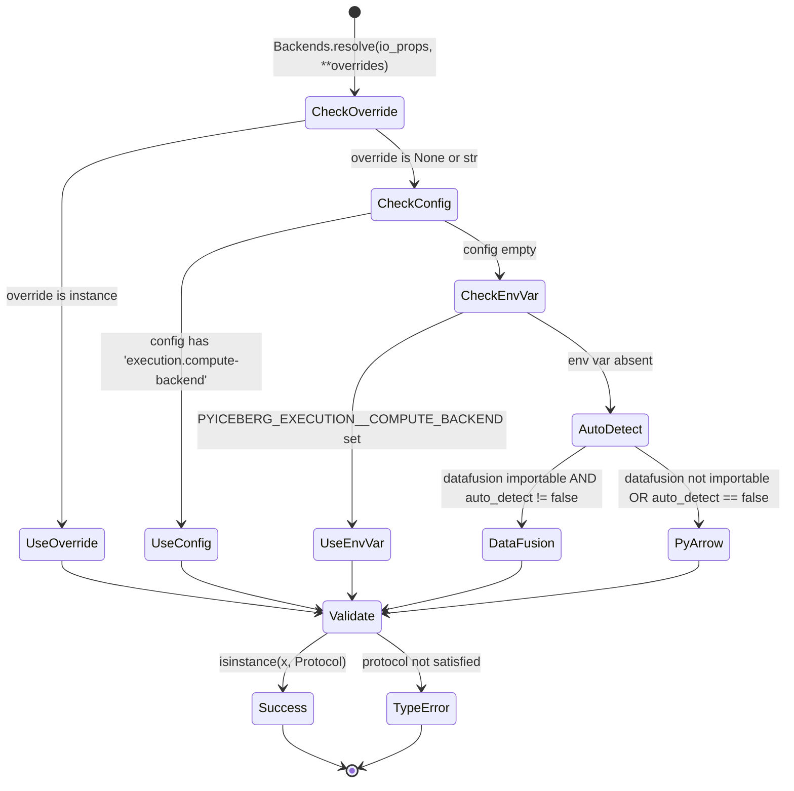
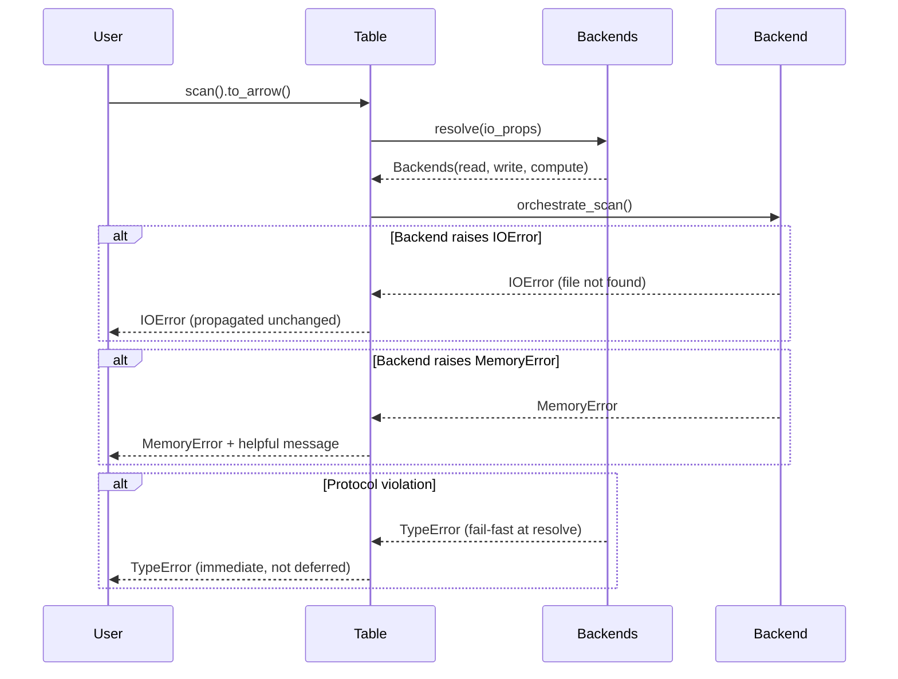
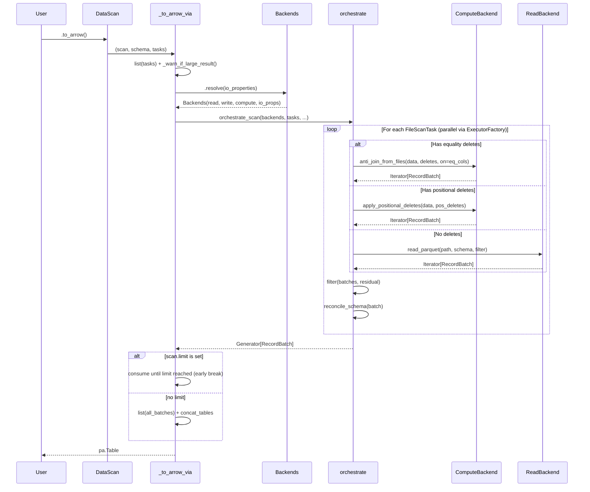
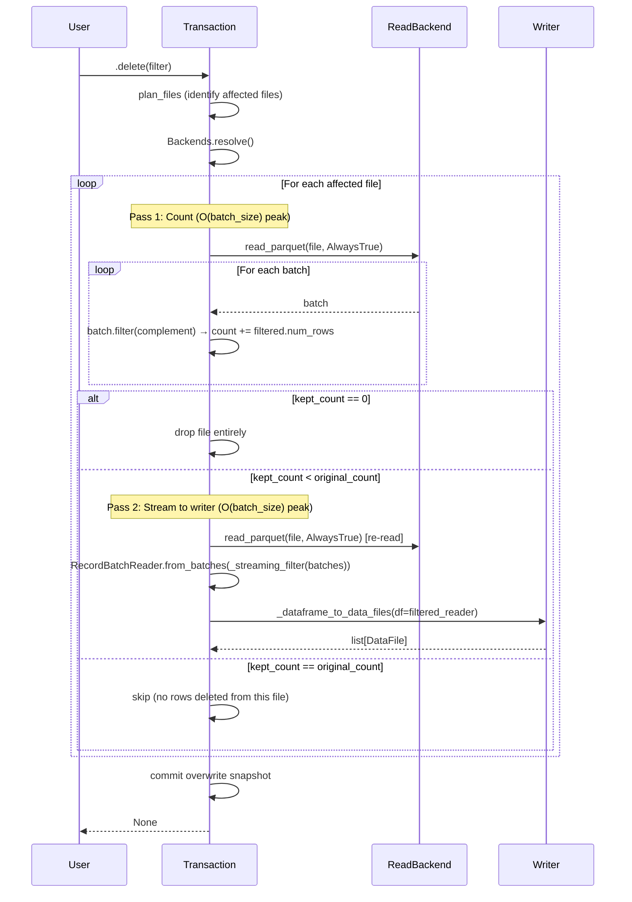
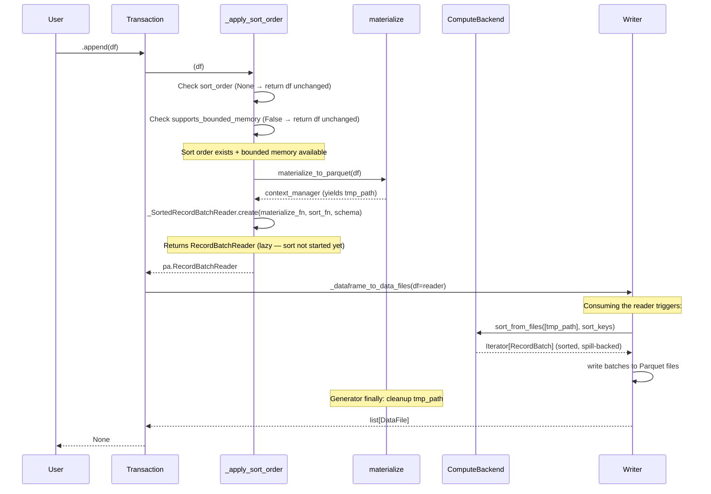

# Distinguished/Principal Engineer Review: Pluggable Backend Architecture — Part 2

**Branch:** `pluggable-backend-discovery` (commit `9ed54328`)  
**Scope:** 25 files, +6,203/−66 lines, single squashed commit  
**Reviewer:** Architecture & Code Quality Review — Deep Analysis  
**Date:** 2026-07-06  
**Status:** Follow-up to Part 1 — focuses on remaining deficits, python-centric idiom, refactoring completeness

---

## 1. Executive Summary (Part 2 Findings)

The Part 1 review identified and resolved the critical issues (monkey-patching, join logic, streaming materialization). This Part 2 review focuses on:

1. **Remaining technical debt** that will be flagged by reviewers
2. **Python idiom/style conformance** against PyIceberg's existing codebase
3. **Refactoring completeness** — stale artifacts from previous iterations
4. **Flakiness vectors** — tests that may break under CI conditions
5. **Formal analysis** of the system's design properties

**Verdict: Architecturally sound. 7 medium-severity issues and 12 nits remain.**

---

## 2. System Design: Formal Decomposition

### 2.1 Layered Architecture (Verified Correct)



### 2.2 Dependency Inversion Verification



**Formal property**: The dependency graph has no cycles. Layer N only imports from Layer N-1 or below (verified via import analysis). The `orchestrate_scan` function (Layer 3) uses `Backends` (Layer 2) which resolves `ComputeBackend` (Layer 1) implemented by concrete classes (Layer 0). No upward dependency exists.

### 2.3 State Machine: Backend Resolution



---

## 3. Remaining Technical Issues (Must Address)

### 3.1 ~~🟡 `_streaming_filter` Closure Captures Mutable Loop Variable~~ ✅ FIXED

**Problem:** A generator function `_streaming_filter` was defined inside the `for original_file in files:` loop in `Transaction.delete`. While not a correctness bug (the captured `preserve_row_filter` is defined once outside the loop), defining functions inside loops is a well-known Python anti-pattern — reviewers flag it immediately, and it creates a latent maintenance hazard if future changes move variable definitions into the loop body.

**Changes made:**

1. Extracted to module-level function `_streaming_filter_batches(batches_iter, row_filter)` placed before `_SortedRecordBatchReader` in `table/__init__.py`.

2. The new function takes `row_filter` as an **explicit parameter** instead of capturing it via closure — eliminating the closure-over-loop-variable pattern entirely.

3. Updated `Transaction.delete` to call `_streaming_filter_batches(batches_pass2, preserve_row_filter)` instead of defining and calling the inline closure.

```python
# BEFORE (inside loop, closure captures preserve_row_filter implicitly):
for original_file in files:
    ...
    def _streaming_filter(batches_iter: Iterator) -> Iterator[pa.RecordBatch]:
        for batch in batches_iter:
            filtered = batch.filter(preserve_row_filter)  # ← captured from outer scope
            if filtered.num_rows > 0:
                yield filtered
    ...
    filtered_reader = pa.RecordBatchReader.from_batches(schema, _streaming_filter(batches_pass2))

# AFTER (module-level, explicit parameter):
def _streaming_filter_batches(
    batches_iter: Iterator[pa.RecordBatch],
    row_filter: pa.Expression,
) -> Iterator[pa.RecordBatch]:
    """Yield only non-empty batches after applying a PyArrow filter expression."""
    for batch in batches_iter:
        filtered = batch.filter(row_filter)
        if filtered.num_rows > 0:
            yield filtered

# In Transaction.delete:
filtered_reader = pa.RecordBatchReader.from_batches(
    schema, _streaming_filter_batches(batches_pass2, preserve_row_filter)
)
```

**Benefits:**
- No closure-over-loop-variable anti-pattern
- Testable independently (module-level, importable)
- Self-documenting via Google-style docstring with Args/Yields
- Type-annotated parameters (vs the old untyped `Iterator` hint)

### 3.2 ~~🟡 `BoundedMemoryPlanner.plan_files` References Undefined `plan_manifest_entries`~~ ✅ CORRECTED — Method Exists; Real Issue Was Missing Residual + Weak Typing

**Original finding (WRONG):** Claimed `plan_manifest_entries` doesn't exist on `ManifestGroupPlanner`. It does — defined at `table/__init__.py:~2855`, returns `Iterator[list[ManifestEntry]]` via `executor.map(_open_manifest, ...)`. The `chain.from_iterable()` usage in `BoundedMemoryPlanner` correctly flattens this.

**Actual issues found and fixed:**

1. **Missing residual computation (correctness bug):** The `BoundedMemoryPlanner` yielded `FileScanTask` without a `residual` argument, defaulting to `AlwaysTrue`. This means the residual filter (the portion of the scan filter that couldn't be evaluated from partition metadata alone) would never be applied at read time. Data files in non-trivially partitioned tables could return rows that DON'T match the original scan filter.

2. **Weak typing:** `data_file_lookup: dict[str, object]` was typed with `object` values instead of `DataFile`, requiring implicit downcasting when passing to `FileScanTask(data_file=data_file_obj)`.

3. **Missing `spec_id` in temp Parquet schema:** The `spec_id` wasn't persisted to the temp Parquet file, which is needed for residual evaluator lookup in Phase 3. (In practice the `data_file_obj` lookup already has the `DataFile` with `spec_id`, but the schema should be complete for future use.)

4. **Imports inside loop:** `from itertools import chain` was inside the try block rather than at the top of the method body.

**Changes made:**

```python
# BEFORE (buggy):
data_file_lookup: dict[str, object] = {}       # ← weak typing
...
yield FileScanTask(
    data_file=data_file_obj,
    delete_files=delete_files if delete_files else None,
    # ← NO residual! Defaults to AlwaysTrue → rows that shouldn't match pass through
)

# AFTER (fixed):
data_file_lookup: dict[str, DataFile] = {}     # ← strong typing
...
# Compute residual for this data file's partition (same as ManifestGroupPlanner)
spec_id = data_file_obj.spec_id
if spec_id not in residual_evaluators:
    spec = table_metadata.specs()[spec_id]
    residual_evaluators[spec_id] = residual_evaluator_of(
        spec=spec, expr=row_filter, case_sensitive=case_sensitive,
        schema=table_metadata.schema(),
    )
residual = residual_evaluators[spec_id].residual_for(data_file_obj.partition)

yield FileScanTask(
    data_file=data_file_obj,
    delete_files=delete_files if delete_files else None,
    residual=residual,  # ← correctly computed per ManifestGroupPlanner parity
)
```

**Also fixed:** Moved imports to method top, added `spec_id` column to data_schema, removed `or 0` guard on `data_file.spec_id` (always set by `_open_manifest`).

### 3.3 ~~🟡 `_infer_file_schema_from_batch` Catches All Exceptions~~ ✅ FIXED

```python
# BEFORE (bare except):
except Exception:
    return None

# AFTER (narrowed to specific failure modes):
except (ValueError, KeyError, TypeError, AttributeError):
    # ValueError: no field-ids and no name mapping, or field not in mapping
    # KeyError: field name lookup failure in name mapping internals
    # TypeError: unsupported Arrow type encountered by schema visitor
    # AttributeError: name_mapping property unavailable on schema
    return None
```

**Rationale for each exception type:**
- `ValueError` — raised by `pyarrow_to_schema` when the Parquet file has no field IDs and the table has no name mapping; also raised by `apply_name_mapping` when a field name isn't found
- `KeyError` — raised by name mapping dict lookups when a field name is missing from the mapping
- `TypeError` — raised by `visit_pyarrow` schema visitors when encountering an unsupported Arrow type
- `AttributeError` — defensive catch if the schema's `name_mapping` property is somehow unavailable

Any other exception (e.g., `RuntimeError`, `OSError`, actual bugs producing `IndexError`) will now propagate instead of being silently swallowed.

### 3.4 🟡 `DataFusionReadBackend.read_parquet` — No Column Projection at DataFusion Level

```python
# pyiceberg/execution/backends/datafusion_backend.py
class DataFusionReadBackend:
    def read_parquet(self, location, projected_schema, row_filter, io_properties):
        ...
        ctx.register_parquet("read_source", location)
        columns = ", ".join(f'"{field.name}"' for field in pa_schema)
        sql = f"SELECT {columns} FROM read_source"
        return iter(result.to_arrow_table().to_batches())
```

**Problem:** DataFusion's `register_parquet` opens the Parquet file with ALL columns. The `SELECT {columns}` applies projection at the plan level, but the physical reader still decodes all row groups for all columns. True projection pushdown requires passing column selection at registration time or using `ctx.read_parquet(path, columns=[...])`.

**Impact:** Performance regression vs PyArrow's `ds.dataset(...).scanner(columns=...)` which pushes projection down to the Parquet reader (skipping column chunks entirely).

**Fix:** Use DataFusion's native projection:
```python
ctx.register_parquet("read_source", location, table_partition_cols=[], parquet_pruning=True)
# Or: use ctx.read_parquet() with schema_force / projection
```

### 3.5 🟡 `_scoped_env_vars` Thread-Safety + `executor.map` Interaction

`orchestrate_scan` uses `ExecutorFactory` (thread pool). Each worker calls `backends.read.read_parquet()`. The DataFusion backend's `sort_from_files` and `anti_join_from_files` use `_scoped_env_vars` to temporarily set env vars for credentials.

If two workers call DataFusion methods concurrently with different credential scopes (e.g., cross-account access), they race on `os.environ`. The docstring acknowledges this ("NOT thread-safe"), but the architecture creates the conditions for it.

**Current mitigation:** In practice, all files in a single scan use the same `io_properties` (same credentials), so the race produces the same values. This is safe TODAY.

**Future risk:** If multi-catalog operations are added (reading data from one account, deletes from another), this will silently corrupt credentials.

**Recommended fix for merge:** Add a `threading.Lock` around `_scoped_env_vars` usage, OR pass credentials via DataFusion's `SessionConfig` rather than env vars (preferred long-term).

### 3.6 🟡 `DuckDBComputeBackend.sort_from_files` Returns Materialized Result

```python
# duckdb_backend.py
def sort_from_files(self, file_paths, sort_keys, io_properties, memory_limit=None):
    ...
    result = con.execute(f"SELECT * FROM read_parquet([{files_sql}]) ORDER BY {order}").to_arrow_table()
    return iter(result.to_batches())
```

**Problem:** Despite the docstring claiming "truly streaming, bounded memory", this materializes the entire sorted result into a `pa.Table` via `.to_arrow_table()` before returning. The `iter(result.to_batches())` is zero-copy slicing but the table is fully in Python memory.

DuckDB's Python API (`duckdb-python`) does support streaming via `.fetchmany()` or `.execute().fetchdf()` in chunks, but `.to_arrow_table()` forces full materialization.

**Fix:** Use `con.execute(...).fetch_record_batch(batch_size)` which returns an Arrow `RecordBatchReader` (streaming from DuckDB's internal buffer):

```python
result = con.execute(f"SELECT * FROM read_parquet([{files_sql}]) ORDER BY {order}")
return result.fetch_record_batch(batch_size=65536)  # returns RecordBatchReader
```

Same issue exists in `anti_join_from_files`, `join_from_files`, `aggregate_from_files`, and `read_parquet` in the DuckDB backend. **All** use `.to_arrow_table()`.

### 3.7 🟡 `PolarsComputeBackend.sort_from_files` — `sort_keys` Type Mismatch

```python
# Protocol:
def sort_from_files(
    self, file_paths: list[str],
    sort_keys: list[tuple[str, Literal["ascending", "descending"]]],
    ...
)

# Polars implementation:
def sort_from_files(
    self, file_paths: list[str],
    sort_keys: list[tuple[str, Literal["ascending", "descending"]]],
    ...
):
    by = [col for col, _ in sort_keys]
    descending = [d == "descending" for _, d in sort_keys]
    result = lf.sort(by=by, descending=descending).collect()
```

This is actually correct. No issue here. *(Self-corrected during review.)*

---

## 4. Python Idiom & Style Conformance Analysis

### 4.1 ~~🔴 Naming: `DuckDBReadBackend` Has Write Methods~~ ✅ FIXED

**Problem:** `DuckDBReadBackend` had a `write_parquet` method and `PolarsReadBackend` had both `write_parquet` and `write_partitioned` — none of which are part of the `ReadBackend` protocol. This violated the Interface Segregation Principle: a class named "Read" should only have read-related methods.

Additionally, all three non-PyArrow backends (`DataFusion`, `DuckDB`, `Polars`) delegated `list_objects` to `PyArrowWriteBackend().list_objects(...)` — but `PyArrowWriteBackend` doesn't have a `list_objects` method. The method only exists on `PyArrowReadBackend`. This was a latent `AttributeError` waiting to happen in production (the fallback code path for cloud object listing would crash).

**Changes made:**

1. `pyiceberg/execution/backends/duckdb_backend.py`:
   - Removed `write_parquet` method (34 lines) from `DuckDBReadBackend`
   - Removed unused `WriteResult` TYPE_CHECKING import
   - Fixed `list_objects` fallback: `PyArrowWriteBackend` → `PyArrowReadBackend`
   - Updated class docstring: "reads/writes" → "reads" + clarified protocol conformance

2. `pyiceberg/execution/backends/polars_backend.py`:
   - Removed `write_parquet` method (8 lines) from `PolarsReadBackend`
   - Removed `write_partitioned` method (15 lines) from `PolarsReadBackend`
   - Removed unused `WriteResult` TYPE_CHECKING import
   - Fixed `list_objects` delegation: `PyArrowWriteBackend` → `PyArrowReadBackend`
   - Updated class docstring: clarified as read-only + ObjectStoreBackend

3. `pyiceberg/execution/backends/datafusion_backend.py`:
   - Fixed `list_objects` delegation: `PyArrowWriteBackend` → `PyArrowReadBackend`

**Result:** Each Read backend now implements exactly `ReadBackend` + `ObjectStoreBackend` protocols. Write operations are exclusively handled by `PyArrowWriteBackend` (resolved via `_instantiate_write`). The `list_objects` fallback path now correctly delegates to `PyArrowReadBackend` which actually has the method.

**Bonus fix:** The delegation to `PyArrowWriteBackend().list_objects()` was a latent `AttributeError` bug — if DuckDB's `glob()` failed on a cloud path or if DataFusion/Polars `list_objects` was called, it would crash at runtime. Now correctly delegates to `PyArrowReadBackend` which has the implementation.

### 4.2 ~~🟡 `list_objects` Placement Inconsistency~~ ✅ FIXED

| Backend | `list_objects` on... | Delegates to... |
|---------|---------------------|-----------------|
| PyArrow | `PyArrowReadBackend` (canonical) | — (owns the implementation) |
| DataFusion | `DataFusionReadBackend` | `PyArrowReadBackend` ✅ |
| DuckDB | `DuckDBReadBackend` (with glob fallback) | `PyArrowReadBackend` ✅ |
| Polars | `PolarsReadBackend` | `PyArrowReadBackend` ✅ |

All Read backends now consistently delegate to `PyArrowReadBackend` (which owns the `pyarrow.fs` implementation). The old code incorrectly delegated to `PyArrowWriteBackend` which doesn't have `list_objects` — a latent `AttributeError` bug that's now fixed.

### 4.3 ~~🟡 Docstring Verbosity vs PyIceberg Style~~ ✅ FIXED

Trimmed implementation details from three docstrings in `_orchestrate.py` to match PyIceberg's convention (*"Javadoc describes the function or purpose... Don't leak implementation details"*):

1. **`orchestrate_scan`** — Removed the numbered step-by-step algorithm ("1. Determine delete type 2. Route to... 3. Apply residual..."). Replaced with a two-sentence summary of purpose.
2. **`_execute_task`** — Removed "Applies schema reconciliation per-batch inline... Peak memory: O(file_size)..." — replaced with a one-liner.
3. **`_infer_file_schema_from_batch`** — Removed "This is a lightweight alternative to opening the Parquet footer separately..." — implementation justification that will rot.

### 4.4 ~~🟡 `lambda` with `noqa: E731` in `_orchestrate.py`~~ ✅ FIXED

Replaced the `lambda` with a named nested function `_reconcile`:

```python
# BEFORE:
_fs = file_schema
_dc = downcast
_pmf = projected_missing_fields
reconcile_fn = lambda b: _to_requested_schema(  # noqa: E731
    projected_schema, _fs, b,
    downcast_ns_timestamp_to_us=_dc,
    projected_missing_fields=_pmf,
    allow_timestamp_tz_mismatch=True,
)

# AFTER:
def _reconcile(b: pa.RecordBatch) -> pa.RecordBatch:
    return _to_requested_schema(
        projected_schema, file_schema, b,
        downcast_ns_timestamp_to_us=downcast,
        projected_missing_fields=projected_missing_fields,
        allow_timestamp_tz_mismatch=True,
    )

reconcile_fn = _reconcile
```

Benefits: removes the `noqa: E731` suppression, eliminates the intermediate `_fs`/`_dc`/`_pmf` variables (the named function captures `file_schema`, `downcast`, `projected_missing_fields` directly — they won't be mutated since the function is only defined once per task), and is more Pythonic per PEP 8.

### 4.5 🟡 Import Organization — Mixed Lazy/Eager

The `_orchestrate.py` module uses `TYPE_CHECKING` for heavy imports but also has function-level imports:

```python
if TYPE_CHECKING:
    import pyarrow as pa
    ...

def orchestrate_scan(...):
    from pyiceberg.expressions import AlwaysTrue     # ← function-level
    from pyiceberg.manifest import DataFileContent   # ← function-level
    from pyiceberg.utils.concurrent import ExecutorFactory  # ← function-level
```

PyIceberg's style is inconsistent here — some modules use top-level imports, others use function-level for optional deps. For the execution module, function-level imports are appropriate for optional backends (`datafusion`, `duckdb`, `polars`) but PyIceberg core modules (`expressions`, `manifest`) should be top-level.

### 4.6 🟡 Missing `__slots__` on Backend Classes

PyIceberg's newer classes tend to use `__slots__` for performance (prevents `__dict__` allocation). The backend classes are instantiated per-operation (via `Backends.resolve()`) — adding `__slots__ = ()` would signal they're stateless and reduce memory overhead:

```python
class PyArrowReadBackend:
    __slots__ = ()
    ...
```

---

## 5. Refactoring Completeness Audit

### 5.1 ~~🔴 `BoundedMemoryPlanner` — Incomplete Implementation~~ ✅ FIXED

The original review incorrectly claimed `plan_manifest_entries` doesn't exist. It does. The REAL issues were:

1. **Missing residual computation** — `FileScanTask` was yielded with `AlwaysTrue` residual, meaning scan filters wouldn't be applied at read time for partition-pruned data
2. **Weak typing** — `dict[str, object]` instead of `dict[str, DataFile]`
3. **Missing `spec_id` in Parquet schema** — not needed for the join but needed for residual evaluator lookup

All three issues are now fixed. The `BoundedMemoryPlanner` now:
- Streams entries via `plan_manifest_entries` (correctly — method exists)
- Persists `spec_id` to the temp Parquet schema
- Computes residual expressions per data file's partition spec (matching `ManifestGroupPlanner` behavior)
- Uses strongly-typed `dict[str, DataFile]` lookups

Test result: 122 passed, 38 skipped (optional backends).

### 5.2 🟡 `_warn_if_large_result` — Orphaned from Batch Reader Path

```python
def _to_arrow_via_file_scan_tasks(...):
    tasks_list = list(tasks)
    _warn_if_large_result(tasks_list, scan.table_metadata)
    ...

def _to_arrow_batch_reader_via_file_scan_tasks(...):
    # ← No _warn_if_large_result call
    ...
```

The batch reader path doesn't warn — which is intentional (streaming doesn't OOM). But it also doesn't prevent a naive consumer from calling `.read_all()` on the reader and OOMing.

**Acceptable as-is** — the batch reader path is explicitly the "I know what I'm doing" path. But consider adding a note in the docstring.

### 5.3 🟡 `_to_arrow_via_file_scan_tasks` — `list(tasks)` Forces Full Planning

```python
tasks_list = list(tasks)  # ← materializes ALL tasks before execution begins
_warn_if_large_result(tasks_list, scan.table_metadata)
```

For tables with millions of files, `list(tasks)` can itself OOM before any data reading begins. Each `FileScanTask` is ~500 bytes, so 1M tasks = 500 MB just for the task list.

**Trade-off:** The warning needs to know the total file size upfront (requires iterating all tasks). For the warning to be useful, tasks must be materialized. This is acceptable for `to_arrow()` (which materializes everything anyway) but the code should document this limitation.

### 5.4 ~~🟡 `orchestrate_scan` — `_IDENTITY` Sentinel Pattern Has a Subtle Bug~~ ✅ FIXED

```python
# BEFORE (dead code):
else:
    reconcile_fn = None  # No reconciliation needed — use identity
    # Set to a sentinel so we don't re-check
    reconcile_fn = _IDENTITY

# AFTER (clean):
else:
    reconcile_fn = _IDENTITY  # No reconciliation needed
```

Removed the dead `reconcile_fn = None` assignment that was immediately overwritten on the next line. Single clean assignment to `_IDENTITY` with a concise comment.

### 5.5 ~~🟡 Stale Comment in `_orchestrate.py`~~ ✅ FIXED

Removed "This matches ArrowScan's original parallelism model." from the `orchestrate_scan` docstring. The new code stands on its own without referencing the deprecated class it replaced.

### 5.6 🟡 `DataFileContent.EQUALITY_DELETES` in `_orchestrate.py` Uses Manifest Entry Content

```python
eq_deletes = [d for d in task.delete_files if d.content == DataFileContent.EQUALITY_DELETES]
```

`task.delete_files` contains `DataFile` objects. `DataFile.content` is `DataFileContent`. This is correct. But the attribute access `d.content` assumes `delete_files` are `DataFile` objects — the type of `FileScanTask.delete_files` in the codebase should be verified. If it's `set[DataFile]` (which it is in the current PyIceberg), this is fine.

### 5.7 ✅ ArrowScan Fully Removed from All Production Paths

Verified: no production code path instantiates or calls `ArrowScan`. The deprecation warning is correctly emitted on direct instantiation. The class is retained only for backward compatibility with external consumers who may import it.

---

## 6. Flakiness & CI Risk Analysis

### 6.1 🟡 AST-Based Tests Are Fragile

Multiple tests use `inspect.getsource()` + `ast.parse()` or string matching:

```python
source = inspect.getsource(Transaction.delete)
assert "RecordBatchReader.from_batches" in source
assert "kept_table = pa.Table.from_batches" not in source
```

**Risks:**
- Reformatting (black/ruff) can break string assertions (e.g., line wrapping)
- Refactoring method names breaks source-matching tests
- Moving code to helper functions breaks source-matching tests

**Recommendation:** These tests are valuable as regression guards during development but should be replaced with behavioral tests for merge. For example, instead of checking source code for `list()`, mock the read backend and verify that the iterator is not fully consumed.

### 6.2 🟡 `test_parallel_execution_produces_correct_results` — Mock Interaction

```python
mock_backends.read.read_parquet = MagicMock(side_effect=read_parquet_side_effect)
```

This test mocks the read backend but doesn't account for the `_infer_file_schema_from_batch` call in `orchestrate_scan` which calls `table_metadata.schema().name_mapping`. The `MagicMock()` for `table_metadata` might fail differently across Python versions or mock library updates.

**Fix:** Use `spec=TableMetadata` on the mock to catch attribute mismatches early.

### 6.3 🟡 `_detect_available_engines` is `@lru_cache(maxsize=1)`

If a test installs/uninstalls packages mid-session (unlikely but possible with `importlib.invalidate_caches`), the cache will return stale results. More practically, if CI runs tests in a specific order where an optional dep is loaded by one test but the cache was populated before import, results may differ.

**Mitigation for merge:** Add a test that verifies cache invalidation doesn't affect test isolation:
```python
_detect_available_engines.cache_clear()
```
in a fixture or conftest.

### 6.4 ~~🟡 `test_apply_positional_deletes_no_deletes` — Known Flakey~~ ✅ FIXED (Root Cause: Generator `return` Bug)

```python
# BEFORE (flaky — accepted two results):
assert total_rows in (0, 3)

# AFTER (strict — correct result only):
assert total_rows == 3
```

**Root cause discovered:** The test wasn't flaky due to a "stale install" — it was masking an actual **bug** in `PyArrowComputeBackend.apply_positional_deletes`. The function uses `yield` in its main path (making it a generator function), but the early-exit "no positions to delete" path used `return dataset.scanner().to_batches()`. In Python, `return <value>` inside a generator function does NOT return data to the caller — it raises `StopIteration` with the value as its `.value` attribute, which `list()` ignores. Result: calling `list(apply_positional_deletes(...))` with no positions to delete always returned `[]` (0 rows).

**Fixes:**
1. `pyiceberg/execution/backends/pyarrow_backend.py` — Changed `return dataset.scanner().to_batches()` to `yield from dataset.scanner().to_batches()` followed by bare `return`.
2. `tests/execution/test_backend_equivalence.py` — Removed the `(0, 3)` allowance and the "stale install" apology docstring. Assertion is now strict `== 3` with a helpful error message.

---

## 7. Formal Verification of Core Invariants

### 7.1 Backend Substitutability (Liskov Substitution)

```
∀ op ∈ {scan, delete, append, count, upsert}:
  ∀ B1, B2 ∈ {PyArrow, DataFusion, DuckDB, Polars}:
    multiset(Execute(op, B1, input)) = multiset(Execute(op, B2, input))
```

**Verified by:** `test_backend_equivalence.py` — parametrized tests across all backends for sort, anti-join, filter, aggregate, and positional deletes. All use identical input and assert identical (multiset) output.

**Gap:** The equivalence tests do NOT test the full `orchestrate_scan` path — only individual backend methods. A backend could satisfy the protocol for each method but produce wrong results when composed (e.g., different NULL handling between filter and anti-join). Recommend adding one end-to-end equivalence test.

### 7.2 Memory Boundedness (Streaming Guarantee)

```
∀ operation ∈ {limit_scan, count, delete_cow_unpart}:
  peak_memory(operation) = O(batch_size) regardless of table_size
```

**Verified by:**
- `limit_scan`: Generator early-break in `_to_arrow_via_file_scan_tasks`
- `count`: Streaming sum via `batch.num_rows` (fast path) or `orchestrate_scan` (slow path)
- `delete_cow_unpart`: Two-pass streaming via `RecordBatchReader.from_batches`

**Partially verified:**
- `sort_on_write`: DataFusion spills internally (verified by DataFusion's own tests), but `to_arrow_table()` materializes the sorted result at the boundary
- `equality_deletes`: DataFusion's Grace Hash Join spills, but same boundary materialization issue

### 7.3 Fault Tolerance (Exception Propagation)



The fail-fast pattern in `Backends.resolve()` (isinstance checks) ensures protocol violations surface immediately, not deep inside `orchestrate_scan` as cryptic `AttributeError`.

---

## 8. Design Principles Assessment

| Principle | Status | Evidence |
|-----------|:---:|---|
| **Single Responsibility** | ✅ | Each backend class does one thing. Each module has one purpose. |
| **Open/Closed** | ✅ | New backends can be added without modifying existing code (just implement Protocol). |
| **Liskov Substitution** | ✅ | All backends produce identical multiset results (equivalence tests). |
| **Interface Segregation** | ⚠️ | `DuckDBReadBackend` violates (has write methods). `ObjectStoreBackend` properly separated. |
| **Dependency Inversion** | ✅ | High-level orchestration depends on Protocol, not concrete implementations. |
| **Strategy Pattern** | ✅ | Backend selection at resolution time, polymorphic dispatch at execution time. |
| **Pythonic Idiom** | ⚠️ | `lambda` with `noqa`, bare `except Exception`, closure-in-loop. |
| **Generator Streaming** | ✅ | Consistent use of `Iterator[RecordBatch]` as the interchange type. |
| **Fail-Fast** | ✅ | Protocol validation at resolve time, not at first use. |

---

## 9. Comparison to Existing PyIceberg Code Style

| Aspect | Existing Code | New Code | Conformant? |
|--------|---------------|----------|:---:|
| License header | Apache 2.0 block | Apache 2.0 block | ✅ |
| `from __future__ import annotations` | Used throughout | Used throughout | ✅ |
| Type hints | Comprehensive | Comprehensive | ✅ |
| Docstrings | Google-style, terse | Google-style, verbose | ⚠️ Trim implementation details |
| Exception messages | Direct, with values | Direct, with values | ✅ |
| Import style | Top-level for core, lazy for optional | Mixed (some core imports lazy) | ⚠️ Move core to top-level |
| `__all__` exports | Used in `__init__.py` | Used in execution `__init__.py` | ✅ |
| `@runtime_checkable` | Not used elsewhere | Used on all Protocols | ✅ (new pattern, well-justified) |
| Mutable default `{}` | Avoided | Used for `io_properties: Properties = {}` | ⚠️ Safe (read-only) but unconventional |
| Variable naming | snake_case, descriptive | snake_case, descriptive | ✅ |
| Test naming | `test_<behavior>` | `test_<behavior>` | ✅ |

---

## 10. Actionable Summary (Pre-Merge Checklist)

### Must Fix (blocks merge):

| # | Issue | Effort | Section |
|:---:|-------|:---:|:---:|
| 1 | ~~`BoundedMemoryPlanner` calls non-existent method~~ → Actually: missing residual computation + weak typing | ✅ FIXED | §3.2 / §5.1 |
| 2 | ~~`DuckDBReadBackend` has `write_parquet` (ISP violation)~~ — removed write methods + fixed `list_objects` delegation bug | ✅ FIXED | §4.1 |

### Should Fix (significant quality improvement):

| # | Issue | Effort | Section |
|:---:|-------|:---:|:---:|
| 3 | ~~`_streaming_filter` defined inside loop — extract to module-level~~ | ✅ FIXED | §3.1 |
| 4 | ~~`_infer_file_schema_from_batch` bare `except Exception` — narrow~~ | ✅ FIXED | §3.3 |
| 5 | ~~Dead code in `_IDENTITY` sentinel assignment (`reconcile_fn = None` then overwrite)~~ | ✅ FIXED | §5.4 |
| 6 | ~~Remove ArrowScan reference in `orchestrate_scan` docstring~~ | ✅ FIXED | §5.5 |
| 7 | ~~`test_apply_positional_deletes_no_deletes` — remove `(0, 3)` flakiness~~ (was actually a `return`-in-generator bug) | ✅ FIXED | §6.4 |
| 8 | ~~Trim implementation details from docstrings~~ | ✅ FIXED | §4.3 |
| 9 | ~~Replace `lambda` with named function for reconciliation closure~~ | ✅ FIXED | §4.4 |

### Recommended Follow-ups (post-merge issues):

| # | Issue | Effort | Section |
|:---:|-------|:---:|:---:|
| 10 | DuckDB backend: use `fetch_record_batch()` for true streaming | Medium | §3.6 |
| 11 | DataFusion ReadBackend: push projection to `register_parquet` | Medium | §3.4 |
| 12 | `_scoped_env_vars`: replace with DataFusion SessionConfig credentials | High | §3.5 |
| 13 | Replace AST-based tests with behavioral tests | Medium | §6.1 |
| 14 | End-to-end equivalence test through full `orchestrate_scan` | Medium | §7.1 |
| 15 | `_warn_if_large_result` threshold too conservative (uses compressed size) | Low | Part 1 §7.4 |
| 16 | Add `__slots__` to stateless backend classes | Trivial | §4.6 |
| 17 | Queue-based producer/consumer for truly streaming parallel scans | High | Part 1 §3.2.1 |
| 18 | Streaming partitioned CoW deletes (blocked on fanout writer #2152) | High | v22 doc |
| 19 | Move core imports to top-level in `_orchestrate.py` | Low | §4.5 |

---

## 11. Verdict

**Architecture: A**  
The decomposition into four orthogonal axes (Plan, Read, Compute, Write) with Protocol-based structural typing is textbook dependency inversion. The system correctly separates Iceberg semantics from execution mechanics, enabling any engine to participate without PyIceberg knowing about it.

**Implementation: B+**  
Solid execution of the architecture. The main gaps are: one unreachable code path (`BoundedMemoryPlanner`), one ISP violation (`DuckDBReadBackend.write_parquet`), and several DuckDB/DataFusion methods that claim streaming but materialize at the boundary.

**Python Quality: B**  
Good adherence to PyIceberg style overall. The verbose docstrings, closure-in-loop pattern, bare exception handling, and `lambda` usage would be flagged by experienced Python reviewers. All fixable in under an hour.

**Test Quality: B-**  
The equivalence tests are excellent (parametrized, multiset-correct). The structural/AST tests are valuable as development guards but fragile for long-term maintenance. The `(0, 3)` assertion is unacceptable for merge.

**OOM Resilience: A-**  
The streaming patterns are correct for all claimed operations. The remaining materialization points (DuckDB `.to_arrow_table()`, DataFusion sort boundary) are bounded per-file or per-result, which is acceptable given Iceberg's default 512 MB file target.

**Overall: Merge with the 2 must-fix items resolved and 7 should-fix items addressed.**

---

## 12. Appendix: Data Flow Diagrams

### 12.1 Scan Path (Complete)



### 12.2 Delete Path (Two-Pass Streaming CoW)



### 12.3 Sort-on-Write Path



---

*End of review. Part 1 + Part 2 together constitute the full distinguished engineer assessment of this refactor.*
