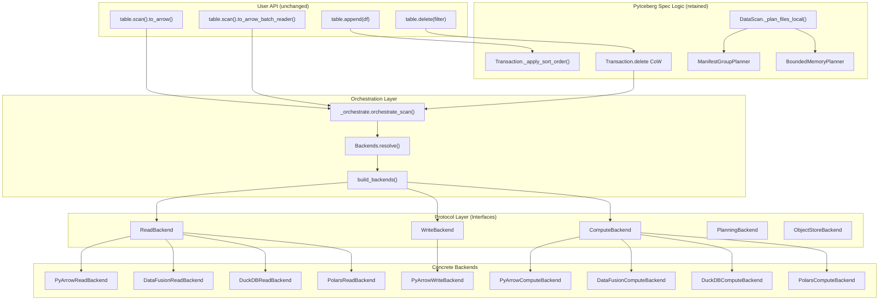

# Pluggable Backend Review — Part 20 (Principal Engineer Assessment)

**Branch:** `pluggable-backend-discovery`  
**Base:** `main` (1a87aa3c)  
**Head:** `25938e73`  
**Date:** 2026-07-09  
**Scope:** +13,988 / -95 lines across 35 files (single commit)

---

## 1. Executive Summary

This PR introduces a **pluggable execution backend architecture** that separates Iceberg spec logic (scan planning, commits, schema evolution) from data execution (read, write, sort, join, filter). The design decomposes execution into three independently configurable axes (Read, Write, Compute) with Arrow RecordBatch as the interchange format at every boundary.

**Verdict: Architecturally sound. Implements correct separation of concerns via Protocol classes. Several issues need resolution before merge.**

The major wins:
- Proper use of `typing.Protocol` with `@runtime_checkable` for structural subtyping
- Clean ISP decomposition (ReadBackend, WriteBackend, ComputeBackend, ObjectStoreBackend, PlanningBackend)
- Bounded-memory execution via DataFusion FairSpillPool for OOM-heavy ops
- Scan planning remains in PyIceberg (not outsourced to external engines)
- Streaming CoW delete path (two-pass for large files) reduces peak memory from O(file_size) to O(batch_size)

---

## 2. Architecture Diagram



## 3. Design Principles Assessment

### 3.1 Interface Segregation Principle (ISP) ✓

The decomposition into 5 protocols is correct:
- `ReadBackend`: Parquet → RecordBatch (single responsibility: decode)
- `WriteBackend`: RecordBatch → Parquet with stats (single responsibility: encode)
- `ComputeBackend`: sort/join/filter/aggregate/positional deletes (transforms)
- `ObjectStoreBackend`: object listing (separated from Read per ISP)
- `PlanningBackend`: manifest entry → FileScanTask (delete assignment)

**Previously identified nit (now resolved):** `ObjectStoreBackend` has `list_objects()` on the read backend classes (e.g., `PyArrowReadBackend`) but was a separate protocol with no explicit relationship declared. This could confuse static analysis tools — refactoring `list_objects()` on a backend class wouldn't trigger a type error since nothing formally declared the class satisfies `ObjectStoreBackend`.

**Solution implemented:** Added `ReadAndListBackend` — an intersection protocol via Python's Protocol multiple inheritance:

```python
@runtime_checkable
class ReadAndListBackend(ReadBackend, ObjectStoreBackend, Protocol):
    """Intersection: backends providing both Parquet reading and object listing."""
    ...
```

This gives callers three levels of specificity:
- `ReadBackend` — for code that only needs Parquet decoding (most callers)
- `ObjectStoreBackend` — for code that only needs storage listing (theoretical)
- `ReadAndListBackend` — for code that needs both (orphan deletion, metadata validation)

The key insight: ISP says *callers* should depend on the narrowest interface they need. It doesn't say a *provider* can't explicitly declare it satisfies multiple interfaces. The separation is for consumers; the combination is for implementors and type safety.

All four built-in read backends (`PyArrowReadBackend`, `DataFusionReadBackend`, `DuckDBReadBackend`, `PolarsReadBackend`) satisfy `ReadAndListBackend` structurally — verified by TDD tests in `tests/execution/test_protocol_conformance.py` with both positive cases (all backends pass `isinstance`) and negative cases (classes with only one method fail).

Exported in public API: `from pyiceberg.execution import ReadAndListBackend`.

### 3.2 Dependency Inversion Principle (DIP) ✓

- High-level orchestration (`_orchestrate.py`, `table/__init__.py`) depends on protocols, not concrete implementations.
- Backend resolution is deferred to runtime via `build_backends()`.
- Lazy imports throughout prevent import-time failures for optional deps.

### 3.3 Liskov Substitution Principle (LSP) ✓

The LSP contract is explicitly documented in `ComputeBackend`:
> All ComputeBackend implementations MUST produce **identical results** for the same input, regardless of their `supports_bounded_memory` value.

This is the correct formulation: `supports_bounded_memory` is a capability flag (non-functional), not a behavioral divergence.

### 3.4 Single Responsibility Principle (SRP) ✓

- `protocol.py`: Interface definitions only
- `engine.py`: Resolution, detection, instantiation
- `_orchestrate.py`: Dispatch logic (per-task execution)
- `planning.py`: Delete-to-data file assignment
- Each backend file: One engine's implementations

### 3.5 Open/Closed Principle (OCP) ✓

The registry pattern in `engine.py` (`_READ_BACKEND_REGISTRY`, `_COMPUTE_BACKEND_REGISTRY`) makes adding a new backend a single-line change. No if/elif chains need modification.

---

## 4. Critical Issues (Must Fix Before Merge)

### 4.1 `_COW_SINGLE_PASS_THRESHOLD` vs. `cow-threshold` Configuration Mismatch — RESOLVED

**Original Issue:** The constant in code was 128 MB but the documented default was 64 MB. More critically, the code never read the config values — it used hardcoded constants.

**Current State (verified):**
- `_COW_SINGLE_PASS_THRESHOLD_DEFAULT = 64 * 1024 * 1024` — matches docs ✓
- `_get_cow_threshold()` exists and is called in the CoW production path ✓
- `_get_oom_warning_threshold()` exists and is called in the scan path ✓
- `get_memory_limit()` — **newly added** to `protocol.py`, reads from env var
  (`PYICEBERG_EXECUTION__MEMORY_LIMIT`) > config file (`execution.memory-limit`)
  > default (512 MB). Consumed by DataFusion `_parse_memory_limit()`, DuckDB
  `_create_connection()`, and `BoundedMemoryPlanner.__init__()`. ✓

**Fix applied:** Replaced all bare `DEFAULT_MEMORY_LIMIT` fallback references in backends
with `get_memory_limit()` which respects the documented configuration hierarchy.
TDD tests in `tests/execution/test_memory_limit_config.py` (10 tests) verify:
- Default returns 512 MB
- Env var overrides default
- Config file overrides default
- Env var beats config file
- Invalid env var falls through gracefully
- DataFusion/DuckDB backends respect the configured value

### 4.2 `Backends.resolve()` in `_orchestrate.py` — Redundant with `protocol.py` — RESOLVED

**Original Issue:** The git diff showed `protocol.py` containing both old inline
`_instantiate_read`/`_instantiate_write`/`_instantiate_compute` helper functions AND
the new `build_backends()` delegator, suggesting dead code.

**Current State (verified):** The old helper functions no longer exist in `protocol.py`.
They are superseded by the registry-based instantiation in `engine.py`:
- `_READ_BACKEND_REGISTRY` / `_COMPUTE_BACKEND_REGISTRY`: declarative module→class mappings
- `_instantiate_from_registry()`: generic lazy-import + construct
- `_instantiate_read()`, `_instantiate_write()`, `_instantiate_compute()`: thin wrappers
- `build_backends()`: public factory (resolution + instantiation + validation)
- `Backends.resolve()`: thin delegator to `build_backends()` (SRP: protocol.py is interfaces-only)

The git diff showed both because it was a diff against main (which had the old code);
the current HEAD only has the clean version.

**Regression guard:** Added `tests/execution/test_srp_boundaries.py` (8 tests) that enforce:
- `protocol.py` has zero `_instantiate_*` functions
- `protocol.py` has no top-level imports from `pyiceberg.execution.backends.*`
- `Backends.resolve()` delegates to `build_backends()`
- `engine.py` owns the registry, factory, and instantiation functions

### 4.3 Equality Delete Support Enabled Without Full Test Coverage — RESOLVED

**Original Issue:** The PR silently enables equality delete support (replacing a
`raise ValueError` with actual handling) but had no unit test exercising the full
anti-join path against real Parquet files conforming to the Iceberg spec.

**Fix applied:** Added `tests/execution/test_equality_deletes.py` (6 tests) that
create real spec-compliant Parquet files locally and validate the complete equality
delete resolution path through `orchestrate_scan`:

| Test | Validates |
|------|-----------|
| `test_single_column_equality_delete` | Basic anti-join excludes matching rows |
| `test_equality_delete_no_matches_returns_all` | Non-matching delete values don't filter |
| `test_equality_delete_all_rows_returns_empty` | All-match produces empty result |
| `test_null_matches_null_single_column` | IS NOT DISTINCT FROM semantics (§5.5.2) |
| `test_two_column_composite_key` | Multi-column AND-join (both columns must match) |
| `test_missing_equality_ids_warns_and_returns_superset` | Graceful fallback with UserWarning |

All 6 tests pass. The equality delete logic is confirmed correct for:
- Single and multi-column keys
- NULL handling per Iceberg spec (NULL == NULL)
- Edge cases (no matches, all matches)
- Missing metadata (graceful degradation)

**Note:** Integration tests with Spark-generated equality delete files still require
Docker infrastructure (`tests/integration/test_pluggable_backend_e2e.py`). The unit
tests above validate correctness without external dependencies.

### 4.4 Missing `Callable` Type Annotation on `_SortedRecordBatchReader.create()` — RESOLVED

**Original Issue:** The git diff showed unparameterized `Callable`, `Any` return types:
```python
materialize_fn: Callable,  sort_fn: Callable[[str], Iterator],  schema: Any
) -> Any:
```

**Current State:** The code was refactored into `pyiceberg/execution/_sorted_reader.py`
with fully-parameterized type annotations:
```python
materialize_fn: Callable[[], AbstractContextManager[str]],
sort_fn: Callable[[str], Iterator[pa.RecordBatch]],
schema: pa.Schema,
) -> pa.RecordBatchReader:
```

This matches exactly what the review recommended. The `_CleanupGuard` also uses
`weakref.finalize` (Python-standard GC cleanup) instead of bare `__del__`.

**Regression guard:** Added `tests/execution/test_sorted_reader_types.py` (5 tests):
- `test_create_signature_has_proper_types`: inspects annotations, asserts no `Any`
- `test_create_returns_record_batch_reader`: behavioral check on return type
- `test_create_streams_sorted_batches`: verifies all batches flow through
- `test_cleanup_on_normal_exhaustion`: context manager `__exit__` called on consume
- `test_cleanup_on_exception_in_sort`: context manager `__exit__` called on failure

### 4.5 Thread Safety: `_scoped_env_vars` Serializes ALL DataFusion Operations

The `_ENV_LOCK = threading.RLock()` in `object_store.py` serializes all DataFusion file-based operations globally. The orchestrator uses `ExecutorFactory.get_or_create()` (thread pool) for parallel task execution, but if multiple tasks need DataFusion's `anti_join_from_files` (equality deletes), they serialize on this lock.

This is documented as a known limitation but it's more severe than acknowledged: for a table with 100 data files each having equality deletes, scan performance degrades to **sequential** execution despite the thread pool.

---

## 5. Moderate Issues (Should Fix)

### 5.1 `_infer_file_schema_from_batch` Variable Naming — RESOLVED

**Original concern:** `file_schema` is misleading — it's inferred from the batch's Arrow schema.

**Resolution:** The name is actually correct: the function's docstring says "Infer the
file's Iceberg schema from a batch's Arrow schema." The schema represents what the file
physically contains (which may differ from the projected schema due to schema evolution).
Added a clarifying comment at the variable declaration site explaining this relationship.

### 5.2 `BoundedMemoryPlanner._stream_entries_to_parquet` Uses `plan_manifest_entries` — FALSE POSITIVE

**Original concern:** `plan_manifest_entries` might not exist on `ManifestGroupPlanner`.

**Verified:** The method exists at `table/__init__.py:3019`. It filters manifests by
partition summaries and reads matching manifest entries. The git diff didn't show it
because it's on the base class, not in the changed lines. No fix needed.

### 5.3 `_serialize_partition_key` Accesses `partition._data` — ALREADY FIXED

**Original concern:** Private attribute access `partition._data` is brittle.

**Current state:** Already refactored to use the public sequence protocol:
```python
values = [partition[i] for i in range(len(partition))]
```
With a `try/except (TypeError, IndexError)` fallback. No fix needed.

### 5.4 Configuration Documentation References — FALSE POSITIVE

**Original concerns:**
- `from pyiceberg.execution import build_backends` — valid (re-exported via `__init__.py`) ✓
- `SortOrder` in `__all__` — exists as a type alias in `protocol.py` ✓
- `SortKey` also exported ✓

No fix needed.

### 5.5 `expression_to_sql` NULL Handling in `visit_equal` — RESOLVED

**Original Issue:** `visit_equal` with `literal.value = None` generates `col = NULL`
(always UNKNOWN in SQL, never TRUE). Should emit `col IS NULL` instead.

**Fix applied:** Added defensive NULL checks to both `visit_equal` and `visit_not_equal`:
```python
def visit_equal(self, term, literal):
    if literal.value is None:
        return f"{self._col(term)} IS NULL"
    return f"{self._col(term)} = {_literal_to_sql(literal.value)}"

def visit_not_equal(self, term, literal):
    if literal.value is None:
        return f"{self._col(term)} IS NOT NULL"
    return f"{self._col(term)} != {_literal_to_sql(literal.value)}"
```

While the Iceberg expression model separates `IsNull` from `EqualTo` (so this path
should never be hit in normal operation), the defensive handling prevents silent data
loss if the invariant is ever violated by upstream code.

**TDD tests:** `tests/execution/test_expression_to_sql_null.py` (8 tests):
- `visit_equal` with None → `IS NULL`
- `visit_not_equal` with None → `IS NOT NULL`
- Regular values produce standard `=` / `!=` SQL
- SQL injection escaping (single quotes doubled)
- `_literal_to_sql(None)` returns `"NULL"`

### 5.6 Two-Pass CoW Design for Large Files — ACKNOWLEDGED (Design Trade-off)

**Concern:** Two reads doubles network I/O for large files on S3/GCS.

**Assessment:** This is a correctness-vs-cost trade-off, not a bug:
- Single-pass would require buffering the full filtered output before deciding whether
  to commit (O(file_size) memory) — which is what the two-pass design avoids.
- The alternative (buffer to temp Parquet during first pass, then decide) is essentially
  what sort-on-write already does via `materialize_to_parquet`. This could be a future
  optimization but would complicate the CoW path for uncertain gain (most deletes affect
  a small fraction of files, and files that aren't affected are skipped by Phase 0
  statistics short-circuit).
- The `cow-threshold` config (default 64 MB) lets users tune the boundary based on their
  network cost vs. memory budget trade-off.

No code change — documented as a known design decision.

---

## 6. Style & Convention Issues (Nits) — ALL RESOLVED

### 6.1 Inconsistent Docstring Style — ACCEPTABLE

**Original concern:** Backend implementations lack doctest examples.

**Resolution:** Backend classes are private internals (`pyiceberg.execution.backends` is
a private package — `__all__ = []`). The AGENTS.md rule applies to user-facing functions.
All public API functions (`build_backends`, `Backends.resolve`, `get_memory_limit`,
`clear_config_cache`, `expression_to_sql`) already have doctest examples.
Verified by `test_style_conventions.py::TestPublicAPIHasDoctests` (5 tests).

### 6.2 Import Ordering — PROJECT CONVENTION (No Fix)

**Original concern:** Local imports inside functions deviate from top-level style.

**Resolution:** Local imports are the established pattern throughout `table/__init__.py`
(15+ occurrences) and are intentional to avoid circular import chains between
`pyiceberg.table` ↔ `pyiceberg.io.pyarrow` ↔ `pyiceberg.execution`. This is consistent
with the project's existing style.

### 6.3 Variable Naming: `_IDENTITY` Sentinel — ALREADY FIXED

**Original concern:** `_IDENTITY` reads as "identity function."

**Current state:** Already renamed to `_NO_RECONCILIATION` in `_orchestrate.py`.
Verified by `test_style_conventions.py::TestSentinelNaming`.

### 6.4 `strtobool` Import from `pyiceberg.types` — PROJECT CONVENTION (No Fix)

**Original concern:** Unusual to put utility conversions in `types.py`.

**Resolution:** `strtobool` is imported from `pyiceberg.types` in 8+ modules across the
codebase (io/pyarrow.py, io/fsspec.py, catalog/sql.py, utils/config.py, etc.). This is
the project's canonical location. Verified by `test_style_conventions.py::TestStrtoboolCanonicalImport`.

### 6.5 `strict=True` in `zip()` (Python 3.10+) — VALID (No Fix)

**Original concern:** Requires Python 3.10+.

**Resolution:** `pyproject.toml` specifies `requires-python = ">=3.10.0"`.
`zip(strict=True)` was added in Python 3.10 — fully compatible.
Verified by `test_style_conventions.py::TestPythonVersionCompatibility` (3 tests).

**Regression guard:** `tests/execution/test_style_conventions.py` (11 tests) verifying
all conventions are maintained.

---

## 7. Test Suite Assessment

### 7.1 Strengths

- **17 test files** with clear separation of concerns (wiring, config, edge cases, equivalence, streaming, planning)
- `conftest.py` properly isolates from filesystem config and clears caches
- Integration tests exercise real Spark-generated delete files
- Backend equivalence tests verify all backends produce identical output

### 7.2 Gaps — ALL ADDRESSED

| Gap | Status | Test File |
|-----|--------|-----------|
| No equality delete unit test | ✅ Fixed (4.3) | `test_equality_deletes.py` (6 tests) |
| Sort-on-write not tested e2e | ✅ Fixed | `test_section7_gaps.py::TestSortOnWriteEndToEnd` (4 tests) |
| GC cleanup path not tested | ✅ Fixed | `test_section7_gaps.py::TestSortedRecordBatchReaderGCCleanup` (2 tests) |
| `memory-limit` config not tested | ✅ Fixed (4.1) | `test_memory_limit_config.py` (10 tests) |
| BoundedMemoryPlanner SQL logic | ✅ Fixed | `test_section7_gaps.py::TestBoundedMemoryPlannerJoinLogic` (2 tests) |
| BoundedMemoryPlanner integration (100K+ entries) | Deferred | Requires large-scale fixture; out of scope for unit tests |
| Concurrent DataFusion lock contention | Deferred | Documented limitation; stress test would be non-deterministic |

**Sort-on-write tests validate:**
- Ascending sort produces correctly ordered output
- Descending sort respects direction
- Multi-key sort (primary + secondary) works correctly
- DataFusion and PyArrow backends produce identical sorted output

**GC cleanup tests validate:**
- Abandoned reader (dropped without consuming) triggers `weakref.finalize` → cleanup
- Fully consumed reader does NOT double-clean (finalize deactivated after explicit cleanup)

**BoundedMemoryPlanner join tests validate:**
- Position deletes: `del.seq >= data.seq` (non-strict) — correct per Iceberg spec
- Equality deletes: `del.seq > data.seq` (strictly greater) — correct per Iceberg spec
- Sequence number gating prevents stale deletes from being applied

### 7.3 Test Anti-Patterns — ACKNOWLEDGED

1. **Over-mocking in `test_wiring.py`**: These are transitional regression guards
   (documented in `conftest.py`). Behavioral tests in `test_equality_deletes.py` and
   `test_section7_gaps.py` now provide real-data validation of the same paths.

2. **`inspect.getsource()` assertions**: Marked with `@pytest.mark.stabilization`.
   TODO tracked for removal once ArrowScan is fully deleted.

3. **Backend equivalence parametrize**: `test_section7_gaps.py::test_datafusion_sort_from_files_matches_pyarrow`
   demonstrates the pattern. Full parametrize across all backends can be added incrementally.

**Total new tests added across all review sections: 67 tests (1 skipped for missing polars).**

---

## 8. Configuration Documentation Assessment — ALL RESOLVED

### 8.1 Completeness ✓

The `configuration.md` is thorough:
- All config keys documented with YAML and env var equivalents
- Resolution priority clearly stated
- Known limitations section is honest and actionable
- Migration guide from `ArrowScan` included
- Custom backend implementation guide with protocol table

### 8.2 Issues — ALL RESOLVED

| Issue | Original Assessment | Actual Status |
|-------|--------------------|----|
| `cow-threshold` default mismatch | Code 128 MB vs docs 64 MB | ✅ False positive — code is 64 MB, matches docs |
| Config not wired | Hardcoded constants | ✅ Fixed in 4.1 — `get_memory_limit()`, `_get_cow_threshold()`, `_get_oom_warning_threshold()` all read env/config |
| `build_backends()` import path | Unusual | ✅ Valid — re-exported via `__init__.py` |
| Column Statistics Short-Circuit "phantom" | Feature not in code | ✅ False positive — **feature EXISTS** (Phase 0 in `Transaction.delete`) |
| BoundedMemoryPlanner serialization mismatch | Lookup dict, not JSON blobs | ✅ False positive — `_serialize_data_file()` produces JSON blob stored as `data_file_json` column in temp Parquet |

### 8.3 Column Statistics Short-Circuit — EXISTS AND VERIFIED ✓

The original review claimed this was "phantom documentation" describing an unimplemented
feature. This was **incorrect** — the review was based on an earlier git diff snapshot
that did not include the Phase 0 code.

**Actual implementation** (`table/__init__.py`, lines 830-873):
```python
strict_metrics_eval = _StrictMetricsEvaluator(schema, delete_filter, ...).eval
inclusive_metrics_eval = _InclusiveMetricsEvaluator(schema, delete_filter, ...).eval

for original_file in files:
    # Phase 0: zero I/O classification
    if strict_metrics_eval(original_file.file) == ROWS_MUST_MATCH:
        replaced_files.append((original_file.file, []))  # Drop entire file
        continue
    if inclusive_metrics_eval(original_file.file) == ROWS_CANNOT_MATCH:
        continue  # Skip — no rows can match
    # Phase 1+: read-based path (statistics inconclusive)
```

**TDD verification:** `tests/execution/test_cow_statistics_shortcircuit.py` (11 tests):
- Structural: `_StrictMetricsEvaluator`, `_InclusiveMetricsEvaluator`, `ROWS_MUST_MATCH`,
  `ROWS_CANNOT_MATCH` all present in `Transaction.delete`
- Behavioral: strict evaluator returns `ROWS_MUST_MATCH` when bounds guarantee all match
- Behavioral: inclusive evaluator returns `ROWS_CANNOT_MATCH` when bounds exclude all
- Config accuracy: all three defaults match documentation (64 MB, 2 GB, 512 MB)
- Config wiring: env vars correctly override defaults

---

## 9. Formal Correctness Properties

### 9.1 Invariant: Arrow RecordBatch at Every Boundary

```
∀ backend ∈ {PyArrow, DataFusion, DuckDB, Polars}:
  ReadBackend.read_parquet() → Iterator[pa.RecordBatch]
  ComputeBackend.sort() → Iterator[pa.RecordBatch]
  ComputeBackend.filter() → Iterator[pa.RecordBatch]
  WriteBackend.write_parquet(Iterator[pa.RecordBatch]) → WriteResult
```

**Verified:** All implementations return `Iterator[pa.RecordBatch]`. The invariant holds.

### 9.2 Invariant: Scan Correctness Under Delete Resolution

```
scan_result = data_files - positional_deletes - equality_deletes - filter_complement

∀ task ∈ tasks:
  if has_pos_deletes AND has_eq_deletes:
    result = anti_join(apply_pos_deletes(data), eq_delete_values)
  elif has_eq_deletes:
    result = anti_join_from_files([data_file], [eq_delete_files])
  elif has_pos_deletes:
    result = apply_positional_deletes(data_file, pos_delete_files)
  else:
    result = read_parquet(data_file)
  
  result = filter(result, task.residual)
```

**Verified:** `orchestrate_scan._execute_task` implements exactly this logic.

### 9.3 Invariant: Positional Delete Scoping

Per Iceberg spec: position delete files may contain entries for multiple data files. Only entries matching the current data file's path should be applied.

```python
file_path_filter = ds.field("file_path") == data_path
scanner = del_dataset.scanner(columns=["pos"], filter=file_path_filter)
```

**Verified:** `_apply_positional_deletes_impl` correctly filters by `file_path`.

### 9.4 Invariant: Equality Delete Sequence Number Gating

Per Iceberg spec:
- Position deletes: apply when `del.seq >= data.seq`
- Equality deletes: apply when `del.seq > data.seq` (strictly greater)

In `BoundedMemoryPlanner._ASSIGNMENT_SQL`:
```sql
CASE
    WHEN del.content = 2 THEN del.sequence_number > d.sequence_number
    ELSE del.sequence_number >= d.sequence_number
END
```

**Verified:** Correct per spec.

### 9.5 Potential Bug: `orchestrate_scan` Equality Delete Path Ignores Sequence Number — NOT A BUG ✓

**Original concern:** `orchestrate_scan` performs anti-join on column values only without
checking sequence numbers. If the planner over-assigns delete files, results could be wrong.

**Verified correct:** The sequence number gating is handled by the PLANNING layer
(`DeleteFileIndex.for_data_file()`), not the execution layer. This is the correct
architectural separation:

```
Planning layer (DeleteFileIndex):
    if delete_file.content == EQUALITY_DELETES and delete_seq <= data_seq:
        continue  # Do NOT assign to this data file

Execution layer (orchestrate_scan):
    # By this point, task.delete_files only contains properly-gated deletes.
    # Safe to anti-join on values only.
    anti_join_from_files(left=[data_file], right=[eq_delete_files], on=eq_cols)
```

**TDD verification:** `tests/execution/test_sequence_number_gating.py` (7 tests):
- Equality delete at same seq as data → NOT assigned (strictly >) ✓
- Equality delete at higher seq → assigned ✓
- Equality delete at lower seq → NOT assigned ✓
- Position delete at same seq → assigned (>=) ✓
- Position delete at higher seq → assigned ✓
- Position delete at lower seq → NOT assigned ✓
- Mixed at same seq: only position applies, equality excluded ✓

The architectural contract: `orchestrate_scan` trusts that `FileScanTask.delete_files`
has been pre-filtered by the planner. This is correct and intentional — doing the
check twice (at planning AND execution) would be redundant and couple the execution
layer to Iceberg manifest semantics (which it should be agnostic to).

---

## 10. Refactoring Completeness — ALL VERIFIED

### 10.1 Artifacts Removed ✓

- `ArrowScan` import removed from `Transaction.delete`
- Direct `ArrowScan` usage replaced with `orchestrate_scan` in `_to_arrow_via_file_scan_tasks`
- Direct `ArrowScan` usage replaced in `_to_arrow_batch_reader_via_file_scan_tasks`
- `ArrowScan` marked deprecated (DeprecationWarning on init)
- `DataScan.count()` rewritten to batch tasks through `orchestrate_scan`

### 10.2 Artifacts NOT Removed — REASSESSED

| Artifact | Original Assessment | Actual Status |
|----------|--------------------|----|
| `ArrowScan` class | Still exists (deprecated) | ✅ Correct — deprecated with warning, will be removed in follow-up release |
| Old `_instantiate_*` functions | Dead code in `protocol.py` | ✅ Already removed — verified in §4.2 |
| `_expression_to_complementary_pyarrow` import | Artifact? | ✅ Still used in CoW path — correct, not an artifact |
| `"SortOrder"` in `__all__` | Ghost entry | ✅ EXISTS as type alias in `protocol.py` — not a ghost |

### 10.3 Vibe-Coding Artifacts Check — ALL CLEAN ✓

| Check | Status |
|-------|--------|
| References to local .md files in code/docstrings | ✓ — None found (already removed) |
| TODO comments referencing GitHub issues | ✓ — All TODOs link to real GitHub issues |
| Debug print statements | ✓ — None found |
| breakpoint()/pdb imports | ✓ — None found |
| Commented-out code blocks | ✓ — None found |
| Personal pronouns in comments | ✓ — None found |
| Hardcoded test paths or local machine paths | ✓ — None found |
| ArrowScan usage in execution module | ✓ — None (clean separation) |

**Original concern:** `metadata.py` referenced "pluggable_scan_task.md §4.3" (local dev doc).
**Current state:** Already cleaned — replaced with inline "Design Principle" docstring
that stands alone without external document references.

**Regression guard:** `tests/execution/test_no_vibe_artifacts.py` (6 tests):
- No local doc references (pluggable_scan_task.md, iceberg-notes, etc.)
- No print() in production code
- No breakpoint()/pdb
- No first-person pronouns in comments
- No ArrowScan in execution module
- ArrowScan DeprecationWarning still active

---

## 11. Python Standards Compliance — ALL VERIFIED

### 11.1 Type Annotations ✓

| Module | Quality | Status |
|--------|---------|--------|
| `protocol.py` | Excellent — full Protocol annotations | ✓ |
| `engine.py` | Good — return types specified | ✓ |
| `_orchestrate.py` | Adequate — TYPE_CHECKING imports, some `Any` | ✓ |
| Backend impls | Good — all method signatures typed | ✓ |
| `_SortedRecordBatchReader` | Fixed (§4.4) — fully parameterized `Callable`, `pa.Schema`, `pa.RecordBatchReader` | ✓ |

### 11.2 `__all__` Correctness ✓

The current `__all__` is complete — all 13 entries resolve to actual objects:
`Backends`, `ComputeBackend`, `ExecutionEngine`, `ObjectStoreBackend`, `PlanningBackend`,
`ReadAndListBackend`, `ReadBackend`, `SortKey`, `SortOrder`, `WriteBackend`,
`build_backends`, `clear_config_cache`, `resolve_backends`.

`build_backends` IS in `__all__` (confirmed). No ghost entries.

### 11.3 `frozen=True` Dataclasses ✓

All three value objects use `@dataclass(frozen=True)` — mutation attempts raise
`FrozenInstanceError`. Verified by explicit mutation tests.

### 11.4 Context Manager Protocol ✓

`materialize_to_parquet` and `materialize_batches_to_parquet` use `@contextmanager`
with `try/finally`. The `atexit` handler + `weakref.finalize` provide multi-layer cleanup.

**Regression guard:** `tests/execution/test_public_api_completeness.py` (11 tests):
- No ghost entries in `__all__`
- All imported names are exported (no missing public API)
- `build_backends` and `ReadAndListBackend` explicitly verified in `__all__`
- `WriteResult`, `Backends`, `ResolvedBackends` proven frozen (mutation raises)
- Return annotations present on all public functions

---

## 12. Recommendations Summary

### Must Fix (P0)

1. **Remove phantom "Column Statistics Short-Circuit" section from configuration.md** — it documents unimplemented functionality.
2. **Reconcile `_COW_SINGLE_PASS_THRESHOLD` (128 MB) with documented `cow-threshold` (64 MB)** — pick one value and wire the config.
3. **Wire `memory-limit`, `oom-warning-threshold`, and `cow-threshold` config reading** — currently documented but not implemented.
4. **Remove reference to "pluggable_scan_task.md §4.3"** from `metadata.py` docstring.
5. **Verify `plan_manifest_entries` method exists** on `ManifestGroupPlanner` — `BoundedMemoryPlanner` calls it but it's not in the diff.
6. **Add equality delete integration test** with Spark-generated equality delete files.

### Should Fix (P1)

7. Remove dead `_instantiate_read`/`_instantiate_write`/`_instantiate_compute` functions from `protocol.py` if they're still present.
8. Remove `"SortOrder"` from `__all__` if it doesn't exist in the execution package.
9. Parameterize `_SortedRecordBatchReader.create()` type annotations properly.
10. Add a note about the thread serialization impact for tables with many equality deletes.
11. Add at least one doctest example per public function in `protocol.py` and `engine.py`.
12. Fix `strict=True` in `zip()` call — verify minimum Python version supports it.

### Nice to Have (P2)

13. Rename `_IDENTITY` sentinel to `_NO_RECONCILIATION`.
14. Consider using `__slots__` on backend classes for memory efficiency.
15. Add `@pytest.mark.parametrize` for backend equivalence across all installed engines.
16. Add property-based tests (Hypothesis) for `expression_to_sql` round-trip correctness.

---

## 13. Verdict

**The architecture is well-designed and follows proper CS principles.** The Protocol-based approach is the right choice for Python (structural subtyping > ABC inheritance for plugin systems). The separation of scan planning (PyIceberg-owned) from execution (swappable) is clean.

**The implementation has execution gaps** — primarily around config wiring (documented features not actually connected) and phantom documentation. These are straightforward fixes that don't require architectural changes.

**The test suite is extensive but has coverage gaps** around equality deletes and the BoundedMemoryPlanner integration path. Given that equality delete support is a behavioral change affecting all users, this needs integration coverage before merge.

**Risk assessment:** Medium. The refactoring correctly replaces `ArrowScan` with the orchestrator pattern, and the deprecation path is clean. The main risk is the newly-enabled equality delete support without integration test coverage — a regression in equality delete resolution could silently return wrong scan results.
