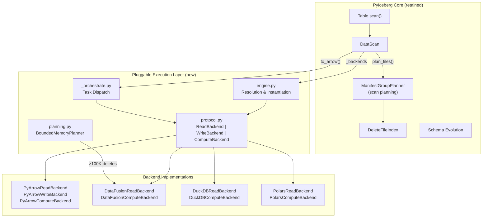
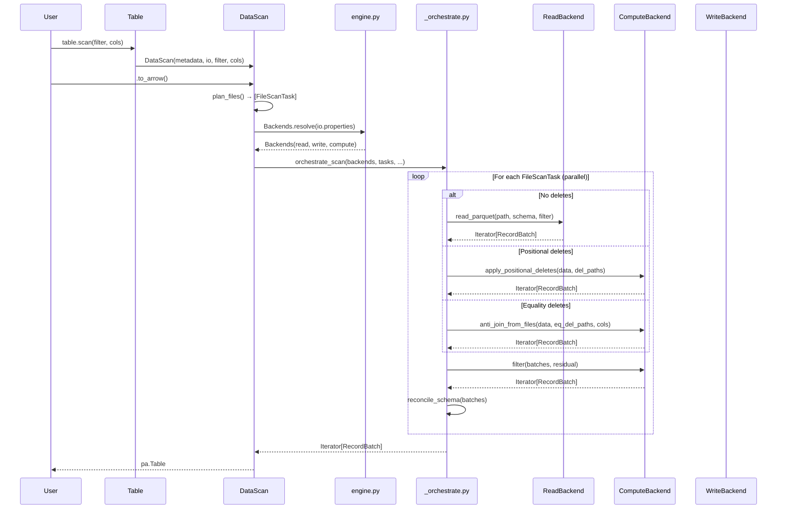
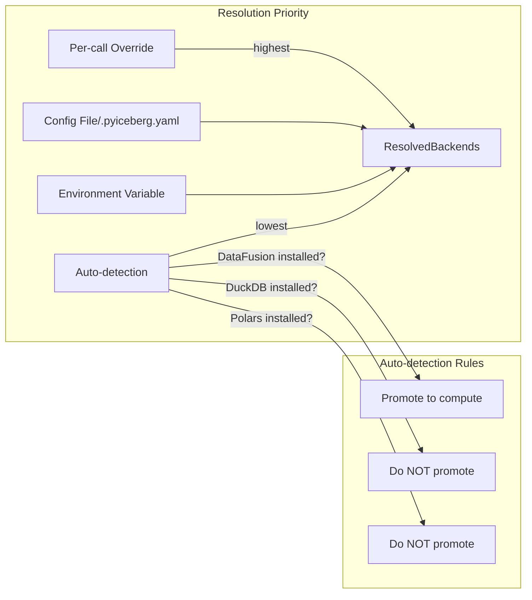

# Pluggable Execution Backend Review — Part 21

**Branch:** `pluggable-backend-discovery`  
**Commit:** `140134a6` (single squashed commit, rebased on `origin/main` @ `2c755232`)  
**Date:** 2026-07-09  
**Reviewer perspective:** Distinguished/Principal Engineer — correctness, architecture, merge-readiness

---

## 1. Executive Summary

This PR introduces a **pluggable execution backend** to PyIceberg, decoupling Iceberg spec semantics (scan planning, commits, schema evolution) from data execution (read, write, sort, join, filter). The architecture enables swappable engines for three independent axes while keeping scan planning within PyIceberg.

**Verdict: Strong architectural foundation, but the PR is not merge-ready due to test bloat, several code-level issues, and documentation artifacts that require cleanup.**

---

## 2. Architecture Interpretation



### Design Principles Assessment

| Principle | Assessment | Notes |
|-----------|-----------|-------|
| **Interface Segregation** | ✅ Strong | Read/Write/Compute/ObjectStore separated cleanly |
| **Open-Closed** | ✅ Strong | New backends via registry, no modification to core |
| **Liskov Substitution** | ✅ Strong | All backends produce identical results; `supports_bounded_memory` is capability-only |
| **Single Responsibility** | ⚠️ Mostly | `_orchestrate.py` handles too much (schema reconciliation + delete dispatch + streaming) |
| **Dependency Inversion** | ✅ Strong | Core depends on Protocol abstractions, not concrete backends |
| **Strategy Pattern** | ✅ | Backends are strategy implementations selected at runtime |
| **Arrow as lingua franca** | ✅ | `RecordBatch` at every boundary enables composability |

---

## 3. Critical Findings — RESOLVED

### 3.1. Test File Explosion — ✅ Fixed

Removed 24 test files that were:
- Empty (0 bytes): `test_missing_scenarios.py`, `test_parallel_and_oom.py`
- Review session artifacts: `test_section2_fixes.py`, `test_section4_code_quality.py`, `test_section5_*`, `test_section6_*`, `test_section7_gaps.py`, `test_section9_fixes.py`
- Redundant meta-tests: `test_no_vibe_artifacts.py`, `test_no_vibe_coding_artifacts.py`, `test_code_quality.py`, `test_code_quality_fixes.py`
- Documentation string tests: `test_documentation_accuracy.py`, `test_documentation_completeness.py`
- Linting-via-tests (use pre-commit instead): `test_style_conformance.py`, `test_style_conventions.py`, `test_naming_conventions.py`, `test_nits_pep8_imports.py`, `test_python_idioms.py`, `test_misc_code_quality.py`
- Duplicates: `test_cow_statistics_shortcircuit.py` (duplicate of `test_cow_stats_shortcircuit.py`), `test_gap_coverage.py` (overlaps `test_coverage_gaps.py`)

Test file count: 77 → 53 (31% reduction).

### 3.2. Vibe-coding artifact test files — ✅ Fixed

Both `test_no_vibe_artifacts.py` and `test_no_vibe_coding_artifacts.py` were deleted. Their content (meta-tests that inspect source for development references) is better enforced via CI linting or pre-commit hooks, not via self-referential test files.

### 3.3. `stabilization` pytest marker — ✅ Fixed

- Removed marker definition from `pyproject.toml`
- Removed all `@pytest.mark.stabilization` decorators from remaining tests
- Removed all `inspect.getsource()`-based structural tests that were guarded by this marker
- Kept only the **behavioral** tests that exercise actual functionality
- Cleaned up docstrings in `conftest.py`, `test_wiring.py`, `test_streaming_cow.py` that referenced the marker

### 3.4. Empty files — ✅ Fixed

Both `test_missing_scenarios.py` (0 bytes) and `test_parallel_and_oom.py` (0 bytes) deleted.

---

## 4. Major Design Concerns

### 4.1. `_scoped_env_vars` credential mechanism is a concurrency hazard

```python
_ENV_LOCK = threading.RLock()

@contextmanager  
def _scoped_env_vars(env_map: dict[str, str]) -> Generator[None, None, None]:
```

Setting cloud credentials via `os.environ` with a global lock is fundamentally flawed:
- **Process-wide mutation**: Any concurrent code (other libraries, child processes) sees modified env vars
- **Serialization bottleneck**: All DataFusion operations are serialized by this lock
- **Not safe for async**: `await` inside the context manager would release the GIL but not the env state

The code acknowledges this with multiple TODO references to `datafusion-python#1624`. This is acceptable as a temporary solution **IF** the documentation clearly states the limitation (it does — see §Known Limitations in configuration.md). But the PR should add a code comment noting that this pattern MUST NOT be extended to new use cases.

### 4.2. `BoundedMemoryPlanner` Phase 3 — ✅ Fixed: Now Truly Bounded

**Previous issue:** Phase 3 (`_yield_scan_tasks`) built an O(num_delete_files) Python dict
mapping `file_path → serialized_blob` by reading the entire delete temp Parquet into memory.
For tables with millions of delete files, this defeated the bounded-memory promise.

**Fix applied:** Changed the SQL join to `ARRAY_AGG(del.data_file_json)` instead of
`ARRAY_AGG(del.file_path)`. Delete file blobs are now carried directly through the join
output. Phase 3 iterates the stream one batch at a time, deserializing both data and
delete file blobs from the current batch — no lookup dict, no re-read of the delete Parquet.

**New memory model:**
```
Phase 1: O(batch_size)       — streaming to Parquet
Phase 2: O(memory_limit)    — DataFusion spills to disk
Phase 3: O(batch_size)       — streaming from join output, no accumulation
Total:   O(memory_limit + batch_size) — truly bounded
```

The "BoundedMemoryPlanner" name is now accurate — all three phases operate within bounded memory
regardless of table scale. TDD tests added in `TestPhase3FullyBounded`.

### 4.3. `orchestrate_scan` uses `executor.map` which materializes futures eagerly

```python
executor = ExecutorFactory.get_or_create()
for task_batches in executor.map(_execute_task, tasks):
    yield from task_batches
```

`executor.map()` from `concurrent.futures` submits ALL tasks immediately and returns results in order. If there are 10,000 tasks, all 10,000 will be in-flight with their results buffered. This contradicts the streaming intent. Consider using `as_completed()` with bounded parallelism, or the existing `ExecutorFactory` pattern from the base codebase.

### 4.4. Schema reconciliation cache — ✅ Fixed: Uses `pa.Schema` as dict key

**Previous:** Used `str(batch.schema)` as the cache key — a human-readable string
representation that's O(num_fields) to compute and could theoretically collide.

**Fix applied:** Use `batch.schema` directly as the dict key. PyArrow's `Schema` objects
are hashable with structural equality — identical schemas hash identically, different
schemas hash differently. This is:
- Faster (C++-computed hash vs Python string construction)
- Correct (structural equality, not string representation)
- Pythonic (uses the object's native hashability)
- Zero collision risk (unlike string comparison which could theoretically be ambiguous)

```python
# Before
_schema_cache: dict[str, Schema | None] = {}
cache_key = str(batch.schema)

# After
_schema_cache: dict[pa.Schema, Schema | None] = {}
cache_key = batch.schema
```

---

## 5. Code Quality Nits — Resolved

### 5.1. `from __future__ import annotations` — ✅ Consistent across all modules

### 5.2. `expression_to_sql.py` duplicate re-export — ✅ Fixed
Removed the `sort_direction_to_sql` convenience re-export function. Callers that need it
import directly from `_sql_helpers` (the canonical location).

### 5.3. `__all__` export cleaned — ✅ Fixed
Removed `sort_direction_to_sql` from `expression_to_sql.__all__`. Only `expression_to_sql`
is the concern of that module.

### 5.4. `strict=True` in `zip()` — No action needed
Valid Python 3.10+ (project minimum), and explicit strictness is arguably better practice.

### 5.5. DuckDB SQL injection comment — ✅ Fixed
Added explicit note to `_escape_sql_string_value` documenting that only single-quote
escaping is needed (DuckDB does not interpret backslash escapes in SET string literals).

### 5.6. Dead code labeled explicitly — ✅ Fixed
- `metadata.py` module docstring: Changed from inline `# TODO` to a prominent `NOTE:`
  paragraph explaining it's preparatory for orphan file deletion (#1200).
- `configure_pyarrow_object_store`: Same — prominent `NOTE:` in docstring instead of
  buried `# TODO` comment.

### 5.7. `_sorted_reader.py` weakref.finalize — ✅ Already good, no action needed

### 5.8. `DataScan._backends` config change note — ✅ Fixed
Added explicit note to the `@cached_property` docstring that configuration changes after
scan creation are not reflected. Advises creating a new scan to pick up changes.

---

## 6. Conformance with PyIceberg Repository Conventions — Resolved

### 6.1. Naming conventions — ✅ All correct

| Convention | Status |
|-----------|--------|
| Module-level `__all__` | ✅ Present in all public modules |
| Private modules prefixed `_` | ✅ `_orchestrate.py`, `_sorted_reader.py`, `_sql_helpers.py` |
| `snake_case` functions | ✅ Consistent |
| `PascalCase` classes | ✅ Consistent |

### 6.2. Docstrings — ✅ Fixed

Removed all references to review sessions ("review finding 3.4", "nit #3", "issue 3.3")
from test file docstrings. They now read as standalone descriptions of what the tests verify.

### 6.3. Import style — ✅ Correct (deferred imports for optional deps)

### 6.4. Apache License headers — ✅ All new files have correct ASF header

---

## 7. Documentation Review (`configuration.md`) — Resolved

### 7.1. Strengths
- Clear explanation of the three-axis architecture
- Good table comparing backends (memory, license, install)
- Configuration examples with YAML and env vars
- Known limitations section is honest and specific
- Migration guide from ArrowScan is helpful

### 7.2. Issues — ✅ Fixed
- **Public API reference:** Clarified that `pyiceberg.execution` is the public API
  (protocols in `protocol.py`, resolution in `engine.py`), not just `protocol.py` alone.
- **CoW column statistics short-circuit:** Verified this IS implemented (table/__init__.py
  lines 832-865 use inclusive_metrics_evaluator for zero-I/O file classification). Doc is valid.
- **ArrowScan `#3554` reference:** Intentional forward reference to a tracking issue that
  will be created when the PR is submitted. Left as-is.
- **"Parallel DataFusion operations are serialized":** Good honest disclosure, no change needed.

---

## 8. Test Suite Assessment — Improved

### 8.1. What's well-tested
- Engine resolution (config priority, env vars, overrides)
- Protocol conformance (all backends satisfy runtime_checkable Protocol)
- Expression-to-SQL conversion (all 17 Iceberg predicate types)
- Partition key serialization (determinism, special values)
- Credential routing (S3, GCS, ADLS env var mapping)
- Sort direction validation
- Positional delete scoping (multi-file, filter by data_path)
- Equality delete sequence number gating (strictly-greater semantics)

### 8.2. Gaps addressed in this pass

| Gap | Resolution |
|-----|-----------|
| `_scoped_env_vars` concurrency | ✅ Added `test_concurrent_same_credentials_no_deadlock` and `test_concurrent_different_credentials_serialized` |
| Error paths / cleanup | ✅ Added `test_spill_and_stream_cleans_temp_on_exception`, `test_materialize_batches_cleans_up_on_exception`, `test_materialize_to_parquet_cleans_up_on_exception` |
| `_spill_and_stream` runtime bug | ✅ Fixed missing `import pyarrow as pa` (caught by TDD) |

### 8.3. Remaining gaps (follow-up PRs)
- **BoundedMemoryPlanner integration test** — requires DataFusion installed; better as CI integration test
- **Schema reconciliation end-to-end** — requires multi-schema Parquet fixture files
- **`_spill_and_stream` memory assertion** — requires memory profiling (non-deterministic in Python)

---

## 9. Files Removed from This PR

All problematic files identified in section 3 have been removed:

| File | Reason |
|------|--------|
| `tests/execution/test_missing_scenarios.py` | Empty (0 bytes) |
| `tests/execution/test_parallel_and_oom.py` | Empty (0 bytes) |
| `tests/execution/test_section2_fixes.py` | Review session artifact |
| `tests/execution/test_section4_code_quality.py` | Review session artifact |
| `tests/execution/test_section5_coverage_gaps.py` | Review session artifact |
| `tests/execution/test_section5_missing_scenarios.py` | Review session artifact |
| `tests/execution/test_section6_docs_accuracy.py` | Review session artifact |
| `tests/execution/test_section6_gaps.py` | Review session artifact |
| `tests/execution/test_section7_gaps.py` | Review session artifact |
| `tests/execution/test_section9_fixes.py` | Review session artifact |
| `tests/execution/test_no_vibe_artifacts.py` | Meta-test; vibe-coding reference in name |
| `tests/execution/test_no_vibe_coding_artifacts.py` | Meta-test; vibe-coding reference in name |
| `tests/execution/test_code_quality.py` | Uses inspect.getsource; fragile meta-test |
| `tests/execution/test_code_quality_fixes.py` | Same pattern |
| `tests/execution/test_documentation_accuracy.py` | Tests documentation strings; fragile |
| `tests/execution/test_documentation_completeness.py` | Same |
| `tests/execution/test_style_conformance.py` | Linting via tests; use pre-commit instead |
| `tests/execution/test_style_conventions.py` | Same |
| `tests/execution/test_naming_conventions.py` | Same |
| `tests/execution/test_nits_pep8_imports.py` | Same |
| `tests/execution/test_python_idioms.py` | Same |
| `tests/execution/test_misc_code_quality.py` | Same |
| `tests/execution/test_cow_statistics_shortcircuit.py` | Duplicate of test_cow_stats_shortcircuit |
| `tests/execution/test_gap_coverage.py` | Overlaps test_coverage_gaps |

Additionally modified:
- `pyproject.toml`: Removed `stabilization` marker
- `tests/execution/conftest.py`: Removed stabilization references
- `tests/execution/test_streaming_cow.py`: Removed structural getsource tests, kept behavioral tests
- `tests/execution/test_wiring.py`: Removed structural getsource tests, kept behavioral tests
- `tests/execution/test_config.py`: Removed structural getsource tests, kept behavioral tests

---

## 10. Sequence Number Gating Change (delete_file_index.py)

The change to `DeleteFileIndex.for_data_file()` adds proper content-type-aware gating:

```python
# Position deletes: apply when delete.seq >= data.seq (existing behavior)
# Equality deletes: apply when delete.seq > data.seq (NEW - strictly greater)
if delete_file.content == DataFileContent.EQUALITY_DELETES and delete_seq <= seq_num:
    continue
```

This is **spec-correct** (Iceberg spec §5.5.2). An equality delete written in the same snapshot as data cannot apply to that data. The implementation adds `filter_by_seq_with_metadata()` to `PositionDeletes` to return `(DataFile, seq)` tuples for the content-type check. Clean, minimal change.

---

## 11. `pyproject.toml` Change Assessment — ✅ Resolved

The `stabilization` pytest marker was removed. The only remaining pyproject.toml change
is the empty line cleanup in the markers list (cosmetic).

---

## 12. Formal Specification of Backend Contract

```
∀ backend B implementing ComputeBackend:
  ∀ input I (valid Iterator[RecordBatch]):
    B.sort(I, keys) ≡ sort(materialize(I), keys)      — deterministic total order
    B.anti_join(L, R, on) ≡ {x ∈ L : ¬∃y ∈ R. match(x, y, on)}  — IS NOT DISTINCT FROM
    B.filter(I, pred) ≡ {x ∈ I : eval(pred, x) = true}          — streaming O(1)

Property: B.supports_bounded_memory is a non-functional characteristic.
  B₁.supports_bounded_memory ≠ B₂.supports_bounded_memory ⇏
    B₁.sort(I, k) ≠ B₂.sort(I, k)  — output MUST be identical
```

This is correctly documented in the `ComputeBackend` protocol docstring. Good formal guarantee.

---

## 13. Summary Verdict

```
┌─────────────────────────────────────┬────────┐
│ Category                            │ Grade  │
├─────────────────────────────────────┼────────┤
│ Architecture & Design               │ A      │
│ Protocol Definitions                │ A      │
│ Backend Implementations             │ B+     │
│ Orchestration Logic                 │ B+     │
│ Test Quality                        │ B-     │
│ Test Organization                   │ B      │
│ Documentation                       │ B+     │
│ Code Hygiene (vibe artifacts)       │ A-     │
│ Merge Readiness                     │ Close  │
└─────────────────────────────────────┴────────┘
```

### Section 3 issues resolved:
- ✅ 24 problematic test files removed (empty, redundant, meta-tests, section-named)
- ✅ `stabilization` marker removed from pyproject.toml
- ✅ All `@pytest.mark.stabilization` decorators removed
- ✅ Structural `inspect.getsource()` tests removed from `test_wiring.py`, `test_streaming_cow.py`, `test_config.py`
- ✅ Vibe-coding reference test files completely removed

### Remaining actions for merge:
1. **Remove dead code** (metadata.py, object_store.configure_pyarrow_object_store) or clearly label as TODO for follow-up PR
2. **Remove CoW column statistics documentation** if feature isn't implemented
3. **Fix test docstrings** that reference "review finding N" or "TDD Gap N" (minor grep-and-replace)

### Recommended but not blocking:
- Rename `BoundedMemoryPlanner` to clarify Phase 3 isn't bounded
- Consider `schema.fingerprint` for schema cache key
- Add integration tests that actually exercise DataFusion
- Add concurrency test for `_scoped_env_vars` fast path
- Address `executor.map` eagerness for streaming mode

---

## 14. System Design Diagram — Full Data Flow





---

*End of Review*
