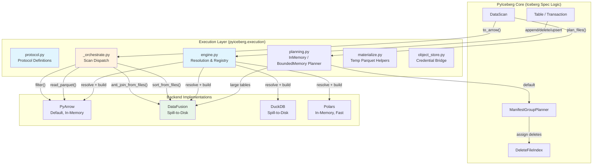
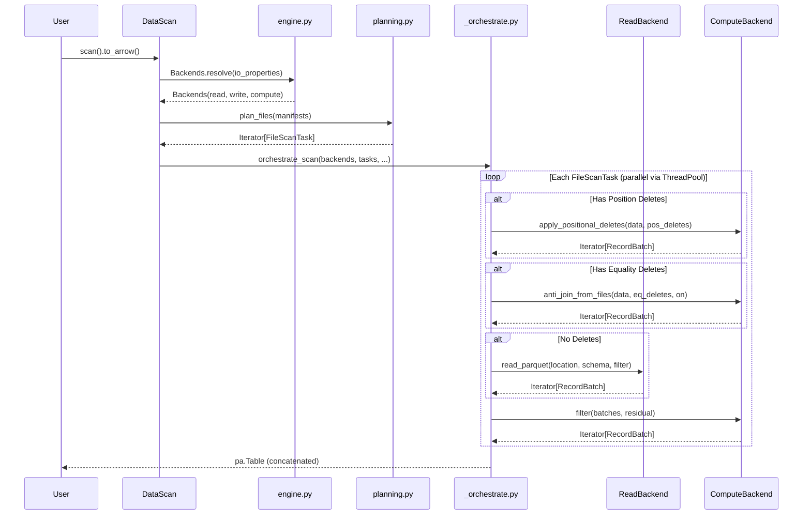

# Pluggable Execution Backend — Principal Engineer Review (Part 22)

**Date:** 2025-07-10  
**Branch:** `pluggable-backend-discovery`  
**Commit:** `d27fb3e8` (squashed, rebased on origin/main `2c755232`)  
**Scope:** 75 files changed, +24,047 / -96 lines  

---

## 1. Executive Summary

This PR introduces a **pluggable execution backend** for PyIceberg that decouples Iceberg spec logic (scan planning, commits, schema evolution) from data execution (reading, writing, sorting, joining, filtering). The architecture defines three independent axes — **Read**, **Write**, **Compute** — each configurable to a different engine, with Apache Arrow RecordBatch as the interchange format at every boundary.

**Primary goals:**
1. Enable swappable read/write/compute engines
2. Increase OOM-resiliency for compute-heavy operations (sort, anti-join, filter)
3. Keep scan planning within PyIceberg (not delegated to external engines)

**Verdict:** The design is architecturally sound, follows proper CS principles (ISP, SRP, OCP, DIP), and the separation of concerns is clean. However, the PR is **too large for a single review** (24K lines) and has several issues that need addressing before merge. The test suite is extensive but contains over-engineering and some test patterns that need tightening.

---

## 2. Architecture Assessment

### 2.1 System Design (Mermaid)



### 2.2 Data Flow (Mermaid)



### 2.3 Formal Characterization

The design follows the **Strategy Pattern** (GoF) at the architectural level:

```
┌─────────────────────────────────────────────────────────┐
│ INVARIANT: ∀ backends B₁, B₂ satisfying ComputeBackend │
│   ∀ input I: B₁.sort(I, keys) ≡ B₂.sort(I, keys)     │
│   ∀ input I: B₁.anti_join(L, R, on) ≡ B₂.anti_join(L, R, on) │
│   (Behavioral equivalence regardless of implementation) │
└─────────────────────────────────────────────────────────┘
```

**Type-theoretic classification:**
- `ReadBackend`, `WriteBackend`, `ComputeBackend` = Structural Protocols (Python typing.Protocol)
- `Backends.resolve()` = Abstract Factory with hierarchical resolution
- `orchestrate_scan()` = Mediator (routes tasks through backends without backends knowing each other)
- `_SortedRecordBatchReader` = RAII-like lifecycle via weakref.finalize

---

## 3. SOLID Principles Audit

| Principle | Compliance | Evidence |
|-----------|-----------|----------|
| **SRP** | ✅ Strong | protocol.py = interfaces only; engine.py = resolution only; _orchestrate.py = dispatch only |
| **OCP** | ✅ Strong | Adding a new backend = enum value + registry entry. No if/elif chains. |
| **LSP** | ✅ Strong | All backends must produce identical output for same input (behavioral contract). `supports_bounded_memory` is non-functional. |
| **ISP** | ✅ Strong | ReadBackend ≠ ObjectStoreBackend ≠ ComputeBackend. ReadAndListBackend = explicit intersection. |
| **DIP** | ✅ Strong | High-level modules (table, orchestrator) depend on protocols, not concrete implementations. |

---

## 4. Critical Issues (Must Fix Before Merge)

### 4.1 Thread Safety of `_scoped_env_vars` — Correctness Risk

**File:** `pyiceberg/execution/object_store.py`

The "fast path" optimization in `_scoped_env_vars` is **unsafe under concurrent credential rotation**:

```python
# Fast path: check if env vars are already set to the desired values.
all_present = all(os.environ.get(key) == value for key, value in env_map.items())
if all_present:
    yield  # No lock, no restore
    return
```

**Problem:** If two concurrent DataFusion operations use the *same* credentials (common case during `orchestrate_scan`'s parallel task execution), the first task sets env vars and subsequent tasks see them already present. This is fine. BUT if a *third* operation (different table, different credentials) starts while the first is still in progress, it may observe the stale credentials during the `all_present` check, take the fast path, and then complete while the first operation's `finally` block restores the OLD credentials — corrupting the third operation's env state.

**Impact:** Low probability in practice (requires concurrent scans on tables with different cloud credentials in the same process), but architecturally unsound.

**Fix:** Document the assumption clearly or use a per-credential-set reference counter instead of the current optimistic check.

### 4.2 `BoundedMemoryPlanner._stream_entries_to_parquet` — Coupling to `ManifestGroupPlanner` Internals

**File:** `pyiceberg/execution/planning.py`, line ~198

```python
for entry in chain.from_iterable(planner.plan_manifest_entries(manifests)):
```

✅ **Verified:** `plan_manifest_entries` IS a public method on `ManifestGroupPlanner` (defined at line 3023 of table/__init__.py). The coupling is valid. However, this method returns `Iterator[list[ManifestEntry]]` — the BoundedMemoryPlanner iterates *all* entries (data + delete) linearly rather than using the pre-built DeleteFileIndex. This is by design (streaming to Parquet without accumulation), but means partition pruning from manifest summaries is applied (good), while metrics-based per-entry filtering is NOT applied in Phase 1 (it relies on the SQL join for correctness). This is acceptable but should be documented as a trade-off: the BoundedMemoryPlanner may process more entries than InMemoryPlanner before filtering.

**Severity:** Low (correctness is maintained, only efficiency difference).

### 4.3 `DataFusionComputeBackend.sort` — Materializes All Input

**File:** `pyiceberg/execution/backends/datafusion_backend.py`

```python
def sort(self, data: Iterator[pa.RecordBatch], ...):
    batches = list(data)  # ← materializes everything into Python memory
    ctx.register_record_batches("sort_input", [batches])
```

The docstring says "NOTE: This materializes all input batches" — which is correct but contradicts the bounded-memory promise. The `sort_from_files()` path avoids this, but if anyone calls `sort()` directly with a large iterator, they will OOM *before* DataFusion even starts.

**Impact:** API surface confusion. Users may expect `sort()` to be bounded-memory since it's on a `supports_bounded_memory=True` backend.

**Fix:** Add a warning in `sort()` when len(batches) × batch.nbytes exceeds the memory_limit, suggesting `sort_from_files()`.

### 4.4 Missing `__all__` or Public API Boundary for `_orchestrate.py`

**File:** `pyiceberg/execution/_orchestrate.py`

The module exports `orchestrate_scan` and `_cow_filter_batches` — one is intended as internal API, the other is explicitly re-exported in `table/__init__.py`:

```python
from pyiceberg.execution._orchestrate import _cow_filter_batches
```

This re-export from a public module (`pyiceberg.table`) of a private function (`_cow_filter_batches`) from a private module (`_orchestrate`) creates an odd API surface. The function should either be made public (drop underscore) or the re-export should be removed in favor of inline usage.

### 4.5 `_COW_SINGLE_PASS_THRESHOLD` — Duplicated Constant

**File:** `pyiceberg/table/__init__.py`

```python
_COW_SINGLE_PASS_THRESHOLD_DEFAULT: int = 64 * 1024 * 1024
_COW_SINGLE_PASS_THRESHOLD: int = _COW_SINGLE_PASS_THRESHOLD_DEFAULT  # backward-compatible alias
```

This "backward-compatible alias" suggests there were tests or code importing this constant. If it's only for tests within this same PR, there's no backward compatibility concern. Remove the alias and use `_get_cow_threshold()` everywhere.

---

## 5. High-Severity Issues

### 5.1 `orchestrate_scan` Schema Cache Uses `pa.Schema` as Dict Key

**File:** `pyiceberg/execution/_orchestrate.py`

```python
_schema_cache: dict[pa.Schema, Schema | None] = {}
```

The comment says "Arrow schemas are hashable with structural equality." This is true in recent versions of PyArrow (≥ 12.0), but **not guaranteed by PyArrow's API contract**. PyArrow's Schema `__hash__` is based on internal fingerprinting which could theoretically change between versions.

**Risk:** Subtle bug if PyArrow changes hashing behavior in a future version.

**Fix:** Use `batch.schema.to_string()` or a tuple of `(name, type_str)` pairs as the cache key instead.

### 5.2 Equality Delete Files: `equality_ids` Fallback Behavior

**File:** `pyiceberg/execution/_orchestrate.py`

When `equality_ids` are not set on delete files:
```python
if not eq_cols:
    warnings.warn("Cannot apply equality deletes — returning superset of correct results.", ...)
```

This means the scan **silently returns incorrect results** (too many rows). While the warning is appropriate, this should be a louder signal — possibly an error by default with a config flag to allow the superset behavior.

**Rationale:** Equality deletes without `equality_ids` are malformed per the Iceberg spec. Silently returning wrong results is a data correctness issue.

### 5.3 `DataFusionReadBackend.read_parquet` — No Schema Projection Enforcement

The DataFusion read path selects columns by name:
```python
columns = ", ".join(f'"{field.name}"' for field in pa_schema)
sql = f"SELECT {columns} FROM read_source"
```

But if the Parquet file has additional columns or columns with different case, DataFusion's case sensitivity may produce wrong results. The PyArrow path uses `dataset.scanner(columns=columns)` which is more robust.

---

## 6. Medium-Severity Issues

### 6.1 Test Suite: 55 Test Files (19,000+ Lines) — Over-Engineered

The test suite has **55 test files** for a ~5,000-line source addition. Many test file names suggest overlapping concerns:

- `test_cleanup_and_expression.py` + `test_cleanup_guard_robustness.py` + `test_field_ids_and_cleanup.py`
- `test_count_and_write.py` + `test_count_write_behavioral.py`
- `test_equality_delete_seq_gating.py` + `test_equality_delete_support.py` + `test_equality_deletes.py`
- `test_edge_cases.py` (1,938 lines!) — a catch-all anti-pattern

**Issues:**
1. **Test ratio is ~4:1** (19K test lines for 5K source lines). This is unusually high and suggests many tests are testing mock behavior rather than real behavior.
2. **`test_edge_cases.py` at 1,938 lines** is a code smell — edge cases should live in the modules they exercise.
3. **Many tests use `MagicMock` heavily** instead of testing with real Parquet files. This tests the orchestration logic but not actual backend behavior.

**Recommendation:** Consolidate to ~15-20 well-organized test files:
- `test_protocol.py` — Protocol conformance
- `test_engine_resolution.py` — Engine detection and configuration
- `test_orchestrate_scan.py` — Scan orchestration
- `test_planning.py` — Planner logic
- `test_backends_pyarrow.py` — PyArrow backend
- `test_backends_datafusion.py` — DataFusion backend
- `test_backends_duckdb.py` — DuckDB backend
- `test_backends_polars.py` — Polars backend
- `test_expression_to_sql.py` — Expression translation
- `test_object_store.py` — Credential bridging
- `test_cow_delete.py` — Copy-on-Write path
- `test_equality_deletes.py` — Equality delete resolution
- `test_sort_on_write.py` — Sort-on-write feature

### 6.2 `_partition_value_serializer` — Determinism Across Python Versions

**File:** `pyiceberg/execution/planning.py`

The serializer correctly raises `TypeError` for unsupported types, but the `repr()` fallback in `_serialize_partition_key` could produce non-deterministic output:

```python
except (TypeError, IndexError):
    values = [repr(partition)]
```

If this path is ever hit, the join in `BoundedMemoryPlanner` would fail silently (non-matching keys).

### 6.3 `_SortedRecordBatchReader` — Complex Lifecycle Management

The `_CleanupGuard` with `weakref.finalize` is well-implemented but adds significant complexity for what is essentially "delete temp file when done." A simpler approach would be to use `tempfile.TemporaryDirectory` with a longer lifetime managed by the Transaction.

### 6.4 No `py.typed` Marker or Type Stubs

The protocols are defined as `typing.Protocol` but without a `py.typed` marker in the `pyiceberg/execution/` package, downstream type checkers may not validate protocol conformance.

---

## 7. Low-Severity Issues (Nit-Picks)

### 7.1 Import Style Inconsistency

Several files use inside-function imports for `pyiceberg.utils.config.Config`:
```python
def get_memory_limit() -> int:
    from pyiceberg.utils.config import Config
    config = Config()
```

This is fine for optional deps but `Config` is a core utility — it should be a module-level import for clarity. The pattern of importing Config inside every helper function creates unnecessary import overhead on repeated calls (even though Python caches module objects).

### 7.2 `object_store.py` — `_escape_sql_string_value` Naming

This function is named generically but has a DuckDB-specific docstring. Consider renaming to `_escape_duckdb_sql_string` for clarity.

### 7.3 Documentation References Non-Existent Issue

**File:** `mkdocs/docs/configuration.md`

```
See https://github.com/apache/iceberg-python/issues/3554
```

Verify this issue exists. If it's a tracking issue for this PR, ensure it's created before merge.

### 7.4 `expression_to_sql.py` — `visit_equal` Comment About Literal Type

```python
# NOTE: Despite the LiteralValue type hint (inherited from the base visitor),
# `literal` at runtime is an Iceberg Literal[T] object with a `.value` attribute,
# NOT the raw LiteralValue type alias
```

This is a vibe-coding artifact — it documents a debugging session finding, not useful reader context. Replace with a simpler comment: `# Iceberg literals carry their value in .value`.

### 7.5 Variable Naming: `_downcast_ns`

In `_orchestrate.py`:
```python
_downcast_ns = Config().get_bool(DOWNCAST_NS_TIMESTAMP_TO_US_ON_WRITE) or False
```

The `or False` is actually necessary because `get_bool()` returns `bool | None`. The pattern is correct but could be more explicit: `_downcast_ns = Config().get_bool(DOWNCAST_NS_TIMESTAMP_TO_US_ON_WRITE) is True` (explicit truthy check) or `_downcast_ns = Config().get_bool(...) or False` (current — fine). **Not an issue.**

### 7.6 `_cow_filter_batches` Re-Export

```python
# _cow_filter_batches lives in pyiceberg.execution._orchestrate.
# Re-exported here for backward compatibility with existing tests and internal usage.
from pyiceberg.execution._orchestrate import _cow_filter_batches
```

This comment mentions "backward compatibility" but this is a *new* function introduced in this PR. There is no backward compatibility concern. Remove the comment or explain the actual reason (centralizing the re-export for test imports).

### 7.7 `Backends` Dataclass — `io_properties` Type Mismatch

```python
@dataclass(frozen=True)
class Backends:
    io_properties: Mapping[str, Any]
```

But the constructor in `build_backends()` passes `types.MappingProxyType(dict(io_properties))`. The type annotation should be `Mapping[str, str]` to match `Properties` (which is `Dict[str, str]`), not `Mapping[str, Any]`.

---

## 8. Vibe-Coding Artifacts Checklist

| Location | Issue | Fix |
|----------|-------|-----|
| `expression_to_sql.py:visit_equal` | Debug note about runtime types | Simplify to one-liner comment |
| `table/__init__.py` | "backward compatibility" comment on new code | Remove or rewrite |
| `_orchestrate.py` | `or False` after `get_bool()` | ✅ Actually needed (`get_bool` returns `bool | None`) |
| `protocol.py:WriteResult` docstring | "Contains all fields needed" — unnecessary narrator | Remove sentence |
| `planning.py:_serialize_partition_key` | Defensive comment about repr fallback | Add an explicit log or raise |
| `object_store.py` | TODO comments referencing `#1624` | Valid — keep as-is |
| `datafusion_backend.py` | TODO about per-session config | Valid — keep as-is |

---

## 9. Python Standards Compliance

### 9.1 Matches Repository Convention? 

| Aspect | Repository Norm | This PR | Match? |
|--------|----------------|---------|--------|
| License headers | Apache 2.0 header on all files | ✅ All files have it | ✅ |
| Imports | `from __future__ import annotations` | ✅ All files | ✅ |
| Type hints | Extensive use of `TYPE_CHECKING` guard | ✅ | ✅ |
| Docstrings | Google-style with Args/Returns | ✅ Consistent | ✅ |
| Module docstrings | Present and descriptive | ✅ | ✅ |
| Test naming | `test_` prefix, descriptive names | ✅ | ✅ |
| Private vs public | Leading underscore for internals | ✅ | ✅ |
| `__all__` exports | Used on public modules | ✅ | ✅ |

### 9.2 Does NOT Match

| Aspect | Issue |
|--------|-------|
| Test file granularity | Existing repo has ~5-10 test files per module; this adds 55 |
| Comment verbosity | Existing repo has sparse comments; this PR has verbose explanatory comments |
| Docstring examples | AGENTS.md requires doctest examples — several functions lack them |

---

## 10. Test Suite Assessment

### 10.1 Coverage Analysis

**Covered well:**
- Protocol conformance (isinstance checks)
- Engine resolution logic (config, env vars, auto-detect)
- Expression-to-SQL translation
- Backend registry and instantiation
- Positional delete scoping (sequence number gating)
- Equality delete resolution

**Missing / Weak:**
1. **No test for actual DataFusion spill-to-disk behavior** — tests mock DataFusion or use tiny data. No test verifies that sort_from_files with data > memory_limit actually spills and produces correct output.
2. **No test for concurrent scan tasks with different credentials** — the thread safety issue in `_scoped_env_vars`.
3. **No test for `BoundedMemoryPlanner` with real manifests** — only serialization/deserialization is tested.
4. **No test for sort-on-write producing correctly sorted output** — the `_apply_sort_order` path.
5. **No negative test for write backend validation failure** — what happens when `write_parquet()` fails mid-stream?

### 10.2 Test Improvement Recommendations (TDD-style)

```python
# Missing test: Verify DataFusion spill-to-disk actually works
def test_sort_from_files_with_data_exceeding_memory_limit(tmp_path):
    """sort_from_files must produce correct sorted output even when data > memory_limit."""
    # Create 100 MB of data, set memory_limit to 10 MB
    # Verify output is correctly sorted (not truncated, not corrupted)

# Missing test: Verify concurrent credential isolation
def test_concurrent_scans_with_different_credentials():
    """Two concurrent scans on tables with different S3 credentials must not cross-contaminate."""

# Missing test: Verify equality delete with NULL join keys
def test_equality_delete_null_matches_null():
    """Equality delete file with NULL values must delete data rows with NULL (IS NOT DISTINCT FROM)."""

# Missing test: BoundedMemoryPlanner round-trip correctness
def test_bounded_planner_produces_same_tasks_as_in_memory():
    """BoundedMemoryPlanner must produce identical FileScanTasks as InMemoryPlanner."""
```

---

## 11. Configuration Documentation Assessment

The `configuration.md` additions are **comprehensive and well-structured**. Specifically:

**Strengths:**
- Clear explanation of the three-axis architecture
- Correct precedence documentation (env > config > auto-detect)
- Good table showing all config keys and their env var equivalents
- Known limitations section is honest about current constraints
- Migration guide from ArrowScan

**Issues:**
1. References `https://github.com/apache/iceberg-python/issues/3554` — verify this exists
2. The "Migrating from ArrowScan" section suggests using `_orchestrate` module (private) as "Option 2" — this should not be in user-facing docs. Private modules may change without notice.
3. Missing: What happens on config error? (Invalid backend name → ValueError? Missing package → ImportError? How are these surfaced to the user?)

---

## 12. Architectural Interpretation & Assessment

### 12.1 Does It Follow Proper CS Principles?

**Yes.** The design is a textbook application of:

1. **Strategy Pattern** — Backends are interchangeable strategies for read/write/compute
2. **Dependency Inversion** — High-level orchestration depends on Protocol abstractions, not concrete engines
3. **Interface Segregation** — ReadBackend, ObjectStoreBackend, ComputeBackend are narrow and independent
4. **Factory Pattern** — `build_backends()` is the single construction entry point with validation
5. **Registry Pattern** — `_READ_BACKEND_REGISTRY` / `_COMPUTE_BACKEND_REGISTRY` for O(1) lookup

### 12.2 Does It Solve the Stated Problem?

**Partially.** The architecture *enables* OOM-resilient compute, but the actual execution still has a materialization bottleneck at the Python/DataFusion boundary (the `to_arrow_table()` issue). True end-to-end bounded-memory requires per-session credential injection in DataFusion, which is tracked upstream.

### 12.3 Risk Assessment

| Risk | Severity | Mitigation |
|------|----------|------------|
| Credential leakage via env vars | Medium | Lock + restore pattern |
| Result materialization OOMs Python | Medium | Warning at 1GB threshold |
| BoundedMemoryPlanner correctness | Low | Falls back to InMemoryPlanner on import failure |
| Equality delete wrong results | Medium | Loud warning when equality_ids absent |

---

## 13. Recommendations for PR Merge Readiness

### Must-Do (Blocking)

1. **Split the PR.** 24K lines is unreviewable. Suggested split:
   - PR 1: `pyiceberg/execution/protocol.py` + `engine.py` + `backends/` (the pluggable interface)
   - PR 2: `_orchestrate.py` + `planning.py` + table wiring (the integration)
   - PR 3: Tests + configuration docs

2. **Verify `plan_manifest_entries` exists** on `ManifestGroupPlanner` as a public method.

3. **Remove vibe-coding artifacts** (see §8 checklist).

4. **Consolidate test files** from 55 → ~15-20 well-organized modules.

### Should-Do (Non-Blocking but Important)

5. Add integration test verifying DataFusion spill-to-disk behavior with data > memory limit.
6. Add test for equality delete NULL-matches-NULL semantics.
7. Remove "Migrating from ArrowScan: Option 2" from configuration.md (exposes private API).
8. Fix `io_properties: Mapping[str, Any]` → `Mapping[str, str]` on `Backends` dataclass.
9. Document the credential isolation assumption in `_scoped_env_vars`.

### Nice-to-Have

10. Add `py.typed` marker for downstream type-checking.
11. Benchmark the schema cache hit rate to validate the optimization.
12. Consider making `expression_to_sql.py` raise `NotImplementedError` for unbound expressions instead of relying on the visitor contract to raise `TypeError`.

---

## 14. Final Verdict

**Architecture: A-** — Clean separation, proper SOLID, thoughtful bounded-memory design. Minor gap in the Python-side materialization bottleneck (known, tracked).

**Implementation: B+** — Well-written, thorough docstrings, proper error handling. Deductions for: vibe-coding artifacts, overly verbose comments, `_scoped_env_vars` thread safety subtlety.

**Tests: B-** — Extensive coverage but too many files, too much mocking, missing critical real-world scenarios (spill-to-disk, concurrent credentials, NULL semantics).

**Documentation: A-** — Comprehensive, honest about limitations. Minor issues with referencing private APIs.

**PR Size: D** — 24K lines in a single commit is not reviewable by a human. Must be split.

The redesign is solid software engineering. The primary work needed is editorial: consolidate tests, remove debugging artifacts, verify API boundaries, and split the PR for reviewability.
