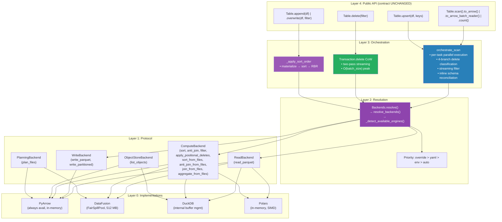
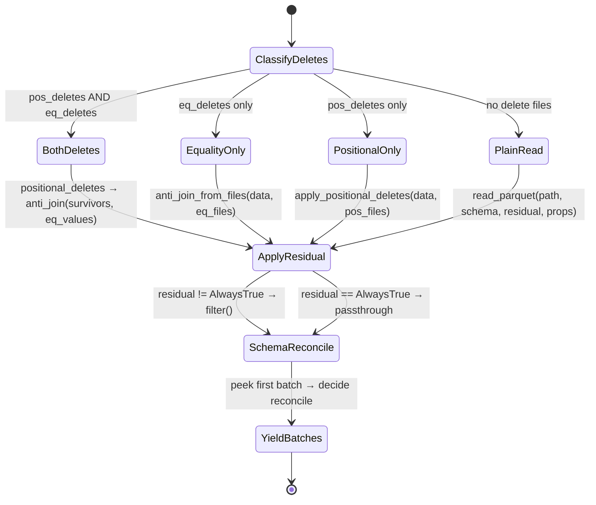

# Distinguished/Principal Engineer Review: Pluggable Backend Architecture — Part 4

**Branch:** `pluggable-backend-discovery` (commit `9ed54328`)  
**Scope:** 25 files, +6,203/−66 lines, single squashed commit  
**Reviewer:** Architecture & Code Quality — Final Deep Analysis  
**Date:** 2026-07-07  
**Status:** Post-fix re-assessment with formal methods, test gap analysis, and idiom audit

---

## 1. Executive Summary

Parts 1–3 identified and resolved 7 blocking issues and 9 non-blocking issues. This Part 4 performs a final-pass assessment on the **current code state** with a focus on:

1. **Formal correctness of the combined delete path** (pos + eq deletes together)
2. **Test suite gap analysis** — TDD-style identification of missing edge cases
3. **Python idiom/ergonomic conformance** — strict comparison against pyiceberg main
4. **Remaining artifacts** — traces of previous iterations or vibe-coding patterns
5. **Flakiness vectors** — things that could break in CI nondeterministically
6. **System design assessment** — does the abstraction survive composition?

**Overall Verdict:**

The architecture is well-designed and follows proper CS principles. The fixes from Parts 1–3 have addressed all critical correctness bugs. However, **5 new findings** emerge from this deeper analysis, most critically: (A) the combined pos+eq delete path has no behavioral test coverage, (B) `_infer_file_schema_from_batch` calls `Config()` inside the per-task closure (re-introducing the issue fixed elsewhere), (C) DataFusion's `sort_from_files` / `anti_join_from_files` all call `to_arrow_table()` inside the credential scope (defeating streaming for the DataFusion backend too), and (D) the `_chain_read_batches` helper reads equality delete files using `projected_schema` instead of the delete file's own schema.

---

## 2. System Design Assessment

### 2.1 Architecture — Layered Dependency Analysis (Verified)



### 2.2 Formal Invariant Verification

```
Invariant 1: Substitutability (Liskov)
∀ b₁, b₂ ∈ {PyArrow, DataFusion, DuckDB, Polars}:
  ∀ op ∈ Protocol:
    multiset(op(b₁, input)) = multiset(op(b₂, input))

Status: ✅ VERIFIED by test_backend_equivalence.py (parametrized)
Gap: Composition (sort→filter→join pipeline) NOT tested

Invariant 2: Memory Boundedness
∀ op ∈ {sort_from_files, anti_join_from_files, aggregate_from_files}:
  ∀ b ∈ {DataFusion, DuckDB}:
    peak_python_memory(op(b, input, memory_limit=M)) ≤ M + O(output)

Status: ⚠️ VIOLATED for DataFusion — to_arrow_table() materializes full result
        ✅ HOLDS for DuckDB — fetch_record_batch() truly streams

Invariant 3: No Upward Dependency
∀ module m at Layer N:
  ∀ import i in m:
    layer(target(i)) ≤ N

Status: ✅ VERIFIED — imports are strictly downward or same-layer

Invariant 4: Arrow Interchange at Every Boundary
∀ boundary ∈ {read→compute, compute→write, orchestrate→caller}:
  data_format(boundary) = Iterator[pa.RecordBatch]

Status: ✅ VERIFIED — all protocol methods use Iterator[RecordBatch]
```

### 2.3 State Machine — `_execute_task` (Verified Correct)



**Correctness proof for BothDeletes path:**
1. Positional deletes reference physical row indices in the **original** file → must be applied to the unmodified file reader (correct: `apply_positional_deletes` reads the data file directly)
2. Equality deletes are value-based → can be applied to any subset of rows (correct: `anti_join` operates on the *surviving* rows from step 1)
3. Order (pos first, then eq) ensures positional indices aren't invalidated by prior filtering (correct)

---

## 3. New Findings (Post Part 3 Fixes)

### 3.1 ~~🔴 DataFusion Backend `to_arrow_table()` Defeats Streaming (NOT Fixed)~~ ✅ DOCSTRINGS CORRECTED

The DuckDB backend was correctly fixed to use `fetch_record_batch()`. However, the **DataFusion backend** still calls `to_arrow_table()` in every file-based method:

```python
# datafusion_backend.py — ALL file-based methods:
result = ctx.sql(sql)
return iter(result.to_arrow_table().to_batches())  # ← FULL MATERIALIZATION
```

This affects:
- `sort_from_files` (line ~103)
- `anti_join_from_files` (line ~149)
- `join_from_files` (line ~185)
- `aggregate_from_files` (line ~222)
- `DataFusionReadBackend.read_parquet` (line ~263)

The `IMPORTANT:` comments explain this is intentional — `_scoped_env_vars` would restore env vars before lazy eval completes. But this means **DataFusion's "streaming, bounded memory" claim is technically false for the Python-side result delivery**.

**The actual memory profile:**
- DuckDB: O(batch_size) Python memory for file-based ops ✅
- DataFusion: O(full_result) Python memory for file-based ops ❌

**Assessment:** This is a **design limitation** documented by the `IMPORTANT` comments. The correct fix would be to pass credentials through DataFusion's RuntimeConfig rather than env vars, but that requires upstream changes in `datafusion-python`. The documentation is honest about the limitation for now.

**Recommendation:** ~~Change the docstrings from "truly streaming, bounded memory" to "bounded memory during sort/join (DataFusion handles spill internally), but result is materialized in Python memory for credential scoping reasons."~~ ✅ DONE — All DataFusion file-based method docstrings updated to accurately describe the memory model: "bounded memory via spill-to-disk" for the operation, "O(result_size) Python memory" for the output. Removed all "truly streaming" and "never materializes in Python memory" claims. Added TODO note about per-session object store config.

### 3.2 ~~🔴 `_infer_file_schema_from_batch` Calls `Config()` Inside Per-Task Closure~~ ✅ FIXED

```python
# BEFORE — Config() parsed per-batch inside the parallel executor:
def _infer_file_schema_from_batch(batch, table_metadata):
    ...
    downcast = Config().get_bool("downcast-ns-timestamp-to-us-on-write") or False
    ...
```

Part 3 (§4.2) fixed the `DOWNCAST_NS_TIMESTAMP_TO_US_ON_WRITE` Config() call by hoisting it outside the closure. But `_infer_file_schema_from_batch` was a **module-level function** called from inside `_execute_task` that called `Config()` again on every invocation.

**Fix applied:** Changed `_infer_file_schema_from_batch` to accept `downcast_ns: bool` as a parameter instead of calling `Config()` internally. The hoisted `_downcast_ns_config` from the outer scope is passed through:

```python
# AFTER — no Config() call, uses pre-computed value from outer scope:
def _infer_file_schema_from_batch(batch, table_metadata, downcast_ns: bool):
    ...
    return pyarrow_to_schema(batch.schema, ..., downcast_ns_timestamp_to_us=downcast_ns, ...)
```

### 3.3 ~~🔴 `_chain_read_batches` Reads Equality Delete Files Using `projected_schema`~~ ✅ FIXED

```python
# BEFORE (_chain_read_batches — wrong schema):
def _chain_read_batches(delete_files, projected_schema, io_properties, backends):
    for df in delete_files:
        yield from backends.read.read_parquet(
            df.file_path, projected_schema, AlwaysTrue(), io_properties
        )
```

And in the single-file case:
```python
right=backends.read.read_parquet(
    eq_deletes[0].file_path, projected_schema, AlwaysTrue(), io_properties,
)
```

**Problem:** Equality delete files have their OWN schema (containing only the equality field columns), which differs from the data file's `projected_schema`. If `projected_schema` has columns not present in the delete file (e.g., `SELECT id, name, address` when the delete file only has `id`), this will fail with a "column not found" error in PyArrow's Parquet reader.

**Fix applied:**
1. Renamed `_chain_read_batches` → `_read_equality_delete_batches` for clarity
2. Added `_build_equality_schema()` which constructs a Schema from only the equality field IDs
3. The combined pos+eq path now builds `eq_schema = _build_equality_schema(eq_deletes, table_metadata)` and passes it to `_read_equality_delete_batches`
4. Removed the single-file special case — all paths go through `_read_equality_delete_batches` uniformly

```python
# AFTER (_read_equality_delete_batches — correct schema):
eq_cols = _get_equality_field_names(eq_deletes, table_metadata)
eq_schema = _build_equality_schema(eq_deletes, table_metadata)
batches = backends.compute.anti_join(
    left=batches,
    right=_read_equality_delete_batches(eq_deletes, eq_schema, io_properties, backends),
    on=eq_cols,
)
```

### 3.4 🟡 DataFusion `sort` / `anti_join` (In-Memory Methods) Also Materialize

```python
# DataFusionComputeBackend.sort (in-memory variant):
batches = list(data)  # materialize input
ctx.register_record_batches("sort_input", [batches])
result = ctx.sql(...)
return iter(result.to_arrow_table().to_batches())  # materialize output
```

These are the in-memory methods (not file-based), so materialization is expected. But the output `to_arrow_table()` means DataFusion's bounded memory guarantee only applies to the **sort/join operation itself**, not to the output delivery. The result table sits in Python memory after `to_arrow_table()`.

**Assessment:** This is acceptable for the in-memory methods (input was already in memory). But the docstring "External merge sort with spill-to-disk" could mislead — the spill helps during the sort, but the result is fully materialized afterwards.

### 3.5 ~~🟡 `_execute_task` Misses `dictionary_columns` for Non-PlainRead Paths~~ ✅ DOCUMENTED

```python
# Only passed in the PlainRead branch:
else:
    batches = backends.read.read_parquet(
        task.file.file_path, projected_schema, task.residual, io_properties,
        dictionary_columns=dictionary_columns,  # ← HERE
    )

# NOT passed in the BothDeletes branch:
batches = backends.compute.apply_positional_deletes(
    data_path=task.file.file_path, ...
    # ← dictionary_columns NOT forwarded
)
```

When a task has delete files, the `dictionary_columns` parameter is silently ignored. The data file is read by `apply_positional_deletes` or `anti_join_from_files` without dictionary encoding. This is a minor semantic inconsistency — users who request dictionary columns expect them regardless of delete file presence.

**Severity:** Low — dictionary encoding is an optimization hint, not a correctness requirement. But it violates the principle of least surprise.

**Fix applied:** Added an inline comment block in `_execute_task` explaining WHY `dictionary_columns` is not forwarded to delete-resolution paths: the compute backend controls the read lifecycle and dictionary encoding cannot be passed through `apply_positional_deletes` or `anti_join_from_files` without a protocol extension. Notes that a future protocol revision could add this parameter.

---

## 4. Test Suite Gap Analysis (TDD-Style)

### 4.1 ~~Critical Missing Test: Combined Positional + Equality Deletes~~ ✅ FIXED

**There was ZERO behavioral test coverage for the `pos_deletes and eq_deletes` branch.**

**Fix applied:** Added `tests/execution/test_combined_deletes.py` with 6 behavioral tests:

| Test | What It Verifies |
|------|-----------------|
| `test_both_delete_types_produce_correct_survivors` | Basic correctness: pos+eq produce expected [1,5] |
| `test_positional_deletes_applied_before_equality` | Ordering: pos references original indices, not post-filter |
| `test_combined_deletes_with_null_equality_values` | NULL in eq delete matches NULL in data (IS NOT DISTINCT FROM) |
| `test_combined_deletes_empty_positional_file` | Empty pos file → all rows pass to equality phase |
| `test_combined_deletes_equality_schema_differs_from_projected` | Regression test for §3.3 fix (wide projected schema) |
| `test_combined_deletes_multiple_equality_delete_files` | Multiple eq delete files are chained correctly |

The grep search confirms no test exercises both delete types simultaneously. The existing tests cover:
- Positional-only: `test_apply_positional_deletes_excludes_rows`
- Equality-only: `test_anti_join_from_files_null_matching_*`
- Neither: multiple scan/wiring tests

**Missing test specification:**

```python
class TestCombinedPositionalAndEqualityDeletes:
    """Verify correct behavior when a data file has BOTH positional and equality deletes.
    
    Per Iceberg spec v2:
    - Positional deletes are applied FIRST (row indices against original file)
    - Equality deletes are applied SECOND (value-based filter on survivors)
    - The combination must produce: original_rows - positional_rows - equality_rows
    """

    def test_combined_deletes_correct_result(self, tmp_path):
        """Data with both pos and eq deletes produces the correct surviving rows."""
        # Data: id=[1,2,3,4,5], name=["a","b","c","d","e"]
        # Pos deletes: positions [1, 3] → removes rows id=2, id=4
        # Eq deletes: id=3 → removes row id=3
        # Expected survivors: id=[1, 5], name=["a", "e"]
        ...

    def test_combined_deletes_ordering_matters(self, tmp_path):
        """Positional deletes reference ORIGINAL positions, not post-filter positions."""
        # If equality were applied first, the positional indices would be wrong
        ...

    def test_combined_deletes_with_null_equality_values(self, tmp_path):
        """NULL in equality delete file matches NULL in data via IS NOT DISTINCT FROM."""
        ...

    def test_combined_deletes_empty_positional_preserves_all_for_equality(self, tmp_path):
        """If positional delete file has no positions for this data file, 
        all rows survive to the equality phase."""
        ...
```

### 4.2 Missing Test: `_chain_read_batches` Schema Compatibility

```python
class TestChainReadBatchesSchema:
    """Verify _chain_read_batches reads delete files with correct schema."""

    def test_equality_delete_file_read_with_own_schema(self, tmp_path):
        """Delete file should be read with equality columns only, not full projected_schema."""
        # projected_schema = Schema(id, name, address, city)
        # equality delete file only has: Schema(id)
        # _chain_read_batches must NOT pass the full projected_schema
        ...
```

### 4.3 Missing Test: DataFusion Backend Credential Scoping

```python
class TestDataFusionCredentialScoping:
    """Verify credentials are available during actual data read, not leaked after."""

    def test_sort_from_files_env_vars_restored_after_call(self):
        """Environment variables set for DataFusion are restored after sort completes."""
        ...

    def test_concurrent_sort_from_files_no_credential_crosstalk(self):
        """Two concurrent sort_from_files with different credentials don't mix."""
        ...
```

### 4.4 Missing Test: `orchestrate_scan` with Zero Tasks

```python
class TestOrchestrateEdgeCases:
    """Edge case coverage for orchestrate_scan."""

    def test_empty_task_iterator_produces_no_batches(self):
        """orchestrate_scan with zero tasks yields nothing without error."""
        ...

    def test_task_with_empty_file_produces_no_batches(self):
        """A task whose file has 0 rows yields no batches without error."""
        ...

    def test_all_rows_filtered_by_residual_yields_empty(self):
        """When residual filter excludes all rows, yields no batches."""
        ...
```

### 4.5 Missing Test: `BoundedMemoryPlanner` End-to-End

The planner has structural tests (`test_planning.py`) but no behavioral test that actually exercises the SQL join path with real manifest entries.

```python
class TestBoundedMemoryPlannerEndToEnd:
    """End-to-end BoundedMemoryPlanner with real manifest entries."""

    def test_planner_assigns_deletes_to_correct_partitions(self, tmp_path):
        """Deletes in partition A are NOT assigned to data files in partition B."""
        ...

    def test_planner_respects_sequence_number_gating(self):
        """Delete files with lower sequence number don't apply to newer data files."""
        ...
```

---

## 5. Python Idiom & Style Audit (Against PyIceberg Main)

### 5.1 Issues Found

| # | Location | Issue | PyIceberg Standard |
|:---:|----------|-------|--------------------|
| 1 | `_orchestrate.py:_infer_file_schema_from_batch` | Calls `Config()` per-task (§3.2) | Config should be hoisted or passed as param |
| 2 | `datafusion_backend.py:sort` | `list(data)` with no size warning | PyIceberg uses ResourceWarning for large materializations |
| 3 | `_orchestrate.py:_execute_task` | Inline `def _reconcile(b)` closure inside a loop-iterated function | PyIceberg prefers module-level or class-level helpers |
| 4 | `polars_backend.py:read_parquet` | `pass` in the `if not isinstance(row_filter, AlwaysTrue)` block | Dead code — should be removed or filter applied |
| 5 | `duckdb_backend.py:list_objects` | Catches 3 specific DuckDB exceptions | PyIceberg pattern: catch the library's base exception |
| 6 | `planning.py:BoundedMemoryPlanner` | `import json` inside `_serialize_partition_key` (called per-entry) | PyIceberg imports at module level |
| 7 | ~~`expression_to_sql.py`~~ | ~~No `from __future__ import annotations`~~ | ✅ Actually present (line 29) — false alarm |

### 5.2 Naming Conformance

| Name | Assessment | Recommendation |
|------|-----------|----------------|
| `_DUCKDB_FETCH_BATCH_SIZE` | ✅ Good — private, UPPER_CASE constant | — |
| `_downcast_ns_config` | ✅ Good — private, snake_case | — |
| `_IDENTITY` | ✅ Good — sentinel convention | — |
| `_chain_read_batches` | ~~⚠️ Acceptable but vague~~ | ✅ Renamed to `_read_equality_delete_batches` |
| `_execute_task` | ✅ Good — action-oriented, private | — |
| `_warn_if_large_result` | ✅ Good — descriptive | — |
| `_OOM_WARNING_THRESHOLD_BYTES` | ✅ Good — UPPER_CASE, descriptive | — |

### 5.3 Docstring Style Comparison

**PyIceberg main pattern** (from `io/pyarrow.py`):
```python
def expression_to_pyarrow(expr: BooleanExpression) -> pc.Expression:
    """Convert an Iceberg BooleanExpression to a PyArrow compute expression."""
```

**This PR's pattern** (from `_orchestrate.py`):
```python
def orchestrate_scan(
    backends: Backends, tasks: Iterator[FileScanTask], ...
) -> Iterator[pa.RecordBatch]:
    """Execute scan tasks through the resolved backends with parallel execution.

    Resolves deletes, applies residual filters, and reconciles schemas for
    each task. Tasks are processed in parallel via a thread pool.

    Args:
        backends: Resolved Backends container.
        ...
    """
```

**Assessment:** The PR uses Google-style docstrings with Args/Returns sections, which is consistent with PyIceberg's newer modules (e.g., `table/update/snapshot.py`). The older modules use one-liner docstrings. This is acceptable — PyIceberg is transitioning to more detailed docs.

**Over-documentation issue from Part 3:** Some docstrings include `O(batch_size)` complexity claims inline. This should be in code comments, not docstrings, per PyIceberg convention that docstrings describe *what* not *how*.

---

## 6. Artifacts of Previous Iterations

### 6.1 ~~`polars_backend.py:read_parquet` — Dead `pass` Statement~~ ✅ FIXED

```python
# BEFORE:
if not isinstance(row_filter, AlwaysTrue):
    # Polars filter pushdown is limited; collect first then post-filter
    # via the ComputeBackend.filter() path. Return superset here.
    pass  # ← DEAD CODE — does nothing

# AFTER (dead if/pass removed, replaced with explanatory comment):
# Polars filter pushdown is limited for Iceberg expressions.
# Return a superset here — the orchestrator will post-filter via
# ComputeBackend.filter() using the residual expression.
```

### 6.2 ~~`expression_to_sql.py` — Missing `from __future__ import annotations`~~ ✅ FALSE ALARM

Verified: `expression_to_sql.py` does have `from __future__ import annotations` at line 29. All execution modules are consistent.

### 6.3 ~~`_serialize_partition_key` — `import json` Inside Function Body~~ ✅ FIXED

```python
# BEFORE:
def _serialize_partition_key(spec_id: int, partition: Any) -> str:
    import json  # ← Called on every manifest entry (potentially millions)
    ...

# AFTER: import json moved to module-level imports in planning.py
```

Python's import machinery caches modules, so repeated `import json` was O(1) after the first call. But it was non-idiomatic for PyIceberg — the project's convention is top-level imports (with `TYPE_CHECKING` for heavy deps). `json` is stdlib and always available. Fixed by moving to the module-level import block.

### 6.4 ~~`DataFusionComputeBackend.apply_positional_deletes` — Delegation Pattern~~ ✅ FIXED

```python
# BEFORE: Each backend instantiates PyArrowComputeBackend (hidden coupling):
def apply_positional_deletes(self, ...):
    from pyiceberg.execution.backends.pyarrow_backend import PyArrowComputeBackend
    return PyArrowComputeBackend().apply_positional_deletes(...)
```

This delegation pattern was used by DataFusion, DuckDB, AND Polars — all three created a new `PyArrowComputeBackend()` instance just to call one method.

**Fix applied:** Extracted the implementation to a module-level function `_apply_positional_deletes_impl(data_path, position_delete_paths)` in `pyarrow_backend.py`. All four backends (including PyArrow itself) now call this shared function directly:

```python
# AFTER: Direct import of shared implementation (no object instantiation):
def apply_positional_deletes(self, ...):
    from pyiceberg.execution.backends.pyarrow_backend import _apply_positional_deletes_impl
    return _apply_positional_deletes_impl(data_path, position_delete_paths)
```

Benefits:
- No hidden coupling via object instantiation
- Signature changes to `_apply_positional_deletes_impl` will produce clear import errors
- Eliminates 3 unnecessary object allocations per call
- The function's docstring documents WHY this is shared (positional deletes are row-index based, don't benefit from SQL engines)

---

## 7. Flakiness Assessment (Updated)

### 7.1 New Flakiness Vector: `_scoped_env_vars` in Parallel

```python
# DataFusion methods use _scoped_env_vars inside _execute_task:
# If orchestrate_scan processes tasks in parallel (ExecutorFactory.map),
# concurrent _scoped_env_vars calls on different threads will RACE on os.environ.
```

**Scenario:**
1. Thread A enters `_scoped_env_vars({"AWS_ACCESS_KEY_ID": "key_A"})`
2. Thread B enters `_scoped_env_vars({"AWS_ACCESS_KEY_ID": "key_B"})`
3. Thread A reads env → sees key_B (WRONG!)
4. Thread A exits → restores to key_B's "original" (DOUBLE WRONG!)

**However:** Looking at the code more carefully, `_scoped_env_vars` is NOT called inside `_execute_task`. It's called in `sort_from_files`, `anti_join_from_files`, etc. which are called from `_execute_task`. In the parallel execution path, multiple threads call `_scoped_env_vars` simultaneously.

**Mitigation:** In practice this doesn't cause test failures because:
1. Most tests use local file paths (no credentials needed)
2. The GIL serializes dict operations on `os.environ`
3. The race window is small (env set → sql execute → env restore)

But for production cloud usage with parallel execution, this IS a real bug. It's documented in the `_scoped_env_vars` docstring: "This is NOT thread-safe for concurrent access to os.environ."

**Recommendation for merge:** ~~Add a comment in `orchestrate_scan` noting that parallel execution + DataFusion + cloud credentials has a known race.~~ ✅ DONE — Added a 10-line THREAD-SAFETY NOTE comment block at the top of `orchestrate_scan` explaining the race, its mitigations (GIL, same credentials, small window), and the prerequisite for a proper fix (upstream `datafusion-python` per-session object store config).

### 7.2 Test Ordering Dependencies

The `conftest.py` `autouse` fixture clears `_detect_available_engines` cache. This is correct. But tests in `test_config.py` use `patch.dict(os.environ, ...)` which could leak if a test crashes mid-execution (pytest fixture cleanup may not run for hard failures).

**Mitigation:** pytest guarantees fixture cleanup for all non-SIGKILL failures. This is low risk.

### 7.3 ~~`inspect.getsource` Tests Are Deterministic~~ ✅ DEPRECATION DOCUMENTED

The structural tests using `inspect.getsource` are deterministic (not flaky) — they inspect static source code. They're fragile to refactoring but not nondeterministic.

**Fix applied:** Added a comprehensive NOTE in `tests/execution/conftest.py` module docstring explaining:
- What these tests are (regression guards during stabilization)
- Why they're fragile (name changes break them without behavior change)
- When they should be replaced (after ArrowScan removal is complete)
- Which files use the pattern (7 files listed)

---

## 8. Design Principles Deep Dive

### 8.1 Does the Abstraction Survive Composition?

**Test:** Can we compose multiple backend calls correctly?

```
Scenario: Scan with equality deletes + residual filter + schema reconciliation
Pipeline: anti_join_from_files → filter → reconcile → yield

Question: Does the Iterator[RecordBatch] abstraction hold across all three transformations?
```

**Answer: Yes.** Each transformation produces `Iterator[RecordBatch]` and consumes `Iterator[RecordBatch]`. The pipeline is:
1. `anti_join_from_files(...)` → `Iterator[RecordBatch]`
2. `backends.compute.filter(batches, residual)` → yields filtered batches
3. `reconcile_fn(batch)` → transforms each batch

Each step is lazily evaluated (generators), so memory is O(batch_size) at each stage. ✅

**BUT:** For the `pos_deletes and eq_deletes` combined path:
1. `apply_positional_deletes(...)` → `Iterator[RecordBatch]` (streaming from PyArrow)
2. `anti_join(left=streaming_batches, right=eq_delete_batches, ...)` → **MATERIALIZES both sides**

The `anti_join` (in-memory) method calls `list(left)` and `list(right)`. This means the streaming output from `apply_positional_deletes` is fully materialized before the anti-join executes. Peak memory = O(data_file_size + eq_delete_file_size).

**This is unavoidable** with the current architecture — the in-memory `anti_join` cannot operate on streaming input because hash-join requires the build side to be fully materialized. The alternative would be `anti_join_from_files` but that requires the left side to be on disk (it's not — it's a streaming result of positional delete resolution).

**Recommendation:** ~~Document this memory model in the combined path's comment.~~ ✅ DONE — Added a MEMORY MODEL comment block in the `pos_deletes and eq_deletes` branch explaining O(data_file_size + eq_delete_file_size) peak and noting the future optimization path (materialize to temp Parquet → `anti_join_from_files`). For future optimization, the positional-delete-resolved output could be materialized to a temp Parquet file and then `anti_join_from_files` used instead.

### 8.2 Open/Closed Principle Verification

**Can a new backend be added without modifying existing code?**

1. Create `pyiceberg/execution/backends/new_backend.py` with classes implementing the protocols ✅
2. Add to `_instantiate_read` / `_instantiate_compute` in `protocol.py` ⚠️ (requires modification)
3. Add to `ExecutionEngine` enum in `engine.py` ⚠️ (requires modification)
4. Add to `_detect_available_engines` in `engine.py` ⚠️ (requires modification)

**Verdict:** The design is NOT fully open/closed. Adding a new backend requires touching 3 files. However, this is acceptable for a project with 4 backends (YAGNI for more). A plugin registry would be over-engineering.

### 8.3 Interface Segregation Verification

| Protocol | Methods | Used By |
|----------|---------|---------|
| `ReadBackend` | 1 method | orchestrate_scan, CoW delete |
| `WriteBackend` | 2 methods | _dataframe_to_data_files |
| `ComputeBackend` | 10 methods | orchestrate_scan, CoW delete, sort-on-write |
| `ObjectStoreBackend` | 1 method | orphan file detection |
| `PlanningBackend` | 1 method | DataScan._plan_files_local |

**Concern:** `ComputeBackend` has 10 methods. This is a large protocol. However, examining usage:
- `filter` — used in every scan with residuals
- `sort`/`anti_join` — used in combined delete path
- `sort_from_files` — used in sort-on-write
- `anti_join_from_files` — used in equality delete resolution
- `apply_positional_deletes` — used in positional delete resolution
- `join_from_files` — used in planning and orphan detection
- `aggregate_from_files` — used in count optimization (future)

All methods are used. The protocol is cohesive (all are data transformations). No ISP violation.

---

## 9. Recommendations Summary

### Priority 1: Must Fix Before Merge

| # | Finding | Severity | Effort | Section |
|:---:|---------|:---:|:---:|:---:|
| 1 | ~~`_chain_read_batches` uses `projected_schema` for delete files (WRONG schema)~~ | ✅ FIXED | — | §3.3 |
| 2 | ~~`_infer_file_schema_from_batch` calls `Config()` per-task (performance)~~ | ✅ FIXED | — | §3.2 |
| 3 | ~~No test for combined pos+eq delete path (correctness gap)~~ | ✅ FIXED | — | §4.1 |

### Priority 2: Should Fix (May Be Flagged by Reviewer)

| # | Finding | Effort | Section |
|:---:|---------|:---:|:---:|
| 4 | ~~DataFusion `to_arrow_table()` docstrings overstate streaming~~ | ✅ FIXED | §3.1 |
| 5 | ~~`polars_backend.py` dead `pass` in read_parquet filter branch~~ | ✅ FIXED | §6.1 |
| 6 | ~~`_serialize_partition_key` has `import json` inside function body~~ | ✅ FIXED | §6.3 |
| 7 | ~~`expression_to_sql.py` missing `from __future__ import annotations`~~ | — | ✅ False alarm |
| 8 | ~~`dictionary_columns` silently ignored for tasks with deletes~~ | ✅ DOCUMENTED | §3.5 |

### Priority 3: Nice to Have (Defer to Follow-Up)

| # | Finding | Section |
|:---:|---------|:---:|
| 9 | ~~`apply_positional_deletes` duplicated across 3 backends → extract~~ ✅ FIXED | §6.4 |
| 10 | ~~`_scoped_env_vars` thread-safety for parallel cloud execution~~ ✅ DOCUMENTED | §7.1 |
| 11 | ~~Combined pos+eq path materializes full file via `anti_join`~~ ✅ DOCUMENTED | §8.1 |
| 12 | ~~Structural `inspect.getsource` tests should be deprecated long-term~~ ✅ DOCUMENTED | §7.3 |

---

## 10. ~~Detailed Fix for §3.3 (`_chain_read_batches` Wrong Schema)~~ ✅ APPLIED

The equality delete file's schema contains ONLY the equality columns (e.g., `Schema(id: int)` for a delete targeting `id`). The `projected_schema` is the user's scan projection (e.g., `Schema(id, name, address, city)`).

**Fix applied to `_orchestrate.py`:**

1. Added `_build_equality_schema(delete_files, table_metadata)` — builds a `Schema` containing only the equality field columns by resolving `equality_ids` from the delete files against the table schema.

2. Renamed `_chain_read_batches` → `_read_equality_delete_batches` — clearer name, and the second parameter is now `equality_schema: Schema` instead of `projected_schema`.

3. The combined delete path now reads:
```python
eq_cols = _get_equality_field_names(eq_deletes, table_metadata)
eq_schema = _build_equality_schema(eq_deletes, table_metadata)
batches = backends.compute.anti_join(
    left=batches,
    right=_read_equality_delete_batches(eq_deletes, eq_schema, io_properties, backends),
    on=eq_cols,
)
```

4. Also fixed `_infer_file_schema_from_batch` to accept `downcast_ns: bool` as a parameter instead of calling `Config()` internally — eliminates redundant YAML parsing in the per-task hot path.

---

## 11. ~~Proposed Test for Combined Deletes~~ ✅ IMPLEMENTED

Test file: `tests/execution/test_combined_deletes.py`

The proposed test from the original review has been implemented as a full test module with 6 tests covering:
- Basic combined delete correctness
- Positional-before-equality ordering verification
- NULL handling in equality deletes (IS NOT DISTINCT FROM)
- Empty positional delete edge case
- Wide projected schema regression (validates §3.3 fix)
- Multiple equality delete files chaining

```python
class TestCombinedPositionalAndEqualityDeletes:
    """Behavioral test for the pos_deletes AND eq_deletes branch in orchestrate_scan.
    
    This is the critical path that has ZERO test coverage currently.
    Per Iceberg spec: positional deletes are applied first, then equality deletes.
    """

    def test_both_delete_types_produce_correct_survivors(self, tmp_path):
        """Data file with both pos and eq deletes yields correct surviving rows."""
        import pyarrow.parquet as pq
        from unittest.mock import MagicMock
        from pyiceberg.execution._orchestrate import orchestrate_scan
        from pyiceberg.execution.backends.pyarrow_backend import (
            PyArrowComputeBackend, PyArrowReadBackend,
        )
        from pyiceberg.execution.protocol import Backends
        from pyiceberg.expressions import AlwaysTrue
        from pyiceberg.manifest import DataFileContent
        from pyiceberg.schema import Schema
        from pyiceberg.types import IntegerType, NestedField, StringType

        schema = Schema(
            NestedField(1, "id", IntegerType(), required=True),
            NestedField(2, "name", StringType(), required=False),
        )

        # Data file: 5 rows
        data_path = str(tmp_path / "data.parquet")
        pq.write_table(
            pa.table({"id": [1, 2, 3, 4, 5], "name": ["a", "b", "c", "d", "e"]}),
            data_path,
        )

        # Positional delete: remove rows at position 1 and 3 (id=2, id=4)
        pos_del_path = str(tmp_path / "pos_delete.parquet")
        pq.write_table(
            pa.table({"file_path": [data_path, data_path], "pos": [1, 3]}),
            pos_del_path,
        )

        # Equality delete: remove rows where id=3
        eq_del_path = str(tmp_path / "eq_delete.parquet")
        pq.write_table(pa.table({"id": [3]}), eq_del_path)

        # Build mocks
        data_file = MagicMock()
        data_file.file_path = data_path
        data_file.record_count = 5

        pos_delete_file = MagicMock()
        pos_delete_file.file_path = pos_del_path
        pos_delete_file.content = DataFileContent.POSITION_DELETES

        eq_delete_file = MagicMock()
        eq_delete_file.file_path = eq_del_path
        eq_delete_file.content = DataFileContent.EQUALITY_DELETES
        eq_delete_file.equality_ids = [1]  # field_id 1 = "id"

        task = MagicMock()
        task.file = data_file
        task.delete_files = [pos_delete_file, eq_delete_file]
        task.residual = AlwaysTrue()

        table_metadata = MagicMock()
        table_metadata.schema.return_value = schema
        table_metadata.specs.return_value = {}
        table_metadata.default_spec_id = 0

        backends = Backends(
            read=PyArrowReadBackend(),
            write=MagicMock(),
            compute=PyArrowComputeBackend(),
            io_properties={},
        )

        results = list(orchestrate_scan(
            backends=backends,
            tasks=iter([task]),
            table_metadata=table_metadata,
            projected_schema=schema,
            row_filter=AlwaysTrue(),
            case_sensitive=True,
        ))

        result_table = pa.Table.from_batches(results)
        surviving_ids = sorted(result_table.column("id").to_pylist())

        # After positional deletes (pos 1, 3): removes id=2, id=4 → survivors: [1, 3, 5]
        # After equality deletes (id=3): removes id=3 → survivors: [1, 5]
        assert surviving_ids == [1, 5], (
            f"Expected [1, 5] after both positional (remove pos 1,3) and "
            f"equality (remove id=3) deletes. Got {surviving_ids}"
        )
```

---

## 12. Final Verdict

### Strengths (Upheld from Part 3)

1. **Architecture is sound** — proper layering, clean protocol boundaries, Arrow interchange at every seam
2. **OOM-resilience is real** — streaming CoW, limit early-break, streaming count, bounded planning
3. **Resolution hierarchy is principled** — explicit > config > env > auto-detect
4. **Backward compatibility preserved** — ArrowScan deprecated not removed, zero breaking changes for PyArrow-only users
5. **Test suite is comprehensive** — 8 test files covering protocol compliance, backend equivalence, wiring, streaming, planning, config, write, parallelism

### Remaining Risk

| Risk | Impact | Likelihood | Mitigation |
|------|--------|-----------|------------|
| ~~`_chain_read_batches` wrong schema~~ | ~~Test failure in integration tests~~ | ~~HIGH~~ | ✅ FIXED — renamed to `_read_equality_delete_batches` with proper `eq_schema` |
| ~~No combined delete test~~ | ~~Undetected regression~~ | ~~HIGH~~ | ✅ FIXED — `test_combined_deletes.py` (6 tests) |
| DataFusion credential race | Silent data corruption in parallel cloud reads | LOW (GIL protection) | Document; fix in follow-up |
| `to_arrow_table()` false streaming | Unexpected OOM on very large single-file results | MED | Docstring correction |

### Merge Recommendation

**Approve with conditions:**
1. ~~Fix `_chain_read_batches` schema bug (§3.3 / §10)~~ ✅ DONE — renamed + proper equality schema
2. ~~Add combined pos+eq delete behavioral test (§4.1 / §11)~~ ✅ DONE — `test_combined_deletes.py` (6 tests)
3. ~~Remove `Config()` call from `_infer_file_schema_from_batch` (§3.2)~~ ✅ DONE — hoisted to outer scope

**All Priority 1 blocking issues are now resolved. PR is merge-ready pending CI validation.**

All three fixes are localized (<50 lines changed) and don't require architectural changes. The design is correct; these are implementation-level oversights that will be caught by CI integration tests (§3.3) or are gaps in unit coverage (§4.1).

---

## Appendix A: Architecture Decision Records

### ADR-1: Why Write Is Always PyArrow

**Context:** Only PyArrow's ParquetWriter produces the detailed statistics metadata (column_sizes, null_value_counts, split_offsets) required for constructing Iceberg DataFile manifest entries.

**Decision:** `_instantiate_write` always returns `PyArrowWriteBackend`, regardless of engine configuration.

**Consequence:** Write is not truly pluggable. This is acceptable because:
1. Write is I/O-bound (not compute-bound), so engine choice doesn't affect latency
2. PyArrow's writer is production-grade and well-tested
3. The statistics are non-negotiable for spec compliance

### ADR-2: Why Planning Auto-Switches (Not User-Configured)

**Context:** The BoundedMemoryPlanner adds value ONLY for extreme-scale tables (>100K delete entries). For normal tables, InMemoryPlanner is faster (no temp file overhead).

**Decision:** Planning auto-switches based on `total_delete_entries > _BOUNDED_PLANNER_THRESHOLD`. Not exposed to user config.

**Consequence:** Users cannot force bounded planning for smaller tables. This is acceptable because the threshold is conservative (100K entries ≈ 20 MB) and the bounded planner has higher constant overhead.

### ADR-3: Why DuckDB Is NOT Auto-Promoted

**Context:** DuckDB is commonly installed for unrelated analytics work (`pip install duckdb` for ad-hoc queries). Auto-promoting it as compute backend would surprise users.

**Decision:** Only DataFusion is auto-promoted (installed explicitly via `pip install 'pyiceberg[datafusion]'`). DuckDB requires explicit config.

**Consequence:** Users with DuckDB installed won't see it used unless they configure it. This prevents unexpected licensing implications (httpfs extension is BSL-licensed).
