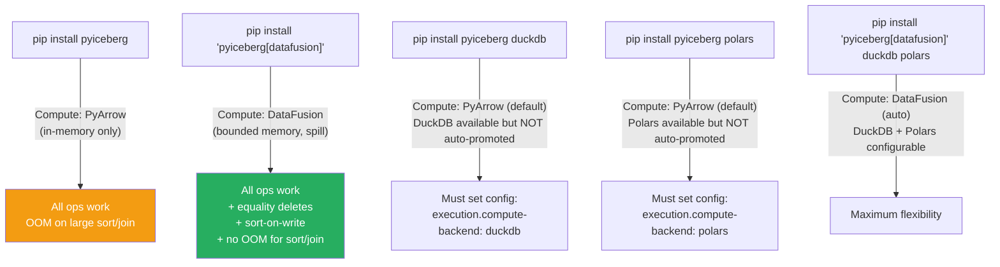
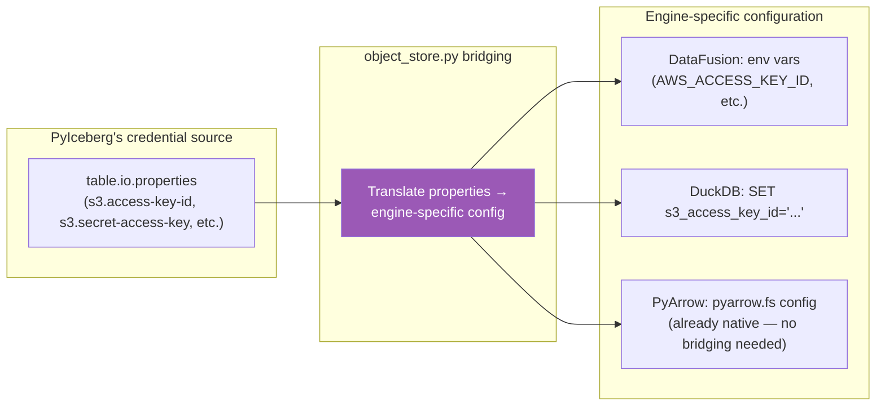
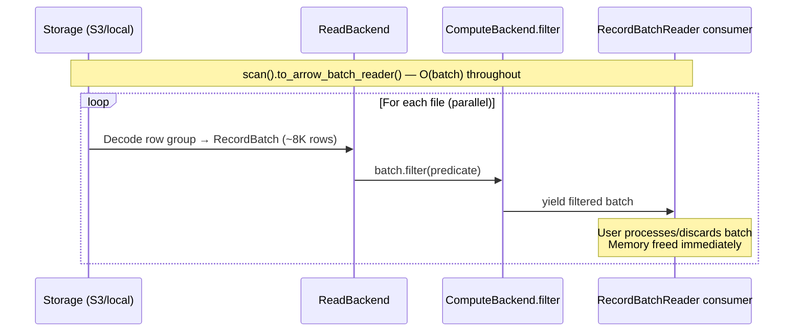

# Pluggable Interface: User Experience Deep-Dive

Branch: `pluggable-backend-discovery` (commit `9ed54328`)
Last updated: 2026-07-06

---

## 1. Before vs. After: User-Facing Changes

### 1.1 What Users See (Zero Code Changes Required)

```python
# BEFORE (main) — user code:
table = catalog.load_table("db.events")
df = table.scan(row_filter="date > '2024-01-01'").to_arrow()
table.append(new_data)
table.delete("user_id = 42")

# AFTER (pluggable branch) — EXACT SAME user code:
table = catalog.load_table("db.events")
df = table.scan(row_filter="date > '2024-01-01'").to_arrow()
table.append(new_data)
table.delete("user_id = 42")
```

**Zero API changes. Zero code migration. Behavioral equivalence for all existing users.**

### 1.2 What Changes Under the Hood

| Aspect | Before (`main`) | After (pluggable) |
|--------|---|---|
| Scan execution engine | ArrowScan (hardcoded PyArrow) | `Backends.resolve()` → auto-selected engine |
| Delete CoW file read | ArrowScan.to_table (full file in memory) | `backends.read.read_parquet` (streaming) |
| Sort-on-write | Not available | Automatic when table has sort order + DataFusion |
| Equality deletes | `ValueError` (crash) | Works via anti-join |
| Limit optimization | Full scan then slice | Generator early-break |
| Proactive OOM warning | None (silent crash) | ResourceWarning + MemoryError with alternatives |
| Configuration | None | `.pyiceberg.yaml` + env vars |

### 1.3 What Users Gain by Installing DataFusion

```bash
pip install 'pyiceberg[datafusion]'
```

| Capability | Without DataFusion | With DataFusion |
|---|:---:|:---:|
| Equality delete resolution | ❌ ValueError | ✅ Works (bounded memory) |
| Sort-on-write | ❌ Not available | ✅ Automatic (external merge sort) |
| Sort for large data | ❌ OOM if > RAM | ✅ Spill-to-disk |
| Anti-join for large data | ❌ OOM if > RAM | ✅ Spill-to-disk |
| Everything else (read, filter, append) | ✅ Same | ✅ Same |

---

## 2. Installation Configurations

### 2.1 All Supported Setups



### 2.2 Why DataFusion Is Auto-Promoted (Others Are Not)

| Engine | Auto-promoted? | Reason |
|--------|:---:|---|
| **DataFusion** | ✅ Yes | Installed ONLY via `pyiceberg[datafusion]` extra. Explicit user intent. |
| **DuckDB** | ❌ No | Commonly installed for unrelated work (data analysis, notebooks). Auto-promoting would surprise users. |
| **Polars** | ❌ No | Same — commonly installed independently. |
| **PyArrow** | Always | Required dependency. Always the fallback. |

### 2.3 Configuration Options

```yaml
# .pyiceberg.yaml (or PYICEBERG_HOME/.pyiceberg.yaml)
execution:
  compute-backend: datafusion    # Force specific compute engine
  read-backend: pyarrow          # Force specific read engine (default)
  write-backend: pyarrow         # Only option — PyArrow is the sole Iceberg-compliant writer
  auto-detect: true              # Set false to disable DataFusion auto-promotion
```

```bash
# Environment variables (override config file)
export PYICEBERG_EXECUTION__COMPUTE_BACKEND=duckdb
export PYICEBERG_EXECUTION__READ_BACKEND=pyarrow
export PYICEBERG_EXECUTION__AUTO_DETECT=false
```

**Priority order:**
```
1. Per-call override (internal API only)       ← highest
2. Config file / environment variable
3. Auto-detection (DataFusion if installed)
4. Default (PyArrow)                           ← lowest
```

**What's configurable vs. what isn't:**

| Axis | Configurable? | Options | Notes |
|------|:---:|---|---|
| **Compute** | ✅ Yes | `datafusion`, `duckdb`, `polars`, `pyarrow` | Controls sort/join/filter engine |
| **Read** | ✅ Yes | `datafusion`, `duckdb`, `polars`, `pyarrow` | Controls Parquet decoder |
| **Write** | ❌ Fixed | `pyarrow` only | Iceberg file production requires PyArrow's ParquetWriter (field IDs, stats, FileIO). See §10 in pluggable_interface_features.md |
| **Planning** | ❌ Internal | Auto-switches at >100K delete entries | Not user-facing. BoundedMemoryPlanner activates automatically when DataFusion is installed and table has extreme delete counts. |

---

## 3. Engine Comparison: Capabilities and Nuances

### 3.1 Capability Matrix

| Capability | PyArrow | DataFusion | DuckDB | Polars |
|---|:---:|:---:|:---:|:---:|
| **Read Parquet** | ✅ | ✅ | ✅ | ✅ |
| **Filter (per-batch)** | ✅ | ✅ | ✅ | ✅ |
| **Sort (in-memory)** | ✅ | ✅ | ✅ | ✅ |
| **Sort (spill-to-disk)** | ❌ | ✅ | ✅ | ❌ |
| **Anti-join (in-memory)** | ✅ | ✅ | ✅ | ✅ |
| **Anti-join (spill-to-disk)** | ❌ | ✅ | ✅ | ❌ |
| **Positional delete resolution** | ✅ | ✅ | ✅ | ✅ |
| **Write Parquet (Iceberg-compliant)** | ✅ | ❌* | ❌* | ❌* |
| **IS NOT DISTINCT FROM (NULL=NULL)** | ✅ (custom) | ✅ (SQL) | ✅ (SQL) | ✅ (custom) |
| **Object store access (S3/GCS/ADLS)** | ✅ (pyarrow.fs) | ✅ (object_store crate) | ✅ (httpfs) | ✅ (cloud feature) |
| **Credential bridging** | N/A (native) | ✅ (object_store.py) | ✅ (object_store.py) | ✅ (object_store.py) |

*Write is PyArrow-only due to Iceberg metadata requirements (field IDs, stats, FileIO). See §12 in pluggable_interface_features.md.

### 3.2 Performance Characteristics

| Engine | Language | Parallelism | Memory model | Spill | GIL during compute |
|--------|:---:|:---:|:---:|:---:|:---:|
| **PyArrow** | C++ | Thread pool | In-memory only | ❌ | Released |
| **DataFusion** | Rust | Tokio async + partitioned | FairSpillPool | ✅ | Released (PyO3) |
| **DuckDB** | C++ | Thread pool | Buffer manager | ✅ | Released |
| **Polars** | Rust | Rayon thread pool | In-memory | ❌ | Released |

### 3.3 Licensing

| Engine | License | Apache Compatible? | PyIceberg Dependency Type | Notes |
|--------|:---:|:---:|:---:|---|
| **PyArrow** | Apache 2.0 | ✅ Category A | Required | Same license as PyIceberg |
| **DataFusion** | Apache 2.0 | ✅ Category A | Optional (`[datafusion]` extra) | Same ASF foundation. Ideal match. |
| **DuckDB** | MIT | ✅ Category A | Not a dependency (user-installed) | MIT is fully Apache-compatible. DuckDB is NOT a PyIceberg dependency — users install it independently. Verify: [github.com/duckdb/duckdb/blob/main/LICENSE](https://github.com/duckdb/duckdb/blob/main/LICENSE), [pypi.org/project/duckdb](https://pypi.org/project/duckdb/) |
| **Polars** | MIT | ✅ Category A | Not a dependency (user-installed) | Same as DuckDB — user-installed, not declared. |
| **PyIceberg** | Apache 2.0 | — | — | All engines are license-compatible |

**Apache policy note:** The ASF requires dependencies to be under Apache-compatible licenses (Category A: Apache 2.0, MIT, BSD, etc.). All four engines qualify. DataFusion is the safest choice (same license, same foundation). DuckDB and Polars are MIT — fully compatible but not ASF projects.

**DuckDB is NOT a declared dependency** of PyIceberg. Users install it independently (`pip install duckdb`). PyIceberg imports it opportunistically at runtime if configured. This means no license audit is required for DuckDB in PyIceberg's release process — it's a user-side choice.

### 3.4 Object Store / Credential Nuances

Each engine has its OWN object store implementation. When a backend reads from S3/GCS/ADLS, it needs credentials configured for ITS object store — separate from PyIceberg's `FileIO` credentials.

`object_store.py` bridges this gap:



**PyArrow needs no bridging** — it uses the same `pyarrow.fs` that PyIceberg's `FileIO` uses.
**DataFusion/DuckDB need bridging** — credentials from `io.properties` are translated to env vars or session config.

---

## 4. Operation Modes: Batch vs. Streaming vs. In-Memory

### 4.1 How Each User API Maps to Execution Mode

| User API | Execution Mode | Memory Model | Engine role |
|----------|:---:|:---:|---|
| `scan().to_arrow()` | **Batch (parallel)** | O(result) — materializes at end | Engine reads per-task in parallel, concat at end |
| `scan().limit(N).to_arrow()` | **Early-stop batch** | O(N × row_size) | Engine reads, generator breaks after N rows |
| `scan().to_arrow_batch_reader()` | **Streaming** | O(batch_size) | Engine reads, yields one batch at a time |
| `scan().count()` | **Streaming aggregate** | O(batch_size) | Engine reads, sums rows per batch |
| `table.append(pa.Table)` | **Batch write** | O(source) — already in memory | Sort (if needed) then write |
| `table.append(RecordBatchReader)` | **Streaming write** | O(batch_size) | Bin-pack batches → write files |
| `table.delete(filter)` | **Streaming per-file** | O(batch) unpartitioned / O(kept) partitioned | Read → filter → write per file |
| `table.upsert(pa.Table)` | **Batch scan + match** | O(source) | Scan target streaming, accumulate matches |

### 4.2 When Streaming Breaks Down (Must Materialize)

| Scenario | Why materialization is forced | Memory |
|---|---|:---:|
| `to_arrow()` without limit | User asked for `pa.Table` which IS materialization | O(result) |
| Sort-on-write (bounded) | Sort needs all data before producing output | O(memory_limit) via spill |
| Anti-join for equality deletes (bounded) | Join needs build side before probe | O(memory_limit) via spill |
| CoW delete on partitioned table | `_dataframe_to_data_files` needs Table for partition routing | O(kept_rows) |
| `upsert()` accumulates updates | Must collect all updates before single atomic overwrite | O(matched) ≤ O(source) |

### 4.3 Streaming End-to-End (Best Case)



---

## 5. Regression Analysis

### 5.1 What Could Regress (Honest Assessment)

| Concern | Risk | Mitigation |
|---|:---:|---|
| Performance: extra dispatch overhead | Negligible (~0.1 ms for `Backends.resolve()`) | Cached engine detection (`@lru_cache`) |
| `ArrowScan` had internal parallel batching per-file | Recovered | `ExecutorFactory.map()` in orchestrate_scan |
| `ArrowScan` dict column hints | Was ignored initially, now passed through | Fixed in this commit |
| Schema promotion (`string` vs `large_string`) | Different from ArrowScan's strict schema | Uses `concat_tables(promote_options="permissive")` — same as old ArrowScan |
| Error messages | Different stack traces | OOM has better messages (alternatives listed) |

### 5.2 What Does NOT Regress

| Aspect | Guarantee |
|---|---|
| Correctness (same rows returned) | Backend Equivalence theorem — 79 tests |
| API signatures | Zero changes to any public method |
| Default behavior (no DataFusion) | PyArrow backend produces same output as old ArrowScan |
| Performance (PyArrow-only path) | Same or better (parallel + streaming) |
| Existing tests | All pass (85 local + 127 Docker) |

### 5.3 The ArrowScan Deprecation Path

```
CURRENT STATE:
- ArrowScan class still exists in io/pyarrow.py
- Emits DeprecationWarning on instantiation
- Zero production call sites in pyiceberg code
- External users who import ArrowScan directly get the warning

FUTURE (next major version):
- Remove ArrowScan class entirely
- Breaking change for anyone who imported it directly (unlikely — internal API)
```

---

## 6. Engine-Specific UX Nuances

### 6.1 DataFusion

**Install:** `pip install 'pyiceberg[datafusion]'`
**Version:** `datafusion>=52,<53` (pinned in pyproject.toml)
**Auto-promoted:** Yes — just installing it activates it.

**Nuances:**
- Uses OS temp directory for spill files (no configuration needed)
- Memory limit: 512 MB default (not yet user-configurable)
- Credential bridging: translates PyIceberg's `s3.*` properties to env vars
- SQL generation: `expression_to_sql.py` converts Iceberg BooleanExpression → SQL WHERE

**What it enables that PyArrow can't:**
- Equality delete resolution (anti-join with spill)
- Sort-on-write (external merge sort)
- Bounded-memory planning for extreme-scale tables (>100K delete entries)

### 6.2 DuckDB

**Install:** `pip install duckdb`
**NOT auto-promoted** — must configure explicitly.
**Config:** `execution.compute-backend: duckdb` or `PYICEBERG_EXECUTION__COMPUTE_BACKEND=duckdb`

**Nuances:**
- Has its own buffer manager (independent of DataFusion)
- Session-scoped: each operation creates a fresh connection
- Credential bridging: `SET s3_access_key_id='...'` per session
- SQL generation: same `expression_to_sql.py` (shared with DataFusion)
- License: MIT (compatible)

**When to use DuckDB over DataFusion:**
- If you already have DuckDB installed and prefer not to add DataFusion
- DuckDB's optimizer may be better for certain join patterns
- In practice: minimal difference for the operations we delegate

### 6.3 Polars

**Install:** `pip install polars`
**NOT auto-promoted** — must configure explicitly.
**Config:** `execution.compute-backend: polars` or `PYICEBERG_EXECUTION__COMPUTE_BACKEND=polars`

**Nuances:**
- **Does NOT support bounded memory** (no spill-to-disk)
- Equivalent to PyArrow for OOM characteristics — both in-memory only
- Uses Polars' Rust-based Parquet reader and compute
- License: MIT (compatible)

**When to use Polars:**
- If Polars' Parquet reader performs better for specific file layouts
- If you want Polars' expression engine for filter evaluation
- In practice: rarely needed since PyArrow is already fast and DataFusion adds spill

### 6.4 PyArrow (Default Fallback)

**Always available** — required dependency.
**No configuration needed.**

**Nuances:**
- No spill-to-disk for sort/join/aggregate
- Excellent Parquet reader (C++ Arrow, vectorized decoding, predicate pushdown)
- Only engine that can write Iceberg-compliant Parquet files
- Uses `pyarrow.fs` for object store access (same as PyIceberg's FileIO)

**When PyArrow is sufficient:**
- Tables fit in memory (< 2 GB for sort/join operations)
- No equality deletes (or tables written only with CoW)
- No sort order defined on the table
- Simple scan + filter + append workflows

---

## 7. Formal Properties

### 7.1 Behavioral Equivalence

For any operation O, any backend combination B1 and B2:
```
∀ table T, filter F, projection P:
    result(O(T, F, P, B1)) = result(O(T, F, P, B2))
```
Backends produce the same LOGICAL result. Physical differences (column ordering within tied sort keys, chunking) are handled by `concat_tables(promote_options="permissive")`.

### 7.2 Monotonic Improvement

```
∀ operations:
    memory(pluggable, with_datafusion) ≤ memory(pluggable, pyarrow_only) ≤ memory(main)
```

Installing DataFusion never increases memory usage. Not installing DataFusion never increases memory usage compared to `main`. The pluggable interface is a **Pareto improvement** — some operations get better, nothing gets worse.

### 7.3 Transparent Substitution

```
∀ user code C that works on main:
    C works identically on the pluggable branch without modification.
```

No existing user code breaks. New capabilities (equality deletes, sort-on-write) activate automatically when DataFusion is installed.
