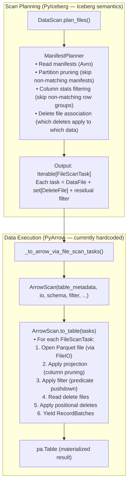
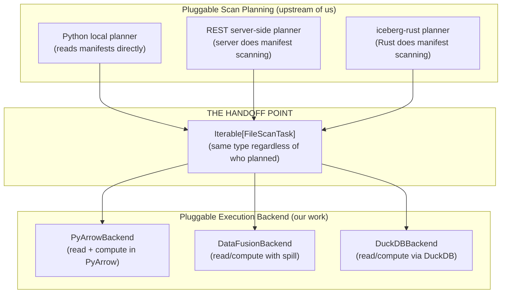
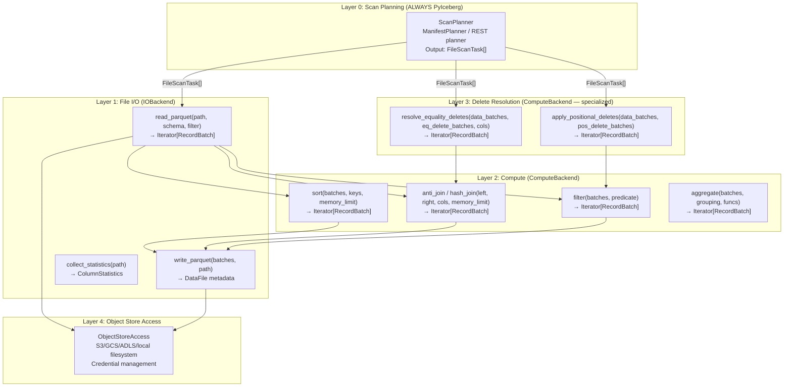

# Pluggable Backend: Scan Task Analysis and Operation Universe

## 1. The Current Scan Task Flow in PyIceberg

### 1.1 The Pipeline (Status Quo)

The current data path in PyIceberg is a linear pipeline from scan planning through
to Arrow output. The boundary between "Iceberg semantics" and "data execution" is
implicit and interleaved:



### 1.2 The Exact Code Path

```python
# User calls:
table.scan().to_arrow()

# Which calls:
class DataScan:
    def to_arrow(self):
        return _to_arrow_via_file_scan_tasks(
            self, self.projection(), self.plan_files(), ...
        )

# Which calls:
def _to_arrow_via_file_scan_tasks(scan, projected_schema, tasks, ...):
    from pyiceberg.io.pyarrow import ArrowScan
    return ArrowScan(
        scan.table_metadata, scan.io, projected_schema,
        scan.row_filter, scan.case_sensitive, scan.limit, ...
    ).to_table(tasks)  # ← THIS is where PyArrow takes over

# Inside ArrowScan.to_table():
def to_table(self, tasks: Iterable[FileScanTask]) -> pa.Table:
    # For each task:
    #   1. pq.ParquetFile(task.file.file_path)  ← PyArrow reads
    #   2. Scanner.to_batches(filter=...)       ← PyArrow filters
    #   3. _apply_positional_deletes(...)       ← PyArrow computes
    #   4. Accumulate into pa.Table             ← PyArrow materializes
    return pa.concat_tables(all_batches)
```

### 1.3 The Boundary Today

```
SCAN PLANNING (PyIceberg):
  Input:  Table metadata + snapshot + row filter + partition filter
  Output: Iterable[FileScanTask] — each task says "read this file, apply these deletes"
  This is PURE Iceberg semantics. No data is read. Only metadata is consulted.

DATA EXECUTION (PyArrow — hardcoded):
  Input:  Iterable[FileScanTask] + projected schema + residual filter
  Output: pa.Table or Iterator[RecordBatch]
  This reads actual Parquet data, applies filters, resolves deletes.
```

**The `FileScanTask` is the handoff point.** Scan planning produces tasks; data execution
consumes them. This is where the pluggable interface naturally sits.

### 1.4 What a FileScanTask Contains

```python
class FileScanTask:
    file: DataFile           # path, format, size, partition values, column stats
    delete_files: set[DataFile]  # associated delete files (positional + equality)
    residual: BooleanExpression  # filter that couldn't be pushed to partition pruning
```

This is a **complete execution instruction**: "read file X, apply deletes Y, filter
by predicate Z." Any backend receiving this has everything it needs to produce the
correct output.

### 1.5 Server-Side Scan Planning: How It Fits

PyIceberg already supports **pluggable scan planning** — not just pluggable execution.
The scan planning step itself can be performed by different planners:

```python
# In DataScan.plan_files():
def plan_files(self) -> Iterable[FileScanTask]:
    if self._should_use_server_side_planning():
        return self._plan_files_server_side()   # REST catalog does the planning
    return self._plan_files_local()             # PyIceberg does it locally
```

This is tracked in [#2303 (Pluggable Scan Planning)](https://github.com/apache/iceberg-python/issues/2303)
and [#2775 (Server-Side Scan Planning)](https://github.com/apache/iceberg-python/issues/2775).

**Three scan planners exist or are planned:**

| Planner | Where it runs | Status | Output |
|---------|--------------|--------|--------|
| **Python local** | PyIceberg client (reads manifests) | ✅ Working | `Iterable[FileScanTask]` |
| **REST server-side** | REST catalog server | ✅ Partially merged | `Iterable[FileScanTask]` |
| **iceberg-rust** | Rust (via `pyiceberg-core`) | Proposed (#2303) | `Iterable[FileScanTask]` |

**Critical observation: ALL planners produce the same output type (`FileScanTask`).**

This means the pluggable execution backend is **completely decoupled from the choice of
scan planner.** Whether scan planning happens in Python, on the REST server, or in Rust —
the output is always `Iterable[FileScanTask]`, and the execution backend consumes that
identically.



### 1.6 Why This Is a Smooth Interaction (Not a Complex Mess)

The two pluggable axes (scan planning and execution) interact cleanly because of
**the FileScanTask contract**:

1. **Planners promise:** "I'll give you correct `FileScanTask`s — right files, right
   deletes, right residual filter. How I determined them is my business."

2. **Backends promise:** "Give me `FileScanTask`s and I'll read the data, apply deletes,
   and return correct Arrow output. How you planned them is your business."

Neither side needs to know about the other. They communicate exclusively through
`FileScanTask` — a data structure defined by PyIceberg's `table/__init__.py`.

**No conflict with server-side planning:**
- Server-side planning makes the *planning* faster (server reads manifests, not client)
- Our pluggable backend makes the *execution* more capable (bounded memory, spill)
- They address different performance bottlenecks:
  - Planning bottleneck = manifest scanning latency (solved by server-side)
  - Execution bottleneck = OOM on data compute (solved by pluggable backend)

**They compose freely:**
```
Server-side planning + DataFusion execution  → fast planning + bounded compute
Python local planning + DataFusion execution → simple + bounded compute
REST planning + PyArrow execution            → fast planning + in-memory compute
```

Any combination works because `FileScanTask` is the stable contract between them.

### 1.7 The Metadata OOM Problem Revisited

One subtlety: **local scan planning** itself reads manifests into memory. For the
normal scan path (partition-pruned), this is bounded. But for operations like orphan
file deletion that enumerate ALL manifests across ALL snapshots, the planning phase
can OOM before execution even begins.

Server-side planning helps here — the server handles the manifest scanning, and the
client only receives the resulting `FileScanTask` list (which is much smaller than
the full manifest content).

For local planning with large metadata, our streaming pattern (Section 4 of this doc)
applies: iterate manifests as a generator, never materialize the full set.

---

## 2. The Pluggable Boundary: Formal Definition

### 2.1 The Separation Theorem (Restated)

```
Operation(Op) = ScanPlan(Op) ∘ Execute(Op)

Where:
  ScanPlan : TableMetadata × Filter × Projection → Iterable[FileScanTask]
             (Iceberg semantics — ALWAYS in PyIceberg)

  Execute  : Iterable[FileScanTask] × Schema → Iterator[RecordBatch]
             (Data execution — PLUGGABLE)
```

**Theorem:** `ScanPlan` and `Execute` are independently substitutable. The correctness
of the output depends on `ScanPlan` producing correct tasks (right files, right deletes,
right residuals). The *feasibility* (OOM-free execution) depends on `Execute` being
bounded-memory. Changing the executor doesn't change correctness; it changes scale.

### 2.2 The Interface at the Boundary

```python
class ExecutionBackend(Protocol):
    """Consumes FileScanTasks and produces Arrow RecordBatches."""

    def execute_scan(
        self,
        tasks: Iterable[FileScanTask],
        projected_schema: Schema,
        row_filter: BooleanExpression,
        io_properties: dict[str, str],
        memory_limit: int | None = None,
    ) -> Iterator[pa.RecordBatch]: ...
```

This is the **minimum viable interface for reads**. The backend receives:
- Tasks (what to read, what deletes apply)
- Schema (what columns to project)
- Filter (residual predicate after partition pruning)
- IO properties (how to access storage)
- Memory limit (how much RAM to use before spilling)

And returns: streaming Arrow RecordBatches.

---

## 3. The Universe of Operations (Java Iceberg Parity)

### 3.1 Java Iceberg's Operation Taxonomy

Java Iceberg defines operations across three categories:

**Category A: Read Operations (scan + filter + resolve deletes)**
```
TableScan → FileScanTask → Read data + apply deletes → output
```

**Category B: Write/Mutation Operations (modify table state)**
```
AppendFiles, OverwriteFiles, DeleteFiles, RowDelta, RewriteFiles, ReplacePartitions
```

**Category C: Maintenance Actions (bulk data manipulation)**
```
RewriteDataFiles, RewriteManifests, RewritePositionDeleteFiles,
ConvertEqualityDeleteFiles, DeleteOrphanFiles, ExpireSnapshots,
DeleteReachableFiles, RemoveDanglingDeleteFiles, ComputeTableStats
```

### 3.2 Complete Operation Map: What Each Touches

| # | Operation | Scan Planning | Read Data | Compute | Write Data | Commit | Java Location |
|---|-----------|:---:|:---:|:---:|:---:|:---:|---|
| 1 | **Table scan** (read) | ✅ Manifests, pruning | ✅ Parquet → Arrow | ✅ Delete resolution | ❌ | ❌ | `TableScan` |
| 2 | **Append** | ❌ | ❌ | ❌ | ✅ Arrow → Parquet | ✅ fast_append | `AppendFiles` |
| 3 | **Overwrite** | ✅ Find affected files | ✅ Read for CoW rewrite | ✅ Filter | ✅ Write new files | ✅ overwrite | `OverwriteFiles` |
| 4 | **Delete** (CoW) | ✅ Find affected files | ✅ Read files to rewrite | ✅ Filter complement | ✅ Write rewritten files | ✅ overwrite | `DeleteFiles` (CoW mode) |
| 5 | **Upsert** | ✅ Find matching files | ✅ Read target for join | ✅ Hash join (source × target) | ✅ Write updated + new | ✅ overwrite + append | `MergeInto` (Spark) |
| 6 | **Compaction** | ✅ Select files to compact | ✅ Read all selected files | ✅ Sort (external merge) | ✅ Write sorted output | ✅ rewrite_files | `RewriteDataFiles` |
| 7 | **Equality delete resolution** | ✅ Match deletes to data | ✅ Read data + deletes | ✅ Anti-join | ❌ (read-path only) | ❌ | `EqualityDeleteFilter` |
| 8 | **Position delete compaction** | ✅ Find files with pos deletes | ✅ Read data + pos deletes | ✅ Filter by position | ✅ Write clean files | ✅ rewrite_files | `RewritePositionDeleteFiles` |
| 9 | **Eq-to-pos conversion** | ✅ Match eq deletes to data | ✅ Read data + eq deletes | ✅ Inner join (find positions) | ✅ Write pos delete files | ✅ row_delta | `ConvertEqualityDeleteFiles` |
| 10 | **Orphan file deletion** | ✅ All snapshots (metadata) | ❌ (paths only) | ✅ Anti-join (paths) | ❌ | ❌ (storage delete) | `DeleteOrphanFiles` |
| 11 | **Expire snapshots** | ✅ All snapshots (metadata) | ❌ | ✅ Set difference (paths) | ❌ | ✅ Remove snapshot refs | `ExpireSnapshots` |
| 12 | **Rewrite manifests** | ✅ Read manifests | ❌ (metadata only) | ❌ | ❌ (write manifests) | ✅ rewrite_manifests | `RewriteManifests` |
| 13 | **Z-Order sort** | ✅ Select files | ✅ Read all files | ✅ Sort (Z-order key) | ✅ Write sorted output | ✅ rewrite_files | `RewriteDataFiles` (Z-Order) |
| 14 | **Sort-order enforce** | ❌ (write path) | ❌ | ✅ Sort before write | ✅ Write sorted | ✅ append | Write path |
| 15 | **Dynamic partition overwrite** | ✅ Detect partitions | ✅ Read for partition detect | ✅ Hash aggregate | ✅ Write partitioned | ✅ replace_partitions | `ReplacePartitions` |
| 16 | **Remove dangling deletes** | ✅ Cross-reference metadata | ❌ | ✅ Set diff (metadata) | ❌ | ✅ Remove delete files | `RemoveDanglingDeleteFiles` |
| 17 | **Compute table stats** | ✅ All data files | ✅ Read all files | ✅ NDV sketches | ❌ (write Puffin) | ✅ statistics | `ComputeTableStats` |

### 3.3 Operation Classification by Backend Requirement

```
LEGEND:
  S = Scan Planning (always PyIceberg)
  R = Read Data (IOBackend)
  C = Compute (ComputeBackend — may need spill)
  W = Write Data (IOBackend)
  X = Commit (always PyIceberg)
```

| Operation | Needs | Backend capability required |
|-----------|-------|---------------------------|
| Table scan | S+R+C | ComputeBackend with anti-join (for eq deletes) |
| Append | W+X | IOBackend only (no compute needed) |
| Overwrite / Delete (CoW) | S+R+C+W+X | ComputeBackend with filter (streaming) |
| Upsert | S+R+C+W+X | ComputeBackend with hash join + spill |
| Compaction | S+R+C+W+X | ComputeBackend with sort + spill |
| Orphan file deletion | S+C | ComputeBackend with anti-join (paths only, no data read) |
| Expire snapshots | S+C+X | ComputeBackend with set diff (metadata scale) |
| Rewrite manifests | S+X | No backend needed (metadata-only) |
| Position delete compaction | S+R+C+W+X | ComputeBackend with filter + spill |
| Eq-to-pos conversion | S+R+C+W+X | ComputeBackend with join + spill |
| Z-Order sort | S+R+C+W+X | ComputeBackend with sort + spill + UDF |
| Compute table stats | S+R+C+X | ComputeBackend with aggregate (sketches) |

### 3.4 How Deep the Abstraction Goes

The pluggable interface needs to abstract **four layers** below scan planning:



### 3.5 The Special Case: Orphan File Deletion

Orphan file deletion is unique — it deals with **object listing**, not data files:

```python
# Orphan deletion flow:
# 1. List ALL objects in storage prefix (storage listing)
# 2. Enumerate ALL valid file paths across ALL snapshots (manifest scanning)
# 3. Anti-join: orphans = storage_paths \ valid_paths
# 4. Delete orphans from storage

# The "data" here is just path strings — not Parquet content.
# But the SCALE can be millions of paths → still needs bounded-memory anti-join.
```

This doesn't use `IOBackend.read_parquet()` at all — it uses `ComputeBackend.anti_join()`
on string arrays. The scan planning phase enumerates valid paths from manifests
(the metadata OOM problem — needs streaming).

### 3.6 The Special Case: Metadata-Only Operations

Some operations touch only metadata, not data files:

| Operation | Data touched | Backend needed? |
|-----------|-------------|:---:|
| Rewrite manifests | Manifest files (Avro, KB-MB each) | ❌ No backend — just rewrite Avro files |
| Expire snapshots (metadata) | Snapshot refs | ❌ No backend — remove refs from metadata |
| Remove dangling deletes | Manifest entries | ❌ Cross-reference metadata, no data read |

These stay entirely in PyIceberg with no backend involvement.

---

## 4. The Scan Planning OOM Problem

### 4.1 Where Metadata Materializes

Scan planning itself can OOM for operations that enumerate large metadata sets:

| Operation | Metadata enumerated | Scale | OOM Risk |
|-----------|-------------------|-------|:---:|
| Normal scan | Manifests for selected partitions | O(partitions hit) | Low |
| Orphan deletion | ALL file paths across ALL snapshots | O(total_files × snapshots) | **High** |
| Expire snapshots | File paths in expired vs retained | O(total_files) | **High** |
| Compaction file selection | Files in target partitions | O(files_in_partition) | Low |
| Full table stats | All data files | O(total_files) | Medium |

### 4.2 What Java Iceberg Does (And Why We Can Do Better)

Java Iceberg does NOT solve this problem. The Spark driver node holds all manifest
entries and file metadata in memory. For extremely large tables, users hit Spark
driver OOM with errors like:

```
java.lang.OutOfMemoryError: Java heap space
  at org.apache.iceberg.BaseTableScan.planFiles(...)
```

The standard fix in the Java ecosystem is operational: "bump `spark.driver.memory`
to 16GB." This is documented as a known limitation — the planning/coordination node
must be large enough to hold the full metadata set.

**We can do better.** Python's generator model makes streaming metadata natural and
nearly free. There is no reason to accept the same limitation Java has.

### 4.3 The Streaming Approach: Always, Not Conditionally

**Principle:** Apply the streaming pattern to ALL new operations unconditionally.
The overhead for small metadata (100 files) is negligible (microseconds to yield 100
items). The benefit for large metadata (10M files) is the difference between working
and OOM. Since we cannot predict metadata scale, we design for the limit.

This is the same principle from Section 5.2 of `datafusion_direction.md`: never branch
on assumed data size.

```python
# THE PATTERN (used by ALL new operations):
def _iter_metadata(table, operation_filter) -> Iterator[MetadataEntry]:
    """Generator — O(1) memory per yield, regardless of total entries."""
    for snapshot in table.snapshots():
        for manifest in snapshot.manifests(table.io):
            for entry in manifest.fetch_manifest_entry(table.io):
                if operation_filter(entry):
                    yield entry  # O(1) memory — never accumulates

# Consuming the generator (two options):

# Option A: Direct streaming into compute backend
batches = _batch_iterator(_iter_metadata(table, filter), batch_size=8192)
ctx.register_record_batches("metadata", batches)

# Option B: Stream to temp Parquet (for operations needing random access)
tmp_path = _stream_to_parquet(_iter_metadata(table, filter), schema)
ctx.register_parquet("metadata", tmp_path)
```

### 4.4 Rollout Strategy

| Scope | Approach | Risk |
|-------|----------|------|
| **ALL new operations** (orphan deletion, expire snapshots, compaction, etc.) | Streaming from day one | Zero — no existing behavior to break |
| **Existing scan planning** (`_plan_files_local`, `DataScan.plan_files()`) | Migrate incrementally as follow-up PRs | Low — partition pruning already bounds most scans |

For existing scan planning, the migration is straightforward: replace list accumulation
with generator yields. The `ManifestPlanner` already iterates manifests — it just
currently materializes results into a list. Converting to a generator is a small,
reviewable change per-subsystem.

### 4.5 Formal Memory Guarantee

**Theorem (Streaming Metadata Bound):** With the generator pattern applied universally:

```
M_planning(Op) = O(batch_size × entry_size)  for ALL operations
               ≈ O(8192 × 500B) = 4MB       regardless of table scale
```

Compare to Java Iceberg:
```
M_planning_java(Op) = O(total_files × entry_size)  [unbounded, OOMs at scale]
```

PyIceberg achieves asymptotically better memory behavior for scan planning than
Java Iceberg — by choosing streaming over materialization. This is a genuine
architectural advantage of the Python implementation.

---

## 5. The Complete Pluggable Interface

### 5.1 Formal Protocol Definitions

Based on the operation universe analysis, the complete interface is:

```python
class IOBackend(Protocol):
    """Layer 1: Who reads/writes Parquet files."""

    def read_parquet(
        self,
        location: str,
        projected_schema: Schema,
        row_filter: BooleanExpression,
        io_properties: dict[str, str],
    ) -> Iterator[pa.RecordBatch]: ...

    def write_parquet(
        self,
        batches: Iterator[pa.RecordBatch],
        location: str,
        schema: Schema,
        write_properties: dict[str, str],
        io_properties: dict[str, str],
    ) -> DataFile: ...

    def collect_statistics(
        self,
        location: str,
        schema: Schema,
        io_properties: dict[str, str],
    ) -> dict[int, ColumnStatistics]: ...

    def list_objects(
        self,
        prefix: str,
        io_properties: dict[str, str],
    ) -> Iterator[str]: ...  # For orphan file deletion


class ComputeBackend(Protocol):
    """Layer 2: Who does sort/join/filter/aggregate on Arrow data."""

    @property
    def supports_bounded_memory(self) -> bool: ...

    def sort(
        self,
        data: Iterator[pa.RecordBatch],
        sort_keys: list[tuple[str, str]],
        memory_limit: int | None = None,
    ) -> Iterator[pa.RecordBatch]: ...

    def anti_join(
        self,
        left: Iterator[pa.RecordBatch],
        right: Iterator[pa.RecordBatch],
        on: list[str],
        memory_limit: int | None = None,
    ) -> Iterator[pa.RecordBatch]: ...

    def hash_join(
        self,
        left: Iterator[pa.RecordBatch],
        right: Iterator[pa.RecordBatch],
        on: list[str],
        join_type: Literal["inner", "left", "right", "outer"],
        memory_limit: int | None = None,
    ) -> Iterator[pa.RecordBatch]: ...

    def filter(
        self,
        data: Iterator[pa.RecordBatch],
        predicate: BooleanExpression,
    ) -> Iterator[pa.RecordBatch]: ...

    def aggregate(
        self,
        data: Iterator[pa.RecordBatch],
        group_by: list[str],
        aggregations: list[tuple[str, str]],  # (column, function)
        memory_limit: int | None = None,
    ) -> Iterator[pa.RecordBatch]: ...


class ExecutionBackend(Protocol):
    """Layer 3 (composite): Executes complete scan tasks using IO + Compute."""

    def execute_scan(
        self,
        tasks: Iterable[FileScanTask],
        projected_schema: Schema,
        row_filter: BooleanExpression,
        io_properties: dict[str, str],
        memory_limit: int | None = None,
    ) -> Iterator[pa.RecordBatch]: ...
```

### 5.2 Why Three Protocols (Not One)

**Separation of Concerns (Dijkstra):** IO, Compute, and composite execution are
independent concerns. A backend might implement IO but not compute (Polars reads
but can't spill). Another might implement compute but not IO (DataFusion for
sort only, PyArrow for read/write).

**Interface Segregation (Martin):** Clients should not depend on methods they don't
use. `table.append()` only needs `IOBackend.write_parquet()`. Forcing it to depend
on `ComputeBackend.sort()` would be unnecessary coupling.

**Composition:** The `ExecutionBackend` composes `IOBackend` + `ComputeBackend` for
operations that need both (scan with delete resolution). Simple operations use
individual protocols directly.

---

## 6. How Each Operation Maps to the Interface

### 6.1 Detailed Operation → Protocol Mapping

| Operation | IOBackend methods used | ComputeBackend methods used | Notes |
|-----------|----------------------|---------------------------|-------|
| **Scan (no deletes)** | `read_parquet` | `filter` | Simple: read + filter residual |
| **Scan (pos deletes)** | `read_parquet` (data + delete files) | `filter` (by position) | PyIceberg determines which deletes apply |
| **Scan (eq deletes)** | `read_parquet` (data + delete files) | `anti_join` | The critical OOM operation |
| **Append** | `write_parquet` | — | No compute needed |
| **Delete (CoW)** | `read_parquet` + `write_parquet` | `filter` (complement) | Stream: read → filter → write |
| **Overwrite** | `read_parquet` + `write_parquet` | `filter` | Same as delete |
| **Upsert** | `read_parquet` + `write_parquet` | `hash_join` (inner for updates) + `anti_join` (for inserts) | Most complex operation |
| **Compaction** | `read_parquet` (many files) + `write_parquet` | `sort` | External merge sort with spill |
| **Orphan deletion** | `list_objects` | `anti_join` (paths) | No Parquet read — just path strings |
| **Expire snapshots** | — | `anti_join` (paths) | Metadata paths only |
| **Pos delete compaction** | `read_parquet` + `write_parquet` | `filter` (exclude positions) | Streaming filter |
| **Eq-to-pos conversion** | `read_parquet` + `write_parquet` | `hash_join` (find positions) | Join to discover positions |
| **Z-Order sort** | `read_parquet` + `write_parquet` | `sort` (with UDF for Z-key) | Same as compaction + computed key |
| **Compute stats** | `read_parquet` | `aggregate` (NDV sketches) | Full table scan + aggregation |

### 6.2 Coverage Verification

Every operation in Java Iceberg's action set can be expressed as a composition of:
- `IOBackend.{read_parquet, write_parquet, list_objects, collect_statistics}`
- `ComputeBackend.{sort, anti_join, hash_join, filter, aggregate}`
- PyIceberg semantics (scan planning, commit protocol)

**Theorem (Completeness):** The protocol set `{IOBackend, ComputeBackend}` is
sufficient to implement all operations in Java Iceberg's action set, given that
scan planning and commit remain in PyIceberg.

**Proof:** By construction — the table in 6.1 maps every Java operation to a
combination of protocol methods. No operation requires a method not in the protocol. ∎

---

## 7. Implementation Strategy

### 7.1 The Two-Phase Approach: Discover First, Implement Incrementally

Fowler's principle says you need 2-3 implementations to see the correct interface.
But you don't need to *ship* all three simultaneously — you need to *study* all three
to derive the interface, then ship them one at a time.

**Phase 0 (Discovery):** Explore the APIs of ALL known candidate engines (DataFusion,
DuckDB, Polars, cuDF, Ray, Dask). Document how each would implement every protocol
method. Identify nuances, edge cases, and API gaps. This produces an exhaustive
**Engine Compatibility Matrix** that proves the protocol is general.

**Phase 1 (First PR):** Ship PyArrow + DataFusion backends. The protocol is designed
based on Phase 0 discovery (validated against 5+ engines) but only two are implemented.
This is reviewable, testable, and doesn't add maintenance burden for engines we
don't yet need.

**Phase 2+ (Subsequent PRs):** Each additional engine is a separate PR (DuckDB, Polars,
etc.) using the discovery notes as implementation guides.

### 7.2 Phase 0: Engine Discovery and API Exploration

Before writing any protocol definition, we exhaustively study how each candidate
engine would implement every operation. This produces documentation that:
1. Validates the protocol design is general (fits all engines)
2. Identifies API nuances that might invalidate interface assumptions
3. Serves as an implementation guide for future engine PRs
4. Provides evidence to reviewers that the interface isn't over-fitted to DataFusion

#### 7.2.1 Engines to Explore

| Engine | Category | Key APIs to Study | Known Nuances |
|--------|----------|---|---|
| **PyArrow** | IO + Compute (fallback) | `pq.ParquetFile`, `Scanner`, `pq.ParquetWriter`, `pc.*` | No join, no spill, no memory limit. Expression via `pc.Expression` objects (verbose). |
| **DataFusion** | IO + Compute (primary) | `SessionContext`, `register_parquet`, `RuntimeEnvBuilder`, SQL | Per-session memory pool. SQL-based expressions. Async Tokio runtime under the hood. Object store via separate config. |
| **DuckDB** | IO + Compute | `duckdb.connect()`, `read_parquet()`, `register()`, SQL | Connection-wide memory limit. BSL license for httpfs. Internal format (converts at Arrow boundary). `SET` commands for config. |
| **Polars** | IO (read only) | `pl.scan_parquet()`, `pl.read_parquet()`, expressions | No spill. Lazy vs eager modes. Own expression DSL (not SQL). Arrow2-based (slightly different Arrow impl). |
| **cuDF (RAPIDS)** | Compute (GPU) | `cudf.read_parquet()`, `cudf.DataFrame` ops | Requires NVIDIA GPU. VRAM-limited. PCIe transfer overhead. Limited to GPU memory. |
| **Ray** | Distributed orchestration | `ray.data.read_parquet()`, `ray.data.Dataset` ops | Not a compute backend — orchestrates others. Per-worker execution. Plasma for shared memory. |
| **Dask** | Distributed orchestration | `dask.dataframe.read_parquet()`, Dask expressions | Similar to Ray — distributes work, each partition processed locally. |

#### 7.2.2 Discovery Questions Per Engine

For each engine, document answers to:

1. **Read:** How does it read Parquet? Can it read with projection + filter pushdown?
   What object stores does it support natively? How are credentials configured?

2. **Write:** Can it write Arrow batches to Parquet? Does it support target-file-size
   splitting? Partition-aware routing? Statistics collection during write?

3. **Compute (sort):** API for sorting Arrow data? Memory limit configurable?
   Spill-to-disk available? What format for spill (Arrow IPC? Internal?)?

4. **Compute (join):** API for hash join / anti-join? Memory limit for join?
   Spill for join build side? What join types supported (inner, left, anti, outer)?

5. **Compute (filter):** API for applying predicates? How are predicates expressed
   (SQL string? Expression objects? DSL?)? Streaming or materialized?

6. **Compute (aggregate):** API for group-by + aggregation? Spillable? What aggregate
   functions available?

7. **Memory model:** How is memory managed? Configurable limit? Per-session or global?
   What happens when limit is exceeded (spill? error? silent OOM?)?

8. **Arrow interchange:** Does it implement C Data Interface? Zero-copy in/out?
   Any conversion overhead at boundary?

9. **Object store access:** Native S3/GCS/ADLS? How configured? License of storage layer?

10. **Streaming:** Can it produce/consume `Iterator[RecordBatch]`? Or only materialized
    tables? Can results be streamed incrementally?

#### 7.2.3 Output of Discovery Phase

The discovery produces:

```
pyiceberg_datafusion/engine_discovery/
├── pyarrow_analysis.md      # How PyArrow would implement each protocol method
├── datafusion_analysis.md   # Same for DataFusion
├── duckdb_analysis.md       # Same for DuckDB
├── polars_analysis.md       # Same for Polars (with limitations noted)
├── cudf_analysis.md         # Same for cuDF (GPU constraints)
├── ray_analysis.md          # How Ray wraps around backends (not a direct backend)
├── compatibility_matrix.md  # Cross-engine comparison table
└── protocol_derivation.md   # How the protocol was derived from studying all engines
```

The **compatibility matrix** is the key deliverable — it proves each protocol method
works across engines and documents where backends have limitations:

| Protocol Method | PyArrow | DataFusion | DuckDB | Polars | cuDF |
|----------------|:---:|:---:|:---:|:---:|:---:|
| `read_parquet(path, schema, filter)` | ✅ `Scanner` | ✅ `register_parquet` | ✅ `read_parquet()` | ✅ `scan_parquet()` | ✅ `read_parquet()` |
| `write_parquet(batches, path)` | ✅ `ParquetWriter` | ⚠️ Delegate to PyArrow | ✅ `write_parquet()` | ✅ `write_parquet()` | ⚠️ Delegate |
| `sort(data, keys, memory_limit)` | ⚠️ No limit | ✅ `FairSpillPool` | ✅ `memory_limit` | ⚠️ No spill | ⚠️ VRAM only |
| `anti_join(left, right, cols, limit)` | ❌ No join op | ✅ SQL ANTI JOIN | ✅ SQL ANTI JOIN | ⚠️ In-memory only | ⚠️ VRAM only |
| `filter(data, predicate)` | ✅ `pc.Expression` | ✅ SQL WHERE | ✅ SQL WHERE | ✅ `pl.col()` DSL | ✅ Boolean mask |
| `aggregate(data, group, funcs)` | ⚠️ Limited | ✅ SQL GROUP BY | ✅ SQL GROUP BY | ✅ `.group_by()` | ✅ `.groupby()` |
| `supports_bounded_memory` | ❌ | ✅ | ✅ | ❌ | ❌ (VRAM) |
| `list_objects(prefix)` | ✅ `pyarrow.fs` | ⚠️ Via object_store | ✅ `glob()` | ❌ | ❌ |

### 7.3 Phase 1: First PR (PyArrow + DataFusion Only)

With the discovery complete and the protocol validated against 5+ engines, the first
PR ships only two backends:

```
pyiceberg/execution/
├── __init__.py
├── engine.py                # resolve_backend() — auto-detect
├── protocol.py              # IOBackend + ComputeBackend Protocol definitions
├── session.py               # DataFusion session with FairSpillPool
├── object_store.py          # FileIO props → DataFusion object store config
└── backends/
    ├── __init__.py
    ├── pyarrow_backend.py   # Extracted from existing monolith
    └── datafusion_backend.py # New: bounded-memory compute
```

**Why only two in PR 1:**
- **Reviewability:** A PR with 2 backends is ~600 lines. Adding DuckDB pushes to ~800+
  and broadens the review surface unnecessarily.
- **Dependency scope:** Adding DuckDB as an optional dep is a separate conversation
  from the core architecture. Keep them in separate PRs.
- **Testing burden:** Two backends × all operations is already a significant test matrix.
  Three multiplies it further.
- **Proven interface:** The protocol is DESIGNED based on 5+ engine study (Phase 0),
  but only TESTED with 2 initially. If the protocol works for PyArrow + DataFusion
  and the discovery doc shows it works for DuckDB/Polars — reviewers have confidence
  without needing all three shipped simultaneously.

### 7.4 Phase 2+: Subsequent Engine PRs

Each additional engine is a separate, focused PR:

| PR | Engine | Scope | Dependencies |
|---|---|---|---|
| PR 2 | DuckDB | `duckdb_backend.py` + tests | `pip install 'pyiceberg[duckdb]'` (already exists) |
| PR 3 | Polars | `polars_backend.py` (IO only, no bounded compute) | `pip install polars` |
| PR 4 | cuDF | `cudf_backend.py` (GPU compute) | NVIDIA GPU + CUDA |

Each PR is self-contained: implement the protocol, add tests, document limitations.
The discovery notes from Phase 0 serve as the implementation guide.

### 7.5 The Backend Resolution Logic

The resolution follows a **explicit-over-implicit** principle: if the user has specified
a preference, honor it. If not, fall back to sensible auto-detection.

#### 7.5.1 The Problem with Pure Auto-Detection

```python
# NAIVE (problematic):
def resolve_backend():
    try:
        import datafusion  # installed, so use it?
    ...
```

This is fragile because:
- Users install many libraries for unrelated reasons (DuckDB for ad-hoc queries,
  Polars for a different project). Detecting their presence doesn't mean they want
  PyIceberg to use them.
- Auto-detection makes behavior **non-deterministic**: adding/removing a pip package
  changes PyIceberg's internal execution path silently. This violates the principle
  of least surprise.
- In CI/Docker environments, the set of installed packages varies unpredictably.

#### 7.5.2 The Resolution Hierarchy

Resolution follows a strict precedence order (highest wins):

```
1. Explicit per-call override     →  table.compact(backend="datafusion")
2. Explicit config (.pyiceberg.yaml) →  execution.compute-backend: datafusion
3. Environment variable           →  PYICEBERG_EXECUTION__COMPUTE_BACKEND=datafusion
4. Auto-detection (default)       →  detect what's installed, use best available
```

**For casual users (levels 3-4):** Everything just works. If they `pip install
'pyiceberg[datafusion]'`, auto-detection picks it up. If not, PyArrow is used.
No config needed.

**For power users (levels 1-2):** Explicit control. They choose exactly which backend
handles their operations, independent of what's installed.

#### 7.5.3 Implementation

```python
# pyiceberg/execution/engine.py

_REQUIRES_BOUNDED_MEMORY = {
    "compaction", "equality_delete_resolution", "orphan_file_deletion",
    "upsert", "cow_rewrite", "position_delete_compaction",
}

def resolve_backend(
    operation: str,
    *,
    io_override: str | None = None,
    compute_override: str | None = None,
) -> tuple[IOBackend, ComputeBackend]:
    """Resolve backends with explicit-over-implicit precedence.

    Args:
        operation: Name of the operation (for warnings/errors).
        io_override: Explicit IO backend choice (from config or per-call).
        compute_override: Explicit compute backend choice (from config or per-call).

    Returns:
        Tuple of (IOBackend, ComputeBackend) for the operation.

    Raises:
        UnsupportedOperation: If a non-spill backend is explicitly chosen for
            an operation that requires bounded memory.
    """
    # Read config if no per-call override
    config = Config()
    io_choice = io_override or config.config.get("execution", {}).get("io-backend", "auto")
    compute_choice = compute_override or config.config.get("execution", {}).get("compute-backend", "auto")

    io_backend = _resolve_io(io_choice)
    compute_backend = _resolve_compute(compute_choice)

    # Capability gate: warn/error if bounded memory required but not available
    if operation in _REQUIRES_BOUNDED_MEMORY and not compute_backend.supports_bounded_memory:
        if compute_choice != "auto":
            # User explicitly chose a non-spill backend — error, don't silently degrade
            raise UnsupportedOperation(
                f"'{operation}' requires bounded-memory execution, but backend "
                f"'{compute_choice}' does not support spill-to-disk. "
                f"Use 'datafusion' or remove the explicit backend override."
            )
        else:
            # Auto-detected non-spill backend — warn with install instructions
            warnings.warn(
                f"'{operation}' using '{compute_choice}' (may OOM on large data). "
                f"Install 'pyiceberg[datafusion]' for bounded-memory execution.",
                UserWarning, stacklevel=3,
            )

    return io_backend, compute_backend


def _resolve_io(choice: str) -> IOBackend:
    if choice == "auto":
        # Default: PyArrow (always available, read/write equivalent across libs)
        return PyArrowIOBackend()
    elif choice == "datafusion":
        from pyiceberg.execution.backends.datafusion_backend import DataFusionIOBackend
        return DataFusionIOBackend()
    elif choice == "duckdb":
        from pyiceberg.execution.backends.duckdb_backend import DuckDBIOBackend
        return DuckDBIOBackend()
    elif choice == "pyarrow":
        return PyArrowIOBackend()
    else:
        raise ValueError(f"Unknown IO backend: '{choice}'. Options: auto, pyarrow, datafusion, duckdb")


def _resolve_compute(choice: str) -> ComputeBackend:
    if choice == "auto":
        # Auto-detect: prefer DataFusion if installed
        try:
            from pyiceberg.execution.backends.datafusion_backend import DataFusionComputeBackend
            return DataFusionComputeBackend()
        except ImportError:
            return PyArrowComputeBackend()
    elif choice == "datafusion":
        from pyiceberg.execution.backends.datafusion_backend import DataFusionComputeBackend
        return DataFusionComputeBackend()
    elif choice == "duckdb":
        from pyiceberg.execution.backends.duckdb_backend import DuckDBComputeBackend
        return DuckDBComputeBackend()
    elif choice == "pyarrow":
        return PyArrowComputeBackend()
    else:
        raise ValueError(f"Unknown compute backend: '{choice}'. Options: auto, pyarrow, datafusion, duckdb")
```

#### 7.5.4 Configuration Examples

```yaml
# .pyiceberg.yaml — Power user explicit config

# Use DataFusion for compute (bounded memory), PyArrow for IO
execution:
  compute-backend: datafusion
  io-backend: pyarrow
  memory-limit: 2GB

# Or: Use DuckDB for everything
execution:
  compute-backend: duckdb
  io-backend: duckdb
  memory-limit: 4GB

# Or: Explicit PyArrow only (small tables, no extra deps needed)
execution:
  compute-backend: pyarrow
  io-backend: pyarrow
```

```python
# Per-call override (rare, for specific operations):
table.compact(compute_backend="datafusion", memory_limit="4GB")
```

#### 7.5.5 What Happens for Each User Profile

| User | Config | Installed | Resolution |
|------|--------|-----------|------------|
| Casual (defaults) | None | Just pyiceberg | IO: PyArrow, Compute: PyArrow |
| Casual + datafusion extra | None | pyiceberg + datafusion | IO: PyArrow, Compute: DataFusion (auto-detected) |
| Power user (explicit) | `compute-backend: datafusion` | pyiceberg + datafusion | IO: PyArrow, Compute: DataFusion (explicit) |
| Power user (explicit) | `compute-backend: duckdb` | pyiceberg + duckdb | IO: PyArrow, Compute: DuckDB (explicit) |
| Has DuckDB installed for other work | None | pyiceberg + duckdb (incidental) | IO: PyArrow, Compute: PyArrow (DuckDB not auto-preferred over PyArrow) |
| CI environment | `compute-backend: pyarrow` | everything | IO: PyArrow, Compute: PyArrow (explicit — deterministic) |

**Key behavior:** Auto-detection only promotes DataFusion (because it's installed via
PyIceberg's own optional extra `pip install 'pyiceberg[datafusion]'`). DuckDB is NOT
auto-promoted because users commonly have it installed for unrelated reasons. DuckDB
requires explicit configuration to be used by PyIceberg.

#### 7.5.6 Documentation: Backend Capabilities Quick Reference

This goes in user-facing docs so power users can make informed choices:

| Backend | Strengths | Limitations | Install | Best for |
|---------|-----------|-------------|---------|----------|
| **pyarrow** | Always available, zero config | No spill (OOMs on large data), no join | Included | Small tables, simple operations |
| **datafusion** | Bounded memory (sort/join/filter), Apache 2.0, Arrow-native | Extra install needed | `pip install 'pyiceberg[datafusion]'` | Production: compaction, eq deletes, large tables |
| **duckdb** | Bounded memory, fast for mixed workloads | BSL license (S3 ext), connection-wide memory | `pip install duckdb` | Users already in DuckDB ecosystem |
| **polars** *(future)* | Fast eager operations, nice API | No spill, no join spill | `pip install polars` | IO only (read Parquet fast) |
| **cudf** *(future)* | GPU-accelerated compute | Requires NVIDIA GPU, VRAM limits | CUDA setup | GPU environments, large aggregations |

### 7.6 Why This Approach Is Correct

| Principle | How it's satisfied |
|-----------|-------------------|
| **Fowler (Interface Emergence)** | Protocol derived from studying 5+ engines (Phase 0), not from one implementation |
| **YAGNI** | Only ship what we can test and maintain now (2 backends). Others come when needed. |
| **Open-Closed** | Protocol is open for extension (new backends) without modifying existing code |
| **Single Responsibility** | Each PR does one thing: Phase 0 = research, PR 1 = foundation, PR 2+ = one engine each |
| **Evidence-based design** | The discovery doc provides reviewers proof that the interface generalizes beyond the two shipped backends |

---

## 8. The First PR: What It Must Prove

### 8.1 Requirements for Correctness

The first PR (PyArrow + DataFusion + protocol) must demonstrate:

1. **Functional equivalence:** For identical input, both backends produce
   identical output (same rows, same values, same order for ordered ops).

2. **Bounded memory (DataFusion):** The DataFusion backend completes within
   configured `memory_limit` for inputs that OOM the PyArrow backend.

3. **Protocol generality:** The protocol definitions are validated by the Phase 0
   discovery documentation showing DuckDB/Polars/cuDF would also fit without
   protocol changes.

4. **Streaming contract:** All interfaces use `Iterator[pa.RecordBatch]` (not
   `pa.Table`), ensuring bounded memory through the entire pipeline regardless
   of backend.

5. **No semantic coupling:** The backend functions know nothing about Iceberg.
   They receive Arrow data, perform compute, return Arrow data.

6. **Capability declaration:** PyArrow backend declares
   `supports_bounded_memory = False`. DataFusion declares `True`.
   Operations that require bounded memory only dispatch to capable backends.

### 8.2 Evidence for Interface Correctness

The PR includes or references:
- Two working implementations (PyArrow, DataFusion) — proves it works today
- Phase 0 discovery doc showing DuckDB/Polars/cuDF API mapping — proves it generalizes
- The compatibility matrix — proves no protocol method is over-fitted to one engine

### 8.3 Documentation for Future Backend Contributors

The PR includes `pyiceberg/execution/BACKENDS.md`:
- Protocol definitions with full type signatures and contracts
- The capability system (`supports_bounded_memory`, etc.)
- How to register a new backend
- Testing requirements (equivalence test suite)
- Reference: links to Phase 0 discovery docs for each engine

### 8.4 The Test Suite

```python
# tests/execution/test_backend_equivalence.py

@pytest.fixture(params=["pyarrow", "datafusion"])
def backend(request):
    """Parametrize tests across available backends."""
    ...

def test_sort_produces_same_output(backend, sample_data):
    """Both backends sort identically."""
    result = backend.compute.sort(sample_data, keys=["id"], memory_limit=None)
    expected = sorted_reference(sample_data, keys=["id"])
    assert_arrow_equal(result, expected)

def test_anti_join_produces_same_output(backend, left_data, right_data):
    """Both backends anti-join identically."""
    result = backend.compute.anti_join(left_data, right_data, on=["id"])
    expected = anti_join_reference(left_data, right_data, on=["id"])
    assert_arrow_equal(result, expected)

def test_bounded_memory_sort(datafusion_backend, large_data):
    """DataFusion completes within memory_limit; PyArrow would OOM."""
    result = datafusion_backend.compute.sort(
        large_data, keys=["ts"], memory_limit=64_000_000  # 64MB
    )
    assert result is not None  # completed without OOM
```

---

## 9. Speed-of-Light Analysis

### 9.1 The Overhead of the Pluggable Layer

```
T_dispatch = O(1) — one Python attribute lookup to select backend
T_operation = O(N/D) — dominated by I/O or compute
T_dispatch / T_operation ≈ 10⁻⁸ (negligible)
```

### 9.2 Streaming Everywhere

The `Iterator[pa.RecordBatch]` contract ensures:
```
M_pipeline = O(batch_size) for streaming operations (filter, read)
M_stateful = O(memory_limit) for stateful operations (sort, join)
M_total = max(M_pipeline, M_stateful) = O(memory_limit)
```

### 9.3 End-to-End Memory Bound

```
M_total(Op) = M_scan_planning + M_execution
            = O(batch_size)    + O(memory_limit)     [with streaming metadata]
            = O(memory_limit)                        [since memory_limit >> batch_size]
```

This holds for ALL operations, ALL table sizes, with NO branching on assumed scale.

---

## 10. Summary

| Layer | Responsibility | Pluggable? | Examples |
|-------|---------------|:---:|---|
| **Scan Planning** | Which files, which deletes, which filter | ❌ Always PyIceberg | ManifestPlanner, DeleteFileIndex |
| **IO Backend** | Read/write Parquet, list objects | ✅ Pluggable | PyArrow, DataFusion, DuckDB |
| **Compute Backend** | Sort, join, filter, aggregate | ✅ Pluggable (with capability gate) | DataFusion (spill), PyArrow (fallback) |
| **Commit** | Atomic snapshot update | ❌ Always PyIceberg | Transaction, OCC |

The `FileScanTask` is the handoff point between scan planning and execution.
Everything above it (manifest reading, partition pruning, delete file matching)
is Iceberg semantics — stays in PyIceberg. Everything below it (reading Parquet,
computing joins, writing output) is pluggable via the `IOBackend` + `ComputeBackend`
protocols.
