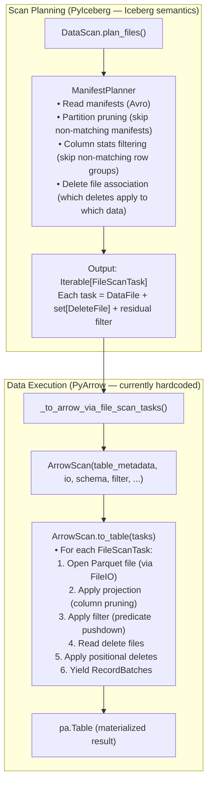
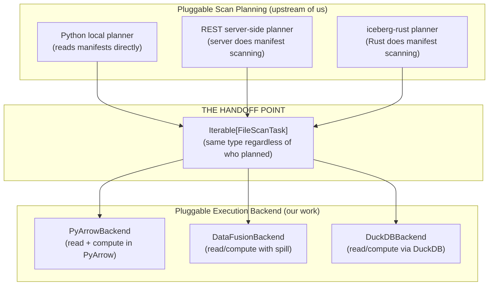
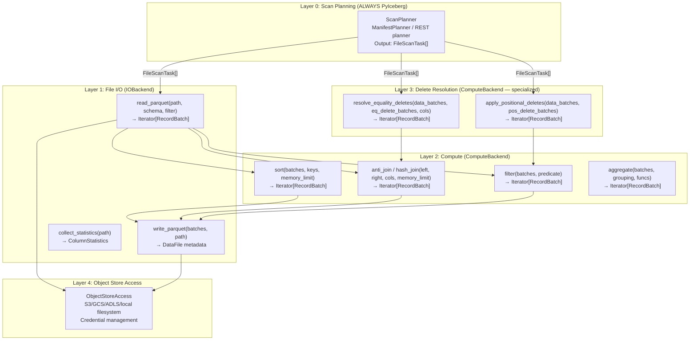

# Pluggable Backend: Scan Task Analysis and Operation Universe

## 1. The Current Scan Task Flow in PyIceberg

### 1.1 The Pipeline (Status Quo)

The current data path in PyIceberg is a linear pipeline from scan planning through
to Arrow output. The boundary between "Iceberg semantics" and "data execution" is
implicit and interleaved:



### 1.2 The Exact Code Path

```python
# User calls:
table.scan().to_arrow()

# Which calls:
class DataScan:
    def to_arrow(self):
        return _to_arrow_via_file_scan_tasks(
            self, self.projection(), self.plan_files(), ...
        )

# Which calls:
def _to_arrow_via_file_scan_tasks(scan, projected_schema, tasks, ...):
    from pyiceberg.io.pyarrow import ArrowScan
    return ArrowScan(
        scan.table_metadata, scan.io, projected_schema,
        scan.row_filter, scan.case_sensitive, scan.limit, ...
    ).to_table(tasks)  # ← THIS is where PyArrow takes over

# Inside ArrowScan.to_table():
def to_table(self, tasks: Iterable[FileScanTask]) -> pa.Table:
    # For each task:
    #   1. pq.ParquetFile(task.file.file_path)  ← PyArrow reads
    #   2. Scanner.to_batches(filter=...)       ← PyArrow filters
    #   3. _apply_positional_deletes(...)       ← PyArrow computes
    #   4. Accumulate into pa.Table             ← PyArrow materializes
    return pa.concat_tables(all_batches)
```

### 1.3 The Boundary Today

```
SCAN PLANNING (PyIceberg):
  Input:  Table metadata + snapshot + row filter + partition filter
  Output: Iterable[FileScanTask] — each task says "read this file, apply these deletes"
  This is PURE Iceberg semantics. No data is read. Only metadata is consulted.

DATA EXECUTION (PyArrow — hardcoded):
  Input:  Iterable[FileScanTask] + projected schema + residual filter
  Output: pa.Table or Iterator[RecordBatch]
  This reads actual Parquet data, applies filters, resolves deletes.
```

**The `FileScanTask` is the handoff point.** Scan planning produces tasks; data execution
consumes them. This is where the pluggable interface naturally sits.

### 1.4 What a FileScanTask Contains

```python
class FileScanTask:
    file: DataFile           # path, format, size, partition values, column stats
    delete_files: set[DataFile]  # associated delete files (positional + equality)
    residual: BooleanExpression  # filter that couldn't be pushed to partition pruning
```

This is a **complete execution instruction**: "read file X, apply deletes Y, filter
by predicate Z." Any backend receiving this has everything it needs to produce the
correct output.

### 1.5 Server-Side Scan Planning: How It Fits

PyIceberg already supports **pluggable scan planning** — not just pluggable execution.
The scan planning step itself can be performed by different planners:

```python
# In DataScan.plan_files():
def plan_files(self) -> Iterable[FileScanTask]:
    if self._should_use_server_side_planning():
        return self._plan_files_server_side()   # REST catalog does the planning
    return self._plan_files_local()             # PyIceberg does it locally
```

This is tracked in [#2303 (Pluggable Scan Planning)](https://github.com/apache/iceberg-python/issues/2303)
and [#2775 (Server-Side Scan Planning)](https://github.com/apache/iceberg-python/issues/2775).

**Three scan planners exist or are planned:**

| Planner | Where it runs | Status | Output |
|---------|--------------|--------|--------|
| **Python local** | PyIceberg client (reads manifests) | ✅ Working | `Iterable[FileScanTask]` |
| **REST server-side** | REST catalog server | ✅ Partially merged | `Iterable[FileScanTask]` |
| **iceberg-rust** | Rust (via `pyiceberg-core`) | Proposed (#2303) | `Iterable[FileScanTask]` |

**Critical observation: ALL planners produce the same output type (`FileScanTask`).**

This means the pluggable execution backend is **completely decoupled from the choice of
scan planner.** Whether scan planning happens in Python, on the REST server, or in Rust —
the output is always `Iterable[FileScanTask]`, and the execution backend consumes that
identically.



### 1.6 Why This Is a Smooth Interaction (Not a Complex Mess)

The two pluggable axes (scan planning and execution) interact cleanly because of
**the FileScanTask contract**:

1. **Planners promise:** "I'll give you correct `FileScanTask`s — right files, right
   deletes, right residual filter. How I determined them is my business."

2. **Backends promise:** "Give me `FileScanTask`s and I'll read the data, apply deletes,
   and return correct Arrow output. How you planned them is your business."

Neither side needs to know about the other. They communicate exclusively through
`FileScanTask` — a data structure defined by PyIceberg's `table/__init__.py`.

**No conflict with server-side planning:**
- Server-side planning makes the *planning* faster (server reads manifests, not client)
- Our pluggable backend makes the *execution* more capable (bounded memory, spill)
- They address different performance bottlenecks:
  - Planning bottleneck = manifest scanning latency (solved by server-side)
  - Execution bottleneck = OOM on data compute (solved by pluggable backend)

**They compose freely:**
```
Server-side planning + DataFusion execution  → fast planning + bounded compute
Python local planning + DataFusion execution → simple + bounded compute
REST planning + PyArrow execution            → fast planning + in-memory compute
```

Any combination works because `FileScanTask` is the stable contract between them.

### 1.7 The Metadata OOM Problem Revisited

One subtlety: **local scan planning** itself reads manifests into memory. For the
normal scan path (partition-pruned), this is bounded. But for operations like orphan
file deletion that enumerate ALL manifests across ALL snapshots, the planning phase
can OOM before execution even begins.

Server-side planning helps here — the server handles the manifest scanning, and the
client only receives the resulting `FileScanTask` list (which is much smaller than
the full manifest content).

For local planning with large metadata, our streaming pattern (Section 4 of this doc)
applies: iterate manifests as a generator, never materialize the full set.

---

## 2. The Pluggable Boundary: Formal Definition

### 2.1 The Separation Theorem (Restated)

```
Operation(Op) = ScanPlan(Op) ∘ Execute(Op)

Where:
  ScanPlan : TableMetadata × Filter × Projection → Iterable[FileScanTask]
             (Iceberg semantics — ALWAYS in PyIceberg)

  Execute  : Iterable[FileScanTask] × Schema → Iterator[RecordBatch]
             (Data execution — PLUGGABLE)
```

**Theorem:** `ScanPlan` and `Execute` are independently substitutable. The correctness
of the output depends on `ScanPlan` producing correct tasks (right files, right deletes,
right residuals). The *feasibility* (OOM-free execution) depends on `Execute` being
bounded-memory. Changing the executor doesn't change correctness; it changes scale.

### 2.2 The Interface at the Boundary

```python
class ExecutionBackend(Protocol):
    """Consumes FileScanTasks and produces Arrow RecordBatches."""

    def execute_scan(
        self,
        tasks: Iterable[FileScanTask],
        projected_schema: Schema,
        row_filter: BooleanExpression,
        io_properties: dict[str, str],
        memory_limit: int | None = None,
    ) -> Iterator[pa.RecordBatch]: ...
```

This is the **minimum viable interface for reads**. The backend receives:
- Tasks (what to read, what deletes apply)
- Schema (what columns to project)
- Filter (residual predicate after partition pruning)
- IO properties (how to access storage)
- Memory limit (how much RAM to use before spilling)

And returns: streaming Arrow RecordBatches.

---

## 3. The Universe of Operations (Java Iceberg Parity)

### 3.1 Java Iceberg's Operation Taxonomy

Java Iceberg defines operations across three categories:

**Category A: Read Operations (scan + filter + resolve deletes)**
```
TableScan → FileScanTask → Read data + apply deletes → output
```

**Category B: Write/Mutation Operations (modify table state)**
```
AppendFiles, OverwriteFiles, DeleteFiles, RowDelta, RewriteFiles, ReplacePartitions
```

**Category C: Maintenance Actions (bulk data manipulation)**
```
RewriteDataFiles, RewriteManifests, RewritePositionDeleteFiles,
ConvertEqualityDeleteFiles, DeleteOrphanFiles, ExpireSnapshots,
DeleteReachableFiles, RemoveDanglingDeleteFiles, ComputeTableStats
```

### 3.2 Complete Operation Map: What Each Touches

| # | Operation | Scan Planning | Read Data | Compute | Write Data | Commit | Java Location |
|---|-----------|:---:|:---:|:---:|:---:|:---:|---|
| 1 | **Table scan** (read) | ✅ Manifests, pruning | ✅ Parquet → Arrow | ✅ Delete resolution | ❌ | ❌ | `TableScan` |
| 2 | **Append** | ❌ | ❌ | ❌ | ✅ Arrow → Parquet | ✅ fast_append | `AppendFiles` |
| 3 | **Overwrite** | ✅ Find affected files | ✅ Read for CoW rewrite | ✅ Filter | ✅ Write new files | ✅ overwrite | `OverwriteFiles` |
| 4 | **Delete** (CoW) | ✅ Find affected files | ✅ Read files to rewrite | ✅ Filter complement | ✅ Write rewritten files | ✅ overwrite | `DeleteFiles` (CoW mode) |
| 5 | **Upsert** | ✅ Find matching files | ✅ Read target for join | ✅ Hash join (source × target) | ✅ Write updated + new | ✅ overwrite + append | `MergeInto` (Spark) |
| 6 | **Compaction** | ✅ Select files to compact | ✅ Read all selected files | ✅ Sort (external merge) | ✅ Write sorted output | ✅ rewrite_files | `RewriteDataFiles` |
| 7 | **Equality delete resolution** | ✅ Match deletes to data | ✅ Read data + deletes | ✅ Anti-join | ❌ (read-path only) | ❌ | `EqualityDeleteFilter` |
| 8 | **Position delete compaction** | ✅ Find files with pos deletes | ✅ Read data + pos deletes | ✅ Filter by position | ✅ Write clean files | ✅ rewrite_files | `RewritePositionDeleteFiles` |
| 9 | **Eq-to-pos conversion** | ✅ Match eq deletes to data | ✅ Read data + eq deletes | ✅ Inner join (find positions) | ✅ Write pos delete files | ✅ row_delta | `ConvertEqualityDeleteFiles` |
| 10 | **Orphan file deletion** | ✅ All snapshots (metadata) | ❌ (paths only) | ✅ Anti-join (paths) | ❌ | ❌ (storage delete) | `DeleteOrphanFiles` |
| 11 | **Expire snapshots** | ✅ All snapshots (metadata) | ❌ | ✅ Set difference (paths) | ❌ | ✅ Remove snapshot refs | `ExpireSnapshots` |
| 12 | **Rewrite manifests** | ✅ Read manifests | ❌ (metadata only) | ❌ | ❌ (write manifests) | ✅ rewrite_manifests | `RewriteManifests` |
| 13 | **Z-Order sort** | ✅ Select files | ✅ Read all files | ✅ Sort (Z-order key) | ✅ Write sorted output | ✅ rewrite_files | `RewriteDataFiles` (Z-Order) |
| 14 | **Sort-order enforce** | ❌ (write path) | ❌ | ✅ Sort before write | ✅ Write sorted | ✅ append | Write path |
| 15 | **Dynamic partition overwrite** | ✅ Detect partitions | ✅ Read for partition detect | ✅ Hash aggregate | ✅ Write partitioned | ✅ replace_partitions | `ReplacePartitions` |
| 16 | **Remove dangling deletes** | ✅ Cross-reference metadata | ❌ | ✅ Set diff (metadata) | ❌ | ✅ Remove delete files | `RemoveDanglingDeleteFiles` |
| 17 | **Compute table stats** | ✅ All data files | ✅ Read all files | ✅ NDV sketches | ❌ (write Puffin) | ✅ statistics | `ComputeTableStats` |

### 3.3 Operation Classification by Backend Requirement

```
LEGEND:
  S = Scan Planning (always PyIceberg)
  R = Read Data (IOBackend)
  C = Compute (ComputeBackend — may need spill)
  W = Write Data (IOBackend)
  X = Commit (always PyIceberg)
```

| Operation | Needs | Backend capability required |
|-----------|-------|---------------------------|
| Table scan | S+R+C | ComputeBackend with anti-join (for eq deletes) |
| Append | W+X | IOBackend only (no compute needed) |
| Overwrite / Delete (CoW) | S+R+C+W+X | ComputeBackend with filter (streaming) |
| Upsert | S+R+C+W+X | ComputeBackend with hash join + spill |
| Compaction | S+R+C+W+X | ComputeBackend with sort + spill |
| Orphan file deletion | S+C | ComputeBackend with anti-join (paths only, no data read) |
| Expire snapshots | S+C+X | ComputeBackend with set diff (metadata scale) |
| Rewrite manifests | S+X | No backend needed (metadata-only) |
| Position delete compaction | S+R+C+W+X | ComputeBackend with filter + spill |
| Eq-to-pos conversion | S+R+C+W+X | ComputeBackend with join + spill |
| Z-Order sort | S+R+C+W+X | ComputeBackend with sort + spill + UDF |
| Compute table stats | S+R+C+X | ComputeBackend with aggregate (sketches) |

### 3.4 How Deep the Abstraction Goes

The pluggable interface needs to abstract **four layers** below scan planning:



### 3.5 The Special Case: Orphan File Deletion

Orphan file deletion is unique — it deals with **object listing**, not data files:

```python
# Orphan deletion flow:
# 1. List ALL objects in storage prefix (storage listing)
# 2. Enumerate ALL valid file paths across ALL snapshots (manifest scanning)
# 3. Anti-join: orphans = storage_paths \ valid_paths
# 4. Delete orphans from storage

# The "data" here is just path strings — not Parquet content.
# But the SCALE can be millions of paths → still needs bounded-memory anti-join.
```

This doesn't use `IOBackend.read_parquet()` at all — it uses `ComputeBackend.anti_join()`
on string arrays. The scan planning phase enumerates valid paths from manifests
(the metadata OOM problem — needs streaming).

### 3.6 The Special Case: Metadata-Only Operations

Some operations touch only metadata, not data files:

| Operation | Data touched | Backend needed? |
|-----------|-------------|:---:|
| Rewrite manifests | Manifest files (Avro, KB-MB each) | ❌ No backend — just rewrite Avro files |
| Expire snapshots (metadata) | Snapshot refs | ❌ No backend — remove refs from metadata |
| Remove dangling deletes | Manifest entries | ❌ Cross-reference metadata, no data read |

These stay entirely in PyIceberg with no backend involvement.

---

## 4. The Scan Planning OOM Problem

### 4.1 Where Metadata Materializes

Scan planning itself can OOM for operations that enumerate large metadata sets:

| Operation | Metadata enumerated | Scale | OOM Risk |
|-----------|-------------------|-------|:---:|
| Normal scan | Manifests for selected partitions | O(partitions hit) | Low |
| Orphan deletion | ALL file paths across ALL snapshots | O(total_files × snapshots) | **High** |
| Expire snapshots | File paths in expired vs retained | O(total_files) | **High** |
| Compaction file selection | Files in target partitions | O(files_in_partition) | Low |
| Full table stats | All data files | O(total_files) | Medium |

### 4.2 The Streaming Solution

For high-OOM-risk operations, scan planning must stream metadata rather than
materialize lists:

```python
# Instead of:
all_paths = [entry.file_path for snapshot in snapshots for manifest in ...]  # OOMs

# Use generator → temp file → register with compute backend:
def _iter_valid_paths(table):
    for snapshot in table.snapshots():
        for manifest in snapshot.manifests(table.io):
            for entry in manifest.fetch_manifest_entry(table.io):
                yield entry.data_file.file_path  # O(1) memory per yield
```

The streaming metadata is written to a temp Parquet file and registered with the
compute backend for the anti-join. PyIceberg's semantic layer stays at O(batch_size)
memory regardless of metadata scale.

---

## 5. The Complete Pluggable Interface

### 5.1 Formal Protocol Definitions

Based on the operation universe analysis, the complete interface is:

```python
class IOBackend(Protocol):
    """Layer 1: Who reads/writes Parquet files."""

    def read_parquet(
        self,
        location: str,
        projected_schema: Schema,
        row_filter: BooleanExpression,
        io_properties: dict[str, str],
    ) -> Iterator[pa.RecordBatch]: ...

    def write_parquet(
        self,
        batches: Iterator[pa.RecordBatch],
        location: str,
        schema: Schema,
        write_properties: dict[str, str],
        io_properties: dict[str, str],
    ) -> DataFile: ...

    def collect_statistics(
        self,
        location: str,
        schema: Schema,
        io_properties: dict[str, str],
    ) -> dict[int, ColumnStatistics]: ...

    def list_objects(
        self,
        prefix: str,
        io_properties: dict[str, str],
    ) -> Iterator[str]: ...  # For orphan file deletion


class ComputeBackend(Protocol):
    """Layer 2: Who does sort/join/filter/aggregate on Arrow data."""

    @property
    def supports_bounded_memory(self) -> bool: ...

    def sort(
        self,
        data: Iterator[pa.RecordBatch],
        sort_keys: list[tuple[str, str]],
        memory_limit: int | None = None,
    ) -> Iterator[pa.RecordBatch]: ...

    def anti_join(
        self,
        left: Iterator[pa.RecordBatch],
        right: Iterator[pa.RecordBatch],
        on: list[str],
        memory_limit: int | None = None,
    ) -> Iterator[pa.RecordBatch]: ...

    def hash_join(
        self,
        left: Iterator[pa.RecordBatch],
        right: Iterator[pa.RecordBatch],
        on: list[str],
        join_type: Literal["inner", "left", "right", "outer"],
        memory_limit: int | None = None,
    ) -> Iterator[pa.RecordBatch]: ...

    def filter(
        self,
        data: Iterator[pa.RecordBatch],
        predicate: BooleanExpression,
    ) -> Iterator[pa.RecordBatch]: ...

    def aggregate(
        self,
        data: Iterator[pa.RecordBatch],
        group_by: list[str],
        aggregations: list[tuple[str, str]],  # (column, function)
        memory_limit: int | None = None,
    ) -> Iterator[pa.RecordBatch]: ...


class ExecutionBackend(Protocol):
    """Layer 3 (composite): Executes complete scan tasks using IO + Compute."""

    def execute_scan(
        self,
        tasks: Iterable[FileScanTask],
        projected_schema: Schema,
        row_filter: BooleanExpression,
        io_properties: dict[str, str],
        memory_limit: int | None = None,
    ) -> Iterator[pa.RecordBatch]: ...
```

### 5.2 Why Three Protocols (Not One)

**Separation of Concerns (Dijkstra):** IO, Compute, and composite execution are
independent concerns. A backend might implement IO but not compute (Polars reads
but can't spill). Another might implement compute but not IO (DataFusion for
sort only, PyArrow for read/write).

**Interface Segregation (Martin):** Clients should not depend on methods they don't
use. `table.append()` only needs `IOBackend.write_parquet()`. Forcing it to depend
on `ComputeBackend.sort()` would be unnecessary coupling.

**Composition:** The `ExecutionBackend` composes `IOBackend` + `ComputeBackend` for
operations that need both (scan with delete resolution). Simple operations use
individual protocols directly.

---

## 6. How Each Operation Maps to the Interface

### 6.1 Detailed Operation → Protocol Mapping

| Operation | IOBackend methods used | ComputeBackend methods used | Notes |
|-----------|----------------------|---------------------------|-------|
| **Scan (no deletes)** | `read_parquet` | `filter` | Simple: read + filter residual |
| **Scan (pos deletes)** | `read_parquet` (data + delete files) | `filter` (by position) | PyIceberg determines which deletes apply |
| **Scan (eq deletes)** | `read_parquet` (data + delete files) | `anti_join` | The critical OOM operation |
| **Append** | `write_parquet` | — | No compute needed |
| **Delete (CoW)** | `read_parquet` + `write_parquet` | `filter` (complement) | Stream: read → filter → write |
| **Overwrite** | `read_parquet` + `write_parquet` | `filter` | Same as delete |
| **Upsert** | `read_parquet` + `write_parquet` | `hash_join` (inner for updates) + `anti_join` (for inserts) | Most complex operation |
| **Compaction** | `read_parquet` (many files) + `write_parquet` | `sort` | External merge sort with spill |
| **Orphan deletion** | `list_objects` | `anti_join` (paths) | No Parquet read — just path strings |
| **Expire snapshots** | — | `anti_join` (paths) | Metadata paths only |
| **Pos delete compaction** | `read_parquet` + `write_parquet` | `filter` (exclude positions) | Streaming filter |
| **Eq-to-pos conversion** | `read_parquet` + `write_parquet` | `hash_join` (find positions) | Join to discover positions |
| **Z-Order sort** | `read_parquet` + `write_parquet` | `sort` (with UDF for Z-key) | Same as compaction + computed key |
| **Compute stats** | `read_parquet` | `aggregate` (NDV sketches) | Full table scan + aggregation |

### 6.2 Coverage Verification

Every operation in Java Iceberg's action set can be expressed as a composition of:
- `IOBackend.{read_parquet, write_parquet, list_objects, collect_statistics}`
- `ComputeBackend.{sort, anti_join, hash_join, filter, aggregate}`
- PyIceberg semantics (scan planning, commit protocol)

**Theorem (Completeness):** The protocol set `{IOBackend, ComputeBackend}` is
sufficient to implement all operations in Java Iceberg's action set, given that
scan planning and commit remain in PyIceberg.

**Proof:** By construction — the table in 6.1 maps every Java operation to a
combination of protocol methods. No operation requires a method not in the protocol. ∎

---

## 7. Implementation Strategy

### 7.1 Phase 1: DataFusion + PyArrow (Two Implementations, Interface Emerges)

The first PR adds DataFusion as a compute backend alongside existing PyArrow:

```
pyiceberg/execution/
├── engine.py       # resolve which backend to use
├── session.py      # DataFusion session with FairSpillPool
├── compute.py      # DataFusion implementations of sort/join/filter
└── object_store.py # Translate FileIO props → DataFusion object store
```

This gives us two concrete implementations:
- **PyArrow** (existing, in `pyiceberg/io/pyarrow.py`) — read, write, filter, sort (in-memory)
- **DataFusion** (new, in `pyiceberg/execution/compute.py`) — sort, join, filter (bounded-memory)

### 7.2 Phase 2: Extract Protocol (Interface Emerges from Two Implementations)

After Phase 1 is proven, we observe the common interface and extract:

```python
# The protocol is whatever PyArrow and DataFusion have in common:
# Both accept Iterator[RecordBatch], both return Iterator[RecordBatch]
# The memory_limit parameter is optional (PyArrow ignores it)
```

### 7.3 Phase 3: Additional Backends (Community-Driven)

With the protocol documented, others contribute:
- DuckDB backend (read + compute)
- Polars backend (read only — no spill)
- cuDF backend (compute for GPU environments)
- Ray backend (distributed reads across workers)

### 7.4 Why This Order Follows CS Best Practice

> "When you have two or three implementations, you can see what the interface should be.
> With one, you're just guessing." — Fowler

Phase 1 gives us the second implementation. Phase 2 extracts the shared interface.
Phase 3 proves the interface is correct by showing third-party backends can implement it.

---

## 8. The First PR: What It Must Prove

### 8.1 Requirements for Correctness

The first PR (DataFusion compute backend) must demonstrate:

1. **Functional equivalence:** For identical input, DataFusion and PyArrow produce
   identical output (same rows, same order for ordered ops, same values).

2. **Bounded memory:** DataFusion path completes within configured memory_limit
   for inputs that OOM the PyArrow path.

3. **Interface stability:** The function signatures (`sort(batches, keys, limit) →
   batches`) are general enough that a DuckDB implementation would have the same
   signature. Evidence: we can sketch the DuckDB version in comments.

4. **Streaming contract:** All interfaces use `Iterator[RecordBatch]` (not `pa.Table`),
   ensuring bounded memory through the entire pipeline.

5. **No semantic coupling:** The compute functions know nothing about Iceberg. They
   receive Arrow data and return Arrow data. Iceberg logic remains in the caller.

### 8.2 Evidence for Interface Correctness

For each protocol method, we provide:
- The DataFusion implementation (Phase 1 PR)
- A sketch of what the DuckDB implementation would look like (comments/docs)
- A sketch of what the Polars implementation would look like (comments/docs)

If all three can be expressed with the same signature, the interface is correct.

### 8.3 Documentation for Future Backend Contributors

The PR includes a `BACKENDS.md` documenting:
- The protocol methods and their contracts
- Input/output types (always `Iterator[pa.RecordBatch]`)
- The `memory_limit` semantics (best-effort for backends without spill)
- The `supports_bounded_memory` capability declaration
- Example: how to implement a new backend

---

## 9. Speed-of-Light Analysis

### 9.1 The Overhead of the Pluggable Layer

```
T_dispatch = O(1) — one Python attribute lookup to select backend
T_operation = O(N/D) — dominated by I/O or compute
T_dispatch / T_operation ≈ 10⁻⁸ (negligible)
```

### 9.2 Streaming Everywhere

The `Iterator[pa.RecordBatch]` contract ensures:
```
M_pipeline = O(batch_size) for streaming operations (filter, read)
M_stateful = O(memory_limit) for stateful operations (sort, join)
M_total = max(M_pipeline, M_stateful) = O(memory_limit)
```

### 9.3 End-to-End Memory Bound

```
M_total(Op) = M_scan_planning + M_execution
            = O(batch_size)    + O(memory_limit)     [with streaming metadata]
            = O(memory_limit)                        [since memory_limit >> batch_size]
```

This holds for ALL operations, ALL table sizes, with NO branching on assumed scale.

---

## 10. Summary

| Layer | Responsibility | Pluggable? | Examples |
|-------|---------------|:---:|---|
| **Scan Planning** | Which files, which deletes, which filter | ❌ Always PyIceberg | ManifestPlanner, DeleteFileIndex |
| **IO Backend** | Read/write Parquet, list objects | ✅ Pluggable | PyArrow, DataFusion, DuckDB |
| **Compute Backend** | Sort, join, filter, aggregate | ✅ Pluggable (with capability gate) | DataFusion (spill), PyArrow (fallback) |
| **Commit** | Atomic snapshot update | ❌ Always PyIceberg | Transaction, OCC |

The `FileScanTask` is the handoff point between scan planning and execution.
Everything above it (manifest reading, partition pruning, delete file matching)
is Iceberg semantics — stays in PyIceberg. Everything below it (reading Parquet,
computing joins, writing output) is pluggable via the `IOBackend` + `ComputeBackend`
protocols.
