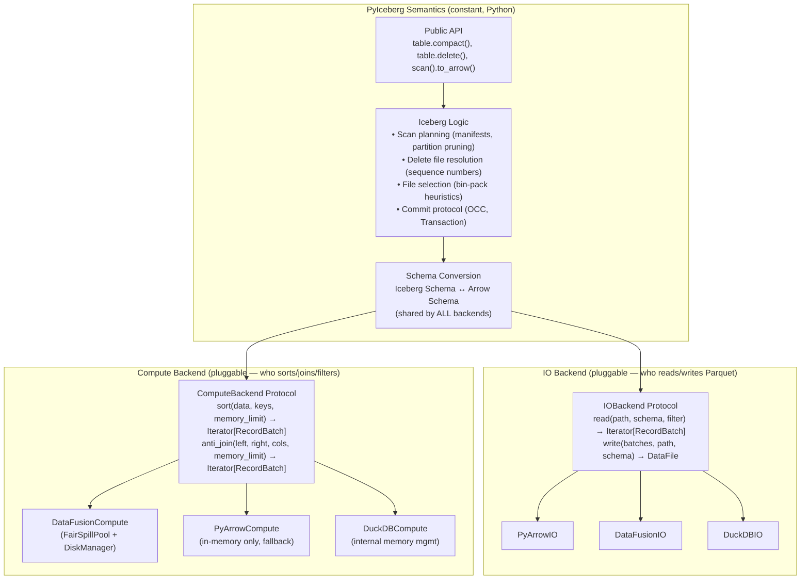
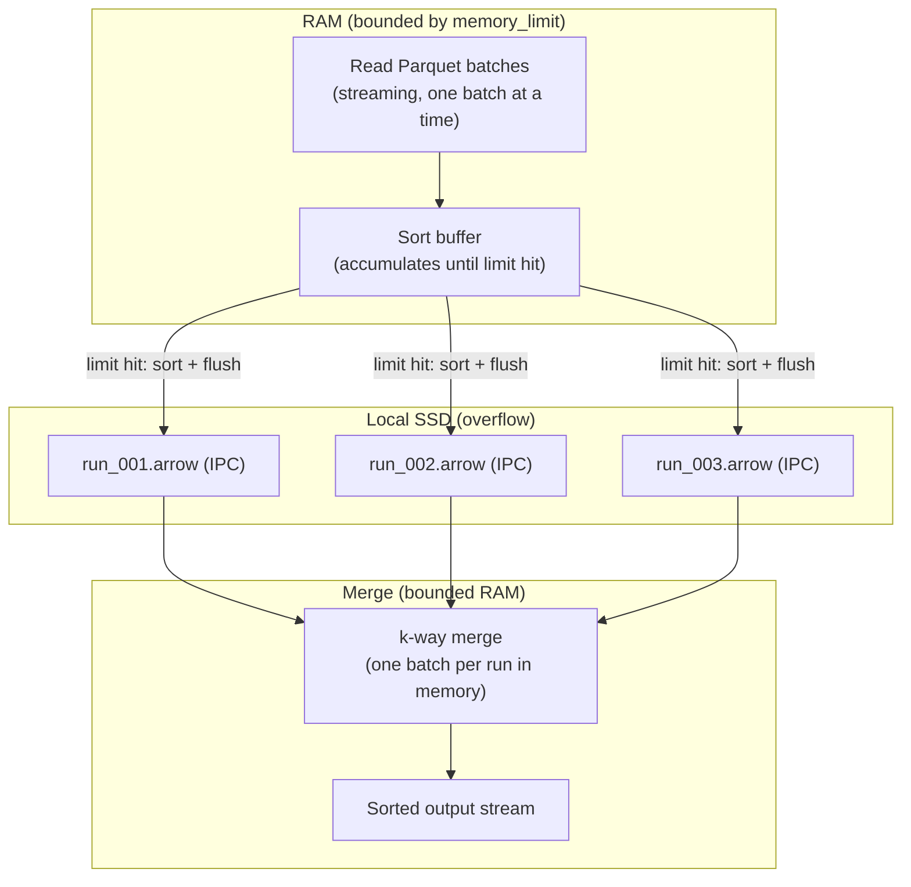
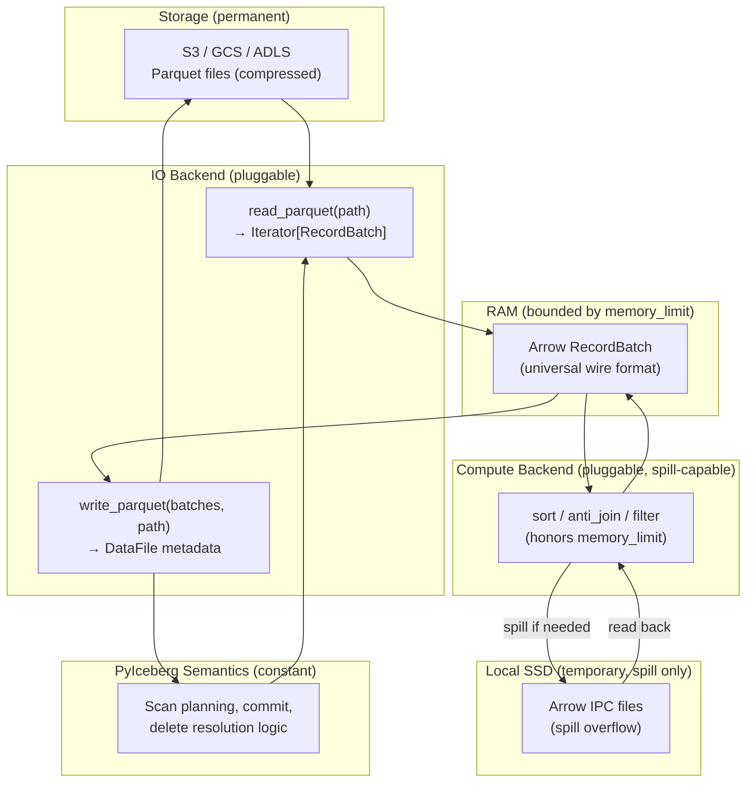

# Pluggable Read/Write Backend with Bounded-Memory Compute

## Executive Summary

PyIceberg's data layer is tightly coupled to the `pyarrow` library. This document
proposes decoupling it into a pluggable backend architecture where different libraries
(PyArrow, DataFusion, DuckDB, Polars) can handle reading and writing Parquet data —
while recognizing that **compute-heavy operations** (sort, join, anti-join) require
bounded-memory execution that only specific engines can provide.

The architecture has two independent axes:

1. **Read/Write Backend** — who reads Parquet into Arrow and writes Arrow to Parquet
   (fully pluggable, any Arrow-capable library works)
2. **Compute Backend** — who executes sort/join/filter with a memory budget
   (constrained: must support spill-to-disk)

These compose freely because Arrow RecordBatch is the universal wire format between
them. A user could read with DuckDB, compute with DataFusion, and write with PyArrow —
all zero-copy at the Arrow boundary.

---

## 1. The Foundational Distinction: Arrow Format vs. Arrow Libraries

### 1.1 What Cannot Change

The Apache Arrow columnar format is Iceberg's in-memory data representation. It is:
- In PyIceberg's public API (`pa.Table`, `pa.RecordBatch`, `pa.RecordBatchReader`)
- The interchange format between ALL analytics engines
- A specification (memory layout + C Data Interface), not a single library

This is permanent. "Decoupling from Arrow" is nonsensical — Arrow is the standard.

### 1.2 What CAN Change

The `pyarrow` Python library is currently the sole implementation of:
- Parquet reading → Arrow batches
- Arrow batches → Parquet writing
- Compute operations (filter, sort)
- Object store access (S3/GCS via `pyarrow.fs`)

Other libraries (DataFusion, DuckDB, Polars) can perform these same operations and
produce/consume the same Arrow RecordBatches. The **library** is decouplable; the
**format** is not.

### 1.3 The Arrow C Data Interface: One Swap Layer

All candidate libraries implement the Arrow C Data Interface — a zero-copy protocol
for exchanging Arrow data via pointer handoff:

```python
# Every library produces Arrow that every other library consumes:
duckdb_result.to_arrow_table()          # DuckDB → Arrow
pl_df.to_arrow()                        # Polars → Arrow
ctx.sql("...").to_arrow_table()         # DataFusion → Arrow
pa.table(...)                           # PyArrow → Arrow (native)

# And every library consumes Arrow from any source:
ctx.register_record_batches("t", [...]) # DataFusion ← Arrow
con.register("t", arrow_table)          # DuckDB ← Arrow
pl.from_arrow(arrow_table)              # Polars ← Arrow
```

**Empirically proven:** We tested all 25 permutations (5 libraries × 5 libraries).
All pass. Zero-copy exchange works universally. (See `arrow_interop_test.py`.)

This means the pluggable architecture has **exactly one swap boundary**: Arrow
RecordBatch in, Arrow RecordBatch out. Any library that speaks Arrow works at
this boundary.

---

## 2. The Two-Axis Architecture

### 2.1 Formal Decomposition

```
PyIceberg Operation = Semantics × IO × Compute

Where:
  Semantics = Iceberg-specific logic (ALWAYS PyIceberg Python, never pluggable)
  IO        = Read Parquet → Arrow, Write Arrow → Parquet (pluggable)
  Compute   = Sort, Join, Filter on Arrow data (pluggable, with constraints)
```

### 2.2 Architecture Diagram



### 2.3 How They Compose (Mix-and-Match)

Because Arrow RecordBatch is the wire format between IO and Compute, the backends
compose independently:

```
Read(DuckDB) → Arrow → Compute(DataFusion) → Arrow → Write(PyArrow)
Read(PyArrow) → Arrow → Compute(DataFusion) → Arrow → Write(PyArrow)
Read(DataFusion) → Arrow → Compute(DataFusion) → Arrow → Write(DataFusion)
```

Any combination works. The backends don't know about each other.

---

## 3. The Compute Constraint: Not All Backends Are Equal

### 3.1 The Bounded-Memory Requirement

Compute-heavy operations (sort 100GB, anti-join 10M rows × 1B rows) require:

```
memory(operation, N) = O(M)  where M is a configurable budget
```

This means the engine must **spill to disk** when intermediate state exceeds the
budget. Without spill, memory grows with data size → OOM.

### 3.2 Which Backends Can Honor This Contract?

| Library | Sort with spill | Join with spill | Configurable memory limit | License (ASF-compatible) |
|---------|:---:|:---:|:---:|:---:|
| **DataFusion** | ✅ External merge sort | ✅ Grace Hash Join | ✅ `FairSpillPool(N)` per-session | ✅ Apache 2.0 |
| **DuckDB** | ✅ Internal buffer mgr | ✅ Internal hash join | ✅ `SET memory_limit` per-connection | ⚠️ Core: MIT. S3 extension: BSL (proprietary) |
| **Polars** | ❌ No spill | ❌ No spill | ❌ No memory limit API | N/A |
| **PyArrow** | ❌ No spill | ❌ No join operator | ❌ No memory limit API | ✅ Apache 2.0 |

**Both DataFusion and DuckDB can provide bounded-memory compute.** The choice between
them is based on:

1. **License:** DataFusion (including object store) is fully Apache 2.0. DuckDB's `httpfs`
   extension (needed for S3/GCS) is Business Source License — problematic for an Apache project.
2. **Per-session isolation:** DataFusion creates independent memory pools per `SessionContext`.
   DuckDB's `memory_limit` is connection-wide.
3. **Arrow-native internals:** DataFusion's internal format IS Arrow RecordBatch (zero conversion).
   DuckDB uses its own internal format with conversion at boundary.
4. **Ecosystem:** DataFusion is already in PyIceberg's dependency tree (`pyproject.toml`,
   `pyiceberg-core`, `__datafusion_table_provider__`).

### 3.3 The Capability Gate

The `ComputeBackend` protocol includes `memory_limit` as a parameter. Backends that
cannot honor it must declare this:

```python
class ComputeBackend(Protocol):
    def sort(self, data, keys, memory_limit: int) -> Iterator[pa.RecordBatch]: ...
    # ↑ If memory_limit cannot be honored, the backend raises UnsupportedOperation

    @property
    def supports_bounded_memory(self) -> bool: ...
    # PyArrow: False, Polars: False, DataFusion: True, DuckDB: True
```

Operations that REQUIRE bounded memory (compaction, eq delete resolution on large data)
will only dispatch to backends where `supports_bounded_memory = True`. This is an
honest capability declaration, not a lock-in.

---

## 4. Arrow IPC: The Format That Enables Spill-to-Disk

### 4.1 What Is Arrow IPC?

Arrow IPC (Inter-Process Communication) is the serialization format of the Arrow
ecosystem. It writes RecordBatches to bytes in a layout that is essentially identical
to their in-memory representation:

```
In RAM:   [Schema] [Validity bitmap] [Offsets buffer] [Values buffer]
On disk:  [Schema message] [Validity bytes] [Offsets bytes] [Values bytes]
          (+ length prefixes and alignment padding)
```

**Reading back is near-free** — the bytes on disk can be memory-mapped directly as
Arrow arrays without decoding, decompressing, or deserializing.

### 4.2 Arrow IPC vs. Parquet

| Property | Arrow IPC | Parquet |
|----------|-----------|---------|
| Purpose | Fast temporary storage / exchange | Compact long-term storage |
| Compression | None (raw bytes) | Yes (snappy, zstd, etc.) |
| Write speed | NVMe speed (~7 GB/s) | ~1-2 GB/s (encoding overhead) |
| Read speed | NVMe speed (~7 GB/s) | ~1-2 GB/s (decoding overhead) |
| File size | ~1x of in-memory size | ~0.3x (3-10x smaller) |
| Use case | DataFusion spill, Ray exchange | Iceberg table storage (S3/GCS) |

### 4.3 How DataFusion Uses IPC for Spill



**Speed-of-light for 10GB sort with 2GB budget:**
```
Runs generated:     ⌈10/2⌉ = 5
SSD writes:         10GB as IPC (7 GB/s) → 1.4s
SSD reads (merge):  10GB (7 GB/s) → 1.4s
Spill overhead:     2.8s total (vs. 10s+ for Parquet read + 10s+ for Parquet write)
```

Spill adds ~13% to total operation time. The alternative (no spill) requires 10GB RAM
or crashes.

### 4.4 Why This Matters for the Pluggable Architecture

Arrow IPC is why `ComputeBackend.sort(memory_limit=N)` can be implemented at all.
Without an efficient spill format:
- PyArrow has no spill → cannot honor `memory_limit` → `O(N)` memory
- Polars has no spill → same
- DataFusion uses Arrow IPC → `O(M)` memory regardless of data size
- DuckDB uses its internal format → also bounded (different mechanism)

The `ComputeBackend` protocol doesn't expose Arrow IPC — it's an implementation
detail of backends that support spill. The caller only sees `sort(data, keys, memory_limit)`.

---

## 5. The Complete Data Flow in PyIceberg

### 5.1 Today (Monolithic PyArrow)

```
User calls table.compact()
  → PyIceberg identifies files (Iceberg semantics)
  → PyArrow reads ALL files into memory (OOM risk)
  → PyArrow sorts in memory (OOM risk)
  → PyArrow writes output files
  → PyIceberg commits
```

### 5.2 Tomorrow (Pluggable, Bounded-Memory)

```
User calls table.compact()
  → PyIceberg identifies files (Iceberg semantics — unchanged)
  → IOBackend reads files → streaming Arrow batches (chosen library)
  → ComputeBackend sorts with spill (DataFusion, bounded memory)
  → IOBackend writes output files from sorted batches (chosen library)
  → PyIceberg commits (unchanged)
```

### 5.3 The Full Stack



---

## 6. Distributed Execution: Orthogonal Layer

### 6.1 PyIceberg Is Single-Node

PyIceberg is a library (`import pyiceberg`), not a cluster. Its execution model is
one Python process on one machine. If you need distributed execution, you use Spark,
Flink, or Ray — which have their own Iceberg connectors.

### 6.2 Ray/Dask Compose With (Not Replace) This Architecture

Ray and Dask solve **horizontal** scaling (many machines). DataFusion solves
**vertical** scaling (bounded memory per machine). These are orthogonal:

```python
# Ray distributes partitions across workers; each worker uses PyIceberg + DataFusion
@ray.remote
def compact_partition(table_name, partition):
    table = catalog.load_table(table_name)
    table.compact(partition_filter=partition)  # DataFusion prevents THIS worker from OOMing

ray.get([compact_partition.remote("db.events", p) for p in partitions])
```

Ray doesn't replace DataFusion. It parallelizes across machines; DataFusion handles
memory within each machine. They compose without conflicting.

### 6.3 Arrow IPC Enables Both

- **DataFusion spill:** Arrow IPC to local SSD (single-node, fast)
- **Ray exchange:** Arrow IPC over network (distributed, fast)
- Same format, same zero-deserialization property, different transport layer.

### 6.4 Scope Declaration

| Layer | What | Our scope? |
|-------|------|:---:|
| Distributed orchestration (Ray/Dask) | Which machines process which partitions | ❌ Out of scope |
| Single-node compute (DataFusion) | Bounded-memory sort/join within one machine | ✅ In scope |
| Pluggable IO (read/write backends) | Which library reads/writes Parquet | ✅ In scope |
| Pluggable compute (sort/join backends) | Which library does compute | ✅ In scope |
| Iceberg semantics (scan planning, commit) | Which files, what logic, how to commit | ✅ In scope (always PyIceberg) |

---

## 7. How the API Works

### 7.1 User-Facing: No Change

```python
# Existing methods — signatures unchanged, behavior improved:
table.delete("status = 'expired'")       # no longer OOMs
table.scan().to_arrow()                  # resolves equality deletes
table.upsert(df, join_cols=["id"])       # no longer O(n²)

# New methods — additive:
table.compact()
table.delete_orphan_files()
```

### 7.2 Configuration: Existing Mechanisms

```yaml
# .pyiceberg.yaml (future Phase 2+)
execution:
  memory-limit: 1GB
  compute-backend: datafusion    # or: pyarrow (fallback)
  io-backend: pyarrow            # or: datafusion, duckdb (future)
```

For Phase 1: no configuration needed. System auto-detects:
- `datafusion` importable → use for compute
- Otherwise → PyArrow fallback

### 7.3 Internal: Engine Resolution

```python
# pyiceberg/execution/engine.py
def resolve_engine(operation: str) -> ExecutionEngine:
    """Auto-detect: DataFusion if available, else PyArrow."""
    try:
        import datafusion
        return ExecutionEngine.DATAFUSION
    except ImportError:
        warnings.warn(f"'{operation}' using PyArrow (may OOM on large data).")
        return ExecutionEngine.PYARROW
```

---

## 8. The Protocol Interfaces

### 8.1 IOBackend

```python
class IOBackend(Protocol):
    def read_parquet(
        self, location: str, schema: Schema,
        projection: list[int], filter: BooleanExpression,
        io_properties: dict[str, str],
    ) -> Iterator[pa.RecordBatch]: ...

    def write_parquet(
        self, batches: Iterator[pa.RecordBatch], location: str,
        schema: Schema, properties: dict[str, str],
        io_properties: dict[str, str],
    ) -> DataFile: ...
```

### 8.2 ComputeBackend

```python
class ComputeBackend(Protocol):
    @property
    def supports_bounded_memory(self) -> bool: ...

    def sort(
        self, data: Iterator[pa.RecordBatch],
        sort_keys: list[tuple[str, str]], memory_limit: int,
    ) -> Iterator[pa.RecordBatch]: ...

    def anti_join(
        self, left: Iterator[pa.RecordBatch],
        right: Iterator[pa.RecordBatch],
        on: list[str], memory_limit: int,
    ) -> Iterator[pa.RecordBatch]: ...

    def filter(
        self, data: Iterator[pa.RecordBatch],
        predicate: BooleanExpression,
    ) -> Iterator[pa.RecordBatch]: ...
```

### 8.3 Key Properties

- **All inputs/outputs are Arrow** (`pa.RecordBatch` / iterators thereof)
- **Streaming by default** (`Iterator` not `pa.Table` — enables bounded processing)
- **memory_limit is a contract** — backends that can't honor it declare `supports_bounded_memory = False`
- **Expression conversion is per-backend** — each implements Iceberg filter → native format

---

## 9. Implementation Strategy: Interface Emergence

### 9.1 The CS Principle

> "When you have two or three implementations of something, then you can see what
> the interface should be. When you have one implementation, you're just guessing."
> — Martin Fowler

We have one implementation today (PyArrow). We're building a second (DataFusion).
The shared interface emerges from observing what they have in common.

### 9.2 Phased Execution

**Phase 1 (Now):** Build DataFusion compute directly in `pyiceberg/execution/compute.py`.
Function signatures are Arrow-in/Arrow-out — they ARE the implicit interface.
No `ComputeBackend` protocol yet. No refactoring of existing PyArrow code.

```python
# Phase 1: concrete DataFusion functions (the implicit interface)
def anti_join(left: pa.Table, right: pa.Table, on: list[str], ...) -> pa.Table: ...
def sort_batches(data: pa.Table, sort_keys: list[str], ...) -> pa.Table: ...
```

**Phase 2 (After proven):** Extract the `IOBackend` + `ComputeBackend` protocols by
generalizing from the two concrete implementations (PyArrow + DataFusion). Refactor
`pyiceberg/io/pyarrow.py` into a `PyArrowBackend` implementing the protocol.

**Phase 3 (Community-driven):** Others contribute DuckDB, Polars backends. Backend
selection via `.pyiceberg.yaml`.

### 9.3 Why This Order

1. Phase 1 delivers value immediately (bounded-memory operations ship now)
2. Phase 1 proves the interface through real implementation (not speculation)
3. Phase 2 is pure refactoring (no behavior change, fully testable)
4. Phase 3 is community-driven (we don't maintain backends we don't use)

---

## 10. Current State of PyArrow Coupling

### 10.1 The Monolith

`pyiceberg/io/pyarrow.py` (3,046 lines) handles all I/O and compute:

```
├── FileIO (S3/GCS access via pyarrow.fs)           — already abstract (FileIO ABC)
├── Schema conversion (Iceberg ↔ Arrow)             — shared infrastructure (all backends need this)
├── Expression conversion (Iceberg → pc.Expression) — backend-specific (each backend has its own)
├── Reading (ArrowScan)                             — to be extracted into IOBackend
├── Writing (write_file, _dataframe_to_data_files)  — to be extracted into IOBackend
├── Statistics collection                           — to be extracted into IOBackend
└── Delete file handling                            — stays in PyIceberg semantics layer
```

### 10.2 What Moves Where

| Component | Current home | Future home | Backend-specific? |
|-----------|-------------|-------------|:---:|
| Schema conversion (800 lines) | `pyarrow.py` | Stays (shared infra) | No — Arrow Schema is universal |
| Expression conversion (200 lines) | `pyarrow.py` | Each backend | Yes |
| ArrowScan (read) | `pyarrow.py` | `IOBackend` implementations | Yes |
| write_file (write) | `pyarrow.py` | `IOBackend` implementations | Yes |
| StatsAggregator | `pyarrow.py` | `IOBackend` implementations | Yes |
| Delete file handling | `pyarrow.py` | PyIceberg semantics (table/__init__.py) | No — Iceberg logic |

### 10.3 Refactoring Scope

Phase 2 refactoring touches ~2,000 lines (read + write + stats + expression). Schema
conversion (800 lines) stays in place. The refactoring is mechanical: move existing
code behind the `IOBackend` protocol without changing behavior. Existing test suite
validates the extraction.

---

## 11. Summary

| Axis | Pluggable? | Constraints | Default |
|------|:---:|---|---|
| **Arrow format** | ❌ Permanent | Public API, universal standard | Always Arrow |
| **IO Backend** (read/write Parquet) | ✅ Fully pluggable | Must produce/consume Arrow RecordBatch | PyArrow |
| **Compute Backend** (sort/join/filter) | ✅ With capability gate | Must honor `memory_limit` for OOM-prone ops | DataFusion (if installed) |
| **Iceberg Semantics** | ❌ Always PyIceberg | Scan planning, commit, delete resolution | Python |
| **Distributed orchestration** | ❌ Out of scope | Ray/Dask/Spark layer above PyIceberg | N/A |

**The path forward:**
1. Build DataFusion compute now (Phase 1 — delivers immediate value)
2. Extract protocols after (Phase 2 — interface emerges from real code)
3. Community contributes backends (Phase 3 — DuckDB, Polars, etc.)

**The key insight:** Read/write is freely pluggable (any Arrow library works).
Compute is pluggable with a capability gate (only spill-capable engines can handle
OOM-prone operations). DataFusion meets all requirements today. The architecture
leaves room for alternatives without building premature abstractions.
