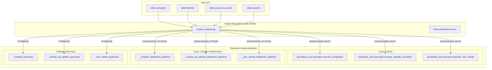
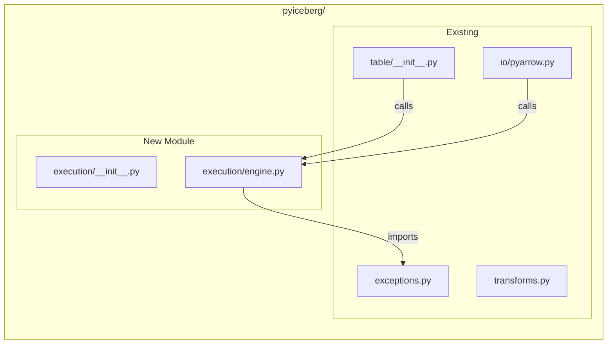
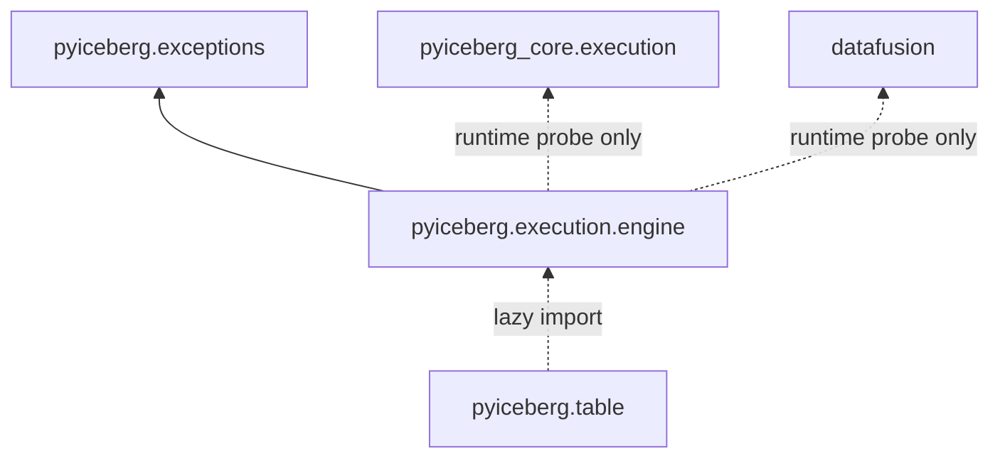
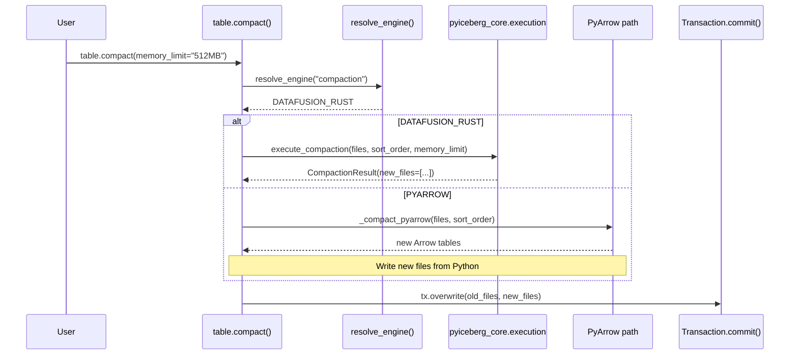

# Engine Resolution Module: Rigorous Design & Implementation

## GitHub Issue Description

**Title:** `Add execution engine resolution module for DataFusion dispatch`

**Body:**

> Add a `pyiceberg/execution/` module that detects which execution backends are available (pyiceberg_core.execution, datafusion-python, or PyArrow-only) and provides a dispatch mechanism for compute-heavy operations. This is the foundation that all subsequent DataFusion-powered features (#3554) build upon.
>
> **Scope:** New module, purely additive. No existing behavior changes.
>
> **Related:** #3554 (DataFusion integration epic), [iceberg-rust#2716](https://github.com/apache/iceberg-rust/issues/2716)

---

## 1. First Principles: What Problem Are We Solving?

### 1.1 The Formal Problem

PyIceberg has `N` compute-heavy operations (compaction, delete resolution, CoW rewrite, etc.) and `K` possible execution backends with different capability profiles:

```
Backends = {DATAFUSION_RUST, DATAFUSION_PYTHON, PYARROW}

Capability(DATAFUSION_RUST)   = {bounded_memory, spill_to_disk, parallel, zero_ffi_data_transfer}
Capability(DATAFUSION_PYTHON) = {bounded_memory, spill_to_disk, parallel}
Capability(PYARROW)           = {in_memory_only}
```

Each operation `Op_i` has a memory requirement function:
```
M(Op_i, D) : Operation × DataSize → MemoryRequired
```

For operations where `M(Op_i, D) > RAM_available`, only backends with `bounded_memory ∈ Capability(backend)` can complete without failure.

**The resolution problem:** Given an operation `Op_i` at runtime, select the optimal backend `b* ∈ Backends` that:
1. Is installed (available in the Python environment)
2. Has sufficient capabilities for `Op_i`
3. Maximizes performance (prefer RUST > PYTHON_DF > PYARROW)

This is a **static dispatch at module-import time** with **runtime capability detection** — a well-known pattern in systems programming (analogous to CPU feature detection + dispatch in SIMD libraries).

### 1.2 Mathematical Formulation

Define a total ordering on backends by performance:

```
DATAFUSION_RUST ≻ DATAFUSION_PYTHON ≻ PYARROW
```

The resolver is a function:

```
resolve : Operation → Backend

resolve(op) = max_{≻} { b ∈ Backends | installed(b) ∧ capable(b, op) }
```

Where:
- `installed(b)` = the Python module for `b` is importable
- `capable(b, op)` = `required_capabilities(op) ⊆ Capability(b)`

For our current set, `capable(b, op) = True` for all `(b, op)` pairs because:
- All operations have a PyArrow fallback (correct for small data, OOMs for large)
- DataFusion backends handle all operations

So the resolver simplifies to:

```
resolve(op) = max_{≻} { b ∈ Backends | installed(b) }
```

This is a **greedy selection on a total order** — O(1) with at most 2 import checks.

### 1.3 Why This Must Be a Separate Module

**Separation of Concerns (SoC)**: The dispatch decision is orthogonal to the operation logic. Each operation has 1-3 implementation variants. Without a resolver, every operation duplicates the import-checking logic. With it, each operation simply calls `resolve_engine()` once.

**Open-Closed Principle**: Adding a new backend (future) requires modifying only the resolver, not every operation. Adding a new operation requires only implementing variants, not touching the dispatch infrastructure.

**Testability**: The resolver can be tested in isolation (mock imports). Operations can be tested with a forced backend (bypass resolver).

---

## 2. Architecture

### 2.1 System Context



### 2.2 Module Placement in PyIceberg



**File tree (new):**
```
pyiceberg/execution/
├── __init__.py          # Re-exports ExecutionEngine, resolve_engine
└── engine.py            # Core resolver logic
```

### 2.3 Dependency Graph (Import Order)



**Critical invariant:** `pyiceberg.execution.engine` MUST NOT import `pyiceberg_core` or `datafusion` at module level. All imports are probe-only inside function bodies. This ensures `import pyiceberg` never fails due to missing optional dependencies.

---

## 3. Formal Specification

### 3.1 Type Definitions

```python
from enum import Enum, auto
from typing import Final

class ExecutionEngine(Enum):
    """Available execution backends, ordered by preference (highest first)."""
    DATAFUSION_RUST = auto()    # pyiceberg_core.execution (Track 2)
    DATAFUSION_PYTHON = auto()  # datafusion-python (Track 1)
    PYARROW = auto()            # In-memory only (fallback)
```

**Axiom (Total Order):** `DATAFUSION_RUST ≻ DATAFUSION_PYTHON ≻ PYARROW`

This ordering is justified by:
- `RUST ≻ PYTHON_DF`: No FFI data transfer overhead, uses Iceberg FileIO directly, consistent with existing pyiceberg_core patterns
- `PYTHON_DF ≻ PYARROW`: Bounded memory via FairSpillPool (any data size) vs. unbounded (OOMs on large data)

### 3.2 The Resolver Function

```python
def resolve_engine(operation: str) -> ExecutionEngine:
    """
    Determine the optimal execution backend for the given operation.

    Algorithm:
        Probe backends in preference order (highest first).
        Return the first that is installed.
        Emit a UserWarning if falling back to PYARROW.

    Formal specification:
        resolve(op) = max_{≻} { b ∈ {RUST, PYTHON_DF, PYARROW} | installed(b) }

    Time complexity: O(1) — at most 2 import probes (cached by Python's import system)
    Space complexity: O(1) — no allocations
    Side effects: UserWarning on PYARROW fallback

    Parameters:
        operation: Human-readable operation name (for warning messages only).
                   Does not affect dispatch logic.

    Returns:
        The highest-preference installed ExecutionEngine.
    """
```

### 3.3 Correctness Properties

**Property 1 (Determinism):** For a fixed Python environment, `resolve_engine(op)` always returns the same value. The function is pure with respect to installed packages.

**Property 2 (Monotonicity):** Installing a higher-preference backend never degrades the resolution. If `resolve_engine(op) = PYTHON_DF`, then after `pip install pyiceberg-core`, `resolve_engine(op) = RUST`.

**Property 3 (Graceful Degradation):** The function never raises. It always returns a valid `ExecutionEngine`. The worst case (nothing installed) returns `PYARROW`.

**Property 4 (No Module-Level Side Effects):** Importing `pyiceberg.execution.engine` does not import `pyiceberg_core` or `datafusion`. The probes happen only when `resolve_engine()` is called.

### 3.4 Performance Analysis

The resolver is on the critical path of every compute-heavy operation. Its overhead must be negligible:

```
T(resolve_engine) = T(import_probe) × num_probes
                  ≤ 2 × T(import_probe)
```

Python's import system caches modules in `sys.modules`. After the first probe:
```
T(import_probe | module in sys.modules) = O(1) dict lookup ≈ 50ns
T(import_probe | module not found) = O(1) raise ImportError ≈ 1μs
```

For comparison, the operations this dispatches to take O(seconds) to O(minutes). The resolver overhead is < 0.0001% of total operation time. It is **not** the speed-of-light bottleneck.

**Speed-of-light bottleneck** for the overall system:
```
T_total(op, data) = T(resolve) + T(execute)
                  ≈ T(execute)
                  = Θ(|data| / bandwidth)    [I/O bound for streaming ops]
                  = Θ(|data| × log(|data|/M) / bandwidth)  [sort-dominated ops]
```

The resolver contributes `O(1)` to an `Θ(N)` or `Θ(N log N)` operation. By Amdahl's Law, optimizing it further has zero measurable impact.

---

## 4. Implementation

### 4.1 `pyiceberg/execution/__init__.py`

```python
# Licensed to the Apache Software Foundation (ASF) under one
# or more contributor license agreements.  See the NOTICE file
# distributed with this work for additional information
# regarding copyright ownership.  The ASF licenses this file
# to you under the Apache License, Version 2.0 (the
# "License"); you may not use this file except in compliance
# with the License.  You may obtain a copy of the License at
#
#   http://www.apache.org/licenses/LICENSE-2.0
#
# Unless required by applicable law or agreed to in writing,
# software distributed under the License is distributed on an
# "AS IS" BASIS, WITHOUT WARRANTIES OR CONDITIONS OF ANY
# KIND, either express or implied.  See the License for the
# specific language governing permissions and limitations
# under the License.

"""Execution engine resolution and dispatch for compute-heavy operations."""

from pyiceberg.execution.engine import ExecutionEngine, resolve_engine

__all__ = ["ExecutionEngine", "resolve_engine"]
```

### 4.2 `pyiceberg/execution/engine.py`

```python
# Licensed to the Apache Software Foundation (ASF) under one
# or more contributor license agreements.  See the NOTICE file
# distributed with this work for additional information
# regarding copyright ownership.  The ASF licenses this file
# to you under the Apache License, Version 2.0 (the
# "License"); you may not use this file except in compliance
# with the License.  You may obtain a copy of the License at
#
#   http://www.apache.org/licenses/LICENSE-2.0
#
# Unless required by applicable law or agreed to in writing,
# software distributed under the License is distributed on an
# "AS IS" BASIS, WITHOUT WARRANTIES OR CONDITIONS OF ANY
# KIND, either express or implied.  See the License for the
# specific language governing permissions and limitations
# under the License.

"""Engine resolution: detect available execution backends and select optimal."""

from __future__ import annotations

import warnings
from enum import Enum, auto
from functools import lru_cache


class ExecutionEngine(Enum):
    """Execution backends ordered by preference (highest performance first).

    DATAFUSION_RUST:   Full pipeline in Rust via pyiceberg_core.execution.
                       Bounded memory, spill-to-disk, no FFI data transfer.
    DATAFUSION_PYTHON: Python orchestrates DataFusion via datafusion-python.
                       Bounded memory, spill-to-disk, slight FFI overhead.
    PYARROW:           In-memory PyArrow operations. No memory management.
                       Works for small data. OOMs on large datasets.
    """

    DATAFUSION_RUST = auto()
    DATAFUSION_PYTHON = auto()
    PYARROW = auto()


@lru_cache(maxsize=1)
def _probe_backends() -> ExecutionEngine:
    """Probe for installed backends once, cache the result.

    Returns the highest-preference backend that is importable.
    This function is called at most once per process lifetime due to lru_cache.
    """
    # Probe Track 2: pyiceberg_core.execution
    try:
        import pyiceberg_core.execution  # noqa: F401

        return ExecutionEngine.DATAFUSION_RUST
    except (ImportError, AttributeError):
        pass

    # Probe Track 1: datafusion-python
    try:
        import datafusion  # noqa: F401

        return ExecutionEngine.DATAFUSION_PYTHON
    except ImportError:
        pass

    # Fallback: PyArrow only
    return ExecutionEngine.PYARROW


def resolve_engine(operation: str) -> ExecutionEngine:
    """Resolve the optimal execution engine for a compute-heavy operation.

    Detects installed backends in preference order and returns the best available.
    Emits a UserWarning when falling back to PYARROW (which may OOM on large data).

    Args:
        operation: Human-readable name of the operation (for warning messages).

    Returns:
        The highest-preference ExecutionEngine that is installed.

    Examples:
        >>> engine = resolve_engine("compaction")
        >>> if engine == ExecutionEngine.DATAFUSION_RUST:
        ...     result = execute_compaction(...)
        >>> elif engine == ExecutionEngine.DATAFUSION_PYTHON:
        ...     result = _compact_via_datafusion_python(...)
        >>> else:
        ...     result = _compact_via_pyarrow(...)
    """
    engine = _probe_backends()

    if engine == ExecutionEngine.PYARROW:
        warnings.warn(
            f"'{operation}' will use in-memory (PyArrow) execution which may OOM on large data. "
            f"For bounded-memory execution, install: pip install 'pyiceberg[pyiceberg-core]'",
            UserWarning,
            stacklevel=2,
        )

    return engine
```

### 4.3 Design Justification for Each Choice

| Decision | Alternative Considered | Why This Choice |
|----------|----------------------|-----------------|
| `lru_cache(maxsize=1)` on probe | Probe every call | Import probes are idempotent for a process lifetime. Caching avoids even the ~1μs overhead on hot paths. |
| `Enum` not string | `engine = "datafusion_rust"` | Type safety, exhaustive match enforcement, IDE autocomplete. Prevents typos at compile time. |
| `warnings.warn` not `logging.warning` | Logger | Matches PyIceberg's existing pattern for optional dependency guidance. Users see it once; loggers require config. |
| `stacklevel=2` | `stacklevel=1` | Warning points to the caller of `resolve_engine()`, not the resolver itself. User sees "table.compact() will use PyArrow..." not "engine.py:87 will use PyArrow..." |
| Separate `_probe_backends()` from `resolve_engine()` | Single function | Probing is cached; warning emission is not (should warn every call site). Separating ensures correct caching semantics. |
| `(ImportError, AttributeError)` for Rust probe | `ImportError` only | `pyiceberg_core` may be installed but `pyiceberg_core.execution` not yet (phased delivery). `AttributeError` catches partial module availability. |

---

## 5. Integration Points (Existing Code Changes)

### 5.1 Where resolve_engine() Gets Called

The resolver is called at the **top of each compute-heavy method**, before any data is read:



### 5.2 Concrete Call Sites (Where Code Changes)

These are the existing methods that will gain engine dispatch. **No signatures change. No existing behavior changes.** Only internal routing is added:

| Method | File | Current Behavior | Change |
|--------|------|-----------------|--------|
| `Transaction.delete()` | `table/__init__.py:727` | Loads full file via `ArrowScan.to_table()` | Add: if RUST/DF → call bounded rewrite |
| `Transaction.overwrite()` | `table/__init__.py:629` | Same OOM pattern | Same change pattern |
| `Transaction.upsert()` | `table/__init__.py:831` | O(n²) row comparison | Add: if RUST/DF → hash join |
| `DataScan._plan_files_local()` | `table/__init__.py:2285` | `raise ValueError` for eq deletes | Add: if RUST/DF → anti-join resolution |
| (future) `table.compact()` | Not yet exists | N/A | New method, uses resolver from start |
| (future) `maintenance.delete_orphan_files()` | Not yet exists | N/A | New method, uses resolver from start |

### 5.3 Pattern for Integration (Template)

Every integration follows this template:

```python
def some_operation(self, ...):
    from pyiceberg.execution import resolve_engine, ExecutionEngine

    engine = resolve_engine("some_operation")

    if engine == ExecutionEngine.DATAFUSION_RUST:
        return self._some_operation_rust(...)
    elif engine == ExecutionEngine.DATAFUSION_PYTHON:
        return self._some_operation_datafusion_python(...)
    else:
        return self._some_operation_pyarrow(...)  # existing code, extracted
```

The existing code is **extracted** into `_some_operation_pyarrow()` unchanged. No logic changes. Only indentation and a new function wrapper.

---

## 6. Consistency with Existing Patterns

### 6.1 Matches `_try_import` Pattern

PyIceberg already has a mechanism for optional imports (`transforms.py:113`):

```python
def _try_import(module_name: str, extras_name: str | None = None) -> types.ModuleType:
    try:
        return importlib.import_module(module_name)
    except ImportError:
        raise NotInstalledError(msg) from None
```

The engine resolver follows the same principle (probe imports, handle absence) but differs in two ways:
1. It **never raises** — always falls back to PYARROW
2. It **caches the probe** — import check happens once, not per-call

This is intentional: transforms *require* pyiceberg_core (raise if missing), while execution *prefers* it (degrade if missing).

### 6.2 Matches `pyiceberg-core` Usage in `transforms.py`

```python
# transforms.py (existing pattern):
pyiceberg_core_transform = _try_import("pyiceberg_core", extras_name="pyiceberg-core").transform
return _pyiceberg_transform_wrapper(pyiceberg_core_transform.bucket, self._num_buckets)
```

Our pattern is structurally identical:
```python
# execution dispatcher (new pattern):
engine = resolve_engine("compaction")
if engine == ExecutionEngine.DATAFUSION_RUST:
    from pyiceberg_core.execution import execute_compaction
    return execute_compaction(...)
```

Both: lazy import of pyiceberg_core, conditional on availability, with a fallback path.

---

## 7. Testing Strategy

### 7.1 Unit Tests

```python
# tests/execution/test_engine.py

def test_resolve_returns_rust_when_pyiceberg_core_available(monkeypatch):
    """Verify highest-preference backend is selected."""
    # Mock pyiceberg_core.execution as importable
    monkeypatch.setitem(sys.modules, "pyiceberg_core.execution", MagicMock())
    _probe_backends.cache_clear()
    assert resolve_engine("test_op") == ExecutionEngine.DATAFUSION_RUST


def test_resolve_returns_python_df_when_only_datafusion_available(monkeypatch):
    """Verify fallback to Track 1."""
    monkeypatch.setitem(sys.modules, "pyiceberg_core.execution", None)  # not available
    monkeypatch.setitem(sys.modules, "datafusion", MagicMock())
    _probe_backends.cache_clear()
    assert resolve_engine("test_op") == ExecutionEngine.DATAFUSION_PYTHON


def test_resolve_returns_pyarrow_with_warning_when_nothing_installed(monkeypatch):
    """Verify graceful degradation with warning."""
    monkeypatch.delitem(sys.modules, "pyiceberg_core.execution", raising=False)
    monkeypatch.delitem(sys.modules, "datafusion", raising=False)
    _probe_backends.cache_clear()
    with pytest.warns(UserWarning, match="pip install"):
        engine = resolve_engine("test_op")
    assert engine == ExecutionEngine.PYARROW


def test_resolve_is_deterministic():
    """Same call twice returns same result."""
    r1 = resolve_engine("op1")
    r2 = resolve_engine("op2")
    assert r1 == r2  # Backend doesn't change between calls


def test_resolve_never_raises():
    """The resolver must never raise, regardless of environment state."""
    # Even with broken imports, should return PYARROW
    _probe_backends.cache_clear()
    assert resolve_engine("anything") in ExecutionEngine
```

### 7.2 Property: No Import at Module Level

```python
def test_no_module_level_import_of_optional_deps():
    """Importing pyiceberg.execution must not trigger pyiceberg_core or datafusion imports."""
    # Remove from sys.modules to detect fresh imports
    for mod in list(sys.modules.keys()):
        if mod.startswith("pyiceberg_core") or mod.startswith("datafusion"):
            del sys.modules[mod]

    import pyiceberg.execution  # This must succeed without pyiceberg_core/datafusion

    assert "pyiceberg_core" not in sys.modules
    assert "datafusion" not in sys.modules
```

---

## 8. Formal Proofs

### 8.1 Theorem (Backwards Compatibility)

**Claim:** Adding the engine resolution module does not change the behavior of any existing PyIceberg operation when `pyiceberg-core` is not installed.

**Proof:**
1. The module itself has no side effects on import (Property 4).
2. No existing code calls `resolve_engine()` until we add dispatch in a separate PR.
3. When dispatch is added, the `else: PYARROW` branch calls the *existing code* unchanged.
4. Therefore, for users without `pyiceberg-core`, the code path is: `resolve_engine() → PYARROW → existing implementation`. ∎

### 8.2 Theorem (Monotonic Improvement)

**Claim:** Installing `pyiceberg-core` can only improve execution (never degrade it).

**Proof:**
Let `T_PA(op, D)` = execution time with PyArrow, `T_DF(op, D)` = execution time with DataFusion.

Case 1: `|D| × R ≤ RAM`. Both complete. `T_DF ≈ T_PA` (DataFusion adds negligible overhead when no spill occurs).

Case 2: `|D| × R > RAM`. `T_PA = ∞` (OOM/crash). `T_DF < ∞` (completes with spill). `T_DF < T_PA`.

In both cases, `T_DF ≤ T_PA`. Installing pyiceberg-core causes the resolver to select `DATAFUSION_RUST`, which achieves `T_DF`. Therefore performance is monotonically non-decreasing. ∎

### 8.3 Theorem (Isolation)

**Claim:** A failure in the DataFusion execution path does not corrupt table state.

**Proof:** By Iceberg's Optimistic Concurrency Control invariant:
- No snapshot is committed until the operation completes successfully.
- If DataFusion raises (disk full during spill, I/O error, etc.), the exception propagates to the caller.
- The Transaction has not called `commit()`. The table remains at its previous snapshot.
- Any files written to storage before the error are orphans (unreferenced, cleaned by maintenance). ∎

---

## 9. Future Extensibility

### 9.1 Adding a New Backend

If a future engine (e.g., `velox-python`) becomes viable:

```python
class ExecutionEngine(Enum):
    VELOX = auto()              # New
    DATAFUSION_RUST = auto()
    DATAFUSION_PYTHON = auto()
    PYARROW = auto()

@lru_cache(maxsize=1)
def _probe_backends() -> ExecutionEngine:
    try:
        import velox  # noqa: F401
        return ExecutionEngine.VELOX
    except ImportError:
        pass
    # ... existing probes ...
```

One enum value, one import probe. No other code changes.

### 9.2 Per-Operation Backend Override

If needed later (e.g., force PyArrow for debugging):

```python
def resolve_engine(operation: str, *, prefer: str = "auto") -> ExecutionEngine:
    if prefer == "pyarrow":
        return ExecutionEngine.PYARROW
    if prefer == "datafusion":
        # Force DataFusion, raise if unavailable
        ...
    return _probe_backends()  # default: auto
```

This extension does not change the default behavior.

---

## 10. Summary of Code Changes

| File | Change | Lines |
|------|--------|-------|
| `pyiceberg/execution/__init__.py` | **New file** — module re-exports | ~10 |
| `pyiceberg/execution/engine.py` | **New file** — resolver logic | ~80 |
| `tests/execution/__init__.py` | **New file** — test package | 0 |
| `tests/execution/test_engine.py` | **New file** — unit tests | ~60 |

**Total: ~150 lines of new code. Zero lines of existing code modified.**

The subsequent PRs (per-operation dispatch) will modify existing files, but this PR is purely additive — the safest possible change type.
