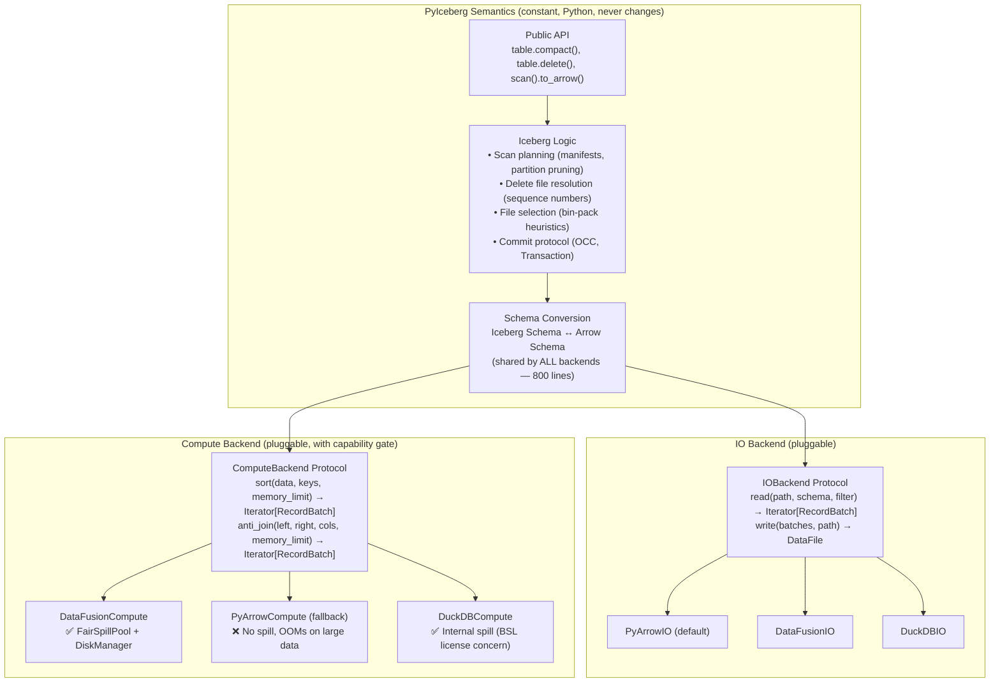

# Support for PyIceberg Pluggable Backend Architecture

[qzyu999@gmail.com](mailto:qzyu999@gmail.com)

---

## Introduction

Apache PyIceberg is tightly coupled to the `pyarrow` library for all data operations — reading Parquet, writing Parquet, filtering, sorting, and schema conversion — in a single 3,046-line monolith (`pyiceberg/io/pyarrow.py`). This document proposes refactoring PyIceberg into a **thin semantic client** with a pluggable backend architecture for read, write, and compute operations.

The immediate motivation is enabling Apache DataFusion as the compute backend for operations that require bounded-memory execution (sort, join, anti-join with spill-to-disk). However, the refactoring also positions PyIceberg as an engine-agnostic Iceberg implementation — the Python equivalent of Java Iceberg's relationship with Spark/Flink — where any Arrow-compatible engine can slot in for I/O or compute.

### The Vision

```
Java Iceberg : Spark/Flink :: PyIceberg : DataFusion/DuckDB/PyArrow/Polars/Ray
```

Java Iceberg owns Iceberg semantics and delegates compute to whatever engine is available. PyIceberg should do the same — own the spec logic, delegate data operations to a pluggable backend layer, and let users (or the system) choose which engine handles each concern.

### Key Pain Points Addressed

- **Out-of-Memory Crashes:** Compaction, equality delete resolution, upsert, and orphan file deletion all OOM on production-scale data because PyArrow has no spill-to-disk capability.
- **Data Correctness:** Tables with equality deletes (all Flink-written tables) are completely unreadable — a hard `ValueError` is thrown.
- **Monolithic Coupling:** All I/O and compute lives in one 3K-line file, making the codebase difficult to test, maintain, and extend.
- **No Engine Choice:** Users cannot choose an optimized backend for their deployment (GPU, distributed, or memory-constrained environments).
- **Missing Maintenance:** Compaction, delete compaction, and sorted writes are not implemented — impossible without bounded-memory compute.

---

## Background

### The Arrow Ecosystem: Format vs. Libraries

A critical distinction permeates this entire proposal:

| Concept | What it is | Role | Changeable? |
|---------|-----------|------|:---:|
| **Arrow columnar format** | A memory layout specification (RecordBatch, Schema, Array) | THE universal in-memory representation for analytics data. Used by Spark, Flink, DataFusion, DuckDB, Polars, RAPIDS. | **No** — permanent standard |
| **`pyarrow` library** | One Python package implementing Arrow + Parquet codec + compute | Currently the ONLY library PyIceberg uses for data operations | **Yes** — other libraries do the same operations |

The Arrow format is Iceberg's canonical in-memory representation. It appears in PyIceberg's public API (`pa.Table`, `pa.RecordBatch`) and is the interchange format between ALL engines. It is never replaced.

What CAN be replaced: which *library* reads Parquet into Arrow, which *library* computes on Arrow data, which *library* writes Arrow back to Parquet. All candidate libraries (DataFusion, DuckDB, Polars) consume and produce the same Arrow RecordBatches via the **Arrow C Data Interface** — a zero-copy pointer-exchange protocol that enables any-to-any library interop.

**Empirically verified:** We tested all 25 permutations (5 libraries × 5 libraries) of producing and consuming Arrow data. All pass with zero-copy exchange. (See `arrow_interop_test.py`.)

### How Arrow Interop Works (For Python Developers)

The Arrow C Data Interface is a simple contract: two C structs (`ArrowSchema` + `ArrowArray`) containing column metadata and memory addresses of the raw data buffers. When one library hands data to another, it passes two pointers. The receiving library reads the bytes directly from RAM — no serialization, no copy, no decode.

```python
# Every library can produce and consume Arrow data — zero-copy:
duckdb_result.to_arrow_table()            # DuckDB → Arrow
ctx.sql("...").to_arrow_table()           # DataFusion → Arrow  
pl_df.to_arrow()                          # Polars → Arrow
ctx.register_record_batches("t", [...])   # Any library ← Arrow
con.register("t", arrow_table)            # DuckDB ← Arrow
```

This means the pluggable backend interface has **exactly one swap boundary**: Arrow RecordBatch in, Arrow RecordBatch out. Any library that speaks Arrow works at this boundary.

### Arrow IPC: The Format That Enables Spill-to-Disk

Arrow IPC (Inter-Process Communication) serializes Arrow RecordBatches to bytes in a layout nearly identical to their in-memory representation. Reading back is near-free (memory-map, no decode). This is what makes DataFusion's spill-to-disk possible:

- **Spill:** When memory is full → sort data in RAM → dump bytes to SSD as Arrow IPC (NVMe speed, ~7 GB/s)
- **Read back:** Memory-map the IPC file → data is instantly available as Arrow arrays (no decode)

Arrow IPC is NOT Parquet. Parquet is optimized for storage (compressed, 3-10x smaller, slow to decode). Arrow IPC is optimized for speed (uncompressed, same size as RAM, trivial to read). DataFusion uses IPC for temporary spill; Parquet for permanent storage.

### Read/Write Equivalence Across Libraries

A key finding: **all candidate libraries produce identical Arrow output for Parquet reads.** The Parquet spec defines a deterministic decode algorithm. Given the same file, same projection, and same filter — PyArrow, DataFusion, DuckDB, and Polars all produce the same RecordBatches.

Reading Parquet is I/O-bound (network dominates):
```
S3 read: T_total = T_network (94%) + T_decompress (3%) + T_decode (3%)
```

Swapping who reads Parquet cannot produce a user-visible improvement. The operation is dominated by network latency, not CPU decode speed. The same applies to writing.

**This means the user-facing value of pluggable backends is entirely in COMPUTE (sort, join, filter) — not in read/write.** Read/write decoupling is a code health goal (maintainability, testability), not a performance goal.

### The Current State of PyIceberg

| Component | Location | Status |
|:---|:---|:---|
| `__datafusion_table_provider__` | `pyiceberg/table/__init__.py` | **Merged** ✅ — User-facing DataFusion query connector |
| `to_duckdb()`, `to_ray()`, `to_daft()` | `pyiceberg/table/__init__.py` | **Merged** ✅ — Read-only output formatters |
| `pyiceberg-core` (Rust bindings) | `pyproject.toml` optional extra | **Available** ✅ — Transforms + TableProvider |
| `datafusion` optional extra | `pyproject.toml` | **Available** ✅ — `datafusion>=52,<53` |
| Pluggable read/write/compute | — | ❌ Does not exist |
| Equality delete support | — | ❌ Hard `ValueError` |
| Bounded-memory compute | — | ❌ No spill-to-disk capability |

### MoR Prerequisite Chain

| Feature | Issue | Status | Relevance |
|:---|:---|:---|:---|
| Commit Retry | #3319 / #3320 | **In Progress** ⏳ | Safe compaction commits |
| REPLACE API | #3130 / #3131 | **Blocked** 🛑 (on #3320) | Compaction commit path |
| DeleteFileIndex (equality) | #3270 / #3285 | **In Progress** ⏳ | Prerequisite for eq delete resolution |
| DeleteFileIndex (positional) | #2918 | **Merged** ✅ | Foundation |

---

## The OOM Problem: Why This Is Critical

### Operations That Cannot Scale

| # | Operation | Status | OOM Pattern | What's Needed |
|:---|:---|:---|:---|:---|
| 1 | Equality delete reads | ❌ `ValueError` | Anti-join requires all delete keys accessible | Hash join with spill |
| 2 | CoW delete/overwrite | OOMs | Loads entire Parquet file (~1GB) into RAM | Streaming filter |
| 3 | Upsert | O(n²) + OOM | Row-by-row comparison + `concat_tables` | Hash join with spill |
| 4 | Compaction | Not implemented | External sort of arbitrarily large data | Merge sort with spill |
| 5 | Orphan file deletion | OOMs | Anti-join of millions of paths | Hash join with spill |
| 6 | Position delete compaction | Not implemented | Join + sort + rewrite | Spill-capable pipeline |

### The Fundamental Gap

PyArrow is a compute **kernel** library — individual operations on Arrow arrays. It has:
- No memory management (allocates until the OS kills the process)
- No spill-to-disk (no mechanism to overflow to SSD)
- No join operator (cannot anti-join two tables)
- No query planning (cannot pipeline filter → sort → write)

These are not missing features — they are **structural limitations**. PyArrow is designed as a kernel library (like NumPy), not an execution engine (like Spark). Adding spill-to-disk to PyArrow would require rewriting its entire architecture.

DataFusion IS an execution engine. It provides bounded-memory sort (external merge sort), join (Grace Hash Join), filter (streaming), and aggregate (spillable hash aggregate) — all with a configurable memory pool (`FairSpillPool`) and automatic spill to local SSD via Arrow IPC.

---

## Architecture: The Three-Axis Backend Model

### The Decomposition

Every PyIceberg data operation decomposes into three independent concerns:

```
Operation = Semantics × IO × Compute

Where:
  Semantics = Iceberg spec logic (scan planning, commit, delete resolution)
              → ALWAYS PyIceberg Python, NEVER pluggable
  IO        = Read Parquet → Arrow, Write Arrow → Parquet
              → PLUGGABLE (any Arrow-capable library)
  Compute   = Sort, Join, Filter on Arrow data
              → PLUGGABLE (with capability gate for spill)
```

### Architecture Diagram



### The Capability Gate

Not all compute backends can honor a `memory_limit` contract:

| Library | Sort with spill | Join with spill | License (ASF-safe) | Viable for OOM ops? |
|---------|:---:|:---:|:---:|:---:|
| **DataFusion** | ✅ | ✅ | ✅ Apache 2.0 | ✅ |
| **DuckDB** | ✅ | ✅ | ⚠️ S3 ext: BSL | ⚠️ License concern |
| **Polars** | ❌ | ❌ | ✅ MIT | ❌ |
| **PyArrow** | ❌ | ❌ | ✅ Apache 2.0 | ❌ |

Operations requiring bounded memory dispatch ONLY to backends with `supports_bounded_memory = True`.

### Why DataFusion Is the Recommended Compute Backend

Both DataFusion and DuckDB can provide bounded-memory compute. DataFusion is selected based on:

1. **License:** Fully Apache 2.0 (including object store). DuckDB's `httpfs` extension is Business Source License.
2. **Per-session memory isolation:** Each `SessionContext` has its own `FairSpillPool`. DuckDB's `memory_limit` is connection-wide.
3. **Arrow-native internals:** DataFusion's internal format IS Arrow RecordBatch (zero conversion). DuckDB converts at boundary.
4. **Ecosystem integration:** Already in PyIceberg's dependency tree (`pyproject.toml`, `pyiceberg-core`).
5. **Multi-operator fairness:** `FairSpillPool` explicitly divides memory among concurrent operators in a plan.

---

## Metadata Scaling: The Semantic Layer Must Also Be Streaming

### The Problem

Before data reaches the backend, PyIceberg's semantic layer determines *which* files to process by scanning manifests. For operations that enumerate all files across all snapshots (orphan deletion, expire snapshots), this can produce millions of manifest entries.

Today, PyIceberg materializes these into Python lists — which OOMs at scale.

### The Solution

New operations stream metadata through a generator → temp Parquet → register with the compute backend. Python memory stays at O(batch_size) regardless of total metadata volume:

```python
# Streaming pattern: constant memory, any scale
for entry in manifest_generator:
    buffer.append(entry.file_path)
    if len(buffer) >= batch_size:
        writer.write_batch(pa.record_batch([pa.array(buffer)], names=["path"]))
        buffer.clear()
# Then: ctx.register_parquet("valid_paths", tmp_file)
```

### Rollout Strategy

- **New operations** (orphan deletion, expire snapshots): streaming from day one
- **Existing operations** (scan planning, compaction file selection): incremental migration as follow-up PRs (these are partition-scoped and fit in memory for typical tables)

---

## Distributed and GPU: Orthogonal Layers

### Distributed (Ray / Dask)

PyIceberg is a single-node library (`import pyiceberg`). Distributed execution is handled by frameworks (Ray, Dask, Spark) that wrap PyIceberg:

```python
# Ray distributes partitions; each worker uses PyIceberg + DataFusion locally
@ray.remote
def compact_partition(table_name, partition):
    table = catalog.load_table(table_name)
    table.compact(partition_filter=partition)  # DataFusion prevents THIS worker from OOMing
```

Ray solves horizontal scaling (many machines). DataFusion solves vertical scaling (bounded memory per machine). They compose without conflicting. The pluggable architecture supports both — Arrow IPC enables distributed exchange (same format used for spill and network transfer).

### GPU (RAPIDS / cuDF)

NVIDIA's cuDF implements Arrow on GPU. It speaks the same C Data Interface and could theoretically serve as a `ComputeBackend`. However:

- **Hardware dependency:** Cannot be a default (not all machines have GPUs)
- **VRAM limits:** 8-80GB GPU memory vs. 100GB-2TB SSD for spill
- **I/O-bound operations:** Iceberg maintenance is I/O-dominated; GPU acceleration provides diminishing returns
- **Correct role:** User-facing analytics queries (where GPU parallelism shines), not internal maintenance

The architecture does not exclude GPU backends — it just doesn't depend on them. A `CudfComputeBackend` could be a community contribution.

---

## User Experience and API Design

### Principle: Shield Current Users, Empower Power Users

The refactoring must be **invisible** to existing users while providing configuration knobs for those who need them.

### Existing Methods: No Signature Change

```python
# These signatures NEVER change:
table.append(df)                          # df: pa.Table | pa.RecordBatchReader
table.overwrite(df)                       # same
table.delete("status = 'expired'")        # same
df = table.scan().to_arrow()              # same — now resolves equality deletes!
```

### New Methods: Additive

```python
# New operations (purely additive):
table.compact()
table.delete_orphan_files()
table.rewrite_position_deletes()
```

### Configuration: Existing Mechanisms

```yaml
# .pyiceberg.yaml (future Phase 2+)
execution:
  memory-limit: 1GB
  compute-backend: datafusion    # or: pyarrow (fallback)
  io-backend: pyarrow            # or: datafusion, duckdb (future)
```

```bash
# Environment variable override
export PYICEBERG_EXECUTION__MEMORY_LIMIT=2GB
```

For Phase 1: **zero configuration needed.** System auto-detects DataFusion availability.

### User Demographic Matrix

| User Profile | Read Backend | Compute Backend | Memory Config | What They Get |
|:---|:---|:---|:---|:---|
| **Casual user** (small tables, local) | PyArrow (default) | PyArrow (default) | None (default 512MB) | Everything works as today, no change |
| **Production user** (large tables, S3) | PyArrow (default) | DataFusion (auto-detected) | Default or tuned | Bounded-memory ops, no OOM |
| **Data engineer** (compaction at scale) | PyArrow | DataFusion | `memory-limit: 4GB` | Compact 100GB+ tables reliably |
| **ML engineer** (GPU-accelerated reads) | cuDF (future) | DataFusion | Default | GPU-parallel decode + bounded compute |
| **Platform team** (distributed pipeline) | PyArrow per-worker | DataFusion per-worker | Per-worker budget | Ray/Dask distributes; each worker bounded |
| **DuckDB enthusiast** | DuckDB (future) | DuckDB (future) | DuckDB internal | Full DuckDB pipeline (BSL caveat) |
| **Contributor** (testing/debugging) | Mock backend | Mock backend | N/A | Isolated unit tests without real files |

### Mix-and-Match Combinations

All backends compose via Arrow RecordBatch. Valid combinations:

| Read | Compute | Write | Works? | Use Case |
|------|---------|-------|:---:|---|
| PyArrow | PyArrow | PyArrow | ✅ | Default today (OOMs on large) |
| PyArrow | DataFusion | PyArrow | ✅ | **Phase 1 target** — bounded compute |
| DataFusion | DataFusion | PyArrow | ✅ | Full DF read pipeline + bounded compute |
| DuckDB | DataFusion | PyArrow | ✅ | DuckDB reads (corrupt file compat) + DF compute |
| DuckDB | DuckDB | DuckDB | ⚠️ | Full DuckDB (BSL license for S3) |
| cuDF | DataFusion | PyArrow | ✅ | GPU decode + CPU bounded-memory sort |
| PyArrow | PyArrow | PyArrow | ✅ + Ray | Per-worker: Ray distributes, PyArrow local |
| PyArrow | DataFusion | PyArrow | ✅ + Ray | Per-worker: Ray distributes, DF prevents OOM |

---

## The Refactoring: From Monolith to Pluggable

### What Moves Where

```
pyiceberg/io/pyarrow.py (3,046 lines) decomposes into:

STAYS IN PLACE (shared infrastructure):
├── Schema conversion (800 lines) — Iceberg ↔ Arrow, used by ALL backends
└── Delete file handling logic — moves to semantics layer (table/__init__.py)

EXTRACTED INTO IOBackend:
├── ArrowScan (reading)
├── write_file / _dataframe_to_data_files (writing)
└── StatsAggregator (statistics)

EXTRACTED INTO ComputeBackend:
├── Sort operations (currently pa.Table.sort_by)
├── Filter operations (currently pc.Expression evaluation)
└── NEW: Join operations (anti_join, hash_join — doesn't exist today)

BACKEND-SPECIFIC (per implementation):
└── Expression conversion (Iceberg filter → backend-specific format)
    • PyArrow: pc.Expression (200-line visitor)
    • DataFusion: SQL string ("col > 5")
    • DuckDB: SQL string
```

### The Protocols

```python
class IOBackend(Protocol):
    """Who reads and writes Parquet files."""
    def read_parquet(self, location: str, schema: Schema, projection: list[int],
                     filter: BooleanExpression, io_properties: dict[str, str]
                     ) -> Iterator[pa.RecordBatch]: ...
    def write_parquet(self, batches: Iterator[pa.RecordBatch], location: str,
                      schema: Schema, properties: dict[str, str],
                      io_properties: dict[str, str]) -> DataFile: ...
    def collect_statistics(self, location: str, schema: Schema,
                           io_properties: dict[str, str]) -> dict[int, ColumnStatistics]: ...

class ComputeBackend(Protocol):
    """Who does sort/join/filter on Arrow data."""
    @property
    def supports_bounded_memory(self) -> bool: ...
    def sort(self, data: Iterator[pa.RecordBatch], sort_keys: list[tuple[str, str]],
             memory_limit: int) -> Iterator[pa.RecordBatch]: ...
    def anti_join(self, left: Iterator[pa.RecordBatch], right: Iterator[pa.RecordBatch],
                  on: list[str], memory_limit: int) -> Iterator[pa.RecordBatch]: ...
    def filter(self, data: Iterator[pa.RecordBatch],
               predicate: BooleanExpression) -> Iterator[pa.RecordBatch]: ...
```

Key properties:
- All inputs/outputs are `Iterator[pa.RecordBatch]` — streaming by default, bounded memory
- `memory_limit` is a contract — backends that can't honor it declare `supports_bounded_memory = False`
- Arrow is the wire format — backends are independently substitutable

---

## Implementation Strategy: Interface Emergence

### The CS Principle

> "When you have two or three implementations of something, then you can see what the
> interface should be. When you have one implementation, you're just guessing." — Fowler

We have one implementation (PyArrow). We're building a second (DataFusion). The shared interface emerges from real code, not speculation.

### Phased Execution

**Phase 1 (Now):** Build DataFusion compute in `pyiceberg/execution/compute.py`. Function signatures ARE the implicit interface (Arrow-in, Arrow-out). No protocol extraction yet. Delivers immediate value (bounded-memory operations).

**Phase 2 (After Phase 1 proven locally):** Extract `IOBackend` + `ComputeBackend` protocols from the two concrete implementations. Refactor `pyiceberg/io/pyarrow.py` into `PyArrowBackend`. Pure refactoring — no behavior change.

**Phase 3 (Community-driven):** Additional backends (DuckDB, Polars, cuDF) contributed by the community against the stable protocol.

### Why This Order

1. Phase 1 delivers user value immediately (OOM fix ships now)
2. Phase 1 proves the interface through real implementation
3. Phase 2 is risk-free refactoring (existing test suite validates)
4. Phase 3 is community-extensible (we don't maintain backends we don't use)

---

## Relationship to Java Iceberg

### The Analogy

Java Iceberg is a thin metadata/semantic layer that delegates compute:

```
Java Iceberg (semantics) + Spark (compute) = production Iceberg
PyIceberg (semantics) + DataFusion (compute) = production PyIceberg
```

This refactoring makes the analogy explicit: PyIceberg becomes an engine-agnostic semantic layer, with compute delegated to whichever engine is available — just as Java Iceberg delegates to whichever JVM engine is present.

### Semantic Parity with Java

Operations must match Java's **semantics** (spec-mandated behavior). They may use different **algorithms** (DataFusion's external merge sort vs. Spark's distributed shuffle sort) and different **strategies** (bin-pack heuristics should match for behavioral parity).

| Category | Must match Java? | Example |
|----------|:---:|---|
| Spec semantics | ✅ Exactly | Sequence number gating, partition spec eval |
| Strategy heuristics | Should match | BinPack file selection, Z-Order interleaving formula |
| Execution algorithms | No (deployment model differs) | Grace Hash Join vs. broadcast join |

---

## OOM Safety Guarantee

Every operation follows the same safety contract:

```
BEFORE: Table is in valid state S₀
DURING: New data files written to storage (orphans until commit)
ON SUCCESS: Atomic commit → snapshot S₁
ON FAILURE: No commit → table remains at S₀ (orphan files cleaned by maintenance)
```

Iceberg's OCC guarantees that a mid-operation failure cannot corrupt table state. This holds regardless of backend choice.

---

## Goals

- **Equality delete reads:** `table.scan().to_arrow()` returns correct results on all V2 tables
- **Bounded-memory compaction:** `table.compact()` operates on 100GB+ with configurable budget
- **No existing regressions:** All tests pass without `datafusion` installed
- **Pluggable architecture:** Clean `IOBackend` + `ComputeBackend` protocols (Phase 2)
- **Zero-config UX:** Everything works with sensible defaults
- **Engine-agnostic:** PyIceberg as thin semantic client, any engine for compute

## Non-Goals

- **Distributed execution:** Single-node. Ray/Dask layer above PyIceberg handles distribution.
- **Replace PyArrow entirely:** PyArrow stays as default IO backend and fallback compute.
- **Force dependency:** DataFusion optional. PyArrow fallback always works.
- **Pluggable Iceberg semantics:** Semantics always in PyIceberg Python. Never delegated.

---

## Related Issues

**PyIceberg:** #3554 (DataFusion epic) · #1078 (MoR) · #1210 / #3270 (equality deletes) · #3356 (execution isolation) · #1092 (compaction) · #1200 (orphan deletion) · #3285 (DeleteFileIndex) · #3319 / #3320 (commit retry) · #3130 / #3131 (REPLACE API) · #1818 (V3/DV) · #2918 (positional DeleteFileIndex, merged)

**datafusion-python:** [#1217](https://github.com/apache/datafusion-python/issues/1217) (FFI stability)

---

## References

- `pyiceberg_datafusion/pluggable_v2.md` — Detailed technical analysis
- `pyiceberg_datafusion/datafusion_direction.md` — Architectural pivot documentation
- `pyiceberg_datafusion/support_for_pyiceberg_datafusion_v2.md` — DataFusion compute proposal
- `pyiceberg_datafusion/arrow_interop_test.py` — Empirical proof of 25/25 library interop
