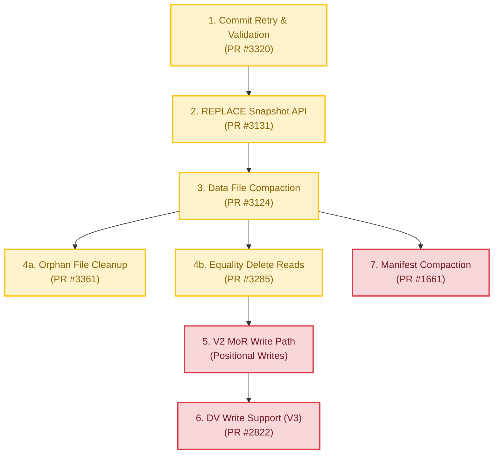

# Support for PyIceberg Table Maintenance & Write-Path Evolution

**Author**: [qzyu999@gmail.com](mailto:qzyu999@gmail.com)  
**Status**: Proposal Draft  
**Target Spec Versions**: Iceberg V2 / V3 Compatibility  
**Related Reference Spec**: [pyiceberg_mor_rowdelta.md](file:///Users/jaredyu/Desktop/open_source/iceberg-notes/pyiceberg_maintenance/pyiceberg_mor_rowdelta.md)

---

## 1. Background & Strategic Context

Apache Iceberg recommends three core table maintenance operations:
1. **Expire Snapshots** (cleans up history to reclaim storage)
2. **Remove Old Metadata Files** (prunes commit logs)
3. **Delete Orphan Files** (removes physical objects unreferenced by any snapshot)

And two optional optimizations:
4. **Compact Data Files** (mitigates the "small file problem" by bin-packing)
5. **Rewrite Manifests** (compacts metadata layer files to optimize scan planning)

Currently, PyIceberg is moving from a read-heavy client to an active write-path library. While read support for V2/V3 Merge-on-Read (MoR) and Deletion Vectors (DVs) is established (via PR #1516), programmatic table maintenance APIs and native MoR writes are immature or unsupported.

### The Key Pain Points:
*   **Storage Bloat & Missing GC Gates**: The current Python `expire_snapshots` implementation is a metadata-only operation; it does not physically delete unreferenced Parquet data files from object storage. Crucially, PyIceberg lacks support for the `gc.enabled` table property safety gate, raising the risk of silent, catastrophic data loss if run on tables with externally managed retention schemes.
*   **Unsafe Orphan File Discovery**: Current Python orphan file pruners lack default grace periods. Without a safety `olderThan` threshold (e.g. 24 hours), they will aggressively delete uncommitted physical files written in transit by concurrent parallel writers.
*   **Small File Fragmentation & Basic Layouts**: Ingestion patterns generate thousands of sub-optimal files. PyIceberg's proposed compaction is limited to basic bin-packing; it lacks advanced **Sort** and **Z-Order** clustering strategies, failing to leverage Column Min/Max dictionary skipping during read queries.
*   **Resource & Thread Constraints**: Single-node Python environments lack distributed JVM worker capacity. Memory pressure and Garbage Collection sweeps during large-scale operations frequently result in Out-Of-Memory (OOM) failures unless structured zero-copy batch streaming PyArrow pipelines are used.

For a rigorous mathematical and computer science analysis of the underlying storage metrics (including WAF, RAF, Shannon entropy bounds, and Roaring Bitmap layouts), refer to the core spec: [pyiceberg_mor_rowdelta.md](file:///Users/jaredyu/Desktop/open_source/iceberg-notes/pyiceberg_maintenance/pyiceberg_mor_rowdelta.md).

---

## 2. Strategic Feature Interactions

Implementing table maintenance and the write path requires navigating a complex web of feature interdependencies.

### 2.1 Commit Retry with Concurrency Validation
Every metadata transaction (such as committing a compacted set of files) is subject to concurrent catalog mutations. 
*   **Safety Bedrock**: PyIceberg cannot safely merge data file compaction without a bulletproof **Commit Retry and Validation** engine. If a concurrent commit occurs while compaction is running, the compaction worker must retry its CAS (Compare-And-Swap) transaction and validate that its target files were not concurrently removed or overwritten.
*   **Mechanics**: This relies on the active integration of **PR #3320** (Commit retry with conflict validation) and the four core assertions: `validateDataFilesExist`, `validateDeletedFiles`, `validateNoConflictingAppends`, and `validateAddedDVs`.

### 2.2 Merge-on-Read (MoR) Write Path Alignment
Merge-on-Read transactions require a unified `RowDelta` commit architecture. 
*   **V2 vs. V3 Strategy**: There is active debate on whether PyIceberg should implement V2 Positional Delete writes. 
*   **Recommendation**: **Go V3-First for Writes, but maintain robust V2 reads and conversions.** 
    *   Writing V2 positional delete files (Parquet logs) introduces extensive sorting and memory overhead. Skipping V2 positional writes saves developer resources.
    *   Instead, PyIceberg should write V3 Deletion Vectors (Roaring Bitmaps inside Puffin blobs, PR #2822), which compress deletes dynamically near Shannon's optimal limits.
    *   However, streaming engines like Flink and Spark will continue to write V2 Equality Deletes to shared tables. PyIceberg **must** support V2 equality delete reads and dynamic conversion (PR #3285) to cleanly compact mixed-language enterprise tables.

### 2.3 Deletion Vectors (DVs)
Deletion Vectors are the modern standard for high-performance updates. Storing roaring bitmaps directly inside Puffin files removes the need for costly delete-compaction layers. Completing the resurrected `PuffinWriter` (PR #2822) is the key priority for the V3 write path.

---

## 3. Goals & Non-Goals

### Goals:
*   Establish a safe, transactionally consistent CAS commit retry loop (PR #3320) with full data conflict validations.
*   Deliver local, high-performance Data File Compaction supporting **Bin-Packing, Sort, and Z-Order strategies** utilizing zero-copy PyArrow C++ Dataset APIs (PR #3124).
*   Implement physical object deletion for snapshot expiration and orphan file pruners (PR #3361 / PR #1958) that strictly respect **`gc.enabled` table property safety gates** and enforce **mandatory grace periods (`olderThan`)** to prevent concurrent write path corruption.
*   Support metadata manifest consolidation bounded by `manifest.target-size-bytes` to avoid index layer fragmentation.
*   Provide robust reading and compaction conversion of V2 Equality Deletes (PR #3285) and native write support for V3 Deletion Vectors (PR #2822).

### Non-Goals:
*   Building distributed clustering engines (like Spark/Flink) in Python. All maintenance tasks are designed to execute concurrently on single-node instances or lightweight container runtimes (e.g. AWS ECS, Kubernetes pods) without JVM dependencies.

---

## 4. Proposed Evolutionary Roadmap (Release Phases)

To optimize community developer time and guarantee that each PR yields a high return on investment (ROI) without introducing regressions, we propose a five-phase rollout:



### Phase 1: Transaction Bedrock (Target: Q2)
*   **Focus**: Merge **PR #3320** (lawofcycles).
*   **Impact**: Enables transactional safety, ensuring any table write or maintenance operation can recover gracefully from concurrent commits via optimistic concurrency control (OCC).

### Phase 2: Atomic Swap Foundations (REPLACE Snapshot API) (Target: Q2)
*   **Focus**: Merge **PR #3131** (REPLACE API).
*   **Impact**: Adds the transactional REPLACE snapshot update, allowing PyIceberg to swap a specific group of old files with a new group of files atomically.

### Phase 3: Local Data Compaction Engine (Target: Q2/Q3)
*   **Focus**: Merge **PR #3124** (Compaction) equipped with size-based planners and layout strategies (BinPack, Sort).
*   **Impact**: Empowers PyIceberg to group small files into optimized Parquet blocks. Bypasses distributed JVM overhead by utilizing C++ streaming arrays.

### Phase 4: Safe Physical Storage Pruning (Target: Q3)
*   **Focus**: Complete and merge **PR #3361** (Delete orphan files) and ensure snapshot expiration physically deletes dead files.
*   **Impact**: Shuts down runaway cloud storage costs while enforcing the `gc.enabled` property and default 24-hour grace period safety gates to guarantee zero-data-loss execution.

### Phase 5: MoR V2 Read Interoperability (Equality Delete Reads) (Target: Q3/Q4)
*   **Focus**: Merge **PR #3285** (Equality delete reads/conversion).
*   **Impact**: Enables complete V2 read-parity, allowing PyIceberg to parse Flink/Spark-written equality delete files and evaluate equality filter predicates at scan-time on PyArrow tables.

### Phase 6: The Dual MoR Write Path (V2 Positional & V3 Deletion Vectors) (Target: Q4)
*   **Focus**: Implement native V2 Positional Delete writes and resurrect **PR #2822** (Deletion Vector write support).
*   **Impact**: Delivers complete write compliance for both stable enterprise engines (V2 positional) and bleeding-edge cloud engines (V3 DVs).

### Phase 7: Metadata Index Optimization (Manifest Compaction) (Target: Q4/Future)
*   **Focus**: Complete and merge **PR #1661** (RewriteManifests API).
*   **Impact**: Consolidates tiny manifest files into optimized target-size blocks, reducing scan-planning I/O.

### 4.8 Architectural Dependencies Explained

To prevent catalog corruption and guarantee zero-data-loss execution in multi-writer environments, each phase is structurally linked to its predecessors by rigorous database constraints:

1.  **Phase 1 (OCC Bedrock) $\rightarrow$ Phase 2 (REPLACE API)**: The `REPLACE` snapshot update (Phase 2) swaps old data files for new ones. If a concurrent transaction commits while `REPLACE` is executing, it relies on Phase 1's validation assertions (`validateDeletedFiles`, `validateNoConflictingAppends`) inside `_validate_concurrency()` to detect conflicts. Without Phase 1, concurrent transactions would silently corrupt table metadata.
2.  **Phase 2 (REPLACE API) $\rightarrow$ Phase 3 (Data Compaction)**: Physically, compaction writes consolidated data files. Mathematically, it is a swap transaction that deletes the old fragmented files and appends the new ones. It *must* use the atomic `REPLACE` snapshot API (Phase 2) to commit this swap.
3.  **Phase 3 (Data Compaction) $\rightarrow$ Phase 4 (Storage Pruning)**: 
    *   *Storage Economics*: Compaction is a "dead file generator"—it deletes references but leaves files on disk. Running compaction without physical pruning (Phase 4) causes rapid cloud storage cost expansion.
    *   *Safety Invariant*: Physical file deletion is destructive. The pruner must safely traverse manifest files to build a reachability set. We must ensure the compaction and REPLACE transactions are fully stabilized (Phase 3) so the pruner does not aggressively delete active files concurrently written.
4.  **Phase 3 (Data Compaction) $\rightarrow$ Phase 5 (V2 Equality Delete Reads)**: To compact data files in a table containing V2 Equality Deletes, PyIceberg must be able to read and resolve those deletes during the initial read scan. If PyIceberg cannot parse equality deletes (Phase 5), compaction would rewrite files while ignoring active deletes, permanently bringing deleted rows back to life (silent data corruption).
5.  **Phase 5 (V2 Reads) $\rightarrow$ Phase 6 (V2 & V3 MoR Writes)**: Exposing row-level deletes requires scanning target data files to extract row indices matching deletion predicates. This requires a fully operational read-path (Phase 5). Furthermore, committing row deletes via `RowDelta` requires Phase 1's OCC validation gates (`validateDataFilesExist`) to prevent writing deletes targeting data files that concurrent transactions have already deleted or compacted.
6.  **Phase 6 (V2 writes) $\rightarrow$ Phase 6 (V3 DV writes)**: V3 Deletion Vectors are drop-in replacements for positional deletes. They share the same index extraction and `RowDelta` transaction logic developed in Phase 5. Phase 5 builds the **structural write-path framework**, while Phase 6 swaps the physical serialization from Parquet to roaring bitmaps inside Puffin blobs.
7.  **Phase 3 (Data Compaction) $\rightarrow$ Phase 7 (Manifest Compaction)**: High-frequency data appends and compactions generate thousands of fragmented manifests. Phase 7 is a downstream cleanup chore that utilizes the identical size-based planners and REPLACE transaction framework stabilized in Phase 2 and 3.

### 4.9 Code-Level Technical Dependencies (Python Class & Module Mappings)

The table below outlines the exact PyIceberg classes, methods, and internal API modules introduced in upstream phases that are imported or inherited by downstream features:

| Upstream Phase | Code Primitive / API Module | Downstream Dependent Feature | Concrete Technical Requirement |
| :--- | :--- | :--- | :--- |
| **Phase 1** (OCC Bedrock) | `_validate_concurrency(base_metadata, new_metadata)` inside `pyiceberg/table/update/snapshot.py` | `ReplaceFiles` (Phase 2) & `RowDelta` (Phase 6) | Transaction classes must invoke `_validate_concurrency()` during the catalog pointer swap retry loop to assert targeted data files have not been concurrently deleted or modified. |
| **Phase 2** (REPLACE API) | `ReplaceFiles` action class (inherits `SnapshotUpdate` in `pyiceberg/table/update/snapshot.py`) | `compact()` in `MaintenanceTable` (Phase 3) | The compaction execution pipeline calls `transaction.rewrite_files()` which returns an instance of `ReplaceFiles` to execute the atomic metadata swap of small files for large ones. |
| **Phase 3** (Compaction) | `ListPacker` (in `pyiceberg/utils/bin_packing.py`) | `RewriteManifests` (Phase 7) | The manifest compactor planner reuses the `ListPacker` bin-packing algorithm to cluster tiny manifests up to the `manifest.target-size-bytes` boundary. |
| **Phase 5** (Equality Reads) | `DeleteFileIndex` (in `pyiceberg/table/__init__.py`) | `rewrite_data_files()` (Phase 3) & MoR writes (Phase 6) | The scan engine inside compaction and row deletions must call `DeleteFileIndex` to group delete files per data file, allowing PyArrow C++ projection to filter rows before rewriting or tracking new offsets. |
| **Phase 6** (V2 Writes) | `RowDelta` transaction action (extends `SnapshotUpdate` in `pyiceberg/table/update/snapshot.py`) | Deletion Vector Writes (Phase 6 / PR #2822) | The committing transaction for V3 deletion vectors is identical to Phase 6. Downstream DV writes inherit and execute `RowDelta` commits to append Puffin roaring bitmaps with correct logical sequence numbers ($S_{\text{delete}} = S_{\text{snapshot}}$). |

---

## 5. Strategic Roadmap: MoR V2 Reads & Writes (Issue #1078)

While V3 Deletion Vectors are the long-term standard, legacy and enterprise engines (e.g., older versions of Trino, Snowflake, AWS Athena, Spark 3.x) rely strictly on **V2 Positional Delete Parquet files**. To provide high-interoperability write support without forcing these engines to upgrade, PyIceberg must implement the V2 MoR write path.

```
       Row Mutations (Delete/Update)
                     |
                     v
   Identify Target Data File & Row Offset
                     |
                     v
      Sort Offsets by (path, pos) Asc
                     |
                     v
     Write Positional Delete Parquet
  (path: String, pos: Long, row: Optional)
                     |
                     v
     Commit via RowDelta Transaction
```

### 5.1 Technical Components Required

#### 1. Target Position Index Extraction
When performing row-level deletes, the query engine must identify the exact physical row offsets of records matching the deletion predicate.
*   **Mechanics**: Expose the physical row offsets from PyArrow's parquet reader during table scanning. The scanner must return a structured stream of `(file_path, physical_row_index)` tuples representing targeted records.

#### 2. Global Sorting & Consolidation
The Iceberg V2 specification strictly mandates that positional delete files must be sorted by `file_path` and then by `pos` in ascending order.
*   **Mechanics**: Implement a fast in-memory sorting utility using PyArrow or NumPy to sort the collected delete offsets before serialization:
    ```python
    # Ensure strict adherence to Spec V2 sorting constraints
    sorted_deletes = pyarrow.Table.from_arrays(
        [file_paths, row_positions],
        names=["file_path", "pos"]
    ).sort_by([("file_path", "ascending"), ("pos", "ascending")])
    ```

#### 3. V2 Positional Delete Writer
A utility that writes the sorted paths and positions to standard Parquet files matching the Spec V2 positional delete schema.
*   **Schema Definition**:
    *   `file_path`: `string` (required) - The absolute URI of the data file containing the deleted row.
    *   `pos`: `long` (required) - The zero-based row index within the data file.
    *   `row`: `struct` (optional) - The original row values (optional, can be skipped to minimize write amplification).

#### 4. RowDelta Transaction Implementation
Extend PyIceberg's transaction engine to support `RowDelta` commits.
*   **Mechanics**: The committing builder must generate a `RowDelta` update mapping the newly written positional delete files to the corresponding partition under the transaction's sequence number ($S_{\text{delete}} = S_{\text{snapshot}}$).

### 5.2 Key Architectural Decision: One Delete File per Data File (Issue #1808)
When implementing the V2 positional delete write path, PyIceberg will follow Java reference engine learnings and **enforce a 1:1 mapping between mutated data files and positional delete files** ($\text{DeleteFileCount} = \text{DataFileCount}_{\text{mutated}}$), rather than generating a single massive shared positional delete file.

#### Architectural Rationales:
1.  **Zero Lifecycle Coupling**: If a shared delete file references multiple data files (e.g., `d1.parquet` and `d2.parquet`), their lifecycles become structurally linked. Under such coupling, `d1` cannot be expired or compacted during table maintenance without rewriting the shared delete file to remove references. Generating one delete file per data file ensures clean, independent file lifecycle isolation.
2.  **Minimized Read Amplification (RAF)**: With a shared delete file, any reader scanning `d1` must parse the entire shared file even if 99% of its records target `d2`. Isolating deletes to one file per data file guarantees that query engine readers only scan the exact deletions relevant to their target file path.
3.  **GIL & Memory Footprint Optimization**: Writing a single shared delete file requires accumulating deletions across all files in memory, sorting them globally by `(file_path, pos)`, and then serializing. Writing deletes *per data file* allows PyIceberg to stream writes, flush a positional delete Parquet file immediately after a single data file is processed, and reclaim memory immediately, avoiding local Out-of-Memory (OOM) situations in container environments.

---

## 6. Open Questions & Community Decisions

1.  **Orphan Deletion Strategy & Grace Period Validation**: Should orphan file deletion be run as a post-compaction hook, or scheduled as an asynchronous out-of-band maintenance cron?
    *   *Recommendation*: Keep them decoupled. Compaction should focus entirely on table state transition ($S_{\text{input}} \to S_{\text{output}}$). Orphan file cleanup should be scheduled independently (e.g. daily/weekly) to prevent slowing down hot-path transactions, and must enforce a default 24-hour `olderThan` grace period.
2.  **Handling `gc.enabled = false`**: How should the maintenance builders behave when physical deletion is requested on tables with GC disabled?
    *   *Recommendation*: Raise a clear `ValidationError` indicating that physical cleanup is disabled by table properties. Do not silently succeed without action.
3.  **V2 vs. V3 MoR Default Write Mode**: If a user performs a write mutation on a V2/V3 table, should PyIceberg default to V2 positional deletes or V3 deletion vectors?
    *   *Proposal*: Expose a configuration property `write.delete.mode` with options `copy-on-write` (default) and `merge-on-read`. When `merge-on-read` is selected, default to V2 positional deletes for format-version 2 tables, and V3 Deletion Vectors for format-version 3+ tables.
4.  **Z-Order Compaction Memory Boundaries**: Does multi-column sorting and Z-Ordering via PyArrow C++ introduce risk of local OOM failures on resource-constrained containers?
    *   *Recommendation*: Perform size-based block filtering. Default to BinPack if input sizes exceed available memory, or execute sorting in stream-batch fragments using local temporary directories.
5.  **Resurrecting PR #2822**: Who will own the resurrection of the `PuffinWriter` branch?
    *   *Proposal*: Identify a co-maintainer to coordinate with rambleraptor. The logic inside PR #2822 is mature but requires updating to the latest package structure of PyIceberg.
6.  **Cross-Language Validation**: How will we test concurrency safety against Spark/Flink engine commits?
    *   *Proposal*: Utilize the Docker-based integration test suite to run parallel Flink writers and PyIceberg compactor loops checking for validation errors.
