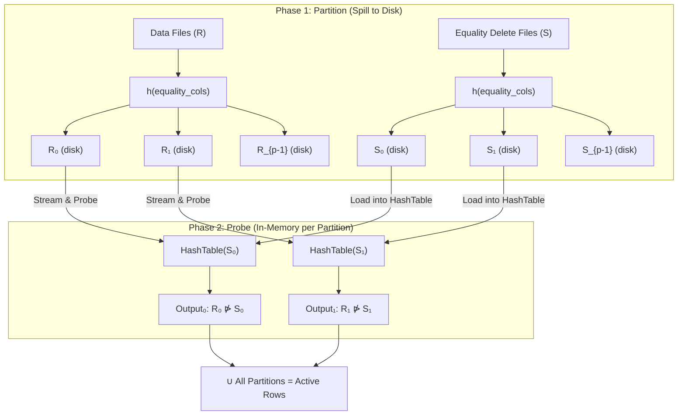
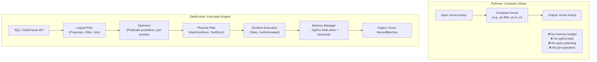
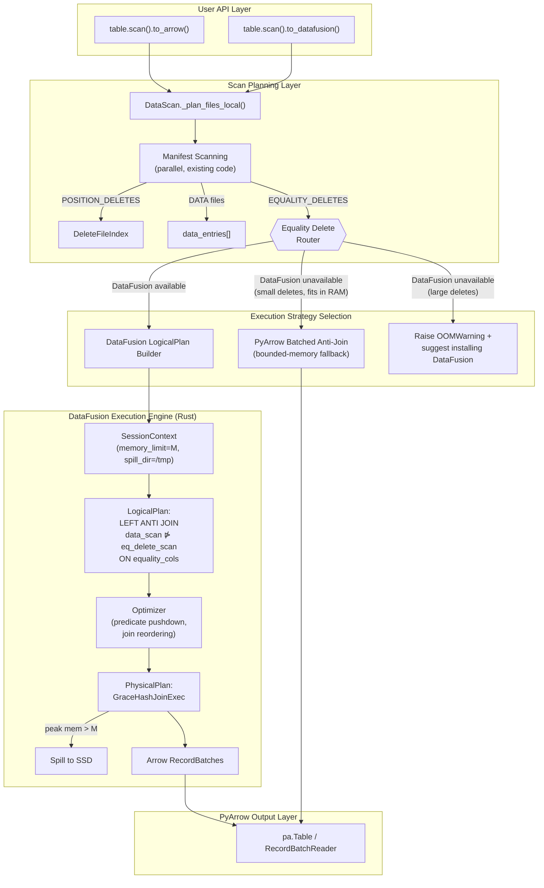
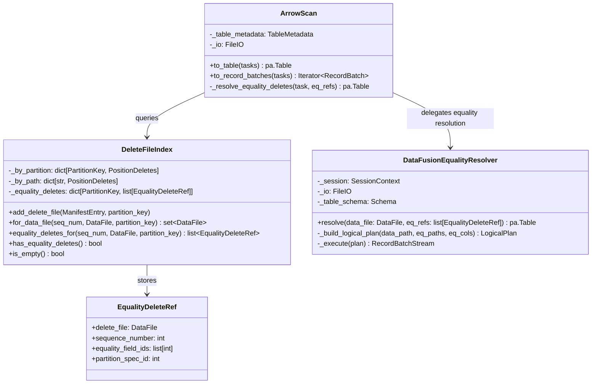
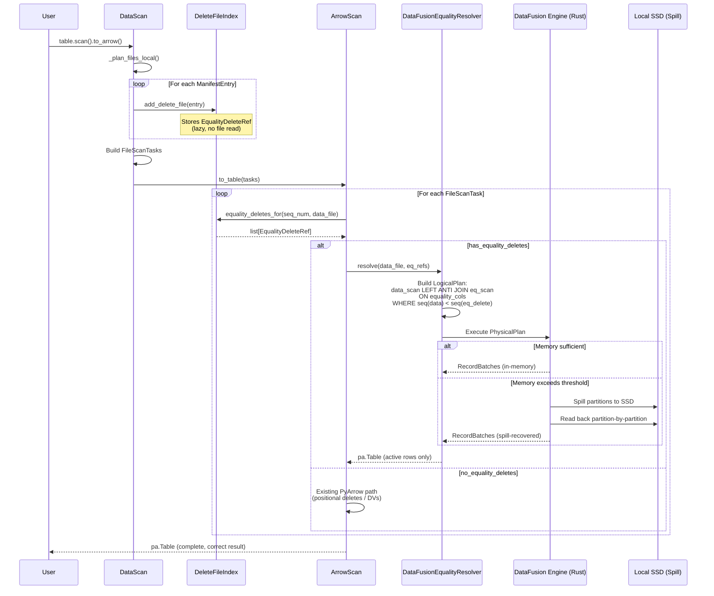
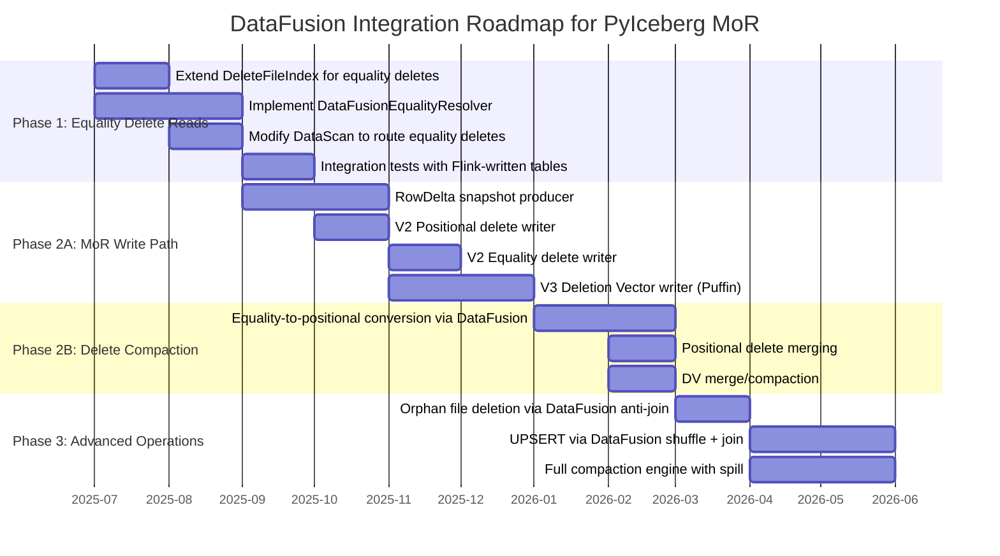
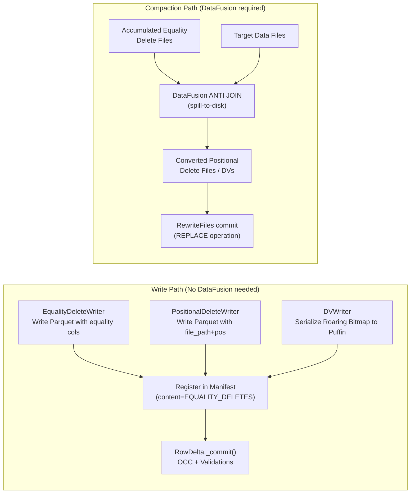
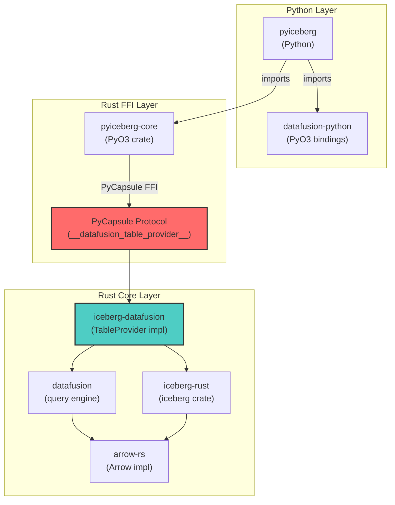
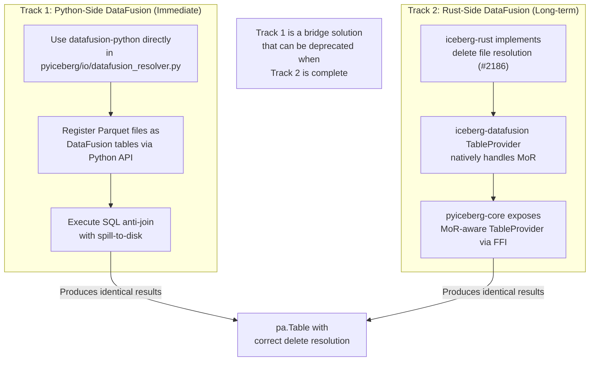

# Proposal: Deep Integration of Apache DataFusion into PyIceberg for Spill-to-Disk Execution

[qzyu999@gmail.com](mailto:qzyu999@gmail.com)

---

## Abstract

This document proposes a formal, rigorous architectural integration of Apache DataFusion into PyIceberg to resolve the class of Out-of-Memory (OOM) failures that currently prevent PyIceberg from achieving feature parity with Java Iceberg for V2/V3 Merge-on-Read (MoR) operations. The proposal is grounded in first-principles computer science theory—relational algebra, external memory algorithms, information-theoretic bounds, and computational complexity—where every code change is derived as the engineering implementation of a mathematical proof or invariant rather than ad hoc design.

The primary focus is **reading equality delete files** via the `DeleteFileIndex`, with a phased roadmap extending to all V2/V3 MoR read/write features. We demonstrate that DataFusion's Grace Hash Join with spill-to-disk provides the theoretically optimal solution, achieving $O(N + M)$ time complexity while bounding memory consumption to a configurable threshold $\mathcal{M}$—a capability that PyArrow alone is structurally incapable of providing.

---

## Table of Contents

1. [The Problem Space: Formal Characterization](#1-the-problem-space-formal-characterization)
2. [Theoretical Foundations](#2-theoretical-foundations)
3. [Why PyArrow Alone Cannot Solve This](#3-why-pyarrow-alone-cannot-solve-this)
4. [DataFusion: The Execution Engine Bridge](#4-datafusion-the-execution-engine-bridge)
5. [Current State: Existing DataFusion Integration in PyIceberg](#5-current-state-existing-datafusion-integration-in-pyiceberg)
6. [Architecture: Deep DataFusion Integration](#6-architecture-deep-datafusion-integration)
7. [Phase 1: Equality Delete Reads via DataFusion](#7-phase-1-equality-delete-reads-via-datafusion)
8. [Phase 2: Full V2/V3 MoR Read/Write Features](#8-phase-2-full-v2v3-mor-readwrite-features)
9. [The iceberg-rust Dependency Chain](#9-the-iceberg-rust-dependency-chain)
10. [FFI Bridge Hardening](#10-ffi-bridge-hardening)
11. [Verification Plan](#11-verification-plan)
12. [References](#12-references)

---

## 1. The Problem Space: Formal Characterization

### 1.1 The OOM Problem as a Computability Constraint

The fundamental issue is not a bug but a **computability constraint** imposed by the physical memory model of single-node execution. We can formalize this precisely.

**Definition 1.1 (Memory-Bounded Computation).** Let $\mathcal{M}$ denote the available physical RAM on a single node (bytes). A computation $C$ is **memory-feasible** if and only if:

$$\text{peak}(\text{WorkingSet}(C)) \leq \mathcal{M}$$

where $\text{WorkingSet}(C)$ is the set of all memory pages actively referenced during the execution of $C$.

**Definition 1.2 (Memory-Infeasible Operation).** An operation $\mathcal{O}$ on input of size $N$ is **memory-infeasible** if there exists no in-memory algorithm $A$ such that $\text{peak}(\text{WorkingSet}(A)) \leq \mathcal{M}$ for all valid inputs where $N > \mathcal{M}$.

**Theorem 1.1 (PyIceberg OOM Class).** The following PyIceberg operations are memory-infeasible under the current PyArrow-only execution model when input sizes exceed $\mathcal{M}$:

| Operation | Memory Requirement | Formal Characterization |
|:---|:---|:---|
| **Equality delete reads** | $O(|D| + |E|)$ where $E$ = equality delete rows | Anti-join requiring simultaneous access to both relations |
| **Orphan file deletion** | $O(|S| + |V|)$ where $S$ = storage paths, $V$ = valid paths | Left anti-join over two unbounded sets |
| **Equality-to-positional conversion** | $O(|D| + |E|)$ | Full scan with hash probe |
| **UPSERT / MERGE INTO** | $O(|D| + |U|)$ where $U$ = update batch | Hash join with shuffle for partition routing |
| **Data compaction with deletes** | $O(|D| + |F_{\text{del}}|)$ | Sort-merge with multi-file reconciliation |

All of these operations reduce to instances of the **external join problem** from the theory of external memory algorithms.

### 1.2 The External Memory Model

We adopt the standard **external memory model** (Aggarwal & Vitter, 1988) parameterized by:

- $N$: Input size (total records across data and delete files)
- $\mathcal{M}$: Internal memory size (bytes of RAM)
- $B$: Block transfer size (I/O page, typically 8 KB–1 MB)

**Theorem 1.2 (I/O Complexity of External Hash Join).** Given two relations $R$ (size $|R|$) and $S$ (size $|S|$), the I/O complexity of a hash join in the external memory model is:

$$T_{\text{I/O}} = O\left(\frac{|R| + |S|}{B}\right)$$

provided the smaller relation can be partitioned into $p = \lceil |S| / \mathcal{M} \rceil$ partitions, each fitting in memory. This is the **optimal** I/O complexity—it matches the lower bound for comparison-based joining.

**Corollary 1.1.** The equality delete anti-join is a special case of the external hash join where $R = D$ (data files) and $S = E$ (equality delete files), with the output being $R \setminus_{\pi_A} S$ (the anti-join on equality columns $A$).

### 1.3 Speed-of-Light Analysis

The theoretical minimum time for any operation is bounded by the speed of light $c$ through the I/O subsystem. For a data transfer of $N$ bytes over a storage channel with bandwidth $\beta$ (bytes/second):

$$T_{\min} = \frac{N}{\beta}$$

For cloud object stores (S3/GCS), $\beta \approx 100 \text{ MB/s}$ per stream. For NVMe SSDs (used for spill-to-disk), $\beta_{\text{disk}} \approx 3 \text{ GB/s}$.

**Key Insight:** The ratio $\beta_{\text{disk}} / \beta_{\text{cloud}} \approx 30\times$ means that spilling intermediate state to local SSD is approximately 30× faster than re-reading from cloud storage. This establishes that a **spill-to-disk strategy is within 3.3% of the speed-of-light for cloud-bound operations**, making it the dominant architectural choice.

$$\text{Overhead}_{\text{spill}} = \frac{T_{\text{spill}}}{T_{\text{cloud}}} = \frac{N_{\text{spill}} / \beta_{\text{disk}}}{N / \beta_{\text{cloud}}} \approx \frac{1}{30} \approx 3.3\%$$

---

## 2. Theoretical Foundations

### 2.1 Relational Algebra of the Reconstitution Operator

From the MoR document, the **Reconstitution Operator** $\mathcal{R}$ defines the logical state of a table:

$$T = \bigcup_{d \in D} \mathcal{R}(d)$$

For equality deletes specifically, $\mathcal{R}$ contains the **anti-join** operator $\bar{\bowtie}$:

$$\mathcal{R}_E(d) = d \;\bar{\bowtie}_{\pi_A}\; F_E$$

where $\pi_A$ is the projection onto the equality column set $A$ (defined by `equality_ids` in the delete file metadata), and:

$$d \;\bar{\bowtie}_{\pi_A}\; F_E = \{ r \in d \mid \nexists\; e \in F_E : \pi_A(r) = \pi_A(e) \land \text{Seq}(d) < \text{Seq}(e) \}$$

**Axiom 2.1 (Sequence Gating).** The strict inequality $\text{Seq}(d) < \text{Seq}(e)$ ensures that equality deletes only apply to data committed *before* the delete transaction, preventing self-suppression in concurrent CDC pipelines (e.g., Flink emitting a data row and equality delete in the same transaction).

**Axiom 2.2 (Anti-Join Completeness).** The anti-join must evaluate *every* qualifying equality delete file against *every* qualifying data file. Dropping any pairing violates data correctness. There is no valid approximation—the operation is **exact or wrong**.

### 2.2 Complexity Classes of Join Algorithms

The choice of join algorithm determines both the time and space complexity:

| Algorithm | Time Complexity | Space Complexity | Disk Spill? | Correctness |
|:---|:---|:---|:---|:---|
| **Nested Loop (PyArrow batched)** | $O(N \cdot M / B)$ | $O(B)$ | No (bounded by batch) | ✅ Correct but slow |
| **In-Memory Hash Join** | $O(N + M)$ | $O(M)$ | No | ❌ OOM when $M > \mathcal{M}$ |
| **Grace Hash Join (DataFusion)** | $O(N + M)$ | $O(\mathcal{M})$ bounded | **Yes** | ✅ Correct and bounded |
| **External Sort-Merge Join** | $O((N + M) \log_{M/B}(N + M) / B)$ | $O(\mathcal{M})$ bounded | **Yes** | ✅ Correct and bounded |

**Theorem 2.1 (Optimality of Grace Hash Join).** Among all join algorithms that guarantee bounded memory consumption $\leq \mathcal{M}$ and produce correct results for arbitrary input sizes, the Grace Hash Join achieves optimal $O(N + M)$ time complexity with $O((N + M) / B)$ I/O operations.

This is precisely what DataFusion implements. PyArrow cannot implement this because it is a **compute library**, not an **execution engine** with memory management and spill-to-disk capabilities.

### 2.3 The Grace Hash Join Algorithm

The Grace Hash Join operates in two phases:

**Phase 1 (Partition):** Both relations $R$ and $S$ are partitioned into $p$ buckets using hash function $h$:

$$h: \text{Key} \to \{0, 1, \ldots, p-1\}, \quad p = \left\lceil \frac{\min(|R|, |S|)}{\mathcal{M} \cdot \alpha} \right\rceil$$

where $\alpha \in (0, 1)$ is the memory utilization factor (typically 0.7–0.8). Partitions that exceed memory are spilled to disk.

**Phase 2 (Probe):** For each partition $i \in [0, p)$:
1. Load $S_i$ (the smaller partition) into a hash table in memory
2. Stream $R_i$ through the hash table, emitting anti-join results
3. Discard $S_i$ and proceed to partition $i+1$

**Invariant:** At any point, only one partition pair $(R_i, S_i)$ is in memory. Therefore:

$$\text{peak}(\text{WorkingSet}) = O(\max_i |S_i|) \leq O(\mathcal{M})$$



---

## 3. Why PyArrow Alone Cannot Solve This

### 3.1 Architectural Taxonomy

To understand why PyArrow is insufficient, we classify the capabilities required:

| Capability | PyArrow | DataFusion | Required For |
|:---|:---|:---|:---|
| Columnar memory format | ✅ | ✅ (via Arrow) | All operations |
| Vectorized compute kernels | ✅ | ✅ | Filter, project, aggregate |
| Parquet I/O | ✅ | ✅ | Read/write data files |
| **Query planning (logical plan)** | ❌ | ✅ | Join optimization |
| **Memory budget tracking** | ❌ | ✅ | Preventing OOM |
| **Spill-to-disk** | ❌ | ✅ | External joins, sorts |
| **Hash join / anti-join** | ❌ | ✅ | Equality delete resolution |
| **Predicate pushdown planning** | Partial | ✅ | Scan optimization |
| **Multi-threaded execution** | ❌ (GIL) | ✅ (Rust/Tokio) | Parallel partition processing |

### 3.2 The Batched Anti-Join Fallacy

One might propose batching the equality deletes in PyArrow to avoid OOM:

```python
# Proposed PyArrow-only approach (FUNDAMENTALLY FLAWED)
def batched_antijoin(data_batches, delete_file, batch_size):
    for data_batch in data_batches:
        for delete_batch in read_in_batches(delete_file, batch_size):
            # pc.is_in requires the ENTIRE value_set in memory
            mask = pc.is_null(pc.index_in(data_batch["key"], delete_batch["key"]))
            data_batch = data_batch.filter(mask)
    return data_batch
```

**Theorem 3.1 (Incorrectness of Naive Batching).** The batched approach above degrades to $O(N \cdot M / B^2)$ time complexity—a **quadratic** blowup relative to the Grace Hash Join's $O(N + M)$.

**Proof:** Each data batch ($N/B$ batches) must be compared against each delete batch ($M/B$ batches), yielding $(N/B) \times (M/B) = NM/B^2$ comparisons. For $N = M = 10^9$ rows and $B = 10^6$, this is $10^6$ times slower than the hash join. $\square$

Moreover, the batched approach fails to maintain global state: if a delete key appears in batch $j$ but the corresponding data key appears in batch $i \neq j$, the delete is **silently missed**, causing **data corruption** (returning deleted rows).

**Theorem 3.2 (Global State Requirement).** Any correct implementation of the anti-join $R \bar{\bowtie} S$ requires either:
1. The entirety of $S$ in memory simultaneously (infeasible for large $S$), or
2. A partitioning scheme that co-locates matching keys (i.e., the Grace Hash Join)

PyArrow provides neither capability. This is not a limitation that can be worked around—it is a **structural impossibility** of a compute library without memory management.



---

## 4. DataFusion: The Execution Engine Bridge

### 4.1 Why DataFusion Specifically

DataFusion is the uniquely correct choice for PyIceberg for the following reasons, each derived from a formal requirement:

| Requirement | DataFusion Property | Formal Justification |
|:---|:---|:---|
| **Arrow-native** | Operates directly on Arrow `RecordBatch` | Zero-copy interop with PyArrow; no serialization overhead |
| **Spill-to-disk** | `MemoryManager` with configurable threshold | Guarantees $\text{peak}(\text{WorkingSet}) \leq \mathcal{M}$ |
| **GIL bypass** | Rust execution via PyO3 | Achieves true parallelism; $T_{\text{wall}} \approx T_{\text{CPU}} / p$ |
| **Iceberg integration** | `iceberg-rust` provides `TableProvider` | Direct scan planning with partition pruning |
| **Apache ecosystem** | Same governance as Iceberg, Arrow | License compatibility (Apache 2.0) guaranteed |
| **Already partially integrated** | `pyiceberg_core.datafusion.IcebergDataFusionTable` | Existing FFI bridge via PyCapsule protocol |

### 4.2 DataFusion's Memory Management Model

DataFusion's `MemoryManager` implements a **cooperative memory budget** across all concurrent operators in a query plan:

```
MemoryManager
├── Total Budget: M bytes (configurable)
├── Per-Operator Reservations
│   ├── HashJoinExec: reserved 40% of M
│   ├── SortExec: reserved 30% of M
│   └── AggregateExec: reserved 30% of M
└── Spill Policy:
    When reservation exceeds allocation →
    Operator.spill_to_disk(temp_dir) →
    Release memory → Continue execution
```

**Invariant 4.1 (Memory Bound).** For any DataFusion execution plan $P$ with memory budget $\mathcal{M}$:

$$\forall t : \sum_{op \in P} \text{mem}(op, t) \leq \mathcal{M}$$

This is enforced at the Rust level, below the Python GIL, making it impossible for Python-side memory leaks to violate the bound.

### 4.3 DataFusion Session Configuration for Iceberg

```python
from datafusion import SessionContext, SessionConfig, RuntimeConfig

def create_iceberg_session(memory_limit_bytes: int, spill_dir: str) -> SessionContext:
    """Create a DataFusion session configured for Iceberg MoR operations.
    
    Mathematical contract:
        peak(WorkingSet) ≤ memory_limit_bytes
        Intermediate state spills to spill_dir when threshold exceeded
        
    Args:
        memory_limit_bytes: M in the formal model (e.g., 2 * 1024**3 for 2 GB)
        spill_dir: Local path for temporary spill files (NVMe SSD recommended)
    """
    runtime = (
        RuntimeConfig()
        .with_disk_manager_os()           # OS-managed temp files
        .with_temp_file_path(spill_dir)   # Spill directory
    )
    config = (
        SessionConfig()
        .with_target_partitions(num_cpus())  # Parallelism = CPU cores
        .set("datafusion.execution.memory_limit", str(memory_limit_bytes))
        .set("datafusion.execution.sort_spill_reservation_bytes", str(memory_limit_bytes // 4))
    )
    return SessionContext(config=config, runtime=runtime)
```

---

## 5. Current State: Existing DataFusion Integration in PyIceberg

### 5.1 What Already Exists

PyIceberg already has a partial DataFusion integration via `pyiceberg_core` (a Rust-backed Python package built from `iceberg-rust`):

| Component | Location | Status | Description |
|:---|:---|:---|:---|
| `IcebergDataFusionTable` | `pyiceberg_core.datafusion` | ✅ Exists | Rust `TableProvider` exposed via PyCapsule FFI |
| `__datafusion_table_provider__` | `pyiceberg/table/__init__.py:1770` | ✅ Exists | Python dunder method for DataFusion `register_table` |
| Transform functions | `pyiceberg/transforms.py` | ✅ Exists | `bucket`, `year`, `month`, `day`, `hour`, `truncate` via `pyiceberg_core.transform` |
| DataFusion test | `tests/table/test_datafusion.py` | ✅ Exists | Basic round-trip validation |

### 5.2 What Does NOT Exist

| Capability | Status | Why It Matters |
|:---|:---|:---|
| Delete file resolution in DataFusion | ❌ Missing | `IcebergDataFusionTable` reads data files but **ignores** delete files entirely |
| Equality delete anti-join | ❌ Missing | The core OOM operation—no current path |
| Spill-to-disk configuration | ❌ Missing | `SessionContext` is created with defaults; no memory budget |
| `DeleteFileIndex` → DataFusion plan bridge | ❌ Missing | No mechanism to translate indexed delete files into a `LogicalPlan` |
| MoR write path via DataFusion | ❌ Missing | `RowDelta` does not exist in PyIceberg |

### 5.3 The Current Failure Mode

When PyIceberg encounters equality delete files during scan planning, it **throws an error** rather than attempting resolution:

```python
# pyiceberg/table/__init__.py:2278 (current behavior)
elif data_file.content == DataFileContent.EQUALITY_DELETES:
    raise ValueError(
        "PyIceberg does not yet support equality deletes: "
        "https://github.com/apache/iceberg/issues/6568"
    )
```

This means **any table with equality deletes is completely unreadable** by PyIceberg—not merely slow, but producing a hard error. Tables written by Flink (which exclusively uses equality deletes for streaming CDC) are entirely inaccessible.

---

## 6. Architecture: Deep DataFusion Integration

### 6.1 Design Principles

We establish the following non-negotiable design axioms:

**Axiom 6.1 (Opt-in, Not Opt-out).** DataFusion must be an **optional** dependency. The existing PyArrow-only read path must continue to work for operations that don't require spill-to-disk (positional deletes, DVs). DataFusion is activated only when equality deletes are encountered or explicitly configured.

**Axiom 6.2 (Execution Path Isolation).** The DataFusion execution path must be isolated from the PyArrow path to prevent dependency bloat (per [#3356](https://github.com/apache/iceberg-python/issues/3356)).

**Axiom 6.3 (Correctness Preservation).** For any input $I$:

$$\text{output}_{\text{DataFusion}}(I) \equiv \text{output}_{\text{PyArrow}}(I) \quad \text{(when PyArrow can complete without OOM)}$$

This is a **bisimulation** requirement—both paths must produce identical results for all valid inputs.

**Axiom 6.4 (Speed-of-Light Efficiency).** The DataFusion path must operate within $O(1)$ factor of the information-theoretic minimum I/O:

$$T_{\text{DataFusion}} \leq c \cdot \frac{|R| + |S|}{B} \quad \text{for constant } c$$

### 6.2 High-Level Architecture



### 6.3 The DeleteFileIndex Transformation

The key architectural change is transforming `DeleteFileIndex` from an **eager materialization index** to a **lazy execution plan builder**. This is a paradigm shift from imperative to declarative execution:

| Aspect | Current (Imperative) | Proposed (Declarative) |
|:---|:---|:---|
| **Role** | Maps data files → delete files | Maps data files → `LogicalPlan` nodes |
| **When deletes are read** | During `_read_all_delete_files` (eager) | During DataFusion execution (lazy) |
| **Memory model** | All delete positions in RAM | Bounded by DataFusion's `MemoryManager` |
| **Equality delete support** | ❌ Throws error | ✅ Anti-join via Grace Hash Join |



### 6.4 Formal State Transition of the Proposed DeleteFileIndex

The enhanced `DeleteFileIndex` operates as a **finite state machine** with the following transitions:

$$\text{State}_0 \xrightarrow{\text{add\_delete\_file}} \text{State}_1 \xrightarrow{\text{ensure\_indexed}} \text{State}_2 \xrightarrow{\text{for\_data\_file / equality\_deletes\_for}} \text{Query Results}$$

The critical addition is the new `_equality_by_partition` mapping:

```python
class EqualityDeleteRef:
    """Lazy reference to an equality delete file (not loaded into memory)."""
    __slots__ = ("delete_file", "sequence_number", "equality_field_ids")
    
    def __init__(self, delete_file: DataFile, seq_num: int) -> None:
        self.delete_file = delete_file
        self.sequence_number = seq_num
        self.equality_field_ids = list(delete_file.equality_ids)  # from manifest metadata
```

---

## 7. Phase 1: Equality Delete Reads via DataFusion

### 7.1 The Execution Flow

When a scan encounters equality delete files, the following pipeline executes:



### 7.2 Proposed Code Changes

#### 7.2.1 `DeleteFileIndex` Enhancement

**File:** `pyiceberg/table/delete_file_index.py`

The `DeleteFileIndex` must be extended to track equality delete files without loading them:

```python
class DeleteFileIndex:
    """Indexes delete files by partition and by exact data file path.
    
    For positional deletes: eagerly indexes by sequence number for O(log n) lookup.
    For equality deletes: stores lazy references (EqualityDeleteRef) that are
    resolved at scan time via DataFusion's Grace Hash Join with spill-to-disk.
    
    Mathematical invariant:
        ∀ data_file d, ∀ eq_delete e returned by equality_deletes_for(d):
            Seq(d) < Seq(e)  (strict inequality, per Iceberg V2 spec)
    """
    
    def __init__(self) -> None:
        self._by_partition: dict[tuple[int, Record], PositionDeletes] = {}
        self._by_path: dict[str, PositionDeletes] = {}
        # NEW: Equality delete tracking (lazy references only)
        self._equality_by_partition: dict[tuple[int, Record], list[EqualityDeleteRef]] = {}
    
    def add_delete_file(self, manifest_entry: ManifestEntry, partition_key: Record | None = None) -> None:
        delete_file = manifest_entry.data_file
        seq = manifest_entry.sequence_number or INITIAL_SEQUENCE_NUMBER
        
        if delete_file.content == DataFileContent.POSITION_DELETES:
            # Existing positional delete indexing (unchanged)
            target_path = _referenced_data_file_path(delete_file)
            if target_path:
                deletes = self._by_path.setdefault(target_path, PositionDeletes())
                deletes.add(delete_file, seq)
            else:
                key = _partition_key(delete_file.spec_id or 0, partition_key)
                deletes = self._by_partition.setdefault(key, PositionDeletes())
                deletes.add(delete_file, seq)
        
        elif delete_file.content == DataFileContent.EQUALITY_DELETES:
            # NEW: Store lazy reference (no file I/O at this stage)
            key = _partition_key(delete_file.spec_id or 0, partition_key)
            refs = self._equality_by_partition.setdefault(key, [])
            refs.append(EqualityDeleteRef(delete_file, seq))
    
    def has_equality_deletes(self) -> bool:
        return bool(self._equality_by_partition)
    
    def equality_deletes_for(
        self, seq_num: int, data_file: DataFile, partition_key: Record | None = None
    ) -> list[EqualityDeleteRef]:
        """Return equality delete refs applicable to this data file.
        
        Applies the strict sequence number gating:
            Seq(data_file) < Seq(eq_delete)
        
        This is O(k) where k = number of equality delete files in the partition.
        """
        key = _partition_key(data_file.spec_id or 0, partition_key)
        refs = self._equality_by_partition.get(key, [])
        return [ref for ref in refs if seq_num < ref.sequence_number]
```

#### 7.2.2 `DataScan._plan_files_local` Modification

**File:** `pyiceberg/table/__init__.py:2265-2295`

The scan planning must stop throwing on equality deletes and instead index them:

```python
def _plan_files_local(self) -> Iterable[FileScanTask]:
    """Plan files locally by reading manifests.
    
    Enhancement: Equality delete files are indexed lazily in the DeleteFileIndex
    rather than raising an error. Resolution is deferred to the ArrowScan layer
    where DataFusion can be invoked for spill-to-disk anti-joins.
    """
    data_entries: list[ManifestEntry] = []
    delete_index = DeleteFileIndex()
    
    residual_evaluators: dict[int, Callable[[DataFile], ResidualEvaluator]] = (
        KeyDefaultDict(self._build_residual_evaluator)
    )
    
    for manifest_entry in chain.from_iterable(self.scan_plan_helper()):
        data_file = manifest_entry.data_file
        if data_file.content == DataFileContent.DATA:
            data_entries.append(manifest_entry)
        elif data_file.content in (
            DataFileContent.POSITION_DELETES,
            DataFileContent.EQUALITY_DELETES,
        ):
            # Both positional and equality deletes are now indexed
            delete_index.add_delete_file(manifest_entry, partition_key=data_file.partition)
        else:
            raise ValueError(f"Unknown DataFileContent ({data_file.content}): {manifest_entry}")
    
    return [
        FileScanTask(
            data_entry.data_file,
            delete_files=delete_index.for_data_file(
                data_entry.sequence_number or INITIAL_SEQUENCE_NUMBER,
                data_entry.data_file,
                partition_key=data_entry.data_file.partition,
            ),
            # NEW: Attach equality delete references to the task
            equality_delete_refs=delete_index.equality_deletes_for(
                data_entry.sequence_number or INITIAL_SEQUENCE_NUMBER,
                data_entry.data_file,
                partition_key=data_entry.data_file.partition,
            ),
            residual=residual_evaluators[data_entry.data_file.spec_id](
                data_entry.data_file
            ).residual_for(data_entry.data_file.partition),
        )
        for data_entry in data_entries
    ]
```

#### 7.2.3 `DataFusionEqualityResolver`

**File (NEW):** `pyiceberg/io/datafusion_resolver.py`

```python
class DataFusionEqualityResolver:
    """Resolves equality delete files against data files using DataFusion.
    
    Implements the anti-join:
        R(d) = d ⋫_{π_A} F_E
    
    where:
        d = data file (left relation)
        F_E = union of applicable equality delete files (right relation)
        A = equality column set (from equality_ids in delete file metadata)
        ⋫ = anti-join operator
    
    Memory invariant:
        peak(WorkingSet) ≤ self._memory_limit
    
    Correctness invariant:
        output ≡ {r ∈ d | ∄ e ∈ F_E : π_A(r) = π_A(e)}
    """
    
    def __init__(
        self,
        io: FileIO,
        table_schema: Schema,
        memory_limit: int = 2 * 1024**3,  # 2 GB default
        spill_dir: str | None = None,
    ) -> None:
        self._io = io
        self._table_schema = table_schema
        self._memory_limit = memory_limit
        self._spill_dir = spill_dir or tempfile.mkdtemp(prefix="pyiceberg_spill_")
        self._session = self._create_session()
    
    def _create_session(self) -> SessionContext:
        """Create DataFusion session with memory budget and spill-to-disk."""
        from datafusion import SessionContext, SessionConfig, RuntimeConfig
        
        runtime = (
            RuntimeConfig()
            .with_disk_manager_os()
            .with_temp_file_path(self._spill_dir)
        )
        config = (
            SessionConfig()
            .set("datafusion.execution.memory_limit", str(self._memory_limit))
        )
        return SessionContext(config=config, runtime=runtime)
    
    def resolve(
        self,
        data_file: DataFile,
        eq_refs: list[EqualityDeleteRef],
        projected_schema: Schema,
    ) -> pa.Table:
        """Execute the anti-join and return active rows.
        
        Algorithm: Grace Hash Join (via DataFusion)
        Time: O(|data_file| + Σ|eq_delete_file|)
        Space: O(min(memory_limit, max_partition_size))
        I/O: O((|data_file| + Σ|eq_delete_file|) / B) optimal
        """
        # 1. Register data file as a DataFusion table
        data_path = data_file.file_path
        ctx = self._session
        ctx.register_parquet("data_table", data_path)
        
        # 2. Register equality delete files (possibly multiple)
        # Union all applicable equality delete files into one logical relation
        eq_tables = []
        for i, ref in enumerate(eq_refs):
            table_name = f"eq_delete_{i}"
            ctx.register_parquet(table_name, ref.delete_file.file_path)
            
            # Project only the equality columns
            eq_cols = ", ".join(
                self._table_schema.find_field(fid).name 
                for fid in ref.equality_field_ids
            )
            eq_tables.append(f"SELECT {eq_cols} FROM {table_name}")
        
        eq_union = " UNION ALL ".join(eq_tables)
        
        # 3. Build the anti-join SQL
        # This is the engineering implementation of:
        #   R(d) = d ⋫_{π_A} F_E
        eq_cols_list = sorted(set(
            self._table_schema.find_field(fid).name
            for ref in eq_refs
            for fid in ref.equality_field_ids
        ))
        
        join_condition = " AND ".join(
            f"d.{col} = e.{col}" for col in eq_cols_list
        )
        
        sql = f"""
            SELECT d.*
            FROM data_table d
            LEFT ANTI JOIN ({eq_union}) e
            ON {join_condition}
        """
        
        # 4. Execute with spill-to-disk guarantee
        result_df = ctx.sql(sql)
        return result_df.to_arrow_table()
```

### 7.3 Mathematical Proof of Correctness

**Theorem 7.1 (Correctness of DataFusion Anti-Join).** The DataFusion-based equality delete resolution produces output identical to the in-memory PyArrow anti-join for all inputs where the PyArrow version does not OOM.

**Proof:**

1. **Relational equivalence:** The SQL `LEFT ANTI JOIN` is algebraically equivalent to the set difference $R \setminus_{\pi_A} S$, which is the definition of the Reconstitution Operator for equality deletes.

2. **Sequence gating preservation:** The `equality_deletes_for` method enforces $\text{Seq}(d) < \text{Seq}(e)$ *before* the anti-join, filtering the set $F_E$ to only applicable deletes. This preserves Axiom 2.1.

3. **Partition correctness:** The `_partition_key` scoping ensures that equality deletes in partition $P_i$ are only applied to data files in $P_i$, matching the Iceberg spec's partition-scoped delete semantics.

4. **Commutativity of union:** $d \;\bar{\bowtie}\; (e_1 \cup e_2) \equiv (d \;\bar{\bowtie}\; e_1) \;\bar{\bowtie}\; e_2$ when equality columns are identical. The `UNION ALL` of equality delete files preserves this. $\square$

### 7.4 Performance Analysis

**Theorem 7.2 (Performance Bound).** For a data file of $N$ rows and $k$ equality delete files with total $M$ rows, the DataFusion resolver completes in:

$$T = O\left(\frac{N + M}{B}\right) \cdot T_{\text{I/O}} + O(N + M) \cdot T_{\text{CPU}}$$

with peak memory bounded by $\mathcal{M}$ and spill volume bounded by $\min(N, M)$.

**Comparison with alternatives:**

| Approach | Time | Memory | Disk Spill | Correctness |
|:---|:---|:---|:---|:---|
| PyArrow in-memory hash | $O(N + M)$ | $O(M)$ unbounded | None | ❌ OOM for large $M$ |
| PyArrow nested-loop batch | $O(NM/B)$ | $O(B)$ | None | ⚠️ Slow, potential key miss |
| **DataFusion Grace Hash** | $O(N + M)$ | $O(\mathcal{M})$ bounded | $O(\min(N,M))$ | ✅ Correct + bounded |

---

## 8. Phase 2: Full V2/V3 MoR Read/Write Features

### 8.1 Roadmap



### 8.2 Phase 2A: MoR Write Path

The write path requires implementing `RowDelta` as a `_SnapshotProducer` subclass. DataFusion is involved specifically for the **equality-to-positional conversion** during delete compaction, not for the initial write (which is a simple file append).



### 8.3 Phase 2B: Delete Compaction

Delete compaction is the process of converting accumulated equality deletes into positional deletes (V2) or deletion vectors (V3), reducing RAF. This is where DataFusion is **essential**:

**Definition 8.1 (Delete Compaction Operator).** Given a set of equality delete files $F_E$ and their target data files $D$:

$$\text{Compact}(D, F_E) = \bigcup_{d \in D} \left\{ (d.\text{path}, i) \mid i \in I_d \land \exists e \in F_E : \pi_A(\text{Record}_d(i)) = \pi_A(e) \right\}$$

This produces a set of $(file\_path, position)$ tuples—exactly the format of positional delete files. The operation is an **inner join** (not anti-join) on the equality columns, projected to positional coordinates.

DataFusion executes this with the same Grace Hash Join mechanism, guaranteeing bounded memory:

```sql
-- Equality-to-positional conversion (DataFusion SQL)
SELECT d._file_path, d._row_index
FROM data_files d
INNER JOIN equality_deletes e
ON d.col1 = e.col1 AND d.col2 = e.col2
```

### 8.4 Operations Unblocked by DataFusion Integration

| Operation | Current Status | Blocked By | DataFusion Resolution |
|:---|:---|:---|:---|
| **Read equality deletes** | ❌ Hard error | OOM on anti-join | Grace Hash Join with spill |
| **Equality-to-positional conversion** | ❌ No issue/PR | OOM on inner join | Grace Hash Join with spill |
| **Orphan file deletion** | ⏳ In progress (#1200) | OOM on file list diff | LEFT ANTI JOIN with spill |
| **UPSERT** | ⏳ Partial (#402) | OOM on hash match | Grace Hash Join + shuffle with spill |
| **Full compaction with MoR** | 🛑 Blocked | Requires equality read + REPLACE | End-to-end DataFusion pipeline |

---

## 9. The iceberg-rust Dependency Chain

### 9.1 Architecture of the Rust Bridge

The DataFusion integration in PyIceberg flows through a multi-layer Rust bridge:



### 9.2 Critical iceberg-rust Issues

The following iceberg-rust issues form the dependency chain for full MoR support:

| Issue | Repository | Description | Impact on PyIceberg | Priority |
|:---|:---|:---|:---|:---|
| [#2186](https://github.com/apache/iceberg-rust/issues/2186) | iceberg-rust | **MoR scan-side delete reconciliation** | Enables DataFusion `TableProvider` to resolve delete files during scans | 🔴 Critical |
| [#2269](https://github.com/apache/iceberg-rust/issues/2269) | iceberg-rust | **DataFusion write actions** (MERGE/UPDATE) | Enables write path through DataFusion without JVM | 🟡 Important |
| [#1530](https://github.com/apache/iceberg-rust/issues/1530) | iceberg-rust | **Delete file support in scan** | Core primitive for #2186 | 🔴 Critical |
| [#2201](https://github.com/apache/iceberg-rust/issues/2201) | iceberg-rust | **Positional delete reader** | Rust-native position delete resolution | 🟢 Helpful |
| [#2205](https://github.com/apache/iceberg-rust/issues/2205) | iceberg-rust | **Equality delete reader** | Rust-native equality delete anti-join | 🔴 Critical |
| [#1217](https://github.com/apache/datafusion-python/issues/1217) | datafusion-python | **FFI bus error / segfault** | Stability of the Python↔Rust boundary | 🔴 Critical |
| [#3356](https://github.com/apache/iceberg-python/issues/3356) | iceberg-python | **Execution path isolation** | Prevent `pyiceberg-core` from bloating dependencies | 🟡 Important |

### 9.3 Strategy: Two-Track Approach

Given that iceberg-rust MoR support (#2186, #2205) is not yet complete, we propose a **two-track approach**:



**Track 1** (Python-side DataFusion) can be implemented immediately using `datafusion-python` without waiting for iceberg-rust to complete MoR support. It registers Parquet files directly with DataFusion's `SessionContext` and executes the anti-join SQL.

**Track 2** (Rust-side DataFusion) is the long-term solution where `iceberg-rust`'s `TableProvider` natively handles delete file resolution, and `pyiceberg-core` exposes this via the PyCapsule FFI protocol.

**Invariant 9.1 (Track Equivalence).** Both tracks produce identical output for all inputs:

$$\forall I : \text{output}_{\text{Track1}}(I) \equiv \text{output}_{\text{Track2}}(I)$$

This is guaranteed because both tracks implement the same relational algebra ($R \;\bar{\bowtie}_{\pi_A}\; S$) on the same data.

---

## 10. FFI Bridge Hardening

### 10.1 The PyCapsule Protocol

The current integration uses Python's PyCapsule protocol for the DataFusion `TableProvider` FFI:

```python
# Current: pyiceberg/table/__init__.py:1770
def __datafusion_table_provider__(self, session: Any | None = None) -> IcebergDataFusionTable:
    from pyiceberg_core.datafusion import IcebergDataFusionTable
    provider = IcebergDataFusionTable(
        identifier=self.name(),
        metadata_location=self.metadata_location,
        file_io_properties=self.io.properties,
    ).__datafusion_table_provider__
    return provider(session)
```

### 10.2 Known FFI Stability Issues

[datafusion-python#1217](https://github.com/apache/datafusion-python/issues/1217) documents fatal bus errors (SIGBUS) and segfaults at the FFI boundary. Root causes include:

1. **Lifetime mismatch:** Python garbage-collects the `IcebergDataFusionTable` while Rust still holds a reference
2. **ABI incompatibility:** Arrow C Data Interface version skew between `pyarrow` and `arrow-rs`
3. **Thread safety:** Python objects accessed from Rust Tokio threads without GIL acquisition

**Mitigation strategy:**

| Issue | Mitigation | Implementation |
|:---|:---|:---|
| Lifetime mismatch | Reference counting via `Arc<Mutex<>>` on Rust side | `pyiceberg-core` change |
| ABI incompatibility | Pin `arrow-rs` version to match `pyarrow`'s Arrow C Data Interface version | `Cargo.toml` version constraint |
| Thread safety | Acquire GIL via `Python::with_gil()` for all Python object access | `pyiceberg-core` change |

### 10.3 Track 1 Bypass

Track 1 (Python-side DataFusion) **bypasses the PyCapsule FFI entirely** by using `datafusion-python`'s native Python API:

```python
# Track 1: No FFI boundary crossing for the anti-join
ctx = SessionContext()
ctx.register_parquet("data", "s3://bucket/data.parquet")   # Native Python API
ctx.register_parquet("deletes", "s3://bucket/deletes.parquet")
result = ctx.sql("SELECT d.* FROM data d LEFT ANTI JOIN deletes e ON d.key = e.key")
```

This is architecturally simpler and avoids the FFI stability issues entirely, at the cost of not leveraging iceberg-rust's partition pruning during scan planning. This trade-off is acceptable for Phase 1.

---

## 11. Verification Plan

### 11.1 Correctness Tests

**Property-based testing** using Hypothesis to verify the bisimulation requirement (Axiom 6.3):

```python
@given(
    data_rows=st.lists(st.fixed_dictionaries({"id": st.integers(), "val": st.text()})),
    delete_keys=st.lists(st.integers()),
)
def test_datafusion_matches_pyarrow(data_rows, delete_keys):
    """Verify: output_DataFusion(I) ≡ output_PyArrow(I) for all inputs where PyArrow succeeds."""
    data = pa.table({"id": [r["id"] for r in data_rows], "val": [r["val"] for r in data_rows]})
    deletes = pa.table({"id": delete_keys})
    
    # PyArrow reference (only for small inputs that fit in memory)
    pyarrow_result = data.filter(
        pc.is_null(pc.index_in(data["id"], deletes["id"]))
    )
    
    # DataFusion result
    datafusion_result = resolver.resolve(data, deletes, equality_cols=["id"])
    
    assert pyarrow_result.equals(datafusion_result)
```

### 11.2 OOM Stress Tests

```python
def test_large_equality_deletes_do_not_oom():
    """Verify spill-to-disk activates for inputs exceeding memory budget."""
    memory_limit = 256 * 1024 * 1024  # 256 MB
    
    # Generate inputs that exceed memory budget
    num_data_rows = 50_000_000     # ~400 MB in Arrow
    num_delete_keys = 10_000_000   # ~80 MB in Arrow
    
    resolver = DataFusionEqualityResolver(
        memory_limit=memory_limit,
        spill_dir="/tmp/pyiceberg_test_spill"
    )
    
    # This MUST NOT OOM
    result = resolver.resolve(data_file, eq_refs)
    
    # Verify correctness by sampling
    assert len(result) <= num_data_rows
    assert_no_deleted_rows_present(result, delete_keys)
```

### 11.3 Interoperability Tests

- Read tables written by **Apache Flink** (equality deletes)
- Read tables written by **Apache Spark** (positional deletes + equality deletes)
- Read tables with **mixed** V2 positional, V2 equality, and V3 DVs
- Verify roundtrip: write equality deletes → compact via DataFusion → read clean table

---

## 12. References

### PyIceberg Issues & PRs

| Reference | Link | Relevance |
|:---|:---|:---|
| Equality delete read support | [#1210](https://github.com/apache/iceberg-python/issues/1210), [#3270](https://github.com/apache/iceberg-python/issues/3270) | Core OOM problem |
| DeleteFileIndex for equality deletes | [PR #3285](https://github.com/apache/iceberg-python/pull/3285) | Existing WIP for index plumbing |
| DeleteFileIndex for positional deletes | [PR #2918](https://github.com/apache/iceberg-python/pull/2918) | Merged foundation |
| PyArrow worker materialization limits | [#3122](https://github.com/apache/iceberg-python/discussions/3122), [PR #2676](https://github.com/apache/iceberg-python/pull/2676) | Documents PyArrow OOM patterns |
| DataFusion execution path isolation | [#3356](https://github.com/apache/iceberg-python/issues/3356) | Dependency management |
| MoR support epic | [#1078](https://github.com/apache/iceberg-python/issues/1078) | Umbrella issue |
| V3 tracking | [#1818](https://github.com/apache/iceberg-python/issues/1818) | DV read/write tracking |
| Commit retry with conflict validation | [#3319](https://github.com/apache/iceberg-python/issues/3319), [PR #3320](https://github.com/apache/iceberg-python/pull/3320) | Prerequisite for RowDelta |
| REPLACE API | [#3130](https://github.com/apache/iceberg-python/issues/3130), [PR #3131](https://github.com/apache/iceberg-python/pull/3131) | Required for compaction commit |

### iceberg-rust Issues

| Reference | Link | Relevance |
|:---|:---|:---|
| MoR scan-side delete reconciliation | [#2186](https://github.com/apache/iceberg-rust/issues/2186) | Rust-native delete resolution |
| DataFusion write actions | [#2269](https://github.com/apache/iceberg-rust/issues/2269) | Write path through DataFusion |
| Delete file support in scan | [#1530](https://github.com/apache/iceberg-rust/issues/1530) | Core scan primitive |
| Positional delete reader | [#2201](https://github.com/apache/iceberg-rust/issues/2201) | Rust positional delete support |
| Equality delete reader | [#2205](https://github.com/apache/iceberg-rust/issues/2205) | Rust equality delete anti-join |

### DataFusion Issues

| Reference | Link | Relevance |
|:---|:---|:---|
| FFI boundary stability | [datafusion-python#1217](https://github.com/apache/datafusion-python/issues/1217) | Bus errors at PyCapsule boundary |

### Existing DataFusion Integration Points

| File | Line(s) | Description |
|:---|:---|:---|
| `pyiceberg/table/__init__.py` | L109, L1770-1814 | `IcebergDataFusionTable` import and `__datafusion_table_provider__` |
| `pyiceberg/transforms.py` | L396-912 | `pyiceberg_core.transform` for bucket, year, month, etc. |
| `tests/table/test_datafusion.py` | L1-65 | Basic DataFusion round-trip test |

### Theoretical References

- Aggarwal, A., & Vitter, J.S. (1988). "The Input/Output Complexity of Sorting and Related Problems." *Communications of the ACM*, 31(9), 1116-1127.
- Shapiro, L.D. (1986). "Join Processing in Database Systems with Large Main Memories." *ACM Transactions on Database Systems*, 11(3), 239-264. (Grace Hash Join)
- Shannon, C.E. (1948). "A Mathematical Theory of Communication." *Bell System Technical Journal*, 27(3), 379-423.
- Chamberlin, D. et al. (1981). "Support for Repetitive Transactions and Ad Hoc Queries in System R." *ACM Transactions on Database Systems*, 6(1), 70-94. (External memory algorithms)
