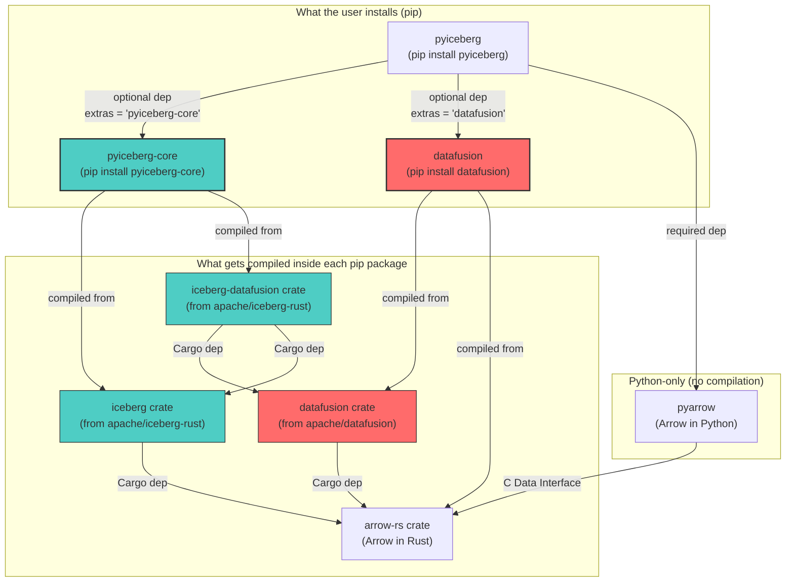
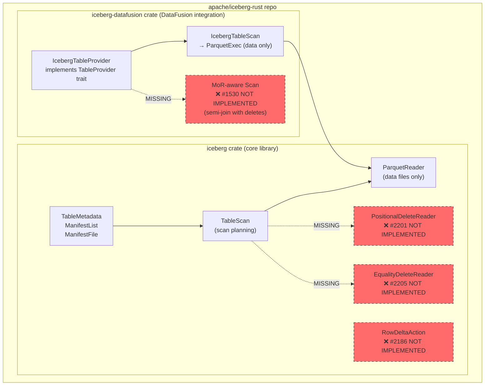
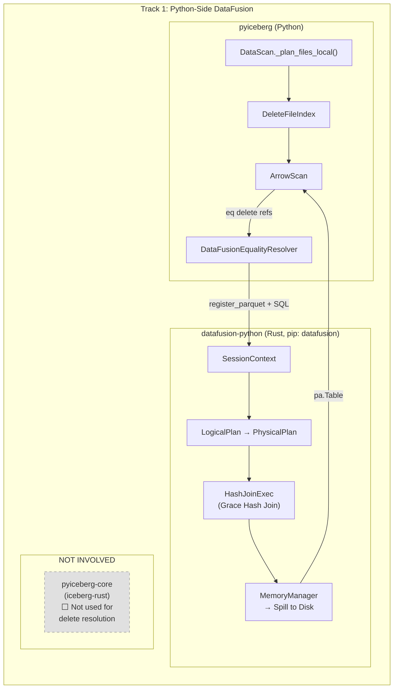
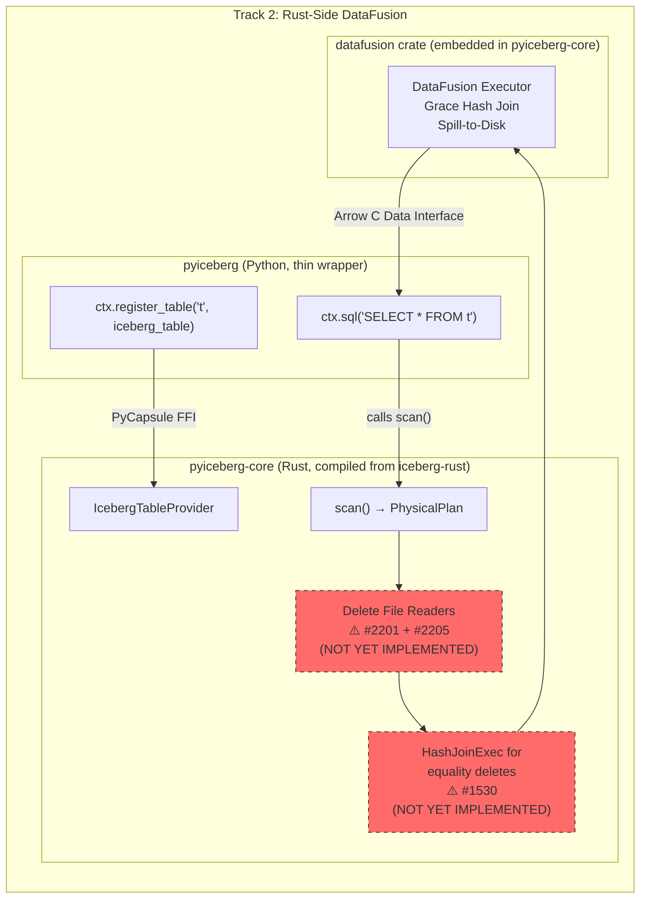
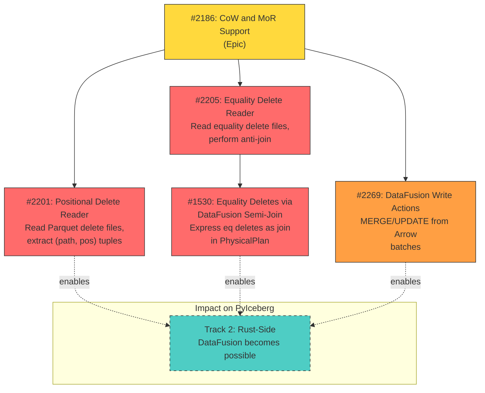
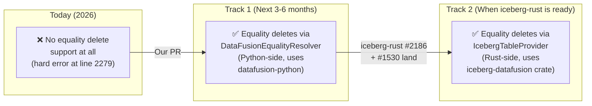

# How iceberg-rust Integrates into PyIceberg's DataFusion Proposal

**Companion to:** [pyiceberg_datafusion.md](./pyiceberg_datafusion.md)

---

## Why This Document Exists

The pt1 document proposes integrating DataFusion into PyIceberg for spill-to-disk equality delete resolution. But it mentions `iceberg-rust`, `pyiceberg-core`, `datafusion-python`, the `PyCapsule` protocol, and multiple GitHub issues without making the exact wiring between these systems concrete.

This document answers one question: **When a Python user calls `table.scan().to_arrow()`, which code in which repository executes at each step, and how does iceberg-rust slot into that pipeline?**

---

## 1. The Four Repositories

There are four distinct codebases involved. Each is a separate Git repository with separate release cadences:

```
┌─────────────────────────────────────────────────────────────────────────────────┐
│                              REPOSITORY MAP                                     │
│                                                                                 │
│  1. apache/iceberg-python  (Python)     ← The user-facing library               │
│  2. apache/iceberg-rust    (Rust)       ← Iceberg spec implementation in Rust   │
│  3. apache/datafusion-python (Rust+Py)  ← Python bindings for DataFusion engine │
│  4. apache/datafusion      (Rust)       ← The query engine itself               │
│                                                                                 │
│  Repo (2) produces a pip-installable package called "pyiceberg-core"            │
│  Repo (3) produces a pip-installable package called "datafusion"                │
│  Both are OPTIONAL dependencies of Repo (1)                                     │
└─────────────────────────────────────────────────────────────────────────────────┘
```

### 1.1 What Each Repository Contains

| Repository | Language | Compiles To | pip Package Name | Role |
|:---|:---|:---|:---|:---|
| **apache/iceberg-python** | Python | Pure Python wheel | `pyiceberg` | User-facing API: `Table`, `Scan`, `Transaction`, `ArrowScan` |
| **apache/iceberg-rust** | Rust | Shared lib (`.so`/`.dylib`) via PyO3 | `pyiceberg-core` | Rust-native Iceberg operations: transforms, DataFusion `TableProvider`, scan planning |
| **apache/datafusion-python** | Rust + Python | Shared lib via PyO3 | `datafusion` | Python bindings for DataFusion: `SessionContext`, `DataFrame`, SQL execution |
| **apache/datafusion** | Rust | Rust crate (library) | *(not a pip package)* | The actual query engine: optimizer, join operators, spill-to-disk |

### 1.2 The Dependency DAG



**Key insight:** `pyiceberg-core` and `datafusion` (the pip packages) are **two different Python packages that both embed the same Rust `datafusion` crate internally**, but compiled independently. They are separate shared libraries loaded into the same Python process.

---

## 2. How iceberg-rust Is Used Today (Current State)

Today, `iceberg-rust` is used in PyIceberg for exactly **two things**:

### 2.1 Partition Transforms

When PyIceberg needs to compute a partition transform (bucket, year, month, day, hour, truncate) on a PyArrow array, it delegates to Rust:

```
User code: table.append(arrow_table)
    └─▶ pyiceberg/transforms.py:396  BucketTransform.pyarrow_transform()
        └─▶ _try_import("pyiceberg_core").transform.bucket(arrow_array, num_buckets)
            └─▶ FFI boundary: Python → Rust (via PyO3)
                └─▶ iceberg-rust crate: transforms::bucket()
                    └─▶ arrow-rs compute kernel
                        └─▶ Returns: arrow-rs Array
                            └─▶ FFI boundary: Rust → Python (Arrow C Data Interface)
                                └─▶ pyarrow.Array (zero-copy!)
```

This works because both `pyiceberg_core` (Rust side) and `pyarrow` (Python side) speak the **Arrow C Data Interface**—a standardized ABI for passing Arrow arrays across language boundaries without copying data.

### 2.2 DataFusion TableProvider (Read Path)

When a user calls `ctx.register_table("t", iceberg_table)` with a DataFusion `SessionContext`, PyIceberg hands off a Rust-native `TableProvider`:

```python
# pyiceberg/table/__init__.py:1770-1814
def __datafusion_table_provider__(self, session=None):
    from pyiceberg_core.datafusion import IcebergDataFusionTable

    provider = IcebergDataFusionTable(
        identifier=self.name(),
        metadata_location=self.metadata_location,      # ← string: "s3://bucket/metadata/v1.metadata.json"
        file_io_properties=self.io.properties,          # ← dict: {"s3.access-key-id": "...", ...}
    ).__datafusion_table_provider__
    return provider(session)                            # ← Returns PyCapsule wrapping Rust Arc<dyn TableProvider>
```

Here is what happens under the hood:

```
User code: ctx.register_table("t", iceberg_table)
    └─▶ DataFusion-Python calls iceberg_table.__datafusion_table_provider__(session)
        └─▶ pyiceberg/table/__init__.py:1807-1814
            └─▶ Constructs IcebergDataFusionTable in Rust (via PyO3)
                │
                │   Inside Rust (pyiceberg-core crate):
                │   ┌──────────────────────────────────────────────────────────────┐
                │   │ 1. Parse metadata_location → TableMetadata (Rust struct)     │
                │   │ 2. Open FileIO with properties → S3/GCS/local reader        │
                │   │ 3. Build IcebergTableProvider (iceberg-datafusion crate)     │
                │   │    This implements DataFusion's TableProvider trait:          │
                │   │    - schema() → Arrow schema                                 │
                │   │    - scan() → ExecutionPlan (Parquet scan of data files)      │
                │   │ 4. Wrap in PyCapsule and return to Python                    │
                │   └──────────────────────────────────────────────────────────────┘
                │
            └─▶ Returns: PyCapsule<Arc<dyn TableProvider>>
        └─▶ DataFusion-Python unwraps PyCapsule, registers provider in SessionContext
```

**The critical limitation:** Step 3 above—`scan()`—currently **only scans data files**. It does **not** read manifests for delete files. The `IcebergTableProvider` in iceberg-rust's `iceberg-datafusion` crate has **no delete file resolution logic**. It returns raw data as if no deletes exist.

---

## 3. The Gap: What iceberg-rust Is Missing

The following diagram shows what exists (solid lines) versus what is missing (dashed lines):



### 3.1 The Four Missing Pieces (with Issue Numbers)

| What's Missing | iceberg-rust Issue | What It Would Do | Blocked? |
|:---|:---|:---|:---|
| **Positional delete reader** | [#2201](https://github.com/apache/iceberg-rust/issues/2201) | Read Parquet delete files, extract `(file_path, pos)` tuples, apply as row-level filter | Open issue |
| **Equality delete reader** | [#2205](https://github.com/apache/iceberg-rust/issues/2205) | Read equality delete files, perform anti-join against data files (the hard problem) | Open issue |
| **Scan-side delete reconciliation** | [#2186](https://github.com/apache/iceberg-rust/issues/2186) | Epic: wire delete readers into the scan path so `TableScan` returns correct (post-delete) results | Open epic |
| **DataFusion semi-join for equality deletes** | [#1530](https://github.com/apache/iceberg-rust/issues/1530) | Instead of applying equality deletes row-by-row in the reader, express them as a DataFusion semi-join in the physical plan, enabling spill-to-disk | Open issue, stale |

### 3.2 What This Means for PyIceberg

Since `pyiceberg-core` is compiled from `iceberg-rust`, and `iceberg-rust` has no delete file logic, the PyCapsule `TableProvider` that `__datafusion_table_provider__` returns **ignores all deletes**. If you register an Iceberg table with equality deletes into DataFusion via this path, you get **wrong results**—deleted rows are included in query output.

This is why the pt1 proposal defines a **two-track strategy**.

---

## 4. The Two Tracks: How iceberg-rust Fits In

### Track 1: Python-Side DataFusion (Immediate, No iceberg-rust Changes Needed)

This track uses `datafusion-python` (the pip package `datafusion`) directly from Python. It **does not** go through `pyiceberg-core` or `iceberg-rust` at all for the anti-join. iceberg-rust is only used for what it already does today (transforms).

Here is the exact call chain when scanning a table with equality deletes:

```
User code: table.scan().to_arrow()
│
│ STEP 1: Scan Planning (Pure Python, in pyiceberg)
│ ─────────────────────────────────────────────────
│   pyiceberg/table/__init__.py: DataScan._plan_files_local()
│   ├─ Read manifest list → manifest files → manifest entries
│   ├─ For each DATA entry → append to data_entries[]
│   ├─ For each POSITION_DELETES entry → delete_index.add_delete_file()     # existing
│   ├─ For each EQUALITY_DELETES entry → delete_index.add_delete_file()     # NEW (lazy ref)
│   └─ Build FileScanTasks with attached equality_delete_refs
│
│ STEP 2: Arrow Scan Execution (Python → DataFusion for equality deletes)
│ ────────────────────────────────────────────────────────────────────────
│   pyiceberg/io/pyarrow.py: ArrowScan.to_table(tasks)
│   └─ For each FileScanTask:
│       ├─ Apply positional deletes (existing PyArrow path, unchanged)
│       ├─ Apply DVs (existing pyroaring path, unchanged)
│       └─ IF task has equality_delete_refs:
│           │
│           │  NEW CODE: pyiceberg/io/datafusion_resolver.py
│           │  ┌────────────────────────────────────────────────────────────────────┐
│           │  │  DataFusionEqualityResolver.resolve(data_file, eq_refs)            │
│           │  │                                                                    │
│           │  │  1. from datafusion import SessionContext     ← datafusion-python  │
│           │  │  2. ctx = SessionContext(memory_limit=M, spill_dir="/tmp/...")      │
│           │  │  3. ctx.register_parquet("data", data_file.file_path)              │
│           │  │  4. ctx.register_parquet("eq_del_0", eq_refs[0].file_path)         │
│           │  │  5. sql = "SELECT d.* FROM data d                                  │
│           │  │            LEFT ANTI JOIN eq_del_0 e                                │
│           │  │            ON d.col = e.col"                                        │
│           │  │  6. result = ctx.sql(sql).to_arrow_table()                         │
│           │  │                                                                    │
│           │  │  Inside datafusion-python (Rust):                                  │
│           │  │  ┌──────────────────────────────────────────────────────┐           │
│           │  │  │  a. Parse SQL → LogicalPlan (LeftAntiJoin)          │           │
│           │  │  │  b. Optimize → PhysicalPlan (HashJoinExec)          │           │
│           │  │  │  c. Execute with MemoryManager                      │           │
│           │  │  │     → If memory > threshold: spill partitions to    │           │
│           │  │  │       SSD, read back partition-by-partition          │           │
│           │  │  │  d. Return RecordBatches → Arrow C Data Interface   │           │
│           │  │  └──────────────────────────────────────────────────────┘           │
│           │  │                                                                    │
│           │  │  7. Return pa.Table (active rows, with deletes applied)            │
│           │  └────────────────────────────────────────────────────────────────────┘
│           │
│       └─ Concatenate all task results → final pa.Table
│
└─▶ Returns: pa.Table (correct, with all deletes applied)
```

**Where is iceberg-rust in this flow?** Nowhere in the delete resolution path. Track 1 treats the equality delete problem as a pure SQL query executed by `datafusion-python`. PyIceberg handles all the scan planning (reading manifests, identifying which delete files apply to which data files) in pure Python, and only hands off the compute-intensive anti-join to DataFusion.



### Track 2: Rust-Side DataFusion (Long-Term, Requires iceberg-rust Changes)

This track pushes the **entire** scan—including delete file resolution—into Rust. The anti-join happens inside the `IcebergTableProvider`'s `scan()` method, below the FFI boundary. Python never sees the delete files.

Here is what would have to happen:

```
User code: ctx.register_table("t", iceberg_table)
           ctx.sql("SELECT * FROM t").to_arrow_table()
│
│ STEP 1: Table Registration (Python → Rust via PyCapsule)
│ ────────────────────────────────────────────────────────
│   pyiceberg/table/__init__.py: __datafusion_table_provider__(session)
│   └─ pyiceberg_core.datafusion.IcebergDataFusionTable(...)
│       └─ FFI → Rust: Build IcebergTableProvider
│           └─ Parse metadata, open FileIO
│
│ STEP 2: Query Execution (Entirely in Rust)
│ ──────────────────────────────────────────
│   DataFusion-Python: ctx.sql("SELECT * FROM t")
│   └─ DataFusion calls IcebergTableProvider.scan(projection, filters)
│       │
│       │  Inside iceberg-rust (THE PART THAT DOESN'T EXIST YET):
│       │  ┌──────────────────────────────────────────────────────────────────┐
│       │  │  1. Read ManifestList → ManifestFiles                            │
│       │  │  2. For each manifest entry:                                     │
│       │  │     ├─ DATA → schedule ParquetExec                               │
│       │  │     ├─ POSITION_DELETES → schedule positional delete reader      │
│       │  │     │   (iceberg-rust #2201)                                     │
│       │  │     └─ EQUALITY_DELETES → schedule equality delete reader        │
│       │  │         (iceberg-rust #2205)                                     │
│       │  │                                                                  │
│       │  │  3. Build composite PhysicalPlan:                                │
│       │  │     ┌─────────────────────────────────────────────┐               │
│       │  │     │  ProjectionExec                             │               │
│       │  │     │  └─ HashJoinExec (LEFT ANTI)                │               │
│       │  │     │     ├─ Build: EqualityDeleteScanExec        │               │
│       │  │     │     │   (reads all eq delete Parquet files) │               │
│       │  │     │     └─ Probe: DataFileScanExec              │               │
│       │  │     │         (reads data files, applies pos      │               │
│       │  │     │          deletes inline)                    │               │
│       │  │     └─────────────────────────────────────────────┘               │
│       │  │     (iceberg-rust #1530)                                         │
│       │  │                                                                  │
│       │  │  4. DataFusion executes PhysicalPlan:                            │
│       │  │     - Grace Hash Join with spill-to-disk                         │
│       │  │     - MemoryManager tracks all operator allocations              │
│       │  │     - Produces RecordBatch stream                                │
│       │  └──────────────────────────────────────────────────────────────────┘
│       │
│   └─ RecordBatches → Arrow C Data Interface → pa.Table
│
└─▶ Returns: pa.Table (correct, with all deletes applied)
```

**Where is iceberg-rust in this flow?** It's doing **everything**. The Python layer is just a thin FFI bridge. All scan planning, all delete file reading, all join execution happens in Rust.



---

## 5. Track Comparison: Side by Side

| Aspect | Track 1 (Python-Side) | Track 2 (Rust-Side) |
|:---|:---|:---|
| **Where scan planning happens** | Python (`DataScan._plan_files_local`) | Rust (`IcebergTableProvider.scan`) |
| **Where anti-join happens** | Rust (via `datafusion-python` pip package) | Rust (via `iceberg-datafusion` crate, embedded in `pyiceberg-core`) |
| **Who reads delete files** | Python (PyArrow Parquet reader) for metadata, DataFusion for the join | Rust (iceberg crate's `ParquetReader`) |
| **pip packages needed** | `pyiceberg` + `datafusion` | `pyiceberg` + `pyiceberg-core` (with MoR-aware build) |
| **iceberg-rust changes needed** | **None** | **#2186, #2205, #2201, #1530** (major engineering) |
| **datafusion-python changes needed** | **None** | **None** (DataFusion is embedded in iceberg-rust) |
| **Available when?** | **Now** (all dependencies exist) | When iceberg-rust completes MoR epic |
| **Performance** | Good (one extra Python→Rust FFI hop per file) | Best (zero FFI hops during scan, pure Rust pipeline) |
| **Partition pruning** | Manual (Python reads manifests) | Automatic (Rust `TableProvider` does it) |
| **Predicate pushdown** | Partial (manual filter construction) | Full (DataFusion optimizer pushes filters to Parquet reader) |

---

## 6. The FFI Boundaries: Exactly What Crosses Where

Understanding the FFI boundaries is critical because bugs at these boundaries cause **segfaults and bus errors** (see [datafusion-python#1217](https://github.com/apache/datafusion-python/issues/1217)).

### 6.1 Track 1 FFI Boundaries

Track 1 has **two FFI boundaries**, but they are well-isolated:

```
Python Process Memory
├── Python Heap (GIL-protected)
│   ├── pyiceberg objects (Table, DataScan, DeleteFileIndex)
│   └── Python str/dict objects passed to DataFusion
│
├── FFI Boundary #1: datafusion-python ←→ Python
│   Protocol: PyO3 (Python C API)
│   Data crossing: SQL strings (Python str → Rust &str)
│                  File paths (Python str → Rust String)
│                  Config values (Python dict → Rust HashMap)
│   Arrow data:   Arrow C Data Interface (zero-copy pointers)
│   Risk: LOW (well-tested, stable API in datafusion-python)
│
├── Rust Heap (no GIL needed)
│   ├── DataFusion SessionContext
│   ├── LogicalPlan / PhysicalPlan
│   ├── HashJoinExec operator state
│   └── Spill files on local SSD
│
├── FFI Boundary #2: Results back to Python
│   Protocol: Arrow C Data Interface (PyCapsule)
│   Data crossing: RecordBatch pointers (zero-copy)
│   Risk: LOW (standardized ABI, well-tested)
│
└── Python Heap
    └── pa.Table (references Rust memory via Arrow C Data Interface)
```

### 6.2 Track 2 FFI Boundaries

Track 2 has **three FFI boundaries**, one of which is fragile:

```
Python Process Memory
├── Python Heap
│   └── iceberg_table.__datafusion_table_provider__(session)
│
├── FFI Boundary #1: PyCapsule Protocol (FRAGILE)
│   Protocol: Python PyCapsule wrapping Rust Arc<dyn TableProvider>
│   What crosses: A raw pointer to a Rust object
│   Risk: HIGH
│     - Lifetime: Python GC can collect the capsule while Rust holds a ref
│     - ABI: arrow-rs version in pyiceberg-core must match arrow-rs version
│            in datafusion-python, or RecordBatch layout mismatches cause UB
│     - Threading: DataFusion's Tokio runtime accesses the TableProvider
│                  from worker threads; if any callback touches Python
│                  objects without acquiring the GIL → SIGSEGV
│   Known bugs: datafusion-python#1217
│
├── FFI Boundary #2: pyiceberg-core → datafusion-python
│   Protocol: The PyCapsule from #1 is unwrapped by datafusion-python
│   What crosses: Arc<dyn TableProvider> (Rust-to-Rust, but through Python!)
│   Risk: MEDIUM (version skew between two independently compiled .so files)
│
├── Rust Heap (mixed ownership between two .so files!)
│   ├── pyiceberg-core's .so: IcebergTableProvider, FileIO, etc.
│   └── datafusion-python's .so: SessionContext, ExecutionPlan, etc.
│   DANGER: These are two separate Rust shared libraries with
│           potentially different versions of arrow-rs, DataFusion, etc.
│           If types don't match at the ABI level → undefined behavior.
│
├── FFI Boundary #3: Results back to Python
│   Protocol: Arrow C Data Interface
│   Risk: LOW (same as Track 1)
│
└── Python Heap
    └── pa.Table
```

### 6.3 Why Track 1 Is Safer

| Risk | Track 1 | Track 2 |
|:---|:---|:---|
| Lifetime management | Handled by `datafusion-python` (well-tested) | PyCapsule lifetime must be manually synchronized |
| Arrow ABI compatibility | Single .so (datafusion-python) owns all arrow-rs types | Two .so files must agree on arrow-rs ABI |
| GIL safety | DataFusion never touches Python objects during join | `IcebergTableProvider` might callback into Python for FileIO |
| Version coupling | `pyiceberg` and `datafusion` are independent | `pyiceberg-core` and `datafusion-python` must use matching DataFusion versions |

---

## 7. The iceberg-rust Issues: What Each One Does and Why It Matters

### 7.1 Issue Dependency Graph



### 7.2 Detailed Breakdown

#### [#2186](https://github.com/apache/iceberg-rust/issues/2186) — CoW and MoR Support (Epic)

**What it is:** The umbrella epic for all row-level mutation support in iceberg-rust.

**What it tracks:**
- Copy-on-Write: `OverwriteAction` (PR [#2185](https://github.com/apache/iceberg-rust/pull/2185) exists)
- Merge-on-Read: `RowDeltaAction` (write path) — not started
- Scan-side delete reconciliation (read path) — not started
- V3 Deletion Vectors — not started

**Why it matters to PyIceberg:** This is the **gate** for Track 2. Until this epic is substantially complete, `pyiceberg-core`'s `IcebergTableProvider` cannot return correct results for tables with deletes.

---

#### [#2201](https://github.com/apache/iceberg-rust/issues/2201) — Positional Delete Reader

**What it would do:** Implement a Rust reader that:
1. Opens a positional delete Parquet file
2. Reads `(file_path: String, pos: Int64)` columns
3. Groups positions by `file_path`
4. Returns a map: `HashMap<String, Vec<i64>>` (file → sorted positions)

**Why it matters:** Even though PyIceberg already handles positional deletes in Python, having a Rust-native reader means the `IcebergTableProvider` can filter them during its internal Parquet scan—making Track 2 possible for the simpler case.

---

#### [#2205](https://github.com/apache/iceberg-rust/issues/2205) — Equality Delete Reader

**What it would do:** Implement a Rust reader that:
1. Opens an equality delete Parquet file
2. Reads the columns specified by `equality_ids` in the file metadata
3. Returns the delete keys as Arrow `RecordBatch`es

**Why it matters:** This is the building block for the anti-join. Without being able to read the delete keys, you can't join them against data files.

---

#### [#1530](https://github.com/apache/iceberg-rust/issues/1530) — Equality Deletes via DataFusion Semi-Join

**What it would do:** Instead of applying equality deletes row-by-row inside the file reader (which can't spill to disk), express them as a **semi-join** in DataFusion's physical plan:

```
ProjectionExec
└─ HashJoinExec (LEFT ANTI)
   ├─ Build side: EqualityDeleteScanExec (reads eq delete files)
   └─ Probe side: DataFileScanExec (reads data files)
```

This way, DataFusion's `MemoryManager` controls the memory budget and spills to disk when needed.

**Why it matters:** This is the **exact same architectural idea** as our Track 1 proposal, but implemented in Rust inside `iceberg-rust` rather than in Python inside `pyiceberg`. If this is implemented, Track 2 gets spill-to-disk for free.

**Current status:** Opened Jul 2025 by ZENOTME, marked **stale** as of 2026. The issue text says:
> *"The current handling of equality deletes is done inside the file reader layer, where the delete keys are loaded and filtered row-by-row. However, this approach doesn't support spilling to disk. While it's possible to implement spill logic directly in the reader, another direction is to use semi join in datafusion."*

This validates our proposal's theoretical foundation: the iceberg-rust community has independently identified the same architectural necessity.

---

#### [#2269](https://github.com/apache/iceberg-rust/issues/2269) — DataFusion Write Actions

**What it would do:** Enable writing Iceberg tables through DataFusion SQL:

```sql
-- This would work if #2269 were implemented:
INSERT INTO iceberg_table SELECT * FROM source_table;
MERGE INTO iceberg_table USING updates ON iceberg_table.id = updates.id
    WHEN MATCHED THEN UPDATE SET ...
    WHEN NOT MATCHED THEN INSERT ...
```

**Why it matters:** For Phase 2 of our proposal (MoR write path), this would allow PyIceberg to delegate UPSERT/MERGE operations to DataFusion, getting parallelism and spill-to-disk for the write path too.

---

## 8. When Does Track 2 Replace Track 1?

Track 1 and Track 2 are **not** competing designs. They are a **migration path**:



The transition from Track 1 to Track 2 is:

1. **iceberg-rust completes #2186** (MoR epic, including #2201 + #2205 + #1530)
2. **pyiceberg-core releases new version** with MoR-aware `IcebergTableProvider`
3. **PyIceberg updates `__datafusion_table_provider__`** to use the new provider
4. **Track 1 code becomes fallback** for environments without `pyiceberg-core`

The Track 1 → Track 2 transition is a **single conditional check**:

```python
# Future pyiceberg/io/pyarrow.py (conceptual)
def _resolve_equality_deletes(self, task, eq_refs):
    if _has_rust_mor_support():
        # Track 2: Delegate to Rust-native MoR-aware scan
        # The IcebergTableProvider handles everything internally
        return self._rust_scan_with_deletes(task, eq_refs)
    else:
        # Track 1: Use Python-side DataFusion for the anti-join
        return self._datafusion_resolver.resolve(task.data_file, eq_refs)

def _has_rust_mor_support():
    try:
        from pyiceberg_core.datafusion import IcebergDataFusionTable
        return hasattr(IcebergDataFusionTable, 'supports_delete_files')
    except ImportError:
        return False
```

---

## 9. Summary: The One-Paragraph Answer

**iceberg-rust is a Rust implementation of the Iceberg spec that gets compiled into the pip package `pyiceberg-core`.** Today, PyIceberg uses it for two things: partition transforms and a DataFusion `TableProvider` that can scan data files. However, `iceberg-rust` currently has **no delete file support** (issues #2186, #2201, #2205, #1530 are all open). This means the `TableProvider` it exposes to PyIceberg ignores all deletes, making it unusable for MoR tables. Our proposal's **Track 1** bypasses this gap entirely by using `datafusion-python` (a separate pip package) directly from Python to execute the anti-join SQL—no iceberg-rust changes required. **Track 2** is the long-term architecture where iceberg-rust gains native MoR support, the `TableProvider` returns correct post-delete results, and PyIceberg's Python-side resolver becomes unnecessary. Track 1 is the bridge that unblocks equality delete support today; Track 2 is the endgame that arrives when the Rust community ships.
