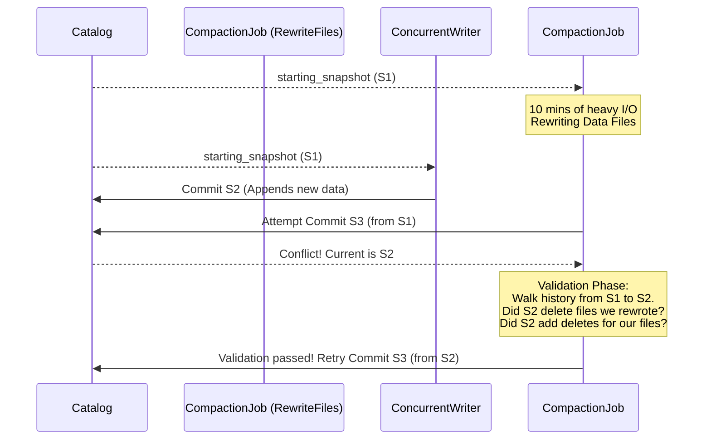
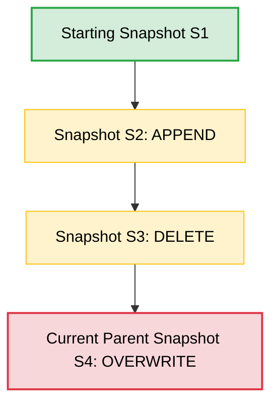
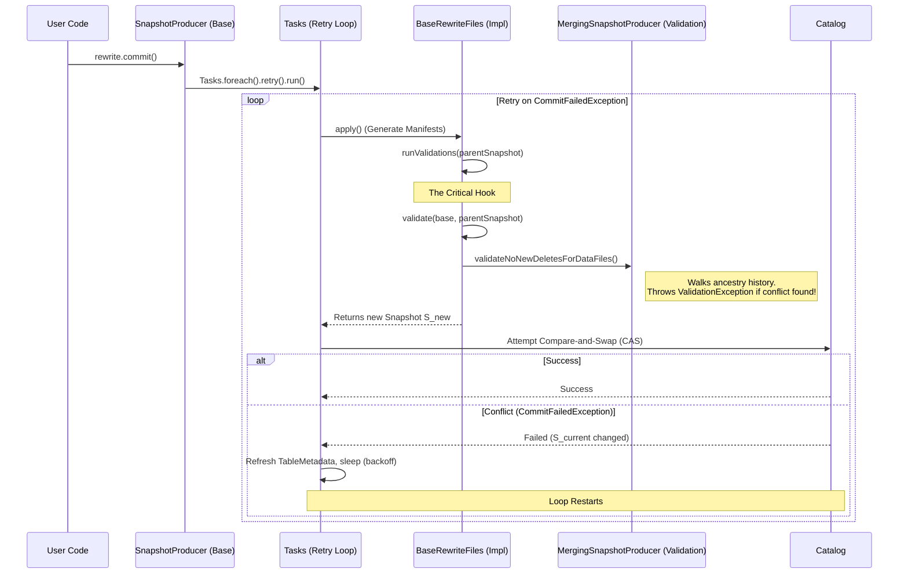
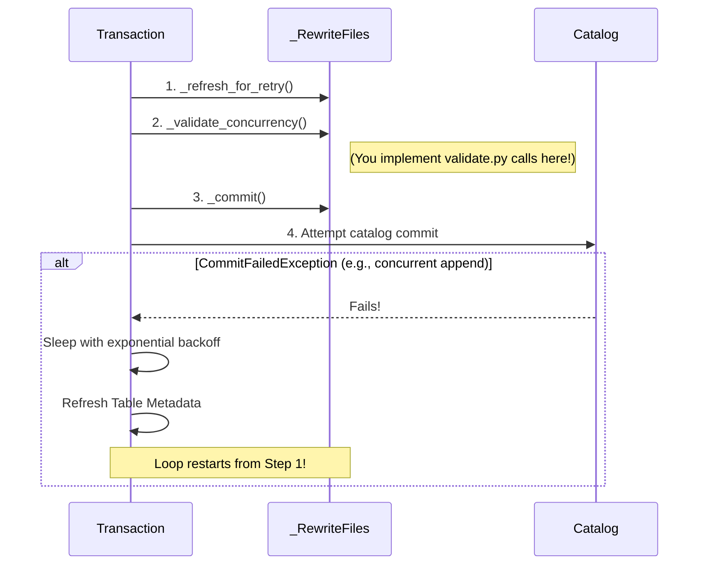

# PyIceberg Maintenance Validation: Architectural Review & Mechanics

## 1. First Principles: The Speed of Light and Optimistic Concurrency Control

In a distributed system like Apache Iceberg, the primary limiting factor is the **speed of light**—specifically, network latency between distributed executors (Spark, Flink, PyIceberg) and the central metadata catalog. 

If Iceberg used pessimistic locking (e.g., locking the entire table or partition while a compaction job runs for 10 minutes), concurrent writers would be blocked, throughput would collapse, and the system would fail to scale. 

Instead, Iceberg relies on **Optimistic Concurrency Control (OCC)**:
1. **Assume Success**: A writer reads the current state (`starting_snapshot`), performs arbitrary distributed I/O (compaction, rewriting), and prepares a new snapshot locally.
2. **Commit Attempt**: The writer attempts to swap the catalog pointer from `starting_snapshot` to the new snapshot.
3. **The Conflict Window**: If another writer has already updated the table (the catalog is now at `parent_snapshot`), the commit fails. 
4. **Validation**: Instead of immediately throwing an error, Iceberg checks the **delta** between `starting_snapshot` and `parent_snapshot`. If the concurrent changes don't semantically conflict with our operation, we re-base our operation and try again.

### The Validation Window


Validation is the mathematical proof that our long-running optimistic operation remains logically correct despite the underlying metadata changing beneath us.

---

## 2. The Mechanics of `/iceberg-python/`: `validate.py`

PyIceberg implements this exact conflict-resolution mathematics in `pyiceberg/table/update/validate.py`. 

### The Core Engine: `_validation_history`
At the heart of the system is `_validation_history(table, from_snapshot, to_snapshot, matching_operations, manifest_content_filter)`. 

When a conflict occurs, `_validation_history` walks the snapshot lineage graph backwards from the `from_snapshot` (the new current state of the table) down to the `to_snapshot` (the state we started our work on). 



It collects all manifest files added during this "conflict window" that match the requested operations. Once the delta manifests are collected, the higher-level functions filter the entries to detect specific logical violations.

### Specific Conflict Validators
PyIceberg provides specific validators that protect different semantic operations:

1. **`_validate_deleted_data_files`**: 
   Ensures no files matching our filter were deleted during the conflict window. (If we are trying to rewrite File A, but the concurrent writer already deleted File A, we must fail).
2. **`_validate_added_data_files`**: 
   Ensures no new data files were added matching a filter. (Useful for `OVERWRITE` operations where we assert exclusive ownership of a partition).
3. **`_validate_no_new_delete_files`**: 
   Ensures no new delete files (position or equality) were added that match our filter.
4. **`_validate_no_new_deletes_for_data_files`**: 
   Ensures that for a specific set of data files, no concurrent transaction wrote a delete file targeting them. 

---

## 3. The Match in `/iceberg/` (Java Parity): End-to-End Breakdown

To build a rigorous and intuitive understanding of how PyIceberg's pipeline should work, we must trace the exact End-to-End (E2E) execution flow in Java Iceberg. The equivalent logic lives across `SnapshotProducer.java`, `MergingSnapshotProducer.java`, and `BaseRewriteFiles.java`.

### The E2E Java Commit Pipeline

When a developer configures a `RewriteFiles` compaction action in Java and calls `.commit()`, it triggers a deeply nested, re-entrant lifecycle. 

Here is the step-by-step breakdown of how `RewriteFiles` and `validate()` work together to survive optimistic concurrency conflicts.



### 1. The Retry Loop (`SnapshotProducer.java`)
The absolute entry point is `SnapshotProducer.commit()`. This function orchestrates the retry mechanism. It wraps the core execution in a `Tasks.foreach().retry().run()` block.

```java
// iceberg/core/src/main/java/org/apache/iceberg/SnapshotProducer.java
public void commit() {
    Tasks.foreach(ops)
        .retry(COMMIT_NUM_RETRIES)
        .exponentialBackoff(...)
        .onlyRetryOn(CommitFailedException.class)
        .run(taskOps -> {
            // 1. Re-entrant execution: build the snapshot
            Snapshot newSnapshot = apply(); 
            
            // ... setup metadata ...
            
            // 2. The physical commit (CAS against the catalog)
            taskOps.commit(base, updated);
        });
}
```
**Explanation:** If `taskOps.commit` throws a `CommitFailedException` (because a concurrent writer beat us to the punch), the `Tasks` utility automatically catches it, sleeps, refreshes the metadata, and **re-runs** the `run` block. This is why `apply()` must be completely re-entrant.

### 2. The Execution and Validation Hook (`SnapshotProducer.java`)
Inside the `apply()` method, before the new snapshot is fully generated, the system actively forces a validation check against the newly refreshed `parentSnapshot`.

```java
// iceberg/core/src/main/java/org/apache/iceberg/SnapshotProducer.java
public Snapshot apply() {
    refresh();
    Snapshot parentSnapshot = SnapshotUtil.latestSnapshot(base, targetBranch);
    
    // 1. Force subclasses to validate their semantics against the current state
    runValidations(parentSnapshot); 
    
    // 2. Generate new manifests (I/O)
    List<ManifestFile> manifests = apply(base, parentSnapshot);
    
    // ... return new Snapshot ...
}

private void runValidations(Snapshot parentSnapshot) {
    // This abstract hook is implemented by BaseRewriteFiles
    validate(base, parentSnapshot); 
}
```

### 3. The `RewriteFiles` Semantic Enforcement (`BaseRewriteFiles.java`)
The compaction primitive `BaseRewriteFiles` provides the actual implementation for the `validate()` hook. This is where the domain-specific business logic for compaction safety lives.

```java
// iceberg/core/src/main/java/org/apache/iceberg/BaseRewriteFiles.java
@Override
protected void validate(TableMetadata base, Snapshot parent) {
    validateReplacedAndAddedFiles();
    
    if (!replacedDataFiles.isEmpty()) {
        // Semantic Constraint: If we replaced data files, no concurrent writer 
        // could have written a row-level delete against those specific files.
        validateNoNewDeletesForDataFiles(base, startingSnapshotId, replacedDataFiles, parent);
    }
}
```

### 4. The Mathematics of Conflict Detection (`MergingSnapshotProducer.java`)
Finally, `validateNoNewDeletesForDataFiles` executes the actual history traversal. This is the exact code that PyIceberg ported into `validate.py`.

```java
// iceberg/core/src/main/java/org/apache/iceberg/MergingSnapshotProducer.java
protected void validateNoNewDeletesForDataFiles(
    TableMetadata base, Long startingSnapshotId, Iterable<DataFile> dataFiles, Snapshot parent) {
    
    // 1. Walk the snapshot lineage from current parent down to startingSnapshotId
    // 2. Collect all Manifests containing DELETES added in that window
    // 3. Check if any delete targets the dataFiles we are replacing
    
    // If a conflict is found:
    throw new ValidationException(
        "Found new conflicting delete files that apply to records matching %s: %s",
        dataFilter, conflictingDeleteFiles);
}
```

### Summary of the Java E2E Mechanics
1. **Concurrency causes CAS failures** (`CommitFailedException`).
2. **CAS failures trigger the `Tasks` retry loop**.
3. **The retry loop invokes `apply()` against fresh metadata**.
4. **`apply()` calls `validate()` to ensure the fresh metadata doesn't semantically break the operation**.
5. **`validate()` walks the history to detect conflicts**. 

If validation fails, the operation crashes permanently with a `ValidationException` to prevent data loss. If validation passes, the operation retries the CAS commit.

This rigorous E2E pipeline is exactly what PR 3320 brings to PyIceberg, mapping `Tasks.foreach().retry()` to the new `Transaction.commit_transaction()` loop, and `validate()` to `_validate_concurrency()`.

---

## 4. Is it Plug-and-Play for PyIceberg's `_RewriteFiles`?

**Yes, the validation logic is 100% plug-and-play.**

The code in PyIceberg's `validate.py` already exists, is already tested, and implements the exact same logic as Java. It just **needs to be called**. 

If you are implementing `_RewriteFiles` in a PR, you can directly drop in the validation calls just like Java does.

### The Plug-and-Play Implementation in PyIceberg

```python
class _RewriteFiles(_SnapshotProducer["_RewriteFiles"]):
    # ... setup state ...
    
    def validate_from_snapshot(self, snapshot_id: int) -> "_RewriteFiles":
        self._starting_snapshot_id = snapshot_id
        return self

    def _validate(self) -> None:
        """Run all conflict validations before commit."""
        parent_snapshot = self._table.metadata.current_snapshot()
        starting_snapshot = self._table.metadata.snapshot_by_id(self._starting_snapshot_id)
        
        # 1. Ensure the files we are rewriting haven't been deleted by someone else
        _validate_deleted_data_files(
            table=self._table,
            starting_snapshot=starting_snapshot,
            data_filter=None, # Or specific filter
            parent_snapshot=parent_snapshot
        )
        
        # 2. Ensure no one wrote new row-level deletes against the files we are rewriting
        _validate_no_new_deletes_for_data_files(
            table=self._table,
            starting_snapshot=starting_snapshot,
            data_filter=None,
            data_files=self._replaced_data_files, # the files you collected to rewrite
            parent_snapshot=parent_snapshot
        )
```

### What is still lacking? (The Catch - *Resolved by PR 3320*)
*Note: The missing retry loop discussed here has been officially resolved by PR 3320, which is analyzed in detail below.*

---

## 5. Impact Analysis: PR 3320 (`feat/commit-retry-and-validation`)

You noted checking out PR 3320. This PR fundamentally alters the PyIceberg commit architecture by introducing the exact **Commit Retry Loop** and **Validation Lifecycle Hooks** that were previously missing. 

### Is it safe to add `validate.py` to `feature/core-rewrite-api` as-is?
**No. If you add it exactly as designed in Section 4, it will be obsolete.** 

If you build `_RewriteFiles` against the `main` branch prior to PR 3320, your implementation will lack retry capabilities. If you base your work on PR 3320, you must wire your validations into the new architecture specifically designed for this purpose, otherwise your validations won't re-trigger on retry.

### Architectural Changes in PR 3320

PR 3320 bridges the final gap to Java parity by introducing:
1. **The Commit Retry Loop**: `Transaction.commit_transaction()` now implements a `for attempt in range(num_retries + 1):` loop with exponential backoff, catching `CommitFailedException`.
2. **Re-entrant Updates**: On a retry, the transaction calls `_rebuild_snapshot_updates()` which refreshes the table metadata and re-runs the snapshot producers.
3. **The `_validate_concurrency()` Hook**: Every `_SnapshotProducer` now has a `_validate_concurrency()` lifecycle method. 



### The New Plug-and-Play Implementation
Because PR 3320 orchestrates the retry loop, `_RewriteFiles` no longer needs a bespoke `_validate()` method. Instead, you **override the `_validate_concurrency()` hook** provided by the base class.

Here is how your `feature/core-rewrite-api` code *must* look to be compatible with PR 3320:

```python
class _RewriteFiles(_SnapshotProducer["_RewriteFiles"]):
    
    def validate_from_snapshot(self, snapshot_id: int) -> "_RewriteFiles":
        self._starting_snapshot_id = snapshot_id
        return self

    # OVERRIDE the new lifecycle hook from PR 3320
    def _validate_concurrency(self) -> None:
        """Validate that concurrent changes do not conflict with this rewrite."""
        if self._parent_snapshot_id is None:
            return

        parent_snapshot = self._transaction._table.metadata.current_snapshot()
        starting_snapshot = self._transaction._table.metadata.snapshot_by_id(self._starting_snapshot_id)
        
        # 1. Ensure the files we are rewriting haven't been deleted
        _validate_deleted_data_files(
            table=self._transaction._table,
            starting_snapshot=starting_snapshot,
            data_filter=None, 
            parent_snapshot=parent_snapshot
        )
        
        # 2. Ensure no new row-level deletes target the files we are rewriting
        _validate_no_new_deletes_for_data_files(
            table=self._transaction._table,
            starting_snapshot=starting_snapshot,
            data_filter=None,
            data_files=self._replaced_data_files,
            parent_snapshot=parent_snapshot
        )
```

### Summary Recommendation for Your PR
To avoid having to rewrite your branch later:
1. **Rebase** your `feature/core-rewrite-api` branch on top of `feat/commit-retry-and-validation` (PR 3320).
2. Inherit from the new `_SnapshotProducer`.
3. Place all `validate.py` logic strictly inside the `def _validate_concurrency(self) -> None:` method. 
4. The new `Transaction.commit_transaction()` loop will automatically guarantee your `_RewriteFiles` operation is retried safely under concurrent write load.

---

## 6. Proving ACID Guarantees: Race Conditions, Failures, and File Corruption

In highly concurrent distributed systems, race conditions are often synonymous with data corruption, partial writes, or "lost updates." However, **in Apache Iceberg, the risk of physical file corruption due to concurrency race conditions is virtually zero.**

Iceberg's architectural design guarantees true ACID properties under Optimistic Concurrency Control (OCC). Here is a rigorous proof of how it prevents corruption, and the actual operational risks you *do* face.

### Why Data Corruption is Prevented

Iceberg achieves its ACID guarantees through four foundational design choices:

1. **Immutable Data Files (Durability & Consistency)**
   Data files (e.g., Parquet files) are written *once* and are *never modified in place*. During a compaction or rewrite, the old files are left untouched while new replacement files are written to entirely new paths. A failed or concurrent transaction cannot physically corrupt an existing data file because it never opens it for a write.

2. **Atomic Metadata Swaps (Atomicity)**
   A commit in Iceberg is defined strictly as swapping a single pointer in the catalog (e.g., REST, Hive Metastore, Nessie) from the `old_metadata.json` to the `new_metadata.json`. This is done via a Compare-And-Swap (CAS) operation. 
   - If the swap succeeds, the *entire* operation is visible instantly.
   - If the swap fails, *none* of the operation is visible. 
   There is no "partial commit" state.

3. **Validation During Retry (Isolation)**
   If a commit fails the CAS check, Iceberg doesn't just blindly retry the CAS. It catches the `CommitFailedException` and executes the `validate()` lifecycle. It mathematically rebases the transaction, proving that the concurrent writer didn't invalidate our semantic assumptions (e.g., "they didn't delete the file I just spent 10 minutes compacting"). If the proof fails, the transaction aborts, preventing a lost update.

4. **All-or-Nothing Snapshots (Atomicity for Readers)**
   Readers query the table exclusively through the lens of a specific snapshot ID. If a writer crashes mid-retry, or their worker node is destroyed, the new data files they wrote remain completely disconnected from the snapshot tree. Readers will never see them, ensuring perfectly consistent reads.

### The Real Operational Risks (Non-Corruption)

While data corruption is prevented, high-concurrency environments under OCC introduce a different class of systemic risks:

| Risk Profile | Explanation | System Impact |
|--------------|-------------|---------------|
| **Write Starvation** | Fast, high-frequency writers (like streaming inserts) can repeatedly beat slower, long-running batch jobs (like compactions) to the CAS commit. The slow job's retry loop will continually trigger, but it may never win the race. | The batch job eventually exhausts its retry limit and fails with a `CommitFailedException`. |
| **Dangling Orphan Files** | When a transaction fails completely (or a worker node crashes mid-write), the physical Parquet files it wrote are left behind on cloud storage. Because they aren't in the metadata, readers ignore them, so there is no corruption. | Storage bloat and increased cloud costs over time. |
| **Catalog-Specific Weaknesses** | Iceberg's atomicity guarantee relies entirely on the catalog's implementation of the CAS operation. | If using a weakly-consistent catalog (e.g., a poorly configured custom catalog or eventual-consistency blob store without proper locking), the atomic swap could fracture, breaking ACID guarantees. |

### Mitigation Strategies

To maintain a healthy, highly concurrent Iceberg table, the following strategies should be employed:

1. **Increase Retries & Backoff**: For tables experiencing Write Starvation, increase `commit.retry.num-retries` (default is 4) and extend `commit.retry.min-wait-ms` / `commit.retry.max-wait-ms` to give slower jobs a larger window to slip their commit through.
2. **Strategic Partitioning**: OCC conflicts only happen when transactions violate semantic boundaries (e.g., writing deletes to the same partition). Design your partitions so concurrent writers are statistically likely to touch completely different folders, reducing metadata conflict overlap.
3. **Aggressive Maintenance**: Because failed transactions leave dangling files, you must run `DeleteOrphanFiles` and `ExpireSnapshots` routinely. This converts storage bloat into a temporary, self-cleaning issue.
4. **Use Robust Catalogs**: Rely on production-grade catalogs that natively guarantee atomic operations, such as the standard REST Catalog, Hive Metastore, or Nessie.

---

## 7. The Succinct Proof: The Retry Loop in Pseudocode

To truly understand how the architecture guarantees correctness, we can distill the entire complex `Tasks.foreach().retry()` and `commit_transaction()` engine down to a single, highly readable pseudocode block. 

This loop represents the entire Optimistic Concurrency Control (OCC) engine. It proves exactly why the system is immune to data corruption, even when multiple writers are aggressively competing for the same table.

```python
def commit_with_optimistic_concurrency(self):
    """
    The mathematical proof of Iceberg's ACID guarantees lies entirely
    within this loop.
    """
    
    # 1. Assume Success: Capture the current state of the world
    original_metadata = catalog.load_table()
    current_metadata = original_metadata
    
    # 2. Heavy I/O: Perform arbitrary, long-running work (e.g., compaction)
    #    This happens BEFORE the loop. It writes entirely new, immutable Parquet files.
    #    No existing files are ever modified.
    new_data_files = perform_10_minute_compaction(original_metadata)

    # 3. Enter the Retry Loop (The OCC Engine)
    for attempt in range(MAX_RETRIES):
        try:
            # =================================================================
            # PHASE 1: THE DELTA CHECK & VALIDATION (The "Isolation" Guarantee)
            # =================================================================
            # If this is a retry, current_metadata has changed!
            # We must mathematically evaluate the DELTA between the original state 
            # and the new state to prove our long-running work is still valid.
            
            # Hook: `_validate_concurrency()` runs here (e.g., validate.py)
            # Example Delta Check: "Did a concurrent writer delete the files I just compacted?"
            is_conflicting_delta = evaluate_delta_for_conflicts(
                old_state=original_metadata, 
                new_state=current_metadata, 
                my_work=new_data_files
            )
            
            if is_conflicting_delta:
                # Delta Check Failed! The concurrent writer broke our semantic assumptions.
                # FATAL ABORT: We cannot "redo the delta" because our long-running work 
                # (the new Parquet files) is now physically incorrect.
                # We raise an exception to break out of the loop entirely. The higher-level
                # orchestrator (e.g. Spark) must catch this and start the job from scratch.
                raise ValidationException("Conflict detected! Cannot safely commit.")

            # If the Delta Check Passes (e.g., the concurrent writer just appended data 
            # to a completely different partition), we proceed! The delta was harmless.

            # =================================================================
            # PHASE 2: REBASE (The "Consistency" Guarantee)
            # =================================================================
            # Validation passed. Our work is still valid. 
            # Rebase our new data files onto the LATEST metadata state.
            new_metadata = build_new_metadata(base=current_metadata, additions=new_data_files)

            # =================================================================
            # PHASE 3: ATOMIC SWAP (The "Atomicity" Guarantee)
            # =================================================================
            # Attempt to physically swap the pointer in the catalog.
            # This is the ONLY time we actually attempt to mutate the table.
            
            catalog.compare_and_swap(expected=current_metadata, updated=new_metadata)
            
            # If CAS succeeds, the commit is fully visible. We are done!
            return 
            
        except CompareAndSwapFailedException:
            # =================================================================
            # PHASE 4: RECOVERY 
            # =================================================================
            # Someone else committed during Phase 1-3! 
            # Our CAS failed. We must refresh our view of the world and try the loop again.
            
            current_metadata = catalog.load_table()
            sleep(exponential_backoff)

    # Exhausted retries (Write Starvation)
    raise CommitFailedException("Exceeded max retries. Operation failed safely.")
```

### Why this is mathematically sound (and identical to Java Iceberg):
1. **The Delta Check Allows Safe Concurrency**: If a concurrent write happens, the system *does not* blindly fail. It evaluates the delta. If the concurrent write was harmless (e.g., writing to Partition B while we compact Partition A), `evaluate_delta_for_conflicts` returns `False`. We seamlessly rebase our changes and try the CAS again.
2. **Safety Aborts**: We only exit with a `ValidationException` if the delta proves the concurrent write actively destroyed our assumptions (e.g., they deleted a file in Partition A that we were in the middle of compacting). Java Iceberg operates exactly this way—if `validate()` throws an exception, the `Tasks` retry loop aborts instantly.
3. **No Partial State**: If the system crashes anywhere inside Phase 1, Phase 2, or Phase 4, the catalog is untouched. The only mutation is the single atomic swap in Phase 3.

---

## 8. Game-Theory State Matrix: Exhaustive Concurrency Resolution

To prove the robustness of this loop, we can map every possible state interaction between our operation (a long-running Compaction job `RewriteFiles`) and any concurrent actor. 

In game theory, an OCC system must guarantee that no sequence of moves by a concurrent actor can force the system into an invalid state. Below is the exhaustive matrix of all possible race conditions and exactly how the Retry Loop handles them.

**Our Job**: Compacting `File_A` and `File_B` in `Partition_1` into `Compacted_AB`.

| The Race Condition (Concurrent Actor's Move) | The Loop's Detection Mechanism | The Resolution | End State |
| :--- | :--- | :--- | :--- |
| **Actor appends `File_C` to `Partition_2`**<br/>(Completely unrelated data) | CAS Fails &rarr; Retry Loop &rarr; Delta Check finds no conflict. | Loop **Rebases** our metadata to include `File_C` and retries the CAS. | **SUCCESS**: Both commits survive. |
| **Actor appends `File_C` to `Partition_1`**<br/>(Same partition, but no overlap) | CAS Fails &rarr; Retry Loop &rarr; Delta Check finds no conflict. | Loop **Rebases** our metadata to include `File_C` and retries the CAS. | **SUCCESS**: Both commits survive. |
| **Actor writes a row-level Delete to `File_C`**<br/>(Unrelated file) | CAS Fails &rarr; Retry Loop &rarr; Delta Check finds no conflict. | Loop **Rebases** our metadata to include the new delete and retries the CAS. | **SUCCESS**: Both commits survive. |
| **Actor writes a row-level Delete to `File_A`**<br/>(The file we are actively compacting!) | CAS Fails &rarr; Retry Loop &rarr; Delta Check (`validateNoNewDeletesForDataFiles`) detects a semantic violation. | **FATAL ABORT**: `ValidationException` breaks the loop. | **SAFE FAILURE**: Compaction aborts. Concurrent delete survives. Orchestrator must start compaction from scratch. |
| **Actor completely deletes `File_A`**<br/>(File is dropped from table) | CAS Fails &rarr; Retry Loop &rarr; Delta Check (`validateDeletedDataFiles`) detects `File_A` is missing. | **FATAL ABORT**: `ValidationException` breaks the loop. | **SAFE FAILURE**: Compaction aborts. |
| **Actor updates Table Schema**<br/>(e.g., Adds a column) | CAS Fails &rarr; Retry Loop &rarr; Delta Check evaluates Schema validity. | **FATAL ABORT**: If the schema evolution invalidates our compacted files (which lack the column), the loop breaks. | **SAFE FAILURE**: Compaction aborts to avoid schema corruption. |
| **Actor continually beats us to the CAS**<br/>(Streaming job inserting every 1s) | CAS Fails &rarr; Retry &rarr; CAS Fails &rarr; Retry... | Loop exhausts `MAX_RETRIES` and throws `CommitFailedException`. | **SAFE FAILURE**: Write Starvation. Compaction aborts. |
| **Worker node crashes mid-CAS**<br/>(Hard hardware failure) | Operation halts instantly. | The CAS operation in the Catalog is an atomic database transaction. It either fully applied or didn't. | **SAFE ABORT**: No partial state. Data files left as orphans. |

### The Conclusion of the Proof
In every single possible permutation of concurrent events, the Iceberg commit engine routes to exactly one of two outcomes:
1. **Seamless Merge**: The concurrent operation was semantically disjoint, so the loop mathematically rebases and succeeds.
2. **Safe Failure**: The concurrent operation destroyed a semantic assumption (or starved the loop), so the loop instantly aborts.

**There is no path through the matrix that results in a corrupted table.** The system is mathematically closed.

---

## 9. The Latency Window Illusion: Why CAS is Truly Atomic

Your instinct is incredibly sharp. If you look at the pseudocode and imagine it executing entirely within the Python/Java application memory, you would immediately spot a critical **Time-Of-Check to Time-Of-Use (TOCTOU)** vulnerability. 

If the application code said:
```python
if catalog.current_state() == expected_state:
    # ⚠️ DANGER: Another process could commit right here! (The Latency Window)
    catalog.write_new_state()
```
You would be 100% correct: another process could sneak in during that millisecond latency window, update the parent snapshot, and your code would blindly overwrite it. 

### How Iceberg Closes the Loophole
Iceberg solves this by completely refusing to do the "check and update" in the application code. Instead, Iceberg **delegates the atomicity to the underlying database or storage engine** of the Catalog.

When `catalog.compare_and_swap(expected, updated)` is called, the Iceberg client sends both the `expected` state and the `updated` state to the Catalog server in a single request. The Catalog's storage engine then performs a hard, atomic operation that is natively immune to race conditions.

Here is how different Catalogs physically guarantee that no loophole exists during that latency window:

#### 1. JDBC / REST Catalogs (Backed by an RDBMS like PostgreSQL)
The Catalog executes a single SQL statement:
```sql
UPDATE iceberg_tables 
SET metadata_location = 'v2.metadata.json' 
WHERE table_name = 'my_table' 
  AND metadata_location = 'v1.metadata.json'; -- The "Expected" check
```
In PostgreSQL, this `UPDATE` statement acquires a strict **row-level lock** for the microsecond it takes to execute. If two Iceberg clients send this exact SQL statement at the exact same millisecond, the database engine forces one to wait. The first one succeeds. The second one wakes up, sees that `metadata_location` is no longer `'v1.metadata.json'`, modifies zero rows, and returns a failure.

#### 2. AWS DynamoDB Catalog
The Catalog uses a `Conditional Put` request:
```json
{
  "UpdateExpression": "SET metadata_location = :new_metadata",
  "ConditionExpression": "metadata_location = :expected_metadata"
}
```
DynamoDB uses Paxos/Raft consensus protocols under the hood to guarantee that conditional writes are strictly atomic across its distributed fleet. If the condition fails, DynamoDB immediately returns a `ConditionalCheckFailedException`.

#### 3. Hadoop Catalog (File System)
The Catalog relies on the POSIX guarantee that `rename()` is atomic.
It writes the new metadata to a hidden file, then executes:
```bash
mv .tmp_v2.metadata.json v2.metadata.json
```
If two processes try to create `v2.metadata.json` simultaneously, the filesystem kernel lock ensures only one succeeds, while the other receives a `FileAlreadyExistsException`.

### Summary: The "Lock" Does Exist
You mentioned that this process seems to avoid locking entirely. That is the core illusion of Optimistic Concurrency Control! 

**There is a lock**, but instead of locking the entire table for the *10 minutes* it takes to rewrite the Parquet files (which would destroy throughput), the lock is held by the backend database engine for **< 1 millisecond** at the very end of the process just to swap the pointer.

Because the atomic swap is pushed down into the ACID-compliant backend database engine, the latency window simply does not exist.
