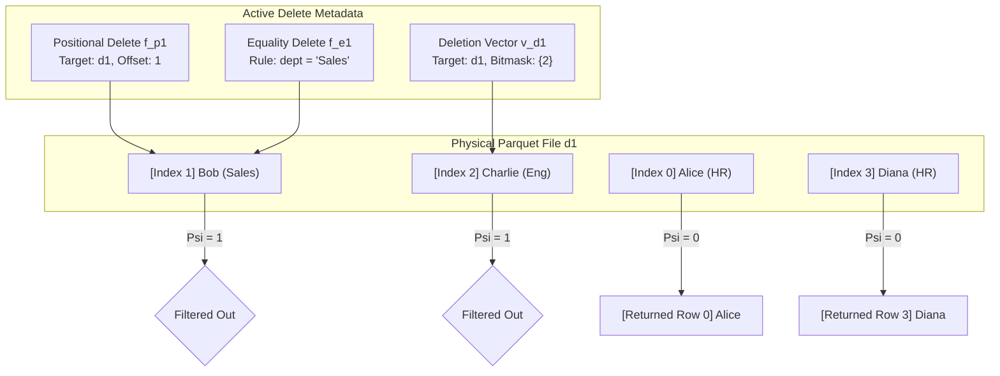
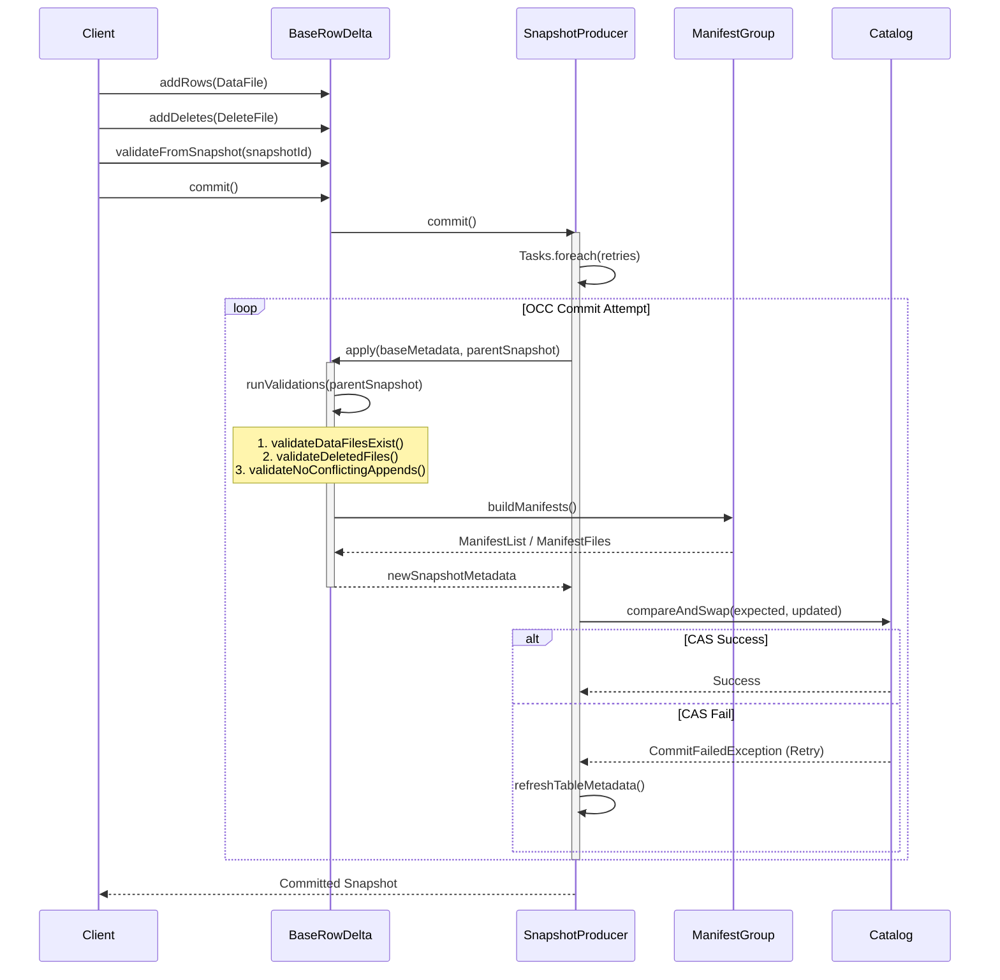
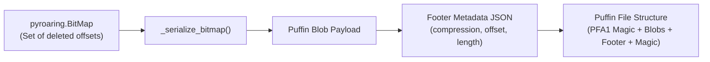
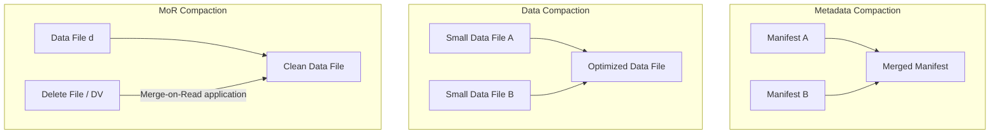
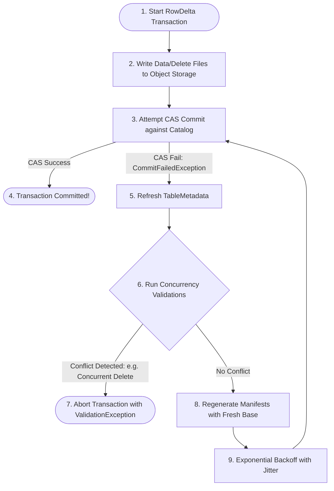
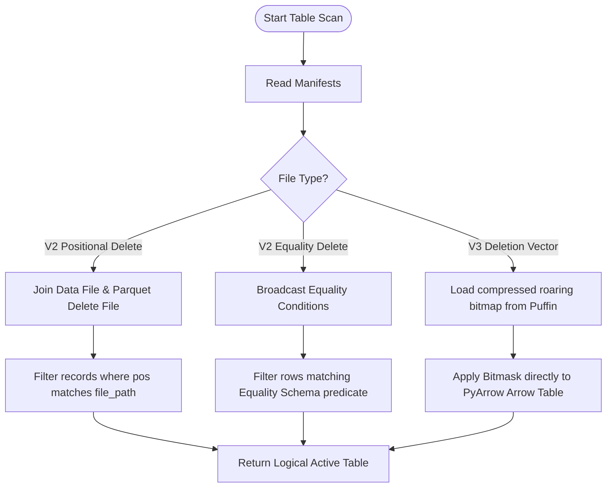
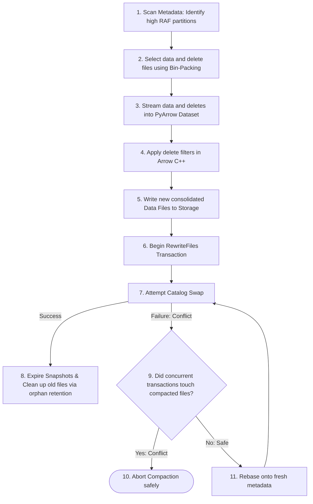

# Rigorous Architectural Analysis: Merge-on-Read, RowDelta, and Deletion Vectors in Apache Iceberg & PyIceberg

This document provides a rigorous, first-principles mathematical and computer science architectural review of **Merge-on-Read (MoR)**, **RowDelta** commits, and **Deletion Vectors (DVs)**. It traces the design paradigms from physical storage limits to the Java implementation (`/iceberg/`), maps out the potential scope for V2 and V3 spec compatibility in PyIceberg (`/iceberg-python/`), and defines the structural mechanics for PyIceberg compaction engines.

Every mathematical formula and theoretical concept in this document is accompanied by concrete, visual data examples (tables, rows, and files) along with structured "Concept #" and "Plain English" translation mappings to make the engineering implications immediately intuitive.

---

## 1. Theoretical Foundations: Mathematical Formalism of Table Mutations

To construct a correct system design, we must define the state space and operations of an Iceberg table from mathematical axioms rather than empirical database constructs.

### 1.1 The Table as a State Machine
An Iceberg table $T$ is an immutable sequence of snapshot states:
$$T = \langle S_0, S_1, S_2, \dots, S_n \rangle$$

Each snapshot $S_k$ represents a logically consistent version of the table at transaction time $t_k$, defined as a 4-tuple:
$$S_k = (D_k, F_{e, k}, F_{p, k}, V_{d, k})$$

Where:
*   $D_k = \{d_1, d_2, \dots\}$ is the set of active **Data Files** (Parquet/ORC).
*   $F_{e, k} = \{f_{e, 1}, f_{e, 2}, \dots\}$ is the set of **Equality Delete Files**.
*   $F_{p, k} = \{f_{p, 1}, f_{p, 2}, \dots\}$ is the set of **Positional Delete Files**.
*   $V_{d, k} = \{v_{d, 1}, v_{d, 2}, \dots\}$ is the set of **Deletion Vectors** (Roaring Bitmaps stored in Puffin).

### 💡 Concept Mapping & Plain English Explanations (Table State)
| Variable / Symbol | Concept Name | Plain English Translation |
| :---: | :--- | :--- |
| **$T$** | **Concept 1**: The Table History | A timeline or movie reel of all snapshots from the birth of the table to the latest committed change. |
| **$S_k$** | **Concept 2**: The Current State Snapshot | A single snapshot frame at version $k$. It acts as a manifest list pointing to all files active at that point in time. |
| **$D_k$** | **Concept 3**: Active Data Files | The physical Parquet files containing the actual table records you want to query. |
| **$F_{e, k}$** | **Concept 4**: Equality Delete Files | Dynamic rules like "delete all rows where `dept = 'HR'`". They wipe out rows on-the-fly when reading the table. |
| **$F_{p, k}$** | **Concept 5**: Positional Delete Files | Physical logs that list exact file paths and row line numbers (offsets) of deleted records. |
| **$V_{d, k}$** | **Concept 6**: Deletion Vectors | High-performance Roaring Bitmaps that track exactly which row indexes inside a data file are deleted. |

#### 📊 Visual Example: Snapshot Evolution Timeline
Let's see how the table state actually changes across commits. Here is a timeline table tracking snapshots as they are created in the catalog:

| Snapshot State | Catalog Version | Active Data Files ($D_k$) | Equality Deletes ($F_{e,k}$) | Positional Deletes ($F_{p,k}$) | Deletion Vectors ($V_{d,k}$) | Logical Row Count |
| :--- | :--- | :--- | :--- | :--- | :--- | :--- |
| **$S_0$** | Initial Table | `[data-1.parquet]` | `[]` | `[]` | `[]` | 1,000 |
| **$S_1$** | Row Added & Deleted | `[data-1.parquet, data-2.parquet]` | `[]` | `[delete-1-pos.parquet]` | `[]` | 1,190 (100 added, 10 deleted) |
| **$S_2$** | DV Applied | `[data-1.parquet, data-2.parquet]` | `[]` | `[delete-1-pos.parquet]` | `[delete-2-dv.puffin]` | 1,185 (5 deleted via DV) |

Here is how these snapshot tuples look mathematically:
*   $S_0 = (\{data\_1\}, \emptyset, \emptyset, \emptyset)$
*   $S_1 = (\{data\_1, data\_2\}, \emptyset, \{delete\_1\_pos\}, \emptyset)$
*   $S_2 = (\{data\_1, data\_2\}, \emptyset, \{delete\_1\_pos\}, \{delete\_2\_dv\})$

---

### 1.2 The Logical Row Projection Operator
Let $d \in D_k$ be a data file containing an ordered sequence of physical records. Let $I_d = [0, |d| - 1] \subset \mathbb{N}_0$ be the index space of the row offsets within $d$. We define the physical record mapping as:
$$\text{Record}_d: I_d \to \text{Row}$$

In a pure read-optimized (Copy-on-Write) state, all physical records are logical records. In a write-optimized (Merge-on-Read) state, the active logical row set of data file $d$ under snapshot $S_k$, denoted as $\text{ActiveRows}(d, S_k)$, is the projection of physical records whose indexes do not belong to the set of deleted indexes:
$$\text{ActiveRows}(d, S_k) = \{ \text{Record}_d(i) \mid i \in I_d \land \Psi(d, i, S_k) = 0 \}$$

The deletion indicator function $\Psi(d, i, S_k) \in \{0, 1\}$ is defined as:
$$\Psi(d, i, S_k) = \mathbb{I} \left[ i \in \text{PosDeletes}(d) \lor i \in \text{DVDeletes}(d) \lor \bigvee_{f_e \in F_{e, k}} \text{MatchesEquality}(f_e, \text{Record}_d(i)) \right]$$

Where:
*   $\mathbb{I}[P]$ is the indicator function (returns 1 if predicate $P$ is true, 0 otherwise).
*   $\text{PosDeletes}(d) = \{ pos \mid \exists f_p \in F_{p, k} \text{ s.t. } (f_p.\text{path} = d.\text{path} \land f_p.\text{pos} = pos) \}$.
*   $\text{DVDeletes}(d) = \{ pos \mid pos \in B_d \}$ where $B_d$ is the roaring bitmap serialized in $V_{d, k}$ associated with data file $d$.
*   $\text{MatchesEquality}(f_e, r) = \mathbb{I} [ \Pi_{A}(r) = \Pi_{A}(r_{f_e}) ]$ where $A$ is the set of equality field IDs defined by the delete file schema, and $\Pi$ is the projection operator.

### 💡 Concept Mapping & Plain English Explanations (Row Resolution)
| Variable / Symbol | Concept Name | Plain English Translation |
| :---: | :--- | :--- |
| **$\text{Record}_d(i)$** | **Concept 7**: Row Offset Selector | A function that points to a specific physical line number (index $i$) in a Parquet file to fetch its fields. |
| **$I_d$** | **Concept 8**: Index Range (Zero-based space) | The zero-based array of row offsets in data file $d$, spanning from `0` to the last record index (`length - 1`). |
| **$\text{ActiveRows}(d, S_k)$** | **Concept 9**: Active Logical Rows | The final set of rows that are actually returned to the client after filtering out all deleted records. |
| **$\Psi(d, i, S_k)$** | **Concept 10**: Deletion Indicator Flag | A virtual checkbox (0 or 1) for every physical row. If it is 1, the row is deleted and skipped; if 0, the row is active and kept. |
| **$\text{PosDeletes}(d)$** | **Concept 11**: Target Positional Indexes | A lookup list of exact row positions in data file $d$ marked for deletion by active positional delete files. |
| **$\text{DVDeletes}(d)$** | **Concept 12**: Target Deletion Vector Offsets | A bitset lookup identifying which row offsets are marked as deleted in the roaring bitmap for data file $d$. |
| **$\text{MatchesEquality}(f_e, r)$** | **Concept 13**: Dynamic Predicate Matcher | A check to see if a record's values match an equality delete rule (e.g., matching a specified ID or department). |

#### 📊 Visual Example: Resolving Logical Active Rows
Let's trace exactly how a query engine reads a physical Parquet data file `d1` and filters out deleted records under Snapshot $S_1$.

##### 1. Physical Data File (`d1`) on Disk
| Row Index ($i$) | `id` (INT) | `name` (VARCHAR) | `dept` (VARCHAR) |
|---|---|---|---|
| **0** | 1 | "Alice" | "HR" |
| **1** | 2 | "Bob" | "Sales" |
| **2** | 3 | "Charlie" | "Eng" |
| **3** | 4 | "Diana" | "HR" |

##### 2. Active Delete Files in Snapshot $S_1$
*   **Positional Delete ($f_{p, 1}$)**: Contains target row `(path="s3://bucket/d1.parquet", pos=1)`.
*   **Deletion Vector ($v_{d, 1}$)**: Roaring Bitmap contains element `{2}`.
*   **Equality Delete ($f_{e, 1}$)**: Specifies delete rule `dept = "Sales"`.

##### 3. Bitwise Evaluation Table of $\Psi(d_1, i, S_1)$
Let's see the step-by-step indicator evaluation for every single row offset:

| Row Index ($i$) | Physical Data Record | PosDelete? ($i \in \{1\}$) | DVDelete? ($i \in \{2\}$) | Equality Match? (`dept == "Sales"`) | Indicator Value $\Psi$ | Action |
| :---: | :--- | :---: | :---: | :---: | :---: | :--- |
| **0** | `Row(id=1, name="Alice", dept="HR")` | 0 (False) | 0 (False) | 0 (False) | **0** | **Retained (Active)** |
| **1** | `Row(id=2, name="Bob", dept="Sales")` | 1 (True) | 0 (False) | 1 (True) | **1** | **Dropped (Deleted)** |
| **2** | `Row(id=3, name="Charlie", dept="Eng")` | 0 (False) | 1 (True) | 0 (False) | **1** | **Dropped (Deleted)** |
| **3** | `Row(id=4, name="Diana", dept="HR")` | 0 (False) | 0 (False) | 0 (False) | **0** | **Retained (Active)** |

##### 4. Resulting Logical Active Row Set
$$\text{ActiveRows}(d_1, S_1) = \{ \text{Row}(id=1, name="Alice", dept="HR"), \text{Row}(id=4, name="Diana", dept="HR") \}$$



---

### 1.3 Write Amplification (WAF) vs. Read Amplification (RAF)
Let $D_{\text{target}} \subseteq D_k$ be the set of data files containing records targeted for mutation (updates/deletes). Let $R_{\text{mut}}$ be the subset of targeted records, and $R_{\text{total}}$ be the total records in $D_{\text{target}}$.

#### Copy-on-Write (CoW)
In Copy-on-Write, a mutation requires rewriting the entire data files containing the targeted records.
*   **Write Amplification Factor (WAF):**
    $$\text{WAF}_{\text{CoW}} = \frac{\sum_{d \in D_{\text{target}}} \text{SizeOf}(d)}{\text{SizeOf}(R_{\text{mut}})} \approx \frac{\text{SizeOf}(R_{\text{total}})}{\text{SizeOf}(R_{\text{mut}})}$$
*   **Read Amplification Factor (RAF):**
    $$\text{RAF}_{\text{CoW}} = 1.0$$

#### Merge-on-Read (MoR)
In Merge-on-Read, mutations are appended as delete metadata, leaving original files unchanged.
*   **Write Amplification Factor (WAF):**
    $$\text{WAF}_{\text{MoR}} = \frac{\text{SizeOf}(F_{\text{del}})}{\text{SizeOf}(R_{\text{mut}})} \approx O(1)$$
*   **Read Amplification Factor (RAF):**
    $$\text{RAF}_{\text{MoR}} = \frac{\sum_{d \in D} \text{I/O}(d) + \sum_{f \in F_{\text{del}}} \text{I/O}(f)}{\sum_{d \in D} \text{I/O}(d)} > 1.0$$

### 💡 Concept Mapping & Plain English Explanations (WAF & RAF)
| Variable / Symbol | Concept Name | Plain English Translation |
| :---: | :--- | :--- |
| **$D_{\text{target}}$** | **Concept 14**: Mutation Target Files | The physical data files that currently contain the rows we are trying to update or delete. |
| **$R_{\text{mut}}$** | **Concept 15**: Mutated Rows | The set of rows we want to delete or replace. |
| **$R_{\text{total}}$** | **Concept 16**: Target File Row Count | The total number of rows stored in the targeted data files. |
| **$\text{WAF}_{\text{CoW}}$ / $\text{WAF}_{\text{MoR}}$** | **Concept 17**: Write Amplification Factor | The ratio of bytes physically written to disk versus logical bytes changed. Higher means more disk wear and slower writes. |
| **$\text{RAF}_{\text{CoW}}$ / $\text{RAF}_{\text{MoR}}$** | **Concept 18**: Read Amplification Factor | The ratio of bytes physically scanned versus logical data returned. Higher means slower queries and more cloud scan costs. |

#### 📊 Visual Example: Operational Data Flows
Let's see what happens step-by-step when you update a single 100-byte row in a 100 MB data file (which contains 1,000,000 rows):

```
=== Scenario: Update 1 Row (100 Bytes) inside 100 MB File ===

[Copy-on-Write Operational Flow]
1. Read 100 MB data file from Object Storage.
2. Search and locate the target record.
3. Modify the record in CPU memory.
4. Write a NEW 100 MB data file to Object Storage.
5. Swap file pointer in Metadata.
   Total Data Transferred: Read 100 MB + Write 100 MB = 200 MB
   WAF = 100,000,000 Bytes / 100 Bytes = 1,000,000x

[Merge-on-Read Operational Flow]
1. Locate target record's position (e.g. row index 500,000).
2. Write a positional delete file containing "row index 500,000" (size ~10 KB).
3. Swap metadata pointers.
   Total Data Transferred: Write 10 KB = 10,240 Bytes
   WAF = 10,240 Bytes / 100 Bytes = 102.4x
```

##### 📊 WAF vs. RAF Numerical Trade-off Matrix
| Metric | Copy-on-Write (CoW) | Merge-on-Read (MoR) | Visual Explanation |
| :--- | :--- | :--- | :--- |
| **Write Work (Bytes Written)** | **100,000,000 B** (100 MB) | **10,240 B** (10 KB) | CoW writes a whole new file; MoR only writes a tiny log. |
| **Write Amplification (WAF)** | **1,000,000** | **102.4** | CoW WAF is direct function of file size. MoR is near constant. |
| **Read Work (Bytes Read)** | **100,000,000 B** (100 MB) | **100,010,240 B** (100 MB + 10 KB) | MoR must load the original file *and* match all delete files. |
| **Read Amplification (RAF)** | **1.0** | **1.0001** | RAF grows for MoR as delete logs pile up over time. |

---

### 1.4 Physical Limits & Shannon Entropy Compaction of Deletion Vectors
To minimize transaction latency and throughput bounds dictated by the speed of light $c$ in fiber and network round-trip time (RTT), we must minimize the bits transferred.

A standard Positional Delete file (Parquet) stores deleted offsets as explicit 64-bit integers (`Int64`). If there are $M$ deleted offsets in a file of $N$ rows, the uncompressed space required to store these deletes is:
$$H_{\text{raw}} = M \times 64 \text{ bits}$$

A Deletion Vector stores these offsets as a **Roaring Bitmap**. Under Shannon's information theory, the minimum average number of bits required to represent an offset in a subset of size $M$ chosen from $N$ elements is bounded by the entropy:
$$H_{\text{opt}} \approx \log_2 \binom{N}{M}$$

Roaring Bitmaps pack these offsets into $2^{16}$ (65,536) row-chunk containers:
*   **Array Container**: If $M_{\text{chunk}} < 4096$, stores sorted 16-bit integers ($16 \text{ bits/offset}$).
*   **Bitmap Container**: If $M_{\text{chunk}} \ge 4096$, stores a bit array of $2^{16}$ bits ($65536 \text{ bits}$ total, yielding $\le 16 \text{ bits/offset}$).
*   **Run-Length Encoding (RLE) Container**: If deletions are contiguous (e.g., dropping a whole batch), stores pairs of `(start_offset, run_length)` as 16-bit integers ($32 \text{ bits/run}$).

### 💡 Concept Mapping & Plain English Explanations (Storage & Entropy)
| Variable / Symbol | Concept Name | Plain English Translation |
| :---: | :--- | :--- |
| **$N$** | **Concept 19**: Total Rows in File | The absolute physical row count or storage capacity of a single data file. |
| **$M$** | **Concept 20**: Total Deleted Rows in File | The exact number of rows in the data file that have been deleted. |
| **$H_{\text{raw}}$** | **Concept 21**: Raw Positional Cost | The total bits needed to write deletions if we store every single offset as a full 64-bit integer. |
| **$H_{\text{opt}}$** | **Concept 22**: Shannon Information Limit | The theoretical minimum bits required to record which rows are deleted, based on information theory. |

#### 📊 Visual Example: Storage Footprint of Delete Formats
Assume a Parquet data file contains **100,000 rows**. We delete **5,000 rows** under two different patterns.

##### Pattern A: Sparse Deletions (Random individual rows deleted throughout the file)
```
Target offsets to delete: [12, 85, 234, 1004, 1005, 54930, ...]
```
*   **Positional Delete File (Parquet Int64)**:
    $$5,000 \times 64 \text{ bits} = \mathbf{320,000 \text{ bits}} \approx 40 \text{ KB}$$
*   **Deletion Vector (Roaring Bitmap - Array Container)**:
    $$5,000 \times 16 \text{ bits} = \mathbf{80,000 \text{ bits}} \approx 10 \text{ KB}$$
    *(Save 4x space)*

##### Pattern B: Bulk Deletions (Deletes occur in contiguous blocks, e.g., rows 10,000 to 14,999)
```
Target offsets to delete: [10000, 10001, 10002, ..., 14999] (1 contiguous run of 5,000 rows)
```
*   **Positional Delete File (Parquet Int64)**:
    $$5,000 \times 64 \text{ bits} = \mathbf{320,000 \text{ bits}} \approx 40 \text{ KB}$$
*   **Deletion Vector (Roaring Bitmap - RLE Container)**:
    Stores only the boundary: `(start=10000, run_length=5000)`.
    $$1 \text{ run} \times 32 \text{ bits} = \mathbf{32 \text{ bits}} \approx 4 \text{ Bytes}$$
    *(Save 10,000x space!)*

##### 📊 Comparative Disk-Layout Mapping Table
| Delete Pattern | Storage Format | Physical disk layout | Size on Disk (Bits) |
|---|---|---|---|
| **Sparse** | Positional Parquet | `[0x0000000C, 0x00000055, 0x000000EA, ...]` (Array of 64-bit ints) | 320,000 |
| **Sparse** | Roaring Array | `[0x000C, 0x0055, 0x00EA, ...]` (Array of 16-bit ints) | 80,000 |
| **Dense** | Roaring Bitmap | `010000001000000...` (Bit position is offset index) | 65,536 |
| **Bulk** | Roaring RLE | `[0x2710 (Start), 0x1388 (Length)]` | 32 |

---

## 2. The Java Iceberg Engine: Under the Hood of `RowDelta`

To understand how PyIceberg must evolve, we must dissect the reference implementation of `RowDelta` within `/iceberg/` (Java).

### 2.1 The Commit Pipeline & `RowDelta` Core
In Java Iceberg, `RowDelta` extends `SnapshotProducer<RowDelta>` and is implemented by `BaseRowDelta`. It commits a logical delta of appended data files and added delete files in a single transaction.



---

### 2.2 Deep Dive: Concurrency Validation Rules
The core safety of the `RowDelta` commit path lies in the validation operations run inside `BaseRowDelta.runValidations()`. These validations prevent write anomalies under various isolation levels.

### 💡 Concept Mapping & Plain English Explanations (Concurrency Validations)
| Variable / Symbol | Concept Name | Plain English Translation |
| :---: | :--- | :--- |
| **$F_{p, \text{added}}$** | **Concept 23**: Intended New Positional Deletes | The new positional delete entries we are trying to write in our current transaction. |
| **$D_{\text{current}}$** | **Concept 24**: Active Catalog Data Files | The set of data files currently registered as active in the catalog metadata. |
| **$D_{\text{deleted}}$ / $F_{\text{deleted}}$** | **Concept 25**: Files We Are Deleting | Files our transaction is trying to remove from metadata (like during a compaction cleanup). |
| **$D_{\text{removed\_concurrently}}$ / $F_{\text{removed\_concurrently}}$** | **Concept 26**: Concurrently Deleted Files | Files deleted by other transactions that committed while our transaction was still running. |
| **$\text{FilesAdded}(S_{\text{start}} \to S_{\text{current}})$** | **Concept 27**: Concurrently Appended Files | Brand-new data files written to the catalog while our transaction was active. |
| **$D_{\text{conflict}}$** | **Concept 28**: Conflicting Append Scan | Files added concurrently that contain rows that should have been deleted by our transaction's filters. |
| **$V_{\text{added}}$** | **Concept 29**: Newly Written Deletion Vectors | The fresh deletion vector bitmaps we are trying to commit in our transaction. |

---

#### 1. `validateDataFilesExist`
*   **Mathematical Assert**:
    $$\forall f_p \in F_{p, \text{added}}, \text{TargetDataFile}(f_p) \in D_{\text{current}}$$

##### 📊 Visual Conflict Timeline
Suppose a user schedules a row delete on a file while another concurrent transaction drops the parent partition:

| Time Step | Transaction A (Your Update Task) | Transaction B (Concurrent Drop Partition) | Catalog State (Metadata) |
|---|---|---|---|
| **$t_1$** | Starts update on `file_A.parquet` at snapshot $S_1$ | | Active Files: `[file_A.parquet]` |
| **$t_2$** | Writes PosDelete targeting `file_A.parquet` | | Active Files: `[file_A.parquet]` |
| **$t_3$** | | Commits DROP partition (deletes `file_A`) | Active Files: `[]` (Snapshot $S_2$) |
| **$t_4$** | Attempts commit of RowDelta | | Current Catalog: $S_2$ |

##### Concurrency Assert Resolution:
*   $\text{TargetDataFile}(f_p) = \text{"file\_A.parquet"}$
*   Is $\text{"file\_A.parquet"} \in D_{\text{current}}$? (Evaluate: $\text{"file\_A.parquet"} \in \{\}$) $\to$ **False!**
*   **Result**: The transaction throws `ValidationException` and safely aborts. This prevents orphans or dangling delete references.

---

#### 2. `validateDeletedFiles`
*   **Mathematical Assert**:
    $$(D_{\text{deleted}} \cup F_{\text{deleted}}) \cap (D_{\text{removed\_concurrently}} \cup F_{\text{removed\_concurrently}}) = \emptyset$$

##### 📊 Visual Conflict Timeline
Two parallel processes attempt to delete the same data file:

| Time Step | Transaction A (Your File Compactor) | Transaction B (Concurrent User Session) | Catalog State (Metadata) |
|---|---|---|---|
| **$t_1$** | Reads `file_A.parquet` at snapshot $S_1$ | Reads `file_A.parquet` at snapshot $S_1$ | Active Files: `[file_A.parquet]` |
| **$t_2$** | Marks `file_A.parquet` as deleted | | Active Files: `[file_A.parquet]` |
| **$t_3$** | | Commits delete of `file_A.parquet` | Active Files: `[]` (Snapshot $S_2$) |
| **$t_4$** | Attempts to commit delete manifest | | Current Catalog: $S_2$ |

##### Concurrency Assert Resolution:
*   $D_{\text{deleted}} = \{\text{"file\_A.parquet"}\}$
*   $D_{\text{removed\_concurrently}} = \{\text{"file\_A.parquet"}\}$
*   Evaluate intersection: $\{\text{"file\_A.parquet"}\} \cap \{\text{"file\_A.parquet"}\} = \{\text{"file\_A.parquet"}\} \neq \emptyset$.
*   **Result**: The transaction throws `ValidationException` and aborts, preventing concurrent logical double-deletes.

---

#### 3. `validateNoConflictingAppends`
*   **Mathematical Assert (SERIALIZABLE)**:
    $$\text{FilesAdded}(S_{\text{start}} \to S_{\text{current}}) \cap D_{\text{conflict}} = \emptyset$$

##### 📊 Visual Conflict Timeline
An equality delete rule is registered while a concurrent process appends new matching rows:

| Time Step | Transaction A (Equality Delete Job) | Transaction B (Concurrent Row Appender) | Catalog State (Metadata) |
|---|---|---|---|
| **$t_1$** | Starts transaction at $S_1$. Scan query: `status = 'inactive'`. | | Active Files: `[file_A.parquet]` |
| **$t_2$** | Writes Equality Delete: `status = 'inactive'` | | Active Files: `[file_A.parquet]` |
| **$t_3$** | | Commits new row file: `file_B.parquet` | Active Files: `[file_A.parquet, file_B.parquet]` ($S_2$) |
| **$t_4$** | Attempts commit of delete rule | | Current Catalog: $S_2$ |

##### Concurrency Assert Resolution:
*   $\text{FilesAdded}(S_1 \to S_2) = \{\text{"file\_B.parquet"}\}$
*   $D_{\text{conflict}}$ (Files matching rule `status = 'inactive'`) = $\{\text{"file\_B.parquet"}\}$
*   Evaluate intersection: $\{\text{"file\_B.parquet"}\} \cap \{\text{"file\_B.parquet"}\} \to \mathbf{\{\text{"file\_B.parquet"}\}} \neq \emptyset$.
*   **Result**: The transaction aborts with `ValidationException`. This prevents transaction serializability failures where newly appended rows escape a concurrent delete sweep.

---

#### 4. `validateAddedDVs` (V3 Specific)
*   **Mathematical Assert**:
    $$\forall v \in V_{\text{added}}, \text{TargetDataFile}(v) \notin \{ d \in D_{\text{removed\_concurrently}} \}$$

##### 📊 Visual Conflict Timeline
A deletion vector is computed on a file that is concurrently rewritten by compaction:

| Time Step | Transaction A (Client Row Update) | Transaction B (Background Data Compactor) | Catalog State (Metadata) |
|---|---|---|---|
| **$t_1$** | Scans `file_A.parquet` at snapshot $S_1$ | Scans `file_A` and `file_B` at $S_1$ | Active: `[file_A, file_B]` |
| **$t_2$** | Writes Deletion Vector targeting `file_A.parquet` | | Active: `[file_A, file_B]` |
| **$t_3$** | | Compacts `file_A` & `file_B` $\to$ `compacted_AB.parquet` | Active: `[compacted_AB]` (Snapshot $S_2$) |
| **$t_4$** | Attempts commit of DV | | Current Catalog: $S_2$ |

##### Concurrency Assert Resolution:
*   $\text{TargetDataFile}(v) = \text{"file\_A.parquet"}$
*   $D_{\text{removed\_concurrently}} = \{\text{"file\_A.parquet"}, \text{"file\_B.parquet"}\}$
*   Evaluate assert: Is $\text{"file\_A.parquet"} \in \{\text{"file\_A.parquet"}, \text{"file\_B.parquet"}\}$? $\to$ **True!**
*   **Result**: The transaction throws `ValidationException` and aborts. This prevents applying bit offsets to a file that no longer exists in the active catalog schema.

---

## 3. Evolving PyIceberg Architecture: V2/V3 MoR & RowDelta Roadmap

PyIceberg is currently moving from a read-heavy library to an active write-path client. The implementation of Merge-on-Read writes is one of the most critical phases of this evolution.

### 3.1 Current Capabilities vs. Planned State
The following matrix shows the current state of PyIceberg regarding MoR:

| Spec Version | Operation Type | PyIceberg Status | Mechanism |
| :--- | :--- | :--- | :--- |
| **V2** | **Read Positional Deletes** | **Supported** | Parses Parquet/ORC delete schemas and filters PyArrow Tables. |
| **V2** | **Read Equality Deletes** | **Partial** | Initial support exists, but complex nested structures have active issues. |
| **V3** | **Read Deletion Vectors** | **Supported** | Decodes Puffin files and uses `pyroaring` bitmaps to mask Arrow Tables. |
| **V2** | **Write Positional Deletes** | **Unsupported** | Lacks `RowDelta` writer and positional delete writer. |
| **V3** | **Write Deletion Vectors** | **Unsupported** | `PuffinWriter` was prototyped in PR #2822 but closed as stale. |

---

### 3.2 Design Strategy for V2 Positional Delete Writes
To add support for writing V2 positional deletes, PyIceberg must introduce a `RowDelta` class extending `_SnapshotProducer` (mirroring the transaction architecture established in PR #3320).

#### Writing "One Positional Delete File per Data File"
In Java, a single positional delete file can span multiple data files. However, as noted by Fokko in Issue #1808:
> "With Java a lot of learnings have been learned, such as producing a positional delete file per data file. This greatly simplifies the implementation for PyIceberg."

##### 📊 Visual Example: File Alignment Strategy
Suppose we need to delete row index `5` in `file_A.parquet` and row index `12` in `file_B.parquet`.

```
[Option 1: Multi-File Target (Complex)]
A single delete file: delete-file-1.parquet
Inside the delete file:
┌──────────────────────┬──────┐
│      file_path       │ pos  │
├──────────────────────┼──────┤
│ s3://.../file_A.pq   │ 5    │
│ s3://.../file_B.pq   │ 12   │
└──────────────────────┴──────┘
* Crucial Requirement: The rows MUST be sorted globally by file_path, then by pos.
```

```
[Option 2: One Delete File per Data File (Recommended & Simple)]
Write two separate, small delete files:
1. delete-A.parquet:
   ┌──────────────────────┬──────┐
   │      file_path       │ pos  │
   ├──────────────────────┼──────┤
   │ s3://.../file_A.pq   │ 5    │
   └──────────────────────┴──────┘
2. delete-B.parquet:
   ┌──────────────────────┬──────┐
   │      file_path       │ pos  │
   ├──────────────────────┼──────┤
   │ s3://.../file_B.pq   │ 12   │
   └──────────────────────┴──────┘
```

Option 2 completely removes the sorting complexity across different files, making the Python execution pipeline extremely simple and less prone to memory overhead during parallel writes.

---

### 3.3 Design Strategy for V3 Deletion Vector Writes
To support V3 writes, PyIceberg must be able to serialize roaring bitmaps into Puffin files. This requires bringing back and completing the `PuffinWriter` from PR #2822.



#### The Puffin File Specification (PFA1)
A Puffin file consists of the following byte sequence:
1.  **Magic Bytes (4 bytes)**: `PFA1` (short for Puffin Fratercula arctica, version 1).
2.  **Blob Payloads**: Serialized roaring bitmaps with the following inner format:
    *   `number_of_bitmaps` (8 bytes, little-endian).
    *   For each bitmap:
        *   `key` (4 bytes, little-endian unsigned integer). Represents the chunk ID.
        *   `serialized_roaring_bitmap` (variable length, using official Roaring format).
3.  **Footer Payload**: A JSON string describing the metadata of the blobs.
4.  **Footer Payload Size (4 bytes)**: Signed little-endian integer.
5.  **Flags (4 bytes)**: Bit 0 indicates if the footer is compressed.
6.  **Magic Bytes (4 bytes)**: `PFA1`.

##### 📊 Visual Example: Puffin File Byte Layout
Below is the physical byte layout of a Puffin file containing a single deletion vector blob targeting `file_A.parquet`:

```
┌────────────────────────────────────────────────────────────────────────┐
│ MAGIC: "PFA1" (4 Bytes)                                                │
├────────────────────────────────────────────────────────────────────────┤
│ BLOB PAYLOAD:                                                          │
│ - Num Bitmaps: 0x0000000000000001 (8 Bytes)                            │
│ - Chunk Key:   0x00000000 (4 Bytes)                                    │
│ - Bitmap:      [Raw Roaring Bitmap binary payload] (Variable Size)     │
├────────────────────────────────────────────────────────────────────────┤
│ FOOTER PAYLOAD:                                                        │
│ {                                                                      │
│   "blobs": [                                                           │
│     {                                                                  │
│       "type": "deletion-vector-v1",                                    │
│       "fields": [1],                                                   │
│       "snapshot-id": 839201948302,                                     │
│       "sequence-number": 5,                                            │
│       "offset": 4,                                                     │
│       "length": 512,                                                   │
│       "properties": {                                                  │
│         "referenced-data-file": "s3://bucket/table/file_A.parquet"    │
│       }                                                                │
│     }                                                                  │
│   ]                                                                    │
│ }                                                                      │
├────────────────────────────────────────────────────────────────────────┤
│ FOOTER SIZE: 0x000001F0 (4 Bytes little-endian, e.g. 496 Bytes)       │
├────────────────────────────────────────────────────────────────────────┤
│ FLAGS: 0x00000000 (4 Bytes, Uncompressed)                              │
├────────────────────────────────────────────────────────────────────────┤
│ MAGIC: "PFA1" (4 Bytes)                                                │
└────────────────────────────────────────────────────────────────────────┘
```

---

## 4. PyIceberg Maintenance & Compaction Engine Design

Compaction is not merely a utility; it is the mathematical process of converting a table snapshot $S_{\text{input}}$ with high entropy and high RAF into a clean snapshot $S_{\text{output}}$ with low RAF, while preserving logical row identity.

$$\text{ActiveRows}(d, S_{\text{input}}) \equiv \text{ActiveRows}(d', S_{\text{output}})$$
$$\text{RAF}(S_{\text{output}}) \ll \text{RAF}(S_{\text{input}})$$

### 4.1 Compaction Types and Mathematical Modeling



#### 1. Data Compaction (Bin-Packing)
Groups small, fragmented data files into optimal-sized files ($128\text{ MB} - 512\text{ MB}$).

##### 📊 Visual Example: Bin-Packing Allocations
Here is how 5 fragmented data files in a partition are packed into 3 optimized physical containers:

| Original Data File | File Size (MB) | Bin Assignment | Resulting Consolidated File | Final Size (MB) |
|---|---|---|---|---|
| `file_1.parquet` | 30 MB | Bin 2 | `compacted_B.parquet` | **120 MB** (Exact match) |
| `file_2.parquet` | 80 MB | Bin 3 | `compacted_C.parquet` | **100 MB** (Under limit) |
| `file_3.parquet` | 110 MB | Bin 1 | `compacted_A.parquet` | **110 MB** (Under limit) |
| `file_4.parquet` | 20 MB | Bin 3 | `compacted_C.parquet` | **100 MB** (Under limit) |
| `file_5.parquet` | 90 MB | Bin 2 | `compacted_B.parquet` | **120 MB** (Exact match) |

---

#### 2. Merge-on-Read Compaction (MoR to CoW)
Consolidates delete files (positional/equality/DVs) and applies them directly to their target data files, producing clean data files.
*   **Axiom**:
    $$d_{\text{new}} = \{ \text{Record}_d(i) \mid i \in [0, |d|-1] \land \Psi(d, i, S_{\text{input}}) = 0 \}$$

##### 📊 Visual Data Transformation Mapping Table
Let's see what happens to the rows physically during a MoR to CoW compaction step:

| Input File (`d1.parquet`) | Connected Delete File (`f_p1`) | Arrow Filter Inversion Mask | Output Compacted File (`d1_clean.parquet`) |
|---|---|---|---|
| `Offset 0: Alice` | | `True` | `Offset 0: Alice` |
| `Offset 1: Bob` | `pos = 1` | `False` | *[REMOVED]* |
| `Offset 2: Charlie` | | `True` | `Offset 1: Charlie` *(Index shifted!)* |
| `Offset 3: Diana` | | `True` | `Offset 2: Diana` *(Index shifted!)* |

---

### 4.2 Speed of Light Compaction in Pure Python (No GIL / JVM Overhead)
PyIceberg can execute these compactions far more efficiently than Java-based engines in local environments because it completely bypasses JVM memory management and GC sweeps. It leverages two architectural pillars:

#### 1. Zero-Copy I/O with PyArrow Dataset
Instead of materializing rows in Python object memory (which would cause massive CPU caching misses and GC pressure), PyIceberg streams data from S3/GCS directly into PyArrow’s C++ memory space.

```python
# Speed-of-Light MoR Compaction Pipeline using PyArrow
import pyarrow.dataset as ds
import pyarrow.compute as pc

def compact_mor_file(io: FileIO, data_file: DataFile, delete_files: list[DataFile]) -> pa.Table:
    # 1. Read deletion offsets using zero-copy Puffin/Parquet parser
    deleted_offsets = pa.chunked_array([])
    for df in delete_files:
        deletes = _read_deletes(io, df) # Returns dict of file_path -> ChunkedArray
        if data_file.file_path in deletes:
            deleted_offsets = deletes[data_file.file_path]
            
    # 2. Build Arrow Dataset scanner for the data file
    with io.new_input(data_file.file_path).open() as f:
        fragment = ds.ParquetFileFormat().make_fragment(f)
        table = ds.Scanner.from_fragment(fragment).to_table()
        
    # 3. Apply Deletion Vector via bitwise inversion in C++
    if len(deleted_offsets) > 0:
        total_rows = len(table)
        full_range = pa.array(range(total_rows))
        
        # Binary search / hash filter matching offsets
        active_mask = pc.invert(pc.is_in(full_range, value_set=deleted_offsets))
        
        # Zero-copy filter operation
        table = table.filter(active_mask)
        
    return table
```

---

## 5. Exhaustive PR Reviewer's Guide for MoR, RowDelta, and Compaction

When reviewing PRs touching these high-sensitivity paths, use this checklist to enforce rigorous software engineering standards and prevent data corruption.

### 5.1 Architectural and Spec Checkpoints
1.  **Spec Version Gating**:
    *   *Rule*: V3 features (Deletion Vectors, Puffin formats, `UnknownType` promotion) **must** actively check `table_metadata.format_version >= 3` and throw clean, actionable `ValidationError`s for V1/V2 tables.
    *   *Check*: Verify the PR does not write DVs to a V2 table or write positional deletes as V1 tables.
2.  **No Jackson Annotations**:
    *   *Rule*: Standard Apache Iceberg rule: *Never use Jackson annotations*. Custom `XxxParser.toJson`/`fromJson` only. JSON keys must use `kebab-case`. Optional fields must only be written when non-null.
    *   *Check*: Ensure no third-party JSON mappings are added to serialization models.
3.  **Strict Package-Private Defaults**:
    *   *Rule*: Keep classes and methods package-private (or internal with `_` prefix in Python) unless there is a clear public integration requirement.
    *   *Check*: Do not expose internal compaction heuristics or custom Puffin writer structures in public APIs.

### 5.2 Threading & Telemetry Safety
1.  **Container Reuse Safety**:
    *   *Rule*: When scanning or planning with parallel iterators, check if the code retains references to manifest entries.
    *   *Check*: Ensure `copyWithoutStats()` or structural copy/cloning is called before appending entries to lists in concurrent blocks.
2.  **Thread-Safe Metrics and Timers**:
    *   *Rule*: Telemetry, scan planning, and retry metrics must be thread-safe.
    *   *Check*: Verify that stats counters or progress bars updated during compaction use thread locks or atomic variables.

### 5.3 Concurrency & Retry Integrity
1.  **Validation Completeness**:
    *   *Rule*: A `RowDelta` commit **must** implement all four core validations (`validateDataFilesExist`, `validateDeletedFiles`, `validateNoConflictingAppends`, `validateAddedDVs` if V3).
    *   *Check*: Verify the PR does not omit `_validate_concurrency()` checks under the assumption that "conflicts are rare".
2.  **Data File Persistence Across Retries**:
    *   *Rule*: If a transaction CAS fails, the data files written during the transaction **must not** be deleted or rewritten on retry. Only the manifests must be regenerated.
    *   *Check*: Check `_refresh_for_retry()` implementation. Verify `_added_data_files` is preserved and not cleared.
3.  **Correct Isolation Level Enforcement**:
    *   *Rule*: Operations must respect the configured isolation levels: `write.delete.isolation-level` and `write.update.isolation-level`.
    *   *Check*: Ensure validations fail immediately with `ValidationException` under `SERIALIZABLE` when any concurrent append overlaps with deleted criteria.

---

## 6. Comprehensive Flow Diagrams

To provide an intuitive mental model, this section visualizes the key runtime flows for MoR, RowDelta, and Compaction.

### 6.1 Life of a `RowDelta` Commit (Retry Loop & Validation)
This diagram traces the execution of a `RowDelta` operation under OCC conflict pressure.



### 6.2 The Read Path: Applying V2 Deletes vs. V3 Deletion Vectors
This diagram maps out how the scan engine resolves logical active records at runtime.



### 6.3 The Compaction Loop (MoR to CoW)
This diagram illustrates the lifecycle of a background compaction task converting Merge-on-Read files into optimized Copy-on-Write style files.



---

## 7. Mathematical and CS Review Checklist for Pull Requests

As a PR reviewer, you must hold code to the following proof-like criteria:

*   **Theorem of Non-Intersection**: Does this code guarantee that a concurrent write cannot write records that skip our deletes under `SERIALIZABLE` isolation?
    *   *Proof in code*: Look for the call to `_validate_no_new_deletes_for_data_files` and `_validate_no_new_delete_files`.
*   **Conservation of Files**: Does a failed commit attempt clean up its orphan files, or does it reuse them on retry?
    *   *Proof in code*: Verify that `_added_data_files` are preserved for reuse, and if the transaction is completely aborted (exhausted retries), a cleanup job is registered to prevent storage leaks.
*   **Spec-Version Invariant**: Does a write operation on a V1/V2 table throw a validation exception if it attempts to produce a Puffin file or Deletion Vector?
    *   *Proof in code*: Verify that the format version check is executed *before* initializing any `PuffinWriter` or V3 metadata updates.
*   **Memory Bound Invariant**: Does this compaction code read the entire Parquet file into Python list memory, or does it stream it using Arrow C++ batches?
    *   *Proof in code*: Reject any PR that uses `.to_pylist()` or loops over individual rows in Python. All filters and projections must happen inside PyArrow C++ or native libraries to guarantee $O(\text{BatchSize})$ memory consumption.
